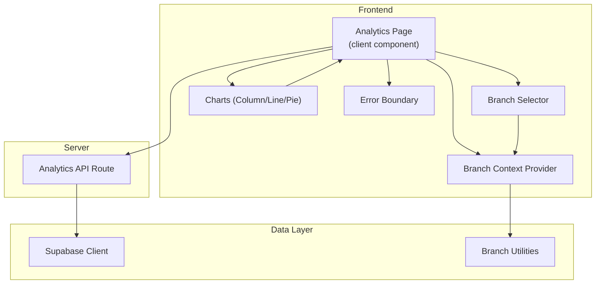
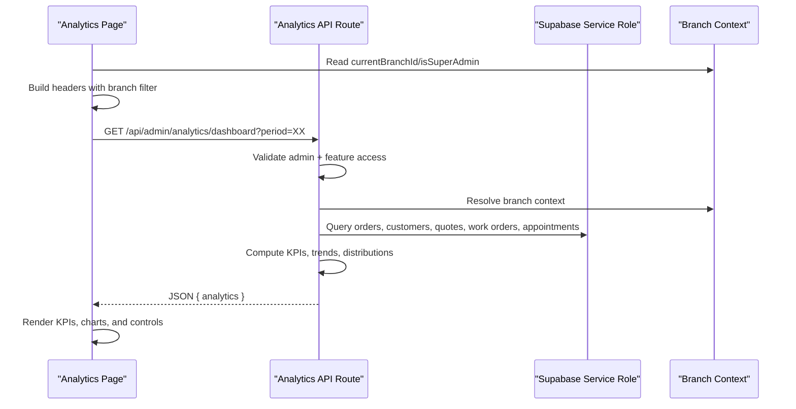
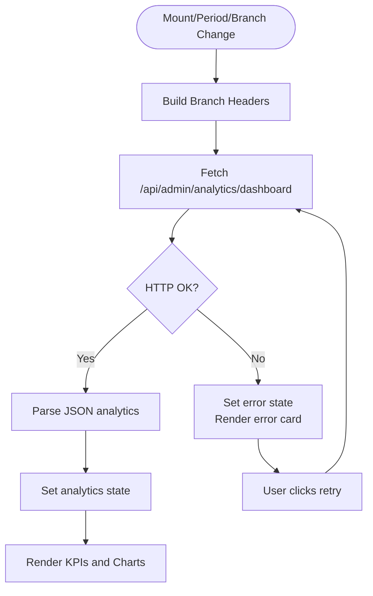
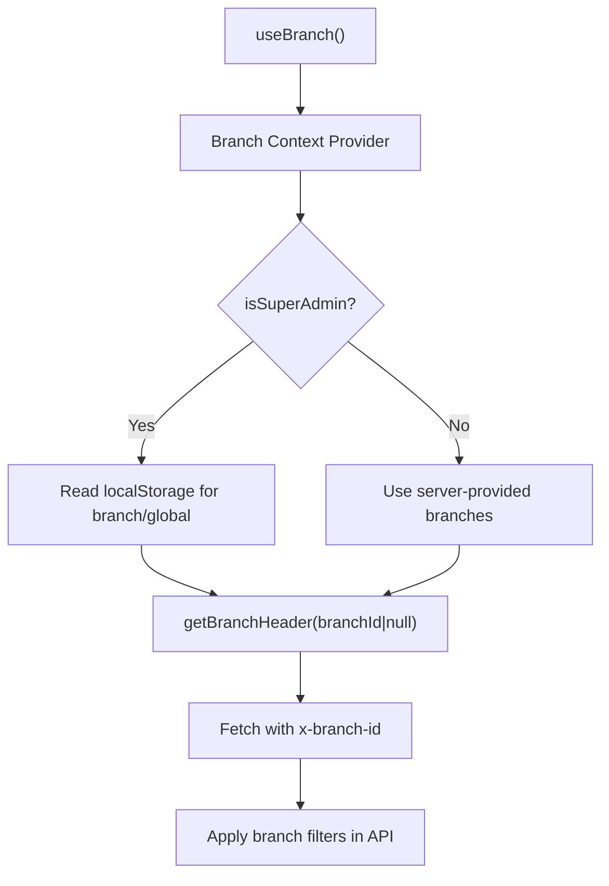
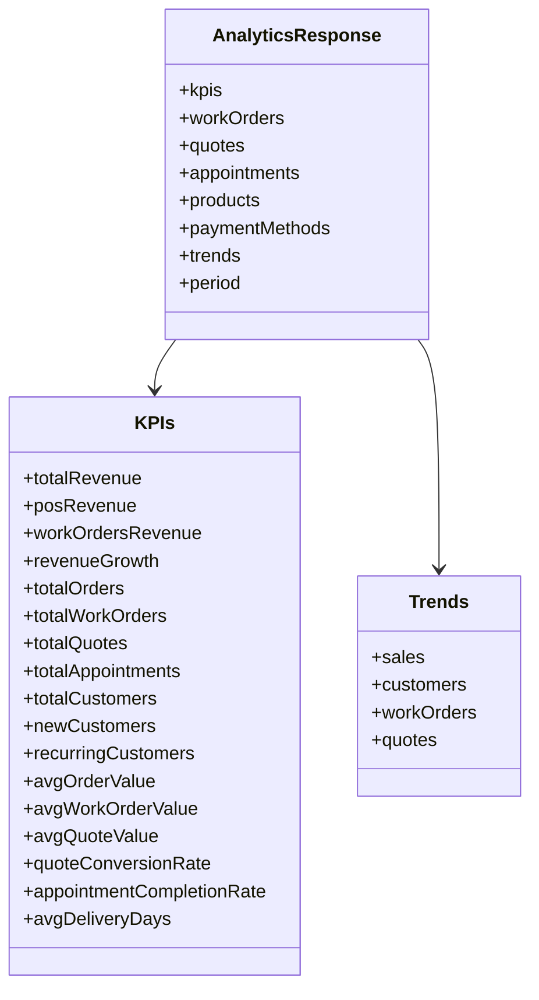
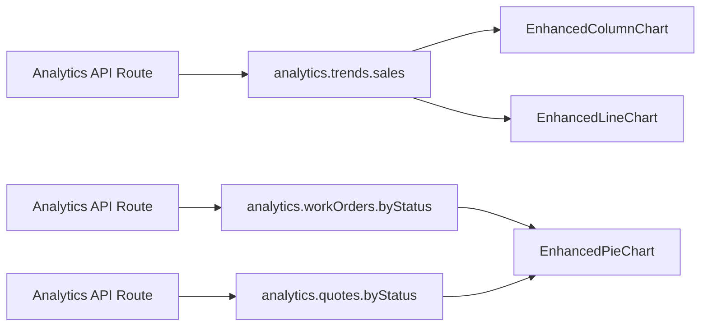
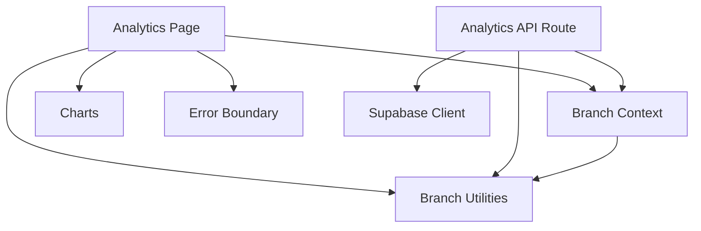

# Real-time Metrics & Updates

<cite>
**Referenced Files in This Document**
- [Analytics Page](file://src/app/admin/analytics/page.tsx)
- [Analytics API Route](file://src/app/api/admin/analytics/dashboard/route.ts)
- [Branch Context](file://src/contexts/BranchContext.tsx)
- [Branch Selector](file://src/components/admin/BranchSelector.tsx)
- [Branch Utilities](file://src/lib/utils/branch.ts)
- [Supabase Client](file://src/lib/supabase.ts)
- [Enhanced Column Chart](file://src/components/admin/charts/EnhancedColumnChart.tsx)
- [Enhanced Line Chart](file://src/components/admin/charts/EnhancedLineChart.tsx)
- [Enhanced Pie Chart](file://src/components/admin/charts/EnhancedPieChart.tsx)
- [Analytics Help Texts](file://src/lib/analytics-help.ts)
- [Error Boundary](file://src/components/ErrorBoundary.tsx)
</cite>

## Table of Contents

1. [Introduction](#introduction)
2. [Project Structure](#project-structure)
3. [Core Components](#core-components)
4. [Architecture Overview](#architecture-overview)
5. [Detailed Component Analysis](#detailed-component-analysis)
6. [Dependency Analysis](#dependency-analysis)
7. [Performance Considerations](#performance-considerations)
8. [Troubleshooting Guide](#troubleshooting-guide)
9. [Conclusion](#conclusion)

## Introduction

This document explains the real-time metrics and update system for the Opttius admin analytics dashboard. It covers dynamic data fetching, branch-specific filtering, multi-tenant isolation, caching strategies, loading and error states, and the integration with Supabase for real-time updates. It also documents the data structures, API response formats, useEffect hooks, branch context integration, and practical patterns for refreshing data and optimizing performance.

## Project Structure

The analytics system spans three layers:

- Frontend page that renders metrics and charts, manages loading/error states, and triggers data refreshes.
- API route that validates permissions, applies branch filters, computes aggregates, and returns structured analytics.
- Shared branch utilities and Supabase client enabling multi-branch and multi-tenant isolation.

**Diagram sources**

- [Analytics Page](file://src/app/admin/analytics/page.tsx#L134-L191)
- [Branch Context](file://src/contexts/BranchContext.tsx#L38-L206)
- [Branch Selector](file://src/components/admin/BranchSelector.tsx#L15-L106)
- [Analytics API Route](file://src/app/api/admin/analytics/dashboard/route.ts#L8-L634)
- [Supabase Client](file://src/lib/supabase.ts#L1-L36)
- [Branch Utilities](file://src/lib/utils/branch.ts#L92-L122)

**Section sources**

- [Analytics Page](file://src/app/admin/analytics/page.tsx#L1-L1165)
- [Branch Context](file://src/contexts/BranchContext.tsx#L1-L216)
- [Branch Selector](file://src/components/admin/BranchSelector.tsx#L1-L107)
- [Analytics API Route](file://src/app/api/admin/analytics/dashboard/route.ts#L1-L635)
- [Supabase Client](file://src/lib/supabase.ts#L1-L36)
- [Branch Utilities](file://src/lib/utils/branch.ts#L1-L123)

## Core Components

- Analytics Page: Fetches and displays KPIs, trends, and distributions; manages loading, error, and refresh states; integrates branch context and branch header for filtering.
- Branch Context: Centralizes branch selection, persistence, and multi-branch logic for super admins and regular admins.
- Branch Selector: UI control to switch branches or global view for super admins.
- Analytics API Route: Validates admin access, checks feature entitlement, applies branch filters, computes aggregates, and returns a normalized analytics payload.
- Charts: Recharts-based components rendering column, line, and pie charts with responsive layouts and tooltips.
- Supabase Client: Provides authenticated client and service role client for secure server-side operations.
- Branch Utilities: Supplies branch header/query param helpers and branch filter logic.
- Error Boundary: Catches frontend errors and provides user-friendly recovery actions.

**Section sources**

- [Analytics Page](file://src/app/admin/analytics/page.tsx#L134-L191)
- [Branch Context](file://src/contexts/BranchContext.tsx#L38-L206)
- [Branch Selector](file://src/components/admin/BranchSelector.tsx#L15-L106)
- [Analytics API Route](file://src/app/api/admin/analytics/dashboard/route.ts#L8-L634)
- [Enhanced Column Chart](file://src/components/admin/charts/EnhancedColumnChart.tsx#L32-L206)
- [Enhanced Line Chart](file://src/components/admin/charts/EnhancedLineChart.tsx#L33-L174)
- [Enhanced Pie Chart](file://src/components/admin/charts/EnhancedPieChart.tsx#L64-L183)
- [Supabase Client](file://src/lib/supabase.ts#L1-L36)
- [Branch Utilities](file://src/lib/utils/branch.ts#L92-L122)
- [Error Boundary](file://src/components/ErrorBoundary.tsx#L89-L110)

## Architecture Overview

The system follows a client-server architecture:

- The client component triggers analytics fetch via a GET request to the analytics API route.
- The API route validates admin privileges, checks feature availability, resolves branch context, and builds a multi-tenant query set.
- The API computes KPIs, distributions, and daily trends, then returns a structured analytics object.
- The client renders charts and KPI cards, supports branch switching, and handles loading and error states.

**Diagram sources**

- [Analytics Page](file://src/app/admin/analytics/page.tsx#L160-L191)
- [Analytics API Route](file://src/app/api/admin/analytics/dashboard/route.ts#L8-L634)
- [Branch Context](file://src/contexts/BranchContext.tsx#L73-L155)
- [Branch Utilities](file://src/lib/utils/branch.ts#L92-L122)

## Detailed Component Analysis

### Analytics Page: Fetch, Loading, Error, and Refresh

- Fetch lifecycle:
  - Uses useEffect to trigger fetch when period or currentBranchId change.
  - Builds headers with branch filter using getBranchHeader.
  - Calls the analytics API route and sets analytics state on success.
  - Manages loading and refreshing flags to disable controls during requests.
- Error handling:
  - Displays a friendly error card with retry action.
  - Integrates Error Boundary for uncaught frontend errors.
- Loading UX:
  - Renders skeleton cards while initial load is in progress.
- Branch integration:
  - Reads currentBranchId and isSuperAdmin from useBranch.
  - Shows BranchSelector for super admins to switch branches or global view.

**Diagram sources**

- [Analytics Page](file://src/app/admin/analytics/page.tsx#L160-L191)
- [Branch Utilities](file://src/lib/utils/branch.ts#L92-L99)

**Section sources**

- [Analytics Page](file://src/app/admin/analytics/page.tsx#L134-L191)
- [Branch Selector](file://src/components/admin/BranchSelector.tsx#L15-L106)
- [Error Boundary](file://src/components/ErrorBoundary.tsx#L89-L110)

### Branch Context and Multi-tenant Filtering

- Branch Context:
  - Persists branch selection in localStorage for super admins.
  - Supports global view ("global") and per-branch views.
  - Optimizes initialization by validating existing selections without server round-trips for super admins.
- Branch Utilities:
  - getBranchHeader injects x-branch-id header for server-side filtering.
  - getBranchFilter encapsulates branch filter logic for reuse.
- Analytics API Route:
  - Applies branch filters to all relevant tables (orders, customers, quotes, work orders, appointments, products).
  - Enforces multi-tenant isolation by scoping queries to branch_id or null for regular admins.

**Diagram sources**

- [Branch Context](file://src/contexts/BranchContext.tsx#L38-L206)
- [Branch Utilities](file://src/lib/utils/branch.ts#L92-L122)
- [Analytics API Route](file://src/app/api/admin/analytics/dashboard/route.ts#L112-L131)

**Section sources**

- [Branch Context](file://src/contexts/BranchContext.tsx#L38-L206)
- [Branch Utilities](file://src/lib/utils/branch.ts#L40-L50)
- [Branch Utilities](file://src/lib/utils/branch.ts#L92-L122)
- [Analytics API Route](file://src/app/api/admin/analytics/dashboard/route.ts#L112-L131)

### Analytics API Route: Data Aggregation and Response Format

- Authentication and authorization:
  - Verifies user session and admin role via RPC.
  - Checks feature entitlement for advanced analytics.
- Period calculation:
  - Computes start/end dates based on period parameter.
- Query building:
  - Queries orders, customers, quotes, work orders, appointments, categories, and order items.
  - Applies branch filters and date ranges.
- Aggregations:
  - Revenue (POS + Work Orders), growth vs previous period.
  - Work orders: totals, pending/completed/cancelled, status distribution.
  - Quotes: totals, acceptance/expiry/conversion, status distribution.
  - Appointments: totals, completion rate, status distribution.
  - Customers: total/new/recurring.
  - Products: totals, low/out-of-stock, top products, category revenue.
  - Payment methods breakdown.
  - Daily trends: sales, customers, work orders, quotes.
- Response shape:
  - analytics.kpis, analytics.workOrders, analytics.quotes, analytics.appointments, analytics.products, analytics.paymentMethods, analytics.trends, analytics.period.

**Diagram sources**

- [Analytics API Route](file://src/app/api/admin/analytics/dashboard/route.ts#L549-L618)

**Section sources**

- [Analytics API Route](file://src/app/api/admin/analytics/dashboard/route.ts#L8-L634)
- [Analytics Help Texts](file://src/lib/analytics-help.ts#L1-L124)

### Charts: Rendering and Formatting

- EnhancedColumnChart: Bar chart with weekly aggregation for long periods, responsive layout, custom tooltip, and summary stats.
- EnhancedLineChart: Line chart with grid toggle, custom tooltip, and summary stats.
- EnhancedPieChart: Pie chart with legend, percentages, and custom tooltip.

**Diagram sources**

- [Analytics API Route](file://src/app/api/admin/analytics/dashboard/route.ts#L607-L618)
- [Enhanced Column Chart](file://src/components/admin/charts/EnhancedColumnChart.tsx#L32-L206)
- [Enhanced Line Chart](file://src/components/admin/charts/EnhancedLineChart.tsx#L33-L174)
- [Enhanced Pie Chart](file://src/components/admin/charts/EnhancedPieChart.tsx#L64-L183)

**Section sources**

- [Enhanced Column Chart](file://src/components/admin/charts/EnhancedColumnChart.tsx#L32-L206)
- [Enhanced Line Chart](file://src/components/admin/charts/EnhancedLineChart.tsx#L33-L174)
- [Enhanced Pie Chart](file://src/components/admin/charts/EnhancedPieChart.tsx#L64-L183)

### Supabase Integration and Real-time Updates

- Supabase Client:
  - Provides authenticated client for browser requests.
  - Exposes service role client for secure server-side operations.
- Real-time updates:
  - The current analytics page does not subscribe to Supabase real-time channels.
  - To enable real-time updates, integrate Supabase channel listeners in the Analytics Page and re-run targeted computations on incoming events.

[No sources needed since this section provides general guidance]

## Dependency Analysis

- Analytics Page depends on:
  - Branch Context for branch state and selection.
  - Branch Utilities for headers and branch filtering.
  - Charts for visualization.
  - Error Boundary for resilience.
- Analytics API Route depends on:
  - Supabase client for authenticated user and service role client for secure queries.
  - Branch utilities for branch context resolution.
  - Feature validation for advanced analytics.

**Diagram sources**

- [Analytics Page](file://src/app/admin/analytics/page.tsx#L134-L191)
- [Branch Context](file://src/contexts/BranchContext.tsx#L38-L206)
- [Branch Utilities](file://src/lib/utils/branch.ts#L92-L122)
- [Analytics API Route](file://src/app/api/admin/analytics/dashboard/route.ts#L8-L634)
- [Supabase Client](file://src/lib/supabase.ts#L1-L36)

**Section sources**

- [Analytics Page](file://src/app/admin/analytics/page.tsx#L134-L191)
- [Branch Context](file://src/contexts/BranchContext.tsx#L38-L206)
- [Branch Utilities](file://src/lib/utils/branch.ts#L92-L122)
- [Analytics API Route](file://src/app/api/admin/analytics/dashboard/route.ts#L8-L634)
- [Supabase Client](file://src/lib/supabase.ts#L1-L36)

## Performance Considerations

- Minimize network requests:
  - Batch queries in the API route using Promise.all to reduce latency.
  - Use branch filters to limit dataset size server-side.
- Client-side optimization:
  - Memoize chart data transformations to avoid unnecessary renders.
  - Aggregate dense time-series data (e.g., weekly bins) to keep charts responsive.
- Caching strategies:
  - Add short-lived caching at the CDN or edge for repeated period/branch combinations.
  - Consider local caching in the browser with staleness policies and manual refresh.
- Pagination and limits:
  - Apply reasonable limits for top products and category revenue to prevent oversized payloads.
- Error boundaries:
  - Wrap heavy chart components to prevent cascading failures.

[No sources needed since this section provides general guidance]

## Troubleshooting Guide

- Unauthorized or missing admin role:
  - Verify user session and admin RPC result in the API route.
- Feature not available:
  - Confirm organization has advanced analytics entitlement before serving data.
- Branch filtering issues:
  - Ensure x-branch-id header matches branchId or is "global".
  - Validate branch context initialization for super admins.
- Empty or sparse data:
  - Adjust period selection; verify branch has activity.
  - Confirm date range calculations and timezone handling.
- Frontend crashes:
  - Use Error Boundary to capture and log errors; provide recovery actions.

**Section sources**

- [Analytics API Route](file://src/app/api/admin/analytics/dashboard/route.ts#L14-L57)
- [Branch Utilities](file://src/lib/utils/branch.ts#L92-L99)
- [Error Boundary](file://src/components/ErrorBoundary.tsx#L89-L110)

## Conclusion

The analytics system combines a robust backend aggregation pipeline with a responsive frontend that respects branch and tenant boundaries. By leveraging branch-aware headers, efficient server-side queries, and reusable chart components, it delivers accurate, up-to-date insights. Extending the system with Supabase real-time subscriptions would further enhance live updates, while continued focus on caching and client-side memoization will improve performance at scale.
