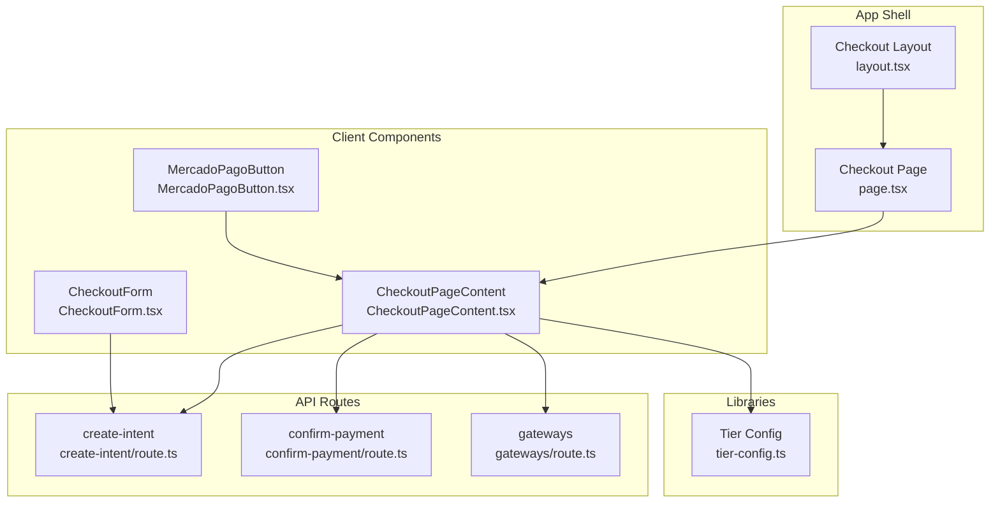
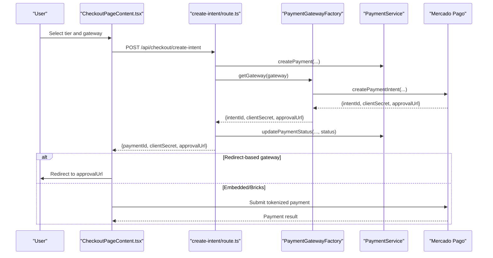
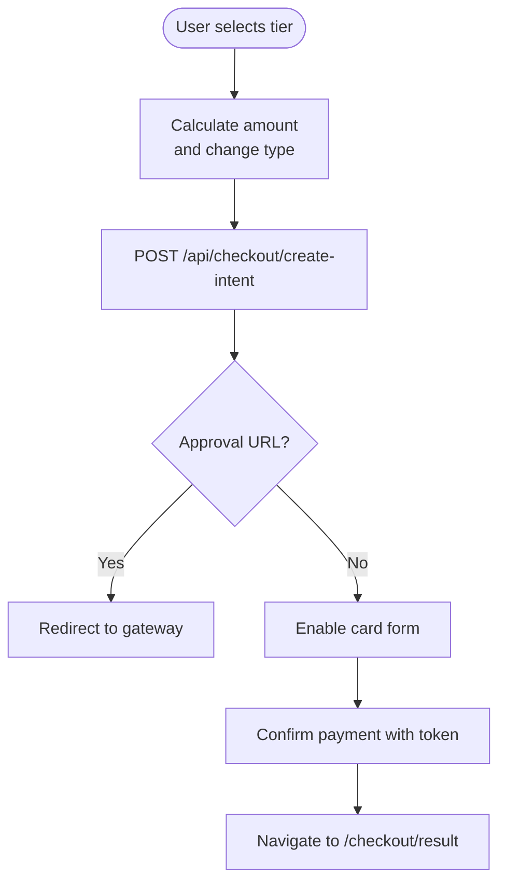
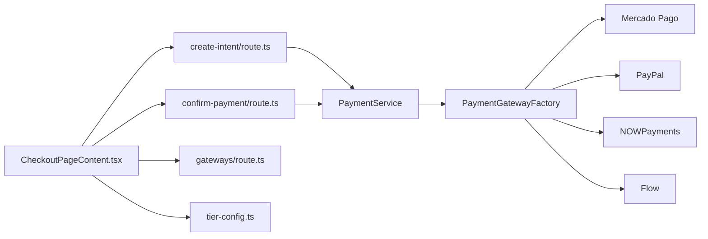

# Online Checkout System

<cite>
**Referenced Files in This Document**
- [page.tsx](file://src/app/checkout/page.tsx)
- [layout.tsx](file://src/app/checkout/layout.tsx)
- [page.tsx](file://src/app/checkout/result/page.tsx)
- [CheckoutPageContent.tsx](file://src/components/checkout/CheckoutPageContent.tsx)
- [CheckoutForm.tsx](file://src/components/checkout/CheckoutForm.tsx)
- [MercadoPagoButton.tsx](file://src/components/checkout/MercadoPagoButton.tsx)
- [create-intent/route.ts](file://src/app/api/checkout/create-intent/route.ts)
- [confirm-payment/route.ts](file://src/app/api/checkout/confirm-payment/route.ts)
- [gateways/route.ts](file://src/app/api/checkout/gateways/route.ts)
- [tier-config.ts](file://src/lib/saas/tier-config.ts)
</cite>

## Table of Contents

1. [Introduction](#introduction)
2. [Project Structure](#project-structure)
3. [Core Components](#core-components)
4. [Architecture Overview](#architecture-overview)
5. [Detailed Component Analysis](#detailed-component-analysis)
6. [Dependency Analysis](#dependency-analysis)
7. [Performance Considerations](#performance-considerations)
8. [Troubleshooting Guide](#troubleshooting-guide)
9. [Conclusion](#conclusion)

## Introduction

This document describes the online checkout system for e-commerce subscription transactions. It covers the checkout page interface, customer information handling, payment processing workflow, and integration with multiple payment gateways. It also documents the subscription tier selection, proration calculations, and post-payment confirmation flow, including redirects and result handling.

## Project Structure

The checkout system is implemented as a Next.js app with dedicated pages and client-side components, backed by API routes for payment intent creation and confirmation. Payment gateway integrations are abstracted behind a factory pattern.

**Diagram sources**

- [layout.tsx](file://src/app/checkout/layout.tsx#L1-L12)
- [page.tsx](file://src/app/checkout/page.tsx#L1-L13)
- [CheckoutPageContent.tsx](file://src/components/checkout/CheckoutPageContent.tsx#L1-L885)
- [CheckoutForm.tsx](file://src/components/checkout/CheckoutForm.tsx#L1-L243)
- [MercadoPagoButton.tsx](file://src/components/checkout/MercadoPagoButton.tsx#L1-L85)
- [create-intent/route.ts](file://src/app/api/checkout/create-intent/route.ts#L1-L260)
- [confirm-payment/route.ts](file://src/app/api/checkout/confirm-payment/route.ts#L1-L232)
- [gateways/route.ts](file://src/app/api/checkout/gateways/route.ts#L1-L26)
- [tier-config.ts](file://src/lib/saas/tier-config.ts#L1-L139)

**Section sources**

- [page.tsx](file://src/app/checkout/page.tsx#L1-L13)
- [layout.tsx](file://src/app/checkout/layout.tsx#L1-L12)

## Core Components

- Checkout page shell and layout: Provides the container and styling for the checkout experience.
- Checkout page content: Orchestrates tier selection, gateway selection, payment intent creation, and confirmation submission.
- Payment form components: Alternative standalone form for generic payments (not used in subscription checkout).
- MercadoPago integration: Initializes the Mercado Pago SDK and renders the wallet brick for card payments.
- API routes: Secure endpoints for creating payment intents, confirming payments, and listing available gateways.
- Tier configuration: Defines pricing and limits per subscription tier.

**Section sources**

- [CheckoutPageContent.tsx](file://src/components/checkout/CheckoutPageContent.tsx#L1-L885)
- [CheckoutForm.tsx](file://src/components/checkout/CheckoutForm.tsx#L1-L243)
- [MercadoPagoButton.tsx](file://src/components/checkout/MercadoPagoButton.tsx#L1-L85)
- [create-intent/route.ts](file://src/app/api/checkout/create-intent/route.ts#L1-L260)
- [confirm-payment/route.ts](file://src/app/api/checkout/confirm-payment/route.ts#L1-L232)
- [gateways/route.ts](file://src/app/api/checkout/gateways/route.ts#L1-L26)
- [tier-config.ts](file://src/lib/saas/tier-config.ts#L1-L139)

## Architecture Overview

The checkout flow integrates client-side UI with server-side APIs and external payment gateways. The client initializes payment methods, creates a payment intent via the backend, and either redirects to a gateway or submits a tokenized payment directly to Mercado Pago.

**Diagram sources**

- [CheckoutPageContent.tsx](file://src/components/checkout/CheckoutPageContent.tsx#L210-L269)
- [create-intent/route.ts](file://src/app/api/checkout/create-intent/route.ts#L132-L235)

## Detailed Component Analysis

### Checkout Page Content

Responsibilities:

- Loads available subscription tiers and current subscription status.
- Initializes Mercado Pago SDK for card payments.
- Calculates prorated amounts for upgrades/downgrades.
- Creates payment intents and handles redirects or embedded payment submission.
- Submits tokenized payments to Mercado Pago and navigates to result page.

Key behaviors:

- Authentication requirement: redirects unauthenticated users to login.
- Gateway selection: loads enabled gateways from the database.
- Amount calculation: computes prorated charges based on current subscription period.
- Payment submission: validates presence of paymentId and payment_method_id before confirming.

**Diagram sources**

- [CheckoutPageContent.tsx](file://src/components/checkout/CheckoutPageContent.tsx#L139-L184)
- [CheckoutPageContent.tsx](file://src/components/checkout/CheckoutPageContent.tsx#L210-L327)
- [create-intent/route.ts](file://src/app/api/checkout/create-intent/route.ts#L170-L235)

**Section sources**

- [CheckoutPageContent.tsx](file://src/components/checkout/CheckoutPageContent.tsx#L65-L360)
- [tier-config.ts](file://src/lib/saas/tier-config.ts#L35-L90)

### Payment Intent Creation API

Responsibilities:

- Validates request payload and user session.
- Normalizes currencies for specific gateways (e.g., NOWPayments USD conversion).
- Creates a payment record and updates its status.
- Delegates gateway-specific intent creation and returns identifiers.

Security and validation:

- Uses rate limiting middleware.
- Requires authenticated user and organization context.
- Zod schema validation for request body.

**Section sources**

- [create-intent/route.ts](file://src/app/api/checkout/create-intent/route.ts#L18-L27)
- [create-intent/route.ts](file://src/app/api/checkout/create-intent/route.ts#L100-L130)
- [create-intent/route.ts](file://src/app/api/checkout/create-intent/route.ts#L132-L235)

### Payment Confirmation API (Mercado Pago)

Responsibilities:

- Confirms a payment using a token from Mercado Pago Bricks.
- Updates payment status and applies success actions to the organization.
- Optionally saves card details for future use.

Constraints:

- Only supports Mercado Pago for token-based payments.
- Requires organization context and payment ownership verification.

**Section sources**

- [confirm-payment/route.ts](file://src/app/api/checkout/confirm-payment/route.ts#L17-L25)
- [confirm-payment/route.ts](file://src/app/api/checkout/confirm-payment/route.ts#L96-L158)
- [confirm-payment/route.ts](file://src/app/api/checkout/confirm-payment/route.ts#L169-L209)

### Available Gateways API

Responsibilities:

- Returns enabled payment gateways ordered for display.
- Supports multiple gateways: Mercado Pago, PayPal, NOWPayments, Flow.

**Section sources**

- [gateways/route.ts](file://src/app/api/checkout/gateways/route.ts#L8-L25)

### Mercado Pago Button Component

Responsibilities:

- Initializes Mercado Pago SDK with environment keys.
- Renders the Wallet brick for card payments.
- Handles initialization errors and loading states.

**Section sources**

- [MercadoPagoButton.tsx](file://src/components/checkout/MercadoPagoButton.tsx#L15-L84)

### Checkout Form Component (Alternative)

Responsibilities:

- Provides a simplified checkout form for generic payments.
- Supports gateway selection and Mercado Pago preference-based flow.

Note: This component is separate from the subscription checkout flow.

**Section sources**

- [CheckoutForm.tsx](file://src/components/checkout/CheckoutForm.tsx#L25-L103)
- [CheckoutForm.tsx](file://src/components/checkout/CheckoutForm.tsx#L220-L237)

### Checkout Result Page

Responsibilities:

- Displays payment outcome based on query parameters.
- Shows success, pending, canceled, or error states with appropriate messaging.
- Provides navigation to profile and dashboard.

**Section sources**

- [page.tsx](file://src/app/checkout/result/page.tsx#L10-L148)

## Dependency Analysis

The checkout system exhibits layered dependencies:

- UI components depend on API routes for state transitions.
- API routes depend on the payment service and gateway factory.
- Gateway factory encapsulates Mercado Pago, PayPal, NOWPayments, and Flow implementations.
- Tier configuration informs pricing and UI labels.

**Diagram sources**

- [CheckoutPageContent.tsx](file://src/components/checkout/CheckoutPageContent.tsx#L83-L128)
- [create-intent/route.ts](file://src/app/api/checkout/create-intent/route.ts#L132-L133)
- [confirm-payment/route.ts](file://src/app/api/checkout/confirm-payment/route.ts#L97-L98)
- [tier-config.ts](file://src/lib/saas/tier-config.ts#L35-L90)

**Section sources**

- [CheckoutPageContent.tsx](file://src/components/checkout/CheckoutPageContent.tsx#L83-L128)
- [create-intent/route.ts](file://src/app/api/checkout/create-intent/route.ts#L132-L133)
- [confirm-payment/route.ts](file://src/app/api/checkout/confirm-payment/route.ts#L97-L98)

## Performance Considerations

- Minimize client-side re-renders by caching tier and gateway data after initial load.
- Debounce user selections for gateway and tier to avoid unnecessary API calls.
- Use rate-limiting on payment endpoints to prevent abuse and reduce backend load.
- Lazy-initialize heavy SDKs (e.g., Mercado Pago) only when needed.

## Troubleshooting Guide

Common issues and resolutions:

- Missing organization context: Ensure the authenticated user belongs to an organization; otherwise, payment requests are rejected.
- Invalid or missing paymentId: Verify that a payment intent was created successfully before submitting a token.
- Unsupported gateway for token payments: Only Mercado Pago supports token-based confirmation in this endpoint.
- Gateway initialization errors: Confirm environment variables for public keys and proper network connectivity.
- Currency normalization: For NOWPayments, ensure amounts are normalized to supported currencies.

Operational checks:

- Inspect API logs for validation errors and rate-limit triggers.
- Validate gateway configuration in the database and environment variables.
- Confirm that the Mercado Pago SDK is initialized with the correct public key.

**Section sources**

- [create-intent/route.ts](file://src/app/api/checkout/create-intent/route.ts#L87-L96)
- [confirm-payment/route.ts](file://src/app/api/checkout/confirm-payment/route.ts#L111-L116)
- [MercadoPagoButton.tsx](file://src/components/checkout/MercadoPagoButton.tsx#L23-L46)

## Conclusion

The checkout system provides a robust, extensible solution for subscription payments across multiple gateways. It emphasizes secure handling of user sessions, prorated billing, and clear post-payment feedback. By leveraging API routes and a gateway factory, the system remains maintainable and adaptable to new payment providers.
