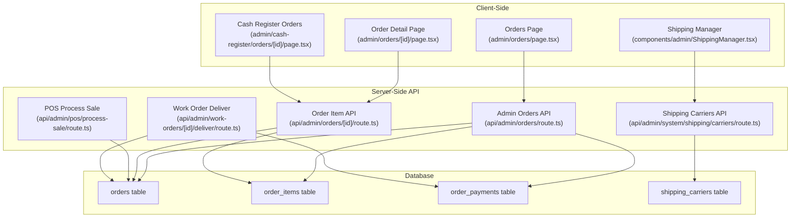
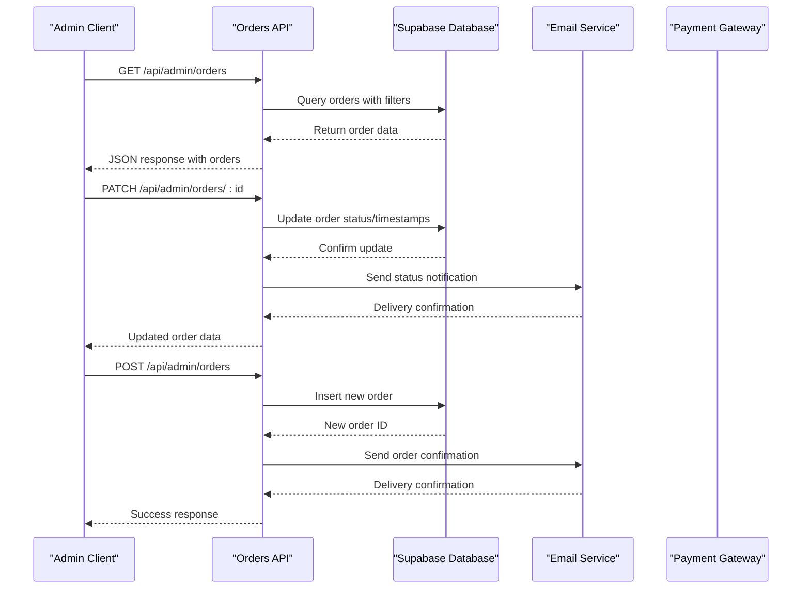
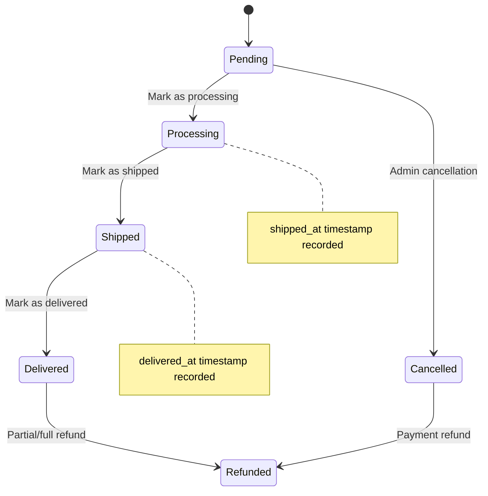
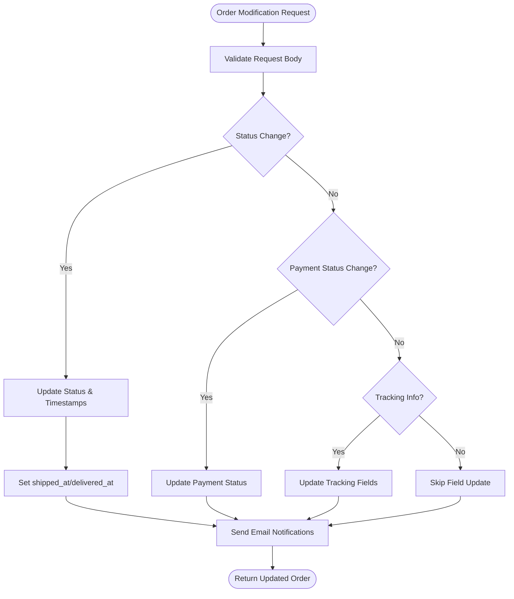
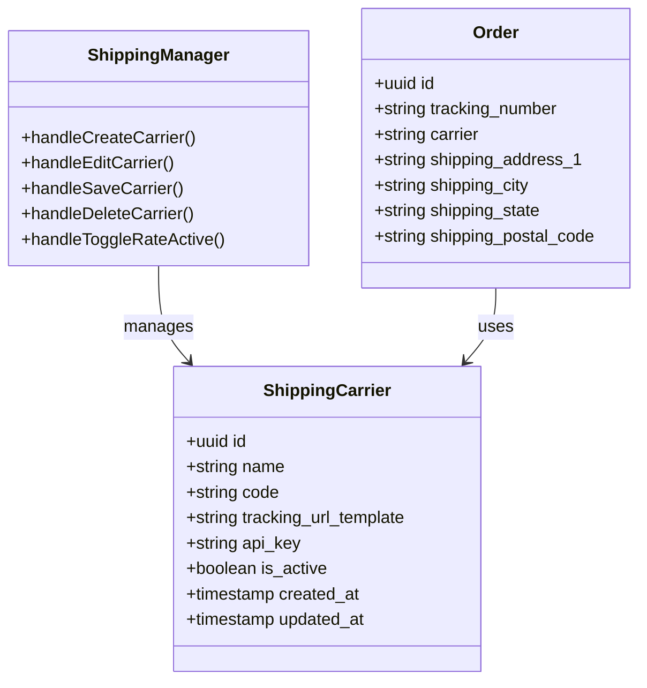
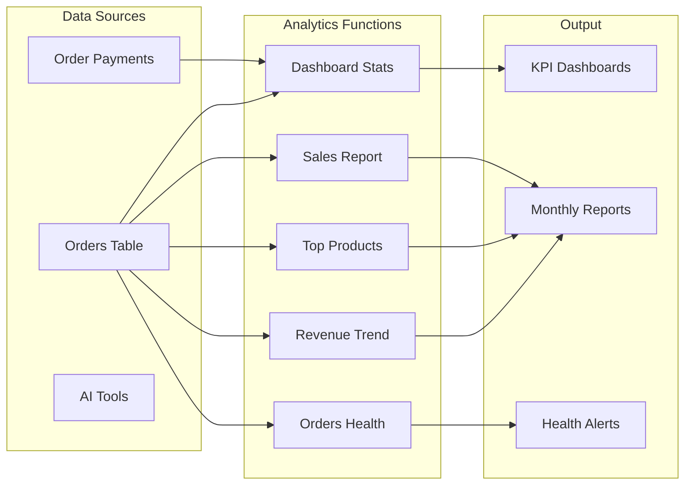
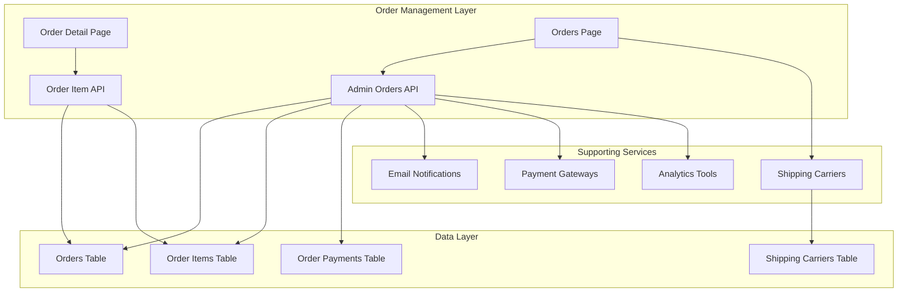

# Order Management System

<cite>
**Referenced Files in This Document**
- [orders route.ts](file://src/app/api/admin/orders/route.ts)
- [order detail route.ts](file://src/app/api/admin/orders/[id]/route.ts)
- [orders page.tsx](file://src/app/admin/orders/page.tsx)
- [order detail page.tsx](file://src/app/admin/orders/[id]/page.tsx)
- [cash register orders page.tsx](file://src/app/admin/cash-register/orders/[id]/page.tsx)
- [work order deliver route.ts](file://src/app/api/admin/work-orders/[id]/deliver/route.ts)
- [pos process-sale route.ts](file://src/app/api/admin/pos/process-sale/route.ts)
- [order payments migration.sql](file://supabase/migrations/20260122000006_create_order_payments.sql)
- [billing fields migration.sql](file://supabase/migrations/20260122000003_add_billing_fields_to_orders.sql)
- [cancellation reason migration.sql](file://supabase/migrations/20260124000004_add_cancellation_reason_to_orders.sql)
- [shipping carriers route.ts](file://src/app/api/admin/system/shipping/carriers/route.ts)
- [shipping manager.tsx](file://src/components/admin/ShippingManager.tsx)
- [orders.ts (AI tools)](file://src/lib/ai/tools/orders.ts)
- [analytics.ts (AI tools)](file://src/lib/ai/tools/analytics.ts)
- [diagnoseSystem.ts (AI tools)](file://src/lib/ai/tools/diagnoseSystem.ts)
- [orders test.ts](file://src/__tests__/integration/api/orders.test.ts)
- [TESTING_ORDERS_API_VALIDATION.md](file://docs/TESTING_ORDERS_API_VALIDATION.md)
</cite>

## Table of Contents

1. [Introduction](#introduction)
2. [Project Structure](#project-structure)
3. [Core Components](#core-components)
4. [Architecture Overview](#architecture-overview)
5. [Detailed Component Analysis](#detailed-component-analysis)
6. [Dependency Analysis](#dependency-analysis)
7. [Performance Considerations](#performance-considerations)
8. [Troubleshooting Guide](#troubleshooting-guide)
9. [Conclusion](#conclusion)

## Introduction

This document provides comprehensive documentation for the Opttius order management system, focusing on order lifecycle tracking and fulfillment workflows. It covers the order dashboard, order status tracking, filtering and search functionality, order modification capabilities, creation processes, state transitions, cancellation procedures, order details views, customer information display, product line items, shipping information, payment reconciliation, inventory adjustments, and shipping label generation. It also documents order reporting, analytics dashboards, and order history tracking, with practical examples and integration points for shipping carriers.

## Project Structure

The order management system is implemented as a Next.js application with a Supabase backend. Key components include:

- Admin API routes for order CRUD operations, status updates, and statistics
- Client-side pages for order listing, detail viewing, and cash register integration
- Database migrations for order payments, billing fields, and cancellation reasons
- Shipping carrier management and integration points
- AI-powered analytics and diagnostic tools



**Diagram sources**

- [orders route.ts](file://src/app/api/admin/orders/route.ts#L1-L748)
- [order detail route.ts](file://src/app/api/admin/orders/[id]/route.ts#L1-L406)
- [orders page.tsx](file://src/app/admin/orders/page.tsx#L1-L985)
- [order detail page.tsx](file://src/app/admin/orders/[id]/page.tsx#L1-L270)
- [cash register orders page.tsx](file://src/app/admin/cash-register/orders/[id]/page.tsx#L1-L248)
- [shipping carriers route.ts](file://src/app/api/admin/system/shipping/carriers/route.ts#L1-L113)
- [shipping manager.tsx](file://src/components/admin/ShippingManager.tsx#L346-L1035)

**Section sources**

- [orders route.ts](file://src/app/api/admin/orders/route.ts#L1-L748)
- [order detail route.ts](file://src/app/api/admin/orders/[id]/route.ts#L1-L406)
- [orders page.tsx](file://src/app/admin/orders/page.tsx#L1-L985)
- [order detail page.tsx](file://src/app/admin/orders/[id]/page.tsx#L1-L270)
- [cash register orders page.tsx](file://src/app/admin/cash-register/orders/[id]/page.tsx#L1-L248)
- [shipping carriers route.ts](file://src/app/api/admin/system/shipping/carriers/route.ts#L1-L113)
- [shipping manager.tsx](file://src/components/admin/ShippingManager.tsx#L346-L1035)

## Core Components

The system comprises several core components that work together to manage the complete order lifecycle:

### Order Management API

The Admin Orders API provides comprehensive CRUD operations with advanced filtering and multi-tenancy support:

- GET `/api/admin/orders` - List orders with pagination, filtering, and search
- POST `/api/admin/orders` - Create manual orders and retrieve statistics
- PATCH `/api/admin/orders/[id]` - Update order status, payment status, and tracking information
- DELETE `/api/admin/orders/[id]` - Remove orders with proper cascade deletion

Key features include:

- Multi-tenancy isolation by organization and branch
- Real-time order statistics and revenue tracking
- Email notification integration for status changes
- Rate limiting for modification operations

### Order Dashboard

The Orders Page provides a comprehensive interface for order management:

- Real-time order listing with pagination
- Advanced filtering by status and payment status
- Client-side search functionality
- Bulk status updates via dropdown menus
- Quick actions for marking orders as processing, shipped, or delivered
- Integration with external payment platforms

### Order Details View

The Order Detail Page displays comprehensive order information:

- Customer information and contact details
- Product line items with quantities and pricing
- Payment breakdown with real-time balance calculations
- Status and payment status badges
- Cancellation reason display for cancelled orders
- Integration links to external payment systems

### Payment Reconciliation

The system implements robust payment tracking through dedicated tables and functions:

- Separate `order_payments` table for recording actual payments
- Real-time balance calculation using stored procedures
- Support for multiple payment methods (cash, debit, credit, transfer, check)
- Automatic payment status updates based on payment records

### Shipping Integration

The system supports multiple shipping carriers with configurable rates:

- Carrier management through dedicated API endpoints
- Tracking URL template configuration
- Integration with external shipping providers
- Automated shipping notifications

**Section sources**

- [orders route.ts](file://src/app/api/admin/orders/route.ts#L10-L204)
- [orders page.tsx](file://src/app/admin/orders/page.tsx#L83-L424)
- [order detail page.tsx](file://src/app/admin/orders/[id]/page.tsx#L15-L269)
- [order payments migration.sql](file://supabase/migrations/20260122000006_create_order_payments.sql#L1-L58)

## Architecture Overview

The order management system follows a layered architecture with clear separation of concerns:



**Diagram sources**

- [orders route.ts](file://src/app/api/admin/orders/route.ts#L10-L204)
- [order detail route.ts](file://src/app/api/admin/orders/[id]/route.ts#L12-L228)

The architecture ensures:

- **Security**: Admin authentication and authorization checks
- **Scalability**: Database indexing and query optimization
- **Reliability**: Error handling and fallback mechanisms
- **Extensibility**: Modular design supporting new payment methods and shipping providers

## Detailed Component Analysis

### Order Lifecycle Management

The system manages complete order lifecycles with automatic timestamp tracking:



**Diagram sources**

- [order detail route.ts](file://src/app/api/admin/orders/[id]/route.ts#L74-L79)

Key lifecycle features:

- Automatic timestamp recording for shipped and delivered states
- Cancellation reason capture and display
- Payment status synchronization with actual payments
- Real-time balance calculations for partial payments

### Order Creation Workflows

The system supports multiple order creation scenarios:

#### Manual Order Creation

Administrators can create orders manually through the CreateManualOrderForm:

- Customer information capture
- Product selection and quantity management
- Shipping address configuration
- Payment method specification
- Real-time order number generation

#### POS Integration

Point-of-sale system integration creates orders with:

- Automated order numbering (ORD-YYYYMMDD-XXXX format)
- Real-time inventory deduction
- Integrated payment processing
- Receipt generation

#### Work Order Fulfillment

Work order integration ensures proper order fulfillment:

- Balance verification before delivery
- Outstanding payment detection
- Graceful handling of unpaid orders

**Section sources**

- [orders page.tsx](file://src/app/admin/orders/page.tsx#L286-L311)
- [pos process-sale route.ts](file://src/app/api/admin/pos/process-sale/route.ts#L591-L623)
- [work order deliver route.ts](file://src/app/api/admin/work-orders/[id]/deliver/route.ts#L83-L120)

### Order Modification and Status Updates

The system provides granular control over order modifications:



**Diagram sources**

- [order detail route.ts](file://src/app/api/admin/orders/[id]/route.ts#L56-L92)

Implementation highlights:

- Dynamic field updates preventing unnecessary database writes
- Automatic timestamp management for status transitions
- Non-blocking email notification system
- Comprehensive error handling and logging

### Payment Reconciliation System

The payment reconciliation system ensures accurate financial tracking:

```mermaid
erDiagram
ORDERS {
uuid id PK
string order_number
decimal total_amount
decimal subtotal
string status
string payment_status
timestamp created_at
timestamp updated_at
}
ORDER_PAYMENTS {
uuid id PK
uuid order_id FK
decimal amount
string payment_method
string payment_reference
timestamp paid_at
timestamp created_at
}
CALCULATE_BALANCE {
function calculate_order_balance()
param p_order_id UUID
return decimal
}
ORDERS ||--o{ ORDER_PAYMENTS : contains
ORDER_PAYMENTS }o--|| ORDERS : belongs_to
```

**Diagram sources**

- [order payments migration.sql](file://supabase/migrations/20260122000006_create_order_payments.sql#L1-L58)

Key features:

- Real-time balance calculation using stored procedures
- Support for multiple payment methods with validation
- Payment reference tracking for audit trails
- Automatic payment status updates based on payment records

**Section sources**

- [order payments migration.sql](file://supabase/migrations/20260122000006_create_order_payments.sql#L30-L58)
- [order detail page.tsx](file://src/app/admin/orders/[id]/page.tsx#L49-L71)

### Shipping and Fulfillment Integration

The system integrates with multiple shipping providers:



**Diagram sources**

- [shipping carriers route.ts](file://src/app/api/admin/system/shipping/carriers/route.ts#L1-L113)
- [shipping manager.tsx](file://src/components/admin/ShippingManager.tsx#L372-L427)

**Section sources**

- [shipping carriers route.ts](file://src/app/api/admin/system/shipping/carriers/route.ts#L1-L113)
- [shipping manager.tsx](file://src/components/admin/ShippingManager.tsx#L346-L1035)

### Analytics and Reporting

The system provides comprehensive analytics capabilities:



**Diagram sources**

- [analytics.ts (AI tools)](file://src/lib/ai/tools/analytics.ts#L21-L173)
- [diagnoseSystem.ts (AI tools)](file://src/lib/ai/tools/diagnoseSystem.ts#L134-L171)

**Section sources**

- [analytics.ts (AI tools)](file://src/lib/ai/tools/analytics.ts#L1-L173)
- [diagnoseSystem.ts (AI tools)](file://src/lib/ai/tools/diagnoseSystem.ts#L132-L171)

## Dependency Analysis

The order management system exhibits strong modularity with clear dependency relationships:



**Diagram sources**

- [orders route.ts](file://src/app/api/admin/orders/route.ts#L1-L748)
- [order detail route.ts](file://src/app/api/admin/orders/[id]/route.ts#L1-L406)

Key dependency characteristics:

- **High Cohesion**: Related functionality grouped within specific modules
- **Low Coupling**: Clear separation between API, UI, and data layers
- **Extensible Design**: Easy addition of new payment methods and shipping providers
- **Secure Access**: Centralized authentication and authorization enforcement

**Section sources**

- [orders route.ts](file://src/app/api/admin/orders/route.ts#L1-L748)
- [order detail route.ts](file://src/app/api/admin/orders/[id]/route.ts#L1-L406)

## Performance Considerations

The system implements several performance optimization strategies:

### Database Optimization

- **Indexing Strategy**: Strategic indexes on frequently queried columns (order_number, organization_id, branch_id, created_at)
- **Query Optimization**: Efficient JOIN operations and selective column retrieval
- **Pagination Implementation**: Server-side pagination to prevent large result sets
- **Connection Pooling**: Optimized database connection management

### API Performance

- **Rate Limiting**: Protection against excessive order modifications
- **Caching Opportunities**: Potential for caching frequently accessed order statistics
- **Batch Operations**: Support for bulk order operations where applicable
- **Lazy Loading**: Client-side rendering of order details to improve initial load times

### Frontend Optimization

- **Virtual Scrolling**: Efficient rendering of large order lists
- **Client-Side Filtering**: Reduced server load for simple search operations
- **Image Optimization**: Efficient loading of product images
- **State Management**: Optimized React state updates to minimize re-renders

## Troubleshooting Guide

### Common Issues and Solutions

#### Order Status Update Failures

**Symptoms**: Status changes not persisting or email notifications not sending
**Causes**:

- Insufficient permissions or authentication failures
- Database constraint violations
- Email service timeouts

**Resolutions**:

- Verify admin user authentication
- Check database logs for constraint errors
- Monitor email service health and retry mechanisms

#### Payment Reconciliation Problems

**Symptoms**: Discrepancies between order totals and paid amounts
**Causes**:

- Missing payment records in order_payments table
- Currency conversion issues
- Duplicate payment entries

**Resolutions**:

- Verify payment gateway callbacks are processed
- Check order_payments table integrity
- Review payment reference uniqueness

#### Shipping Integration Issues

**Symptoms**: Tracking numbers not updating or carrier information missing
**Causes**:

- Invalid carrier configuration
- API key authentication failures
- Network connectivity issues

**Resolutions**:

- Validate carrier API credentials
- Check network connectivity to shipping provider
- Review carrier configuration templates

### Debugging Tools and Techniques

The system provides comprehensive logging and monitoring capabilities:

- **Request Logging**: Full request/response logging for API endpoints
- **Error Tracking**: Structured error reporting with stack traces
- **Performance Metrics**: Query execution times and response latencies
- **Audit Trails**: Complete modification history for orders

**Section sources**

- [orders route.ts](file://src/app/api/admin/orders/route.ts#L197-L203)
- [order detail route.ts](file://src/app/api/admin/orders/[id]/route.ts#L221-L227)

## Conclusion

The Opttius order management system provides a comprehensive solution for e-commerce order lifecycle management. Its modular architecture, robust payment reconciliation, and extensive analytics capabilities make it suitable for growing businesses. The system's emphasis on security, scalability, and extensibility positions it well for future enhancements and integration requirements.

Key strengths include:

- **Complete Order Lifecycle Management**: From creation to fulfillment and reporting
- **Robust Payment Integration**: Real-time reconciliation and multi-method support
- **Advanced Analytics**: Comprehensive reporting and diagnostic capabilities
- **Flexible Architecture**: Easy integration with shipping providers and payment gateways
- **Strong Security**: Multi-tenancy isolation and comprehensive access controls

The system's documentation and testing framework ensure maintainability and reliability, while its modular design facilitates future enhancements and customization.
