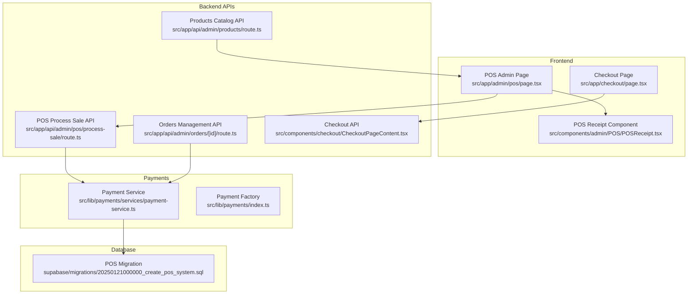
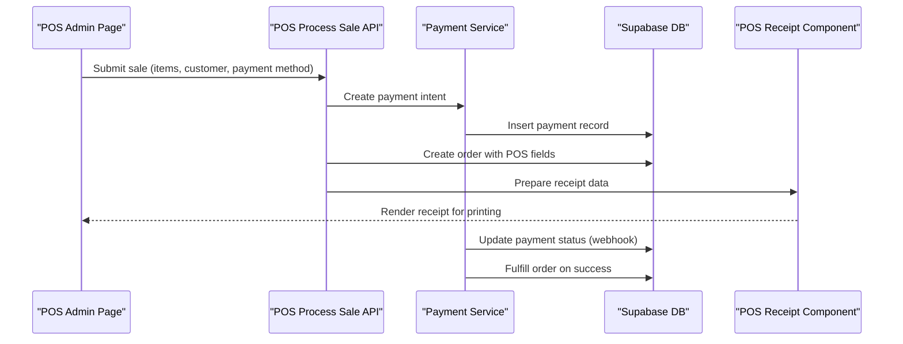
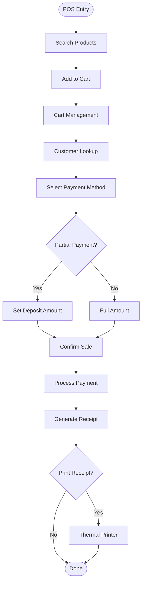
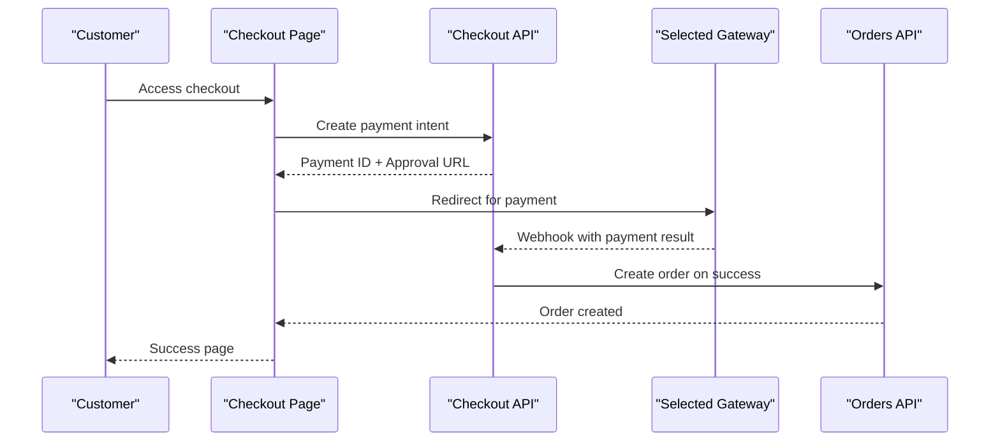
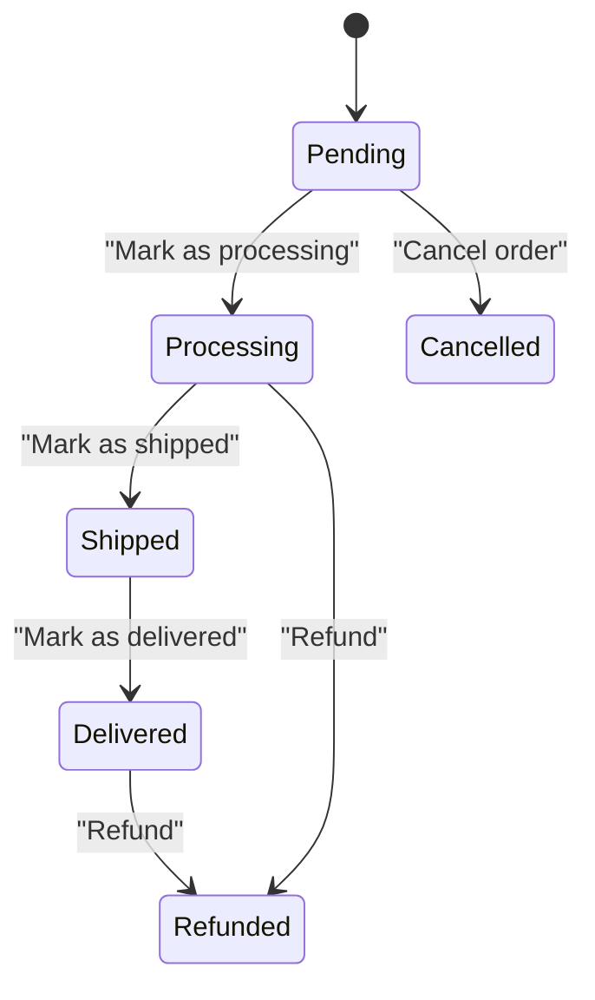
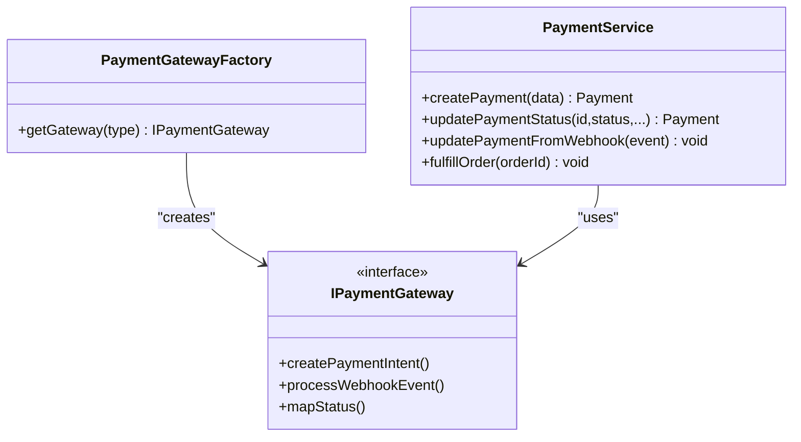
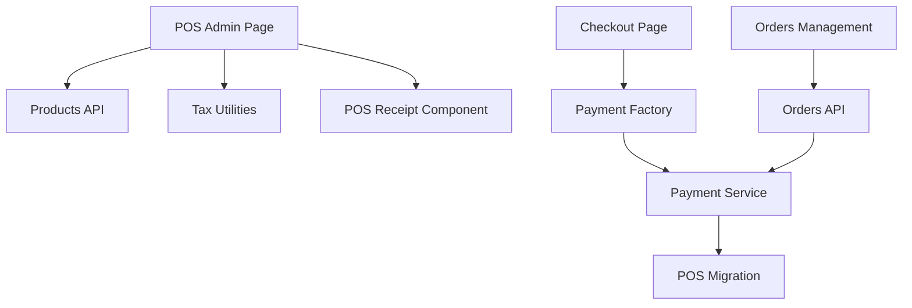

# Point of Sale & E-commerce System

<cite>
**Referenced Files in This Document**
- [POS Page](file://src/app/admin/pos/page.tsx)
- [POS Receipt Component](file://src/components/admin/POS/POSReceipt.tsx)
- [POS API Route](file://src/app/api/admin/pos/process-sale/route.ts)
- [Products API](file://src/app/api/admin/products/route.ts)
- [Orders Management](file://src/app/admin/orders/page.tsx)
- [Orders API](file://src/app/api/admin/orders/[id]/route.ts)
- [Checkout Page](file://src/app/checkout/page.tsx)
- [Checkout Content](file://src/components/checkout/CheckoutPageContent.tsx)
- [Payment Service](file://src/lib/payments/services/payment-service.ts)
- [Payment Factory](file://src/lib/payments/index.ts)
- [Tax Utilities](file://src/lib/utils/tax.ts)
- [POS Migration](file://supabase/migrations/20250121000000_create_pos_system.sql)
- [Automatic Printing Guide](file://docs/AUTOMATIC_PRINTING_IMPLEMENTATION.md)
- [Payment Gateways Guide](file://docs/PAYMENT_GATEWAYS_IMPLEMENTATION_GUIDE.md)
</cite>

## Table of Contents

1. [Introduction](#introduction)
2. [Project Structure](#project-structure)
3. [Core Components](#core-components)
4. [Architecture Overview](#architecture-overview)
5. [Detailed Component Analysis](#detailed-component-analysis)
6. [Dependency Analysis](#dependency-analysis)
7. [Performance Considerations](#performance-considerations)
8. [Troubleshooting Guide](#troubleshooting-guide)
9. [Conclusion](#conclusion)

## Introduction

This document describes the Point of Sale (POS) and e-commerce system for Opttius, focusing on retail operations and online ordering workflows. It covers:

- POS interface for in-store transactions, product scanning, payment processing, and receipt generation
- E-commerce platform including product catalog display, shopping cart functionality, and checkout process
- Order management system covering order creation, fulfillment workflows, and status tracking
- Implementation details for payment gateway integration, inventory management during sales, and tax calculation logic
- Examples of POS transaction flows, online order processing, and integration between physical and digital sales channels
- Product catalog system, pricing strategies, and order fulfillment workflows

## Project Structure

The system is built with a Next.js frontend and Supabase backend, featuring:

- Admin-facing POS interface for in-store sales
- E-commerce checkout for online purchases
- Shared payment infrastructure supporting multiple gateways
- Multi-branch inventory and order management
- Automated receipt generation and printing

**Diagram sources**

- [POS Page](file://src/app/admin/pos/page.tsx#L1-L6075)
- [POS Receipt Component](file://src/components/admin/POS/POSReceipt.tsx#L1-L210)
- [POS API Route](file://src/app/api/admin/pos/process-sale/route.ts#L591-L623)
- [Orders API](file://src/app/api/admin/orders/[id]/route.ts#L42-L92)
- [Products API](file://src/app/api/admin/products/route.ts#L1-L800)
- [Checkout Content](file://src/components/checkout/CheckoutPageContent.tsx#L1-L885)
- [Payment Service](file://src/lib/payments/services/payment-service.ts#L1-L494)
- [Payment Factory](file://src/lib/payments/index.ts#L1-L37)
- [POS Migration](file://supabase/migrations/20250121000000_create_pos_system.sql#L1-L271)

**Section sources**

- [POS Page](file://src/app/admin/pos/page.tsx#L1-L6075)
- [POS API Route](file://src/app/api/admin/pos/process-sale/route.ts#L591-L623)
- [Products API](file://src/app/api/admin/products/route.ts#L1-L800)
- [Orders Management](file://src/app/admin/orders/page.tsx#L1-L985)
- [Orders API](file://src/app/api/admin/orders/[id]/route.ts#L42-L92)
- [Checkout Page](file://src/app/checkout/page.tsx#L1-L12)
- [Checkout Content](file://src/components/checkout/CheckoutPageContent.tsx#L1-L885)
- [Payment Service](file://src/lib/payments/services/payment-service.ts#L1-L494)
- [Payment Factory](file://src/lib/payments/index.ts#L1-L37)
- [POS Migration](file://supabase/migrations/20250121000000_create_pos_system.sql#L1-L271)

## Core Components

- POS Admin Page: Full-featured in-store sales interface with product search, cart management, customer lookup, and payment processing.
- POS Receipt Component: Generates printable receipts with configurable printer settings and legal/commercial data.
- Products Catalog API: Multi-branch product search, filtering, and inventory visibility with stock management.
- Orders Management: Admin panel for order status tracking, payment status updates, and fulfillment actions.
- Checkout Page: Online checkout experience with gateway selection and payment confirmation.
- Payment Service: Centralized payment processing, webhook handling, and order fulfillment orchestration.
- Tax Utilities: Consistent tax calculation for inclusive/exclusive pricing scenarios.
- POS Migration: Database schema for POS-specific fields, SII integration, and transaction tracking.

**Section sources**

- [POS Page](file://src/app/admin/pos/page.tsx#L1-L6075)
- [POS Receipt Component](file://src/components/admin/POS/POSReceipt.tsx#L1-L210)
- [Products API](file://src/app/api/admin/products/route.ts#L1-L800)
- [Orders Management](file://src/app/admin/orders/page.tsx#L1-L985)
- [Checkout Content](file://src/components/checkout/CheckoutPageContent.tsx#L1-L885)
- [Payment Service](file://src/lib/payments/services/payment-service.ts#L1-L494)
- [Tax Utilities](file://src/lib/utils/tax.ts#L1-L95)
- [POS Migration](file://supabase/migrations/20250121000000_create_pos_system.sql#L1-L271)

## Architecture Overview

The system integrates POS and e-commerce through shared payment and order management services:

- POS and Checkout both create payment intents via the same payment factory and service layer.
- Orders are unified under a single schema with POS-specific fields and SII compliance.
- Inventory is managed per-branch with centralized stock tracking and availability calculations.
- Receipt generation is standardized and supports both thermal and A4 printing.

**Diagram sources**

- [POS Page](file://src/app/admin/pos/page.tsx#L1-L6075)
- [POS API Route](file://src/app/api/admin/pos/process-sale/route.ts#L591-L623)
- [Payment Service](file://src/lib/payments/services/payment-service.ts#L115-L185)
- [POS Receipt Component](file://src/components/admin/POS/POSReceipt.tsx#L1-L210)

## Detailed Component Analysis

### POS Interface and Transaction Flow

The POS interface manages:

- Product search and scanning with real-time inventory checks
- Shopping cart with quantity adjustments and tax calculations
- Customer lookup and quote loading for seamless conversions
- Payment methods: cash, debit/credit cards, transfers, and partial payments
- Cash register status validation and pending balance collection
- Automatic receipt generation and printing

**Diagram sources**

- [POS Page](file://src/app/admin/pos/page.tsx#L924-L5341)
- [POS Receipt Component](file://src/components/admin/POS/POSReceipt.tsx#L1-L210)

**Section sources**

- [POS Page](file://src/app/admin/pos/page.tsx#L924-L5341)
- [POS Receipt Component](file://src/components/admin/POS/POSReceipt.tsx#L1-L210)

### E-commerce Platform and Checkout

The checkout experience includes:

- Tier selection and payment method selection
- Secure payment processing via chosen gateway
- Order creation and payment confirmation
- Result page with success/failure handling

**Diagram sources**

- [Checkout Page](file://src/app/checkout/page.tsx#L1-L12)
- [Checkout Content](file://src/components/checkout/CheckoutPageContent.tsx#L210-L327)
- [Orders API](file://src/app/api/admin/orders/[id]/route.ts#L42-L92)

**Section sources**

- [Checkout Page](file://src/app/checkout/page.tsx#L1-L12)
- [Checkout Content](file://src/components/checkout/CheckoutPageContent.tsx#L210-L327)
- [Orders API](file://src/app/api/admin/orders/[id]/route.ts#L42-L92)

### Order Management System

Order management provides:

- Unified order listing with status and payment status filters
- Real-time updates for shipping and delivery timestamps
- Manual order creation and deletion capabilities
- Email notifications and external payment provider links

**Diagram sources**

- [Orders Management](file://src/app/admin/orders/page.tsx#L197-L264)

**Section sources**

- [Orders Management](file://src/app/admin/orders/page.tsx#L1-L985)
- [Orders API](file://src/app/api/admin/orders/[id]/route.ts#L42-L92)

### Payment Gateway Integration

The payment system supports multiple gateways with a unified factory and service layer:

- Payment creation and status updates
- Webhook event handling and idempotency
- Order fulfillment on successful payments
- Subscription and SaaS payment flows

**Diagram sources**

- [Payment Factory](file://src/lib/payments/index.ts#L1-L37)
- [Payment Service](file://src/lib/payments/services/payment-service.ts#L1-L494)

**Section sources**

- [Payment Factory](file://src/lib/payments/index.ts#L1-L37)
- [Payment Service](file://src/lib/payments/services/payment-service.ts#L1-L494)
- [Payment Gateways Guide](file://docs/PAYMENT_GATEWAYS_IMPLEMENTATION_GUIDE.md#L11-L373)

### Inventory Management During Sales

Inventory is managed per-branch with:

- Stock tracking and availability calculations
- Legacy inventory fallback for migrated products
- Multi-tenant isolation and branch-specific visibility
- Real-time stock updates during POS transactions

**Section sources**

- [Products API](file://src/app/api/admin/products/route.ts#L377-L531)
- [POS Migration](file://supabase/migrations/20250121000000_create_pos_system.sql#L224-L247)

### Tax Calculation Logic

Tax handling supports:

- Inclusive/exclusive pricing modes
- Consistent subtotal, tax, and total calculations
- Dynamic tax rate configuration for Chilean IVA (19%)

**Section sources**

- [Tax Utilities](file://src/lib/utils/tax.ts#L1-L95)
- [POS Page](file://src/app/admin/pos/page.tsx#L415-L424)

### Receipt Generation and Printing

Receipt generation includes:

- Configurable printer types (thermal/A4) and widths
- Legal/commercial data rendering (RUT, address, phone)
- Order summary and payment status display
- Automatic printing workflow with print media queries

**Section sources**

- [POS Receipt Component](file://src/components/admin/POS/POSReceipt.tsx#L1-L210)
- [Automatic Printing Guide](file://docs/AUTOMATIC_PRINTING_IMPLEMENTATION.md#L1-L25)

## Dependency Analysis

The system exhibits strong cohesion within core domains and clear separation of concerns:

- POS depends on Products API for inventory and Pricing Utilities for tax calculations
- Checkout relies on Payment Factory and Payment Service for secure transactions
- Orders Management coordinates with Payment Service for payment status updates
- Database schema supports POS-specific fields and SII compliance

**Diagram sources**

- [POS Page](file://src/app/admin/pos/page.tsx#L1-L6075)
- [Products API](file://src/app/api/admin/products/route.ts#L1-L800)
- [Checkout Content](file://src/components/checkout/CheckoutPageContent.tsx#L1-L885)
- [Payment Factory](file://src/lib/payments/index.ts#L1-L37)
- [Payment Service](file://src/lib/payments/services/payment-service.ts#L1-L494)
- [Orders Management](file://src/app/admin/orders/page.tsx#L1-L985)
- [Orders API](file://src/app/api/admin/orders/[id]/route.ts#L42-L92)
- [POS Migration](file://supabase/migrations/20250121000000_create_pos_system.sql#L1-L271)

**Section sources**

- [POS Page](file://src/app/admin/pos/page.tsx#L1-L6075)
- [Products API](file://src/app/api/admin/products/route.ts#L1-L800)
- [Checkout Content](file://src/components/checkout/CheckoutPageContent.tsx#L1-L885)
- [Payment Factory](file://src/lib/payments/index.ts#L1-L37)
- [Payment Service](file://src/lib/payments/services/payment-service.ts#L1-L494)
- [Orders Management](file://src/app/admin/orders/page.tsx#L1-L985)
- [Orders API](file://src/app/api/admin/orders/[id]/route.ts#L42-L92)
- [POS Migration](file://supabase/migrations/20250121000000_create_pos_system.sql#L1-L271)

## Performance Considerations

- Product search and filtering leverage Supabase with organization and branch isolation to minimize cross-tenant data exposure.
- POS cart calculations use client-side tax utilities to reduce server load during interactive sessions.
- Payment processing is asynchronous with webhook-driven updates to avoid blocking UI interactions.
- Receipt generation is optimized for print media queries to ensure fast rendering and minimal memory usage.

## Troubleshooting Guide

Common issues and resolutions:

- Cash register closed: Verify cash register status before processing sales; prompt user to open register.
- Insufficient inventory: Validate stock levels before adding items; display warnings for low stock.
- Payment failures: Check webhook logs and payment status updates; retry payment creation if needed.
- Order not found: Confirm order ID and organization context; verify branch access permissions.
- Receipt printing problems: Ensure printer settings are configured; verify print media queries and thermal width settings.

**Section sources**

- [POS Page](file://src/app/admin/pos/page.tsx#L426-L460)
- [POS Receipt Component](file://src/components/admin/POS/POSReceipt.tsx#L18-L31)
- [Payment Service](file://src/lib/payments/services/payment-service.ts#L115-L185)

## Conclusion

The Opttius POS and e-commerce system provides a robust foundation for retail operations with integrated payment processing, multi-branch inventory management, and automated order fulfillment. The modular architecture enables seamless integration between physical and digital sales channels while maintaining compliance with regional tax and invoicing requirements.
