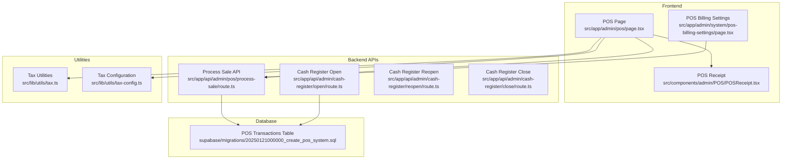
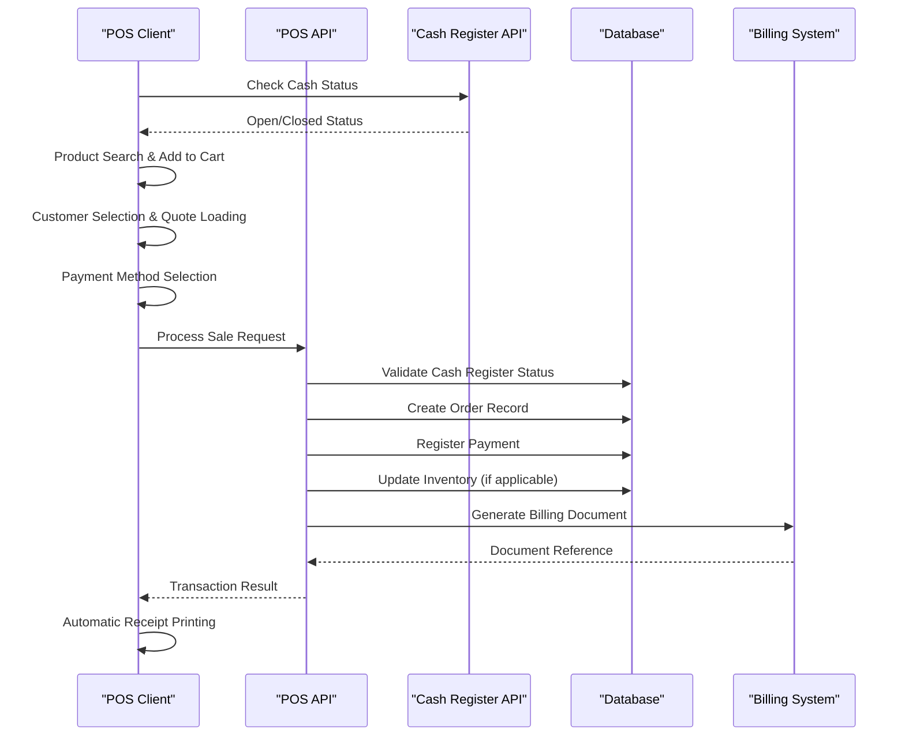
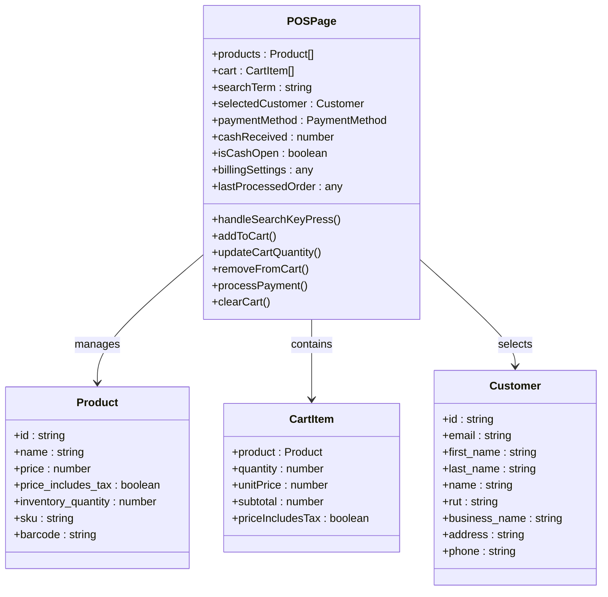
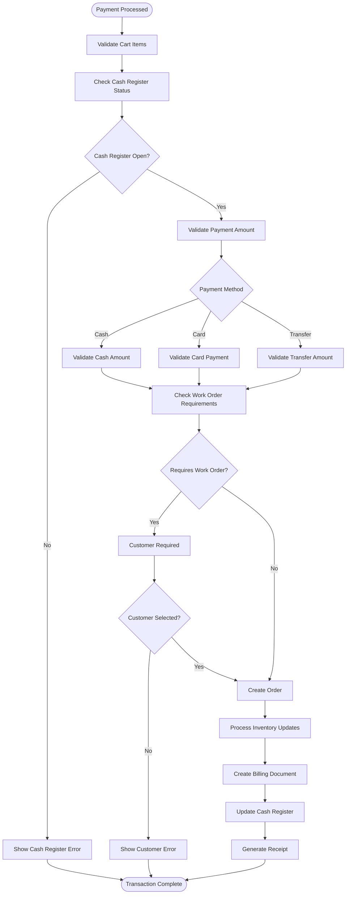
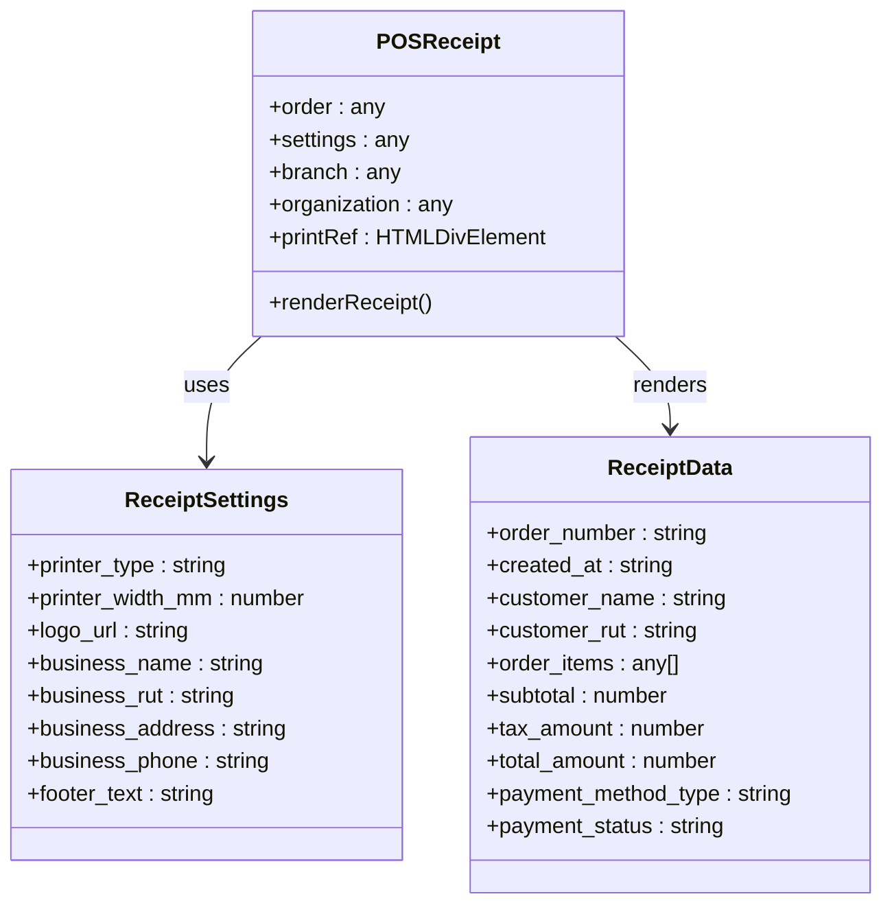
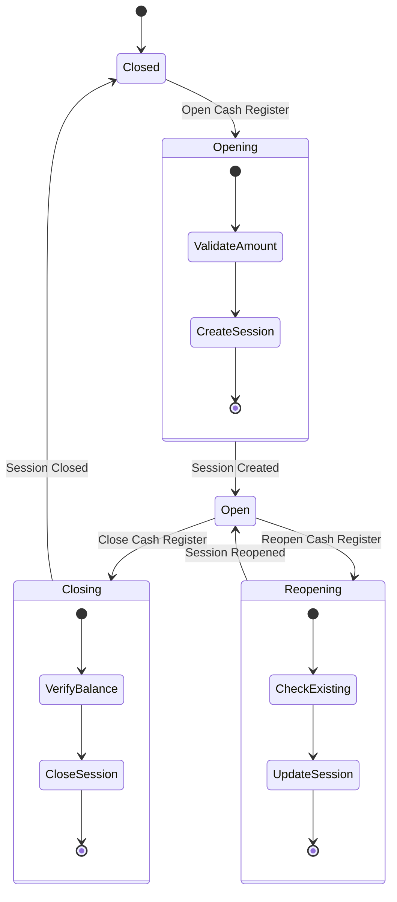
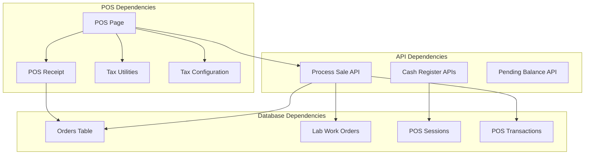

# Point of Sale Interface

<cite>
**Referenced Files in This Document**
- [POS Page](file://src/app/admin/pos/page.tsx)
- [POS Receipt Component](file://src/components/admin/POS/POSReceipt.tsx)
- [POS Process Sale API](file://src/app/api/admin/pos/process-sale/route.ts)
- [Cash Register Open API](file://src/app/api/admin/cash-register/open/route.ts)
- [Cash Register Reopen API](file://src/app/api/admin/cash-register/reopen/route.ts)
- [Cash Register Close API](file://src/app/api/admin/cash-register/close/route.ts)
- [POS Billing Settings Page](file://src/app/admin/system/pos-billing-settings/page.tsx)
- [Tax Utilities](file://src/lib/utils/tax.ts)
- [Tax Configuration](file://src/lib/utils/tax-config.ts)
- [POS Transactions Migration](file://supabase/migrations/20250121000000_create_pos_system.sql)
</cite>

## Table of Contents

1. [Introduction](#introduction)
2. [Project Structure](#project-structure)
3. [Core Components](#core-components)
4. [Architecture Overview](#architecture-overview)
5. [Detailed Component Analysis](#detailed-component-analysis)
6. [Dependency Analysis](#dependency-analysis)
7. [Performance Considerations](#performance-considerations)
8. [Troubleshooting Guide](#troubleshooting-guide)
9. [Conclusion](#conclusion)

## Introduction

This document provides comprehensive technical documentation for the Point of Sale (POS) interface focused on in-store transaction processing. It covers the POS dashboard layout, product scanning functionality, payment processing workflow, receipt generation system, cash register integration, session management, transaction recording, and integration with the broader e-commerce system. The documentation includes user interface components, barcode scanning, product lookup, real-time inventory updates, tax calculation, typical POS workflows, error handling, and session closure procedures.

## Project Structure

The POS functionality is implemented across several key areas:

- Frontend POS page with real-time cart management and payment processing
- Backend APIs for sale processing, cash register management, and pending balances
- Receipt generation component with configurable printer settings
- Tax calculation utilities and configuration
- Database schema supporting POS transactions and cash register sessions

**Diagram sources**

- [POS Page](file://src/app/admin/pos/page.tsx#L148-L175)
- [POS Receipt Component](file://src/components/admin/POS/POSReceipt.tsx#L1-L211)
- [POS Process Sale API](file://src/app/api/admin/pos/process-sale/route.ts#L1-L800)
- [Cash Register Open API](file://src/app/api/admin/cash-register/open/route.ts#L117-L169)
- [POS Transactions Migration](file://supabase/migrations/20250121000000_create_pos_system.sql#L90-L114)

**Section sources**

- [POS Page](file://src/app/admin/pos/page.tsx#L1-L800)
- [POS Receipt Component](file://src/components/admin/POS/POSReceipt.tsx#L1-L211)
- [POS Process Sale API](file://src/app/api/admin/pos/process-sale/route.ts#L1-L800)
- [POS Transactions Migration](file://supabase/migrations/20250121000000_create_pos_system.sql#L90-L114)

## Core Components

The POS system consists of several interconnected components that work together to provide a complete in-store transaction processing solution.

### POS Dashboard Layout

The main POS interface is built around a responsive layout with three primary sections:

- **Left Panel**: Customer selection and order form with quote loading capabilities
- **Center Panel**: Product search and cart management with real-time calculations
- **Right Panel**: Payment processing and receipt generation with multiple payment methods

Key state management includes:

- Product search with intelligent filtering and keyboard navigation
- Cart item management with quantity adjustments and removal
- Customer selection with quote loading and prescription integration
- Payment method selection with partial payment support
- Real-time tax calculations and discount application

### Product Scanning and Lookup

The system supports multiple product lookup methods:

- **Barcode Scanning**: Direct barcode input with automatic product lookup
- **Text Search**: Intelligent search with debounced queries
- **Category Filtering**: Excludes frames from regular product search
- **Real-time Suggestions**: Dropdown with keyboard navigation support

### Payment Processing Workflow

The payment system handles multiple payment methods with comprehensive validation:

- **Cash Payments**: Full or partial cash with change calculation
- **Card Payments**: Credit and debit card processing with authorization
- **Transfer Payments**: Bank transfer with deposit tracking
- **Partial Payments**: Flexible payment arrangements with pending balance tracking

### Receipt Generation System

The receipt system provides flexible output options:

- **Automatic Printing**: Configurable automatic receipt printing
- **Printer Types**: Thermal (80mm) and A4 printer support
- **Customizable Templates**: Company branding and footer customization
- **Multi-format Support**: PDF generation and thermal printer output

**Section sources**

- [POS Page](file://src/app/admin/pos/page.tsx#L2888-L3199)
- [POS Receipt Component](file://src/components/admin/POS/POSReceipt.tsx#L1-L211)

## Architecture Overview

The POS system follows a client-server architecture with real-time synchronization and comprehensive backend validation.

**Diagram sources**

- [POS Process Sale API](file://src/app/api/admin/pos/process-sale/route.ts#L144-L182)
- [Cash Register Open API](file://src/app/api/admin/cash-register/open/route.ts#L212-L241)
- [POS Process Sale API](file://src/app/api/admin/pos/process-sale/route.ts#L817-L951)

The architecture ensures:

- **Cash Register Validation**: Prevents sales when cash register is closed
- **Transaction Integrity**: Comprehensive validation and rollback capabilities
- **Real-time Updates**: Immediate inventory and financial updates
- **Multi-format Receipts**: Support for various printer configurations

## Detailed Component Analysis

### POS Dashboard Component

The main POS page serves as the central hub for all transaction processing activities.

**Diagram sources**

- [POS Page](file://src/app/admin/pos/page.tsx#L91-L127)
- [POS Page](file://src/app/admin/pos/page.tsx#L108-L114)

Key features include:

- **Real-time Calculations**: Dynamic tax and discount calculations
- **Customer Management**: Integrated customer search and quote loading
- **Flexible Payment Methods**: Support for multiple payment types
- **Work Order Integration**: Automatic creation of laboratory work orders when needed

**Section sources**

- [POS Page](file://src/app/admin/pos/page.tsx#L148-L1043)

### Payment Processing Engine

The payment processing system handles complex transaction scenarios with comprehensive validation.

**Diagram sources**

- [POS Page](file://src/app/admin/pos/page.tsx#L2375-L2793)
- [POS Process Sale API](file://src/app/api/admin/pos/process-sale/route.ts#L1063-L1077)

**Section sources**

- [POS Page](file://src/app/admin/pos/page.tsx#L2375-L2793)
- [POS Process Sale API](file://src/app/api/admin/pos/process-sale/route.ts#L1063-L1077)

### Receipt Generation System

The receipt system provides flexible output options with configurable printer settings.

**Diagram sources**

- [POS Receipt Component](file://src/components/admin/POS/POSReceipt.tsx#L7-L12)
- [POS Receipt Component](file://src/components/admin/POS/POSReceipt.tsx#L14-L207)

**Section sources**

- [POS Receipt Component](file://src/components/admin/POS/POSReceipt.tsx#L1-L211)

### Cash Register Integration

The cash register system provides comprehensive session management with real-time status monitoring.

**Diagram sources**

- [Cash Register Open API](file://src/app/api/admin/cash-register/open/route.ts#L117-L169)
- [Cash Register Close API](file://src/app/api/admin/cash-register/close/route.ts#L480-L495)
- [Cash Register Reopen API](file://src/app/api/admin/cash-register/reopen/route.ts#L168-L193)

**Section sources**

- [Cash Register Open API](file://src/app/api/admin/cash-register/open/route.ts#L117-L169)
- [Cash Register Close API](file://src/app/api/admin/cash-register/close/route.ts#L480-L495)
- [Cash Register Reopen API](file://src/app/api/admin/cash-register/reopen/route.ts#L168-L193)

## Dependency Analysis

The POS system has well-defined dependencies that ensure modularity and maintainability.

**Diagram sources**

- [POS Page](file://src/app/admin/pos/page.tsx#L1-L800)
- [POS Process Sale API](file://src/app/api/admin/pos/process-sale/route.ts#L614-L709)
- [POS Transactions Migration](file://supabase/migrations/20250121000000_create_pos_system.sql#L90-L114)

**Section sources**

- [POS Page](file://src/app/admin/pos/page.tsx#L1-L800)
- [POS Process Sale API](file://src/app/api/admin/pos/process-sale/route.ts#L614-L709)
- [POS Transactions Migration](file://supabase/migrations/20250121000000_create_pos_system.sql#L90-L114)

## Performance Considerations

The POS system implements several performance optimizations:

### Real-time Search Optimization

- **Debounced Queries**: 200ms debounce for product and customer searches
- **Keyboard Navigation**: Efficient arrow key navigation through search results
- **Lazy Loading**: Results loaded only when needed

### State Management Efficiency

- **Selective Updates**: Only relevant state updates trigger re-renders
- **Batch Operations**: Multiple cart updates performed in single state transactions
- **Memory Management**: Proper cleanup of search result arrays

### Database Performance

- **Indexed Queries**: Optimized database queries with appropriate indexing
- **Bulk Operations**: Inventory updates performed in batch operations
- **Connection Pooling**: Efficient database connection management

## Troubleshooting Guide

### Common Transaction Failures

1. **Cash Register Closed**: Verify cash register status before processing sales
2. **Insufficient Stock**: Check inventory levels before processing transactions
3. **Invalid Payment Amounts**: Validate payment amounts against total charges
4. **Missing Customer Data**: Ensure required customer information for work orders

### Error Handling Patterns

The system implements comprehensive error handling:

- **Frontend Validation**: Immediate feedback for user input errors
- **Backend Validation**: Server-side validation with detailed error messages
- **Transaction Rollback**: Automatic rollback of failed transactions
- **Logging**: Comprehensive error logging for debugging

### Receipt Printing Issues

- **Printer Configuration**: Verify printer type and width settings
- **Automatic Printing**: Check browser print permissions and settings
- **Receipt Template**: Validate receipt template configuration

**Section sources**

- [POS Process Sale API](file://src/app/api/admin/pos/process-sale/route.ts#L160-L179)
- [POS Page](file://src/app/admin/pos/page.tsx#L2787-L2793)

## Conclusion

The Point of Sale interface provides a comprehensive, enterprise-grade solution for in-store transaction processing. Its modular architecture, real-time capabilities, and extensive integration options make it suitable for optical retail environments requiring precise inventory management, flexible payment processing, and automated receipt generation. The system's robust error handling, performance optimizations, and comprehensive cash register integration ensure reliable operation in demanding retail environments.

The implementation demonstrates best practices in modern web development, including reactive state management, real-time data synchronization, and comprehensive API validation. The POS system serves as a foundation for future enhancements while maintaining backward compatibility and extensibility for additional payment methods, inventory systems, and reporting capabilities.
