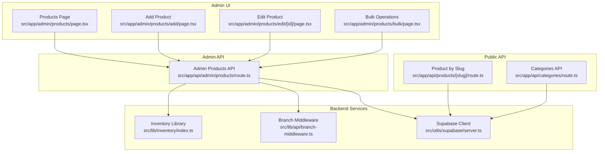
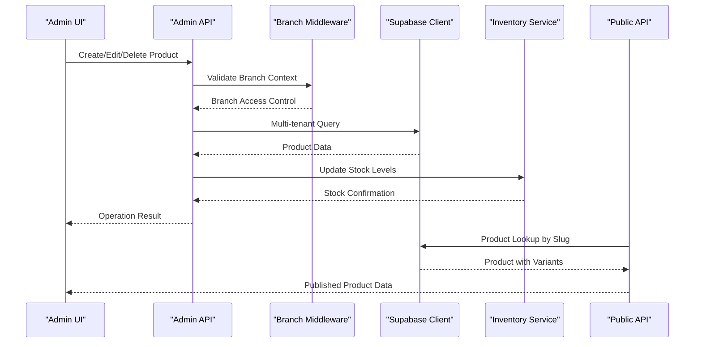
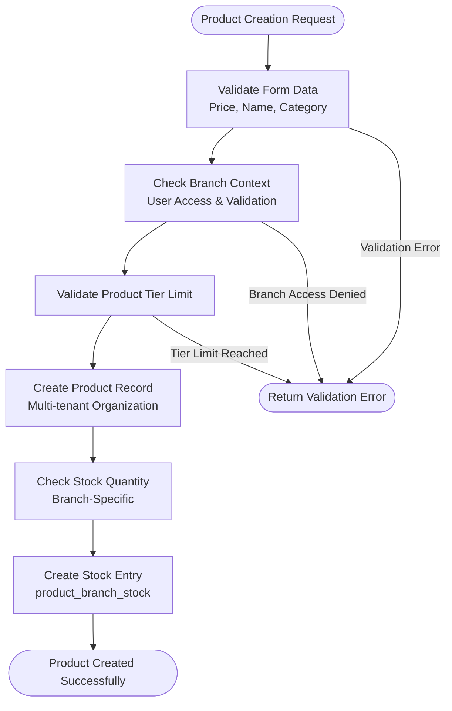
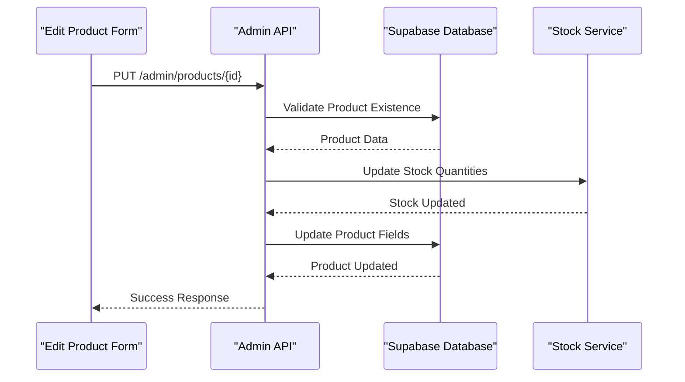
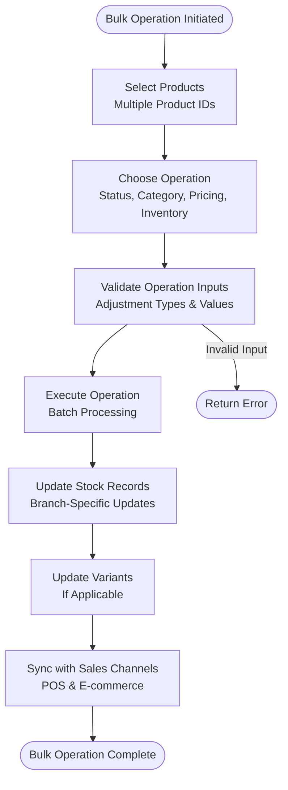
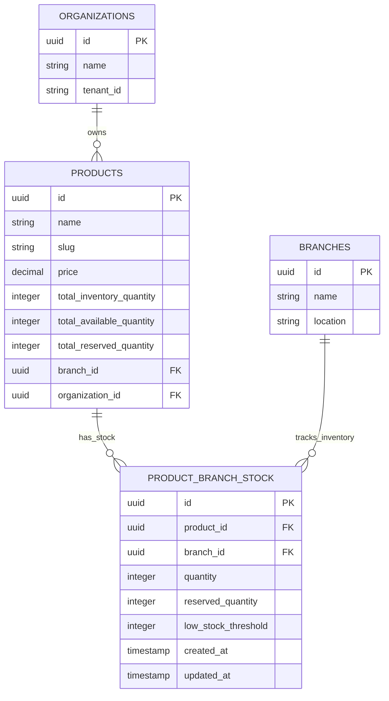
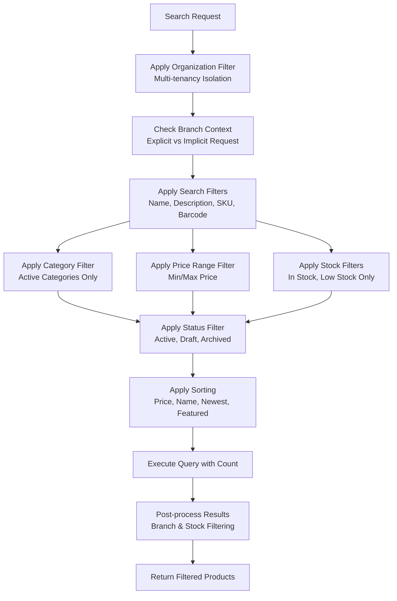
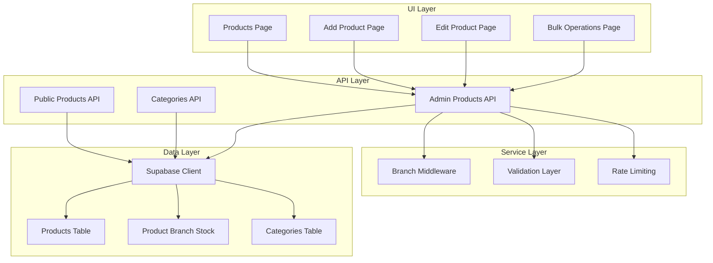

# Product Catalog Integration

<cite>
**Referenced Files in This Document**
- [src/app/admin/products/page.tsx](file://src/app/admin/products/page.tsx)
- [src/app/admin/products/add/page.tsx](file://src/app/admin/products/add/page.tsx)
- [src/app/admin/products/edit/[id]/page.tsx](file://src/app/admin/products/edit/[id]/page.tsx)
- [src/app/admin/products/bulk/page.tsx](file://src/app/admin/products/bulk/page.tsx)
- [src/app/api/admin/products/route.ts](file://src/app/api/admin/products/route.ts)
- [src/app/api/products/[slug]/route.ts](file://src/app/api/products/[slug]/route.ts)
- [src/app/api/categories/route.ts](file://src/app/api/categories/route.ts)
- [src/lib/inventory/index.ts](file://src/lib/inventory/index.ts)
- [src/lib/api/branch-middleware.ts](file://src/lib/api/branch-middleware.ts)
- [src/utils/supabase/server.ts](file://src/utils/supabase/server.ts)
- [supabase/migrations/20260120000000_refactor_separate_products_inventory.sql](file://supabase/migrations/20260120000000_refactor_separate_products_inventory.sql)
</cite>

## Table of Contents

1. [Introduction](#introduction)
2. [Project Structure](#project-structure)
3. [Core Components](#core-components)
4. [Architecture Overview](#architecture-overview)
5. [Detailed Component Analysis](#detailed-component-analysis)
6. [Dependency Analysis](#dependency-analysis)
7. [Performance Considerations](#performance-considerations)
8. [Troubleshooting Guide](#troubleshooting-guide)
9. [Conclusion](#conclusion)

## Introduction

This document provides comprehensive coverage of the product catalog integration system, focusing on product data management and sales channel synchronization across POS and e-commerce channels. It explains the product catalog structure, categorization, pricing management, and inventory tracking, along with the product creation and editing workflows, search functionality, and integration patterns with external systems. The documentation includes implementation details for product images, descriptions, variants, and options, as well as bulk operations, analytics, and performance metrics.

## Project Structure

The product catalog integration spans three primary areas:

- Admin UI for product management (create, edit, bulk operations)
- Public API for product retrieval and search
- Backend API for administrative product operations and inventory synchronization

**Diagram sources**

- [src/app/admin/products/page.tsx](file://src/app/admin/products/page.tsx#L1-L1309)
- [src/app/admin/products/add/page.tsx](file://src/app/admin/products/add/page.tsx#L1-L1538)
- [src/app/admin/products/edit/[id]/page.tsx](file://src/app/admin/products/edit/[id]/page.tsx#L1-L1594)
- [src/app/admin/products/bulk/page.tsx](file://src/app/admin/products/bulk/page.tsx#L1-L1023)
- [src/app/api/admin/products/route.ts](file://src/app/api/admin/products/route.ts#L1-L1220)
- [src/app/api/products/[slug]/route.ts](file://src/app/api/products/[slug]/route.ts#L1-L87)
- [src/app/api/categories/route.ts](file://src/app/api/categories/route.ts#L1-L135)
- [src/lib/api/branch-middleware.ts](file://src/lib/api/branch-middleware.ts)
- [src/utils/supabase/server.ts](file://src/utils/supabase/server.ts)
- [src/lib/inventory/index.ts](file://src/lib/inventory/index.ts)

**Section sources**

- [src/app/admin/products/page.tsx](file://src/app/admin/products/page.tsx#L1-L1309)
- [src/app/admin/products/add/page.tsx](file://src/app/admin/products/add/page.tsx#L1-L1538)
- [src/app/admin/products/edit/[id]/page.tsx](file://src/app/admin/products/edit/[id]/page.tsx#L1-L1594)
- [src/app/admin/products/bulk/page.tsx](file://src/app/admin/products/bulk/page.tsx#L1-L1023)
- [src/app/api/admin/products/route.ts](file://src/app/api/admin/products/route.ts#L1-L1220)
- [src/app/api/products/[slug]/route.ts](file://src/app/api/products/[slug]/route.ts#L1-L87)
- [src/app/api/categories/route.ts](file://src/app/api/categories/route.ts#L1-L135)

## Core Components

This section outlines the key components involved in product catalog integration:

- Product Management UI
  - Products page with filtering, pagination, and bulk operations
  - Add product form with comprehensive optical product fields
  - Edit product form with real-time validation and change detection
  - Bulk operations interface for mass updates and exports

- Public Product Retrieval
  - Slug-based product lookup with variant support
  - Category management API for product classification

- Administrative Product Operations
  - Full CRUD operations with validation and rate limiting
  - Multi-tenant organization isolation
  - Branch-aware inventory management
  - Product search with advanced filtering

- Inventory and Branch Integration
  - Separate product_branch_stock table for branch-specific inventory
  - Stock reservation and availability calculations
  - Low stock threshold management

**Section sources**

- [src/app/admin/products/page.tsx](file://src/app/admin/products/page.tsx#L72-L1309)
- [src/app/admin/products/add/page.tsx](file://src/app/admin/products/add/page.tsx#L40-L1538)
- [src/app/admin/products/edit/[id]/page.tsx](file://src/app/admin/products/edit/[id]/page.tsx#L27-L1594)
- [src/app/admin/products/bulk/page.tsx](file://src/app/admin/products/bulk/page.tsx#L94-L1023)
- [src/app/api/admin/products/route.ts](file://src/app/api/admin/products/route.ts#L24-L1220)
- [src/app/api/products/[slug]/route.ts](file://src/app/api/products/[slug]/route.ts#L4-L87)
- [src/app/api/categories/route.ts](file://src/app/api/categories/route.ts#L4-L135)

## Architecture Overview

The product catalog integration follows a layered architecture with clear separation between presentation, API, and data access layers:

**Diagram sources**

- [src/app/admin/products/page.tsx](file://src/app/admin/products/page.tsx#L224-L276)
- [src/app/api/admin/products/route.ts](file://src/app/api/admin/products/route.ts#L64-L1220)
- [src/lib/api/branch-middleware.ts](file://src/lib/api/branch-middleware.ts)
- [src/utils/supabase/server.ts](file://src/utils/supabase/server.ts)
- [src/lib/inventory/index.ts](file://src/lib/inventory/index.ts)

The architecture implements several key patterns:

- Multi-tenancy isolation through organization-based filtering
- Branch-aware inventory management with separate stock tracking
- Real-time stock availability calculations
- Comprehensive validation and rate limiting for administrative operations

## Detailed Component Analysis

### Product Creation Workflow

The product creation workflow encompasses form validation, branch context handling, and inventory initialization:

**Diagram sources**

- [src/app/admin/products/add/page.tsx](file://src/app/admin/products/add/page.tsx#L341-L605)
- [src/app/api/admin/products/route.ts](file://src/app/api/admin/products/route.ts#L542-L1186)

Key implementation details:

- Form validation with protected form state to prevent data loss
- Branch context validation ensuring user access to target branch
- Tier limit validation preventing exceeding subscription constraints
- Stock creation using RPC function `update_product_stock` with fallback to direct insert
- Multi-tenant organization isolation in product records

**Section sources**

- [src/app/admin/products/add/page.tsx](file://src/app/admin/products/add/page.tsx#L40-L605)
- [src/app/api/admin/products/route.ts](file://src/app/api/admin/products/route.ts#L542-L1186)

### Product Editing and Variant Management

The edit workflow supports comprehensive product modifications with variant support:

**Diagram sources**

- [src/app/admin/products/edit/[id]/page.tsx](file://src/app/admin/products/edit/[id]/page.tsx#L518-L652)
- [src/app/api/admin/products/route.ts](file://src/app/api/admin/products/route.ts#L1188-L1220)

Variant management features:

- Support for product variants with pricing and inventory tracking
- Real-time stock availability calculation (quantity - reserved_quantity)
- Branch-specific stock visibility and filtering
- Comprehensive optical product fields (frames, lenses, accessories)

**Section sources**

- [src/app/admin/products/edit/[id]/page.tsx](file://src/app/admin/products/edit/[id]/page.tsx#L27-L652)
- [src/app/api/products/[slug]/route.ts](file://src/app/api/products/[slug]/route.ts#L4-L87)

### Bulk Operations and Data Synchronization

Bulk operations enable mass product management across multiple channels:

**Diagram sources**

- [src/app/admin/products/bulk/page.tsx](file://src/app/admin/products/bulk/page.tsx#L177-L260)
- [src/app/admin/products/page.tsx](file://src/app/admin/products/page.tsx#L209-L276)

Bulk operation capabilities:

- Mass status updates across multiple products
- Category reassignment for product groups
- Pricing adjustments (percentage or fixed amount)
- Inventory modifications (set or adjust quantities)
- CSV import/export for external system integration
- JSON import for bulk product creation

**Section sources**

- [src/app/admin/products/bulk/page.tsx](file://src/app/admin/products/bulk/page.tsx#L94-L540)
- [src/app/admin/products/page.tsx](file://src/app/admin/products/page.tsx#L209-L356)

### Inventory Tracking and Stock Management

The inventory system implements branch-specific tracking with real-time availability calculations:

**Diagram sources**

- [supabase/migrations/20260120000000_refactor_separate_products_inventory.sql](file://supabase/migrations/20260120000000_refactor_separate_products_inventory.sql)
- [src/app/api/admin/products/route.ts](file://src/app/api/admin/products/route.ts#L430-L475)

Inventory management features:

- Separate product_branch_stock table for branch-specific inventory
- Automatic low stock threshold monitoring
- Stock reservation system preventing overselling
- Availability calculation: available = quantity - reserved_quantity
- Legacy inventory_quantity fallback for backward compatibility

**Section sources**

- [src/app/api/admin/products/route.ts](file://src/app/api/admin/products/route.ts#L430-L531)
- [supabase/migrations/20260120000000_refactor_separate_products_inventory.sql](file://supabase/migrations/20260120000000_refactor_separate_products_inventory.sql)

### Product Search and Filtering

The search system provides comprehensive filtering across multiple product attributes:

**Diagram sources**

- [src/app/api/admin/products/route.ts](file://src/app/api/admin/products/route.ts#L24-L539)

Advanced search capabilities:

- Multi-field search across name, description, SKU, and barcode
- Organization-level multi-tenancy isolation
- Branch-specific filtering with explicit branch_id requests
- Stock-based filtering (in stock, low stock only)
- Comprehensive status filtering for administrative views

**Section sources**

- [src/app/api/admin/products/route.ts](file://src/app/api/admin/products/route.ts#L24-L539)

### Integration with External Systems

The system supports integration with external systems through standardized APIs:

- CSV Import/Export for bulk operations
- JSON import for product creation and updates
- Public product API for e-commerce integration
- Branch context propagation via HTTP headers
- Multi-tenant organization isolation

Integration patterns:

- Bulk CSV import supporting create, update, and upsert modes
- JSON-based product synchronization for external catalogs
- Public product endpoint with variant support for storefront integration
- Branch-aware inventory synchronization for POS systems

**Section sources**

- [src/app/admin/products/bulk/page.tsx](file://src/app/admin/products/bulk/page.tsx#L292-L328)
- [src/app/admin/products/page.tsx](file://src/app/admin/products/page.tsx#L311-L356)
- [src/app/api/products/[slug]/route.ts](file://src/app/api/products/[slug]/route.ts#L4-L87)

## Dependency Analysis

The product catalog integration exhibits strong modularity with clear dependency boundaries:

**Diagram sources**

- [src/app/admin/products/page.tsx](file://src/app/admin/products/page.tsx#L59-L126)
- [src/app/api/admin/products/route.ts](file://src/app/api/admin/products/route.ts#L1-L1220)
- [src/lib/api/branch-middleware.ts](file://src/lib/api/branch-middleware.ts)
- [src/utils/supabase/server.ts](file://src/utils/supabase/server.ts)

Key dependency characteristics:

- Loose coupling between UI components and API services
- Clear separation of concerns with dedicated validation and middleware layers
- Strong data access layer abstraction through Supabase client
- Extensible architecture supporting additional product types and variants

**Section sources**

- [src/app/admin/products/page.tsx](file://src/app/admin/products/page.tsx#L59-L126)
- [src/app/api/admin/products/route.ts](file://src/app/api/admin/products/route.ts#L1-L1220)

## Performance Considerations

The product catalog integration implements several performance optimization strategies:

- Database Query Optimization
  - Efficient multi-tenant filtering with organization_id constraints
  - Branch-specific query optimization using explicit branch_id parameters
  - Post-processing filtering for complex conditions (search .or() conflicts)
  - Proper indexing strategies for search performance

- Caching Strategies
  - React Query integration for efficient client-side caching
  - Pagination with count optimization for large datasets
  - Branch context caching to reduce repeated middleware calls

- API Performance
  - Rate limiting for administrative operations
  - Validation layer optimization to prevent unnecessary database calls
  - Efficient bulk operation processing with batch updates

- Inventory Performance
  - Real-time stock calculations with minimal database overhead
  - Low stock threshold monitoring with configurable thresholds
  - Optimized stock update operations using stored procedures

## Troubleshooting Guide

Common issues and their resolutions:

### Authentication and Authorization Issues

- **Problem**: Unauthorized access to product management
- **Cause**: Missing admin privileges or invalid session
- **Solution**: Verify user authentication and admin role assignment

### Branch Context Errors

- **Problem**: Products not visible across branches
- **Cause**: Incorrect branch_id header or access restrictions
- **Solution**: Ensure proper branch context propagation and user access permissions

### Inventory Synchronization Issues

- **Problem**: Stock levels not updating across channels
- **Cause**: Delayed stock updates or branch-specific inventory conflicts
- **Solution**: Verify stock update operations and branch-specific inventory records

### Search Performance Issues

- **Problem**: Slow product search responses
- **Cause**: Unoptimized search queries or missing indexes
- **Solution**: Review search query optimization and database indexing strategies

**Section sources**

- [src/app/api/admin/products/route.ts](file://src/app/api/admin/products/route.ts#L32-L45)
- [src/app/admin/products/page.tsx](file://src/app/admin/products/page.tsx#L224-L276)
- [src/app/api/admin/products/route.ts](file://src/app/api/admin/products/route.ts#L342-L375)

## Conclusion

The product catalog integration system provides a comprehensive solution for managing product data across multiple sales channels. Its architecture supports robust multi-tenancy, branch-specific inventory management, and seamless integration with external systems. The implementation demonstrates strong separation of concerns, comprehensive validation, and performance optimization strategies. The system successfully addresses the core requirements of product data management, pricing synchronization, and inventory tracking while maintaining scalability and maintainability for future enhancements.
