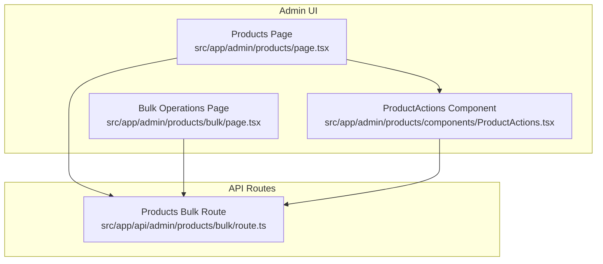
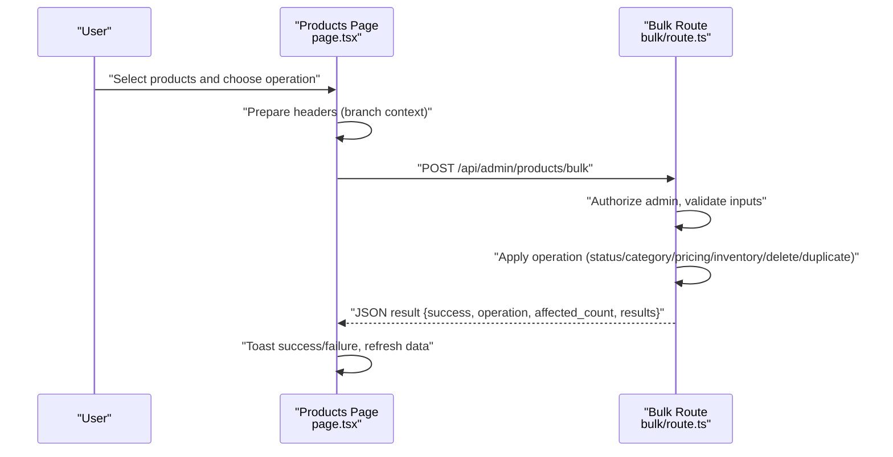
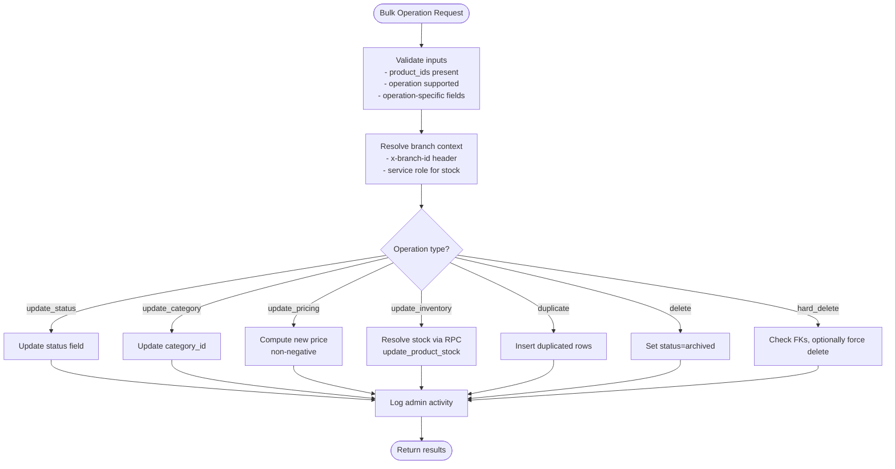
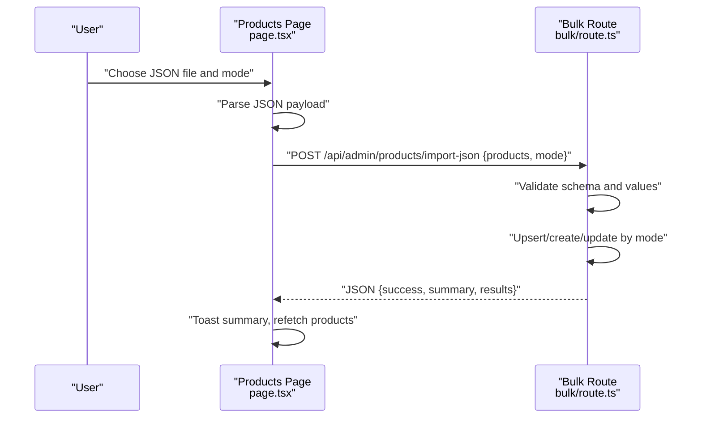
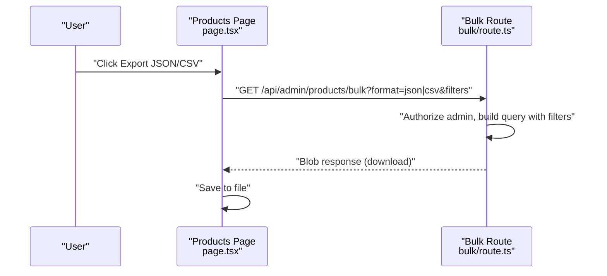
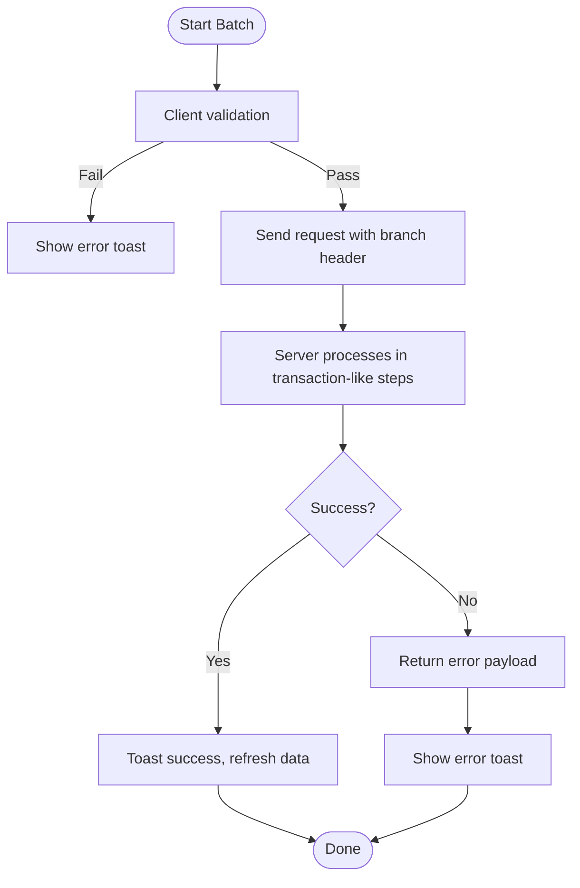
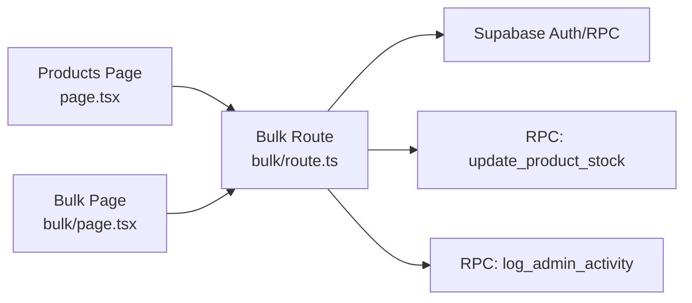

# Bulk Operations & Import/Export

<cite>
**Referenced Files in This Document**
- [page.tsx](file://src/app/admin/products/page.tsx)
- [ProductActions.tsx](file://src/app/admin/products/components/ProductActions.tsx)
- [bulk/route.ts](file://src/app/api/admin/products/bulk/route.ts)
- [bulk/page.tsx](file://src/app/admin/products/bulk/page.tsx)
</cite>

## Table of Contents

1. [Introduction](#introduction)
2. [Project Structure](#project-structure)
3. [Core Components](#core-components)
4. [Architecture Overview](#architecture-overview)
5. [Detailed Component Analysis](#detailed-component-analysis)
6. [Dependency Analysis](#dependency-analysis)
7. [Performance Considerations](#performance-considerations)
8. [Troubleshooting Guide](#troubleshooting-guide)
9. [Conclusion](#conclusion)

## Introduction

This document explains the bulk operations and data import/export capabilities for products. It covers:

- Bulk product operations: mass status updates, category assignments, pricing adjustments, inventory modifications, duplication, and deletion (soft and hard).
- JSON import system: file format expectations, validation rules, and import modes (create/update/upsert).
- Export functionality: CSV and JSON formats, filter-based exports, and template downloads.
- Batch processing workflows: error handling, progress feedback, and rollback considerations.
- Validation, duplicate detection, and conflict resolution strategies.
- Practical scenarios, troubleshooting tips, and performance guidance for large-scale operations.

## Project Structure

The bulk and import/export features span the admin UI and backend API:

- Frontend pages orchestrate selection, UI dialogs, and API calls.
- Backend routes enforce authorization, branch context, and perform atomic operations.
- Shared components provide reusable actions and filters.

**Diagram sources**

- [page.tsx](file://src/app/admin/products/page.tsx#L1-L120)
- [ProductActions.tsx](file://src/app/admin/products/components/ProductActions.tsx#L1-L119)
- [bulk/page.tsx](file://src/app/admin/products/bulk/page.tsx#L1-L120)
- [bulk/route.ts](file://src/app/api/admin/products/bulk/route.ts#L1-L60)

**Section sources**

- [page.tsx](file://src/app/admin/products/page.tsx#L1-L120)
- [ProductActions.tsx](file://src/app/admin/products/components/ProductActions.tsx#L1-L119)
- [bulk/page.tsx](file://src/app/admin/products/bulk/page.tsx#L1-L120)
- [bulk/route.ts](file://src/app/api/admin/products/bulk/route.ts#L1-L60)

## Core Components

- Products Page (client-side):
  - Manages selection, bulk operation dialog, JSON import/export, and branch context headers.
  - Provides filter-based export to JSON and CSV via query parameters.
- ProductActions Component:
  - Exposes JSON export, template download, and JSON import triggers.
- Bulk Operations Page (client-side):
  - Dedicated UI for bulk operations, CSV import, and filter-based CSV export.
- Products Bulk Route (server-side):
  - Enforces admin authorization, validates inputs, applies branch context, and executes operations atomically.
  - Supports export to CSV/JSON with optional branch-scoped stock.

**Section sources**

- [page.tsx](file://src/app/admin/products/page.tsx#L134-L356)
- [ProductActions.tsx](file://src/app/admin/products/components/ProductActions.tsx#L24-L86)
- [bulk/page.tsx](file://src/app/admin/products/bulk/page.tsx#L111-L328)
- [bulk/route.ts](file://src/app/api/admin/products/bulk/route.ts#L11-L490)

## Architecture Overview

The system follows a client-server pattern:

- Client UI collects selections and operation parameters.
- Client sends requests to backend routes with branch context.
- Backend validates permissions, applies branch-aware logic, and returns structured results.

**Diagram sources**

- [page.tsx](file://src/app/admin/products/page.tsx#L209-L276)
- [bulk/route.ts](file://src/app/api/admin/products/bulk/route.ts#L11-L490)

## Detailed Component Analysis

### Bulk Product Operations Interface

Supported operations:

- Update status: sets product status to active, draft, or archived.
- Update category: assigns a new category to selected products.
- Update pricing: percentage or fixed amount adjustments with non-negative cap.
- Update inventory: set absolute quantity or add/subtract with branch context and stock RPC.
- Duplicate: creates copies of selected products with modified identifiers.
- Delete (soft archive): sets status to archived.
- Hard delete: permanently removes records; requires explicit confirmation and handles foreign key constraints.

Inputs and validation:

- Operation type and product IDs are mandatory.
- Operation-specific fields validated before execution.
- Branch context enforced for inventory updates; global view handled with fallback.

Results:

- Returns affected count and per-item results for auditability.
- Admin activity logged via RPC.

**Diagram sources**

- [bulk/route.ts](file://src/app/api/admin/products/bulk/route.ts#L46-L490)

**Section sources**

- [page.tsx](file://src/app/admin/products/page.tsx#L209-L276)
- [bulk/route.ts](file://src/app/api/admin/products/bulk/route.ts#L46-L490)

### JSON Import System

- Endpoint: POST /api/admin/products/import-json
- Modes:
  - Create: process only new records.
  - Update: process only existing records.
  - Upsert: process both (create or update).
- Validation and behavior:
  - Validates presence of required fields and numeric values.
  - Skips invalid rows and reports counts for created, updated, skipped, errors, and warnings.
  - Returns a summary and detailed results for diagnostics.
- UI integration:
  - Products Page supports JSON import dialog and displays results summary.

**Diagram sources**

- [page.tsx](file://src/app/admin/products/page.tsx#L311-L356)
- [bulk/route.ts](file://src/app/api/admin/products/bulk/route.ts#L11-L490)

**Section sources**

- [page.tsx](file://src/app/admin/products/page.tsx#L146-L356)
- [bulk/route.ts](file://src/app/api/admin/products/bulk/route.ts#L11-L490)

### Export Functionality

- CSV export:
  - Endpoint: GET /api/admin/products/bulk?format=csv&category_id=&status=
  - Includes branch-scoped stock when a branch is selected.
  - Fields include ID, name, slug, description, price, compare-at price, stock, status, featured flag, SKU, weight, attributes, category, and creation date.
- JSON export:
  - Endpoint: GET /api/admin/products/bulk?format=json&category_id=&status=
  - Returns raw JSON array of products with optional stock fields.
- Template download:
  - ProductActions exposes a link to download a JSON template for import.

**Diagram sources**

- [page.tsx](file://src/app/admin/products/page.tsx#L279-L309)
- [ProductActions.tsx](file://src/app/admin/products/components/ProductActions.tsx#L60-L77)
- [bulk/route.ts](file://src/app/api/admin/products/bulk/route.ts#L492-L682)

**Section sources**

- [page.tsx](file://src/app/admin/products/page.tsx#L279-L309)
- [ProductActions.tsx](file://src/app/admin/products/components/ProductActions.tsx#L60-L77)
- [bulk/route.ts](file://src/app/api/admin/products/bulk/route.ts#L492-L682)

### Batch Processing Workflows

- Progress tracking:
  - UI shows loading states and success/error toasts after bulk operations.
  - Results include affected_count and per-item outcomes.
- Rollback and safety:
  - Soft delete archives products; can be reversed by changing status.
  - Hard delete requires explicit confirmation and checks for order dependencies; can optionally remove dependent records when forced.
- Error handling:
  - Client-side validation prevents empty selections and missing fields.
  - Server-side validation returns structured errors; UI displays user-friendly messages.

**Diagram sources**

- [page.tsx](file://src/app/admin/products/page.tsx#L209-L276)
- [bulk/page.tsx](file://src/app/admin/products/bulk/page.tsx#L177-L260)
- [bulk/route.ts](file://src/app/api/admin/products/bulk/route.ts#L307-L420)

**Section sources**

- [page.tsx](file://src/app/admin/products/page.tsx#L209-L276)
- [bulk/page.tsx](file://src/app/admin/products/bulk/page.tsx#L177-L260)
- [bulk/route.ts](file://src/app/api/admin/products/bulk/route.ts#L307-L420)

### Data Validation, Duplicate Detection, and Conflict Resolution

- Validation:
  - Required fields and numeric constraints enforced before updates.
  - Pricing adjustments constrained to non-negative values.
  - Inventory adjustments validated for type and numeric values.
- Duplicate detection:
  - Not implemented as a separate feature; duplication is performed by inserting copies with modified identifiers.
- Conflict resolution:
  - Hard delete blocks removal of products linked to orders unless forced; when forced, dependent order items are removed prior to product deletion.

**Section sources**

- [bulk/route.ts](file://src/app/api/admin/products/bulk/route.ts#L93-L144)
- [bulk/route.ts](file://src/app/api/admin/products/bulk/route.ts#L146-L288)
- [bulk/route.ts](file://src/app/api/admin/products/bulk/route.ts#L307-L420)

### Examples of Bulk Workflow Scenarios

- Mass status updates:
  - Select products → choose “Change Status” → pick target status → apply → observe affected_count.
- Category reassignment:
  - Select products → choose “Change Category” → pick category → apply → verify category_id updates.
- Pricing adjustments:
  - Select products → choose “Adjust Prices” → select percentage or fixed → enter value → apply → confirm non-negative results.
- Inventory modifications:
  - Select products → choose “Adjust Inventory” → choose set/add → enter quantity → apply → stock updated via RPC.
- Product duplication:
  - Select products → choose “Duplicate” → apply → new entries created with modified identifiers.
- Deletion:
  - Soft delete: choose “Archive Products” → apply → status becomes archived.
  - Hard delete: choose “Delete Permanently” → confirm → apply → products removed (with FK checks and optional force).

**Section sources**

- [page.tsx](file://src/app/admin/products/page.tsx#L414-L628)
- [bulk/page.tsx](file://src/app/admin/products/bulk/page.tsx#L341-L540)
- [bulk/route.ts](file://src/app/api/admin/products/bulk/route.ts#L46-L490)

## Dependency Analysis

- Client depends on:
  - Branch context headers for inventory operations.
  - API routes for bulk operations, exports, and imports.
- Server depends on:
  - Supabase client for authorization and data access.
  - Service role client for stock updates via RPC.
  - Branch middleware to resolve branch context.

**Diagram sources**

- [page.tsx](file://src/app/admin/products/page.tsx#L224-L244)
- [bulk/page.tsx](file://src/app/admin/products/bulk/page.tsx#L210-L227)
- [bulk/route.ts](file://src/app/api/admin/products/bulk/route.ts#L16-L40)

**Section sources**

- [page.tsx](file://src/app/admin/products/page.tsx#L224-L244)
- [bulk/page.tsx](file://src/app/admin/products/bulk/page.tsx#L210-L227)
- [bulk/route.ts](file://src/app/api/admin/products/bulk/route.ts#L16-L40)

## Performance Considerations

- Prefer server-side filtering for exports to reduce payload sizes.
- Use branch context for inventory updates to avoid cross-branch contention.
- For large datasets:
  - Apply filters to limit scope.
  - Use pagination and incremental selection in the UI.
  - Monitor affected_count and adjust batch sizes accordingly.
- JSON import:
  - Validate schema externally to minimize server-side failures.
  - Use upsert mode to reduce duplicate processing overhead.

## Troubleshooting Guide

Common issues and resolutions:

- Unauthorized or insufficient privileges:
  - Ensure admin role; server returns 401/403 on failure.
- Missing product IDs or invalid operation:
  - Server validates inputs and returns 400 with error details.
- Inventory updates require branch context:
  - Provide x-branch-id header or select a branch; global view handled with fallback.
- Hard delete blocked by order dependencies:
  - Remove or adjust dependent records first, or use force delete confirmation.
- Import errors:
  - Review summary errors and warnings; correct schema mismatches and numeric fields.

**Section sources**

- [bulk/route.ts](file://src/app/api/admin/products/bulk/route.ts#L18-L42)
- [bulk/route.ts](file://src/app/api/admin/products/bulk/route.ts#L173-L205)
- [bulk/route.ts](file://src/app/api/admin/products/bulk/route.ts#L343-L367)
- [page.tsx](file://src/app/admin/products/page.tsx#L311-L356)

## Conclusion

The bulk operations and import/export system provides a robust, admin-authorized toolkit for managing product catalogs at scale. It emphasizes safety (soft deletes, validation, and conflict checks), transparency (detailed results and logs), and flexibility (multiple modes and formats). By leveraging branch context, structured validation, and clear error reporting, administrators can confidently perform large-scale tasks while maintaining data integrity.
