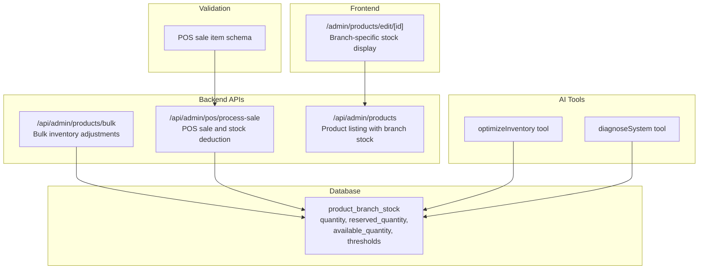
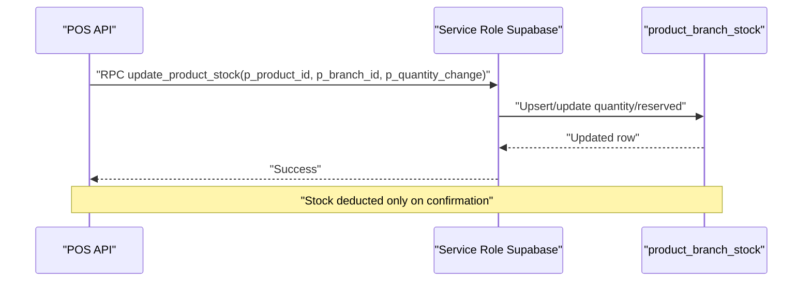
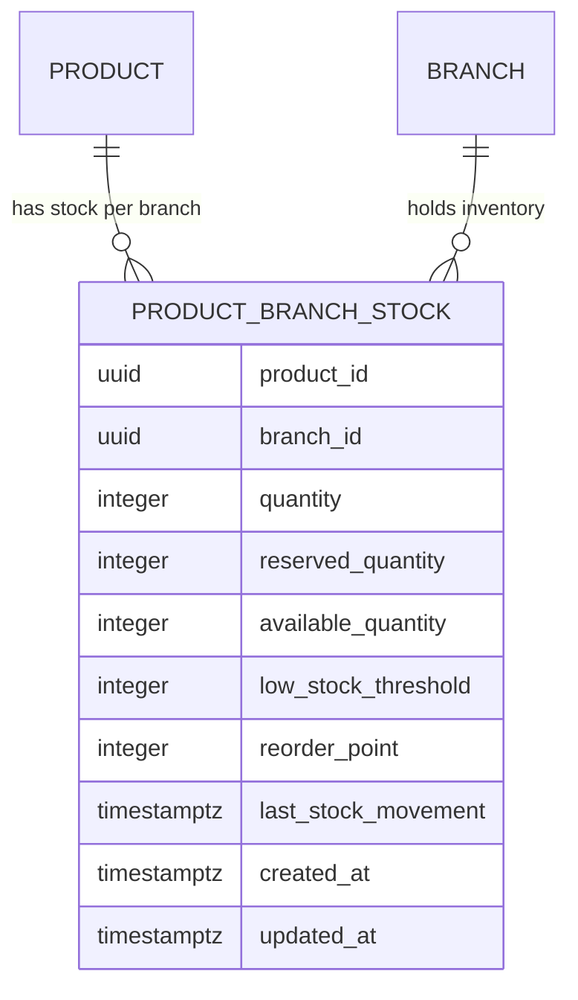
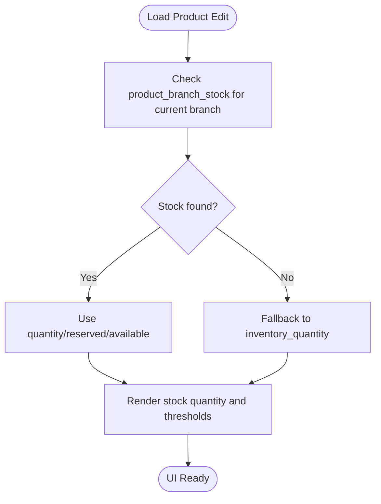
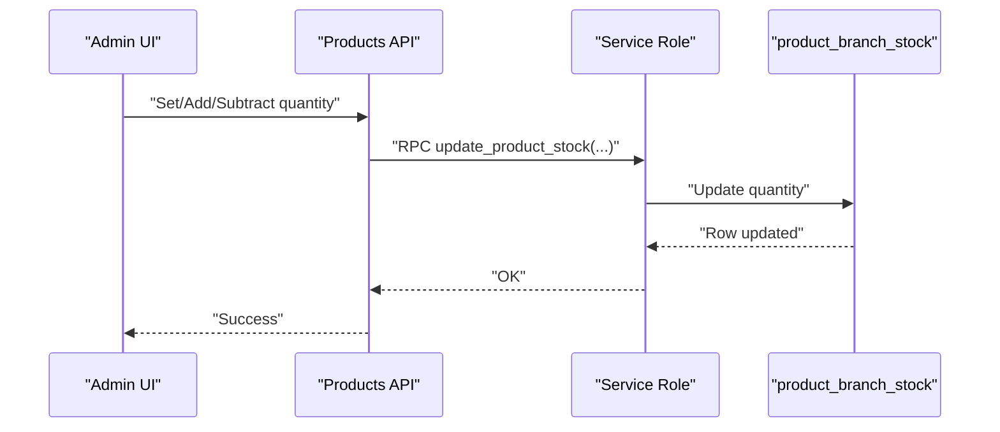
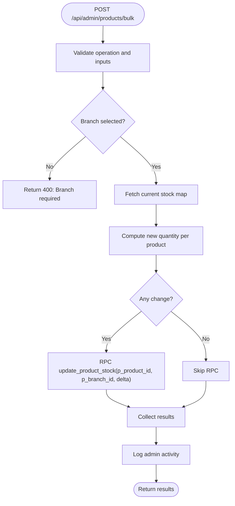
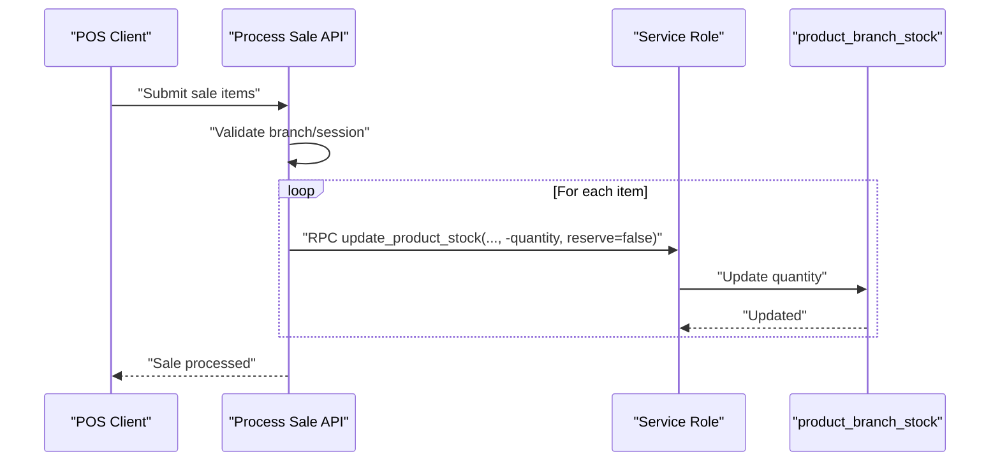
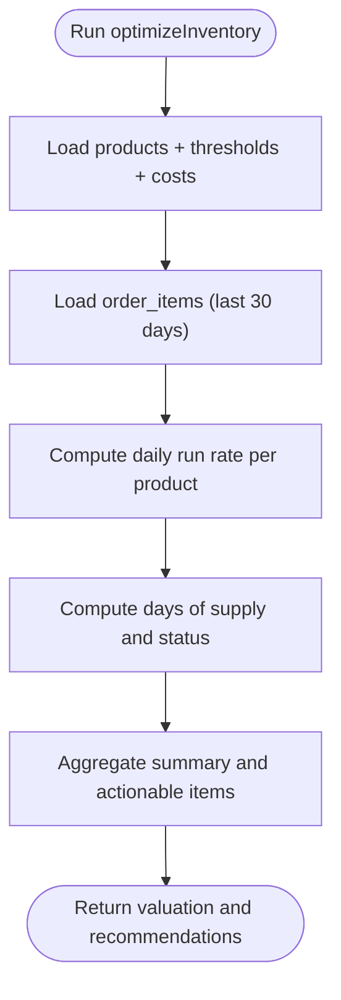
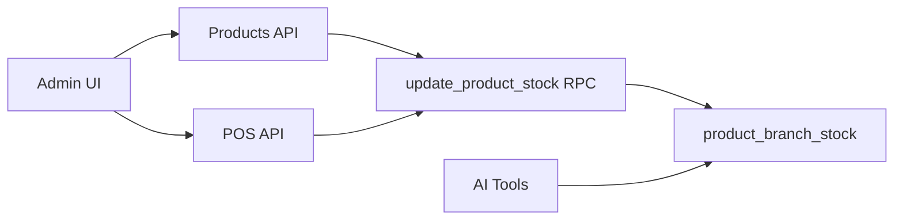

# Inventory Tracking System

<cite>
**Referenced Files in This Document**
- [20260120000000_refactor_separate_products_inventory.sql](file://supabase/migrations/20260120000000_refactor_separate_products_inventory.sql)
- [stock-helpers.ts](file://src/lib/inventory/stock-helpers.ts)
- [optimizeInventory.ts](file://src/lib/ai/tools/optimizeInventory.ts)
- [diagnoseSystem.ts](file://src/lib/ai/tools/diagnoseSystem.ts)
- [route.ts](file://src/app/api/admin/products/bulk/route.ts)
- [route.ts](file://src/app/api/admin/pos/process-sale/route.ts)
- [route.ts](file://src/app/api/admin/products/route.ts)
- [route.ts](file://src/app/api/ai/insights/prepare-data/route.ts)
- [route.ts](file://src/lib/api/validation/zod-schemas.ts)
- [page.tsx](file://src/app/admin/products/edit/[id]/page.tsx)
</cite>

## Table of Contents

1. [Introduction](#introduction)
2. [Project Structure](#project-structure)
3. [Core Components](#core-components)
4. [Architecture Overview](#architecture-overview)
5. [Detailed Component Analysis](#detailed-component-analysis)
6. [Dependency Analysis](#dependency-analysis)
7. [Performance Considerations](#performance-considerations)
8. [Troubleshooting Guide](#troubleshooting-guide)
9. [Conclusion](#conclusion)
10. [Appendices](#appendices)

## Introduction

This document describes the inventory tracking system for Opttius, focusing on stock level management and inventory control across multi-branch operations. It explains the inventory monitoring interface, adjustment workflows (manual, bulk, and POS-driven), statistics and reporting capabilities, synchronization across branches, and integration with POS sales data. It also documents the underlying data models, constraint validation, and performance optimizations for large inventories.

## Project Structure

The inventory system spans database migrations, backend APIs, frontend pages, and AI-powered tools:

- Database: product_branch_stock table with computed availability and thresholds
- Backend APIs: product bulk operations, POS sale processing, product listing with branch-aware stock
- Frontend: product edit page displaying branch-specific stock
- AI tools: inventory optimization and system diagnostics
- Validation: Zod schemas for POS sale items

**Diagram sources**

- [20260120000000_refactor_separate_products_inventory.sql](file://supabase/migrations/20260120000000_refactor_separate_products_inventory.sql#L1-L225)
- [route.ts](file://src/app/api/admin/products/bulk/route.ts#L1-L490)
- [route.ts](file://src/app/api/admin/pos/process-sale/route.ts#L1-L200)
- [route.ts](file://src/app/api/admin/products/route.ts#L430-L475)
- [page.tsx](file://src/app/admin/products/edit/[id]/page.tsx#L303-L339)
- [optimizeInventory.ts](file://src/lib/ai/tools/optimizeInventory.ts#L1-L186)
- [diagnoseSystem.ts](file://src/lib/ai/tools/diagnoseSystem.ts#L225-L305)
- [route.ts](file://src/lib/api/validation/zod-schemas.ts#L697-L712)

**Section sources**

- [20260120000000_refactor_separate_products_inventory.sql](file://supabase/migrations/20260120000000_refactor_separate_products_inventory.sql#L1-L225)
- [route.ts](file://src/app/api/admin/products/bulk/route.ts#L1-L490)
- [route.ts](file://src/app/api/admin/pos/process-sale/route.ts#L1-L200)
- [route.ts](file://src/app/api/admin/products/route.ts#L430-L475)
- [page.tsx](file://src/app/admin/products/edit/[id]/page.tsx#L303-L339)
- [optimizeInventory.ts](file://src/lib/ai/tools/optimizeInventory.ts#L1-L186)
- [diagnoseSystem.ts](file://src/lib/ai/tools/diagnoseSystem.ts#L225-L305)
- [route.ts](file://src/lib/api/validation/zod-schemas.ts#L697-L712)

## Core Components

- Inventory data model: product_branch_stock with computed available_quantity and thresholds
- Stock helpers: get, update, and upsert stock for a branch
- Bulk operations: set/add inventory quantities across multiple products
- POS integration: automatic stock deduction upon order confirmation
- Monitoring and diagnostics: low-stock alerts and system-wide inventory health
- Reporting: valuation, turnover analysis, and aging insights via AI tools

**Section sources**

- [20260120000000_refactor_separate_products_inventory.sql](file://supabase/migrations/20260120000000_refactor_separate_products_inventory.sql#L9-L31)
- [stock-helpers.ts](file://src/lib/inventory/stock-helpers.ts#L11-L171)
- [route.ts](file://src/app/api/admin/products/bulk/route.ts#L146-L288)
- [route.ts](file://src/app/api/admin/pos/process-sale/route.ts#L865-L951)
- [optimizeInventory.ts](file://src/lib/ai/tools/optimizeInventory.ts#L36-L186)
- [diagnoseSystem.ts](file://src/lib/ai/tools/diagnoseSystem.ts#L225-L305)

## Architecture Overview

The system separates product catalog from branch-specific inventory. Stock is tracked per product per branch with computed availability and configurable thresholds. POS sales trigger immediate stock deductions through a stored procedure, while bulk operations and manual adjustments use RPC functions. AI tools analyze inventory health and suggest optimizations.

**Diagram sources**

- [route.ts](file://src/app/api/admin/pos/process-sale/route.ts#L923-L949)
- [20260120000000_refactor_separate_products_inventory.sql](file://supabase/migrations/20260120000000_refactor_separate_products_inventory.sql#L74-L136)

**Section sources**

- [route.ts](file://src/app/api/admin/pos/process-sale/route.ts#L865-L951)
- [20260120000000_refactor_separate_products_inventory.sql](file://supabase/migrations/20260120000000_refactor_separate_products_inventory.sql#L74-L136)

## Detailed Component Analysis

### Inventory Data Model and Constraints

- product_branch_stock columns:
  - quantity: physical stock at branch (NOT NULL, default 0)
  - reserved_quantity: reserved for pending orders (NOT NULL, default 0)
  - available_quantity: computed as quantity - reserved_quantity
  - low_stock_threshold: alert threshold (default 5)
  - reorder_point: optional reorder trigger
  - last_stock_movement: timestamp of last change
- Indexes:
  - available_quantity for fast filtering
  - branch_id + available_quantity with low_stock_threshold for low-stock queries
- Functions:
  - get_product_stock: returns quantity, reserved, available, thresholds
  - update_product_stock: safe increment/decrement with creation on demand

**Diagram sources**

- [20260120000000_refactor_separate_products_inventory.sql](file://supabase/migrations/20260120000000_refactor_separate_products_inventory.sql#L9-L31)
- [20260120000000_refactor_separate_products_inventory.sql](file://supabase/migrations/20260120000000_refactor_separate_products_inventory.sql#L161-L169)

**Section sources**

- [20260120000000_refactor_separate_products_inventory.sql](file://supabase/migrations/20260120000000_refactor_separate_products_inventory.sql#L9-L31)
- [20260120000000_refactor_separate_products_inventory.sql](file://supabase/migrations/20260120000000_refactor_separate_products_inventory.sql#L161-L169)

### Inventory Monitoring Interface

- Branch-specific stock display:
  - Frontend reads product_branch_stock for the selected branch
  - Falls back to deprecated inventory_quantity for legacy products
- Low-stock thresholds:
  - available_quantity <= low_stock_threshold triggers alerts
  - Default threshold is 5; configurable per record

**Diagram sources**

- [page.tsx](file://src/app/admin/products/edit/[id]/page.tsx#L320-L339)
- [route.ts](file://src/app/api/admin/products/route.ts#L430-L475)

**Section sources**

- [page.tsx](file://src/app/admin/products/edit/[id]/page.tsx#L320-L339)
- [route.ts](file://src/app/api/admin/products/route.ts#L430-L475)

### Manual Stock Updates

- Single product adjustments:
  - AI tool supports set/add/subtract operations
  - Updates product_branch_stock via RPC update_product_stock
  - Also updates legacy inventory_quantity for backward compatibility
- Validation:
  - Zod schema allows negative unit_price for discounts in POS items

**Diagram sources**

- [route.ts](file://src/lib/api/validation/zod-schemas.ts#L697-L712)
- [optimizeInventory.ts](file://src/lib/ai/tools/optimizeInventory.ts#L36-L186)
- [20260120000000_refactor_separate_products_inventory.sql](file://supabase/migrations/20260120000000_refactor_separate_products_inventory.sql#L74-L136)

**Section sources**

- [route.ts](file://src/lib/api/validation/zod-schemas.ts#L697-L712)
- [optimizeInventory.ts](file://src/lib/ai/tools/optimizeInventory.ts#L36-L186)
- [20260120000000_refactor_separate_products_inventory.sql](file://supabase/migrations/20260120000000_refactor_separate_products_inventory.sql#L74-L136)

### Bulk Inventory Operations

- Supported operations:
  - set/add inventory quantities across multiple products
  - Update pricing, status, category, duplicate, archive/hard delete
- Behavior:
  - Requires branch selection; uses RPC update_product_stock for quantity changes
  - Logs admin activity for auditability

**Diagram sources**

- [route.ts](file://src/app/api/admin/products/bulk/route.ts#L146-L288)
- [20260120000000_refactor_separate_products_inventory.sql](file://supabase/migrations/20260120000000_refactor_separate_products_inventory.sql#L74-L136)

**Section sources**

- [route.ts](file://src/app/api/admin/products/bulk/route.ts#L146-L288)
- [20260120000000_refactor_separate_products_inventory.sql](file://supabase/migrations/20260120000000_refactor_separate_products_inventory.sql#L74-L136)

### Automated Stock Changes During Sales

- POS sale processing:
  - Validates branch access and cash register session
  - On confirmation, decrements stock via RPC update_product_stock
  - Handles missing stock records by initializing to zero then reducing
- Item schema:
  - Allows null product_id for services/discounts
  - Unit/total price can be negative for discounts

**Diagram sources**

- [route.ts](file://src/app/api/admin/pos/process-sale/route.ts#L865-L951)
- [route.ts](file://src/lib/api/validation/zod-schemas.ts#L697-L712)
- [20260120000000_refactor_separate_products_inventory.sql](file://supabase/migrations/20260120000000_refactor_separate_products_inventory.sql#L74-L136)

**Section sources**

- [route.ts](file://src/app/api/admin/pos/process-sale/route.ts#L865-L951)
- [route.ts](file://src/lib/api/validation/zod-schemas.ts#L697-L712)
- [20260120000000_refactor_separate_products_inventory.sql](file://supabase/migrations/20260120000000_refactor_separate_products_inventory.sql#L74-L136)

### Inventory Statistics and Reporting

- Valuation:
  - Sum of inventory_quantity × cost_price across products
- Turnover analysis:
  - Daily run rate computed from last 30 days of order_items
  - Days of supply = current stock / daily run rate
- Overstock/understock detection:
  - Out-of-stock, critical-low (< threshold), low-supply (< 14 days), overstock (> 6 months)
- Aging insights:
  - AI prepares-data endpoint identifies zombie and low-stock products

**Diagram sources**

- [optimizeInventory.ts](file://src/lib/ai/tools/optimizeInventory.ts#L36-L186)
- [route.ts](file://src/app/api/ai/insights/prepare-data/route.ts#L241-L285)

**Section sources**

- [optimizeInventory.ts](file://src/lib/ai/tools/optimizeInventory.ts#L36-L186)
- [route.ts](file://src/app/api/ai/insights/prepare-data/route.ts#L241-L285)

### Multi-Branch Inventory and Visibility

- Branch context:
  - APIs require branch selection for inventory operations
  - Super admin in global view selects a branch for stock updates
- Visibility:
  - Product listing includes branch-specific stock when a branch is selected
  - Fallback to legacy inventory_quantity for older records

**Section sources**

- [route.ts](file://src/app/api/admin/products/bulk/route.ts#L173-L205)
- [route.ts](file://src/app/api/admin/products/route.ts#L430-L475)

### Low-Stock Alerts and Notifications

- Threshold-based alerts:
  - available_quantity <= low_stock_threshold triggers low-stock
  - Zero stock triggers out-of-stock
- Notification system:
  - Triggers notify admin for low/out-of-stock events

**Section sources**

- [20260120000000_refactor_separate_products_inventory.sql](file://supabase/migrations/20260120000000_refactor_separate_products_inventory.sql#L40-L70)
- [20260120000000_refactor_separate_products_inventory.sql](file://supabase/migrations/20260120000000_refactor_separate_products_inventory.sql#L171-L212)

## Dependency Analysis

- Backend APIs depend on:
  - Supabase service role for secure RPC calls
  - Branch middleware for access control
  - Stored procedures for atomic stock updates
- Frontend depends on:
  - Product APIs for branch-scoped stock
  - Branch selector for visibility
- AI tools depend on:
  - Products and order_items tables for analysis
  - Organization scoping for multi-tenant data

**Diagram sources**

- [route.ts](file://src/app/api/admin/products/bulk/route.ts#L250-L260)
- [route.ts](file://src/app/api/admin/pos/process-sale/route.ts#L923-L929)
- [20260120000000_refactor_separate_products_inventory.sql](file://supabase/migrations/20260120000000_refactor_separate_products_inventory.sql#L74-L136)

**Section sources**

- [route.ts](file://src/app/api/admin/products/bulk/route.ts#L250-L260)
- [route.ts](file://src/app/api/admin/pos/process-sale/route.ts#L923-L929)
- [20260120000000_refactor_separate_products_inventory.sql](file://supabase/migrations/20260120000000_refactor_separate_products_inventory.sql#L74-L136)

## Performance Considerations

- Database indexes:
  - available_quantity for quick filtering
  - branch_id + available_quantity with WHERE clause for low-stock queries
- Generated columns:
  - available_quantity calculated from quantity - reserved_quantity
- Stored procedures:
  - Atomic updates minimize race conditions
- Batch operations:
  - Bulk API uses RPC per product; consider batching at caller level for very large sets
- Logging and error handling:
  - Non-fatal errors during stock updates prevent sale rollback while preserving logs

**Section sources**

- [20260120000000_refactor_separate_products_inventory.sql](file://supabase/migrations/20260120000000_refactor_separate_products_inventory.sql#L161-L169)
- [route.ts](file://src/app/api/admin/pos/process-sale/route.ts#L931-L941)

## Troubleshooting Guide

- Stock not updating on sale:
  - Verify branch_id is present and cash register is open
  - Check RPC error logs for update_product_stock failures
- Missing stock for a product:
  - Initial sale without prior stock creates record with quantity=0 then reduces
- Bulk operation fails:
  - Ensure branch is selected; verify RPC returns and logs
- Low stock alerts not firing:
  - Confirm low_stock_threshold is set appropriately
- Export shows incorrect stock:
  - When branch is selected, stock comes from product_branch_stock; otherwise legacy inventory_quantity is used

**Section sources**

- [route.ts](file://src/app/api/admin/pos/process-sale/route.ts#L865-L951)
- [route.ts](file://src/app/api/admin/products/bulk/route.ts#L173-L205)
- [route.ts](file://src/app/api/admin/products/route.ts#L430-L475)
- [20260120000000_refactor_separate_products_inventory.sql](file://supabase/migrations/20260120000000_refactor_separate_products_inventory.sql#L171-L212)

## Conclusion

The Opttius inventory system cleanly separates product definitions from branch-specific stock, ensuring accurate multi-branch visibility and control. POS sales drive real-time stock reductions, while bulk and manual adjustments maintain flexibility. AI tools provide actionable insights for valuation, turnover, and aging, and the database schema and stored procedures ensure reliability and performance.

## Appendices

### Example Workflows

- Manual stock set/add/subtract:
  - Use AI tool parameters to set/add/subtract quantity
  - RPC update_product_stock invoked per product
  - Legacy inventory_quantity updated for backward compatibility

- Bulk inventory adjustment:
  - Select branch, choose set/add, specify adjustment amount
  - For each product, compute new quantity and delta
  - Invoke RPC update_product_stock for non-zero deltas

- POS sale stock deduction:
  - Validate branch and open session
  - For each item, call RPC update_product_stock with negative quantity
  - Initialize missing stock records if needed

**Section sources**

- [optimizeInventory.ts](file://src/lib/ai/tools/optimizeInventory.ts#L36-L186)
- [route.ts](file://src/app/api/admin/products/bulk/route.ts#L146-L288)
- [route.ts](file://src/app/api/admin/pos/process-sale/route.ts#L865-L951)
