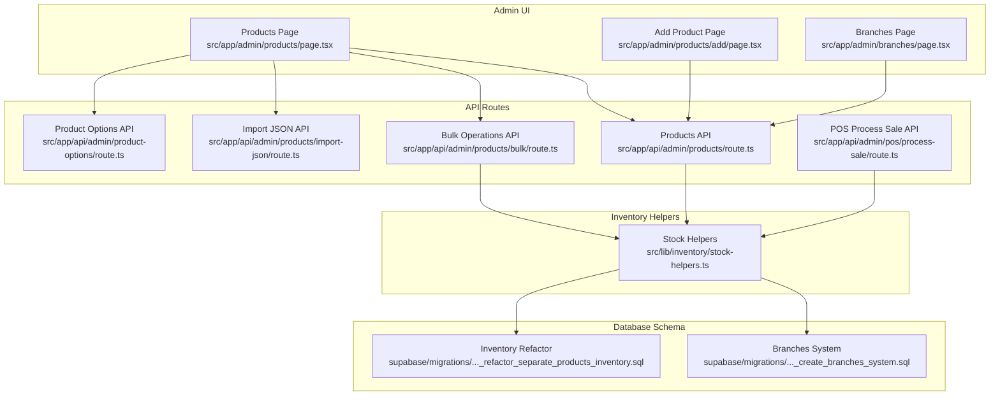
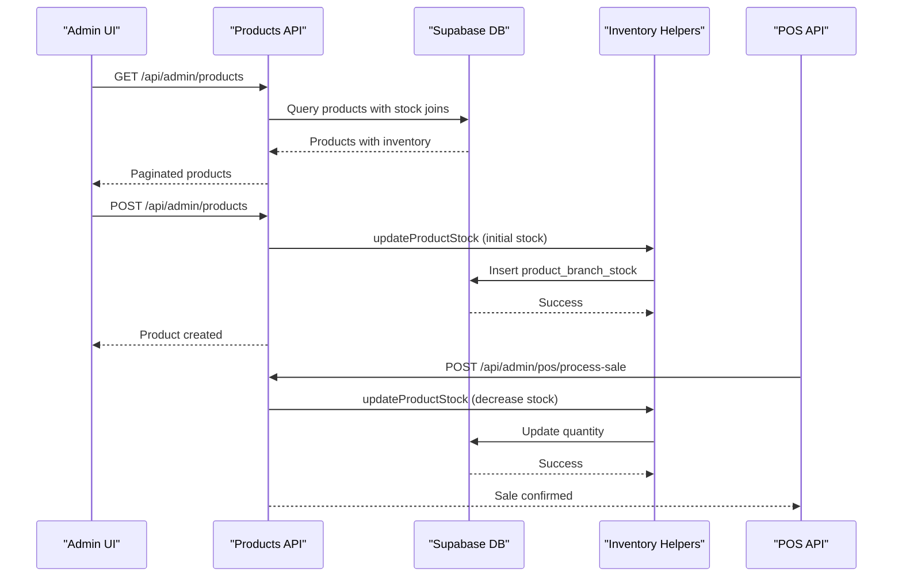
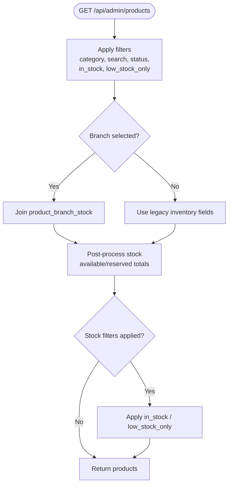
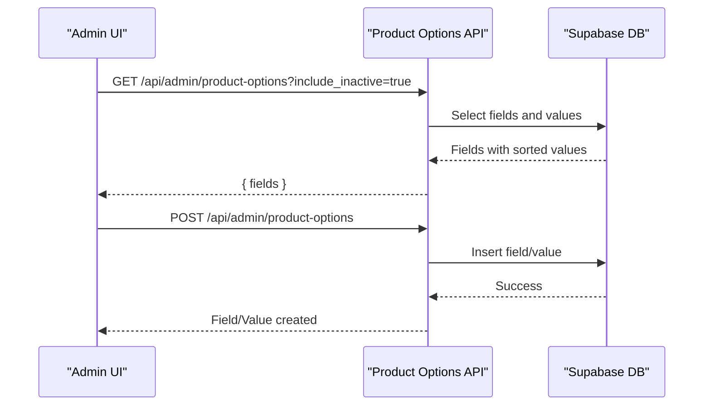
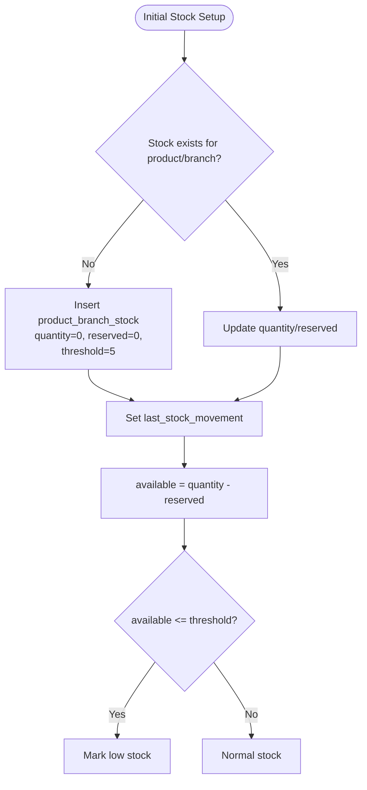
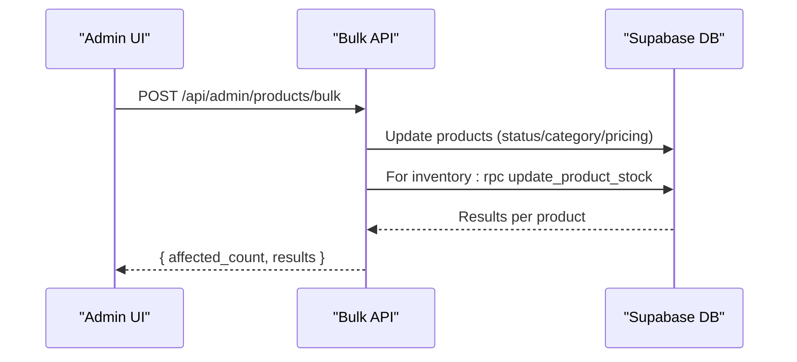
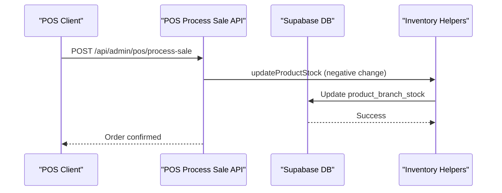
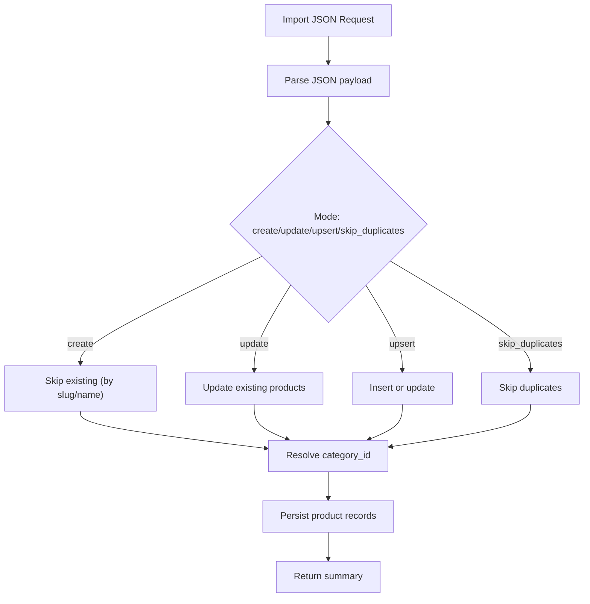
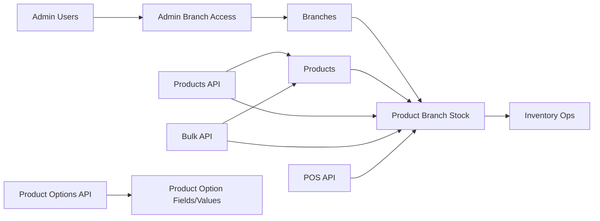

# Product & Inventory Management

<cite>
**Referenced Files in This Document**
- [products/page.tsx](file://src/app/admin/products/page.tsx)
- [products/add/page.tsx](file://src/app/admin/products/add/page.tsx)
- [products/route.ts](file://src/app/api/admin/products/route.ts)
- [products/bulk/route.ts](file://src/app/api/admin/products/bulk/route.ts)
- [products/import-json/route.ts](file://src/app/api/admin/products/import-json/route.ts)
- [product-options/route.ts](file://src/app/api/admin/product-options/route.ts)
- [product-options/[fieldKey]/route.ts](file://src/app/api/admin/product-options/[fieldKey]/route.ts)
- [branches/page.tsx](file://src/app/admin/branches/page.tsx)
- [pos/process-sale/route.ts](file://src/app/api/admin/pos/process-sale/route.ts)
- [stock-helpers.ts](file://src/lib/inventory/stock-helpers.ts)
- [20251216000000_create_branches_system.sql](file://supabase/migrations/20251216000000_create_branches_system.sql)
- [20260120000000_refactor_separate_products_inventory.sql](file://supabase/migrations/20260120000000_refactor_separate_products_inventory.sql)
</cite>

## Table of Contents

1. [Introduction](#introduction)
2. [Project Structure](#project-structure)
3. [Core Components](#core-components)
4. [Architecture Overview](#architecture-overview)
5. [Detailed Component Analysis](#detailed-component-analysis)
6. [Dependency Analysis](#dependency-analysis)
7. [Performance Considerations](#performance-considerations)
8. [Troubleshooting Guide](#troubleshooting-guide)
9. [Conclusion](#conclusion)

## Introduction

This document describes the optical product catalog and inventory management system within the Opttius application. It covers product catalog management (categories, pricing, product options), multi-branch inventory control (stock levels, low-stock alerts, reorder recommendations), product configuration (customizable options, variants, bulk operations), and integration points with POS sales and supplier workflows. The system is built on Next.js with Supabase for backend services and implements a multi-tenant, multi-branch architecture with centralized inventory tracking.

## Project Structure

The system is organized around:

- Admin UI pages for product management, bulk operations, and branch administration
- API routes for CRUD operations, bulk actions, POS integration, and product options
- Supabase migrations defining the data model for branches, inventory, and product options
- Shared inventory helpers for stock updates and queries

**Diagram sources**

- [products/page.tsx](file://src/app/admin/products/page.tsx#L1-L120)
- [products/add/page.tsx](file://src/app/admin/products/add/page.tsx#L1-L120)
- [products/route.ts](file://src/app/api/admin/products/route.ts#L1-L120)
- [products/bulk/route.ts](file://src/app/api/admin/products/bulk/route.ts#L1-L120)
- [products/import-json/route.ts](file://src/app/api/admin/products/import-json/route.ts#L1-L120)
- [product-options/route.ts](file://src/app/api/admin/product-options/route.ts#L1-L88)
- [pos/process-sale/route.ts](file://src/app/api/admin/pos/process-sale/route.ts#L1-L120)
- [stock-helpers.ts](file://src/lib/inventory/stock-helpers.ts#L1-L171)
- [20251216000000_create_branches_system.sql](file://supabase/migrations/20251216000000_create_branches_system.sql#L1-L120)
- [20260120000000_refactor_separate_products_inventory.sql](file://supabase/migrations/20260120000000_refactor_separate_products_inventory.sql#L1-L120)

**Section sources**

- [products/page.tsx](file://src/app/admin/products/page.tsx#L1-L120)
- [products/add/page.tsx](file://src/app/admin/products/add/page.tsx#L1-L120)
- [products/route.ts](file://src/app/api/admin/products/route.ts#L1-L120)
- [products/bulk/route.ts](file://src/app/api/admin/products/bulk/route.ts#L1-L120)
- [products/import-json/route.ts](file://src/app/api/admin/products/import-json/route.ts#L1-L120)
- [product-options/route.ts](file://src/app/api/admin/product-options/route.ts#L1-L88)
- [branches/page.tsx](file://src/app/admin/branches/page.tsx#L1-L120)
- [pos/process-sale/route.ts](file://src/app/api/admin/pos/process-sale/route.ts#L1-L120)
- [stock-helpers.ts](file://src/lib/inventory/stock-helpers.ts#L1-L171)
- [20251216000000_create_branches_system.sql](file://supabase/migrations/20251216000000_create_branches_system.sql#L1-L120)
- [20260120000000_refactor_separate_products_inventory.sql](file://supabase/migrations/20260120000000_refactor_separate_products_inventory.sql#L1-L120)

## Core Components

- Product Catalog Management: CRUD operations, search, filtering, pricing, categories, and status management.
- Product Options System: Configurable option fields and values for product customization.
- Multi-Branch Inventory: Branch-scoped stock, reserved quantities, low-stock thresholds, and reorder points.
- Bulk Operations: Mass updates for pricing, inventory, status, and deletion.
- POS Integration: Real-time stock reduction during point-of-sale transactions.
- Supplier Integration: JSON import/export for product catalogs and supplier data exchange.

**Section sources**

- [products/route.ts](file://src/app/api/admin/products/route.ts#L24-L120)
- [products/bulk/route.ts](file://src/app/api/admin/products/bulk/route.ts#L46-L120)
- [stock-helpers.ts](file://src/lib/inventory/stock-helpers.ts#L11-L171)
- [pos/process-sale/route.ts](file://src/app/api/admin/pos/process-sale/route.ts#L17-L120)
- [products/import-json/route.ts](file://src/app/api/admin/products/import-json/route.ts#L31-L120)

## Architecture Overview

The system separates product catalog data from inventory, storing stock per branch. Multi-branch access control ensures users only operate within their assigned branches. Inventory updates occur via stored procedures and helper functions to maintain consistency.

**Diagram sources**

- [products/route.ts](file://src/app/api/admin/products/route.ts#L24-L120)
- [stock-helpers.ts](file://src/lib/inventory/stock-helpers.ts#L67-L171)
- [pos/process-sale/route.ts](file://src/app/api/admin/pos/process-sale/route.ts#L17-L120)

## Detailed Component Analysis

### Product Catalog Management

- Product listing with filtering by category, status, search, and stock conditions.
- Branch-aware visibility: global vs branch-specific products.
- Pricing fields, tax inclusion, compare-at pricing, and cost price.
- Status lifecycle: draft, active, archived.
- Multi-tenant isolation via organization_id.

**Diagram sources**

- [products/route.ts](file://src/app/api/admin/products/route.ts#L24-L120)
- [products/route.ts](file://src/app/api/admin/products/route.ts#L377-L531)

**Section sources**

- [products/route.ts](file://src/app/api/admin/products/route.ts#L24-L531)
- [products/page.tsx](file://src/app/admin/products/page.tsx#L1-L120)

### Product Options System

- Centralized option fields and values for product customization.
- Categories: general, frame, lens, accessory.
- Dynamic option loading and management via API endpoints.

**Diagram sources**

- [product-options/route.ts](file://src/app/api/admin/product-options/route.ts#L7-L64)
- [product-options/[fieldKey]/route.ts](file://src/app/api/admin/product-options/[fieldKey]/route.ts#L41-L67)

**Section sources**

- [product-options/route.ts](file://src/app/api/admin/product-options/route.ts#L1-L88)
- [product-options/[fieldKey]/route.ts](file://src/app/api/admin/product-options/[fieldKey]/route.ts#L41-L67)

### Multi-Branch Inventory Control

- Branch-scoped stock with reserved quantities and available stock calculation.
- Low-stock thresholds and reorder points.
- Stored procedures for safe stock updates and movement timestamps.

**Diagram sources**

- [stock-helpers.ts](file://src/lib/inventory/stock-helpers.ts#L11-L171)
- [20260120000000_refactor_separate_products_inventory.sql](file://supabase/migrations/20260120000000_refactor_separate_products_inventory.sql#L74-L136)

**Section sources**

- [stock-helpers.ts](file://src/lib/inventory/stock-helpers.ts#L11-L247)
- [20260120000000_refactor_separate_products_inventory.sql](file://supabase/migrations/20260120000000_refactor_separate_products_inventory.sql#L1-L225)

### Bulk Operations

- Mass updates for pricing, inventory, status, category, duplication, and deletion.
- Batch stock adjustments using stored procedure for consistency.

**Diagram sources**

- [products/bulk/route.ts](file://src/app/api/admin/products/bulk/route.ts#L46-L288)

**Section sources**

- [products/bulk/route.ts](file://src/app/api/admin/products/bulk/route.ts#L1-L490)

### POS Integration and Inventory Updates

- POS sale processing reduces stock atomically using stored procedures.
- Initial stock records created if missing during sale processing.

**Diagram sources**

- [pos/process-sale/route.ts](file://src/app/api/admin/pos/process-sale/route.ts#L17-L120)
- [stock-helpers.ts](file://src/lib/inventory/stock-helpers.ts#L67-L171)

**Section sources**

- [pos/process-sale/route.ts](file://src/app/api/admin/pos/process-sale/route.ts#L1-L200)
- [pos/process-sale/route.ts](file://src/app/api/admin/pos/process-sale/route.ts#L891-L921)

### Supplier Integration and Data Exchange

- JSON import/export for product catalogs supporting create/update/upsert modes.
- Category resolution by name or slug.

**Diagram sources**

- [products/import-json/route.ts](file://src/app/api/admin/products/import-json/route.ts#L31-L316)

**Section sources**

- [products/import-json/route.ts](file://src/app/api/admin/products/import-json/route.ts#L1-L316)

## Dependency Analysis

- Branches and Access Control: Admin users gain branch access via admin_branch_access; policies restrict stock visibility and modification.
- Inventory Dependencies: product_branch_stock depends on products and branches; stored procedures ensure atomic updates.
- API Dependencies: Products API depends on branch context middleware; POS API depends on inventory helpers.

**Diagram sources**

- [20251216000000_create_branches_system.sql](file://supabase/migrations/20251216000000_create_branches_system.sql#L1-L397)
- [20260120000000_refactor_separate_products_inventory.sql](file://supabase/migrations/20260120000000_refactor_separate_products_inventory.sql#L1-L225)

**Section sources**

- [20251216000000_create_branches_system.sql](file://supabase/migrations/20251216000000_create_branches_system.sql#L1-L397)
- [20260120000000_refactor_separate_products_inventory.sql](file://supabase/migrations/20260120000000_refactor_separate_products_inventory.sql#L1-L225)

## Performance Considerations

- Indexes on product_branch_stock for available_quantity and branch_id improve filtering and low-stock reporting.
- Generated column available_quantity reduces computation overhead in queries.
- Stored procedures centralize stock updates to minimize race conditions.
- Pagination and post-filtering for stock conditions balance accuracy and performance.

[No sources needed since this section provides general guidance]

## Troubleshooting Guide

- Unauthorized Access: Ensure admin authentication and branch access checks pass before modifying products or inventory.
- Missing Branch Context: Bulk inventory operations require a selected branch; super admins can auto-select an accessible branch.
- Stock Update Failures: Verify product_branch_stock records exist or allow automatic creation; check stored procedure errors.
- POS Cash Register Closed: Open a cash register session before processing sales.

**Section sources**

- [products/bulk/route.ts](file://src/app/api/admin/products/bulk/route.ts#L173-L205)
- [pos/process-sale/route.ts](file://src/app/api/admin/pos/process-sale/route.ts#L144-L181)

## Conclusion

The Opttius product and inventory management system provides a robust, multi-branch solution for optical product catalogs and stock control. Its separation of product and inventory data, combined with stored procedures and branch-level access control, enables scalable operations across multiple locations while maintaining real-time stock accuracy and auditability.
