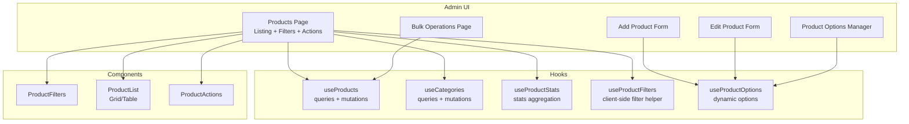
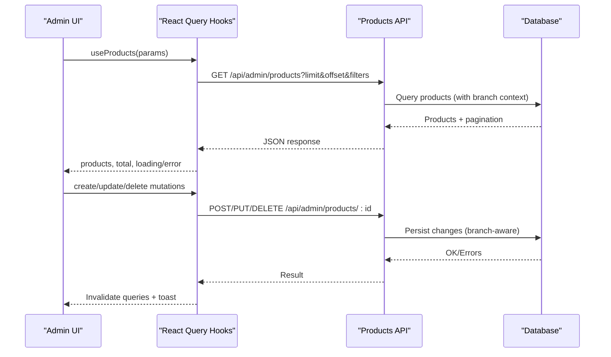
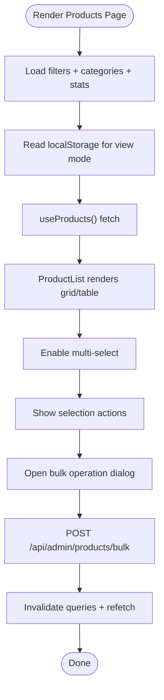
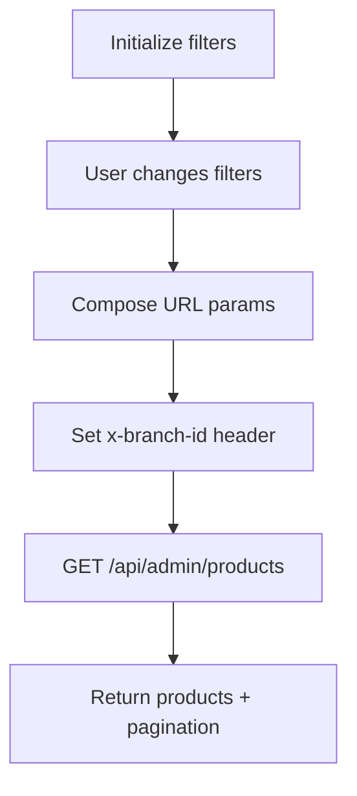
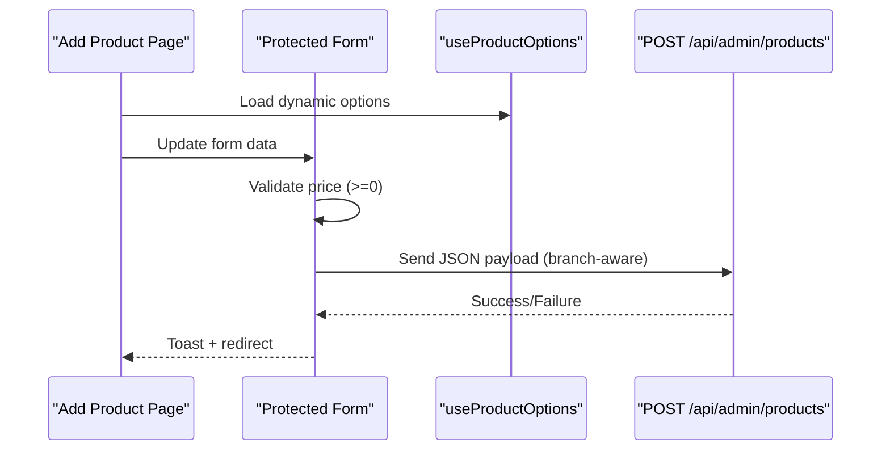
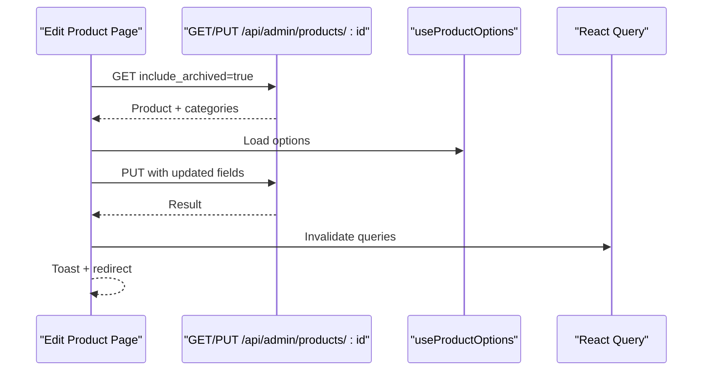
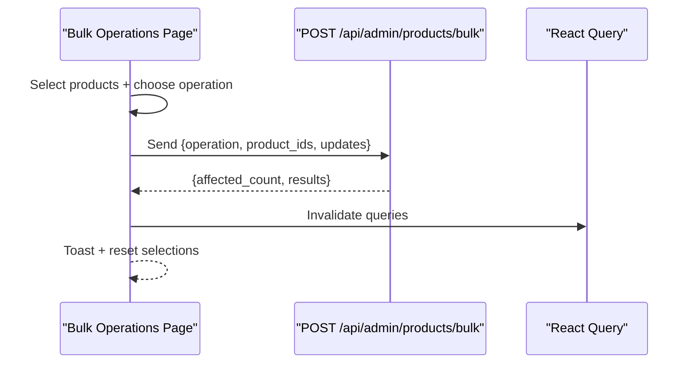
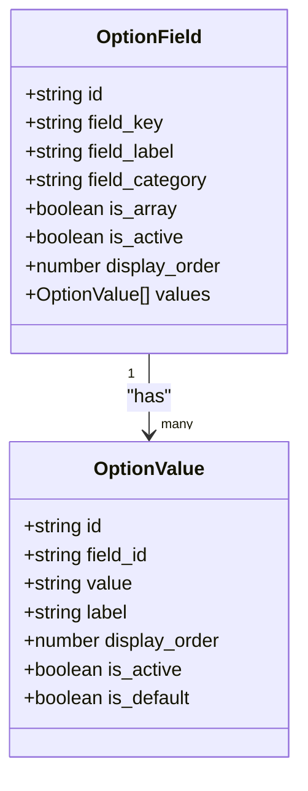
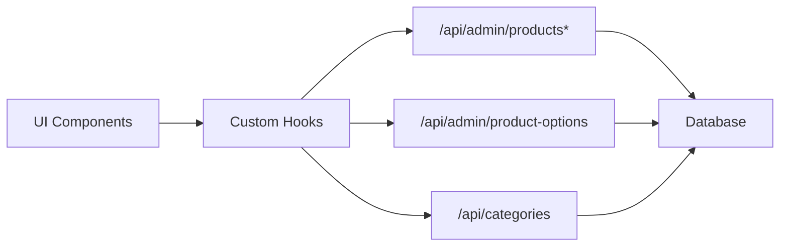

# Product Catalog Management

<cite>
**Referenced Files in This Document**
- [page.tsx](file://src/app/admin/products/page.tsx)
- [page.tsx](file://src/app/admin/products/add/page.tsx)
- [page.tsx](file://src/app/admin/products/edit/[id]/page.tsx)
- [page.tsx](file://src/app/admin/products/bulk/page.tsx)
- [page.tsx](file://src/app/admin/products/options/page.tsx)
- [ProductFilters.tsx](file://src/app/admin/products/components/ProductFilters.tsx)
- [ProductList.tsx](file://src/app/admin/products/components/ProductList.tsx)
- [ProductActions.tsx](file://src/app/admin/products/components/ProductActions.tsx)
- [useProducts.ts](file://src/app/admin/products/hooks/useProducts.ts)
- [useCategories.ts](file://src/app/admin/products/hooks/useCategories.ts)
- [useProductStats.ts](file://src/app/admin/products/hooks/useProductStats.ts)
- [useProductFilters.ts](file://src/app/admin/products/hooks/useProductFilters.ts)
- [useProductOptions.ts](file://src/hooks/useProductOptions.ts)
</cite>

## Table of Contents

1. [Introduction](#introduction)
2. [Project Structure](#project-structure)
3. [Core Components](#core-components)
4. [Architecture Overview](#architecture-overview)
5. [Detailed Component Analysis](#detailed-component-analysis)
6. [Dependency Analysis](#dependency-analysis)
7. [Performance Considerations](#performance-considerations)
8. [Troubleshooting Guide](#troubleshooting-guide)
9. [Conclusion](#conclusion)

## Introduction

This document describes the product catalog management system, covering the complete product listing interface (grid and table views), filtering and search, CRUD workflows (create, read, update, delete), bulk operations, product options customization, integration with categories, pricing display, and inventory indicators. It also includes practical examples and troubleshooting guidance for common catalog management issues.

## Project Structure

The product catalog is implemented as a Next.js Admin application with modular components and hooks:

- Listing and management: Products page, filters, actions, pagination, and stats
- Creation: Add product form with validation and image upload
- Editing: Edit product form with field-level validation, image upload, and status management
- Bulk operations: Mass update/delete via CSV/JSON import/export and bulk action dialogs
- Options: Centralized product option management for configurable attributes
- Hooks: React Query-based data fetching and mutations for products, categories, stats, and filters

**Diagram sources**

- [page.tsx](file://src/app/admin/products/page.tsx#L72-L800)
- [page.tsx](file://src/app/admin/products/add/page.tsx#L40-L800)
- [page.tsx](file://src/app/admin/products/edit/[id]/page.tsx#L27-L800)
- [page.tsx](file://src/app/admin/products/bulk/page.tsx#L94-L800)
- [page.tsx](file://src/app/admin/products/options/page.tsx#L57-L526)
- [ProductFilters.tsx](file://src/app/admin/products/components/ProductFilters.tsx#L30-L137)
- [ProductList.tsx](file://src/app/admin/products/components/ProductList.tsx#L19-L57)
- [ProductActions.tsx](file://src/app/admin/products/components/ProductActions.tsx#L33-L119)
- [useProducts.ts](file://src/app/admin/products/hooks/useProducts.ts#L103-L225)
- [useCategories.ts](file://src/app/admin/products/hooks/useCategories.ts#L22-L124)
- [useProductStats.ts](file://src/app/admin/products/hooks/useProductStats.ts#L79-L98)
- [useProductFilters.ts](file://src/app/admin/products/hooks/useProductFilters.ts#L20-L51)
- [useProductOptions.ts](file://src/hooks/useProductOptions.ts#L30-L73)

**Section sources**

- [page.tsx](file://src/app/admin/products/page.tsx#L72-L800)
- [ProductFilters.tsx](file://src/app/admin/products/components/ProductFilters.tsx#L30-L137)
- [ProductList.tsx](file://src/app/admin/products/components/ProductList.tsx#L19-L57)
- [ProductActions.tsx](file://src/app/admin/products/components/ProductActions.tsx#L33-L119)
- [useProducts.ts](file://src/app/admin/products/hooks/useProducts.ts#L103-L225)
- [useCategories.ts](file://src/app/admin/products/hooks/useCategories.ts#L22-L124)
- [useProductStats.ts](file://src/app/admin/products/hooks/useProductStats.ts#L79-L98)
- [useProductFilters.ts](file://src/app/admin/products/hooks/useProductFilters.ts#L20-L51)
- [useProductOptions.ts](file://src/hooks/useProductOptions.ts#L30-L73)

## Core Components

- Product listing page with grid/table view modes, pagination, and selection for bulk operations
- Filtering and search by category, status, and low stock
- Product creation form with mandatory fields, optional configurations, and validation rules
- Product editing form with field-level validation, image uploads, and status management
- Bulk operations via CSV/JSON import/export and mass updates/deletes
- Product options manager for customizable attributes and variants
- Integration with categories, pricing display, and inventory indicators

**Section sources**

- [page.tsx](file://src/app/admin/products/page.tsx#L72-L800)
- [page.tsx](file://src/app/admin/products/add/page.tsx#L40-L800)
- [page.tsx](file://src/app/admin/products/edit/[id]/page.tsx#L27-L800)
- [page.tsx](file://src/app/admin/products/bulk/page.tsx#L94-L800)
- [page.tsx](file://src/app/admin/products/options/page.tsx#L57-L526)

## Architecture Overview

The system follows a layered architecture:

- UI Layer: Pages and components for listing, forms, filters, actions, and options
- Hooks Layer: React Query hooks for data fetching, caching, and mutations
- API Integration: Fetches from /api/admin/products, /api/admin/products/bulk, /api/admin/product-options, and /api/categories

**Diagram sources**

- [useProducts.ts](file://src/app/admin/products/hooks/useProducts.ts#L47-L101)
- [useProducts.ts](file://src/app/admin/products/hooks/useProducts.ts#L122-L209)
- [page.tsx](file://src/app/admin/products/page.tsx#L110-L126)

## Detailed Component Analysis

### Product Listing Interface (Grid and Table Views)

- View modes: Grid and table toggle with persistent preferences in localStorage
- Pagination: Controlled by items per page and current page, with total calculation
- Selection: Multi-select for bulk operations with select-all capability
- Inventory indicators: Uses total_inventory_quantity and availability metrics when present
- Status badges: Visual indicators for active/draft/archived

**Diagram sources**

- [page.tsx](file://src/app/admin/products/page.tsx#L72-L190)
- [ProductList.tsx](file://src/app/admin/products/components/ProductList.tsx#L19-L57)
- [useProducts.ts](file://src/app/admin/products/hooks/useProducts.ts#L103-L121)

**Section sources**

- [page.tsx](file://src/app/admin/products/page.tsx#L72-L190)
- [ProductList.tsx](file://src/app/admin/products/components/ProductList.tsx#L19-L57)
- [useProducts.ts](file://src/app/admin/products/hooks/useProducts.ts#L103-L121)

### Filtering and Search

- Filters: Category, status, low stock toggle, and search term
- Client-side helper: applyFilters for demo/testing scenarios
- Server-side filtering: useProducts composes query parameters and branch headers

**Diagram sources**

- [useProductFilters.ts](file://src/app/admin/products/hooks/useProductFilters.ts#L20-L51)
- [useProducts.ts](file://src/app/admin/products/hooks/useProducts.ts#L47-L101)
- [ProductFilters.tsx](file://src/app/admin/products/components/ProductFilters.tsx#L30-L137)

**Section sources**

- [useProductFilters.ts](file://src/app/admin/products/hooks/useProductFilters.ts#L20-L51)
- [useProducts.ts](file://src/app/admin/products/hooks/useProducts.ts#L47-L101)
- [ProductFilters.tsx](file://src/app/admin/products/components/ProductFilters.tsx#L30-L137)

### Product Creation Workflow (Add Product Form)

- Mandatory fields: product_type, name, price, category_id (when applicable), branch context
- Optional configurations: SKU, barcode, brand, manufacturer, model, frame/lens attributes, warranty, tags, images
- Validation: Frontend checks for price numeric and non-negative, branch selection, and slug generation
- Submission: POST /api/admin/products with branch-aware headers

**Diagram sources**

- [page.tsx](file://src/app/admin/products/add/page.tsx#L40-L606)
- [useProductOptions.ts](file://src/hooks/useProductOptions.ts#L30-L73)

**Section sources**

- [page.tsx](file://src/app/admin/products/add/page.tsx#L40-L606)
- [useProductOptions.ts](file://src/hooks/useProductOptions.ts#L30-L73)

### Product Editing Workflow (Edit Product Form)

- Preload: Fetch product and categories with branch context; handle archived inclusion
- Dynamic options: Load product options for selects
- Field-level validation: Numbers parsed to floats/integers; arrays handled safely
- Submission: PUT /api/admin/products/:id with branch-aware headers
- Cache invalidation: Invalidate products and stats queries after successful update

**Diagram sources**

- [page.tsx](file://src/app/admin/products/edit/[id]/page.tsx#L27-L652)
- [useProductOptions.ts](file://src/hooks/useProductOptions.ts#L30-L73)

**Section sources**

- [page.tsx](file://src/app/admin/products/edit/[id]/page.tsx#L27-L652)
- [useProductOptions.ts](file://src/hooks/useProductOptions.ts#L30-L73)

### Bulk Operations

- Supported operations: update status, update category, adjust prices, adjust inventory, duplicate, archive, hard delete
- CSV/JSON import/export: Dedicated dialogs and endpoints
- Validation: Client-side checks for inventory adjustments; server-side enforcement for bulk updates
- Execution: POST /api/admin/products/bulk with branch context

**Diagram sources**

- [page.tsx](file://src/app/admin/products/bulk/page.tsx#L94-L260)
- [page.tsx](file://src/app/admin/products/page.tsx#L209-L276)

**Section sources**

- [page.tsx](file://src/app/admin/products/bulk/page.tsx#L94-L260)
- [page.tsx](file://src/app/admin/products/page.tsx#L209-L276)

### Product Options System

- Centralized management: Define field keys, labels, categories, and selectable values
- Dynamic form integration: useProductOptions loads options for product forms
- Activation controls: Enable/disable values and mark defaults
- Categories: General, Frame, Lens, Accessory

**Diagram sources**

- [useProductOptions.ts](file://src/hooks/useProductOptions.ts#L3-L28)
- [page.tsx](file://src/app/admin/products/options/page.tsx#L36-L56)

**Section sources**

- [useProductOptions.ts](file://src/hooks/useProductOptions.ts#L3-L73)
- [page.tsx](file://src/app/admin/products/options/page.tsx#L57-L526)

### Categories Integration

- Categories loaded via /api/categories
- Used in product forms and filters
- CRUD operations supported via dedicated hooks

**Section sources**

- [useCategories.ts](file://src/app/admin/products/hooks/useCategories.ts#L22-L124)
- [page.tsx](file://src/app/admin/products/components/ProductFilters.tsx#L66-L96)

### Pricing Display and Inventory Indicators

- Pricing: Numeric fields validated and formatted; tax-inclusive flag stored per product
- Inventory: Uses total_inventory_quantity and availability metrics when available; falls back to legacy inventory_quantity
- Stats: Total products, active products, low stock count, and total inventory value computed client-side

**Section sources**

- [useProducts.ts](file://src/app/admin/products/hooks/useProducts.ts#L7-L23)
- [useProductStats.ts](file://src/app/admin/products/hooks/useProductStats.ts#L28-L77)

## Dependency Analysis

- Coupling: Components depend on shared hooks for data and mutations
- Branch context: All product APIs accept x-branch-id header for tenant isolation
- External dependencies: React Query for caching and optimistic updates, Sonner for notifications

**Diagram sources**

- [useProducts.ts](file://src/app/admin/products/hooks/useProducts.ts#L103-L225)
- [useProductOptions.ts](file://src/hooks/useProductOptions.ts#L30-L73)
- [useCategories.ts](file://src/app/admin/products/hooks/useCategories.ts#L22-L124)

**Section sources**

- [useProducts.ts](file://src/app/admin/products/hooks/useProducts.ts#L103-L225)
- [useProductOptions.ts](file://src/hooks/useProductOptions.ts#L30-L73)
- [useCategories.ts](file://src/app/admin/products/hooks/useCategories.ts#L22-L124)

## Performance Considerations

- Caching: Queries are cached with stale times to reduce network requests
- Branch-aware queries: Efficient filtering by branch reduces payload sizes
- Memoization: ProductList is memoized to prevent unnecessary re-renders
- Pagination: Server-side pagination prevents large dataset rendering

[No sources needed since this section provides general guidance]

## Troubleshooting Guide

Common issues and resolutions:

- Price validation errors: Ensure price is a numeric value greater than or equal to zero
- Branch context missing: Verify branch selection or super admin global mode
- Import failures: Check CSV/JSON format against template; review error/warning summaries
- Low stock alerts: Use the low stock filter to identify products with inventory ≤ 5
- Cache not updating: Trigger manual refetch or wait for automatic cache staleness

**Section sources**

- [page.tsx](file://src/app/admin/products/add/page.tsx#L437-L450)
- [page.tsx](file://src/app/admin/products/bulk/page.tsx#L292-L328)
- [useProducts.ts](file://src/app/admin/products/hooks/useProducts.ts#L142-L150)

## Conclusion

The product catalog management system provides a robust, branch-aware interface for managing products with flexible views, powerful filtering, comprehensive CRUD workflows, and scalable bulk operations. Centralized product options enable consistent configuration across forms, while integrated categories, pricing, and inventory indicators deliver a complete management experience.
