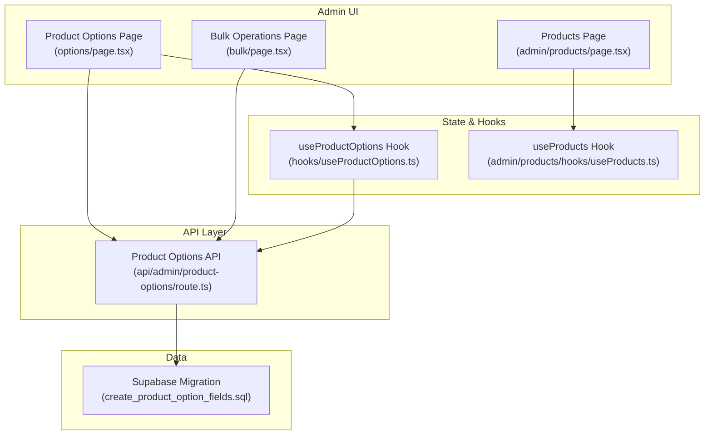
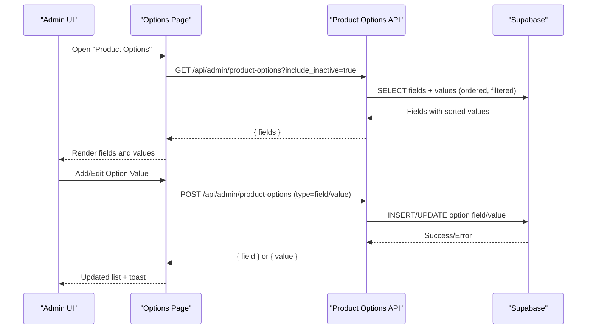
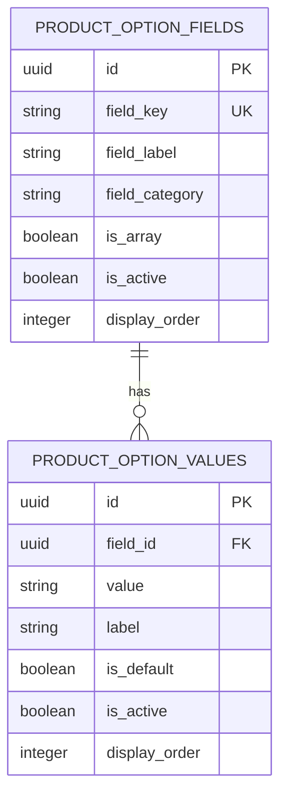
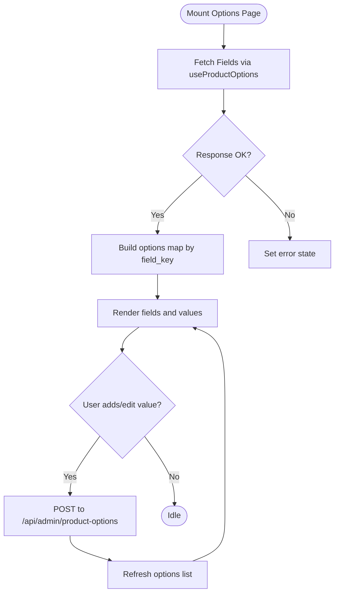
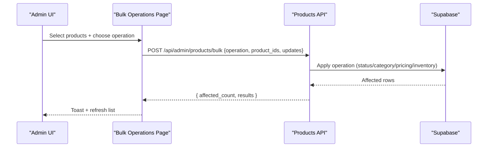
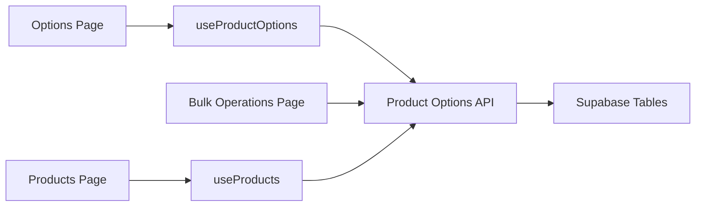

# Product Options & Variants

<cite>
**Referenced Files in This Document**
- [page.tsx](file://src/app/admin/products/options/page.tsx)
- [route.ts](file://src/app/api/admin/product-options/route.ts)
- [useProductOptions.ts](file://src/hooks/useProductOptions.ts)
- [20250127000000_create_product_option_fields.sql](file://supabase/migrations/20250127000000_create_product_option_fields.sql)
- [page.tsx](file://src/app/admin/products/bulk/page.tsx)
- [page.tsx](file://src/app/admin/products/page.tsx)
- [useProducts.ts](file://src/app/admin/products/hooks/useProducts.ts)
</cite>

## Table of Contents

1. [Introduction](#introduction)
2. [Project Structure](#project-structure)
3. [Core Components](#core-components)
4. [Architecture Overview](#architecture-overview)
5. [Detailed Component Analysis](#detailed-component-analysis)
6. [Dependency Analysis](#dependency-analysis)
7. [Performance Considerations](#performance-considerations)
8. [Troubleshooting Guide](#troubleshooting-guide)
9. [Conclusion](#conclusion)

## Introduction

This document explains the product options and variants system in the application. It covers:

- Configurable product attributes (option fields) and their values
- How option values combine to generate product variants
- Variant management in the admin interface (creation, pricing adjustments, inventory tracking)
- Option field configuration (types, validation, display preferences)
- Bulk operations for option management (mass updates, option value creation, variant deletion workflows)
- Integrations with inventory tracking, pricing calculations, and customer selection interfaces
- Examples for setting up configurations, managing variant inventories, and troubleshooting option-related issues
- Technical implementation of dynamic option rendering and state management

## Project Structure

The product options and variants functionality spans frontend pages, API routes, hooks, and database migrations:

- Frontend pages for option management and bulk operations
- API route for retrieving and mutating option fields/values
- React hook for dynamic option loading
- Supabase migration seeding default option fields and values

**Diagram sources**

- [page.tsx](file://src/app/admin/products/options/page.tsx#L57-L96)
- [page.tsx](file://src/app/admin/products/bulk/page.tsx#L94-L147)
- [page.tsx](file://src/app/admin/products/page.tsx#L72-L133)
- [route.ts](file://src/app/api/admin/product-options/route.ts#L1-L64)
- [useProductOptions.ts](file://src/hooks/useProductOptions.ts#L46-L72)
- [useProducts.ts](file://src/app/admin/products/hooks/useProducts.ts#L103-L225)
- [20250127000000_create_product_option_fields.sql](file://supabase/migrations/20250127000000_create_product_option_fields.sql#L144-L324)

**Section sources**

- [page.tsx](file://src/app/admin/products/options/page.tsx#L57-L96)
- [route.ts](file://src/app/api/admin/product-options/route.ts#L1-L64)
- [useProductOptions.ts](file://src/hooks/useProductOptions.ts#L46-L72)
- [20250127000000_create_product_option_fields.sql](file://supabase/migrations/20250127000000_create_product_option_fields.sql#L144-L324)
- [page.tsx](file://src/app/admin/products/bulk/page.tsx#L94-L147)
- [page.tsx](file://src/app/admin/products/page.tsx#L72-L133)
- [useProducts.ts](file://src/app/admin/products/hooks/useProducts.ts#L103-L225)

## Core Components

- Option Fields and Values
  - Option fields define product attributes (e.g., frame type, lens material).
  - Each field has associated values with labels, ordering, and defaults.
  - The system supports single-value and array-type fields (e.g., features).
- Dynamic Option Rendering
  - The useProductOptions hook loads fields and values for the current context.
  - The options page renders fields and allows adding/editing values.
- Variant Generation
  - Variants are formed by combining option values across fields.
  - Inventory and pricing are tracked per variant.
- Bulk Operations
  - Mass updates for status, category, pricing, and inventory.
  - CSV import/export for efficient option/value management.
- Admin Interfaces
  - Product options page for configuring fields and values.
  - Bulk operations page for mass actions.
  - Products page for viewing and managing variants.

**Section sources**

- [route.ts](file://src/app/api/admin/product-options/route.ts#L7-L64)
- [useProductOptions.ts](file://src/hooks/useProductOptions.ts#L46-L72)
- [page.tsx](file://src/app/admin/products/options/page.tsx#L57-L96)
- [page.tsx](file://src/app/admin/products/bulk/page.tsx#L177-L260)
- [page.tsx](file://src/app/admin/products/page.tsx#L209-L276)

## Architecture Overview

The system integrates frontend UI, API routes, and database-backed option metadata.

**Diagram sources**

- [page.tsx](file://src/app/admin/products/options/page.tsx#L81-L96)
- [route.ts](file://src/app/api/admin/product-options/route.ts#L66-L88)
- [20250127000000_create_product_option_fields.sql](file://supabase/migrations/20250127000000_create_product_option_fields.sql#L144-L324)

## Detailed Component Analysis

### Option Field Configuration

- Purpose
  - Define product attributes (e.g., frame type, lens material, UV protection).
- Schema and Defaults
  - Fields include keys, labels, categories (general/frame/lens/accessory), array flag, and display order.
  - Default fields and values are seeded via migration.
- Display Preferences
  - Values are ordered by display_order and optionally filtered by activity.
- Validation Rules
  - Fields can be activated/deactivated; inactive values are hidden unless explicitly requested.

**Diagram sources**

- [20250127000000_create_product_option_fields.sql](file://supabase/migrations/20250127000000_create_product_option_fields.sql#L144-L324)

**Section sources**

- [route.ts](file://src/app/api/admin/product-options/route.ts#L7-L64)
- [20250127000000_create_product_option_fields.sql](file://supabase/migrations/20250127000000_create_product_option_fields.sql#L144-L324)

### Dynamic Option Rendering and State Management

- useProductOptions Hook
  - Loads fields and values on mount.
  - Exposes loading/error states and a refresh function.
- Options Page
  - Renders fields and values.
  - Provides dialogs to add/edit values with validation and defaults.

**Diagram sources**

- [useProductOptions.ts](file://src/hooks/useProductOptions.ts#L46-L72)
- [page.tsx](file://src/app/admin/products/options/page.tsx#L81-L96)
- [route.ts](file://src/app/api/admin/product-options/route.ts#L66-L88)

**Section sources**

- [useProductOptions.ts](file://src/hooks/useProductOptions.ts#L46-L72)
- [page.tsx](file://src/app/admin/products/options/page.tsx#L57-L96)
- [route.ts](file://src/app/api/admin/product-options/route.ts#L66-L88)

### Variant Generation and Management

- Variant Creation
  - Variants are generated by combining option values across fields.
  - Inventory and pricing are maintained per variant.
- Pricing Adjustments
  - Bulk pricing adjustments support percentage or fixed amount increases/decreases.
- Inventory Tracking
  - Per-variant inventory quantities can be set or adjusted in bulk.
- Deletion Workflows
  - Soft delete archives variants; hard delete removes them permanently.

**Diagram sources**

- [page.tsx](file://src/app/admin/products/bulk/page.tsx#L177-L260)
- [page.tsx](file://src/app/admin/products/page.tsx#L209-L276)

**Section sources**

- [page.tsx](file://src/app/admin/products/bulk/page.tsx#L177-L260)
- [page.tsx](file://src/app/admin/products/page.tsx#L209-L276)

### Integration with Inventory and Pricing

- Inventory
  - Products expose total/current branch inventory metrics.
  - Bulk operations adjust inventory quantities per product/variant.
- Pricing
  - Bulk pricing operations support percentage or fixed adjustments.
- Customer Selection
  - Option fields drive customer-facing selection (e.g., frame type, lens material).
  - Values are ordered and filtered for display.

**Section sources**

- [useProducts.ts](file://src/app/admin/products/hooks/useProducts.ts#L7-L23)
- [page.tsx](file://src/app/admin/products/bulk/page.tsx#L391-L487)
- [page.tsx](file://src/app/admin/products/page.tsx#L468-L560)

### Bulk Operations for Option Management

- Mass Updates
  - Update status, category, pricing, and inventory across selected products.
- Option Value Creation
  - Use the options page to add new values to existing fields.
- Variant Deletion
  - Archive or hard delete variants with confirmation dialogs and safeguards.

**Section sources**

- [page.tsx](file://src/app/admin/products/bulk/page.tsx#L341-L540)
- [page.tsx](file://src/app/admin/products/options/page.tsx#L81-L96)

## Dependency Analysis

- Frontend depends on:
  - useProductOptions for option metadata
  - useProducts for product listing and mutations
  - API route for CRUD on option fields/values
- Backend depends on:
  - Supabase tables for option fields and values
  - Ordered retrieval and optional filtering by activity

**Diagram sources**

- [useProductOptions.ts](file://src/hooks/useProductOptions.ts#L46-L72)
- [route.ts](file://src/app/api/admin/product-options/route.ts#L1-L64)
- [page.tsx](file://src/app/admin/products/bulk/page.tsx#L94-L147)
- [useProducts.ts](file://src/app/admin/products/hooks/useProducts.ts#L103-L225)

**Section sources**

- [useProductOptions.ts](file://src/hooks/useProductOptions.ts#L46-L72)
- [route.ts](file://src/app/api/admin/product-options/route.ts#L1-L64)
- [page.tsx](file://src/app/admin/products/bulk/page.tsx#L94-L147)
- [useProducts.ts](file://src/app/admin/products/hooks/useProducts.ts#L103-L225)

## Performance Considerations

- Client-side caching and invalidation
  - React Query caches product lists and invalidates on mutations to keep views fresh.
- Efficient option loading
  - useProductOptions loads once and exposes a refresh function.
- API filtering
  - Option queries support category and activity filters to reduce payload sizes.

[No sources needed since this section provides general guidance]

## Troubleshooting Guide

- Options not appearing
  - Ensure fields are active and values are active; inactive values are hidden unless explicitly requested.
  - Use include_inactive=true when fetching options for administrative tasks.
- Bulk operation failures
  - Verify selected products and operation type; check toast messages for validation errors.
  - Confirm branch context headers are present for global vs. branch-specific operations.
- Import/Export issues
  - Validate CSV format and supported fields; review import results for errors and warnings.

**Section sources**

- [route.ts](file://src/app/api/admin/product-options/route.ts#L33-L45)
- [page.tsx](file://src/app/admin/products/bulk/page.tsx#L177-L260)
- [page.tsx](file://src/app/admin/products/bulk/page.tsx#L292-L328)

## Conclusion

The product options and variants system provides a robust foundation for configurable products:

- Administrators can define and manage option fields and values
- Variants are generated from value combinations and tracked with inventory and pricing
- Bulk operations streamline mass updates and option management
- Dynamic rendering and state management deliver a responsive admin experience

[No sources needed since this section summarizes without analyzing specific files]
