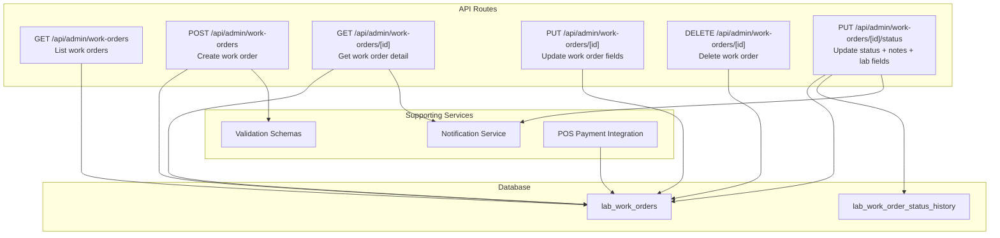
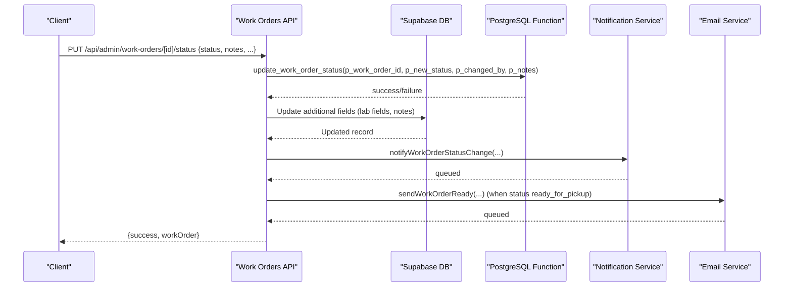
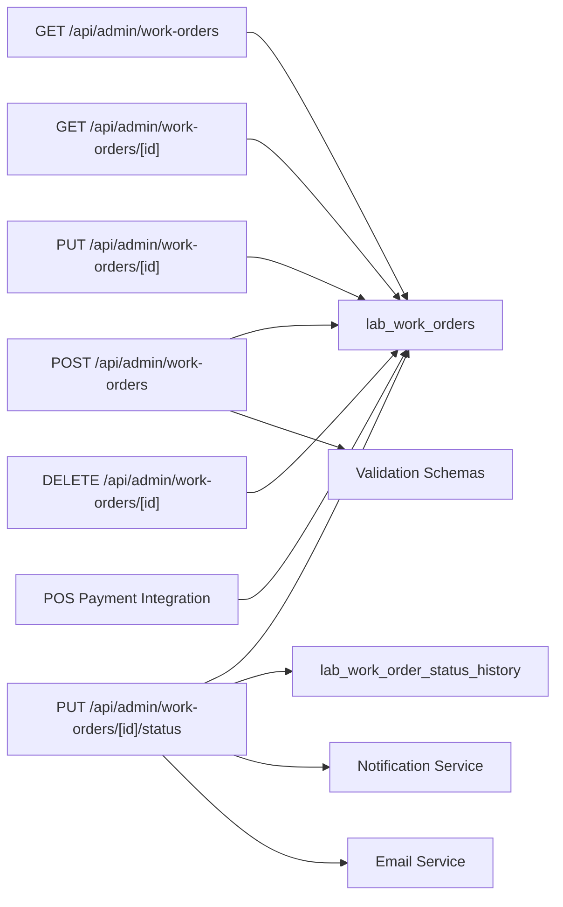

# Laboratory Integration & API

<cite>
**Referenced Files in This Document**
- [route.ts](file://src/app/api/admin/work-orders/route.ts)
- [route.ts](file://src/app/api/admin/work-orders/[id]/route.ts)
- [route.ts](file://src/app/api/admin/work-orders/[id]/status/route.ts)
- [zod-schemas.ts](file://src/lib/api/validation/zod-schemas.ts)
- [20250125000000_create_lab_work_orders_system.sql](file://supabase/migrations/20250125000000_create_lab_work_orders_system.sql)
- [notification-service.ts](file://src/lib/notifications/notification-service.ts)
- [WebhookMonitor.tsx](file://src/components/admin/WebhookMonitor.tsx)
- [pay route.ts](file://src/app/api/admin/pos/pending-balance/pay/route.ts)
</cite>

## Table of Contents

1. [Introduction](#introduction)
2. [Project Structure](#project-structure)
3. [Core Components](#core-components)
4. [Architecture Overview](#architecture-overview)
5. [Detailed Component Analysis](#detailed-component-analysis)
6. [Dependency Analysis](#dependency-analysis)
7. [Performance Considerations](#performance-considerations)
8. [Troubleshooting Guide](#troubleshooting-guide)
9. [Conclusion](#conclusion)
10. [Appendices](#appendices)

## Introduction

This document provides comprehensive API documentation for laboratory integration endpoints focused on work order management. It covers listing, creation (from POS), status updates, and deletion of lab work orders. It also explains authentication and authorization, request/response schemas, webhook handling for status updates, real-time synchronization mechanisms, database operations, transactions, and integration guidelines for optical laboratories.

## Project Structure

The work order API is implemented as Next.js routes under the admin API namespace. Supporting components include:

- Validation schemas for request bodies
- Database schema for lab work orders and status history
- Notification service for status change alerts
- POS integration for payment-driven delivery
- Front-end monitoring for webhook events

**Diagram sources**

- [route.ts](file://src/app/api/admin/work-orders/route.ts#L15-L198)
- [route.ts](file://src/app/api/admin/work-orders/[id]/route.ts#L11-L98)
- [route.ts](file://src/app/api/admin/work-orders/[id]/status/route.ts#L10-L238)
- [zod-schemas.ts](file://src/lib/api/validation/zod-schemas.ts#L550-L749)
- [20250125000000_create_lab_work_orders_system.sql](file://supabase/migrations/20250125000000_create_lab_work_orders_system.sql#L71-L220)
- [pay route.ts](file://src/app/api/admin/pos/pending-balance/pay/route.ts#L195-L231)

**Section sources**

- [route.ts](file://src/app/api/admin/work-orders/route.ts#L15-L198)
- [route.ts](file://src/app/api/admin/work-orders/[id]/route.ts#L11-L98)
- [route.ts](file://src/app/api/admin/work-orders/[id]/status/route.ts#L10-L238)
- [zod-schemas.ts](file://src/lib/api/validation/zod-schemas.ts#L550-L749)
- [20250125000000_create_lab_work_orders_system.sql](file://supabase/migrations/20250125000000_create_lab_work_orders_system.sql#L71-L220)
- [pay route.ts](file://src/app/api/admin/pos/pending-balance/pay/route.ts#L195-L231)

## Core Components

- Work Orders Listing Endpoint: GET /api/admin/work-orders
- Work Order Creation Endpoint: POST /api/admin/work-orders
- Work Order Detail Endpoint: GET /api/admin/work-orders/[id]
- Work Order Update Endpoint: PUT /api/admin/work-orders/[id]
- Work Order Deletion Endpoint: DELETE /api/admin/work-orders/[id]
- Work Order Status Update Endpoint: PUT /api/admin/work-orders/[id]/status

Authentication and authorization require admin access. Branch-aware filtering ensures data isolation across multi-branch organizations.

**Section sources**

- [route.ts](file://src/app/api/admin/work-orders/route.ts#L15-L198)
- [route.ts](file://src/app/api/admin/work-orders/[id]/route.ts#L11-L98)
- [route.ts](file://src/app/api/admin/work-orders/[id]/status/route.ts#L10-L238)

## Architecture Overview

The system integrates POS payments with work order delivery, supports lab-specific status updates, and triggers notifications and emails upon key transitions.

**Diagram sources**

- [route.ts](file://src/app/api/admin/work-orders/[id]/status/route.ts#L10-L238)
- [notification-service.ts](file://src/lib/notifications/notification-service.ts#L242-L341)

## Detailed Component Analysis

### Authentication and Authorization

- All endpoints require a valid session via Supabase auth.
- Admin verification is performed using an RPC function to ensure the user has administrative privileges.
- Branch access validation ensures users can only operate on work orders within their assigned branch or organization.

Key checks:

- User retrieval and admin role verification
- Branch context extraction and access validation
- Service role client usage for privileged operations

**Section sources**

- [route.ts](file://src/app/api/admin/work-orders/route.ts#L15-L36)
- [route.ts](file://src/app/api/admin/work-orders/[id]/route.ts#L11-L35)
- [route.ts](file://src/app/api/admin/work-orders/[id]/route.ts#L66-L77)
- [route.ts](file://src/app/api/admin/work-orders/[id]/status/route.ts#L18-L35)

### GET /api/admin/work-orders (List Work Orders)

Purpose: Retrieve paginated work orders with optional filters and related data.

Query parameters:

- status: Filter by status (all, ordered, sent_to_lab, etc.)
- customer_id: Filter by customer ID
- page: Page number (default 1)
- limit: Items per page (default 20)

Response:

- workOrders: Array of work orders with embedded relations (customer, prescription, quote, frame_product, assigned_staff)
- pagination: { page, limit, total, totalPages }

Implementation highlights:

- Branch-aware filtering using a shared middleware
- Batch queries to avoid N+1 when fetching related entities
- Exact row counting for pagination

**Section sources**

- [route.ts](file://src/app/api/admin/work-orders/route.ts#L15-L198)
- [20250125000000_create_lab_work_orders_system.sql](file://supabase/migrations/20250125000000_create_lab_work_orders_system.sql#L213-L220)

### POST /api/admin/work-orders (Create Work Order)

Purpose: Create a new work order, optionally snapshotting a prescription and triggering status date updates.

Request body (validated):

- customer_id, prescription_id (optional), quote_id (optional), frame_product_id (optional)
- frame_name, frame_brand, frame_model, frame_color, frame_size, frame_sku
- frame_serial_number (optional), lens_type, lens_material, lens_index (optional)
- lens_treatments (array), lens_tint_color (optional), lens_tint_percentage (optional)
- lab_name, lab_contact, lab_order_number, lab_estimated_delivery_date (optional)
- status (default "quote"), payment_status (default "pending"), currency (default "CLP")
- Costs: frame_cost, lens_cost, treatments_cost, labor_cost, lab_cost, subtotal, tax_amount, discount_amount, total_amount
- Payment: payment_method, deposit_amount, balance_amount
- POS: pos_order_id (optional)
- Notes: internal_notes, customer_notes
- Assignment: assigned_to (defaults to creator), created_by

Behavior:

- Generates a unique work order number via a PostgreSQL function
- Optionally snapshots the prescription at creation time
- If status is not "quote", invokes a function to update status timestamps and history
- Emits a non-blocking notification for new work order creation

Validation:

- Uses a Zod schema to validate and sanitize incoming data.

**Section sources**

- [route.ts](file://src/app/api/admin/work-orders/route.ts#L200-L437)
- [zod-schemas.ts](file://src/lib/api/validation/zod-schemas.ts#L550-L749)
- [20250125000000_create_lab_work_orders_system.sql](file://supabase/migrations/20250125000000_create_lab_work_orders_system.sql#L71-L184)

### GET /api/admin/work-orders/[id] (Get Work Order Detail)

Purpose: Retrieve a single work order with related entities and status history.

Response:

- workOrder: Work order with embedded relations
- statusHistory: Ordered list of status changes

Access control:

- Validates admin access and branch permissions before returning data.

**Section sources**

- [route.ts](file://src/app/api/admin/work-orders/[id]/route.ts#L11-L98)
- [20250125000000_create_lab_work_orders_system.sql](file://supabase/migrations/20250125000000_create_lab_work_orders_system.sql#L188-L205)

### PUT /api/admin/work-orders/[id] (Update Work Order Fields)

Purpose: Update non-status fields such as frame/lens details, costs, payment fields, notes, and assignment.

Allowed fields:

- Frame: frame_name, frame_brand, frame_model, frame_color, frame_size, frame_sku, frame_serial_number
- Lens: lens_type, lens_material, lens_index, lens_treatments, lens_tint_color, lens_tint_percentage
- Lab: lab_name, lab_contact, lab_order_number, lab_estimated_delivery_date
- Payments: payment_status, payment_method, deposit_amount, balance_amount, total_amount, subtotal, tax_amount, discount_amount
- Notes: internal_notes, customer_notes, lab_notes, quality_notes
- Assignment: assigned_to, lab_contact_person

Behavior:

- Validates branch access
- Updates only provided fields
- Returns the updated work order

**Section sources**

- [route.ts](file://src/app/api/admin/work-orders/[id]/route.ts#L100-L289)

### DELETE /api/admin/work-orders/[id] (Delete Work Order)

Purpose: Remove a work order with safety checks.

Constraints:

- Prevents deletion of delivered work orders unless explicitly allowed
- Prevents deletion of work orders with payments registered unless explicitly allowed
- Cascades deletion of status history
- If the work order originated from a quote, attempts to delete the quote as well

Response:

- success and message on successful deletion

**Section sources**

- [route.ts](file://src/app/api/admin/work-orders/[id]/route.ts#L291-L422)

### PUT /api/admin/work-orders/[id]/status (Update Status + Notes + Lab Fields)

Purpose: Change work order status and optionally attach notes and lab-specific fields.

Request body:

- status: Required. Must be a valid status value
- notes: Optional. Notes attached to the status change
- Additional fields: lab_name, lab_contact, lab_order_number, lab_estimated_delivery_date, lab_notes, quality_notes, internal_notes, customer_notes, assigned_to, lab_contact_person

Behavior:

- Verifies admin access and branch permissions
- Calls a PostgreSQL function to update status and record history
- Optionally updates additional fields atomically
- Emits notifications for status changes
- Sends a customer-ready email when status becomes ready_for_pickup

Integration note:

- This endpoint is the primary mechanism for external labs to report status changes and associated metadata.

**Section sources**

- [route.ts](file://src/app/api/admin/work-orders/[id]/status/route.ts#L10-L238)
- [notification-service.ts](file://src/lib/notifications/notification-service.ts#L242-L341)

### Request/Response Schemas

Validation and field definitions are centralized in the validation module. The schema covers:

- Product/frame fields (name, brand, model, color, size, SKU)
- Lens fields (type, material, index, treatments, tint)
- Cost and payment fields (subtotal, tax, discount, total, deposit, balance, payment status/method)
- Notes and lab fields (internal, customer, lab, quality)
- Optional identifiers (customer, prescription, quote, frame product, POS order)

These schemas ensure consistent validation across creation and updates.

**Section sources**

- [zod-schemas.ts](file://src/lib/api/validation/zod-schemas.ts#L550-L749)

### Database Operations and Transactions

- Work order creation uses a service role client to bypass Row Level Security and generate a unique number via a PostgreSQL function.
- Status updates leverage a dedicated function to maintain atomicity and auditability.
- Status history is recorded automatically on status changes.
- Deletion cascades to status history; optional quote deletion is attempted after work order removal.

Indexes:

- Dedicated indexes on customer_id, status, work_order_number, prescription_id, quote_id, assigned_to, and created_at improve query performance.

**Section sources**

- [route.ts](file://src/app/api/admin/work-orders/route.ts#L252-L261)
- [route.ts](file://src/app/api/admin/work-orders/[id]/status/route.ts#L80-L88)
- [20250125000000_create_lab_work_orders_system.sql](file://supabase/migrations/20250125000000_create_lab_work_orders_system.sql#L71-L184)
- [20250125000000_create_lab_work_orders_system.sql](file://supabase/migrations/20250125000000_create_lab_work_orders_system.sql#L188-L220)

### Real-Time Synchronization and Notifications

- Status change notifications are emitted asynchronously.
- When a work order reaches ready_for_pickup, a customer email is sent using the organization context.
- A front-end monitor allows administrators to observe webhook activity and test endpoints.

**Section sources**

- [route.ts](file://src/app/api/admin/work-orders/[id]/status/route.ts#L165-L224)
- [notification-service.ts](file://src/lib/notifications/notification-service.ts#L242-L341)
- [WebhookMonitor.tsx](file://src/components/admin/WebhookMonitor.tsx#L96-L141)

### POS Integration and Payment-Driven Delivery

- When payments are processed in POS, pending balances are resolved and work orders are updated accordingly.
- If a work order becomes fully paid, it may be transitioned to delivered automatically.

**Section sources**

- [pay route.ts](file://src/app/api/admin/pos/pending-balance/pay/route.ts#L195-L231)

## Dependency Analysis

**Diagram sources**

- [route.ts](file://src/app/api/admin/work-orders/route.ts#L15-L198)
- [route.ts](file://src/app/api/admin/work-orders/[id]/route.ts#L11-L422)
- [route.ts](file://src/app/api/admin/work-orders/[id]/status/route.ts#L10-L238)
- [zod-schemas.ts](file://src/lib/api/validation/zod-schemas.ts#L550-L749)
- [20250125000000_create_lab_work_orders_system.sql](file://supabase/migrations/20250125000000_create_lab_work_orders_system.sql#L71-L220)
- [pay route.ts](file://src/app/api/admin/pos/pending-balance/pay/route.ts#L195-L231)

**Section sources**

- [route.ts](file://src/app/api/admin/work-orders/route.ts#L15-L198)
- [route.ts](file://src/app/api/admin/work-orders/[id]/route.ts#L11-L422)
- [route.ts](file://src/app/api/admin/work-orders/[id]/status/route.ts#L10-L238)
- [zod-schemas.ts](file://src/lib/api/validation/zod-schemas.ts#L550-L749)
- [20250125000000_create_lab_work_orders_system.sql](file://supabase/migrations/20250125000000_create_lab_work_orders_system.sql#L71-L220)
- [pay route.ts](file://src/app/api/admin/pos/pending-balance/pay/route.ts#L195-L231)

## Performance Considerations

- Pagination and exact counts are used to prevent heavy scans.
- Batch queries fetch related entities in bulk to avoid N+1.
- Indexes on frequently filtered and sorted columns improve query performance.
- Asynchronous notifications and email sends prevent blocking the API response.

[No sources needed since this section provides general guidance]

## Troubleshooting Guide

Common issues and resolutions:

- Unauthorized or forbidden access: Ensure the user has admin privileges and proper branch access.
- Validation errors on creation: Confirm request body conforms to the validation schema.
- Status update failures: Verify the status value is valid and the function executed successfully.
- Deletion blocked: Adjust allowDelivered flag or resolve payment statuses before deletion.
- Missing related data: Confirm that customer, prescription, quote, and product records exist.

Monitoring:

- Use the Webhook Monitor to inspect webhook logs and test endpoints.

**Section sources**

- [route.ts](file://src/app/api/admin/work-orders/route.ts#L191-L197)
- [route.ts](file://src/app/api/admin/work-orders/[id]/route.ts#L320-L380)
- [route.ts](file://src/app/api/admin/work-orders/[id]/status/route.ts#L90-L99)
- [WebhookMonitor.tsx](file://src/components/admin/WebhookMonitor.tsx#L96-L141)

## Conclusion

The laboratory integration endpoints provide a robust, branch-aware, and auditable system for managing work orders. They support creation from POS, granular updates, status reporting, and automated notifications. The design emphasizes data consistency, performance, and operational safety.

[No sources needed since this section summarizes without analyzing specific files]

## Appendices

### API Usage Examples

- List work orders: GET /api/admin/work-orders?page=1&limit=20&status=ordered
- Create work order: POST /api/admin/work-orders with validated JSON payload
- Update work order fields: PUT /api/admin/work-orders/[id] with partial fields
- Update status: PUT /api/admin/work-orders/[id]/status with { status, notes, ... }
- Delete work order: DELETE /api/admin/work-orders/[id] with optional allowDelivered flag

### Error Responses

Typical HTTP status codes:

- 401 Unauthorized: Invalid or missing session
- 403 Forbidden: Non-admin or insufficient branch access
- 404 Not Found: Work order does not exist
- 400 Bad Request: Validation errors or constraints (e.g., delivered work order deletion)
- 500 Internal Server Error: Unexpected server errors

**Section sources**

- [route.ts](file://src/app/api/admin/work-orders/route.ts#L24-L36)
- [route.ts](file://src/app/api/admin/work-orders/[id]/route.ts#L140-L159)
- [route.ts](file://src/app/api/admin/work-orders/[id]/status/route.ts#L41-L46)

### Rate Limiting Considerations

- No explicit rate limiting is implemented in the referenced code.
- Recommendations: Apply rate limiting at the edge (e.g., CDN or API gateway) and per-user tokens to protect endpoints.

[No sources needed since this section provides general guidance]
