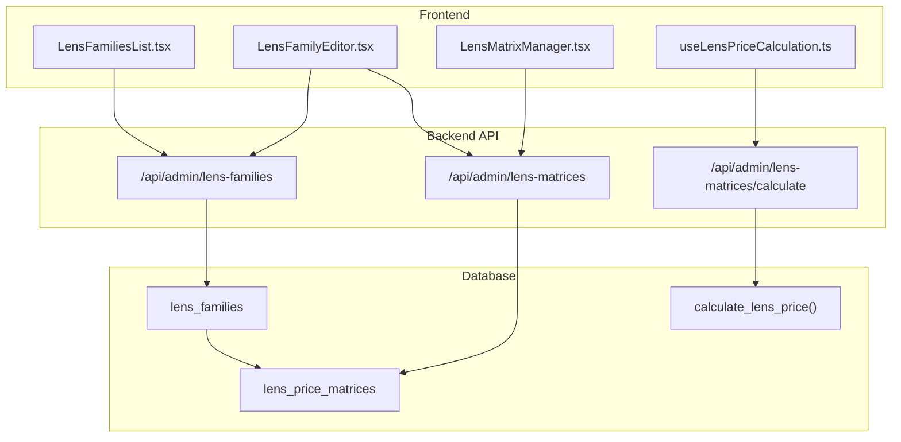
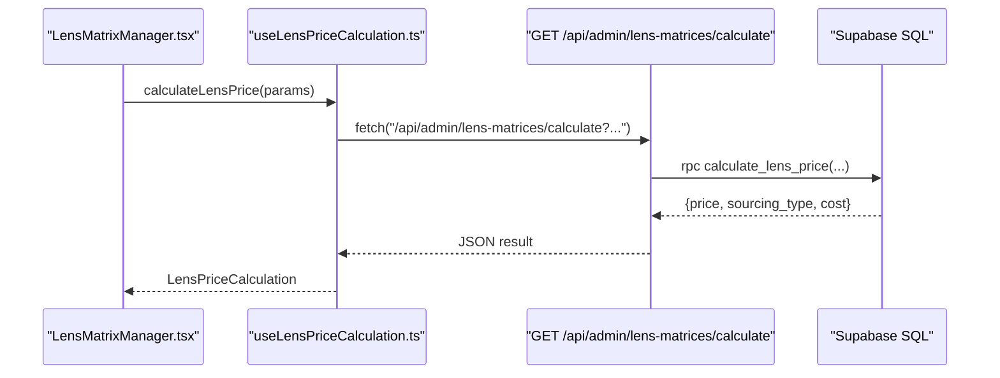
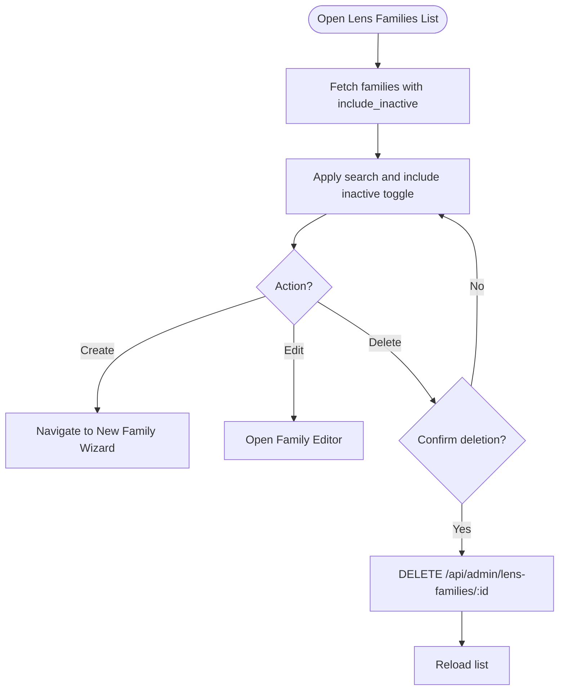
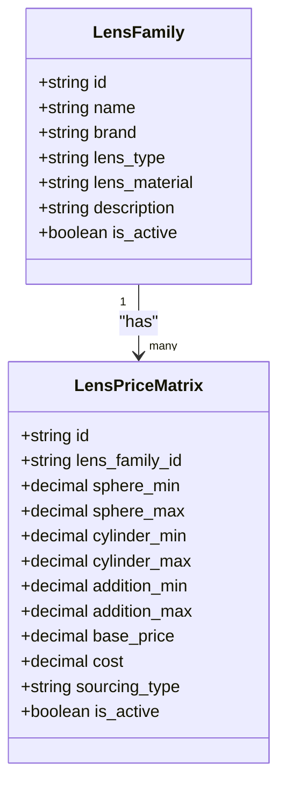
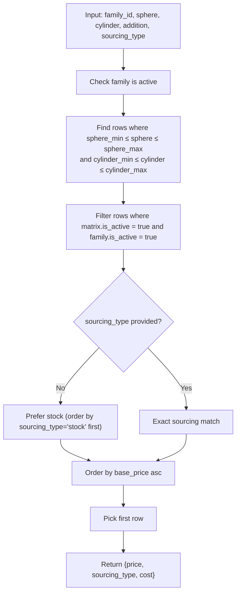
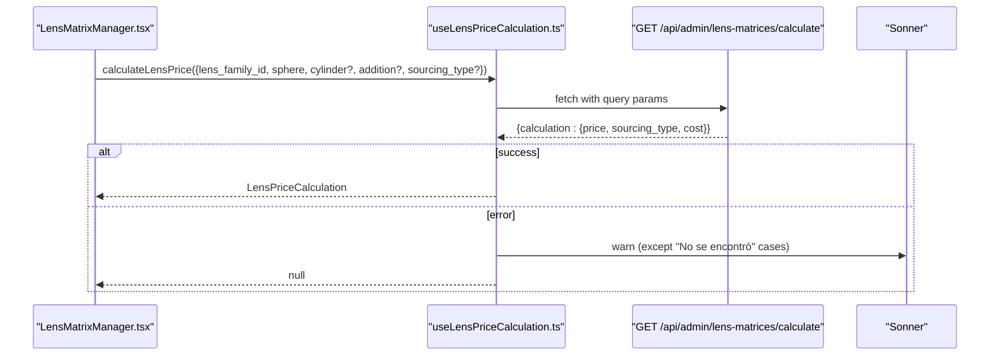
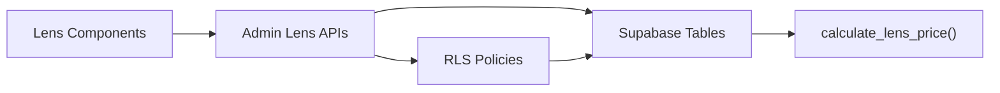

# Lens Configuration & Pricing System

<cite>
**Referenced Files in This Document**
- [20260129000000_create_lens_families_and_matrices.sql](file://supabase/migrations/20260129000000_create_lens_families_and_matrices.sql)
- [20260121000000_create_lens_price_matrices.sql](file://supabase/migrations/20260121000000_create_lens_price_matrices.sql)
- [useLensPriceCalculation.ts](file://src/hooks/useLensPriceCalculation.ts)
- [LensFamiliesList.tsx](file://src/components/admin/lenses/LensFamiliesList.tsx)
- [LensFamilyBasicForm.tsx](file://src/components/admin/lenses/LensFamilyBasicForm.tsx)
- [LensFamilyEditor.tsx](file://src/components/admin/lenses/LensFamilyEditor.tsx)
- [LensMatrixManager.tsx](file://src/components/admin/lenses/LensMatrixManager.tsx)
- [route.ts](file://src/app/api/admin/lens-families/route.ts)
- [route.ts](file://src/app/api/admin/lens-matrices/route.ts)
- [route.ts](file://src/app/api/admin/lens-matrices/calculate/route.ts)
- [page.tsx](file://src/app/admin/lens-families/[id]/page.tsx)
- [page.tsx](file://src/app/admin/lens-families/new/page.tsx)
- [page.tsx](file://src/app/admin/lens-matrices/page.tsx)
- [zod-schemas.ts](file://src/lib/api/validation/zod-schemas.ts)
</cite>

## Table of Contents

1. [Introduction](#introduction)
2. [Project Structure](#project-structure)
3. [Core Components](#core-components)
4. [Architecture Overview](#architecture-overview)
5. [Detailed Component Analysis](#detailed-component-analysis)
6. [Dependency Analysis](#dependency-analysis)
7. [Performance Considerations](#performance-considerations)
8. [Troubleshooting Guide](#troubleshooting-guide)
9. [Conclusion](#conclusion)

## Introduction

This document explains the lens configuration and pricing system used to manage optical lens families, define pricing matrices, and compute real-time lens prices. It covers the database schema, backend APIs, frontend components, and the pricing calculation algorithm. It also documents the management interface for creating, editing, and deleting lens families and matrices, and how matrices relate to product configurations.

## Project Structure

The lens system spans three layers:

- Database layer: lens families and price matrices with row-level security and multi-tenancy policies
- Backend API layer: Next.js routes validating requests and interacting with Supabase
- Frontend layer: React components for listing, editing, and managing lens families and matrices

**Diagram sources**

- [LensFamiliesList.tsx](file://src/components/admin/lenses/LensFamiliesList.tsx#L60-L296)
- [LensFamilyEditor.tsx](file://src/components/admin/lenses/LensFamilyEditor.tsx#L17-L211)
- [LensMatrixManager.tsx](file://src/components/admin/lenses/LensMatrixManager.tsx#L57-L452)
- [useLensPriceCalculation.ts](file://src/hooks/useLensPriceCalculation.ts#L18-L75)
- [route.ts](file://src/app/api/admin/lens-families/route.ts#L15-L95)
- [route.ts](file://src/app/api/admin/lens-matrices/route.ts#L12-L123)
- [route.ts](file://src/app/api/admin/lens-matrices/calculate/route.ts#L17-L159)
- [20260129000000_create_lens_families_and_matrices.sql](file://supabase/migrations/20260129000000_create_lens_families_and_matrices.sql#L6-L103)

**Section sources**

- [LensFamiliesList.tsx](file://src/components/admin/lenses/LensFamiliesList.tsx#L60-L296)
- [LensFamilyEditor.tsx](file://src/components/admin/lenses/LensFamilyEditor.tsx#L17-L211)
- [LensMatrixManager.tsx](file://src/components/admin/lenses/LensMatrixManager.tsx#L57-L452)
- [useLensPriceCalculation.ts](file://src/hooks/useLensPriceCalculation.ts#L18-L75)
- [route.ts](file://src/app/api/admin/lens-families/route.ts#L15-L95)
- [route.ts](file://src/app/api/admin/lens-matrices/route.ts#L12-L123)
- [route.ts](file://src/app/api/admin/lens-matrices/calculate/route.ts#L17-L159)
- [20260129000000_create_lens_families_and_matrices.sql](file://supabase/migrations/20260129000000_create_lens_families_and_matrices.sql#L6-L103)

## Core Components

- Lens families: represent lens brands/types/materials with multi-tenancy and active state
- Price matrices: define pricing ranges by sphere, cylinder, and addition, plus sourcing type and costs
- Pricing calculation: SQL function that selects the best matching matrix row based on parameters
- Management UI: lists, edits, and deletes lens families; manages matrices per family
- Real-time calculation hook: computes price via API on demand

Key implementation highlights:

- Multi-tenancy enforced by filtering lens families and matrices by organization_id
- Row-level security policies restrict access to authorized administrators
- GIN/GiST indexes optimize range queries on sphere and cylinder
- Pricing prioritizes stock sourcing when unspecified, otherwise uses surfaced sourcing

**Section sources**

- [20260129000000_create_lens_families_and_matrices.sql](file://supabase/migrations/20260129000000_create_lens_families_and_matrices.sql#L6-L103)
- [route.ts](file://src/app/api/admin/lens-families/route.ts#L52-L77)
- [route.ts](file://src/app/api/admin/lens-matrices/route.ts#L53-L93)
- [useLensPriceCalculation.ts](file://src/hooks/useLensPriceCalculation.ts#L22-L67)

## Architecture Overview

The system follows a clean separation of concerns:

- Frontend components render forms and lists, and trigger API calls
- API routes validate inputs, enforce admin and tenant policies, and query Supabase
- Database stores lens families and matrices with constraints and indexes
- SQL function performs efficient price lookup using range conditions

**Diagram sources**

- [LensMatrixManager.tsx](file://src/components/admin/lenses/LensMatrixManager.tsx#L57-L452)
- [useLensPriceCalculation.ts](file://src/hooks/useLensPriceCalculation.ts#L18-L75)
- [route.ts](file://src/app/api/admin/lens-matrices/calculate/route.ts#L17-L159)
- [20260129000000_create_lens_families_and_matrices.sql](file://supabase/migrations/20260129000000_create_lens_families_and_matrices.sql#L52-L81)

## Detailed Component Analysis

### Lens Families Management

- Listing: filters by active/inactive and supports search across name, brand, type, and material
- Creation: supports simple family creation or full creation with matrices via RPC
- Editing: updates basic family metadata (name, brand, type, material, description, active)
- Deletion: triggers soft-deactivate via is_active flag

**Diagram sources**

- [LensFamiliesList.tsx](file://src/components/admin/lenses/LensFamiliesList.tsx#L75-L118)
- [route.ts](file://src/app/api/admin/lens-families/route.ts#L15-L95)
- [page.tsx](file://src/app/admin/lens-families/new/page.tsx#L1-L11)
- [page.tsx](file://src/app/admin/lens-families/[id]/page.tsx#L1-L16)

**Section sources**

- [LensFamiliesList.tsx](file://src/components/admin/lenses/LensFamiliesList.tsx#L60-L296)
- [LensFamilyBasicForm.tsx](file://src/components/admin/lenses/LensFamilyBasicForm.tsx#L15-L150)
- [LensFamilyEditor.tsx](file://src/components/admin/lenses/LensFamilyEditor.tsx#L17-L211)
- [route.ts](file://src/app/api/admin/lens-families/route.ts#L97-L221)

### Matrix Management

- Matrix ranges: sphere_min/max, cylinder_min/max, addition_min/max
- Pricing fields: base_price, cost, sourcing_type (stock/surfaced), is_active
- Bulk operations: create, update, delete; supports import dialog for CSV
- Validation: Zod schemas ensure numeric ranges and positive prices

**Diagram sources**

- [20260129000000_create_lens_families_and_matrices.sql](file://supabase/migrations/20260129000000_create_lens_families_and_matrices.sql#L6-L50)
- [LensMatrixManager.tsx](file://src/components/admin/lenses/LensMatrixManager.tsx#L34-L46)

**Section sources**

- [LensMatrixManager.tsx](file://src/components/admin/lenses/LensMatrixManager.tsx#L57-L452)
- [page.tsx](file://src/app/admin/lens-matrices/page.tsx#L88-L486)
- [route.ts](file://src/app/api/admin/lens-matrices/route.ts#L12-L123)
- [zod-schemas.ts](file://src/lib/api/validation/zod-schemas.ts#L180-L241)

### Pricing Calculation Algorithm

The SQL function selects the best matching matrix row given:

- lens_family_id
- sphere (far sphere for presbyopia)
- cylinder (default 0)
- addition (optional)
- sourcing_type (optional)

Selection criteria:

- Sphere and cylinder within defined ranges
- Matrix and family are active
- If sourcing_type is not specified, prefer stock over surfaced
- Order by base_price ascending and pick the first match

**Diagram sources**

- [20260129000000_create_lens_families_and_matrices.sql](file://supabase/migrations/20260129000000_create_lens_families_and_matrices.sql#L52-L81)
- [route.ts](file://src/app/api/admin/lens-matrices/calculate/route.ts#L108-L149)

**Section sources**

- [20260129000000_create_lens_families_and_matrices.sql](file://supabase/migrations/20260129000000_create_lens_families_and_matrices.sql#L52-L81)
- [route.ts](file://src/app/api/admin/lens-matrices/calculate/route.ts#L17-L159)

### Real-Time Pricing Updates

The frontend hook builds query parameters and calls the calculation endpoint. It handles errors gracefully and avoids noisy toasts for missing matrices.

**Diagram sources**

- [useLensPriceCalculation.ts](file://src/hooks/useLensPriceCalculation.ts#L18-L75)
- [route.ts](file://src/app/api/admin/lens-matrices/calculate/route.ts#L17-L159)

**Section sources**

- [useLensPriceCalculation.ts](file://src/hooks/useLensPriceCalculation.ts#L18-L75)
- [route.ts](file://src/app/api/admin/lens-matrices/calculate/route.ts#L17-L159)

### Parameter Validation and Constraints

- Zod schemas validate numeric ranges, positive prices, and enums for lens types and materials
- Database constraints ensure sphere_min ≤ sphere_max and cylinder_min ≤ cylinder_max
- Indexes on GIN/GiST ranges accelerate lookups

**Section sources**

- [zod-schemas.ts](file://src/lib/api/validation/zod-schemas.ts#L180-L241)
- [20260129000000_create_lens_families_and_matrices.sql](file://supabase/migrations/20260129000000_create_lens_families_and_matrices.sql#L36-L47)
- [20260129000000_create_lens_families_and_matrices.sql](file://supabase/migrations/20260129000000_create_lens_families_and_matrices.sql#L41-L47)

## Dependency Analysis

- Frontend components depend on API routes for CRUD operations
- API routes depend on Supabase client and stored procedures/functions
- Database depends on RLS policies and indexes for performance and security
- Multi-tenancy: both lens families and matrices are scoped to organization_id

**Diagram sources**

- [route.ts](file://src/app/api/admin/lens-families/route.ts#L52-L77)
- [route.ts](file://src/app/api/admin/lens-matrices/route.ts#L53-L93)
- [20260129000000_create_lens_families_and_matrices.sql](file://supabase/migrations/20260129000000_create_lens_families_and_matrices.sql#L105-L213)

**Section sources**

- [route.ts](file://src/app/api/admin/lens-families/route.ts#L52-L77)
- [route.ts](file://src/app/api/admin/lens-matrices/route.ts#L53-L93)
- [20260129000000_create_lens_families_and_matrices.sql](file://supabase/migrations/20260129000000_create_lens_families_and_matrices.sql#L105-L213)

## Performance Considerations

- Range indexes: GIN/GiST numrange indexes on sphere and cylinder improve query performance
- Sorting: ordering by sourcing_type and base_price minimizes expensive joins
- Filtering: multi-tenancy filters reduce result sets early
- Validation: client-side numeric parsing prevents unnecessary API calls

[No sources needed since this section provides general guidance]

## Troubleshooting Guide

Common issues and resolutions:

- Unauthorized access: ensure user is authenticated and has admin role
- Tenant isolation: verify organization_id matches the user’s organization
- Missing calculation: occurs when no active matrix matches the ranges; adjust ranges or add a matrix
- Invalid parameters: ensure numeric values for sphere, cylinder, addition, and valid enums for lens types/materials

**Section sources**

- [route.ts](file://src/app/api/admin/lens-families/route.ts#L20-L37)
- [route.ts](file://src/app/api/admin/lens-matrices/route.ts#L129-L147)
- [route.ts](file://src/app/api/admin/lens-matrices/calculate/route.ts#L52-L81)

## Conclusion

The lens configuration and pricing system provides a robust, multi-tenant framework for managing optical lens families and pricing matrices. Its design emphasizes clear separation of concerns, strong validation, and efficient database queries. Administrators can confidently configure pricing strategies, while the real-time calculation hook enables dynamic price updates during product configuration workflows.
