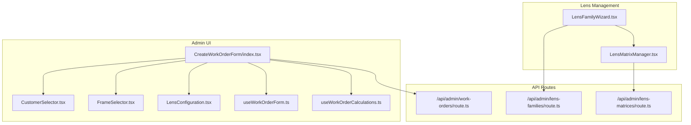
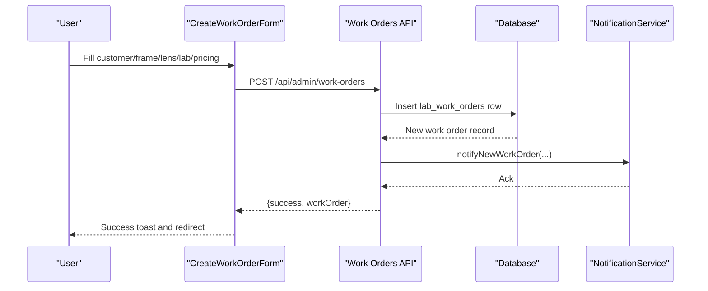
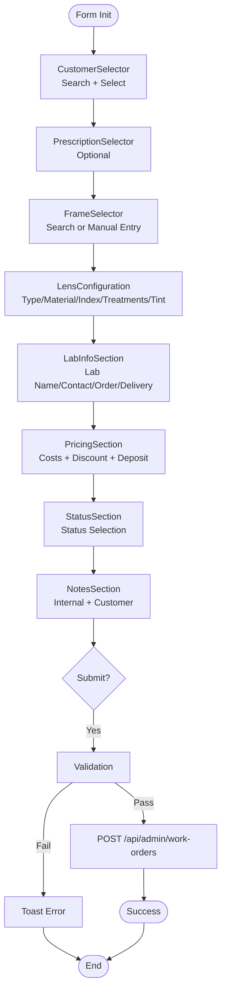
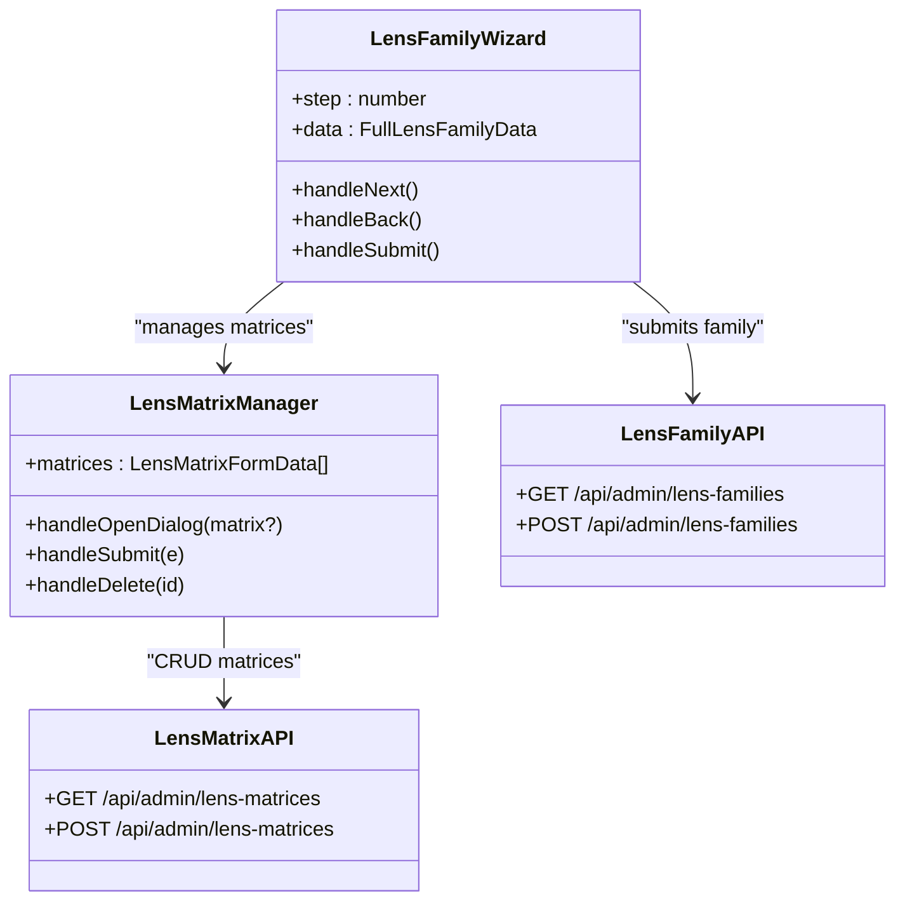
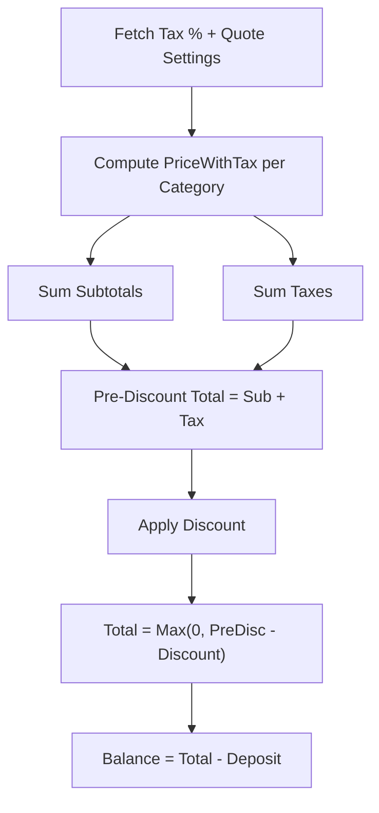
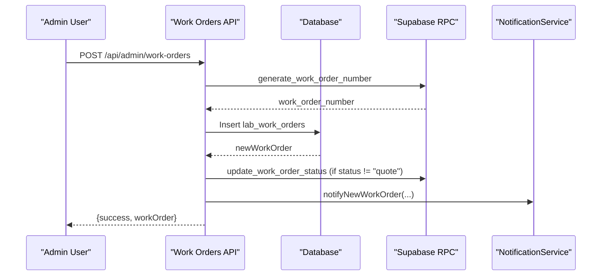
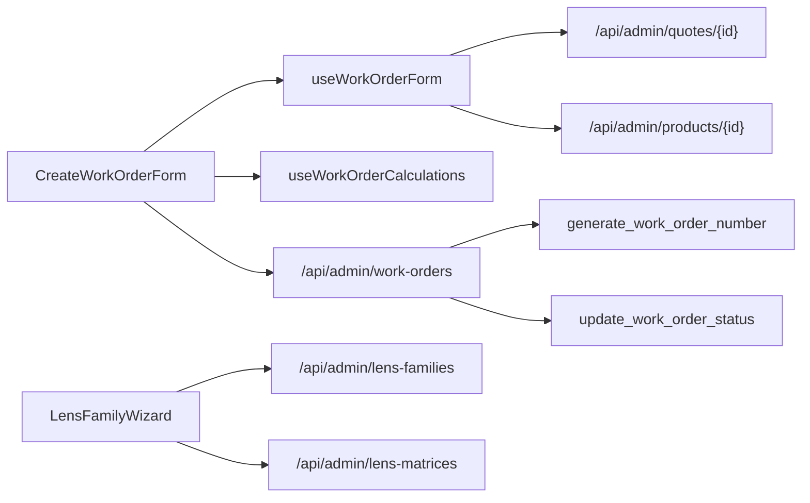

# Work Order & Laboratory System

<cite>
**Referenced Files in This Document**
- [CreateWorkOrderForm/index.tsx](file://src/components/admin/CreateWorkOrderForm/index.tsx)
- [CustomerSelector.tsx](file://src/components/admin/CreateWorkOrderForm/CustomerSelector.tsx)
- [FrameSelector.tsx](file://src/components/admin/CreateWorkOrderForm/FrameSelector.tsx)
- [LensConfiguration.tsx](file://src/components/admin/CreateWorkOrderForm/LensConfiguration.tsx)
- [useWorkOrderForm.ts](file://src/components/admin/CreateWorkOrderForm/hooks/useWorkOrderForm.ts)
- [useWorkOrderCalculations.ts](file://src/components/admin/CreateWorkOrderForm/hooks/useWorkOrderCalculations.ts)
- [work-orders/route.ts](file://src/app/api/admin/work-orders/route.ts)
- [lens-families/route.ts](file://src/app/api/admin/lens-families/route.ts)
- [lens-matrices/route.ts](file://src/app/api/admin/lens-matrices/route.ts)
- [LensFamilyWizard.tsx](file://src/components/admin/lenses/LensFamilyWizard.tsx)
- [LensMatrixManager.tsx](file://src/components/admin/lenses/LensMatrixManager.tsx)
- [utils.ts](file://src/lib/utils.ts)
</cite>

## Table of Contents

1. [Introduction](#introduction)
2. [Project Structure](#project-structure)
3. [Core Components](#core-components)
4. [Architecture Overview](#architecture-overview)
5. [Detailed Component Analysis](#detailed-component-analysis)
6. [Dependency Analysis](#dependency-analysis)
7. [Performance Considerations](#performance-considerations)
8. [Troubleshooting Guide](#troubleshooting-guide)
9. [Conclusion](#conclusion)

## Introduction

This document explains the Work Order and Laboratory Integration System for optical manufacturing workflows. It covers the end-to-end work order lifecycle from creation to completion, including status tracking, lab communication, and quality control. It documents the lens configuration system with families, matrices, and pricing calculations, and details the work order form components including customer selection, frame configuration, lens parameters, and pricing sections. Implementation details include lab integration APIs, work order status synchronization, and manufacturing workflow automation. Examples illustrate work order creation workflows, status updates, and integration with external optical laboratories. Finally, it documents lens calculation algorithms, family selection logic, and matrix configuration management.

## Project Structure

The system is organized around:

- A React admin form for creating work orders with modular sections for customer, frame, lens configuration, lab info, pricing, status, and notes.
- API routes for managing work orders, lens families, and lens price matrices.
- Hooks for form state, validations, and calculations.
- UI components for lens family and matrix management.

**Diagram sources**

- [CreateWorkOrderForm/index.tsx](file://src/components/admin/CreateWorkOrderForm/index.tsx#L255-L376)
- [CustomerSelector.tsx](file://src/components/admin/CreateWorkOrderForm/CustomerSelector.tsx#L66-L136)
- [FrameSelector.tsx](file://src/components/admin/CreateWorkOrderForm/FrameSelector.tsx#L92-L196)
- [LensConfiguration.tsx](file://src/components/admin/CreateWorkOrderForm/LensConfiguration.tsx#L134-L255)
- [useWorkOrderForm.ts](file://src/components/admin/CreateWorkOrderForm/hooks/useWorkOrderForm.ts#L81-L190)
- [useWorkOrderCalculations.ts](file://src/components/admin/CreateWorkOrderForm/hooks/useWorkOrderCalculations.ts#L15-L153)
- [work-orders/route.ts](file://src/app/api/admin/work-orders/route.ts#L1-L438)
- [lens-families/route.ts](file://src/app/api/admin/lens-families/route.ts#L1-L222)
- [lens-matrices/route.ts](file://src/app/api/admin/lens-matrices/route.ts#L1-L224)
- [LensFamilyWizard.tsx](file://src/components/admin/lenses/LensFamilyWizard.tsx#L19-L197)
- [LensMatrixManager.tsx](file://src/components/admin/lenses/LensMatrixManager.tsx#L57-L452)

**Section sources**

- [CreateWorkOrderForm/index.tsx](file://src/components/admin/CreateWorkOrderForm/index.tsx#L1-L378)
- [work-orders/route.ts](file://src/app/api/admin/work-orders/route.ts#L1-L438)
- [lens-families/route.ts](file://src/app/api/admin/lens-families/route.ts#L1-L222)
- [lens-matrices/route.ts](file://src/app/api/admin/lens-matrices/route.ts#L1-L224)
- [LensFamilyWizard.tsx](file://src/components/admin/lenses/LensFamilyWizard.tsx#L1-L197)
- [LensMatrixManager.tsx](file://src/components/admin/lenses/LensMatrixManager.tsx#L1-L452)

## Core Components

- Work Order Form: Orchestrates customer selection, frame selection, lens configuration, lab info, pricing, status, and notes. Submits to the work orders API.
- Lens Configuration: Manages lens type, material, index, treatments, and optional tint parameters.
- Pricing Calculations: Computes subtotal, tax, total, and balance considering tax inclusion per category and discount.
- Lens Families and Matrices: Provides a wizard to define lens families and manage price matrices with ranges and sourcing types.
- API Endpoints: CRUD for work orders, lens families, and lens matrices with validation and multi-tenancy enforcement.

**Section sources**

- [CreateWorkOrderForm/index.tsx](file://src/components/admin/CreateWorkOrderForm/index.tsx#L32-L378)
- [LensConfiguration.tsx](file://src/components/admin/CreateWorkOrderForm/LensConfiguration.tsx#L75-L260)
- [useWorkOrderCalculations.ts](file://src/components/admin/CreateWorkOrderForm/hooks/useWorkOrderCalculations.ts#L15-L153)
- [LensFamilyWizard.tsx](file://src/components/admin/lenses/LensFamilyWizard.tsx#L19-L197)
- [LensMatrixManager.tsx](file://src/components/admin/lenses/LensMatrixManager.tsx#L57-L452)
- [work-orders/route.ts](file://src/app/api/admin/work-orders/route.ts#L200-L438)
- [lens-families/route.ts](file://src/app/api/admin/lens-families/route.ts#L97-L222)
- [lens-matrices/route.ts](file://src/app/api/admin/lens-matrices/route.ts#L125-L224)

## Architecture Overview

The system integrates UI components with backend APIs secured via admin checks and branch/organization context. Work order creation triggers notifications and optional status date updates. Lens families and matrices are managed with strict multi-tenancy to isolate organizations.

**Diagram sources**

- [CreateWorkOrderForm/index.tsx](file://src/components/admin/CreateWorkOrderForm/index.tsx#L173-L245)
- [work-orders/route.ts](file://src/app/api/admin/work-orders/route.ts#L200-L438)

**Section sources**

- [work-orders/route.ts](file://src/app/api/admin/work-orders/route.ts#L15-L198)
- [CreateWorkOrderForm/index.tsx](file://src/components/admin/CreateWorkOrderForm/index.tsx#L173-L245)

## Detailed Component Analysis

### Work Order Lifecycle and Form Components

- Customer Selection: Debounced search by name/email scoped to branch context; selection clears prescriptions.
- Frame Selection: Debounced search by name/brand/SKU; supports manual entry when no match; serial number capture.
- Lens Configuration: Type, material, index, selectable treatments with cost aggregation; optional tint color and percentage.
- Pricing Section: Inputs for frame, lens, treatments, labor, and lab costs; discount and deposit adjustments; auto-calculated totals.
- Status and Notes: Status selection and internal/customer notes for lab communication.
- Submission: Validates presence of required fields, posts to API with branch header, and handles errors.

**Diagram sources**

- [CreateWorkOrderForm/index.tsx](file://src/components/admin/CreateWorkOrderForm/index.tsx#L255-L376)
- [CustomerSelector.tsx](file://src/components/admin/CreateWorkOrderForm/CustomerSelector.tsx#L34-L64)
- [FrameSelector.tsx](file://src/components/admin/CreateWorkOrderForm/FrameSelector.tsx#L54-L84)
- [LensConfiguration.tsx](file://src/components/admin/CreateWorkOrderForm/LensConfiguration.tsx#L134-L255)
- [useWorkOrderForm.ts](file://src/components/admin/CreateWorkOrderForm/hooks/useWorkOrderForm.ts#L81-L190)
- [useWorkOrderCalculations.ts](file://src/components/admin/CreateWorkOrderForm/hooks/useWorkOrderCalculations.ts#L15-L153)

**Section sources**

- [CreateWorkOrderForm/index.tsx](file://src/components/admin/CreateWorkOrderForm/index.tsx#L32-L378)
- [CustomerSelector.tsx](file://src/components/admin/CreateWorkOrderForm/CustomerSelector.tsx#L24-L139)
- [FrameSelector.tsx](file://src/components/admin/CreateWorkOrderForm/FrameSelector.tsx#L40-L199)
- [LensConfiguration.tsx](file://src/components/admin/CreateWorkOrderForm/LensConfiguration.tsx#L75-L260)
- [useWorkOrderForm.ts](file://src/components/admin/CreateWorkOrderForm/hooks/useWorkOrderForm.ts#L6-L190)
- [useWorkOrderCalculations.ts](file://src/components/admin/CreateWorkOrderForm/hooks/useWorkOrderCalculations.ts#L15-L153)

### Lens Families and Matrices Management

- Lens Family Wizard: Two-step process to define basic family info and configure price matrices; validates presence of at least one matrix before submission.
- Lens Matrix Manager: CRUD for matrices with ranges (sphere, cylinder, addition), base price, cost, sourcing type (stock/surfaced), and activation flag; dialog-based editing.

**Diagram sources**

- [LensFamilyWizard.tsx](file://src/components/admin/lenses/LensFamilyWizard.tsx#L19-L197)
- [LensMatrixManager.tsx](file://src/components/admin/lenses/LensMatrixManager.tsx#L57-L452)
- [lens-families/route.ts](file://src/app/api/admin/lens-families/route.ts#L97-L222)
- [lens-matrices/route.ts](file://src/app/api/admin/lens-matrices/route.ts#L125-L224)

**Section sources**

- [LensFamilyWizard.tsx](file://src/components/admin/lenses/LensFamilyWizard.tsx#L19-L197)
- [LensMatrixManager.tsx](file://src/components/admin/lenses/LensMatrixManager.tsx#L57-L452)
- [lens-families/route.ts](file://src/app/api/admin/lens-families/route.ts#L15-L222)
- [lens-matrices/route.ts](file://src/app/api/admin/lens-matrices/route.ts#L12-L224)

### Pricing and Tax Calculation Logic

- Tax configuration is fetched and combined with quote settings to determine whether costs include tax per category.
- Frame, lens, treatments, labor, and lab costs are broken down into subtotal and tax amounts.
- Subtotal is summed across categories; discount is applied to the pre-tax total; balance equals total minus deposit.

**Diagram sources**

- [useWorkOrderCalculations.ts](file://src/components/admin/CreateWorkOrderForm/hooks/useWorkOrderCalculations.ts#L50-L124)
- [utils.ts](file://src/lib/utils.ts#L8-L21)

**Section sources**

- [useWorkOrderCalculations.ts](file://src/components/admin/CreateWorkOrderForm/hooks/useWorkOrderCalculations.ts#L15-L153)
- [utils.ts](file://src/lib/utils.ts#L8-L21)

### API Endpoints and Multi-Tenancy

- Work Orders API:
  - GET lists work orders with pagination and filters; enriches with customer, prescription, quote, product, and staff data.
  - POST validates payload, generates work order number via RPC, optionally snapshots prescription, inserts record, updates status dates if applicable, and sends notifications.
- Lens Families API:
  - GET filters by organization and active status; enforces multi-tenancy via organization_id.
  - POST supports full creation (family + matrices) via RPC or simple creation; enforces organization_id.
- Lens Matrices API:
  - GET filters by organization-owned families and active status; enforces multi-tenancy.
  - POST validates matrix body and ensures lens family belongs to the user’s organization.

**Diagram sources**

- [work-orders/route.ts](file://src/app/api/admin/work-orders/route.ts#L200-L438)

**Section sources**

- [work-orders/route.ts](file://src/app/api/admin/work-orders/route.ts#L15-L198)
- [work-orders/route.ts](file://src/app/api/admin/work-orders/route.ts#L200-L438)
- [lens-families/route.ts](file://src/app/api/admin/lens-families/route.ts#L52-L94)
- [lens-families/route.ts](file://src/app/api/admin/lens-families/route.ts#L121-L136)
- [lens-matrices/route.ts](file://src/app/api/admin/lens-matrices/route.ts#L53-L72)
- [lens-matrices/route.ts](file://src/app/api/admin/lens-matrices/route.ts#L155-L184)

## Dependency Analysis

- UI depends on hooks for form state and calculations, and on branch-scoped API endpoints.
- Work order creation depends on:
  - Customer and product data availability (via branch-scoped endpoints).
  - Lens family and matrix existence for pricing logic (when applicable).
  - Supabase RPCs for work order number generation and status updates.
- Lens family and matrix management depend on organization scoping to maintain multi-tenancy.

**Diagram sources**

- [CreateWorkOrderForm/index.tsx](file://src/components/admin/CreateWorkOrderForm/index.tsx#L96-L164)
- [useWorkOrderForm.ts](file://src/components/admin/CreateWorkOrderForm/hooks/useWorkOrderForm.ts#L96-L164)
- [work-orders/route.ts](file://src/app/api/admin/work-orders/route.ts#L252-L275)
- [lens-families/route.ts](file://src/app/api/admin/lens-families/route.ts#L97-L222)
- [lens-matrices/route.ts](file://src/app/api/admin/lens-matrices/route.ts#L125-L224)

**Section sources**

- [CreateWorkOrderForm/index.tsx](file://src/components/admin/CreateWorkOrderForm/index.tsx#L96-L164)
- [useWorkOrderForm.ts](file://src/components/admin/CreateWorkOrderForm/hooks/useWorkOrderForm.ts#L96-L164)
- [work-orders/route.ts](file://src/app/api/admin/work-orders/route.ts#L252-L275)
- [lens-families/route.ts](file://src/app/api/admin/lens-families/route.ts#L97-L222)
- [lens-matrices/route.ts](file://src/app/api/admin/lens-matrices/route.ts#L125-L224)

## Performance Considerations

- Debounced searches reduce network requests during typing in customer and frame selectors.
- Batch relation fetching minimizes N+1 queries when listing work orders.
- Memoization in lens configuration prevents unnecessary re-renders.
- RPC-based number generation and status updates ensure atomicity and reduce race conditions.

## Troubleshooting Guide

- Unauthorized or missing admin access: Ensure the user is authenticated and has admin privileges; branch context must be set for non-super admins when creating work orders.
- Validation errors on submission: Confirm required fields are present and formatted correctly; review returned validation messages.
- Multi-tenancy issues: Verify organization_id is set for lens families and that lens family belongs to the current organization when creating matrices.
- Notifications not firing: Check notification service logs for errors; ensure branch context is present when sending notifications.

**Section sources**

- [work-orders/route.ts](file://src/app/api/admin/work-orders/route.ts#L205-L249)
- [lens-families/route.ts](file://src/app/api/admin/lens-families/route.ts#L121-L136)
- [lens-matrices/route.ts](file://src/app/api/admin/lens-matrices/route.ts#L155-L184)

## Conclusion

The Work Order and Laboratory Integration System provides a robust, multi-tenant solution for optical manufacturing workflows. It combines a configurable UI form with validated APIs, ensuring accurate pricing, tax handling, and lab communication. Lens families and matrices enable precise pricing rules aligned with prescriptions and manufacturing constraints. The system’s architecture supports scalability, safety, and clear status tracking from creation to completion.
