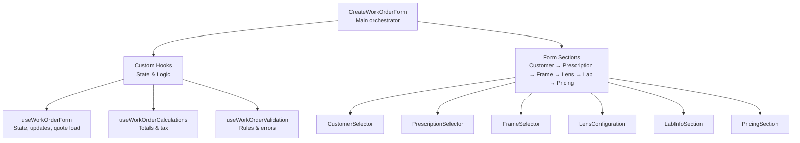
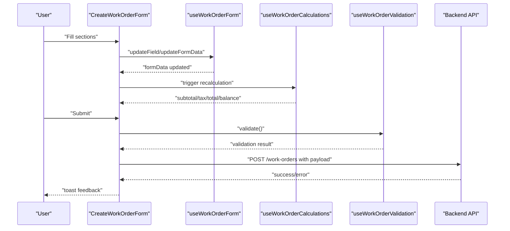
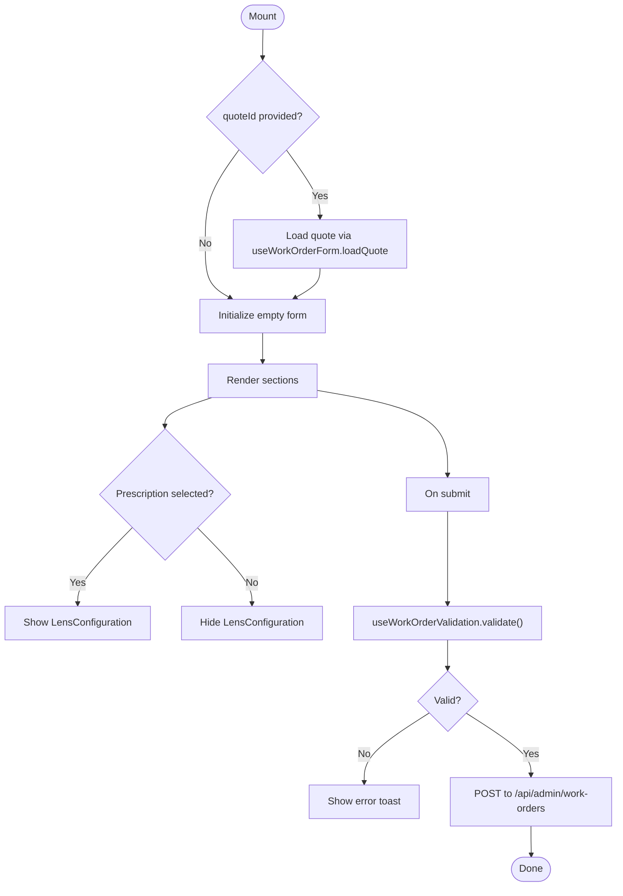
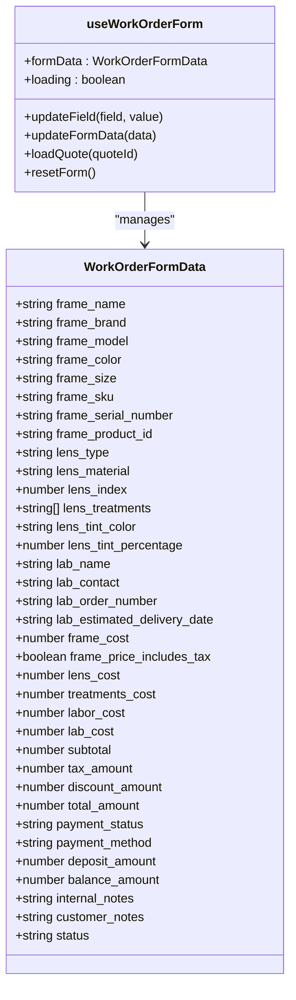
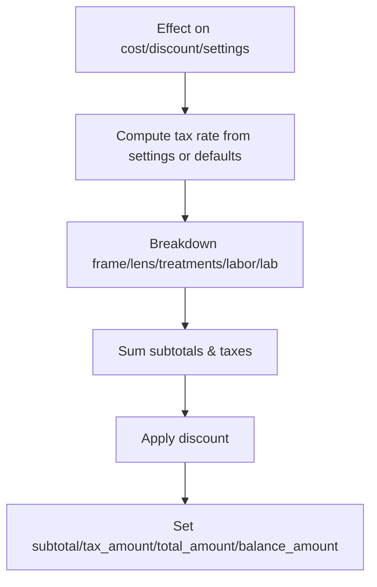
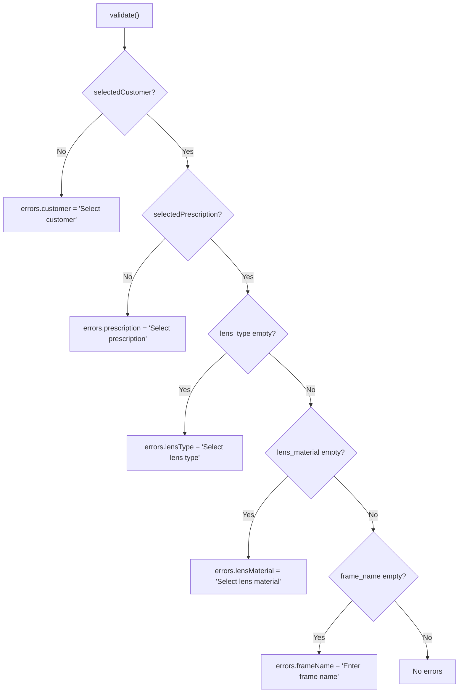
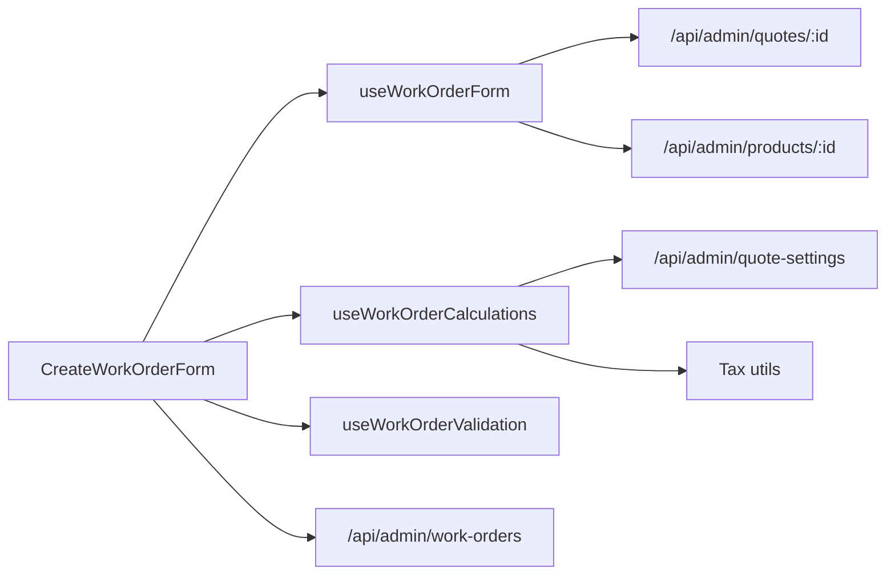

# Work Order Form Components

<cite>
**Referenced Files in This Document**
- [CreateWorkOrderForm.tsx](file://src/components/admin/CreateWorkOrderForm.tsx)
- [useWorkOrderForm.ts](file://src/components/admin/CreateWorkOrderForm/hooks/useWorkOrderForm.ts)
- [useWorkOrderCalculations.ts](file://src/components/admin/CreateWorkOrderForm/hooks/useWorkOrderCalculations.ts)
- [useWorkOrderValidation.ts](file://src/components/admin/CreateWorkOrderForm/hooks/useWorkOrderValidation.ts)
- [CustomerSelector.tsx](file://src/components/admin/CreateWorkOrderForm/CustomerSelector.tsx)
- [PrescriptionSelector.tsx](file://src/components/admin/CreateWorkOrderForm/PrescriptionSelector.tsx)
- [FrameSelector.tsx](file://src/components/admin/CreateWorkOrderForm/FrameSelector.tsx)
- [LensConfiguration.tsx](file://src/components/admin/CreateWorkOrderForm/LensConfiguration.tsx)
- [LabInfoSection.tsx](file://src/components/admin/CreateWorkOrderForm/LabInfoSection.tsx)
- [PricingSection.tsx](file://src/components/admin/CreateWorkOrderForm/PricingSection.tsx)
</cite>

## Table of Contents

1. [Introduction](#introduction)
2. [Project Structure](#project-structure)
3. [Core Components](#core-components)
4. [Architecture Overview](#architecture-overview)
5. [Detailed Component Analysis](#detailed-component-analysis)
6. [Dependency Analysis](#dependency-analysis)
7. [Performance Considerations](#performance-considerations)
8. [Troubleshooting Guide](#troubleshooting-guide)
9. [Conclusion](#conclusion)

## Introduction

This document describes the work order creation form system used to capture customer, frame, lens, and pricing details, integrate with prescriptions, and compute totals with tax logic. It focuses on the main CreateWorkOrderForm component, the hook-based state and validation system, and the composition of form sections. It also documents how fields depend on each other, how conditional rendering works, and how real-time validation and calculations are performed.

## Project Structure

The work order form is organized as a main component that composes multiple specialized sections and manages state via custom hooks:

- Main form: CreateWorkOrderForm
- Hooks: useWorkOrderForm, useWorkOrderCalculations, useWorkOrderValidation
- Sections: CustomerSelector, PrescriptionSelector, FrameSelector, LensConfiguration, LabInfoSection, PricingSection

**Diagram sources**

- [CreateWorkOrderForm.tsx](file://src/components/admin/CreateWorkOrderForm.tsx#L32-L377)
- [useWorkOrderForm.ts](file://src/components/admin/CreateWorkOrderForm/hooks/useWorkOrderForm.ts#L81-L189)
- [useWorkOrderCalculations.ts](file://src/components/admin/CreateWorkOrderForm/hooks/useWorkOrderCalculations.ts#L15-L152)
- [useWorkOrderValidation.ts](file://src/components/admin/CreateWorkOrderForm/hooks/useWorkOrderValidation.ts#L14-L95)
- [CustomerSelector.tsx](file://src/components/admin/CreateWorkOrderForm/CustomerSelector.tsx#L24-L138)
- [PrescriptionSelector.tsx](file://src/components/admin/CreateWorkOrderForm/PrescriptionSelector.tsx#L37-L191)
- [FrameSelector.tsx](file://src/components/admin/CreateWorkOrderForm/FrameSelector.tsx#L40-L198)
- [LensConfiguration.tsx](file://src/components/admin/CreateWorkOrderForm/LensConfiguration.tsx#L75-L259)
- [LabInfoSection.tsx](file://src/components/admin/CreateWorkOrderForm/LabInfoSection.tsx#L20-L79)
- [PricingSection.tsx](file://src/components/admin/CreateWorkOrderForm/PricingSection.tsx#L47-L214)

**Section sources**

- [CreateWorkOrderForm.tsx](file://src/components/admin/CreateWorkOrderForm.tsx#L1-L378)
- [useWorkOrderForm.ts](file://src/components/admin/CreateWorkOrderForm/hooks/useWorkOrderForm.ts#L1-L190)
- [useWorkOrderCalculations.ts](file://src/components/admin/CreateWorkOrderForm/hooks/useWorkOrderCalculations.ts#L1-L153)
- [useWorkOrderValidation.ts](file://src/components/admin/CreateWorkOrderForm/hooks/useWorkOrderValidation.ts#L1-L96)

## Core Components

- CreateWorkOrderForm: Orchestrates state, validation, and submission; composes all sections; handles branch-aware requests and success/error feedback.
- useWorkOrderForm: Central state container for all form fields, with helpers to update single fields or partial data, load quote presets, and reset form.
- useWorkOrderCalculations: Computes subtotal, tax, total, and balance based on configurable tax rates and per-item tax inclusion flags.
- useWorkOrderValidation: Validates required fields and exposes helpers to validate individual fields or return a consolidated error map.

Key responsibilities:

- State management: Single source of truth for form data and derived totals.
- Real-time calculations: Totals update automatically when cost or discount fields change.
- Conditional rendering: Some sections appear only when prerequisites are met (e.g., lens configuration appears after a prescription is selected).
- Validation: Aggregates errors and prevents submission until required fields are satisfied.

**Section sources**

- [CreateWorkOrderForm.tsx](file://src/components/admin/CreateWorkOrderForm.tsx#L32-L377)
- [useWorkOrderForm.ts](file://src/components/admin/CreateWorkOrderForm/hooks/useWorkOrderForm.ts#L6-L79)
- [useWorkOrderCalculations.ts](file://src/components/admin/CreateWorkOrderForm/hooks/useWorkOrderCalculations.ts#L15-L152)
- [useWorkOrderValidation.ts](file://src/components/admin/CreateWorkOrderForm/hooks/useWorkOrderValidation.ts#L14-L95)

## Architecture Overview

The form follows a unidirectional data flow:

- Parent component holds top-level state and handlers.
- Hooks encapsulate domain logic (state, calculations, validation).
- Child components receive props and callbacks to update state.
- Submission posts structured payload to backend with branch-aware headers.

**Diagram sources**

- [CreateWorkOrderForm.tsx](file://src/components/admin/CreateWorkOrderForm.tsx#L173-L245)
- [useWorkOrderForm.ts](file://src/components/admin/CreateWorkOrderForm/hooks/useWorkOrderForm.ts#L166-L175)
- [useWorkOrderCalculations.ts](file://src/components/admin/CreateWorkOrderForm/hooks/useWorkOrderCalculations.ts#L50-L140)
- [useWorkOrderValidation.ts](file://src/components/admin/CreateWorkOrderForm/hooks/useWorkOrderValidation.ts#L19-L44)

## Detailed Component Analysis

### CreateWorkOrderForm

- Props: onSuccess, onCancel, optional quoteId, initialCustomerId, initialPrescriptionId.
- State: saving flag, selected customer/prescription/frame, branch-aware headers.
- Hooks:
  - useWorkOrderForm: loads quote presets, exposes updateField/updateFormData, resetForm, and loading state.
  - useWorkOrderCalculations: computes totals and exposes loadingSettings and quoteSettings.
  - useWorkOrderValidation: validates required fields and returns errors.
- Handlers:
  - Customer selection clears prescription.
  - Frame selection auto-populates frame metadata and toggles tax-inclusive flag based on product.
  - Lens type/material handlers compute base and adjusted costs.
  - Deposit handler recomputes balance.
  - Submit builds payload and posts to backend with branch header.
- Conditional rendering:
  - LensConfiguration renders only when a prescription is selected.
  - Other sections render unconditionally but rely on presence of prerequisite selections.

**Diagram sources**

- [CreateWorkOrderForm.tsx](file://src/components/admin/CreateWorkOrderForm.tsx#L72-L245)
- [useWorkOrderForm.ts](file://src/components/admin/CreateWorkOrderForm/hooks/useWorkOrderForm.ts#L89-L164)
- [useWorkOrderValidation.ts](file://src/components/admin/CreateWorkOrderForm/hooks/useWorkOrderValidation.ts#L19-L44)

**Section sources**

- [CreateWorkOrderForm.tsx](file://src/components/admin/CreateWorkOrderForm.tsx#L24-L377)

### useWorkOrderForm

- Data model: Strongly typed WorkOrderFormData covering frame, lens, lab, pricing, and status fields.
- Initialization: Defaults for payment status, deposit, and status.
- Quote loading: Fetches quote and product details to populate frame tax inclusion flag and most fields.
- Field updates: updateField for single keys, updateFormData for partial merges.
- Reset: Returns to initial state.

**Diagram sources**

- [useWorkOrderForm.ts](file://src/components/admin/CreateWorkOrderForm/hooks/useWorkOrderForm.ts#L6-L79)
- [useWorkOrderForm.ts](file://src/components/admin/CreateWorkOrderForm/hooks/useWorkOrderForm.ts#L81-L189)

**Section sources**

- [useWorkOrderForm.ts](file://src/components/admin/CreateWorkOrderForm/hooks/useWorkOrderForm.ts#L6-L190)

### useWorkOrderCalculations

- Dependencies: currentBranchId, formData, updateFormData.
- Settings: fetches tax percentage and quote settings (including per-item tax inclusion flags).
- Computation:
  - Calculates price breakdown per item considering whether amounts include tax.
  - Sums subtotals, taxes, applies discount, and sets total and balance.
- Effects: recalculates whenever relevant cost/discount/deposit fields or settings change.

**Diagram sources**

- [useWorkOrderCalculations.ts](file://src/components/admin/CreateWorkOrderForm/hooks/useWorkOrderCalculations.ts#L15-L152)

**Section sources**

- [useWorkOrderCalculations.ts](file://src/components/admin/CreateWorkOrderForm/hooks/useWorkOrderCalculations.ts#L9-L152)

### useWorkOrderValidation

- Validates: customer selected, prescription selected, lens type and material present, frame name entered.
- Provides:
  - validate(): returns boolean.
  - validateField(field): returns boolean for a specific field.
  - getErrors(): returns map of field-specific messages.
  - isValid: computed boolean.

**Diagram sources**

- [useWorkOrderValidation.ts](file://src/components/admin/CreateWorkOrderForm/hooks/useWorkOrderValidation.ts#L19-L87)

**Section sources**

- [useWorkOrderValidation.ts](file://src/components/admin/CreateWorkOrderForm/hooks/useWorkOrderValidation.ts#L14-L95)

### CustomerSelector

- Debounced search by name/email for customers scoped to current branch.
- Displays selected customer or search results.
- Clears selection via callback.

**Section sources**

- [CustomerSelector.tsx](file://src/components/admin/CreateWorkOrderForm/CustomerSelector.tsx#L24-L138)

### PrescriptionSelector

- Loads prescriptions for a selected customer.
- Auto-selects current prescription if available; otherwise selects the first.
- Opens a modal to create a new prescription linked to the customer.

**Section sources**

- [PrescriptionSelector.tsx](file://src/components/admin/CreateWorkOrderForm/PrescriptionSelector.tsx#L37-L191)

### FrameSelector

- Debounced search for frames by name/brand/SKU, filtered by type=frame.
- Supports manual frame entry when no frame is selected.
- Shows stock quantity and formatted price.
- On selection, populates frame metadata and tax inclusion flag from product.

**Section sources**

- [FrameSelector.tsx](file://src/components/admin/CreateWorkOrderForm/FrameSelector.tsx#L40-L198)

### LensConfiguration

- Lens type and material selection.
- Index input.
- Treatments multi-select with cost aggregation.
- Conditional tint configuration when tint treatment is selected.
- Uses memoization to avoid unnecessary re-renders.

**Section sources**

- [LensConfiguration.tsx](file://src/components/admin/CreateWorkOrderForm/LensConfiguration.tsx#L75-L259)

### LabInfoSection

- Fields for lab name, contact, order number, and estimated delivery date.

**Section sources**

- [LabInfoSection.tsx](file://src/components/admin/CreateWorkOrderForm/LabInfoSection.tsx#L20-L79)

### PricingSection

- Inputs for frame/lens/tratamientos/labor/lab costs and discount.
- Displays subtotal, discount, tax, and total.
- Payment status, method, deposit, and balance fields.
- Balance auto-updates when deposit changes.

**Section sources**

- [PricingSection.tsx](file://src/components/admin/CreateWorkOrderForm/PricingSection.tsx#L47-L214)

## Dependency Analysis

- Parent-child relationships:
  - CreateWorkOrderForm is the parent, passing props and callbacks to child sections.
  - Child sections are self-contained UI components with minimal shared state.
- Hook dependencies:
  - useWorkOrderForm provides formData and update functions to the parent.
  - useWorkOrderCalculations depends on formData and branch settings to compute totals.
  - useWorkOrderValidation depends on formData and selections to enforce rules.
- External integrations:
  - Branch-scoped API calls for customers, products, quotes, and work orders.
  - Tax computation utilities and branch header injection.

**Diagram sources**

- [CreateWorkOrderForm.tsx](file://src/components/admin/CreateWorkOrderForm.tsx#L96-L230)
- [useWorkOrderForm.ts](file://src/components/admin/CreateWorkOrderForm/hooks/useWorkOrderForm.ts#L96-L164)
- [useWorkOrderCalculations.ts](file://src/components/admin/CreateWorkOrderForm/hooks/useWorkOrderCalculations.ts#L25-L47)

**Section sources**

- [CreateWorkOrderForm.tsx](file://src/components/admin/CreateWorkOrderForm.tsx#L96-L230)
- [useWorkOrderForm.ts](file://src/components/admin/CreateWorkOrderForm/hooks/useWorkOrderForm.ts#L96-L164)
- [useWorkOrderCalculations.ts](file://src/components/admin/CreateWorkOrderForm/hooks/useWorkOrderCalculations.ts#L25-L47)

## Performance Considerations

- Memoization: LensConfiguration and PricingSection are memoized to reduce re-renders during frequent numeric updates.
- Debounced searches: Customer and frame selectors debounce API calls to minimize network overhead.
- Effect-driven recalculation: Totals are recalculated only when relevant fields change, avoiding unnecessary computations.
- Branch scoping: All API calls include branch headers to limit data fetches and maintain tenant isolation.

## Troubleshooting Guide

Common issues and resolutions:

- Missing customer or prescription:
  - Symptom: Validation fails on submit.
  - Resolution: Select a customer and a prescription; ensure current prescription is available or create a new one.
- Frame tax inclusion mismatch:
  - Symptom: Unexpected tax on frame cost.
  - Resolution: Confirm product’s price_includes_tax flag; adjust quote settings if needed.
- Discount applied incorrectly:
  - Symptom: Total does not reflect discount.
  - Resolution: Verify discount amount and that totals are recalculated after changes.
- API errors on save:
  - Symptom: Toast shows error after submit.
  - Resolution: Check branch headers and endpoint availability; review returned error message.

**Section sources**

- [useWorkOrderValidation.ts](file://src/components/admin/CreateWorkOrderForm/hooks/useWorkOrderValidation.ts#L19-L44)
- [CreateWorkOrderForm.tsx](file://src/components/admin/CreateWorkOrderForm.tsx#L173-L245)

## Conclusion

The work order form system is a modular, hook-driven solution that cleanly separates concerns between state, validation, and calculations. Its composition pattern allows each section to remain focused while the parent orchestrates data flow and submission. Conditional rendering and debounced searches improve UX, while memoization and effect-driven updates keep performance strong. The system is extensible: adding new fields or sections requires minimal changes to the central form state and hooks.
