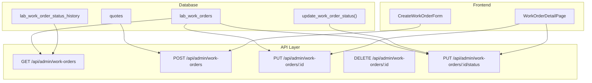
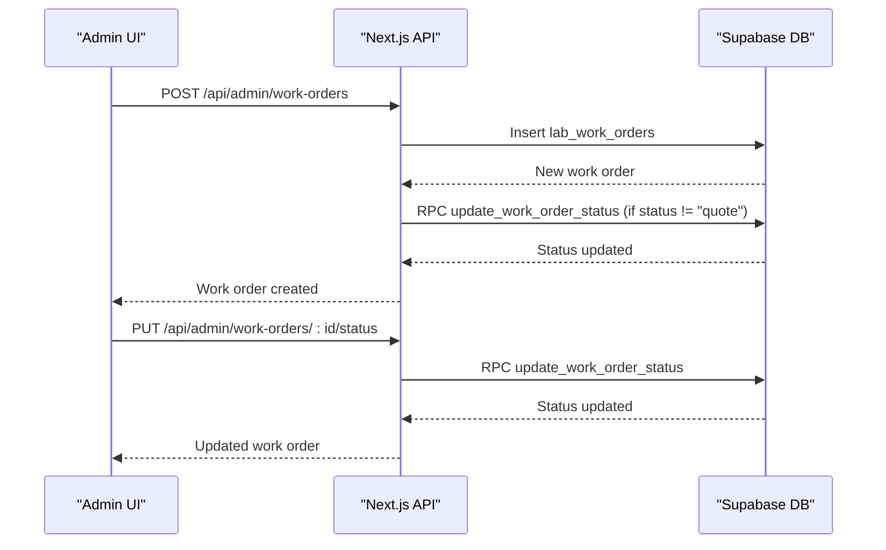
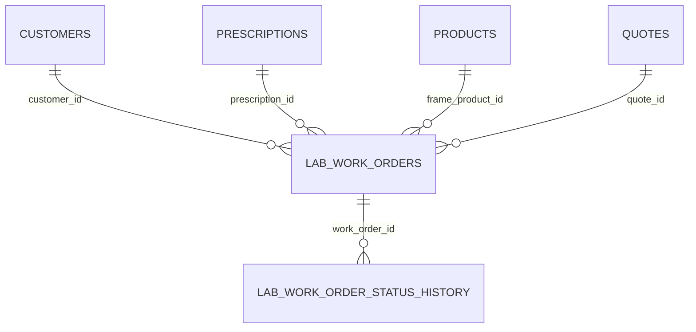
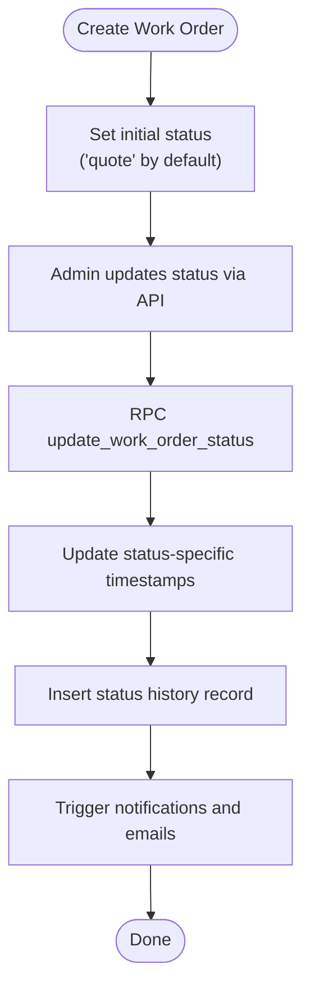
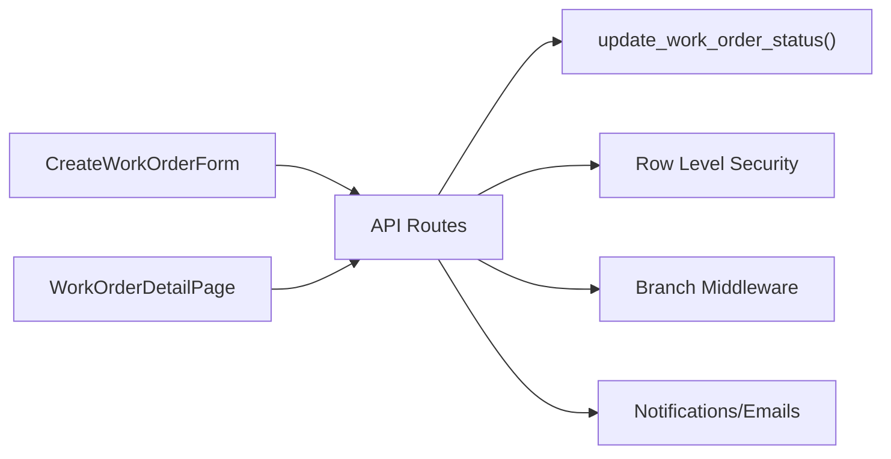

# Work Order Lifecycle Management

<cite>
**Referenced Files in This Document**
- [20250125000000_create_lab_work_orders_system.sql](file://supabase/migrations/20250125000000_create_lab_work_orders_system.sql)
- [route.ts](file://src/app/api/admin/work-orders/route.ts)
- [route.ts](file://src/app/api/admin/work-orders/[id]/route.ts)
- [route.ts](file://src/app/api/admin/work-orders/[id]/status/route.ts)
- [index.tsx](file://src/components/admin/CreateWorkOrderForm/index.tsx)
- [useWorkOrderForm.ts](file://src/components/admin/CreateWorkOrderForm/hooks/useWorkOrderForm.ts)
- [page.tsx](file://src/app/admin/work-orders/[id]/page.tsx)
- [improve_demo_seed_data.sql](file://supabase/migrations/20260131000002_improve_demo_seed_data.sql)
</cite>

## Table of Contents

1. [Introduction](#introduction)
2. [Project Structure](#project-structure)
3. [Core Components](#core-components)
4. [Architecture Overview](#architecture-overview)
5. [Detailed Component Analysis](#detailed-component-analysis)
6. [Dependency Analysis](#dependency-analysis)
7. [Performance Considerations](#performance-considerations)
8. [Troubleshooting Guide](#troubleshooting-guide)
9. [Conclusion](#conclusion)

## Introduction

This document describes the work order lifecycle management system for lab-based optical lens fabrication. It covers the complete workflow from creation through final delivery, including all status transitions, business rules, timing constraints, approval requirements, and the API endpoints for CRUD operations, status updates, and bulk operations. It also documents relationships with related entities such as customers, prescriptions, and orders.

## Project Structure

The work order system spans Supabase database migrations, Next.js API routes, and React admin components:

- Database schema defines tables, constraints, triggers, and stored procedures for work order lifecycle and status tracking.
- API routes implement admin-only endpoints for listing, creating, updating, deleting, and changing statuses of work orders.
- Frontend components provide forms and pages to manage work orders and visualize status histories.

**Diagram sources**

- [20250125000000_create_lab_work_orders_system.sql](file://supabase/migrations/20250125000000_create_lab_work_orders_system.sql#L71-L184)
- [route.ts](file://src/app/api/admin/work-orders/route.ts#L15-L198)
- [route.ts](file://src/app/api/admin/work-orders/route.ts#L200-L437)
- [route.ts](file://src/app/api/admin/work-orders/[id]/route.ts#L11-L98)
- [route.ts](file://src/app/api/admin/work-orders/[id]/route.ts#L100-L289)
- [route.ts](file://src/app/api/admin/work-orders/[id]/route.ts#L291-L422)
- [route.ts](file://src/app/api/admin/work-orders/[id]/status/route.ts#L10-L238)
- [index.tsx](file://src/components/admin/CreateWorkOrderForm/index.tsx#L173-L245)
- [page.tsx](file://src/app/admin/work-orders/[id]/page.tsx#L200-L233)

**Section sources**

- [20250125000000_create_lab_work_orders_system.sql](file://supabase/migrations/20250125000000_create_lab_work_orders_system.sql#L71-L184)
- [route.ts](file://src/app/api/admin/work-orders/route.ts#L15-L198)
- [route.ts](file://src/app/api/admin/work-orders/route.ts#L200-L437)
- [route.ts](file://src/app/api/admin/work-orders/[id]/route.ts#L11-L98)
- [route.ts](file://src/app/api/admin/work-orders/[id]/route.ts#L100-L289)
- [route.ts](file://src/app/api/admin/work-orders/[id]/route.ts#L291-L422)
- [route.ts](file://src/app/api/admin/work-orders/[id]/status/route.ts#L10-L238)
- [index.tsx](file://src/components/admin/CreateWorkOrderForm/index.tsx#L173-L245)
- [page.tsx](file://src/app/admin/work-orders/[id]/page.tsx#L200-L233)

## Core Components

- Database schema: Defines the lab work orders table, quotes table, status history table, and a stored procedure to update status and timestamps.
- API routes: Provide admin-only endpoints for listing, creating, updating, deleting, and changing work order statuses.
- Frontend forms: Provide a structured form to create work orders and a detail page to update status and view history.

Key capabilities:

- Automatic numbering via stored procedures.
- Status change audit trail via status history table.
- Branch-scoped access control via branch middleware.
- Notification and email triggers on status changes.

**Section sources**

- [20250125000000_create_lab_work_orders_system.sql](file://supabase/migrations/20250125000000_create_lab_work_orders_system.sql#L116-L129)
- [route.ts](file://src/app/api/admin/work-orders/route.ts#L252-L261)
- [route.ts](file://src/app/api/admin/work-orders/[id]/status/route.ts#L166-L224)

## Architecture Overview

The system follows a layered architecture:

- Presentation: Admin UI pages and forms.
- Application: Next.js API handlers implementing business logic and validations.
- Persistence: Supabase tables with row-level security and stored procedures.

**Diagram sources**

- [route.ts](file://src/app/api/admin/work-orders/route.ts#L200-L437)
- [route.ts](file://src/app/api/admin/work-orders/[id]/status/route.ts#L10-L238)
- [20250125000000_create_lab_work_orders_system.sql](file://supabase/migrations/20250125000000_create_lab_work_orders_system.sql#L274-L323)

## Detailed Component Analysis

### Database Schema and Stored Procedures

- Tables:
  - lab_work_orders: Core entity with status, pricing, payment, and timestamps.
  - quotes: Related entity for quotes converted to work orders.
  - lab_work_order_status_history: Audit trail of status changes.
- Functions:
  - update_work_order_status: Updates status and associated timestamps, and records history.
  - generate_work_order_number: Auto-numbering for work orders.

**Diagram sources**

- [20250125000000_create_lab_work_orders_system.sql](file://supabase/migrations/20250125000000_create_lab_work_orders_system.sql#L71-L184)

**Section sources**

- [20250125000000_create_lab_work_orders_system.sql](file://supabase/migrations/20250125000000_create_lab_work_orders_system.sql#L71-L184)
- [20250125000000_create_lab_work_orders_system.sql](file://supabase/migrations/20250125000000_create_lab_work_orders_system.sql#L274-L323)

### Work Order Status Transitions

Allowed statuses and their meaning:

- quote, ordered, sent_to_lab, in_progress_lab, ready_at_lab, received_from_lab, mounted, quality_check, ready_for_pickup, delivered, cancelled, returned.

Business rules and timing constraints:

- Status changes are enforced via a stored procedure that updates the status and corresponding timestamps.
- Specific timestamps are set per status (e.g., sent_to_lab sets sent_to_lab_at).
- The status history table captures from_status, to_status, and changed_by.

**Diagram sources**

- [20250125000000_create_lab_work_orders_system.sql](file://supabase/migrations/20250125000000_create_lab_work_orders_system.sql#L116-L129)
- [20250125000000_create_lab_work_orders_system.sql](file://supabase/migrations/20250125000000_create_lab_work_orders_system.sql#L274-L323)
- [route.ts](file://src/app/api/admin/work-orders/[id]/status/route.ts#L166-L224)

**Section sources**

- [20250125000000_create_lab_work_orders_system.sql](file://supabase/migrations/20250125000000_create_lab_work_orders_system.sql#L116-L129)
- [route.ts](file://src/app/api/admin/work-orders/[id]/status/route.ts#L79-L99)

### API Endpoints

#### List Work Orders

- Method: GET
- Path: /api/admin/work-orders
- Query parameters:
  - status: Filter by status or "all".
  - customer_id: Filter by customer.
  - page: Page number (default 1).
  - limit: Items per page (default 20).
- Response: workOrders with related entities (customer, prescription, quote, frame_product, assigned_staff), pagination metadata.

**Section sources**

- [route.ts](file://src/app/api/admin/work-orders/route.ts#L15-L198)

#### Create Work Order

- Method: POST
- Path: /api/admin/work-orders
- Authorization: Admin required.
- Body: Work order fields including customer_id, prescription_id, frame/lens specs, pricing, payment info, and optional quote_id.
- Behavior:
  - Generates work order number via RPC.
  - Optionally snapshots prescription data.
  - If status is not "quote", invokes update_work_order_status RPC to set timestamps and history.
  - Emits notifications.

**Section sources**

- [route.ts](file://src/app/api/admin/work-orders/route.ts#L200-L437)
- [20250125000000_create_lab_work_orders_system.sql](file://supabase/migrations/20250125000000_create_lab_work_orders_system.sql#L251-L272)

#### Get Work Order Details

- Method: GET
- Path: /api/admin/work-orders/:id
- Returns: Work order with related entities and status history.

**Section sources**

- [route.ts](file://src/app/api/admin/work-orders/[id]/route.ts#L11-L98)

#### Update Work Order Fields

- Method: PUT
- Path: /api/admin/work-orders/:id
- Authorization: Admin required.
- Allowed fields: Frame/lens specs, pricing, payment info, notes, assigned staff, lab contact person, etc.

**Section sources**

- [route.ts](file://src/app/api/admin/work-orders/[id]/route.ts#L100-L289)

#### Delete Work Order

- Method: DELETE
- Path: /api/admin/work-orders/:id
- Authorization: Admin required.
- Constraints:
  - Cannot delete delivered work orders unless explicitly allowed.
  - Cannot delete work orders with payments registered unless explicitly allowed.
  - If the work order was converted from a quote, the quote is also deleted.

**Section sources**

- [route.ts](file://src/app/api/admin/work-orders/[id]/route.ts#L291-L422)

#### Update Work Order Status

- Method: PUT
- Path: /api/admin/work-orders/:id/status
- Authorization: Admin required.
- Body: status (required), notes (optional), plus optional additional fields (lab info, notes, assigned staff).
- Behavior:
  - Calls update_work_order_status RPC.
  - Optionally updates additional fields atomically.
  - Emits notifications and emails (e.g., ready_for_pickup triggers customer email).

**Section sources**

- [route.ts](file://src/app/api/admin/work-orders/[id]/status/route.ts#L10-L238)

### Frontend Forms and Pages

#### Create Work Order Form

- Provides sections for customer, prescription, frame, lens configuration, lab info, pricing, status, and notes.
- Submits to POST /api/admin/work-orders.
- Loads quote data when quoteId is provided.

**Section sources**

- [index.tsx](file://src/components/admin/CreateWorkOrderForm/index.tsx#L173-L245)
- [useWorkOrderForm.ts](file://src/components/admin/CreateWorkOrderForm/hooks/useWorkOrderForm.ts#L89-L164)

#### Work Order Detail Page

- Displays work order details and status history.
- Allows status updates via PUT /api/admin/work-orders/:id/status.
- Special handling for delivered status (opens delivery dialog).

**Section sources**

- [page.tsx](file://src/app/admin/work-orders/[id]/page.tsx#L200-L233)

### Typical Workflows

#### From Quote to Work Order

- Convert a quote to a work order by setting status to "ordered" during creation or via status update.
- The system snapshots prescription data and auto-generates a work order number.

**Section sources**

- [route.ts](file://src/app/api/admin/work-orders/route.ts#L263-L275)
- [route.ts](file://src/app/api/admin/work-orders/route.ts#L399-L407)

#### Standard Lens Fabrication Flow

- ordered → sent_to_lab → in_progress_lab → ready_at_lab → received_from_lab → mounted → quality_check → ready_for_pickup → delivered.

**Section sources**

- [20250125000000_create_lab_work_orders_system.sql](file://supabase/migrations/20250125000000_create_lab_work_orders_system.sql#L116-L129)

#### Cancellation and Return

- cancelled: Used when the work order is canceled.
- returned: Used when the customer returns the finished product.

**Section sources**

- [20250125000000_create_lab_work_orders_system.sql](file://supabase/migrations/20250125000000_create_lab_work_orders_system.sql#L116-L129)

### Error Scenarios and Validation

- Unauthorized access: Admin access required for all work order endpoints.
- Branch access: Requests must match the user's branch context.
- Deletion constraints: Prevents deletion of delivered or paid work orders unless explicitly allowed.
- Validation errors: Body validation via Zod schemas; errors return structured messages.

**Section sources**

- [route.ts](file://src/app/api/admin/work-orders/route.ts#L200-L236)
- [route.ts](file://src/app/api/admin/work-orders/[id]/route.ts#L291-L380)

## Dependency Analysis

- API routes depend on Supabase clients and branch middleware for authorization and filtering.
- Status updates depend on the stored procedure update_work_order_status.
- Notifications and emails are triggered after successful status changes.

**Diagram sources**

- [route.ts](file://src/app/api/admin/work-orders/route.ts#L200-L437)
- [route.ts](file://src/app/api/admin/work-orders/[id]/status/route.ts#L166-L224)
- [20250125000000_create_lab_work_orders_system.sql](file://supabase/migrations/20250125000000_create_lab_work_orders_system.sql#L274-L323)

**Section sources**

- [route.ts](file://src/app/api/admin/work-orders/route.ts#L200-L437)
- [route.ts](file://src/app/api/admin/work-orders/[id]/status/route.ts#L166-L224)

## Performance Considerations

- Batch relation loading: The GET endpoint performs batch queries to avoid N+1 issues when fetching related entities.
- Indexes: Database includes indexes on frequently filtered columns (status, customer_id, work_order_number, etc.).
- Stored procedures: Centralized status update logic reduces duplication and ensures consistency.

**Section sources**

- [route.ts](file://src/app/api/admin/work-orders/route.ts#L92-L180)
- [20250125000000_create_lab_work_orders_system.sql](file://supabase/migrations/20250125000000_create_lab_work_orders_system.sql#L207-L226)

## Troubleshooting Guide

Common issues and resolutions:

- Unauthorized: Ensure the user has admin privileges and is authenticated.
- Branch access denied: Verify the user belongs to the correct branch context.
- Status update failures: Confirm the status value is valid and the stored procedure executes without errors.
- Deletion blocked: Adjust constraints or pass allowDelivered flag when deleting delivered/paid work orders from the detail page.
- Missing related data: Confirm that customer, prescription, quote, and product IDs exist and are accessible.

**Section sources**

- [route.ts](file://src/app/api/admin/work-orders/[id]/route.ts#L66-L77)
- [route.ts](file://src/app/api/admin/work-orders/[id]/status/route.ts#L62-L74)
- [route.ts](file://src/app/api/admin/work-orders/[id]/route.ts#L357-L365)

## Conclusion

The work order lifecycle management system provides a robust, auditable, and secure framework for managing optical lens fabrication from quote to delivery. Its design emphasizes clear status transitions, branch-aware access control, comprehensive notifications, and efficient API operations backed by database constraints and stored procedures.
