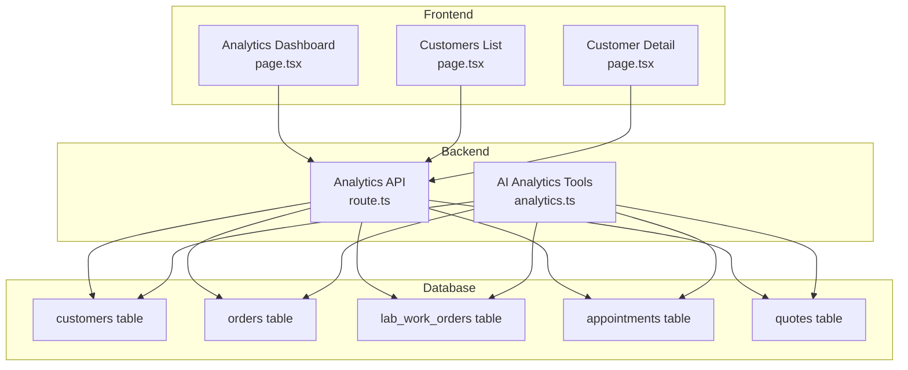
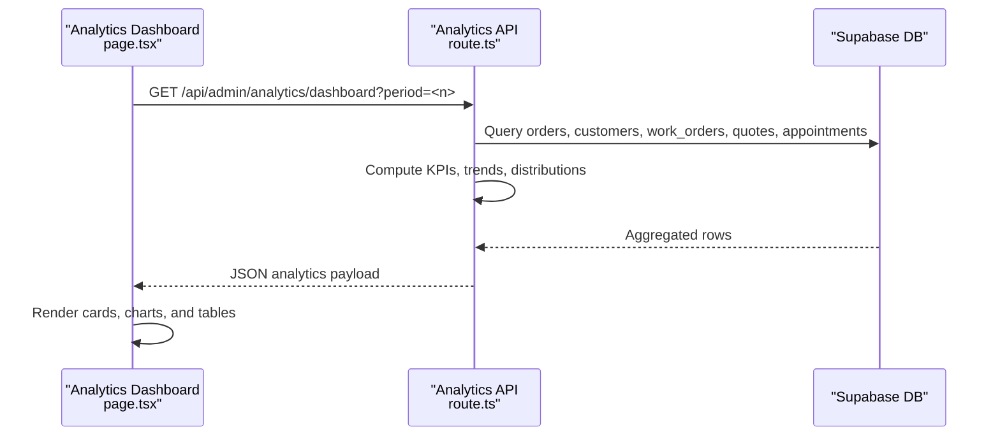
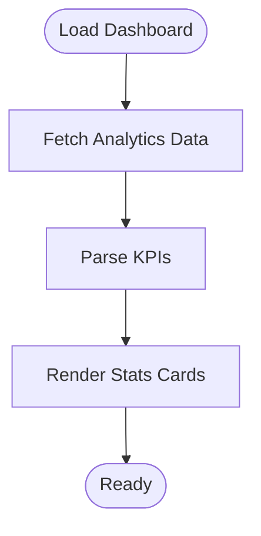
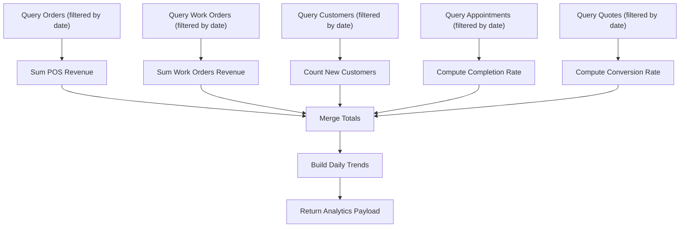
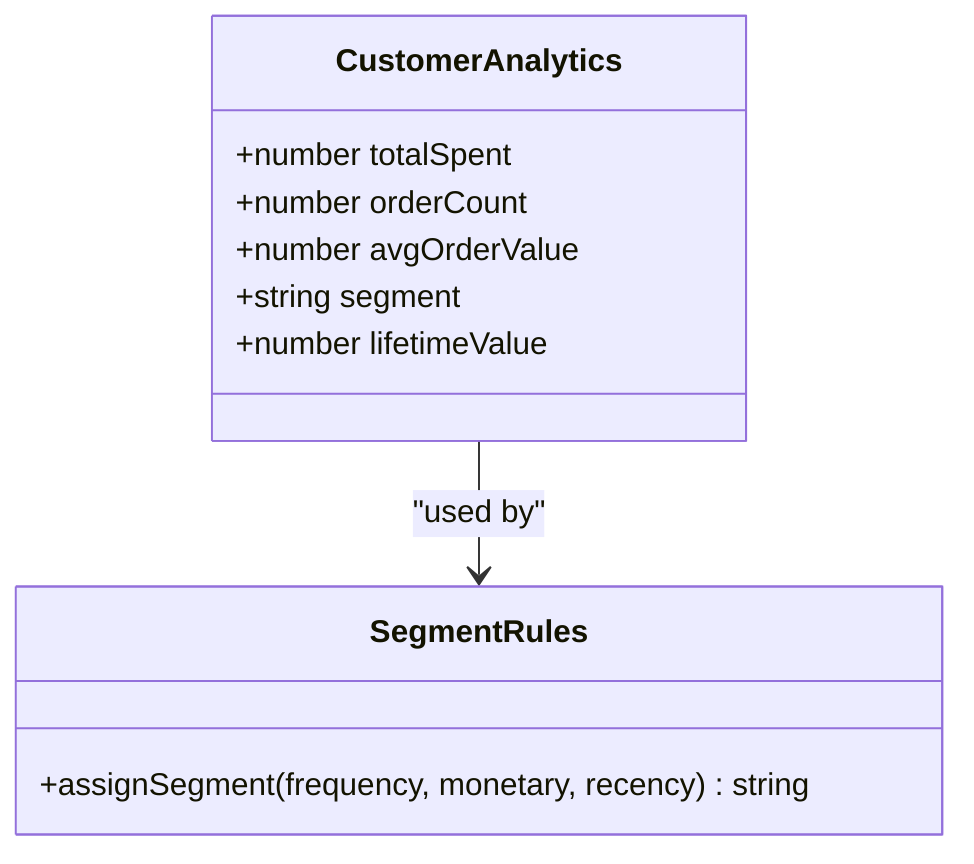
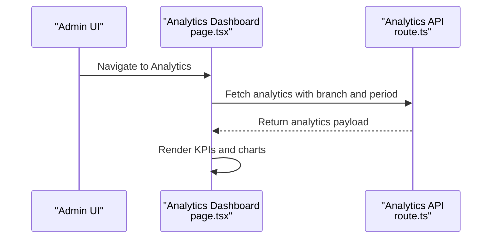
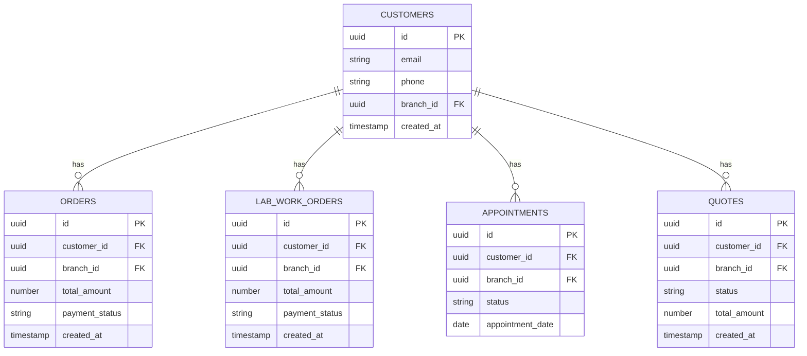

# Customer Analytics & Segmentation

<cite>
**Referenced Files in This Document**
- [page.tsx](file://src/app/admin/analytics/page.tsx)
- [route.ts](file://src/app/api/admin/analytics/dashboard/route.ts)
- [analytics.ts](file://src/lib/analytics-help.ts)
- [analytics.ts](file://src/lib/ai/tools/analytics.ts)
- [page.tsx](file://src/app/admin/customers/page.tsx)
- [page.tsx](file://src/app/admin/customers/[id]/page.tsx)
- [20251218000001_update_customer_references.sql](file://supabase/migrations/20251218000001_update_customer_references.sql)
</cite>

## Table of Contents

1. [Introduction](#introduction)
2. [Project Structure](#project-structure)
3. [Core Components](#core-components)
4. [Architecture Overview](#architecture-overview)
5. [Detailed Component Analysis](#detailed-component-analysis)
6. [Dependency Analysis](#dependency-analysis)
7. [Performance Considerations](#performance-considerations)
8. [Troubleshooting Guide](#troubleshooting-guide)
9. [Conclusion](#conclusion)

## Introduction

This document describes the customer analytics and segmentation capabilities in Opttius. It covers the customer statistics dashboard, segmentation system, analytics data collection, aggregation methods, real-time metric updates, integration with the main dashboard, export capabilities, and data privacy considerations. The goal is to provide a comprehensive understanding of how customer KPIs are computed, presented, and leveraged for actionable insights.

## Project Structure

The customer analytics and segmentation features span frontend dashboards, backend analytics APIs, and database schema updates that unify customer references across related entities.

**Diagram sources**

- [page.tsx](file://src/app/admin/analytics/page.tsx#L134-L191)
- [route.ts](file://src/app/api/admin/analytics/dashboard/route.ts#L8-L635)
- [page.tsx](file://src/app/admin/customers/page.tsx#L75-L159)
- [page.tsx](file://src/app/admin/customers/[id]/page.tsx#L225-L402)
- [20251218000001_update_customer_references.sql](file://supabase/migrations/20251218000001_update_customer_references.sql#L1-L152)

**Section sources**

- [page.tsx](file://src/app/admin/analytics/page.tsx#L1-L1165)
- [route.ts](file://src/app/api/admin/analytics/dashboard/route.ts#L1-L635)
- [page.tsx](file://src/app/admin/customers/page.tsx#L1-L516)
- [page.tsx](file://src/app/admin/customers/[id]/page.tsx#L1-L800)
- [20251218000001_update_customer_references.sql](file://supabase/migrations/20251218000001_update_customer_references.sql#L1-L152)

## Core Components

- Customer statistics dashboard: displays total customers, active customers, and new customers this month.
- Analytics API: computes KPIs, trends, and distributions for the dashboard.
- Customer segmentation: assigns segments based on purchase history, frequency, and lifetime value.
- Real-time metric updates: refresh controls and branch-aware filtering.
- Integration with main dashboard: unified analytics endpoint and branch context.
- Export capabilities: customer list and analytics summaries via API endpoints.
- Data privacy: branch scoping, feature gating, and anonymization considerations.

**Section sources**

- [page.tsx](file://src/app/admin/analytics/page.tsx#L348-L576)
- [route.ts](file://src/app/api/admin/analytics/dashboard/route.ts#L59-L635)
- [page.tsx](file://src/app/admin/customers/page.tsx#L69-L73)
- [page.tsx](file://src/app/admin/customers/[id]/page.tsx#L128-L138)

## Architecture Overview

The analytics pipeline integrates frontend dashboards with backend computation and database queries. The analytics API aggregates data across orders, work orders, appointments, quotes, and customers, applying branch filters and computing KPIs and trends.

**Diagram sources**

- [page.tsx](file://src/app/admin/analytics/page.tsx#L160-L191)
- [route.ts](file://src/app/api/admin/analytics/dashboard/route.ts#L8-L635)

## Detailed Component Analysis

### Customer Statistics Dashboard

The dashboard presents key customer metrics:

- Total customers
- Active customers
- New customers this month

These are derived from customer registration timestamps and order/work-order activity.

**Diagram sources**

- [page.tsx](file://src/app/admin/analytics/page.tsx#L348-L576)
- [route.ts](file://src/app/api/admin/analytics/dashboard/route.ts#L350-L378)

**Section sources**

- [page.tsx](file://src/app/admin/analytics/page.tsx#L348-L576)
- [route.ts](file://src/app/api/admin/analytics/dashboard/route.ts#L350-L378)

### Analytics Data Collection and Aggregation

The backend aggregates data across multiple entities:

- Orders: POS sales, payment status, totals
- Work orders: payment status, delivery timing
- Appointments: statuses and completion rate
- Quotes: statuses and conversion rate
- Customers: total, new in period, recurring

**Diagram sources**

- [route.ts](file://src/app/api/admin/analytics/dashboard/route.ts#L172-L618)

**Section sources**

- [route.ts](file://src/app/api/admin/analytics/dashboard/route.ts#L172-L618)

### Customer Segmentation System

Segments are assigned based on purchase history, frequency, and lifetime value. The customer detail page surfaces analytics such as total spent, order count, average order value, and lifetime value.

**Diagram sources**

- [page.tsx](file://src/app/admin/customers/[id]/page.tsx#L128-L138)
- [page.tsx](file://src/app/admin/customers/[id]/page.tsx#L267-L313)

**Section sources**

- [page.tsx](file://src/app/admin/customers/[id]/page.tsx#L128-L138)
- [page.tsx](file://src/app/admin/customers/[id]/page.tsx#L267-L313)

### Implementation Examples

#### Customer Lifetime Value (LTV) Calculation

LTV can be computed as the sum of customer order values over their lifetime. The customer detail page exposes a lifetime value field for quick insight.

- Input: customer orders with totals and statuses
- Process: sum qualifying order totals
- Output: lifetime value

**Section sources**

- [page.tsx](file://src/app/admin/customers/[id]/page.tsx#L128-L138)

#### Purchase Frequency Analysis

Frequency is derived from counting orders per customer across the selected period. The analytics API aggregates counts by customer email/customer_id and flags recurring customers.

- Input: orders and work orders with customer identifiers
- Process: group by customer identifier, count occurrences
- Output: recurring customer count

**Section sources**

- [route.ts](file://src/app/api/admin/analytics/dashboard/route.ts#L359-L378)

#### Revenue Attribution

Revenue attribution distinguishes POS sales versus work orders revenue and computes growth against a previous period window.

- Input: orders (POS sales), work orders
- Process: filter by payment status, compute totals and previous period totals
- Output: total revenue, work orders revenue, POS revenue, growth percentage

**Section sources**

- [route.ts](file://src/app/api/admin/analytics/dashboard/route.ts#L207-L240)

### Integration with Main Dashboard

The analytics dashboard integrates with the main admin interface through:

- Branch-aware filtering via branch context
- Feature gating for advanced analytics
- Unified KPI rendering and chart components

**Diagram sources**

- [page.tsx](file://src/app/admin/analytics/page.tsx#L134-L191)
- [route.ts](file://src/app/api/admin/analytics/dashboard/route.ts#L59-L635)

**Section sources**

- [page.tsx](file://src/app/admin/analytics/page.tsx#L134-L191)
- [route.ts](file://src/app/api/admin/analytics/dashboard/route.ts#L59-L635)

### Export Capabilities

Customer data and analytics summaries can be exported via API endpoints:

- Customer list with analytics summary
- Customer detail with comprehensive analytics
- Sales reports and revenue trends via AI tools

**Section sources**

- [page.tsx](file://src/app/admin/customers/page.tsx#L134-L159)
- [page.tsx](file://src/app/admin/customers/[id]/page.tsx#L248-L265)
- [analytics.ts](file://src/lib/ai/tools/analytics.ts#L31-L136)

### Data Privacy Considerations

- Branch scoping: queries are filtered by branch context to prevent cross-branch data leakage.
- Feature gating: advanced analytics require a feature flag per organization tier.
- Anonymization: personal identifiers (email, phone) are handled according to branch and organization policies; ensure PII is masked or aggregated in dashboards.
- Compliance: adhere to regional data protection regulations; restrict access to authorized admins only.

**Section sources**

- [route.ts](file://src/app/api/admin/analytics/dashboard/route.ts#L35-L57)
- [route.ts](file://src/app/api/admin/analytics/dashboard/route.ts#L112-L131)

## Dependency Analysis

The analytics system depends on unified customer references across related entities, ensuring accurate attribution and reporting.

**Diagram sources**

- [20251218000001_update_customer_references.sql](file://supabase/migrations/20251218000001_update_customer_references.sql#L1-L152)

**Section sources**

- [20251218000001_update_customer_references.sql](file://supabase/migrations/20251218000001_update_customer_references.sql#L1-L152)

## Performance Considerations

- Use branch filters to minimize dataset size.
- Prefer indexed columns (branch_id, created_at) in queries.
- Aggregate at the database level to reduce payload sizes.
- Cache frequently accessed dashboards for short periods.
- Batch requests for multiple charts to reduce round trips.

## Troubleshooting Guide

Common issues and resolutions:

- Unauthorized access: ensure admin role and feature flag for advanced analytics.
- Empty data: verify branch selection and date range; confirm entity relationships.
- Missing customer analytics: ensure customer references are properly migrated and branch-scoped.

**Section sources**

- [route.ts](file://src/app/api/admin/analytics/dashboard/route.ts#L14-L57)
- [page.tsx](file://src/app/admin/analytics/page.tsx#L276-L301)

## Conclusion

Opttius provides a robust customer analytics and segmentation system with real-time dashboards, branch-aware filtering, and comprehensive KPIs. The unified customer model across orders, work orders, appointments, and quotes enables accurate lifetime value and frequency analysis. By adhering to privacy and compliance guidelines and leveraging the provided APIs, administrators can derive actionable insights and drive customer-centric decisions.
