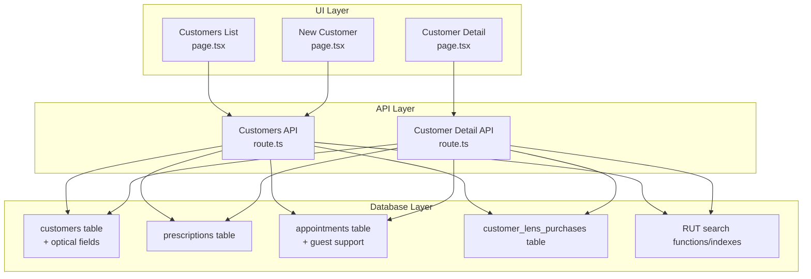
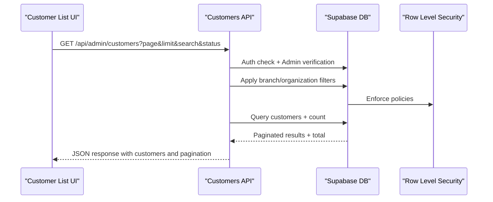
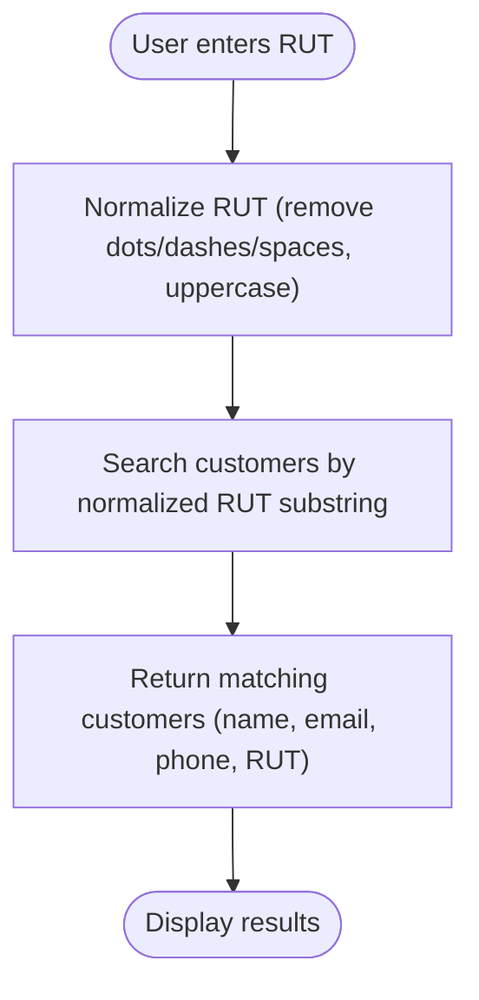
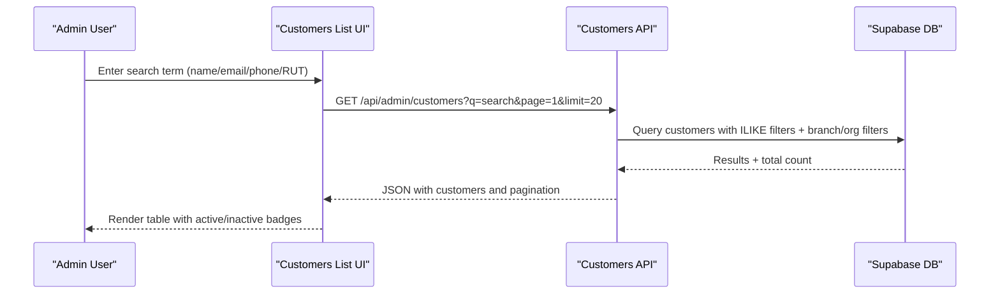
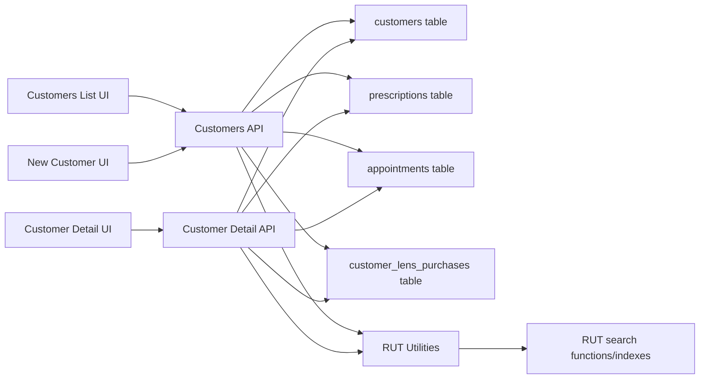

# Customer Management

<cite>
**Referenced Files in This Document**
- [20250123000000_adapt_customers_for_optical_shop.sql](file://supabase/migrations/20250123000000_adapt_customers_for_optical_shop.sql)
- [20250131000001_add_rut_search_function.sql](file://supabase/migrations/20250131000001_add_rut_search_function.sql)
- [20250131000002_modify_appointments_for_guest_customers.sql](file://supabase/migrations/20250131000002_modify_appointments_for_guest_customers.sql)
- [page.tsx (Customers List)](file://src/app/admin/customers/page.tsx)
- [page.tsx (New Customer)](file://src/app/admin/customers/new/page.tsx)
- [route.ts (Customers API)](file://src/app/api/admin/customers/route.ts)
- [page.tsx (Customer Detail)](file://src/app/admin/customers/[id]/page.tsx)
- [route.ts (Customer Detail API)](file://src/app/api/admin/customers/[id]/route.ts)
- [rut.ts (RUT Utilities)](file://src/lib/utils/rut.ts)
</cite>

## Table of Contents

1. [Introduction](#introduction)
2. [Project Structure](#project-structure)
3. [Core Components](#core-components)
4. [Architecture Overview](#architecture-overview)
5. [Detailed Component Analysis](#detailed-component-analysis)
6. [Dependency Analysis](#dependency-analysis)
7. [Performance Considerations](#performance-considerations)
8. [Troubleshooting Guide](#troubleshooting-guide)
9. [Privacy and Compliance](#privacy-and-compliance)
10. [Conclusion](#conclusion)

## Introduction

This document explains the customer management system in Opttius with a focus on comprehensive patient and client profiles for an optical practice. It covers:

- Dual system: registered customers with full medical histories and walk-in (guest) patients for appointment booking
- Profile creation, medical information capture, and appointment history tracking
- Chilean RUT formatting and intelligent search
- Data normalization and indexing strategies
- Implementation examples for customer lookup, profile updates, and medical record integration
- Relationships among customers, prescriptions, appointments, and purchase history
- Privacy considerations, data retention, and HIPAA alignment

## Project Structure

The customer management system spans UI pages, API routes, and Supabase database migrations:

- UI: customer listing, creation, and detail views
- API: customer CRUD, analytics, and detail aggregation
- Database: customer profiles, prescriptions, appointments, and purchase history with RUT search and guest appointment support

**Diagram sources**

- [page.tsx (Customers List)](file://src/app/admin/customers/page.tsx#L1-L516)
- [page.tsx (New Customer)](file://src/app/admin/customers/new/page.tsx#L1-L353)
- [page.tsx (Customer Detail)](file://src/app/admin/customers/[id]/page.tsx#L1-L800)
- [route.ts (Customers API)](file://src/app/api/admin/customers/route.ts#L1-L703)
- [route.ts (Customer Detail API)](file://src/app/api/admin/customers/[id]/route.ts#L1-L651)
- [20250123000000_adapt_customers_for_optical_shop.sql](file://supabase/migrations/20250123000000_adapt_customers_for_optical_shop.sql#L1-L455)
- [20250131000001_add_rut_search_function.sql](file://supabase/migrations/20250131000001_add_rut_search_function.sql#L1-L48)
- [20250131000002_modify_appointments_for_guest_customers.sql](file://supabase/migrations/20250131000002_modify_appointments_for_guest_customers.sql#L1-L38)

**Section sources**

- [page.tsx (Customers List)](file://src/app/admin/customers/page.tsx#L1-L516)
- [page.tsx (New Customer)](file://src/app/admin/customers/new/page.tsx#L1-L353)
- [page.tsx (Customer Detail)](file://src/app/admin/customers/[id]/page.tsx#L1-L800)
- [route.ts (Customers API)](file://src/app/api/admin/customers/route.ts#L1-L703)
- [route.ts (Customer Detail API)](file://src/app/api/admin/customers/[id]/route.ts#L1-L651)
- [20250123000000_adapt_customers_for_optical_shop.sql](file://supabase/migrations/20250123000000_adapt_customers_for_optical_shop.sql#L1-L455)
- [20250131000001_add_rut_search_function.sql](file://supabase/migrations/20250131000001_add_rut_search_function.sql#L1-L48)
- [20250131000002_modify_appointments_for_guest_customers.sql](file://supabase/migrations/20250131000002_modify_appointments_for_guest_customers.sql#L1-L38)

## Core Components

- Customer profiles: personal info, contact preferences, and optical-specific medical data
- Prescriptions: vision correction details, validity, and lens specifications
- Appointments: scheduling, types, outcomes, and optional guest customer support
- Purchase history: lens/frame purchases linked to prescriptions
- RUT system: formatting, normalization, and partial search

Key implementation highlights:

- Dual customer model: registered customers and guest appointments
- Comprehensive medical history fields for optometry
- Intelligent RUT search via normalization and functional indexes
- Multi-tenant filtering by organization and branch
- Analytics aggregation per customer (spending, segments, favorites)

**Section sources**

- [20250123000000_adapt_customers_for_optical_shop.sql](file://supabase/migrations/20250123000000_adapt_customers_for_optical_shop.sql#L5-L37)
- [20250123000000_adapt_customers_for_optical_shop.sql](file://supabase/migrations/20250123000000_adapt_customers_for_optical_shop.sql#L38-L197)
- [20250131000002_modify_appointments_for_guest_customers.sql](file://supabase/migrations/20250131000002_modify_appointments_for_guest_customers.sql#L5-L38)
- [20250131000001_add_rut_search_function.sql](file://supabase/migrations/20250131000001_add_rut_search_function.sql#L5-L48)
- [route.ts (Customers API)](file://src/app/api/admin/customers/route.ts#L84-L126)
- [route.ts (Customer Detail API)](file://src/app/api/admin/customers/[id]/route.ts#L58-L88)

## Architecture Overview

The system integrates UI, API, and database layers with strict access controls and tenant-aware queries.

**Diagram sources**

- [route.ts (Customers API)](file://src/app/api/admin/customers/route.ts#L22-L223)
- [20250123000000_adapt_customers_for_optical_shop.sql](file://supabase/migrations/20250123000000_adapt_customers_for_optical_shop.sql#L315-L442)

**Section sources**

- [route.ts (Customers API)](file://src/app/api/admin/customers/route.ts#L22-L223)
- [20250123000000_adapt_customers_for_optical_shop.sql](file://supabase/migrations/20250123000000_adapt_customers_for_optical_shop.sql#L315-L442)

## Detailed Component Analysis

### Customer Profiles and Medical History

- Fields include personal info, contact preferences, and optometric medical data (conditions, allergies, medications, eye exam dates, emergency contacts, insurance).
- Stored in a dedicated customers table with organization and branch linkage for multi-tenancy.
- UI supports creation, editing, and viewing comprehensive profiles.

Implementation examples:

- Create a customer: [POST /api/admin/customers](file://src/app/api/admin/customers/route.ts#L226-L703)
- Update a customer: [PUT /api/admin/customers/[id]](file://src/app/api/admin/customers/[id]/route.ts#L353-L526)
- View customer detail with related data: [GET /api/admin/customers/[id]](file://src/app/api/admin/customers/[id]/route.ts#L7-L351)

**Section sources**

- [20250123000000_adapt_customers_for_optical_shop.sql](file://supabase/migrations/20250123000000_adapt_customers_for_optical_shop.sql#L5-L37)
- [page.tsx (New Customer)](file://src/app/admin/customers/new/page.tsx#L31-L133)
- [route.ts (Customers API)](file://src/app/api/admin/customers/route.ts#L303-L596)
- [route.ts (Customer Detail API)](file://src/app/api/admin/customers/[id]/route.ts#L90-L114)

### Prescriptions and Vision Records

- Complete optical prescription data: sphere, cylinder, axis, add, pupillary distances, lens type/material, special requirements (prism, tint, coatings), notes, and status.
- Functions to retrieve current and upcoming records.

Implementation examples:

- Retrieve current prescription: [get_current_prescription](file://supabase/migrations/20250123000000_adapt_customers_for_optical_shop.sql#L253-L285)
- Fetch upcoming appointments: [get_upcoming_appointments](file://supabase/migrations/20250123000000_adapt_customers_for_optical_shop.sql#L287-L313)

**Section sources**

- [20250123000000_adapt_customers_for_optical_shop.sql](file://supabase/migrations/20250123000000_adapt_customers_for_optical_shop.sql#L38-L95)
- [20250123000000_adapt_customers_for_optical_shop.sql](file://supabase/migrations/20250123000000_adapt_customers_for_optical_shop.sql#L253-L313)
- [route.ts (Customer Detail API)](file://src/app/api/admin/customers/[id]/route.ts#L155-L173)

### Appointments and Guest Patients

- Supports registered customers and guest appointments with separate fields for guest data and constraints ensuring completeness.
- Indexes enable efficient searches by guest RUT/email.

Implementation examples:

- Allow guest appointments: [modify_appointments_for_guest_customers](file://supabase/migrations/20250131000002_modify_appointments_for_guest_customers.sql#L5-L38)

**Section sources**

- [20250131000002_modify_appointments_for_guest_customers.sql](file://supabase/migrations/20250131000002_modify_appointments_for_guest_customers.sql#L5-L38)
- [route.ts (Customer Detail API)](file://src/app/api/admin/customers/[id]/route.ts#L174-L190)

### Purchase History and Lens Tracking

- Tracks lens/frame purchases linked to prescriptions and orders, including product specs, pricing, warranty, and delivery status.

Implementation examples:

- Lens purchase history table: [customer_lens_purchases](file://supabase/migrations/20250123000000_adapt_customers_for_optical_shop.sql#L147-L197)

**Section sources**

- [20250123000000_adapt_customers_for_optical_shop.sql](file://supabase/migrations/20250123000000_adapt_customers_for_optical_shop.sql#L147-L197)
- [route.ts (Customer Detail API)](file://src/app/api/admin/customers/[id]/route.ts#L192-L206)

### RUT Formatting, Normalization, and Intelligent Search

- Front-end formatting: [formatRUT](file://src/lib/utils/rut.ts#L17-L38)
- Backend normalization and search: [normalize_rut_for_search](file://supabase/migrations/20250131000001_add_rut_search_function.sql#L5-L15), [search_customers_by_rut](file://supabase/migrations/20250131000001_add_rut_search_function.sql#L23-L47)
- Indexing for fast partial matches: [functional index on normalized RUT](file://supabase/migrations/20250131000001_add_rut_search_function.sql#L17-L21)

**Diagram sources**

- [rut.ts (RUT Utilities)](file://src/lib/utils/rut.ts#L47-L50)
- [20250131000001_add_rut_search_function.sql](file://supabase/migrations/20250131000001_add_rut_search_function.sql#L5-L48)

**Section sources**

- [rut.ts (RUT Utilities)](file://src/lib/utils/rut.ts#L17-L65)
- [20250131000001_add_rut_search_function.sql](file://supabase/migrations/20250131000001_add_rut_search_function.sql#L5-L48)

### UI Workflows and Examples

- Customer listing with search and filters: [Customers List](file://src/app/admin/customers/page.tsx#L89-L159)
- New customer creation with RUT formatting: [New Customer](file://src/app/admin/customers/new/page.tsx#L72-L133)
- Customer detail with analytics and related records: [Customer Detail](file://src/app/admin/customers/[id]/page.tsx#L242-L342)

**Diagram sources**

- [page.tsx (Customers List)](file://src/app/admin/customers/page.tsx#L89-L159)
- [route.ts (Customers API)](file://src/app/api/admin/customers/route.ts#L22-L223)

**Section sources**

- [page.tsx (Customers List)](file://src/app/admin/customers/page.tsx#L89-L159)
- [route.ts (Customers API)](file://src/app/api/admin/customers/route.ts#L22-L223)

## Dependency Analysis

- UI depends on API routes for data operations
- API routes depend on Supabase client and branch/organization context
- Database migrations define schema, indexes, and RLS policies
- RUT utilities bridge front-end formatting and back-end normalization

**Diagram sources**

- [page.tsx (Customers List)](file://src/app/admin/customers/page.tsx#L1-L516)
- [page.tsx (New Customer)](file://src/app/admin/customers/new/page.tsx#L1-L353)
- [page.tsx (Customer Detail)](file://src/app/admin/customers/[id]/page.tsx#L1-L800)
- [route.ts (Customers API)](file://src/app/api/admin/customers/route.ts#L1-L703)
- [route.ts (Customer Detail API)](file://src/app/api/admin/customers/[id]/route.ts#L1-L651)
- [rut.ts (RUT Utilities)](file://src/lib/utils/rut.ts#L1-L65)
- [20250131000001_add_rut_search_function.sql](file://supabase/migrations/20250131000001_add_rut_search_function.sql#L1-L48)

**Section sources**

- [route.ts (Customers API)](file://src/app/api/admin/customers/route.ts#L1-L703)
- [route.ts (Customer Detail API)](file://src/app/api/admin/customers/[id]/route.ts#L1-L651)
- [rut.ts (RUT Utilities)](file://src/lib/utils/rut.ts#L1-L65)
- [20250131000001_add_rut_search_function.sql](file://supabase/migrations/20250131000001_add_rut_search_function.sql#L1-L48)

## Performance Considerations

- Functional indexes on normalized RUT enable fast partial matches
- Dedicated indexes on foreign keys and frequently queried columns (customer_id, status, dates)
- Pagination and count queries to avoid large result sets
- Lazy loading of heavy forms (e.g., CreatePrescriptionForm) to reduce initial bundle size

Recommendations:

- Monitor slow queries using database logs and add missing indexes as needed
- Cache frequently accessed customer analytics summaries
- Use branch filters early to minimize result sets

[No sources needed since this section provides general guidance]

## Troubleshooting Guide

Common issues and resolutions:

- Unauthorized access: ensure admin verification passes and user belongs to the correct organization/branch
- Branch context problems: verify x-branch-id header and organization_id linkage
- Duplicate customer entries: check uniqueness constraints for email/RUT within branch
- RUT search not returning results: confirm RUT normalization and functional index presence

**Section sources**

- [route.ts (Customers API)](file://src/app/api/admin/customers/route.ts#L55-L82)
- [route.ts (Customers API)](file://src/app/api/admin/customers/route.ts#L364-L446)
- [20250131000001_add_rut_search_function.sql](file://supabase/migrations/20250131000001_add_rut_search_function.sql#L17-L21)

## Privacy and Compliance

- Access control: RLS policies restrict prescriptions, appointments, and purchase history to authorized administrators
- Multi-tenancy: queries are filtered by organization_id and branch_id to prevent cross-tenant data leakage
- Data minimization: only necessary fields are exposed via APIs; sensitive fields require admin privileges
- Audit trail: timestamps and created_by/updated_by fields track changes

HIPAA alignment considerations:

- Limit access to protected health information (PHI) to authorized personnel only
- Implement administrative, physical, and technical safeguards
- Establish policies for data retention and secure deletion
- Train staff on PHI handling and confidentiality

**Section sources**

- [20250123000000_adapt_customers_for_optical_shop.sql](file://supabase/migrations/20250123000000_adapt_customers_for_optical_shop.sql#L315-L442)
- [route.ts (Customers API)](file://src/app/api/admin/customers/route.ts#L84-L126)
- [route.ts (Customer Detail API)](file://src/app/api/admin/customers/[id]/route.ts#L58-L88)

## Conclusion

Opttius provides a robust, tenant-aware customer management system tailored for optical practices. It supports both registered patients with comprehensive medical histories and walk-in guests, integrates prescriptions and purchase tracking, and offers intelligent RUT-based search. Strong access controls and multi-tenancy ensure data privacy, while analytics help optimize customer engagement. The modular architecture enables safe extension and maintenance of patient-centric workflows.
