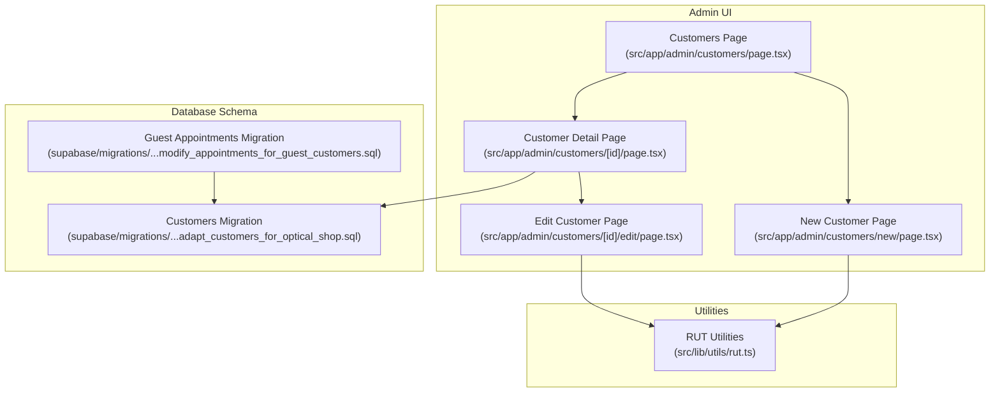
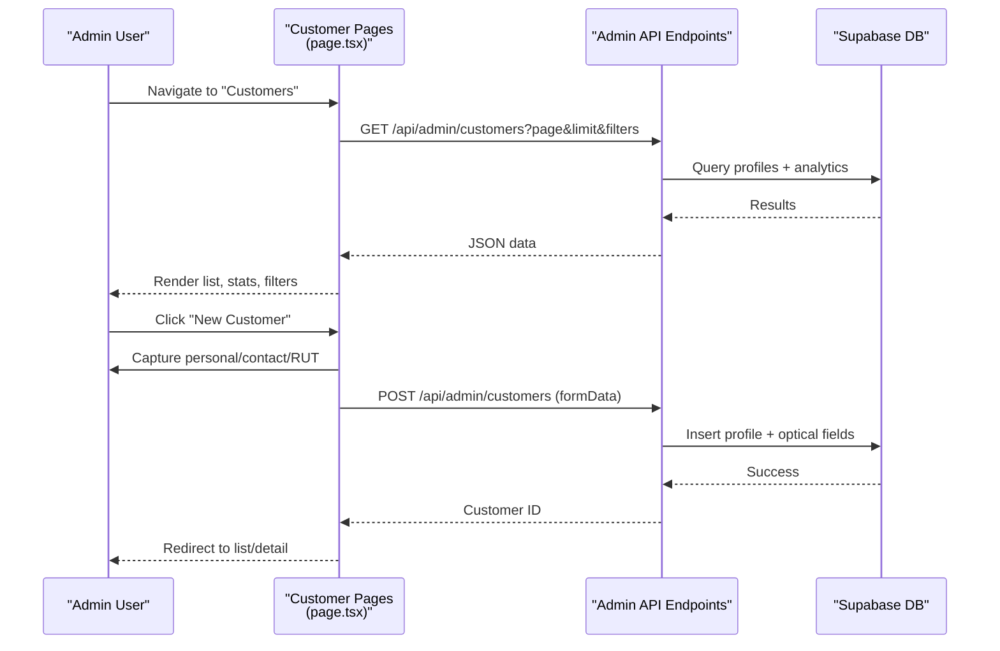
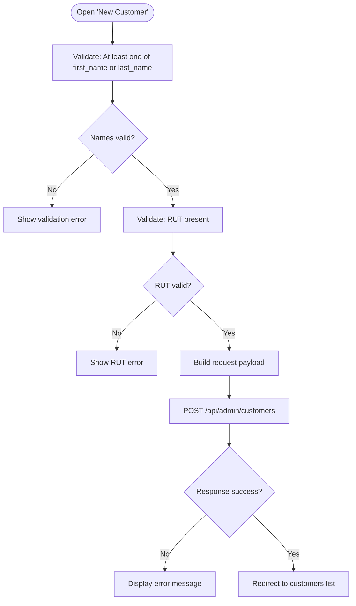
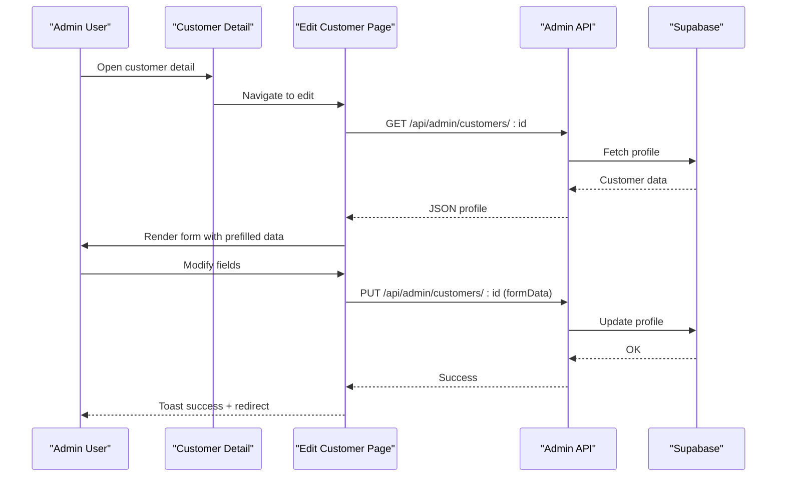
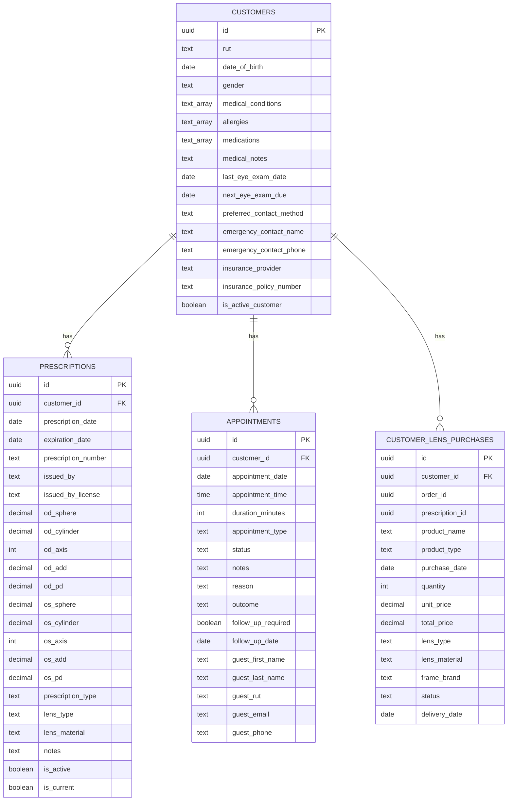
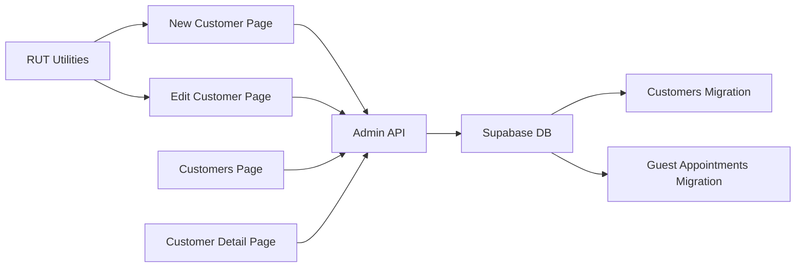

# Customer Profiles & Registration

<cite>
**Referenced Files in This Document**
- [Customers Page](file://src/app/admin/customers/page.tsx)
- [New Customer Page](file://src/app/admin/customers/new/page.tsx)
- [Customer Detail Page](file://src/app/admin/customers/[id]/page.tsx)
- [Edit Customer Page](file://src/app/admin/customers/[id]/edit/page.tsx)
- [RUT Utilities](file://src/lib/utils/rut.ts)
- [Customers Migration](file://supabase/migrations/20250123000000_adapt_customers_for_optical_shop.sql)
- [Guest Appointments Migration](file://supabase/migrations/20250131000002_modify_appointments_for_guest_customers.sql)
</cite>

## Table of Contents

1. [Introduction](#introduction)
2. [Project Structure](#project-structure)
3. [Core Components](#core-components)
4. [Architecture Overview](#architecture-overview)
5. [Detailed Component Analysis](#detailed-component-analysis)
6. [Dependency Analysis](#dependency-analysis)
7. [Performance Considerations](#performance-considerations)
8. [Troubleshooting Guide](#troubleshooting-guide)
9. [Conclusion](#conclusion)

## Introduction

This document describes the customer profile management system in Opttius, focusing on the end-to-end customer registration process, profile editing, and the dual customer model supporting both registered customers with full medical histories and walk-in (guest) patients for appointment booking. It covers personal information capture, RUT validation and formatting, optional medical information collection, profile editing capabilities, data validation rules, privacy controls, and the relationships between customer profiles and related systems such as prescriptions, appointments, and purchase history. It also addresses data retention and privacy considerations for handling sensitive medical information.

## Project Structure

The customer management functionality spans UI pages, utility functions, and database schema migrations:

- Admin UI pages for listing, creating, viewing, and editing customers
- RUT formatting and validation utilities
- Database schema for customer profiles, prescriptions, appointments, and purchase history
- Guest customer support for walk-in appointments

**Diagram sources**

- [Customers Page](file://src/app/admin/customers/page.tsx#L1-L516)
- [New Customer Page](file://src/app/admin/customers/new/page.tsx#L1-L353)
- [Customer Detail Page](file://src/app/admin/customers/[id]/page.tsx#L1-L1994)
- [Edit Customer Page](file://src/app/admin/customers/[id]/edit/page.tsx#L1-L459)
- [RUT Utilities](file://src/lib/utils/rut.ts#L1-L65)
- [Customers Migration](file://supabase/migrations/20250123000000_adapt_customers_for_optical_shop.sql#L1-L455)
- [Guest Appointments Migration](file://supabase/migrations/20250131000002_modify_appointments_for_guest_customers.sql#L1-L38)

**Section sources**

- [Customers Page](file://src/app/admin/customers/page.tsx#L1-L516)
- [New Customer Page](file://src/app/admin/customers/new/page.tsx#L1-L353)
- [Customer Detail Page](file://src/app/admin/customers/[id]/page.tsx#L1-L1994)
- [Edit Customer Page](file://src/app/admin/customers/[id]/edit/page.tsx#L1-L459)
- [RUT Utilities](file://src/lib/utils/rut.ts#L1-L65)
- [Customers Migration](file://supabase/migrations/20250123000000_adapt_customers_for_optical_shop.sql#L1-L455)
- [Guest Appointments Migration](file://supabase/migrations/20250131000002_modify_appointments_for_guest_customers.sql#L1-L38)

## Core Components

- Customer listing and filtering: Admins can search, filter, and paginate customer records, with global and branch-scoped views.
- Customer creation: Captures personal info, contact details, and RUT; validates required fields; supports branch selection for super admins.
- Customer detail: Displays comprehensive profile, analytics, related prescriptions, appointments, quotes, and purchase history.
- Profile editing: Allows updating personal and contact information with the same validation rules as creation.
- RUT handling: Provides formatting and normalization utilities for Chilean RUT during input and storage.
- Dual customer model: Registered customers with full medical profiles and guest customers for walk-in appointments.

**Section sources**

- [Customers Page](file://src/app/admin/customers/page.tsx#L75-L516)
- [New Customer Page](file://src/app/admin/customers/new/page.tsx#L31-L353)
- [Customer Detail Page](file://src/app/admin/customers/[id]/page.tsx#L225-L1994)
- [Edit Customer Page](file://src/app/admin/customers/[id]/edit/page.tsx#L42-L459)
- [RUT Utilities](file://src/lib/utils/rut.ts#L17-L65)

## Architecture Overview

The customer system integrates UI pages with Supabase-backed data and optical-specific domain entities:

- UI pages communicate via fetch requests to admin endpoints
- Supabase manages customer profiles, prescriptions, appointments, and purchase history
- RUT utilities normalize and format Chilean RUT values
- Guest customer support enables walk-in appointments without a registered profile

**Diagram sources**

- [Customers Page](file://src/app/admin/customers/page.tsx#L94-L132)
- [New Customer Page](file://src/app/admin/customers/new/page.tsx#L72-L133)
- [Customer Detail Page](file://src/app/admin/customers/[id]/page.tsx#L242-L265)

## Detailed Component Analysis

### Customer Registration Workflow

The registration process captures essential information and ensures data quality:

- Personal information: First name and last name (at least one required)
- Contact information: Email (optional), phone (optional)
- Identity: RUT (required) with automatic formatting and validation
- Address: Street, street details, city, province, postal code, country
- Branch association: For super admins in global view, branch must be selected

**Diagram sources**

- [New Customer Page](file://src/app/admin/customers/new/page.tsx#L72-L133)

**Section sources**

- [New Customer Page](file://src/app/admin/customers/new/page.tsx#L31-L353)
- [RUT Utilities](file://src/lib/utils/rut.ts#L17-L65)

### Profile Editing Capabilities

The edit page mirrors the creation form with pre-filled data and identical validation rules. It supports updating personal details, contact information, address, and notes.

**Diagram sources**

- [Customer Detail Page](file://src/app/admin/customers/[id]/page.tsx#L225-L265)
- [Edit Customer Page](file://src/app/admin/customers/[id]/edit/page.tsx#L82-L174)

**Section sources**

- [Edit Customer Page](file://src/app/admin/customers/[id]/edit/page.tsx#L42-L459)

### RUT Validation and Formatting

The system provides robust RUT handling:

- Format RUT: Converts various inputs into standardized "xx.xxx.xxx-x" format
- Normalize RUT: Removes formatting for storage/comparison
- Basic format validation: Ensures length and verification digit pattern

Implementation highlights:

- Input formatting with real-time feedback and on-blur normalization
- Validation errors surfaced to users
- Storage normalization for efficient indexing and comparisons

**Section sources**

- [RUT Utilities](file://src/lib/utils/rut.ts#L17-L65)
- [New Customer Page](file://src/app/admin/customers/new/page.tsx#L234-L254)
- [Edit Customer Page](file://src/app/admin/customers/[id]/edit/page.tsx#L337-L358)

### Dual Customer System: Registered vs Walk-in

The system supports two customer types:

- Registered customers: Full profiles with medical history, prescriptions, and purchase records
- Walk-in (guest) customers: Appointments created without a registered profile, storing minimal guest data directly in the appointments table

Key behaviors:

- Appointments allow either a registered customer_id or guest fields
- Guest constraints ensure required guest information when customer_id is null
- Indexes optimize searches by guest RUT/email

**Section sources**

- [Customers Migration](file://supabase/migrations/20250123000000_adapt_customers_for_optical_shop.sql#L38-L197)
- [Guest Appointments Migration](file://supabase/migrations/20250131000002_modify_appointments_for_guest_customers.sql#L5-L38)

### Medical Information Collection

Optical-specific fields are part of the customer profile:

- Demographics: Date of birth, gender
- Medical history: Conditions, allergies, current medications
- Vision care: Last eye exam date, next exam due, preferred contact method
- Emergency contacts and insurance information
- Active customer flag

These fields enable comprehensive care coordination and communication preferences.

**Section sources**

- [Customers Migration](file://supabase/migrations/20250123000000_adapt_customers_for_optical_shop.sql#L6-L36)

### Relationship Between Profiles and Related Systems

Customer profiles connect to multiple systems:

- Prescriptions: Eye Rx data, validity, and current status
- Appointments: Scheduled visits, statuses, outcomes, and follow-ups
- Purchase history: Lens and frame purchases linked to prescriptions
- Quotes: Quotations for frames and lenses

**Diagram sources**

- [Customers Migration](file://supabase/migrations/20250123000000_adapt_customers_for_optical_shop.sql#L39-L197)

**Section sources**

- [Customer Detail Page](file://src/app/admin/customers/[id]/page.tsx#L141-L223)
- [Customers Migration](file://supabase/migrations/20250123000000_adapt_customers_for_optical_shop.sql#L39-L197)

### Data Validation Rules

- Personal info: At least one of first_name or last_name required
- Identity: RUT required; validated and normalized
- Contact: Email and phone optional; validated where provided
- Branch: Super admins in global view must select a branch for new registrations
- Guest appointments: Either registered customer_id or guest fields must be present

**Section sources**

- [New Customer Page](file://src/app/admin/customers/new/page.tsx#L77-L98)
- [Edit Customer Page](file://src/app/admin/customers/[id]/edit/page.tsx#L137-L144)
- [Guest Appointments Migration](file://supabase/migrations/20250131000002_modify_appointments_for_guest_customers.sql#L17-L23)

### Privacy Controls and Security

- Row Level Security (RLS) enabled on prescriptions, appointments, and customer lens purchases
- Admin policies restrict access to authorized administrators
- Guest customer data is isolated within the appointments table with appropriate constraints

**Section sources**

- [Customers Migration](file://supabase/migrations/20250123000000_adapt_customers_for_optical_shop.sql#L315-L442)

## Dependency Analysis

The customer system depends on:

- UI pages for user interaction and data presentation
- RUT utilities for identity normalization
- Supabase schema for persistence and relationships
- Branch-aware headers for multi-branch environments

**Diagram sources**

- [RUT Utilities](file://src/lib/utils/rut.ts#L1-L65)
- [New Customer Page](file://src/app/admin/customers/new/page.tsx#L1-L353)
- [Edit Customer Page](file://src/app/admin/customers/[id]/edit/page.tsx#L1-L459)
- [Customers Page](file://src/app/admin/customers/page.tsx#L1-L516)
- [Customer Detail Page](file://src/app/admin/customers/[id]/page.tsx#L1-L1994)
- [Customers Migration](file://supabase/migrations/20250123000000_adapt_customers_for_optical_shop.sql#L1-L455)
- [Guest Appointments Migration](file://supabase/migrations/20250131000002_modify_appointments_for_guest_customers.sql#L1-L38)

**Section sources**

- [RUT Utilities](file://src/lib/utils/rut.ts#L1-L65)
- [Customers Page](file://src/app/admin/customers/page.tsx#L1-L516)
- [New Customer Page](file://src/app/admin/customers/new/page.tsx#L1-L353)
- [Customer Detail Page](file://src/app/admin/customers/[id]/page.tsx#L1-L1994)
- [Edit Customer Page](file://src/app/admin/customers/[id]/edit/page.tsx#L1-L459)
- [Customers Migration](file://supabase/migrations/20250123000000_adapt_customers_for_optical_shop.sql#L1-L455)
- [Guest Appointments Migration](file://supabase/migrations/20250131000002_modify_appointments_for_guest_customers.sql#L1-L38)

## Performance Considerations

- Indexes on RUT, active status, and eye exam dates improve query performance for customer lookups and reporting
- Pagination and filtering reduce payload sizes on the customers listing page
- Lazy-loading heavy forms minimizes initial bundle size for customer detail pages

[No sources needed since this section provides general guidance]

## Troubleshooting Guide

Common issues and resolutions:

- RUT format errors: Ensure input matches expected patterns; use the built-in formatter and validator
- Missing branch for super admin global view: Select a branch when creating customers in global mode
- Guest appointment constraints: Provide guest name, RUT, and at least one contact method when registering walk-in appointments
- Validation failures: Review required fields and error messages returned by the API

**Section sources**

- [New Customer Page](file://src/app/admin/customers/new/page.tsx#L77-L133)
- [Edit Customer Page](file://src/app/admin/customers/[id]/edit/page.tsx#L137-L174)
- [Guest Appointments Migration](file://supabase/migrations/20250131000002_modify_appointments_for_guest_customers.sql#L17-L23)

## Conclusion

Opttius provides a comprehensive customer profile management system tailored for an optical shop environment. It supports both registered customers with detailed medical histories and walk-in patients for appointment booking, ensuring robust identity handling via RUT formatting and validation, strong privacy controls through RLS, and seamless integration with prescriptions, appointments, and purchase history. The UI pages offer intuitive workflows for registration, editing, and relationship exploration, while the underlying schema and constraints maintain data integrity and performance.
