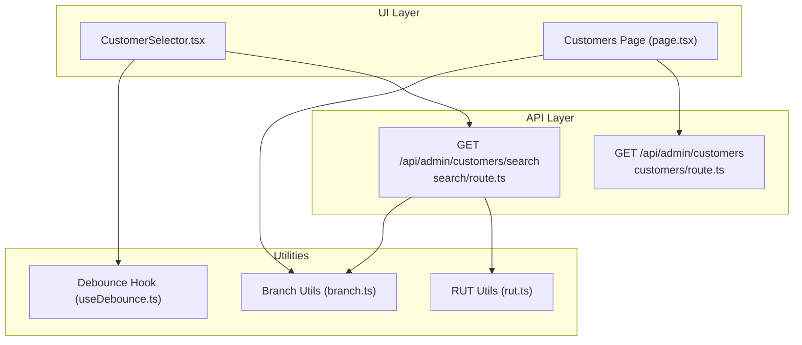
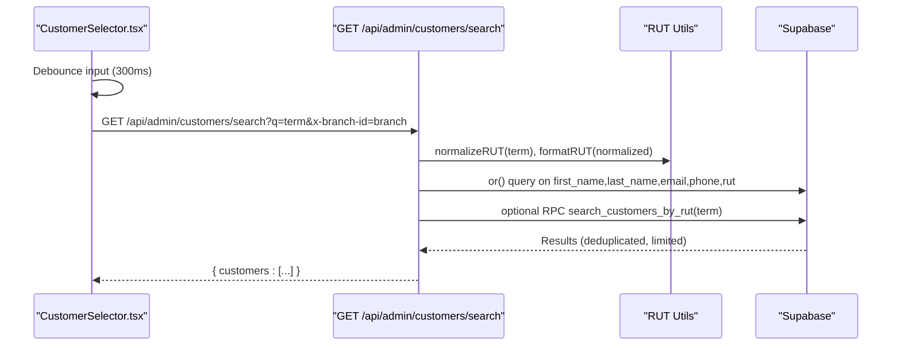
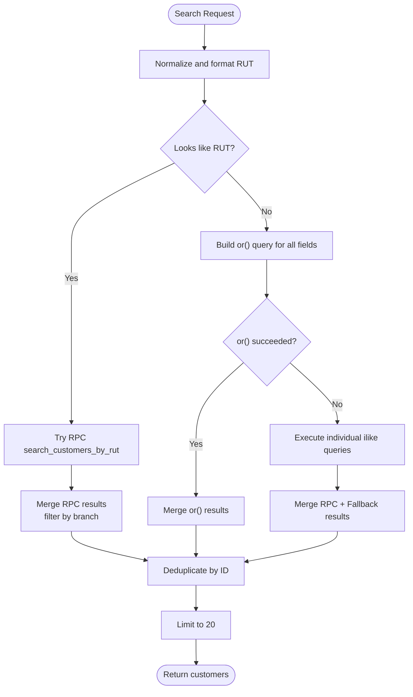
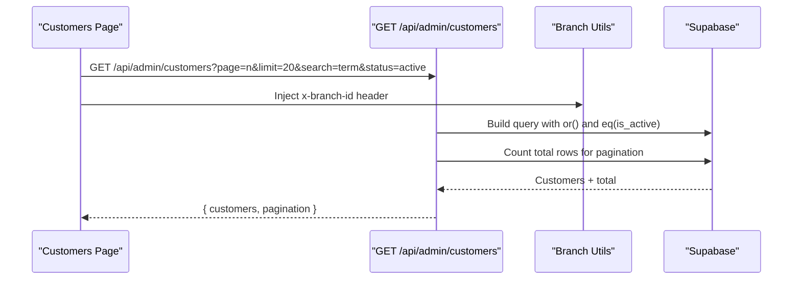
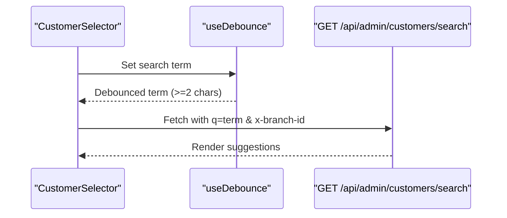
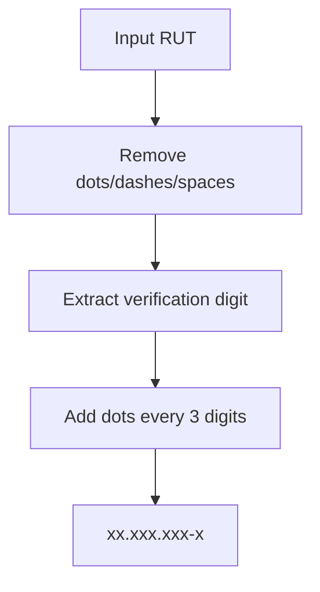
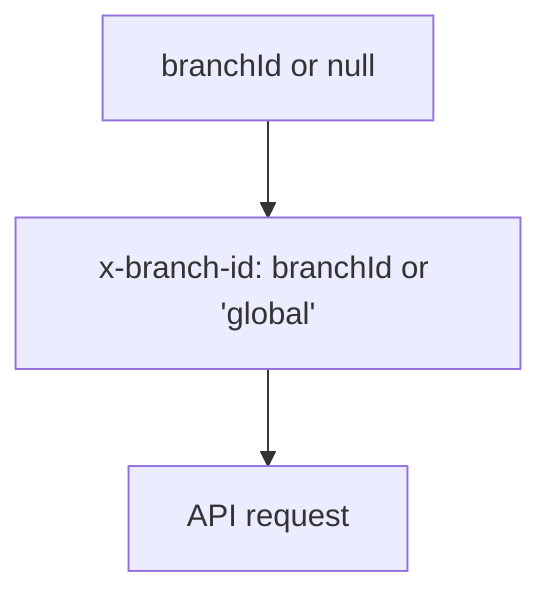
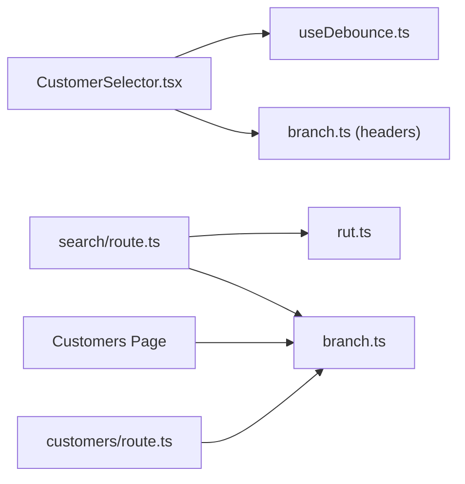

# Customer Search & Filtering

<cite>
**Referenced Files in This Document**
- [src/app/api/admin/customers/search/route.ts](file://src/app/api/admin/customers/search/route.ts)
- [src/app/api/admin/customers/route.ts](file://src/app/api/admin/customers/route.ts)
- [src/components/admin/CreateWorkOrderForm/CustomerSelector.tsx](file://src/components/admin/CreateWorkOrderForm/CustomerSelector.tsx)
- [src/app/admin/customers/page.tsx](file://src/app/admin/customers/page.tsx)
- [src/lib/utils/rut.ts](file://src/lib/utils/rut.ts)
- [src/lib/utils/branch.ts](file://src/lib/utils/branch.ts)
- [src/hooks/useDebounce.ts](file://src/hooks/useDebounce.ts)
</cite>

## Table of Contents

1. [Introduction](#introduction)
2. [Project Structure](#project-structure)
3. [Core Components](#core-components)
4. [Architecture Overview](#architecture-overview)
5. [Detailed Component Analysis](#detailed-component-analysis)
6. [Dependency Analysis](#dependency-analysis)
7. [Performance Considerations](#performance-considerations)
8. [Troubleshooting Guide](#troubleshooting-guide)
9. [Conclusion](#conclusion)

## Introduction

This document explains the customer search and filtering system in Opttius. It covers intelligent search across name, email, phone number, and RUT with fuzzy matching, filter options (status and branch), pagination, and the underlying implementation. It also documents the search algorithm, query optimization, performance characteristics for large datasets, real-time search suggestions, caching strategies, index optimization, and handling of special characters in queries.

## Project Structure

The customer search and filtering functionality spans three primary areas:

- Real-time search suggestions for UI components
- Customer listing page with filters and pagination
- Backend API endpoints for search and listing

**Diagram sources**

- [src/components/admin/CreateWorkOrderForm/CustomerSelector.tsx](file://src/components/admin/CreateWorkOrderForm/CustomerSelector.tsx#L34-L64)
- [src/app/admin/customers/page.tsx](file://src/app/admin/customers/page.tsx#L99-L132)
- [src/app/api/admin/customers/search/route.ts](file://src/app/api/admin/customers/search/route.ts#L9-L50)
- [src/app/api/admin/customers/route.ts](file://src/app/api/admin/customers/route.ts#L22-L50)
- [src/lib/utils/rut.ts](file://src/lib/utils/rut.ts#L17-L50)
- [src/lib/utils/branch.ts](file://src/lib/utils/branch.ts#L92-L99)
- [src/hooks/useDebounce.ts](file://src/hooks/useDebounce.ts#L10-L24)

**Section sources**

- [src/components/admin/CreateWorkOrderForm/CustomerSelector.tsx](file://src/components/admin/CreateWorkOrderForm/CustomerSelector.tsx#L34-L64)
- [src/app/admin/customers/page.tsx](file://src/app/admin/customers/page.tsx#L99-L132)
- [src/app/api/admin/customers/search/route.ts](file://src/app/api/admin/customers/search/route.ts#L9-L50)
- [src/app/api/admin/customers/route.ts](file://src/app/api/admin/customers/route.ts#L22-L50)
- [src/lib/utils/rut.ts](file://src/lib/utils/rut.ts#L17-L50)
- [src/lib/utils/branch.ts](file://src/lib/utils/branch.ts#L92-L99)
- [src/hooks/useDebounce.ts](file://src/hooks/useDebounce.ts#L10-L24)

## Core Components

- Intelligent search endpoint: Supports fuzzy matching across name, email, phone, and RUT with robust normalization and fallback strategies.
- Listing endpoint: Provides paginated customer listings with status and branch filters.
- UI components: Real-time search suggestions with debouncing and branch-aware requests.
- Utilities: RUT normalization/formatting and branch header injection.

Key capabilities:

- Fuzzy matching via ilike patterns and a dedicated RUT search function.
- Branch-scoped queries with multi-tenant isolation.
- Pagination with counts and configurable limits.
- Debounced search input to reduce network load.

**Section sources**

- [src/app/api/admin/customers/search/route.ts](file://src/app/api/admin/customers/search/route.ts#L88-L158)
- [src/app/api/admin/customers/route.ts](file://src/app/api/admin/customers/route.ts#L132-L142)
- [src/components/admin/CreateWorkOrderForm/CustomerSelector.tsx](file://src/components/admin/CreateWorkOrderForm/CustomerSelector.tsx#L34-L64)
- [src/lib/utils/rut.ts](file://src/lib/utils/rut.ts#L17-L50)
- [src/lib/utils/branch.ts](file://src/lib/utils/branch.ts#L92-L99)

## Architecture Overview

The system integrates UI-driven search with backend APIs and Supabase queries. The UI triggers search with a debounce, while the backend applies branch filters, normalization, and fallback strategies.

**Diagram sources**

- [src/components/admin/CreateWorkOrderForm/CustomerSelector.tsx](file://src/components/admin/CreateWorkOrderForm/CustomerSelector.tsx#L34-L64)
- [src/app/api/admin/customers/search/route.ts](file://src/app/api/admin/customers/search/route.ts#L88-L213)
- [src/lib/utils/rut.ts](file://src/lib/utils/rut.ts#L17-L50)

## Detailed Component Analysis

### Intelligent Search Endpoint

Implements fuzzy matching across multiple fields with RUT-aware logic:

- Detects potential RUT queries and attempts a specialized RPC for partial matches.
- Normalizes and formats RUT for broad compatibility.
- Uses or() queries and falls back to individual ilike queries when or() fails.
- Applies branch filters and merges results to avoid duplicates.
- Limits results to 20 and logs detailed debug info.

**Diagram sources**

- [src/app/api/admin/customers/search/route.ts](file://src/app/api/admin/customers/search/route.ts#L88-L213)
- [src/app/api/admin/customers/search/route.ts](file://src/app/api/admin/customers/search/route.ts#L219-L374)

**Section sources**

- [src/app/api/admin/customers/search/route.ts](file://src/app/api/admin/customers/search/route.ts#L88-L158)
- [src/app/api/admin/customers/search/route.ts](file://src/app/api/admin/customers/search/route.ts#L160-L213)
- [src/app/api/admin/customers/search/route.ts](file://src/app/api/admin/customers/search/route.ts#L219-L374)

### Customer Listing Page (Filters + Pagination)

Provides:

- Text search across name, email, phone, and RUT.
- Status filter (all, active, inactive).
- Branch-aware pagination with configurable page size.
- Stats summary endpoint invoked via POST.

**Diagram sources**

- [src/app/admin/customers/page.tsx](file://src/app/admin/customers/page.tsx#L99-L132)
- [src/app/api/admin/customers/route.ts](file://src/app/api/admin/customers/route.ts#L132-L142)
- [src/lib/utils/branch.ts](file://src/lib/utils/branch.ts#L92-L99)

**Section sources**

- [src/app/admin/customers/page.tsx](file://src/app/admin/customers/page.tsx#L85-L132)
- [src/app/api/admin/customers/route.ts](file://src/app/api/admin/customers/route.ts#L132-L142)

### Real-Time Search Suggestions (UI)

- Debounces user input to reduce API calls.
- Sends branch-aware requests using headers.
- Renders suggestions with loading states and empty results messaging.

**Diagram sources**

- [src/components/admin/CreateWorkOrderForm/CustomerSelector.tsx](file://src/components/admin/CreateWorkOrderForm/CustomerSelector.tsx#L34-L64)
- [src/hooks/useDebounce.ts](file://src/hooks/useDebounce.ts#L10-L24)

**Section sources**

- [src/components/admin/CreateWorkOrderForm/CustomerSelector.tsx](file://src/components/admin/CreateWorkOrderForm/CustomerSelector.tsx#L34-L64)
- [src/hooks/useDebounce.ts](file://src/hooks/useDebounce.ts#L10-L24)

### RUT Utilities

- Normalization removes formatting for comparisons.
- Formatting produces canonical display format.
- Validation checks basic RUT format.

**Diagram sources**

- [src/lib/utils/rut.ts](file://src/lib/utils/rut.ts#L17-L50)

**Section sources**

- [src/lib/utils/rut.ts](file://src/lib/utils/rut.ts#L17-L50)

### Branch Filtering Utilities

- Generates branch-aware headers for API requests.
- Supports global vs branch-scoped views for admins.

**Diagram sources**

- [src/lib/utils/branch.ts](file://src/lib/utils/branch.ts#L92-L99)

**Section sources**

- [src/lib/utils/branch.ts](file://src/lib/utils/branch.ts#L92-L99)

## Dependency Analysis

- UI components depend on debounce hook and branch utilities.
- Search endpoint depends on RUT utilities and branch context.
- Listing endpoint depends on branch context and validates pagination/search parameters.

**Diagram sources**

- [src/components/admin/CreateWorkOrderForm/CustomerSelector.tsx](file://src/components/admin/CreateWorkOrderForm/CustomerSelector.tsx#L34-L64)
- [src/hooks/useDebounce.ts](file://src/hooks/useDebounce.ts#L10-L24)
- [src/lib/utils/branch.ts](file://src/lib/utils/branch.ts#L92-L99)
- [src/app/api/admin/customers/search/route.ts](file://src/app/api/admin/customers/search/route.ts#L9-L50)
- [src/lib/utils/rut.ts](file://src/lib/utils/rut.ts#L17-L50)
- [src/app/admin/customers/page.tsx](file://src/app/admin/customers/page.tsx#L99-L132)
- [src/app/api/admin/customers/route.ts](file://src/app/api/admin/customers/route.ts#L22-L50)

**Section sources**

- [src/components/admin/CreateWorkOrderForm/CustomerSelector.tsx](file://src/components/admin/CreateWorkOrderForm/CustomerSelector.tsx#L34-L64)
- [src/app/api/admin/customers/search/route.ts](file://src/app/api/admin/customers/search/route.ts#L9-L50)
- [src/app/api/admin/customers/route.ts](file://src/app/api/admin/customers/route.ts#L22-L50)
- [src/lib/utils/rut.ts](file://src/lib/utils/rut.ts#L17-L50)
- [src/lib/utils/branch.ts](file://src/lib/utils/branch.ts#L92-L99)
- [src/hooks/useDebounce.ts](file://src/hooks/useDebounce.ts#L10-L24)

## Performance Considerations

- Query optimization
  - Prefer or() with a single query when possible; fallback to Promise.all() of individual ilike queries if or() fails.
  - Limit results to 20 per search to bound payload size.
  - Use count queries for pagination totals to avoid scanning entire tables unnecessarily.
- Index optimization
  - Ensure GIN or appropriate indexes exist on text fields (name, email, phone) and RUT for efficient ilike operations.
  - Consider a trigram extension for better fuzzy matching performance.
- Caching strategies
  - Implement short-lived caches (e.g., 1–2 minutes) for frequent search terms to reduce database load.
  - Cache branch-scoped results separately to prevent cross-branch contamination.
- Special characters
  - Escape or normalize special characters in queries to avoid unexpected regex-like behavior in ilike patterns.
- Rate limiting
  - Enforce per-endpoint rate limits to protect backend resources during bursts of search activity.

[No sources needed since this section provides general guidance]

## Troubleshooting Guide

Common issues and resolutions:

- Empty or slow results
  - Ensure branch header is present for branch-scoped searches.
  - Verify RUT normalization/formatting is applied consistently.
- Duplicate results
  - Confirm deduplication by customer ID is active after merging RPC and standard search results.
- OR query failures
  - The system automatically falls back to individual ilike queries; monitor logs for or() failures and fallback execution.
- Pagination inconsistencies
  - Confirm count queries are executed with identical filters to data queries.

**Section sources**

- [src/app/api/admin/customers/search/route.ts](file://src/app/api/admin/customers/search/route.ts#L187-L213)
- [src/app/api/admin/customers/search/route.ts](file://src/app/api/admin/customers/search/route.ts#L219-L374)
- [src/app/api/admin/customers/route.ts](file://src/app/api/admin/customers/route.ts#L144-L175)

## Conclusion

Opttius implements a robust, branch-aware customer search and filtering system with intelligent fuzzy matching, RUT normalization, and fallback strategies. The UI provides responsive suggestions with debouncing, while the backend optimizes queries and enforces multi-tenant boundaries. With proper indexing, caching, and rate limiting, the system scales effectively for large datasets.
