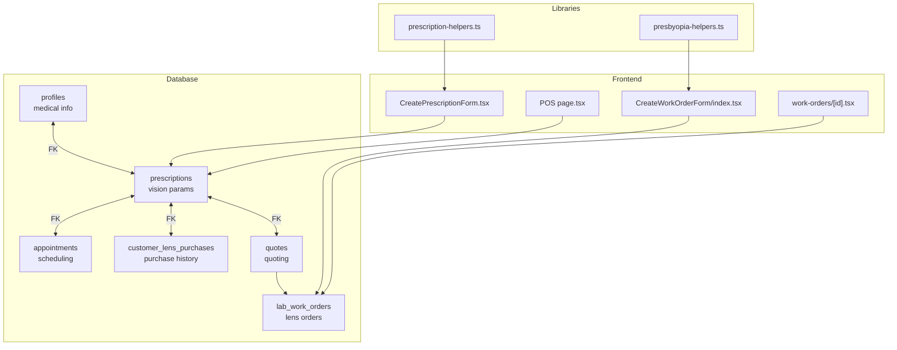
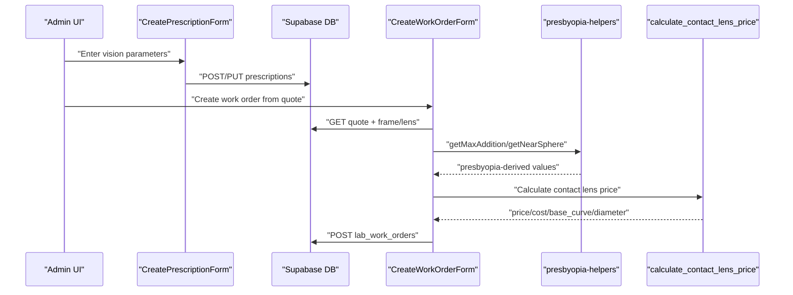
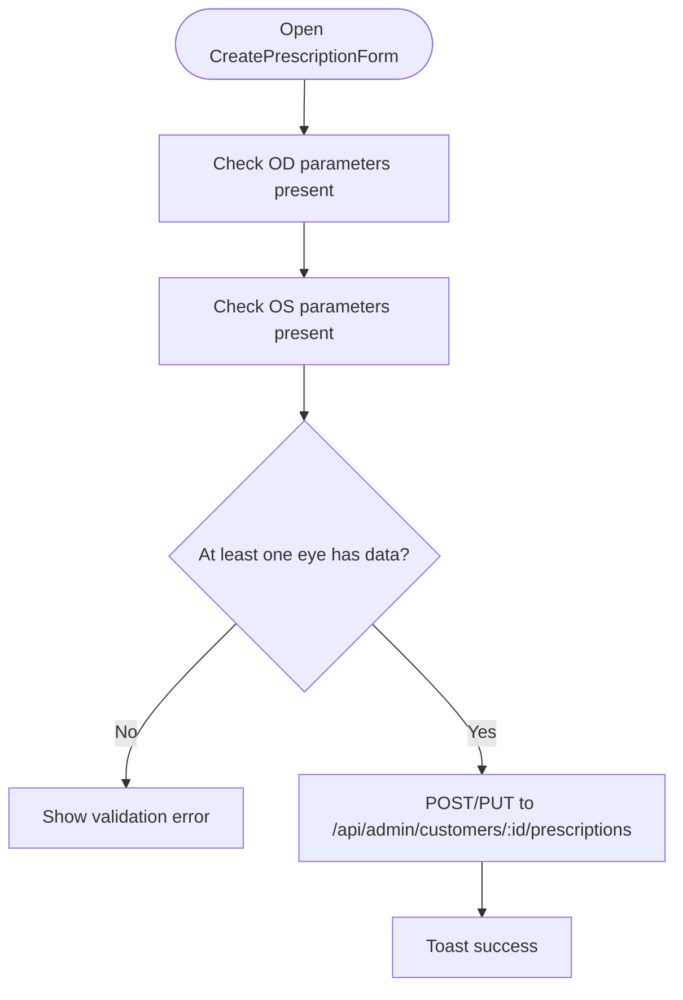
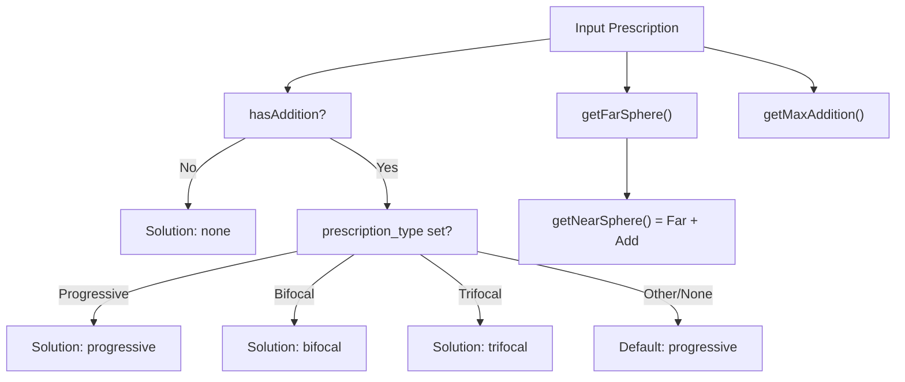
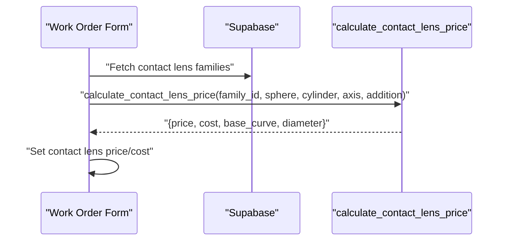
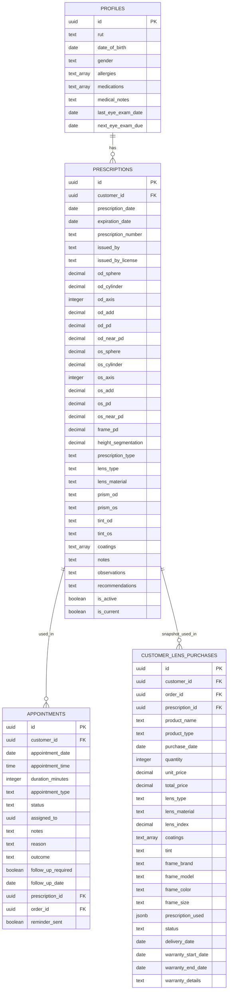
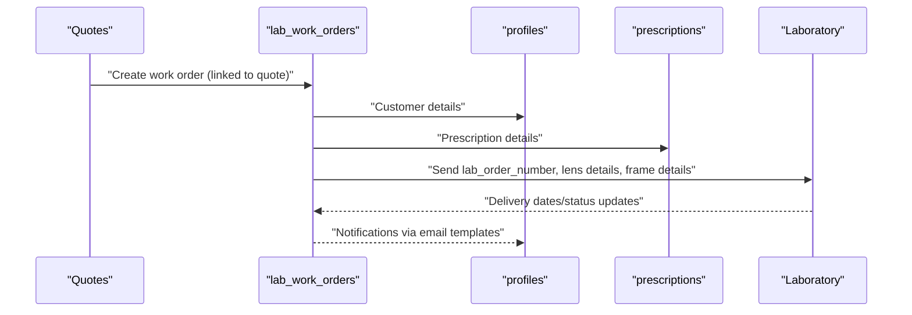
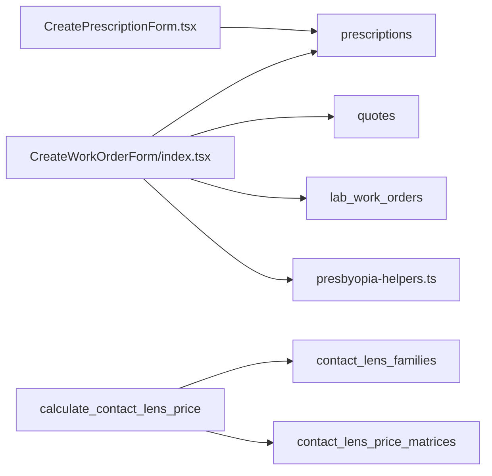
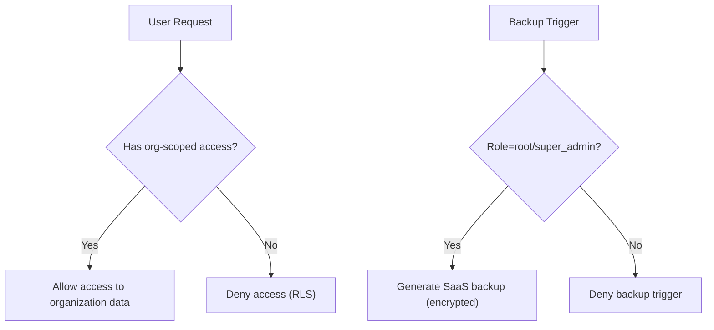

# Medical History & Prescription Integration

<cite>
**Referenced Files in This Document**
- [supabase/migrations/20250123000000_adapt_customers_for_optical_shop.sql](file://supabase/migrations/20250123000000_adapt_customers_for_optical_shop.sql)
- [supabase/migrations/20250125000000_create_lab_work_orders_system.sql](file://supabase/migrations/20250125000000_create_lab_work_orders_system.sql)
- [supabase/migrations/20260125000000_add_addition_support_to_lens_matrices.sql](file://supabase/migrations/20260125000000_add_addition_support_to_lens_matrices.sql)
- [supabase/migrations/20260131000005_create_contact_lenses_system.sql](file://supabase/migrations/20260131000005_create_contact_lenses_system.sql)
- [src/components/admin/CreatePrescriptionForm.tsx](file://src/components/admin/CreatePrescriptionForm.tsx)
- [src/components/admin/CreateWorkOrderForm/index.tsx](file://src/components/admin/CreateWorkOrderForm/index.tsx)
- [src/components/admin/CreateWorkOrderForm/hooks/useWorkOrderForm.ts](file://src/components/admin/CreateWorkOrderForm/hooks/useWorkOrderForm.ts)
- [src/components/admin/CreateWorkOrderForm/hooks/useWorkOrderCalculations.ts](file://src/components/admin/CreateWorkOrderForm/hooks/useWorkOrderCalculations.ts)
- [src/lib/presbyopia-helpers.ts](file://src/lib/presbyopia-helpers.ts)
- [src/lib/prescription-helpers.ts](file://src/lib/prescription-helpers.ts)
- [src/app/admin/pos/page.tsx](file://src/app/admin/pos/page.tsx)
- [src/app/admin/work-orders/[id]/page.tsx](file://src/app/admin/work-orders/[id]/page.tsx)
- [src/app/admin/customers/[id]/page.tsx](file://src/app/admin/customers/[id]/page.tsx)
- [docs/OPTICA_EMAIL_REQUIREMENTS.md](file://docs/OPTICA_EMAIL_REQUIREMENTS.md)
- [src/lib/backup-service.ts](file://src/lib/backup-service.ts)
- [supabase/migrations/20260128000001_extend_rls_for_multitenancy.sql](file://supabase/migrations/20260128000001_extend_rls_for_multitenancy.sql)
- [supabase/migrations/20250123000000_adapt_customers_for_optical_shop.sql](file://supabase/migrations/20250123000000_adapt_customers_for_optical_shop.sql)
</cite>

## Table of Contents

1. [Introduction](#introduction)
2. [Project Structure](#project-structure)
3. [Core Components](#core-components)
4. [Architecture Overview](#architecture-overview)
5. [Detailed Component Analysis](#detailed-component-analysis)
6. [Dependency Analysis](#dependency-analysis)
7. [Performance Considerations](#performance-considerations)
8. [Troubleshooting Guide](#troubleshooting-guide)
9. [Security & HIPAA Compliance](#security--hipaa-compliance)
10. [Conclusion](#conclusion)

## Introduction

This document explains the medical history and prescription tracking system integrated with customer profiles in Opttius. It covers how prescriptions are captured, validated, and used to drive optical work orders and laboratory communications. It documents spherical, cylindrical, axis, and addition measurements for both glasses and contact lenses, presbyopia calculation algorithms, multifocal lens handling, and the integration between customers, prescriptions, and work orders. It also outlines security and HIPAA-compliant handling of sensitive medical data.

## Project Structure

The system spans database migrations, frontend forms, and backend integrations:

- Database: prescriptions, appointments, customer purchase history, quotes, and lab work orders
- Frontend: prescription creation/editing form, work order creation wizard, and display pages
- Libraries: presbyopia and prescription helpers
- Integrations: contact lens pricing via stored functions and matrices

**Diagram sources**

- [supabase/migrations/20250123000000_adapt_customers_for_optical_shop.sql](file://supabase/migrations/20250123000000_adapt_customers_for_optical_shop.sql#L38-L145)
- [supabase/migrations/20250125000000_create_lab_work_orders_system.sql](file://supabase/migrations/20250125000000_create_lab_work_orders_system.sql#L5-L134)
- [src/components/admin/CreatePrescriptionForm.tsx](file://src/components/admin/CreatePrescriptionForm.tsx#L1-L770)
- [src/components/admin/CreateWorkOrderForm/index.tsx](file://src/components/admin/CreateWorkOrderForm/index.tsx#L1-L378)
- [src/lib/presbyopia-helpers.ts](file://src/lib/presbyopia-helpers.ts#L1-L169)
- [src/lib/prescription-helpers.ts](file://src/lib/prescription-helpers.ts#L1-L38)

**Section sources**

- [supabase/migrations/20250123000000_adapt_customers_for_optical_shop.sql](file://supabase/migrations/20250123000000_adapt_customers_for_optical_shop.sql#L1-L455)
- [supabase/migrations/20250125000000_create_lab_work_orders_system.sql](file://supabase/migrations/20250125000000_create_lab_work_orders_system.sql#L1-L134)

## Core Components

- Prescription capture and validation: structured fields for OD/OS sphere, cylinder, axis, addition, pupillary distances, and special requirements; validation ensures at least one eye has data.
- Presbyopia algorithms: addition detection, maximum/average addition, far/near sphere calculation, and default solution selection.
- Multifocal handling: progressive, bifocal, trifocal, and two-separate lens families; compatibility checks and recommendations.
- Contact lens integration: families, price matrices, and stored function to calculate price based on parameters.
- Work order integration: quotes link to prescriptions and frames/lenses; work orders carry customer, prescription, and lab details.
- Medical history capture: patient demographics, allergies, medications, medical notes, and scheduled appointments.

**Section sources**

- [src/components/admin/CreatePrescriptionForm.tsx](file://src/components/admin/CreatePrescriptionForm.tsx#L143-L230)
- [src/lib/presbyopia-helpers.ts](file://src/lib/presbyopia-helpers.ts#L25-L169)
- [supabase/migrations/20260131000005_create_contact_lenses_system.sql](file://supabase/migrations/20260131000005_create_contact_lenses_system.sql#L1-L305)
- [supabase/migrations/20250125000000_create_lab_work_orders_system.sql](file://supabase/migrations/20250125000000_create_lab_work_orders_system.sql#L5-L134)

## Architecture Overview

The system connects customer profiles to prescriptions, which feed quotes and subsequently lab work orders. Prescriptions include both glasses and contact lens parameters. Presbyopia algorithms guide lens family selection and pricing. Contact lens pricing uses a stored function against a price matrix.

**Diagram sources**

- [src/components/admin/CreatePrescriptionForm.tsx](file://src/components/admin/CreatePrescriptionForm.tsx#L143-L230)
- [src/components/admin/CreateWorkOrderForm/index.tsx](file://src/components/admin/CreateWorkOrderForm/index.tsx#L173-L245)
- [src/lib/presbyopia-helpers.ts](file://src/lib/presbyopia-helpers.ts#L37-L94)
- [supabase/migrations/20260131000005_create_contact_lenses_system.sql](file://supabase/migrations/20260131000005_create_contact_lenses_system.sql#L129-L168)

## Detailed Component Analysis

### Prescription Capture and Validation

- Fields include OD/OS sphere, cylinder, axis, addition, pupillary distances (far/near), frame PD, segmentation height, lens type/material, prism/tints/coatings, and notes.
- Validation requires at least one eye to have parameters entered.
- On submit, values are normalized and saved with optional organization scoping.

**Diagram sources**

- [src/components/admin/CreatePrescriptionForm.tsx](file://src/components/admin/CreatePrescriptionForm.tsx#L143-L230)

**Section sources**

- [src/components/admin/CreatePrescriptionForm.tsx](file://src/components/admin/CreatePrescriptionForm.tsx#L34-L210)

### Presbyopia Calculation Algorithms

- Addition detection and aggregation (max/average).
- Far/near sphere calculation: near sphere = far sphere + addition.
- Default presbyopia solution selection based on presence of addition and/or prescription type.
- Compatibility checks for lens families (single vision, progressive, bifocal, trifocal, two separate).

**Diagram sources**

- [src/lib/presbyopia-helpers.ts](file://src/lib/presbyopia-helpers.ts#L25-L116)

**Section sources**

- [src/lib/presbyopia-helpers.ts](file://src/lib/presbyopia-helpers.ts#L25-L169)

### Multifocal Lens Handling and Contact Lens Integration

- Lens families and materials are selectable during work order creation.
- For contact lenses, a stored function selects the appropriate matrix row based on sphere, cylinder, axis, and addition ranges and returns price, cost, base curve, and diameter.
- Price matrices define inclusive ranges and constraints.

**Diagram sources**

- [supabase/migrations/20260131000005_create_contact_lenses_system.sql](file://supabase/migrations/20260131000005_create_contact_lenses_system.sql#L57-L168)
- [src/components/admin/CreateWorkOrderForm/index.tsx](file://src/components/admin/CreateWorkOrderForm/index.tsx#L437-L475)

**Section sources**

- [supabase/migrations/20260131000005_create_contact_lenses_system.sql](file://supabase/migrations/20260131000005_create_contact_lenses_system.sql#L1-L305)
- [src/components/admin/CreateWorkOrderForm/index.tsx](file://src/components/admin/CreateWorkOrderForm/index.tsx#L437-L475)

### Medical History Capture and Relationship Mapping

- Profiles store demographics, allergies, medications, medical notes, and scheduled appointments.
- Prescriptions link to profiles and can be marked current/active.
- Appointments link to prescriptions and orders.
- Customer purchase history snapshots the prescription used at time of purchase.

**Diagram sources**

- [supabase/migrations/20250123000000_adapt_customers_for_optical_shop.sql](file://supabase/migrations/20250123000000_adapt_customers_for_optical_shop.sql#L38-L197)

**Section sources**

- [supabase/migrations/20250123000000_adapt_customers_for_optical_shop.sql](file://supabase/migrations/20250123000000_adapt_customers_for_optical_shop.sql#L1-L455)

### Work Order Integration and Laboratory Communication

- Quotes reference prescriptions and frame/lens selections.
- Work orders capture customer, prescription, frame, lens, lab info, pricing, and status.
- Email template variables include customer, work order, product, pricing, and branch details.

**Diagram sources**

- [supabase/migrations/20250125000000_create_lab_work_orders_system.sql](file://supabase/migrations/20250125000000_create_lab_work_orders_system.sql#L5-L134)
- [docs/OPTICA_EMAIL_REQUIREMENTS.md](file://docs/OPTICA_EMAIL_REQUIREMENTS.md#L242-L267)

**Section sources**

- [supabase/migrations/20250125000000_create_lab_work_orders_system.sql](file://supabase/migrations/20250125000000_create_lab_work_orders_system.sql#L1-L134)
- [docs/OPTICA_EMAIL_REQUIREMENTS.md](file://docs/OPTICA_EMAIL_REQUIREMENTS.md#L242-L267)

## Dependency Analysis

- Database schema defines foreign keys and RLS policies for multi-tenancy.
- Work order form loads quote data and computes totals with tax inclusion settings.
- Presbyopia helpers are used by the work order form to derive near parameters and default solutions.
- Contact lens price calculation depends on stored function and active matrices.

**Diagram sources**

- [src/components/admin/CreatePrescriptionForm.tsx](file://src/components/admin/CreatePrescriptionForm.tsx#L157-L211)
- [src/components/admin/CreateWorkOrderForm/index.tsx](file://src/components/admin/CreateWorkOrderForm/index.tsx#L187-L230)
- [src/lib/presbyopia-helpers.ts](file://src/lib/presbyopia-helpers.ts#L1-L169)
- [supabase/migrations/20260131000005_create_contact_lenses_system.sql](file://supabase/migrations/20260131000005_create_contact_lenses_system.sql#L129-L168)

**Section sources**

- [src/components/admin/CreateWorkOrderForm/hooks/useWorkOrderForm.ts](file://src/components/admin/CreateWorkOrderForm/hooks/useWorkOrderForm.ts#L89-L164)
- [src/components/admin/CreateWorkOrderForm/hooks/useWorkOrderCalculations.ts](file://src/components/admin/CreateWorkOrderForm/hooks/useWorkOrderCalculations.ts#L50-L124)

## Performance Considerations

- Indexes on prescriptions, appointments, and purchase history improve lookup performance.
- GIN/GIST indexes on contact lens price matrix ranges accelerate parameter-based queries.
- Prefer fetching only required fields (e.g., current prescription) to reduce payload sizes.
- Defer heavy calculations (e.g., contact lens pricing) until parameters are finalized.

[No sources needed since this section provides general guidance]

## Troubleshooting Guide

- Prescription validation errors: ensure at least one eye has parameters; verify axis range constraints.
- Presbyopia mismatch: confirm addition values and lens family compatibility; adjust default solution if needed.
- Contact lens pricing: verify parameters fall within active matrix ranges; confirm organization scoping.
- Work order totals: check tax inclusion settings and discount application; confirm deposit vs. balance calculations.
- Data isolation: confirm organization_id filters and RLS policies for multi-tenancy.

**Section sources**

- [src/components/admin/CreatePrescriptionForm.tsx](file://src/components/admin/CreatePrescriptionForm.tsx#L146-L153)
- [src/lib/presbyopia-helpers.ts](file://src/lib/presbyopia-helpers.ts#L121-L146)
- [supabase/migrations/20260131000005_create_contact_lenses_system.sql](file://supabase/migrations/20260131000005_create_contact_lenses_system.sql#L105-L117)
- [src/components/admin/CreateWorkOrderForm/hooks/useWorkOrderCalculations.ts](file://src/components/admin/CreateWorkOrderForm/hooks/useWorkOrderCalculations.ts#L50-L124)

## Security & HIPAA Compliance

- Row Level Security (RLS) policies restrict data access to authorized admin users per organization.
- Multi-tenancy extended with organization_id on key tables to prevent cross-tenant data leakage.
- Backup service supports organization-scoped backups and SaaS-wide backups with strict access controls and encryption.
- Audit logs track backup initiators and outcomes; only root/super_admin can trigger SaaS backups.

**Diagram sources**

- [supabase/migrations/20260128000001_extend_rls_for_multitenancy.sql](file://supabase/migrations/20260128000001_extend_rls_for_multitenancy.sql#L24-L40)
- [src/lib/backup-service.ts](file://src/lib/backup-service.ts#L84-L86)

**Section sources**

- [supabase/migrations/20260128000001_extend_rls_for_multitenancy.sql](file://supabase/migrations/20260128000001_extend_rls_for_multitenancy.sql#L1-L40)
- [src/lib/backup-service.ts](file://src/lib/backup-service.ts#L64-L86)

## Conclusion

Opttius integrates comprehensive medical history and prescription tracking with robust presbyopia algorithms and contact lens parameterization. The system links customers, prescriptions, quotes, and work orders while ensuring secure, multi-tenant data handling. By leveraging stored functions for contact lens pricing and strict RLS policies, the platform supports accurate, compliant optical workflows.
