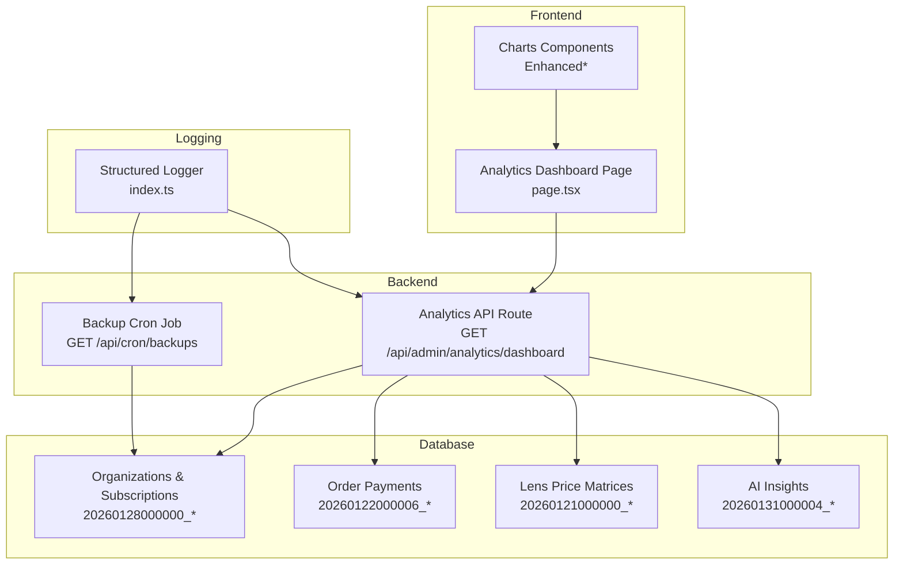
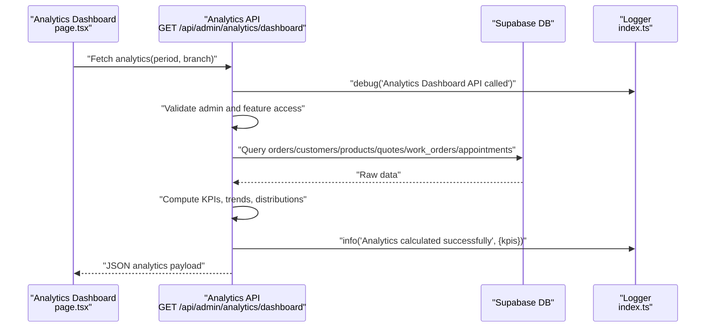
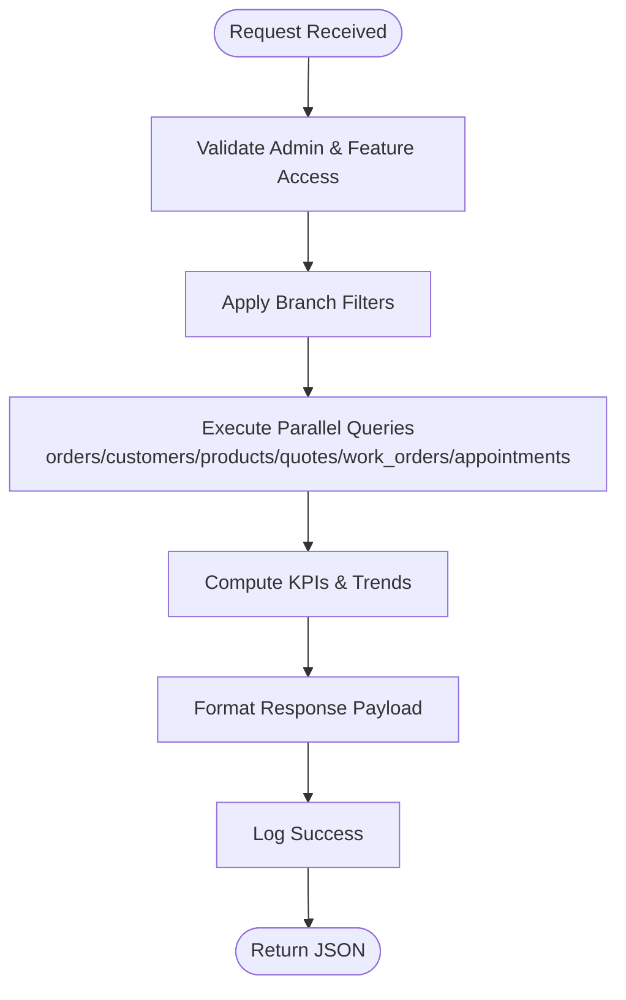
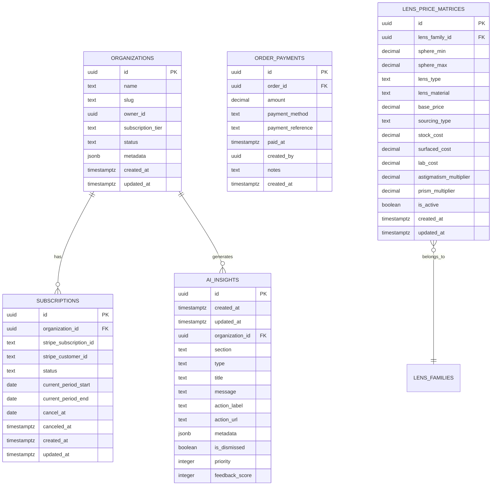
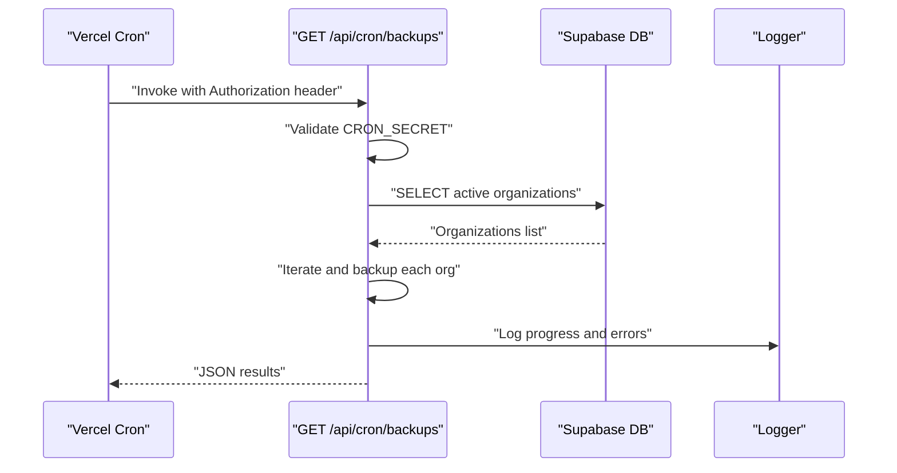
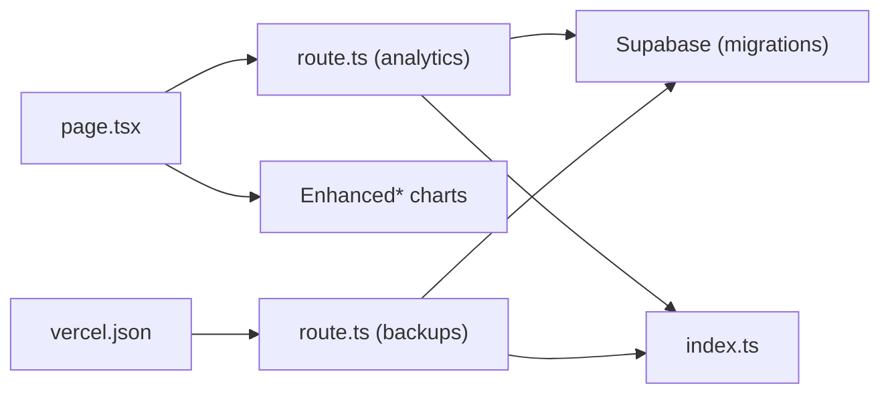

# Analytics & Logging System

<cite>
**Referenced Files in This Document**
- [analytics-help.ts](file://src/lib/analytics-help.ts)
- [route.ts](file://src/app/api/admin/analytics/dashboard/route.ts)
- [page.tsx](file://src/app/admin/analytics/page.tsx)
- [index.ts](file://src/lib/logger/index.ts)
- [diagnoseSystem.ts](file://src/lib/ai/tools/diagnoseSystem.ts)
- [analyzeBusinessFlow.ts](file://src/lib/ai/tools/analyzeBusinessFlow.ts)
- [20260128000000_create_organizations_and_subscriptions.sql](file://supabase/migrations/20260128000000_create_organizations_and_subscriptions.sql)
- [20260122000006_create_order_payments.sql](file://supabase/migrations/20260122000006_create_order_payments.sql)
- [20260121000000_create_lens_price_matrices.sql](file://supabase/migrations/20260121000000_create_lens_price_matrices.sql)
- [20260131000004_create_ai_insights.sql](file://supabase/migrations/20260131000004_create_ai_insights.sql)
- [route.ts](file://src/app/api/cron/backups/route.ts)
- [vercel.json](file://vercel.json)
- [SECURITY_AUDIT_REPORT.md](file://docs/SECURITY_AUDIT_REPORT.md)
- [SECURITY_AUDIT_SUMMARY.md](file://docs/SECURITY_AUDIT_SUMMARY.md)
</cite>

## Table of Contents

1. [Introduction](#introduction)
2. [Project Structure](#project-structure)
3. [Core Components](#core-components)
4. [Architecture Overview](#architecture-overview)
5. [Detailed Component Analysis](#detailed-component-analysis)
6. [Dependency Analysis](#dependency-analysis)
7. [Performance Considerations](#performance-considerations)
8. [Troubleshooting Guide](#troubleshooting-guide)
9. [Conclusion](#conclusion)
10. [Appendices](#appendices)

## Introduction

This document describes the Opttius analytics and logging system with a focus on business intelligence and operational monitoring. It covers:

- Analytics entities: metrics collection, KPI tracking, user behavior analytics, and system performance monitoring
- Logging entities: audit trails, operation logs, error tracking, and compliance logging
- Interactions among analytics data, user activities, system events, and business metrics
- Aggregation strategies, time-series analysis, and reporting capabilities
- Real-time analytics processing, batch job scheduling, and data warehouse integration
- Privacy considerations, GDPR compliance, and data retention policies
- Implementation patterns for metric collection, log aggregation, and performance monitoring
- Query optimization for analytical workloads and historical data management

## Project Structure

The analytics and logging system spans frontend dashboards, backend APIs, database schemas, and scheduled jobs:

- Frontend dashboard renders KPIs and time-series charts
- Backend API aggregates metrics and trends from Supabase
- Database migrations define tenant-aware schemas and analytics tables
- Scheduled cron jobs automate backups and batch processing
- Structured logging supports audit and error tracking

**Diagram sources**

- [page.tsx](file://src/app/admin/analytics/page.tsx#L1-L1165)
- [route.ts](file://src/app/api/admin/analytics/dashboard/route.ts#L1-L635)
- [route.ts](file://src/app/api/cron/backups/route.ts#L1-L41)
- [index.ts](file://src/lib/logger/index.ts#L1-L111)
- [20260128000000_create_organizations_and_subscriptions.sql](file://supabase/migrations/20260128000000_create_organizations_and_subscriptions.sql#L1-L287)
- [20260122000006_create_order_payments.sql](file://supabase/migrations/20260122000006_create_order_payments.sql#L1-L58)
- [20260121000000_create_lens_price_matrices.sql](file://supabase/migrations/20260121000000_create_lens_price_matrices.sql#L1-L202)
- [20260131000004_create_ai_insights.sql](file://supabase/migrations/20260131000004_create_ai_insights.sql#L1-L131)

**Section sources**

- [page.tsx](file://src/app/admin/analytics/page.tsx#L1-L1165)
- [route.ts](file://src/app/api/admin/analytics/dashboard/route.ts#L1-L635)
- [index.ts](file://src/lib/logger/index.ts#L1-L111)
- [20260128000000_create_organizations_and_subscriptions.sql](file://supabase/migrations/20260128000000_create_organizations_and_subscriptions.sql#L1-L287)
- [20260122000006_create_order_payments.sql](file://supabase/migrations/20260122000006_create_order_payments.sql#L1-L58)
- [20260121000000_create_lens_price_matrices.sql](file://supabase/migrations/20260121000000_create_lens_price_matrices.sql#L1-L202)
- [20260131000004_create_ai_insights.sql](file://supabase/migrations/20260131000004_create_ai_insights.sql#L1-L131)

## Core Components

- Analytics API: Computes KPIs, trends, and distributions for POS sales, work orders, quotes, appointments, customers, and products
- Analytics Dashboard: Renders KPI cards, time-series charts, and distribution visuals
- Structured Logger: Provides structured logging for audit, operations, and error tracking
- AI Tools: Diagnostic and business flow analysis for system health and process bottlenecks
- Database Schema: Tenant-aware tables for organizations, subscriptions, payments, lens pricing, and AI insights
- Cron Jobs: Automated backups and scheduled maintenance

Key implementation patterns:

- Branch-aware analytics via branch context injection
- Feature gating for advanced analytics based on subscription tiers
- Time-range slicing for daily trends and growth comparisons
- Aggregation via SQL queries and client-side computations

**Section sources**

- [route.ts](file://src/app/api/admin/analytics/dashboard/route.ts#L1-L635)
- [page.tsx](file://src/app/admin/analytics/page.tsx#L1-L1165)
- [index.ts](file://src/lib/logger/index.ts#L1-L111)
- [diagnoseSystem.ts](file://src/lib/ai/tools/diagnoseSystem.ts#L49-L83)
- [analyzeBusinessFlow.ts](file://src/lib/ai/tools/analyzeBusinessFlow.ts#L1-L331)
- [20260128000000_create_organizations_and_subscriptions.sql](file://supabase/migrations/20260128000000_create_organizations_and_subscriptions.sql#L1-L287)
- [20260122000006_create_order_payments.sql](file://supabase/migrations/20260122000006_create_order_payments.sql#L1-L58)
- [20260131000004_create_ai_insights.sql](file://supabase/migrations/20260131000004_create_ai_insights.sql#L1-L131)

## Architecture Overview

The analytics pipeline integrates frontend, backend, database, and logging:

- Frontend requests analytics for a selected period and branch
- Backend validates admin access, checks feature permissions, and applies branch filters
- Database queries compute KPIs, trends, and distributions
- Results are returned to the dashboard for rendering
- Structured logging captures request lifecycle and errors

**Diagram sources**

- [page.tsx](file://src/app/admin/analytics/page.tsx#L160-L191)
- [route.ts](file://src/app/api/admin/analytics/dashboard/route.ts#L8-L635)
- [index.ts](file://src/lib/logger/index.ts#L40-L104)

**Section sources**

- [route.ts](file://src/app/api/admin/analytics/dashboard/route.ts#L1-L635)
- [page.tsx](file://src/app/admin/analytics/page.tsx#L134-L191)
- [index.ts](file://src/lib/logger/index.ts#L1-L111)

## Detailed Component Analysis

### Analytics API: Metrics Collection and KPIs

The analytics endpoint aggregates:

- Revenue (POS sales and work orders), growth vs previous period
- Orders, work orders, quotes, and appointments statistics
- Customer acquisition and retention indicators
- Product inventory health and top-performing SKUs
- Payment method breakdown
- Daily sales, customer, work orders, and quotes trends

Implementation highlights:

- Branch-aware filtering and global view for super admins
- Feature gating for advanced analytics based on subscription tiers
- Time-range slicing for daily trends and growth calculations
- Aggregation logic for KPIs and distributions

**Diagram sources**

- [route.ts](file://src/app/api/admin/analytics/dashboard/route.ts#L14-L635)

**Section sources**

- [route.ts](file://src/app/api/admin/analytics/dashboard/route.ts#L1-L635)
- [analytics-help.ts](file://src/lib/analytics-help.ts#L1-L39)

### Analytics Dashboard: Reporting and Visualizations

The dashboard presents:

- KPI cards for total revenue, work orders, quotes, and appointments
- Time-series charts for sales and work orders (column/line toggles)
- Distribution charts for work orders and quotes statuses
- Payment methods breakdown and product inventory health

User interactions:

- Period selection (7/30/90/365 days)
- Branch selector for super admins
- Refresh button and loading states

**Section sources**

- [page.tsx](file://src/app/admin/analytics/page.tsx#L1-L1165)

### Structured Logging: Audit, Operations, and Error Tracking

The logger provides:

- Structured JSON logs with timestamps
- Levels: debug, info, warn, error
- Error enrichment with stack traces and contextual data
- Centralized logging for API requests and cron jobs

Security and compliance:

- Error responses sanitize internal details
- Audit trail coverage includes admin activity, payments, security events, and user access

**Section sources**

- [index.ts](file://src/lib/logger/index.ts#L1-L111)
- [SECURITY_AUDIT_REPORT.md](file://docs/SECURITY_AUDIT_REPORT.md#L382-L439)

### AI Tools: System Diagnostics and Business Flow Analysis

Diagnostic capabilities:

- Multi-dimensional system health analysis (orders, inventory, customers, performance)
- Bottleneck identification in business processes
- Efficiency scoring and recommendations

Execution pattern:

- Parallel analysis of multiple domains
- Structured insights with severity and actionable recommendations

**Section sources**

- [diagnoseSystem.ts](file://src/lib/ai/tools/diagnoseSystem.ts#L49-L83)
- [diagnoseSystem.ts](file://src/lib/ai/tools/diagnoseSystem.ts#L334-L383)
- [analyzeBusinessFlow.ts](file://src/lib/ai/tools/analyzeBusinessFlow.ts#L1-L331)

### Database Schema: Entities and Relationships

Core entities:

- Organizations and Subscriptions: multi-tenancy foundation
- Order Payments: cash-first payment tracking
- Lens Price Matrices: pricing engine for optical products
- AI Insights: contextual insights per organization and section

**Diagram sources**

- [20260128000000_create_organizations_and_subscriptions.sql](file://supabase/migrations/20260128000000_create_organizations_and_subscriptions.sql#L6-L44)
- [20260122000006_create_order_payments.sql](file://supabase/migrations/20260122000006_create_order_payments.sql#L5-L17)
- [20260121000000_create_lens_price_matrices.sql](file://supabase/migrations/20260121000000_create_lens_price_matrices.sql#L6-L56)
- [20260131000004_create_ai_insights.sql](file://supabase/migrations/20260131000004_create_ai_insights.sql#L6-L31)

**Section sources**

- [20260128000000_create_organizations_and_subscriptions.sql](file://supabase/migrations/20260128000000_create_organizations_and_subscriptions.sql#L1-L287)
- [20260122000006_create_order_payments.sql](file://supabase/migrations/20260122000006_create_order_payments.sql#L1-L58)
- [20260121000000_create_lens_price_matrices.sql](file://supabase/migrations/20260121000000_create_lens_price_matrices.sql#L1-L202)
- [20260131000004_create_ai_insights.sql](file://supabase/migrations/20260131000004_create_ai_insights.sql#L1-L131)

### Batch Jobs and Scheduling

- Backup cron job runs weekly via Vercel Cron configuration
- Authentication enforced via cron secret headers
- Iterates over active organizations and performs backup operations

**Diagram sources**

- [route.ts](file://src/app/api/cron/backups/route.ts#L1-L41)
- [vercel.json](file://vercel.json#L1-L8)

**Section sources**

- [route.ts](file://src/app/api/cron/backups/route.ts#L1-L41)
- [vercel.json](file://vercel.json#L1-L8)

## Dependency Analysis

- Frontend depends on backend analytics API and chart components
- Backend depends on Supabase for data access and logger for observability
- Database migrations define tenant isolation and feature-specific tables
- Cron jobs depend on backend routes and environment secrets

**Diagram sources**

- [page.tsx](file://src/app/admin/analytics/page.tsx#L1-L1165)
- [route.ts](file://src/app/api/admin/analytics/dashboard/route.ts#L1-L635)
- [route.ts](file://src/app/api/cron/backups/route.ts#L1-L41)
- [index.ts](file://src/lib/logger/index.ts#L1-L111)
- [vercel.json](file://vercel.json#L1-L8)

**Section sources**

- [page.tsx](file://src/app/admin/analytics/page.tsx#L1-L1165)
- [route.ts](file://src/app/api/admin/analytics/dashboard/route.ts#L1-L635)
- [route.ts](file://src/app/api/cron/backups/route.ts#L1-L41)
- [index.ts](file://src/lib/logger/index.ts#L1-L111)
- [vercel.json](file://vercel.json#L1-L8)

## Performance Considerations

- Use branch filters to limit dataset size for targeted analytics
- Leverage database indexes on frequently queried columns (e.g., created_at, branch_id, payment_method)
- Apply time-range boundaries to reduce scan windows
- Cache periodic dashboard results when appropriate and invalidate on data changes
- Monitor query durations and optimize aggregations with materialized summaries for high-frequency reports
- Use parallel queries for independent datasets to minimize latency

[No sources needed since this section provides general guidance]

## Troubleshooting Guide

Common issues and resolutions:

- Unauthorized access: Verify admin role and feature gating for advanced analytics
- Missing data: Confirm branch context and date range selections
- Feature not available: Upgrade subscription tier to enable advanced analytics
- Logging errors: Inspect structured logs for request IDs and stack traces

**Section sources**

- [route.ts](file://src/app/api/admin/analytics/dashboard/route.ts#L14-L57)
- [SECURITY_AUDIT_REPORT.md](file://docs/SECURITY_AUDIT_REPORT.md#L311-L439)

## Conclusion

Opttius provides a robust analytics and logging framework:

- Tenant-aware analytics with branch scoping and feature gating
- Comprehensive KPI computation and time-series reporting
- Structured logging for audit and error tracking
- AI-driven diagnostics and business flow analysis
- Automated batch jobs for backups and maintenance

These components collectively support business intelligence, operational monitoring, and compliance needs while maintaining scalability and security.

[No sources needed since this section summarizes without analyzing specific files]

## Appendices

### Privacy, GDPR, and Data Retention

- Data minimization: collect only necessary fields for analytics and logging
- Access controls: enforce row-level security and role-based permissions
- Audit logging: maintain records of administrative actions and sensitive operations
- Data retention: align with organizational policies and legal obligations

**Section sources**

- [SECURITY_AUDIT_SUMMARY.md](file://docs/SECURITY_AUDIT_SUMMARY.md#L129-L141)
