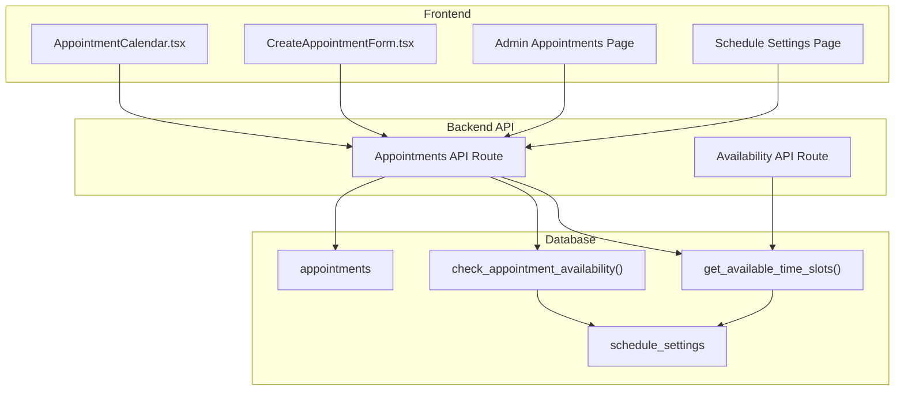
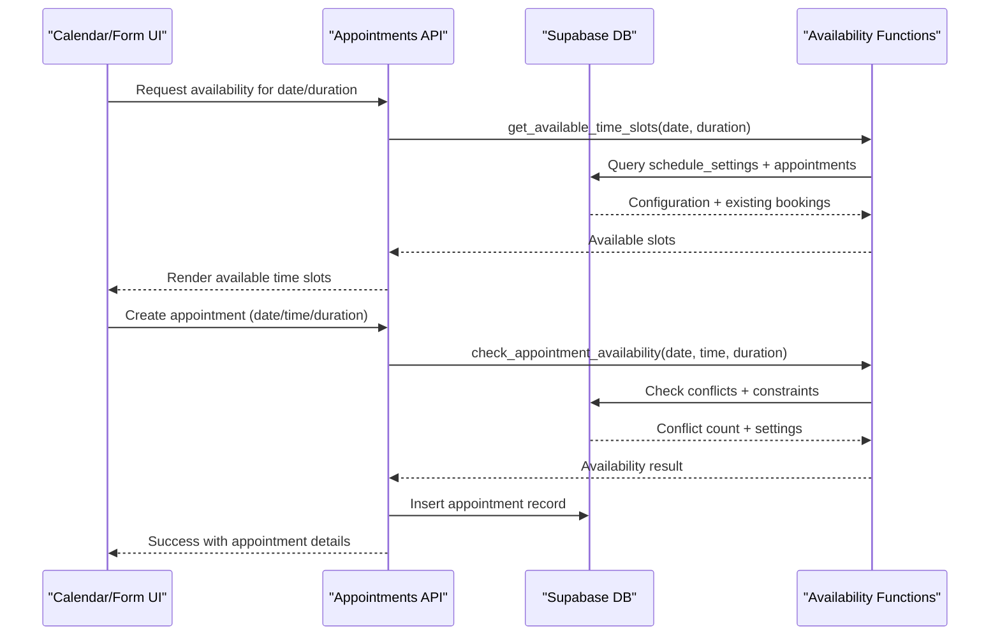
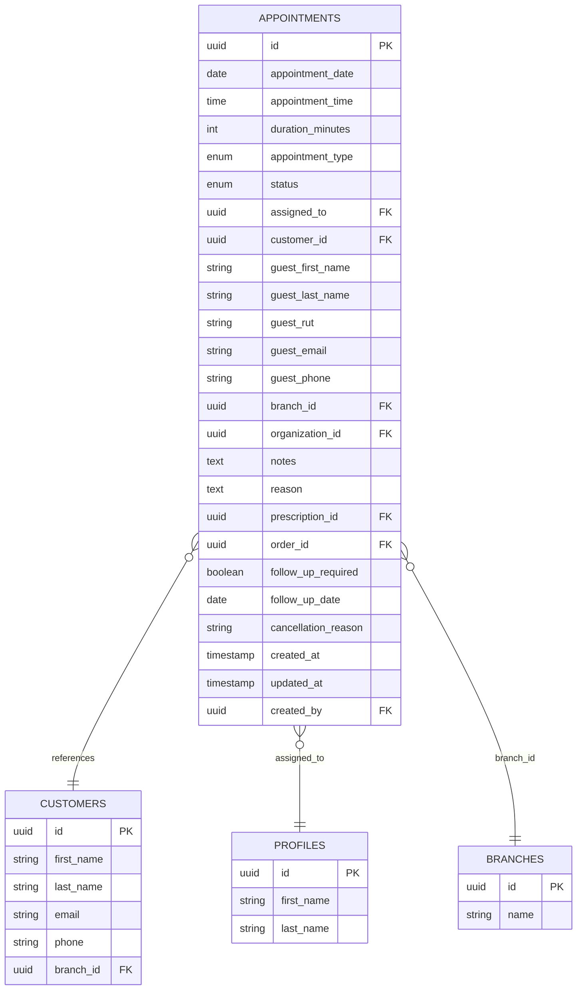
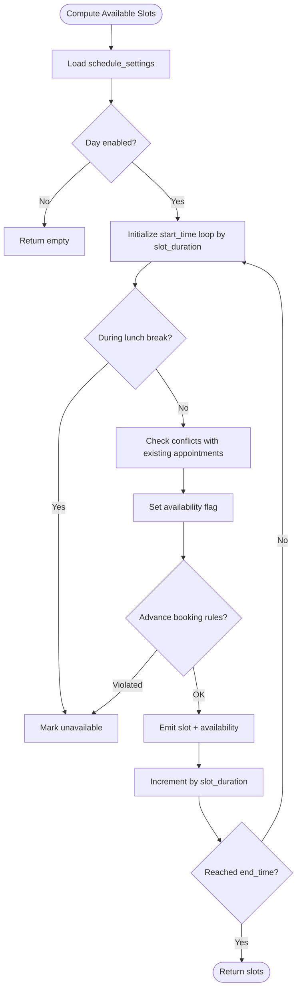
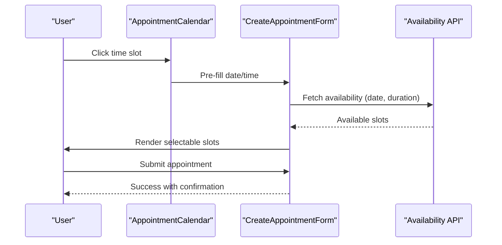
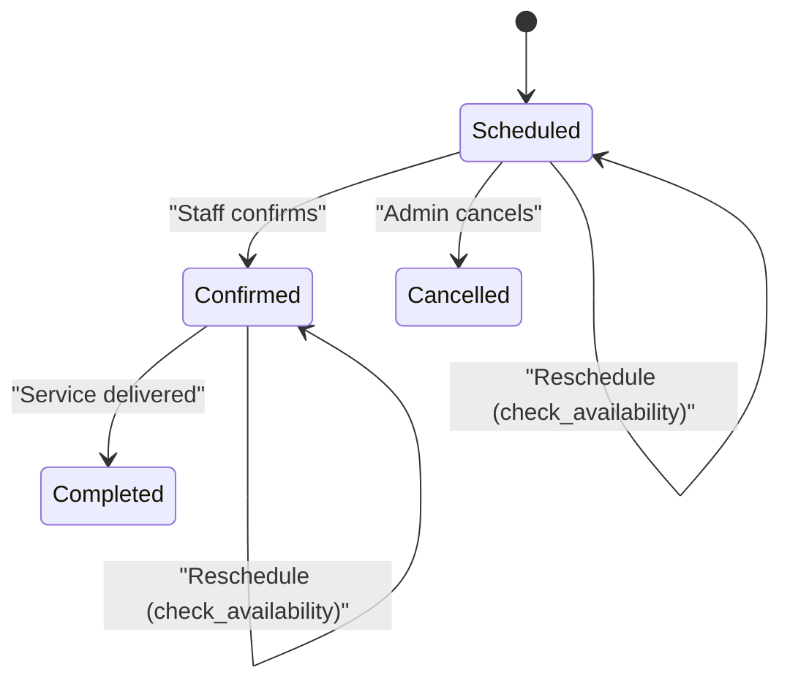
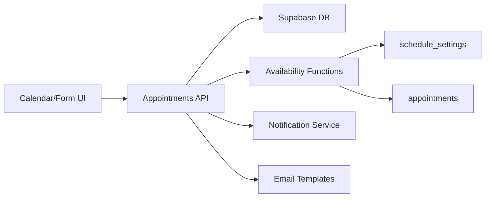

# Appointment Management System

<cite>
**Referenced Files in This Document**
- [AppointmentCalendar.tsx](file://src/components/admin/AppointmentCalendar.tsx)
- [CreateAppointmentForm.tsx](file://src/components/admin/CreateAppointmentForm.tsx)
- [page.tsx](file://src/app/admin/appointments/page.tsx)
- [settings/page.tsx](file://src/app/admin/appointments/settings/page.tsx)
- [route.ts](file://src/app/api/admin/appointments/route.ts)
- [availability/route.ts](file://src/app/api/admin/appointments/availability/route.ts)
- [supabase-rpc.ts](file://src/types/supabase-rpc.ts)
- [schedule_settings_system.sql](file://supabase/migrations/20250126000000_create_schedule_settings_system.sql)
- [fix_check_appointment_availability.sql](file://supabase/migrations/20250127000001_fix_check_appointment_availability.sql)
- [fix_timezone_check_appointment_availability.sql](file://supabase/migrations/20250127000003_fix_timezone_check_appointment_availability.sql)
- [update_appointment_availability_for_branches.sql](file://supabase/migrations/20251216000002_update_appointment_availability_for_branches.sql)
- [fix_appointment_availability_fallback.sql](file://supabase/migrations/20251216000004_fix_appointment_availability_fallback.sql)
- [update_get_available_time_slots_for_branches.sql](file://supabase/migrations/20251216000005_update_get_available_time_slots_for_branches.sql)
- [fix_get_available_time_slots_past_filtering.sql](file://supabase/migrations/20250127000004_fix_get_available_time_slots_past_filtering.sql)
- [notification-service.ts](file://src/lib/notifications/notification-service.ts)
- [optica.ts](file://src/lib/email/templates/optica.ts)
- [apply-notification-migrations.js](file://scripts/apply-notification-migrations.js)
</cite>

## Table of Contents

1. [Introduction](#introduction)
2. [Project Structure](#project-structure)
3. [Core Components](#core-components)
4. [Architecture Overview](#architecture-overview)
5. [Detailed Component Analysis](#detailed-component-analysis)
6. [Dependency Analysis](#dependency-analysis)
7. [Performance Considerations](#performance-considerations)
8. [Troubleshooting Guide](#troubleshooting-guide)
9. [Conclusion](#conclusion)

## Introduction

This document provides comprehensive data model documentation for the Opttius appointment management system, focusing on scheduling and calendar functionality. It covers appointment entities (slots, availability windows, booking records), relationships with customers, staff members, and branch locations, plus scheduling constraints, timezone handling, resource allocation rules, appointment types, duration calculations, rescheduling policies, reminders, notifications, and automated cancellation rules. It also documents data access patterns for calendar views, availability queries, and conflict resolution, along with performance optimization strategies for large-scale appointment data and concurrent booking scenarios.

## Project Structure

The appointment system spans frontend components, backend APIs, and database functions/migrations:

- Frontend:
  - Calendar view and scheduling UI components
  - Appointment creation/editing forms
  - Settings pages for schedule configuration
- Backend:
  - REST endpoints for CRUD operations and availability queries
  - Business logic for validation, notifications, and email confirmations
- Database:
  - Schedule settings with working hours, blocked dates, and advance booking rules
  - Availability functions for time slot generation and conflict detection
  - Branch-aware appointment records with customer/staff relations

**Diagram sources**

- [AppointmentCalendar.tsx](file://src/components/admin/AppointmentCalendar.tsx#L72-L80)
- [CreateAppointmentForm.tsx](file://src/components/admin/CreateAppointmentForm.tsx#L47-L53)
- [page.tsx](file://src/app/admin/appointments/page.tsx#L401-L412)
- [settings/page.tsx](file://src/app/admin/appointments/settings/page.tsx#L53-L101)
- [route.ts](file://src/app/api/admin/appointments/route.ts#L23-L203)
- [availability/route.ts](file://src/app/api/admin/appointments/availability/route.ts#L40-L88)
- [schedule_settings_system.sql](file://supabase/migrations/20250126000000_create_schedule_settings_system.sql#L6-L43)
- [schedule_settings_system.sql](file://supabase/migrations/20250126000000_create_schedule_settings_system.sql#L46-L153)
- [schedule_settings_system.sql](file://supabase/migrations/20250126000000_create_schedule_settings_system.sql#L156-L251)

**Section sources**

- [AppointmentCalendar.tsx](file://src/components/admin/AppointmentCalendar.tsx#L49-L80)
- [CreateAppointmentForm.tsx](file://src/components/admin/CreateAppointmentForm.tsx#L39-L53)
- [page.tsx](file://src/app/admin/appointments/page.tsx#L401-L412)
- [settings/page.tsx](file://src/app/admin/appointments/settings/page.tsx#L53-L101)
- [route.ts](file://src/app/api/admin/appointments/route.ts#L23-L203)
- [availability/route.ts](file://src/app/api/admin/appointments/availability/route.ts#L40-L88)
- [schedule_settings_system.sql](file://supabase/migrations/20250126000000_create_schedule_settings_system.sql#L6-L43)

## Core Components

- Appointment entity: Core booking record with date, time, duration, type, status, assigned staff, customer reference, and branch scoping.
- Schedule settings: Centralized configuration for slot duration, default appointment duration, working hours per day, blocked dates, and advance booking windows.
- Availability functions: Database-side functions to compute available time slots and validate individual time slots against conflicts and constraints.
- Calendar UI: Interactive calendar displaying time slots, highlighting availability, and enabling quick booking from calendar clicks.
- Creation form: Comprehensive form for creating/editing appointments with customer selection (registered or guest), duration selection, and availability validation.

**Section sources**

- [route.ts](file://src/app/api/admin/appointments/route.ts#L460-L500)
- [schedule_settings_system.sql](file://supabase/migrations/20250126000000_create_schedule_settings_system.sql#L6-L43)
- [schedule_settings_system.sql](file://supabase/migrations/20250126000000_create_schedule_settings_system.sql#L46-L153)
- [AppointmentCalendar.tsx](file://src/components/admin/AppointmentCalendar.tsx#L72-L80)
- [CreateAppointmentForm.tsx](file://src/components/admin/CreateAppointmentForm.tsx#L84-L109)

## Architecture Overview

The system follows a layered architecture:

- Presentation layer: Calendar and form components render scheduling UI and collect user input.
- Application layer: API routes validate requests, enforce business rules, and orchestrate database operations.
- Data layer: Supabase database with stored procedures/functions for availability computation and conflict detection.
- Notifications/email layer: Non-blocking services for appointment confirmations and administrative alerts.

**Diagram sources**

- [availability/route.ts](file://src/app/api/admin/appointments/availability/route.ts#L40-L88)
- [route.ts](file://src/app/api/admin/appointments/route.ts#L309-L421)
- [schedule_settings_system.sql](file://supabase/migrations/20250126000000_create_schedule_settings_system.sql#L46-L153)
- [schedule_settings_system.sql](file://supabase/migrations/20250126000000_create_schedule_settings_system.sql#L156-L251)

## Detailed Component Analysis

### Appointment Entity Model

Appointment records capture scheduling details and relationships:

- Identity: Unique identifier, branch association, organization scoping
- Timing: Date, start time, duration (minutes)
- Type and Status: Appointment type (e.g., eye exam, consultation, fitting), status lifecycle (scheduled, confirmed, completed, cancelled)
- Resources: Assigned staff, associated customer (registered or guest), optional prescription/order linkage
- Metadata: Notes, reason, follow-up requirements, cancellation reason, audit fields

**Diagram sources**

- [route.ts](file://src/app/api/admin/appointments/route.ts#L460-L500)
- [update_appointment_availability_for_branches.sql](file://supabase/migrations/20251216000002_update_appointment_availability_for_branches.sql#L77-L99)

**Section sources**

- [route.ts](file://src/app/api/admin/appointments/route.ts#L460-L500)
- [update_appointment_availability_for_branches.sql](file://supabase/migrations/20251216000002_update_appointment_availability_for_branches.sql#L77-L99)

### Schedule Settings and Availability Functions

Schedule settings define operational constraints:

- Slot duration (minutes), default appointment duration, buffer time
- Working hours per day (JSONB), including lunch breaks
- Blocked dates (holidays/closures)
- Advance booking constraints: minimum hours in advance, maximum days ahead
- Staff-specific overrides via JSONB

Availability functions:

- `get_available_time_slots`: Generates time slots for a given date, marking availability considering working hours, lunch breaks, existing bookings, and advance booking rules.
- `check_appointment_availability`: Validates a specific time slot for a given date and duration, excluding an existing appointment ID if updating.

**Diagram sources**

- [schedule_settings_system.sql](file://supabase/migrations/20250126000000_create_schedule_settings_system.sql#L46-L153)
- [schedule_settings_system.sql](file://supabase/migrations/20250126000000_create_schedule_settings_system.sql#L156-L251)
- [fix_get_available_time_slots_past_filtering.sql](file://supabase/migrations/20250127000004_fix_get_available_time_slots_past_filtering.sql#L80-L120)
- [fix_timezone_check_appointment_availability.sql](file://supabase/migrations/20250127000003_fix_timezone_check_appointment_availability.sql#L98-L119)

**Section sources**

- [schedule_settings_system.sql](file://supabase/migrations/20250126000000_create_schedule_settings_system.sql#L6-L43)
- [schedule_settings_system.sql](file://supabase/migrations/20250126000000_create_schedule_settings_system.sql#L46-L153)
- [schedule_settings_system.sql](file://supabase/migrations/20250126000000_create_schedule_settings_system.sql#L156-L251)
- [fix_check_appointment_availability.sql](file://supabase/migrations/20250127000001_fix_check_appointment_availability.sql#L76-L103)
- [fix_timezone_check_appointment_availability.sql](file://supabase/migrations/20250127000003_fix_timezone_check_appointment_availability.sql#L98-L119)
- [update_appointment_availability_for_branches.sql](file://supabase/migrations/20251216000002_update_appointment_availability_for_branches.sql#L12-L122)
- [fix_appointment_availability_fallback.sql](file://supabase/migrations/20251216000004_fix_appointment_availability_fallback.sql#L113-L148)
- [update_get_available_time_slots_for_branches.sql](file://supabase/migrations/20251216000005_update_get_available_time_slots_for_branches.sql#L119-L159)

### Calendar and Scheduling UI

The calendar component renders time slots based on schedule settings, highlights available slots, and enables quick creation from slot clicks. The creation form integrates with availability queries, supports registered/guest customer modes, and validates booking constraints.

**Diagram sources**

- [AppointmentCalendar.tsx](file://src/components/admin/AppointmentCalendar.tsx#L401-L425)
- [page.tsx](file://src/app/admin/appointments/page.tsx#L401-L412)
- [CreateAppointmentForm.tsx](file://src/components/admin/CreateAppointmentForm.tsx#L227-L305)
- [availability/route.ts](file://src/app/api/admin/appointments/availability/route.ts#L40-L88)

**Section sources**

- [AppointmentCalendar.tsx](file://src/components/admin/AppointmentCalendar.tsx#L72-L80)
- [page.tsx](file://src/app/admin/appointments/page.tsx#L401-L412)
- [CreateAppointmentForm.tsx](file://src/components/admin/CreateAppointmentForm.tsx#L84-L109)
- [CreateAppointmentForm.tsx](file://src/components/admin/CreateAppointmentForm.tsx#L227-L305)

### Appointment Types, Durations, and Rescheduling

- Appointment types: Eye exam, consultation, fitting, delivery, repair, follow-up, emergency, other.
- Duration selection: Configurable defaults and selectable increments (15–60 minutes).
- Rescheduling: Uses `check_appointment_availability` with the existing appointment ID excluded to prevent self-conflicts.

**Section sources**

- [CreateAppointmentForm.tsx](file://src/components/admin/CreateAppointmentForm.tsx#L111-L120)
- [CreateAppointmentForm.tsx](file://src/components/admin/CreateAppointmentForm.tsx#L814-L844)
- [route.ts](file://src/app/api/admin/appointments/route.ts#L328-L356)

### Status Lifecycle and Conflict Resolution

- Status lifecycle: scheduled → confirmed → completed; cancellation supported with reasons.
- Conflict resolution: Overlap detection considers both start-time containment and interval overlap; lunch break exclusions; advance booking windows enforced.

**Diagram sources**

- [route.ts](file://src/app/api/admin/appointments/route.ts#L328-L356)
- [schedule_settings_system.sql](file://supabase/migrations/20250126000000_create_schedule_settings_system.sql#L217-L232)

**Section sources**

- [page.tsx](file://src/app/admin/appointments/page.tsx#L265-L304)
- [CreateAppointmentForm.tsx](file://src/components/admin/CreateAppointmentForm.tsx#L1007-L1027)
- [schedule_settings_system.sql](file://supabase/migrations/20250126000000_create_schedule_settings_system.sql#L217-L232)

### Timezone Handling and Resource Allocation

- Timezone considerations: Availability checks account for local time vs. server time; when minimum advance hours equals zero, immediate bookings are allowed and timezone-specific comparisons are simplified.
- Resource allocation: Staff assignment is considered in both availability functions and UI; branch scoping ensures multi-tenant isolation.

**Section sources**

- [fix_timezone_check_appointment_availability.sql](file://supabase/migrations/20250127000003_fix_timezone_check_appointment_availability.sql#L90-L119)
- [update_appointment_availability_for_branches.sql](file://supabase/migrations/20251216000002_update_appointment_availability_for_branches.sql#L34-L40)
- [update_get_available_time_slots_for_branches.sql](file://supabase/migrations/20251216000005_update_get_available_time_slots_for_branches.sql#L129-L129)

### Reminders, Notifications, and Automated Cancellations

- Notifications: Administrative notifications for new appointments; configurable priority and visibility.
- Emails: Appointment confirmation sent to customer; cancellation email template available.
- Automated rules: Not explicitly implemented in the reviewed code; cancellation policy can be enforced via status transitions and availability constraints.

**Section sources**

- [notification-service.ts](file://src/lib/notifications/notification-service.ts#L409-L432)
- [optica.ts](file://src/lib/email/templates/optica.ts#L418-L446)
- [apply-notification-migrations.js](file://scripts/apply-notification-migrations.js#L1-L41)

### Data Access Patterns

- Calendar view: Query appointments filtered by date range, status, customer, and staff; join related entities (customer, staff, prescription, order) in batches to avoid N+1.
- Availability queries: Call `get_available_time_slots` with date and duration; optionally filter by staff and branch.
- Conflict checks: Call `check_appointment_availability` with date, time, duration, and optional exclusion of existing appointment ID.

**Section sources**

- [route.ts](file://src/app/api/admin/appointments/route.ts#L63-L104)
- [route.ts](file://src/app/api/admin/appointments/route.ts#L130-L191)
- [availability/route.ts](file://src/app/api/admin/appointments/availability/route.ts#L61-L88)
- [supabase-rpc.ts](file://src/types/supabase-rpc.ts#L100-L132)

## Dependency Analysis

The system exhibits clear separation of concerns:

- Frontend components depend on API routes for data and availability.
- API routes depend on database functions for business logic.
- Database functions depend on schedule settings and appointment tables.
- Notifications and email services are decoupled and invoked asynchronously.

**Diagram sources**

- [route.ts](file://src/app/api/admin/appointments/route.ts#L23-L203)
- [availability/route.ts](file://src/app/api/admin/appointments/availability/route.ts#L40-L88)
- [schedule_settings_system.sql](file://supabase/migrations/20250126000000_create_schedule_settings_system.sql#L46-L153)

**Section sources**

- [route.ts](file://src/app/api/admin/appointments/route.ts#L23-L203)
- [availability/route.ts](file://src/app/api/admin/appointments/availability/route.ts#L40-L88)
- [schedule_settings_system.sql](file://supabase/migrations/20250126000000_create_schedule_settings_system.sql#L46-L153)

## Performance Considerations

- Database indexing: Ensure appropriate indexes on appointment date/time/duration and branch filters.
- Batch joins: Fetch related entities (customers, staff, prescriptions, orders) in bulk to minimize round trips.
- Function-level filtering: Leverage database functions for availability computation to reduce client-side logic and network overhead.
- Concurrency: Use database constraints and atomic operations to prevent race conditions during booking; consider advisory locks if needed.
- Pagination and limits: Apply reasonable limits on calendar queries and implement pagination for large datasets.
- Caching: Cache schedule settings and frequently accessed availability windows for short TTLs to reduce DB load.

## Troubleshooting Guide

Common issues and resolutions:

- Availability returns empty: Verify schedule settings are configured and working hours match the selected date; confirm blocked dates and advance booking windows.
- Booking rejected: Check for overlapping appointments, lunch break conflicts, or insufficient advance notice; ensure branch and staff filters align with the request.
- Timezone discrepancies: When `min_advance_booking_hours` is zero, immediate bookings are allowed; otherwise, ensure consistent time handling across client/server.
- Notifications not firing: Confirm notification settings are enabled and branch-scoped; verify service role credentials and environment variables.

**Section sources**

- [fix_check_appointment_availability.sql](file://supabase/migrations/20250127000001_fix_check_appointment_availability.sql#L76-L103)
- [fix_timezone_check_appointment_availability.sql](file://supabase/migrations/20250127000003_fix_timezone_check_appointment_availability.sql#L90-L119)
- [notification-service.ts](file://src/lib/notifications/notification-service.ts#L53-L82)
- [apply-notification-migrations.js](file://scripts/apply-notification-migrations.js#L18-L41)

## Conclusion

The Opttius appointment management system provides a robust, branch-aware scheduling platform with configurable working hours, advanced availability computation, and integrated notifications. Its modular architecture supports efficient calendar views, real-time availability checks, and scalable multi-tenant operations. By adhering to the documented constraints, leveraging database functions, and implementing recommended performance optimizations, the system can reliably handle high volumes of concurrent bookings while maintaining data integrity and user experience.
