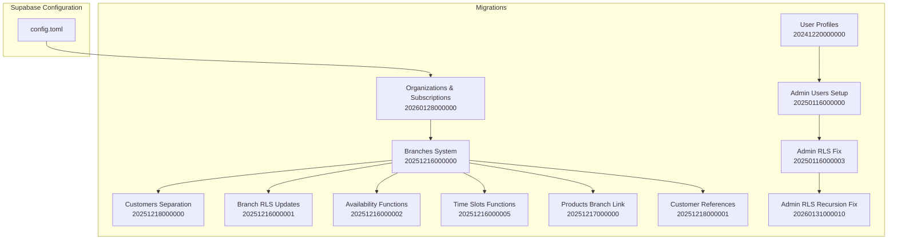
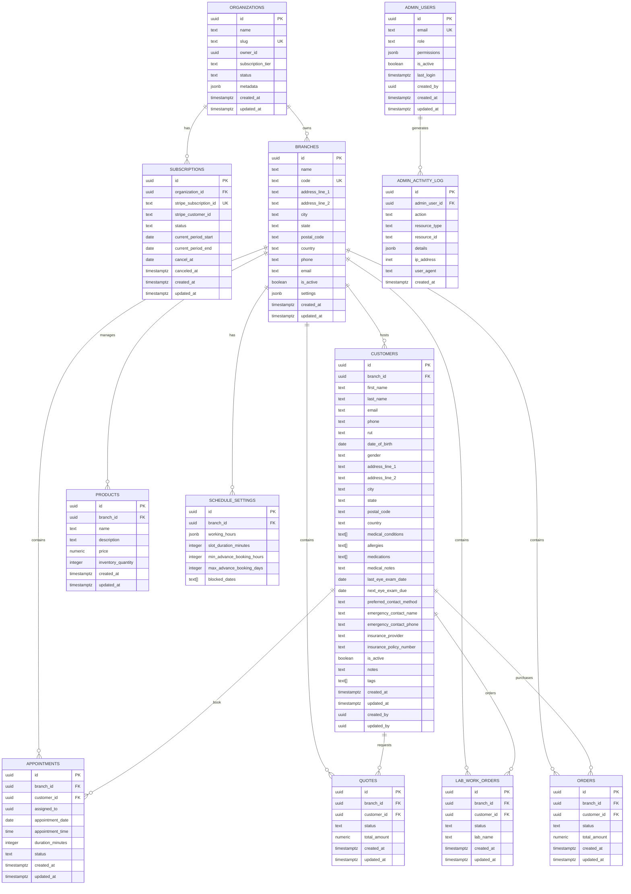
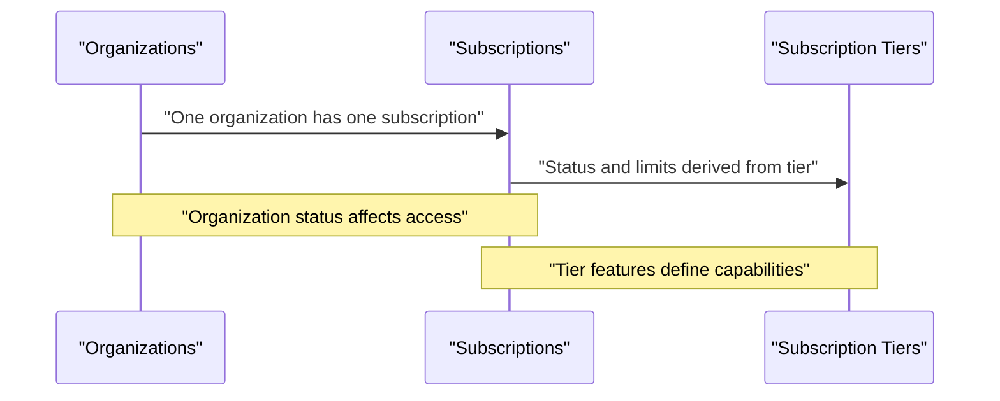
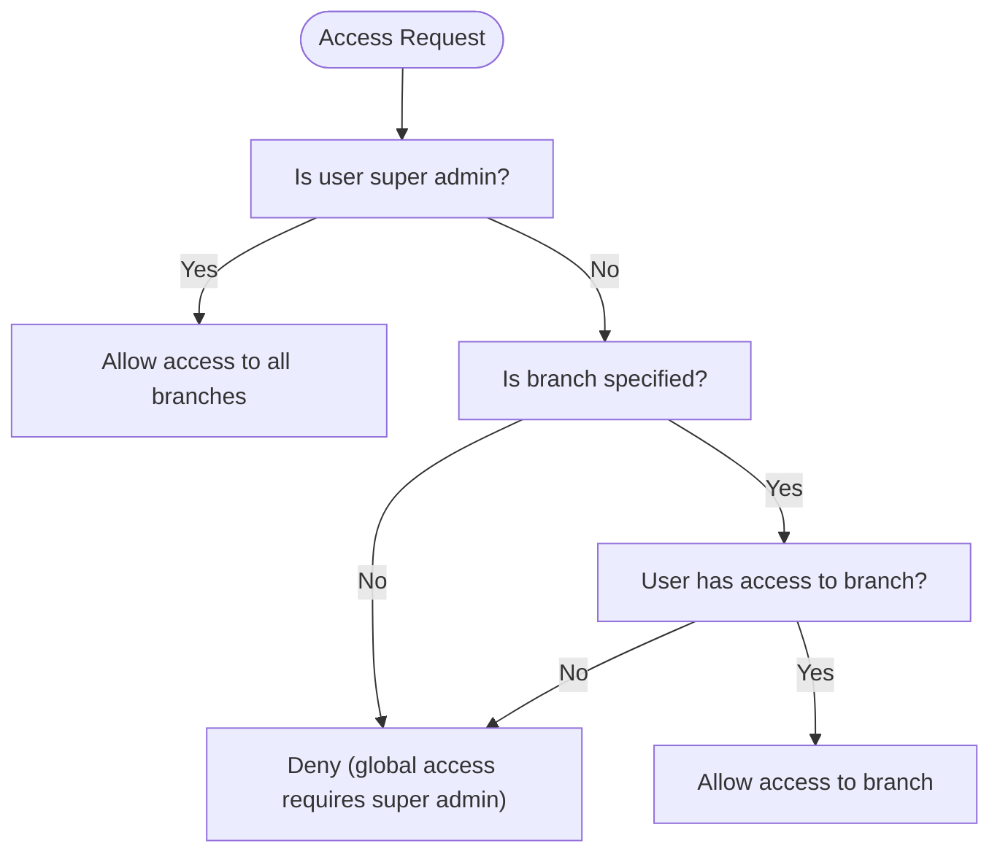
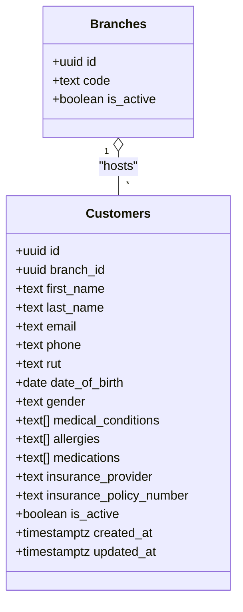
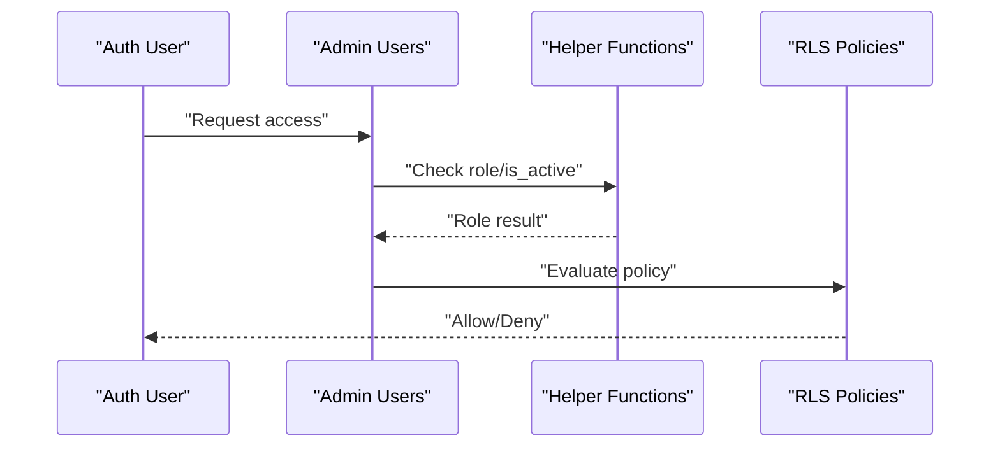
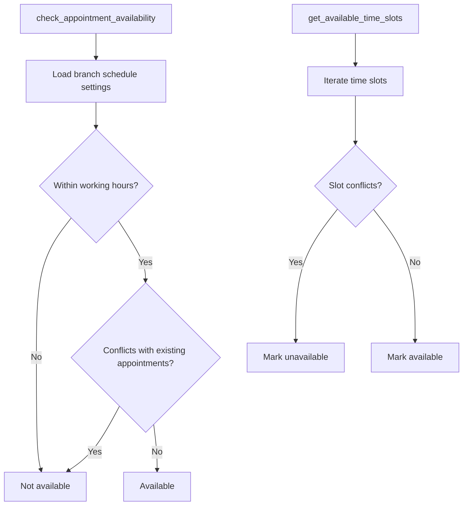
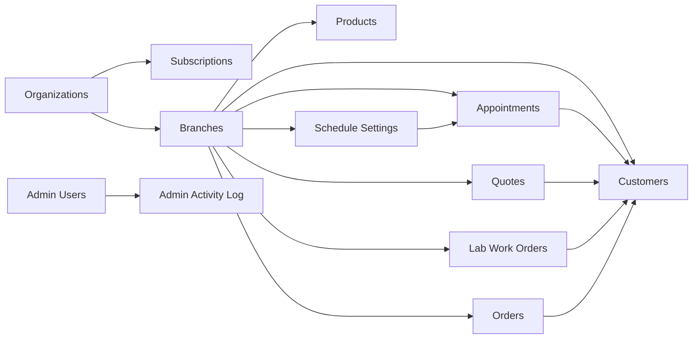

# Core Entities & Relationships

<cite>
**Referenced Files in This Document**
- [20260128000000_create_organizations_and_subscriptions.sql](file://supabase/migrations/20260128000000_create_organizations_and_subscriptions.sql)
- [20251216000000_create_branches_system.sql](file://supabase/migrations/20251216000000_create_branches_system.sql)
- [20251218000000_separate_customers_from_users.sql](file://supabase/migrations/20251218000000_separate_customers_from_users.sql)
- [20251216000001_update_rls_for_branches.sql](file://supabase/migrations/20251216000001_update_rls_for_branches.sql)
- [20251216000002_update_appointment_availability_for_branches.sql](file://supabase/migrations/20251216000002_update_appointment_availability_for_branches.sql)
- [20251216000005_update_get_available_time_slots_for_branches.sql](file://supabase/migrations/20251216000005_update_get_available_time_slots_for_branches.sql)
- [20251217000000_add_branch_id_to_products.sql](file://supabase/migrations/20251217000000_add_branch_id_to_products.sql)
- [20251218000001_update_customer_references.sql](file://supabase/migrations/20251218000001_update_customer_references.sql)
- [20241220000000_create_user_profiles.sql](file://supabase/migrations/20241220000000_create_user_profiles.sql)
- [20250116000000_setup_admin_users.sql](file://supabase/migrations/20250116000000_setup_admin_users.sql)
- [20250116000003_fix_admin_rls.sql](file://supabase/migrations/20250116000003_fix_admin_rls.sql)
- [20260131000010_fix_admin_users_rls_recursion.sql](file://supabase/migrations/20260131000010_fix_admin_users_rls_recursion.sql)
- [config.toml](file://supabase/config.toml)
</cite>

## Table of Contents

1. [Introduction](#introduction)
2. [Project Structure](#project-structure)
3. [Core Components](#core-components)
4. [Architecture Overview](#architecture-overview)
5. [Detailed Component Analysis](#detailed-component-analysis)
6. [Dependency Analysis](#dependency-analysis)
7. [Performance Considerations](#performance-considerations)
8. [Troubleshooting Guide](#troubleshooting-guide)
9. [Conclusion](#conclusion)

## Introduction

This document describes the core data model for Opttius, focusing on multi-tenant organizations, physical branches, patients (customers), staff users, and admin users. It explains entity relationships, foreign keys, referential integrity, multi-tenancy and branch access controls, primary key strategies, validation rules, and operational patterns. It also provides diagrams, indexing guidance, and lifecycle considerations.

## Project Structure

The data model is implemented via PostgreSQL migrations under the Supabase configuration. The relevant entities and their relationships are defined across several migrations that introduce tables, constraints, indexes, triggers, and row-level security (RLS) policies.

**Diagram sources**

- [config.toml](file://supabase/config.toml#L1-L345)
- [20260128000000_create_organizations_and_subscriptions.sql](file://supabase/migrations/20260128000000_create_organizations_and_subscriptions.sql#L1-L287)
- [20251216000000_create_branches_system.sql](file://supabase/migrations/20251216000000_create_branches_system.sql#L1-L397)
- [20251218000000_separate_customers_from_users.sql](file://supabase/migrations/20251218000000_separate_customers_from_users.sql#L1-L157)
- [20251216000001_update_rls_for_branches.sql](file://supabase/migrations/20251216000001_update_rls_for_branches.sql#L1-L370)
- [20251216000002_update_appointment_availability_for_branches.sql](file://supabase/migrations/20251216000002_update_appointment_availability_for_branches.sql#L1-L129)
- [20251216000005_update_get_available_time_slots_for_branches.sql](file://supabase/migrations/20251216000005_update_get_available_time_slots_for_branches.sql#L1-L160)
- [20251217000000_add_branch_id_to_products.sql](file://supabase/migrations/20251217000000_add_branch_id_to_products.sql#L1-L90)
- [20251218000001_update_customer_references.sql](file://supabase/migrations/20251218000001_update_customer_references.sql#L1-L152)
- [20241220000000_create_user_profiles.sql](file://supabase/migrations/20241220000000_create_user_profiles.sql#L1-L82)
- [20250116000000_setup_admin_users.sql](file://supabase/migrations/20250116000000_setup_admin_users.sql#L1-L280)
- [20250116000003_fix_admin_rls.sql](file://supabase/migrations/20250116000003_fix_admin_rls.sql#L1-L74)
- [20260131000010_fix_admin_users_rls_recursion.sql](file://supabase/migrations/20260131000010_fix_admin_users_rls_recursion.sql#L1-L78)

**Section sources**

- [config.toml](file://supabase/config.toml#L1-L345)

## Core Components

This section defines the primary entities and their attributes, constraints, and roles in the system.

- Organizations
  - Purpose: Multi-tenant tenants representing optical shops.
  - Primary key: UUID (generated).
  - Notable columns: name, slug (unique), owner_id (references auth.users), subscription_tier, status, metadata.
  - Constraints: subscription_tier and status are checked enums; slug is unique.
  - Indexes: slug, owner_id, status, tier.
  - RLS: Select/view depends on admin role; super admins can manage all.

- Branches
  - Purpose: Physical locations within an organization.
  - Primary key: UUID (generated).
  - Notable columns: name, code (unique), address fields, phone/email, is_active, settings.
  - Indexes: code, is_active.
  - RLS: Admins can view; super admins can manage.

- Admin Users
  - Purpose: Staff with administrative capabilities; separate from patient customers.
  - Primary key: UUID referencing auth.users(id).
  - Notable columns: email (unique), role (enum), permissions (JSONB), is_active, last_login, created_by.
  - Indexes: email, role, is_active.
  - RLS: Users can view own record; super/admin roles can manage; recursion fixed via helper functions.

- Customers (Patients)
  - Purpose: Branch-specific patients created within the platform.
  - Primary key: UUID (generated).
  - Notable columns: branch_id (FK to branches), personal info, identification (RUT), addresses, medical history, contact preferences, insurance, tags, notes, timestamps, created_by/updated_by.
  - Constraints: gender and preferred_contact_method are checked enums; country defaults to Chile.
  - Indexes: branch_id, email, phone, RUT, name, is_active, created_at.
  - RLS: Super admins see all; regular admins see only customers in accessible branches.

- Products
  - Purpose: Inventory items; linked to branches for localized stock.
  - Primary key: UUID (generated).
  - Notable columns: branch_id (nullable FK to branches), enabling legacy global items.
  - Indexes: branch_id.
  - RLS: Super admins see all; regular admins see per-accessible-branch; legacy global visibility allowed.

- Appointments, Quotes, Lab Work Orders, Orders
  - Purpose: Business workflows around eye care and sales.
  - Primary key: UUID (generated).
  - Notable columns: branch_id (FK to branches), customer_id (FK to customers), staff assignments, scheduling, statuses, timestamps.
  - Indexes: branch_id, customer_id, date/time/status combinations as appropriate.
  - RLS: Super admins see all; regular admins see per-accessible-branch; availability functions enforce branch-specific schedules.

- Schedule Settings
  - Purpose: Working hours, blocked dates, slot durations, and booking windows per branch.
  - Primary key: UUID (generated) or global fallback when branch_id is NULL.
  - Indexes: branch_id.
  - RLS: Super admins see all; regular admins see per-accessible-branch.

- Admin Activity Log
  - Purpose: Audit trail for admin actions.
  - Primary key: UUID (generated).
  - Notable columns: admin_user_id (FK to admin_users), action, resource_type, resource_id, details, ip_address, user_agent, created_at.
  - Indexes: admin_user_id, created_at.
  - RLS: Users can view their own activity; service role can manage.

**Section sources**

- [20260128000000_create_organizations_and_subscriptions.sql](file://supabase/migrations/20260128000000_create_organizations_and_subscriptions.sql#L6-L31)
- [20251216000000_create_branches_system.sql](file://supabase/migrations/20251216000000_create_branches_system.sql#L5-L21)
- [20250116000000_setup_admin_users.sql](file://supabase/migrations/20250116000000_setup_admin_users.sql#L5-L15)
- [20251218000000_separate_customers_from_users.sql](file://supabase/migrations/20251218000000_separate_customers_from_users.sql#L7-L59)
- [20251217000000_add_branch_id_to_products.sql](file://supabase/migrations/20251217000000_add_branch_id_to_products.sql#L5-L6)
- [20251216000001_update_rls_for_branches.sql](file://supabase/migrations/20251216000001_update_rls_for_branches.sql#L7-L311)
- [20251216000002_update_appointment_availability_for_branches.sql](file://supabase/migrations/20251216000002_update_appointment_availability_for_branches.sql#L12-L122)
- [20251216000005_update_get_available_time_slots_for_branches.sql](file://supabase/migrations/20251216000005_update_get_available_time_slots_for_branches.sql#L9-L157)
- [20251218000001_update_customer_references.sql](file://supabase/migrations/20251218000001_update_customer_references.sql#L7-L75)
- [20241220000000_create_user_profiles.sql](file://supabase/migrations/20241220000000_create_user_profiles.sql#L5-L33)
- [20250116000003_fix_admin_rls.sql](file://supabase/migrations/20250116000003_fix_admin_rls.sql#L10-L65)
- [20260131000010_fix_admin_users_rls_recursion.sql](file://supabase/migrations/20260131000010_fix_admin_users_rls_recursion.sql#L15-L69)

## Architecture Overview

Opttius employs a multi-tenant architecture centered on Organizations and a branch-per-location model. Admin users are scoped to organizations and branches via dedicated access controls. Customers are branch-specific and distinct from user profiles. Availability and time-slot functions are branch-aware to ensure accurate scheduling.

**Diagram sources**

- [20260128000000_create_organizations_and_subscriptions.sql](file://supabase/migrations/20260128000000_create_organizations_and_subscriptions.sql#L6-L31)
- [20251216000000_create_branches_system.sql](file://supabase/migrations/20251216000000_create_branches_system.sql#L5-L21)
- [20251218000000_separate_customers_from_users.sql](file://supabase/migrations/20251218000000_separate_customers_from_users.sql#L7-L59)
- [20251217000000_add_branch_id_to_products.sql](file://supabase/migrations/20251217000000_add_branch_id_to_products.sql#L5-L6)
- [20251216000001_update_rls_for_branches.sql](file://supabase/migrations/20251216000001_update_rls_for_branches.sql#L12-L311)
- [20251218000001_update_customer_references.sql](file://supabase/migrations/20251218000001_update_customer_references.sql#L7-L75)
- [20250116000000_setup_admin_users.sql](file://supabase/migrations/20250116000000_setup_admin_users.sql#L5-L15)
- [20250116000003_fix_admin_rls.sql](file://supabase/migrations/20250116000003_fix_admin_rls.sql#L10-L65)
- [20260131000010_fix_admin_users_rls_recursion.sql](file://supabase/migrations/20260131000010_fix_admin_users_rls_recursion.sql#L15-L69)

## Detailed Component Analysis

### Organizations and Subscriptions

- Multi-tenancy foundation: Each Organization is a tenant with a unique slug and optional owner.
- Subscriptions: Stripe-backed subscriptions with status and billing periods; linked to organizations.
- Tier limits: Max branches/users/customers/products enforced via subscription tiers.

**Diagram sources**

- [20260128000000_create_organizations_and_subscriptions.sql](file://supabase/migrations/20260128000000_create_organizations_and_subscriptions.sql#L6-L31)
- [20260128000000_create_organizations_and_subscriptions.sql](file://supabase/migrations/20260128000000_create_organizations_and_subscriptions.sql#L34-L44)
- [20260128000000_create_organizations_and_subscriptions.sql](file://supabase/migrations/20260128000000_create_organizations_and_subscriptions.sql#L212-L274)

**Section sources**

- [20260128000000_create_organizations_and_subscriptions.sql](file://supabase/migrations/20260128000000_create_organizations_and_subscriptions.sql#L6-L31)
- [20260128000000_create_organizations_and_subscriptions.sql](file://supabase/migrations/20260128000000_create_organizations_and_subscriptions.sql#L34-L44)
- [20260128000000_create_organizations_and_subscriptions.sql](file://supabase/migrations/20260128000000_create_organizations_and_subscriptions.sql#L54-L73)
- [20260128000000_create_organizations_and_subscriptions.sql](file://supabase/migrations/20260128000000_create_organizations_and_subscriptions.sql#L88-L208)

### Branches and Access Control

- Branches represent physical locations; each branch has settings and stock.
- Admin access is controlled via admin_branch_access with roles (manager, staff, viewer) and a special NULL branch_id indicating super admin access to all branches.
- Functions provide access checks and branch enumeration.

**Diagram sources**

- [20251216000000_create_branches_system.sql](file://supabase/migrations/20251216000000_create_branches_system.sql#L160-L188)
- [20251216000000_create_branches_system.sql](file://supabase/migrations/20251216000000_create_branches_system.sql#L116-L158)

**Section sources**

- [20251216000000_create_branches_system.sql](file://supabase/migrations/20251216000000_create_branches_system.sql#L23-L33)
- [20251216000000_create_branches_system.sql](file://supabase/migrations/20251216000000_create_branches_system.sql#L97-L201)
- [20251216000000_create_branches_system.sql](file://supabase/migrations/20251216000000_create_branches_system.sql#L217-L302)

### Customers (Patients)

- Branch-scoped; created within the platform; includes medical history and contact preferences.
- RLS policies ensure visibility and modification rights align with branch access.

**Diagram sources**

- [20251216000000_create_branches_system.sql](file://supabase/migrations/20251216000000_create_branches_system.sql#L5-L21)
- [20251218000000_separate_customers_from_users.sql](file://supabase/migrations/20251218000000_separate_customers_from_users.sql#L7-L59)

**Section sources**

- [20251218000000_separate_customers_from_users.sql](file://supabase/migrations/20251218000000_separate_customers_from_users.sql#L61-L74)
- [20251218000000_separate_customers_from_users.sql](file://supabase/migrations/20251218000000_separate_customers_from_users.sql#L76-L150)

### Admin Users and Permissions

- Admin users are separate from user profiles; they manage the system and are scoped by organization and branch.
- Roles and permissions are enforced via RLS and helper functions; recursion in policies was resolved.

**Diagram sources**

- [20250116000000_setup_admin_users.sql](file://supabase/migrations/20250116000000_setup_admin_users.sql#L80-L111)
- [20250116000003_fix_admin_rls.sql](file://supabase/migrations/20250116000003_fix_admin_rls.sql#L27-L65)
- [20260131000010_fix_admin_users_rls_recursion.sql](file://supabase/migrations/20260131000010_fix_admin_users_rls_recursion.sql#L15-L69)

**Section sources**

- [20250116000000_setup_admin_users.sql](file://supabase/migrations/20250116000000_setup_admin_users.sql#L34-L71)
- [20250116000003_fix_admin_rls.sql](file://supabase/migrations/20250116000003_fix_admin_rls.sql#L10-L65)
- [20260131000010_fix_admin_users_rls_recursion.sql](file://supabase/migrations/20260131000010_fix_admin_users_rls_recursion.sql#L15-L69)

### Availability and Time Slots

- Availability checks and time slot generation are branch-aware and consult schedule settings per branch or globally.
- Functions accept branch_id and staff filters to prevent conflicts.

**Diagram sources**

- [20251216000002_update_appointment_availability_for_branches.sql](file://supabase/migrations/20251216000002_update_appointment_availability_for_branches.sql#L12-L122)
- [20251216000005_update_get_available_time_slots_for_branches.sql](file://supabase/migrations/20251216000005_update_get_available_time_slots_for_branches.sql#L9-L157)

**Section sources**

- [20251216000002_update_appointment_availability_for_branches.sql](file://supabase/migrations/20251216000002_update_appointment_availability_for_branches.sql#L34-L121)
- [20251216000005_update_get_available_time_slots_for_branches.sql](file://supabase/migrations/20251216000005_update_get_available_time_slots_for_branches.sql#L33-L156)

### Product Inventory and Branch Stock

- Products are linked to branches; stock is tracked per branch with thresholds and reservations.
- RLS policies ensure visibility and updates are constrained by branch access.

**Section sources**

- [20251217000000_add_branch_id_to_products.sql](file://supabase/migrations/20251217000000_add_branch_id_to_products.sql#L18-L86)
- [20251216000000_create_branches_system.sql](file://supabase/migrations/20251216000000_create_branches_system.sql#L35-L46)

### Customer References Across Entities

- Customer references were migrated from profiles to the customers table; orders maintain a nullable reference while other entities cascade deletes.

**Section sources**

- [20251218000001_update_customer_references.sql](file://supabase/migrations/20251218000001_update_customer_references.sql#L7-L75)
- [20251218000001_update_customer_references.sql](file://supabase/migrations/20251218000001_update_customer_references.sql#L56-L75)

## Dependency Analysis

- Organizations own Subscriptions and Branches.
- Branches own Customers, Products, Appointments, Quotes, Lab Work Orders, Orders, and Schedule Settings.
- Admin Users generate Activity Logs and are scoped by Organization and Branch Access.
- Availability functions depend on Schedule Settings and Appointments.

**Diagram sources**

- [20260128000000_create_organizations_and_subscriptions.sql](file://supabase/migrations/20260128000000_create_organizations_and_subscriptions.sql#L6-L31)
- [20251216000000_create_branches_system.sql](file://supabase/migrations/20251216000000_create_branches_system.sql#L5-L21)
- [20251218000000_separate_customers_from_users.sql](file://supabase/migrations/20251218000000_separate_customers_from_users.sql#L7-L59)
- [20251217000000_add_branch_id_to_products.sql](file://supabase/migrations/20251217000000_add_branch_id_to_products.sql#L5-L6)
- [20251216000001_update_rls_for_branches.sql](file://supabase/migrations/20251216000001_update_rls_for_branches.sql#L12-L311)
- [20251218000001_update_customer_references.sql](file://supabase/migrations/20251218000001_update_customer_references.sql#L7-L75)
- [20250116000000_setup_admin_users.sql](file://supabase/migrations/20250116000000_setup_admin_users.sql#L5-L15)
- [20250116000003_fix_admin_rls.sql](file://supabase/migrations/20250116000003_fix_admin_rls.sql#L10-L65)

**Section sources**

- [20260128000000_create_organizations_and_subscriptions.sql](file://supabase/migrations/20260128000000_create_organizations_and_subscriptions.sql#L6-L31)
- [20251216000000_create_branches_system.sql](file://supabase/migrations/20251216000000_create_branches_system.sql#L5-L21)
- [20251216000001_update_rls_for_branches.sql](file://supabase/migrations/20251216000001_update_rls_for_branches.sql#L12-L311)

## Performance Considerations

- Primary keys: All core entities use UUIDs generated by gen_random_uuid(), ensuring distributed uniqueness and avoiding sequential patterns.
- Auto-increment patterns: None; UUIDs are the universal primary key strategy.
- Indexes:
  - Organizations: slug, owner_id, status, subscription_tier.
  - Branches: code, is_active.
  - Admin Users: email, role, is_active.
  - Customers: branch_id, email, phone, RUT, name, is_active, created_at.
  - Products: branch_id.
  - Appointments/Quotes/Lab Work Orders/Orders: branch_id and customer_id where applicable.
  - Schedule Settings: branch_id.
  - Admin Activity Log: admin_user_id, created_at.
- Triggers: update_updated_at_column applied to most tables to maintain audit timestamps.
- RLS: Policies filter by branch and role; ensure queries leverage indexed columns (branch_id, email, etc.) for optimal performance.
- Availability functions: Use branch-specific schedule settings and filter by branch_id to minimize cross-branch scans.

[No sources needed since this section provides general guidance]

## Troubleshooting Guide

- Infinite recursion in admin RLS:
  - Symptom: Policy queries on admin_users referencing admin_users causing recursion.
  - Resolution: Use helper functions (is_admin, get_admin_role) with SECURITY DEFINER and bypass RLS via direct schema-qualified queries; replace recursive policies with non-recursive ones.
- Branch access anomalies:
  - Ensure admin_branch_access includes a record with NULL branch_id for super admins.
  - Confirm can_access_branch and get_user_branches functions are used consistently.
- Customer references:
  - After migration, verify foreign keys from appointments, quotes, lab work orders, and lens purchases point to customers, not profiles.
- Availability checks:
  - Confirm schedule settings exist per branch or globally; verify functions receive branch_id to avoid cross-branch conflicts.

**Section sources**

- [20250116000003_fix_admin_rls.sql](file://supabase/migrations/20250116000003_fix_admin_rls.sql#L27-L65)
- [20260131000010_fix_admin_users_rls_recursion.sql](file://supabase/migrations/20260131000010_fix_admin_users_rls_recursion.sql#L15-L69)
- [20251216000000_create_branches_system.sql](file://supabase/migrations/20251216000000_create_branches_system.sql#L160-L188)
- [20251218000001_update_customer_references.sql](file://supabase/migrations/20251218000001_update_customer_references.sql#L7-L75)
- [20251216000002_update_appointment_availability_for_branches.sql](file://supabase/migrations/20251216000002_update_appointment_availability_for_branches.sql#L34-L121)

## Conclusion

Opttius’ data model centers on a robust multi-tenant architecture with organizations and branches, strict branch-scoped customer management, and admin users governed by non-recursive RLS policies. Availability and time-slot functions are branch-aware, and inventory is managed per branch. The design emphasizes referential integrity, validation rules, and scalable indexing to support growth and compliance with branch-level access controls.
