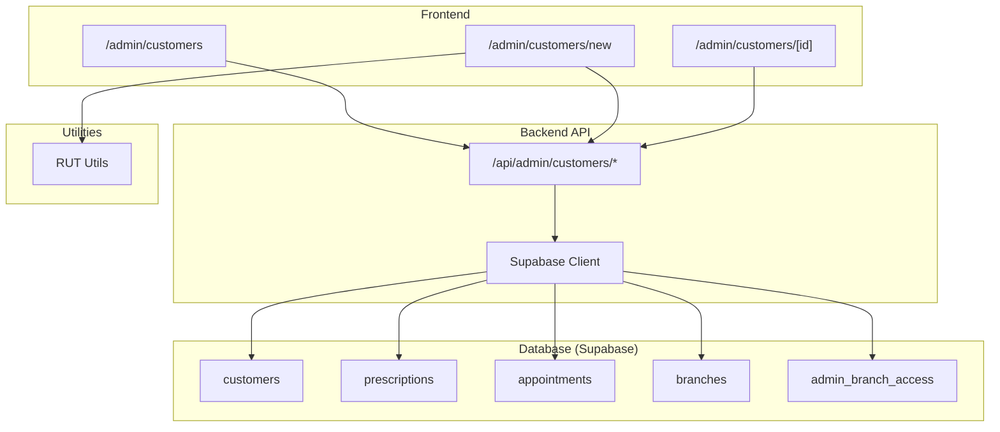
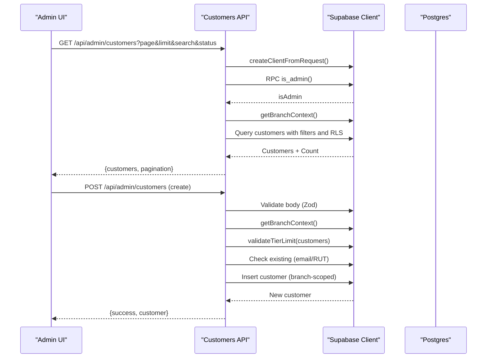
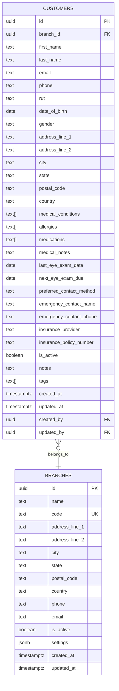
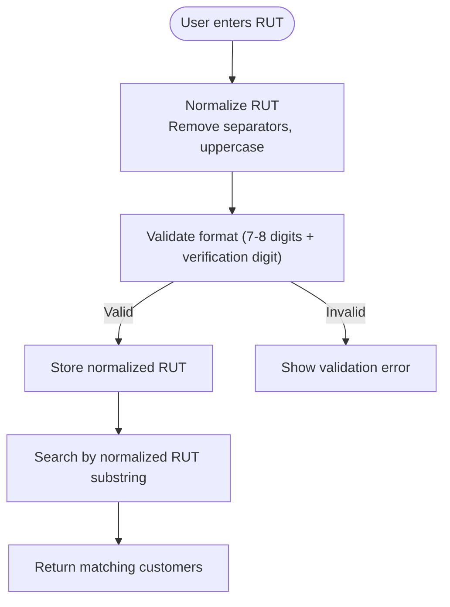
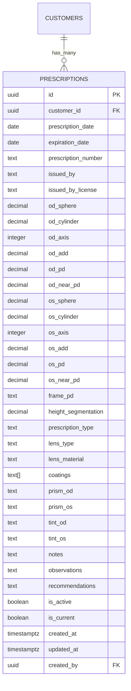
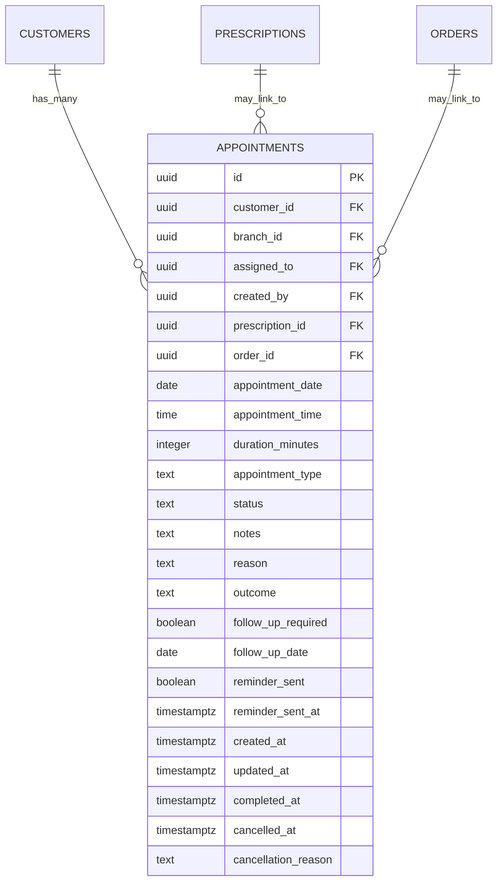
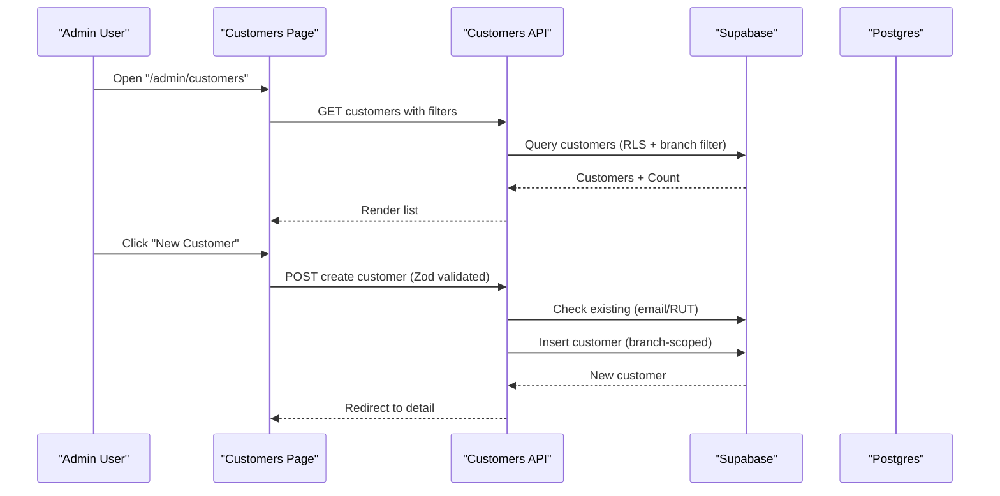
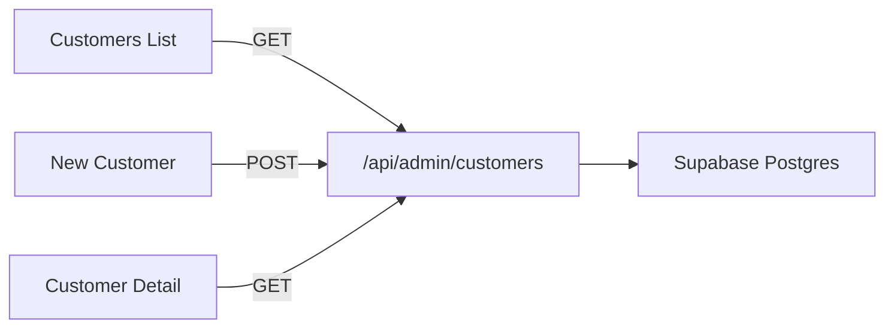
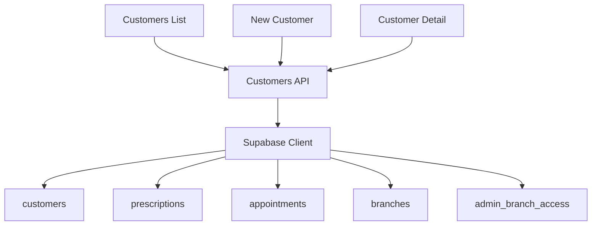

# Customers & Patients

<cite>
**Referenced Files in This Document**
- [supabase/20251218000000_separate_customers_from_users.sql](file://supabase/migrations/20251218000000_separate_customers_from_users.sql)
- [supabase/20250123000000_adapt_customers_for_optical_shop.sql](file://supabase/migrations/20250123000000_adapt_customers_for_optical_shop.sql)
- [supabase/20250131000001_add_rut_search_function.sql](file://supabase/migrations/20250131000001_add_rut_search_function.sql)
- [supabase/20251219000000_update_rut_search_for_customers.sql](file://supabase/migrations/20251219000000_update_rut_search_for_customers.sql)
- [supabase/20251216000000_create_branches_system.sql](file://supabase/migrations/20251216000000_create_branches_system.sql)
- [src/lib/supabase.ts](file://src/lib/supabase.ts)
- [src/app/admin/customers/page.tsx](file://src/app/admin/customers/page.tsx)
- [src/app/admin/customers/new/page.tsx](file://src/app/admin/customers/new/page.tsx)
- [src/app/admin/customers/[id]/page.tsx](file://src/app/admin/customers/[id]/page.tsx)
- [src/app/api/admin/customers/route.ts](file://src/app/api/admin/customers/route.ts)
- [src/lib/utils/rut.ts](file://src/lib/utils/rut.ts)
</cite>

## Table of Contents

1. [Introduction](#introduction)
2. [Project Structure](#project-structure)
3. [Core Components](#core-components)
4. [Architecture Overview](#architecture-overview)
5. [Detailed Component Analysis](#detailed-component-analysis)
6. [Dependency Analysis](#dependency-analysis)
7. [Performance Considerations](#performance-considerations)
8. [Troubleshooting Guide](#troubleshooting-guide)
9. [Conclusion](#conclusion)

## Introduction

This document describes the customer and patient data model for an optical practice management system. It focuses on:

- The customer entity and its separation from internal user accounts
- Patient demographics, identity verification (RUT), and medical history
- Lifecycle management from initial consultation to ongoing care
- Medical record keeping, prescription history, and appointment tracking
- Identity verification and search capabilities
- Privacy and data protection considerations
- Integration patterns with appointment scheduling and prescription systems

## Project Structure

The customer/patient domain spans database migrations, backend API routes, frontend pages, and utility libraries:

- Database: Supabase Postgres with migrations defining customer, prescription, appointment, and related tables
- Backend: Next.js App Router API handlers for customer CRUD and analytics
- Frontend: Admin pages for listing, creating, editing, and viewing customer details
- Utilities: RUT formatting and normalization helpers

**Diagram sources**

- [supabase/20251218000000_separate_customers_from_users.sql](file://supabase/migrations/20251218000000_separate_customers_from_users.sql#L6-L59)
- [supabase/20250123000000_adapt_customers_for_optical_shop.sql](file://supabase/migrations/20250123000000_adapt_customers_for_optical_shop.sql#L38-L145)
- [supabase/20251216000000_create_branches_system.sql](file://supabase/migrations/20251216000000_create_branches_system.sql#L4-L33)
- [src/app/api/admin/customers/route.ts](file://src/app/api/admin/customers/route.ts#L22-L223)
- [src/app/admin/customers/page.tsx](file://src/app/admin/customers/page.tsx#L75-L515)
- [src/app/admin/customers/new/page.tsx](file://src/app/admin/customers/new/page.tsx#L31-L353)
- [src/app/admin/customers/[id]/page.tsx](file://src/app/admin/customers/[id]/page.tsx#L225-L800)
- [src/lib/utils/rut.ts](file://src/lib/utils/rut.ts#L17-L64)

**Section sources**

- [supabase/20251218000000_separate_customers_from_users.sql](file://supabase/migrations/20251218000000_separate_customers_from_users.sql#L1-L157)
- [supabase/20250123000000_adapt_customers_for_optical_shop.sql](file://supabase/migrations/20250123000000_adapt_customers_for_optical_shop.sql#L1-L455)
- [supabase/20251216000000_create_branches_system.sql](file://supabase/migrations/20251216000000_create_branches_system.sql#L1-L397)
- [src/app/api/admin/customers/route.ts](file://src/app/api/admin/customers/route.ts#L1-L703)
- [src/app/admin/customers/page.tsx](file://src/app/admin/customers/page.tsx#L1-L516)
- [src/app/admin/customers/new/page.tsx](file://src/app/admin/customers/new/page.tsx#L1-L353)
- [src/app/admin/customers/[id]/page.tsx](file://src/app/admin/customers/[id]/page.tsx#L1-L800)
- [src/lib/utils/rut.ts](file://src/lib/utils/rut.ts#L1-L65)

## Core Components

- Customer entity: Branch-scoped, separate from internal users; stores personal info, identity (RUT), demographics, medical history, contact preferences, insurance, and status
- Prescriptions: Optical prescriptions linked to customers with spherical, cylindrical, axis, add, pupillary distances, lens type/material, special requirements, and status
- Appointments: Scheduled visits with type, status, outcomes, reminders, and optional linkage to prescriptions and orders
- Branch system: Multi-branch architecture with access control and RLS policies
- Identity verification: RUT normalization and partial-match search functions

**Section sources**

- [supabase/20251218000000_separate_customers_from_users.sql](file://supabase/migrations/20251218000000_separate_customers_from_users.sql#L6-L59)
- [supabase/20250123000000_adapt_customers_for_optical_shop.sql](file://supabase/migrations/20250123000000_adapt_customers_for_optical_shop.sql#L38-L145)
- [supabase/20251216000000_create_branches_system.sql](file://supabase/migrations/20251216000000_create_branches_system.sql#L4-L33)
- [supabase/20250131000001_add_rut_search_function.sql](file://supabase/migrations/20250131000001_add_rut_search_function.sql#L5-L47)
- [supabase/20251219000000_update_rut_search_for_customers.sql](file://supabase/migrations/20251219000000_update_rut_search_for_customers.sql#L5-L37)

## Architecture Overview

The system separates internal users (profiles) from external customers (customers). Customers are branch-specific and protected by Row Level Security (RLS). The API enforces admin authorization, branch context, and organization isolation. Frontend pages integrate with the API to manage customers, prescriptions, and appointments.

**Diagram sources**

- [src/app/api/admin/customers/route.ts](file://src/app/api/admin/customers/route.ts#L22-L223)
- [src/app/api/admin/customers/route.ts](file://src/app/api/admin/customers/route.ts#L226-L703)
- [src/lib/supabase.ts](file://src/lib/supabase.ts#L1-L36)

## Detailed Component Analysis

### Customer Entity and Medical History

- Purpose: Store patient demographics, identity verification (RUT), medical conditions/allergies/medications, eye exam dates, contact preferences, insurance, and general notes/tags
- Branch scoping: Each customer belongs to a branch and is isolated via RLS and branch filters
- Indexes: Optimized lookups by email, phone, RUT, name, activity, and timestamps
- RLS: Super admins see all; branch admins see only their accessible branches

**Diagram sources**

- [supabase/20251218000000_separate_customers_from_users.sql](file://supabase/migrations/20251218000000_separate_customers_from_users.sql#L6-L59)
- [supabase/20251216000000_create_branches_system.sql](file://supabase/migrations/20251216000000_create_branches_system.sql#L4-L21)

**Section sources**

- [supabase/20251218000000_separate_customers_from_users.sql](file://supabase/migrations/20251218000000_separate_customers_from_users.sql#L6-L75)
- [supabase/20251218000000_separate_customers_from_users.sql](file://supabase/migrations/20251218000000_separate_customers_from_users.sql#L76-L157)

### Identity Verification and Search (RUT)

- Normalization: Removes dots, dashes, spaces; uppercases for consistent comparison
- Partial match search: Supports flexible RUT input formats
- Index: Functional index on normalized RUT for efficient LIKE queries
- Validation: Ensures correct format before storing

**Diagram sources**

- [src/lib/utils/rut.ts](file://src/lib/utils/rut.ts#L17-L64)
- [supabase/20250131000001_add_rut_search_function.sql](file://supabase/migrations/20250131000001_add_rut_search_function.sql#L5-L21)
- [supabase/20251219000000_update_rut_search_for_customers.sql](file://supabase/migrations/20251219000000_update_rut_search_for_customers.sql#L5-L37)

**Section sources**

- [src/lib/utils/rut.ts](file://src/lib/utils/rut.ts#L1-L65)
- [supabase/20250131000001_add_rut_search_function.sql](file://supabase/migrations/20250131000001_add_rut_search_function.sql#L1-L48)
- [supabase/20251219000000_update_rut_search_for_customers.sql](file://supabase/migrations/20251219000000_update_rut_search_for_customers.sql#L1-L38)

### Prescriptions and Medical Records

- Fields: Right/left eye sphere/cylinder/axis/add/pd, lens type/material, special requirements (prism, tint, coatings), notes, status (active/current)
- Links: Associated with a customer; supports multiple historical prescriptions
- Functions: Retrieve current prescription and upcoming appointments

**Diagram sources**

- [supabase/20250123000000_adapt_customers_for_optical_shop.sql](file://supabase/migrations/20250123000000_adapt_customers_for_optical_shop.sql#L38-L95)

**Section sources**

- [supabase/20250123000000_adapt_customers_for_optical_shop.sql](file://supabase/migrations/20250123000000_adapt_customers_for_optical_shop.sql#L38-L95)

### Appointments and Care Lifecycle

- Fields: Date/time, duration, type (exam, consultation, fitting, delivery, repair, follow-up, emergency), status, assigned staff, outcomes, follow-up requirements, reminders
- Links: Optionally linked to prescriptions and orders
- Functions: Retrieve upcoming appointments for a customer

**Diagram sources**

- [supabase/20250123000000_adapt_customers_for_optical_shop.sql](file://supabase/migrations/20250123000000_adapt_customers_for_optical_shop.sql#L97-L145)
- [supabase/20251216000000_create_branches_system.sql](file://supabase/migrations/20251216000000_create_branches_system.sql#L48-L76)

**Section sources**

- [supabase/20250123000000_adapt_customers_for_optical_shop.sql](file://supabase/migrations/20250123000000_adapt_customers_for_optical_shop.sql#L97-L145)
- [supabase/20251216000000_create_branches_system.sql](file://supabase/migrations/20251216000000_create_branches_system.sql#L48-L76)

### Customer Lifecycle Management

- Onboarding: Create customer with branch context, validate uniqueness by email/RUT, enforce tier limits
- Ongoing care: Track prescriptions and appointments; maintain medical history fields
- Communication: Preferred contact method and emergency contacts; reminders for appointments
- Reporting: Analytics summary (totals, counts, segments) via API

**Diagram sources**

- [src/app/admin/customers/page.tsx](file://src/app/admin/customers/page.tsx#L75-L160)
- [src/app/admin/customers/new/page.tsx](file://src/app/admin/customers/new/page.tsx#L31-L133)
- [src/app/api/admin/customers/route.ts](file://src/app/api/admin/customers/route.ts#L226-L596)

**Section sources**

- [src/app/admin/customers/page.tsx](file://src/app/admin/customers/page.tsx#L75-L515)
- [src/app/admin/customers/new/page.tsx](file://src/app/admin/customers/new/page.tsx#L31-L353)
- [src/app/api/admin/customers/route.ts](file://src/app/api/admin/customers/route.ts#L226-L596)

### Frontend Pages and Workflows

- List: Search by name/email/phone/RUT, filter by status, paginate, branch selector, global view for super admins
- New: Form with personal/address info, RUT formatting, branch selection (or enforced for super admin global view)
- Detail: Tabs for overview, prescriptions, appointments, quotes, purchases, analytics; lazy load heavy forms

**Diagram sources**

- [src/app/admin/customers/page.tsx](file://src/app/admin/customers/page.tsx#L75-L160)
- [src/app/admin/customers/new/page.tsx](file://src/app/admin/customers/new/page.tsx#L31-L133)
- [src/app/admin/customers/[id]/page.tsx](file://src/app/admin/customers/[id]/page.tsx#L225-L265)
- [src/app/api/admin/customers/route.ts](file://src/app/api/admin/customers/route.ts#L22-L223)

**Section sources**

- [src/app/admin/customers/page.tsx](file://src/app/admin/customers/page.tsx#L1-L516)
- [src/app/admin/customers/new/page.tsx](file://src/app/admin/customers/new/page.tsx#L1-L353)
- [src/app/admin/customers/[id]/page.tsx](file://src/app/admin/customers/[id]/page.tsx#L1-L800)

## Dependency Analysis

- Database dependencies: customers depends on branches; prescriptions/appointments depend on customers; admin_branch_access controls branch visibility
- Backend dependencies: API uses Supabase client, branch middleware, admin RPC, rate limiting, Zod validation
- Frontend dependencies: Pages consume API endpoints; lazy load forms to optimize bundles

**Diagram sources**

- [src/app/api/admin/customers/route.ts](file://src/app/api/admin/customers/route.ts#L1-L703)
- [src/lib/supabase.ts](file://src/lib/supabase.ts#L1-L36)
- [supabase/20251218000000_separate_customers_from_users.sql](file://supabase/migrations/20251218000000_separate_customers_from_users.sql#L6-L59)
- [supabase/20250123000000_adapt_customers_for_optical_shop.sql](file://supabase/migrations/20250123000000_adapt_customers_for_optical_shop.sql#L38-L145)
- [supabase/20251216000000_create_branches_system.sql](file://supabase/migrations/20251216000000_create_branches_system.sql#L4-L33)

**Section sources**

- [src/app/api/admin/customers/route.ts](file://src/app/api/admin/customers/route.ts#L1-L703)
- [src/lib/supabase.ts](file://src/lib/supabase.ts#L1-L36)
- [supabase/20251218000000_separate_customers_from_users.sql](file://supabase/migrations/20251218000000_separate_customers_from_users.sql#L1-L157)
- [supabase/20250123000000_adapt_customers_for_optical_shop.sql](file://supabase/migrations/20250123000000_adapt_customers_for_optical_shop.sql#L1-L455)
- [supabase/20251216000000_create_branches_system.sql](file://supabase/migrations/20251216000000_create_branches_system.sql#L1-L397)

## Performance Considerations

- Indexes: Composite and functional indexes on RUT, names, statuses, timestamps
- Queries: Pagination and filtered counts; branch-aware queries avoid scanning unrelated data
- Lazy loading: Dynamic imports for heavy forms reduce initial payload
- Rate limiting: POST endpoints are rate-limited to prevent abuse

[No sources needed since this section provides general guidance]

## Troubleshooting Guide

- Authentication/Admin checks: API verifies admin status via RPC; unauthorized access returns 401/403
- Branch context: Ensure branch header is present; super admin global view requires explicit branch selection
- Duplicate detection: Creation prevents duplicates by email/RUT within the same branch
- Tier limits: Creation validates organization’s customer limit before inserting
- RUT validation: Use provided utilities to format and validate before submission

**Section sources**

- [src/app/api/admin/customers/route.ts](file://src/app/api/admin/customers/route.ts#L55-L82)
- [src/app/api/admin/customers/route.ts](file://src/app/api/admin/customers/route.ts#L364-L468)
- [src/lib/utils/rut.ts](file://src/lib/utils/rut.ts#L17-L64)

## Conclusion

The customer/patient model is designed for optical practice management with strict separation between internal users and external customers. It supports comprehensive patient demographics, identity verification via RUT, medical history, and integrated workflows for prescriptions and appointments. Branch scoping and RLS ensure privacy and multi-tenant isolation, while API endpoints and frontend pages provide a robust admin experience.
