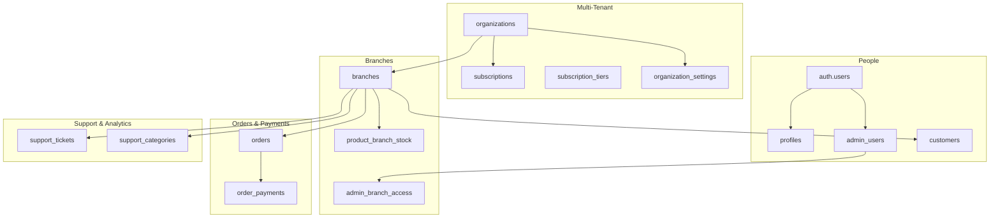
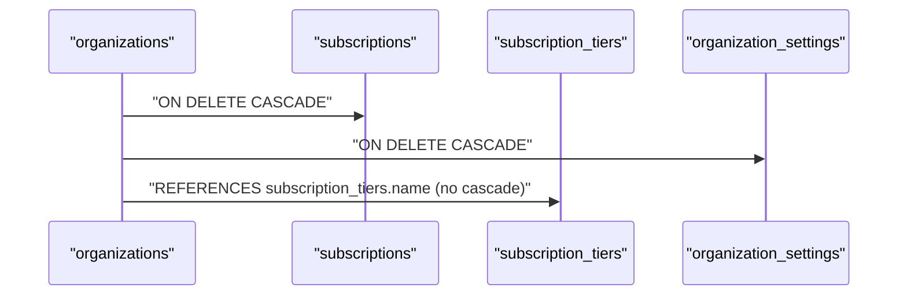
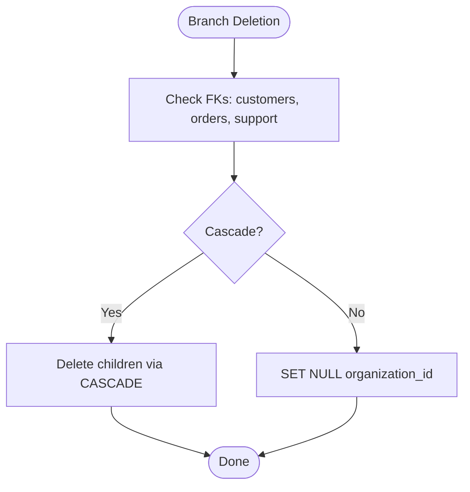
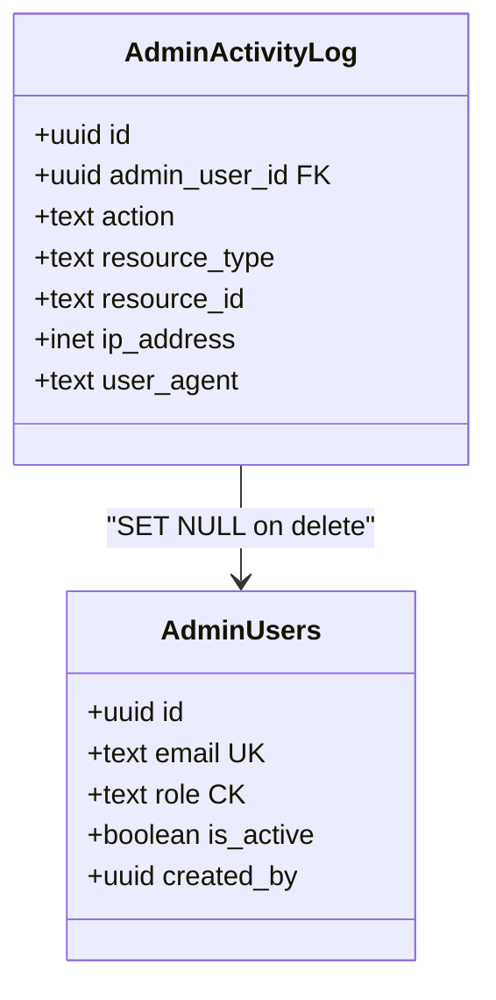
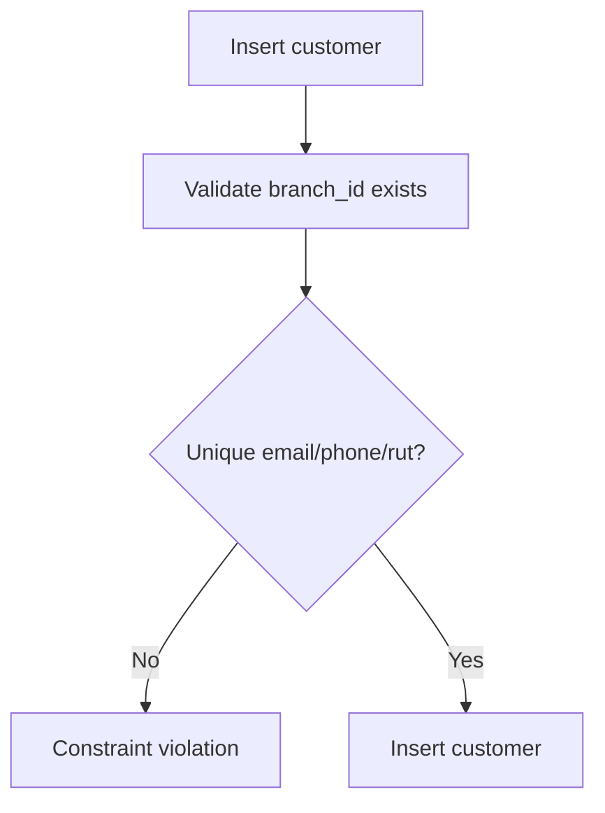
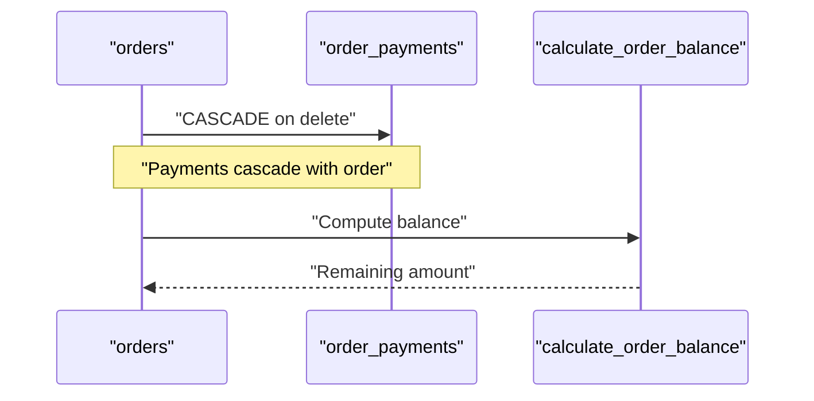
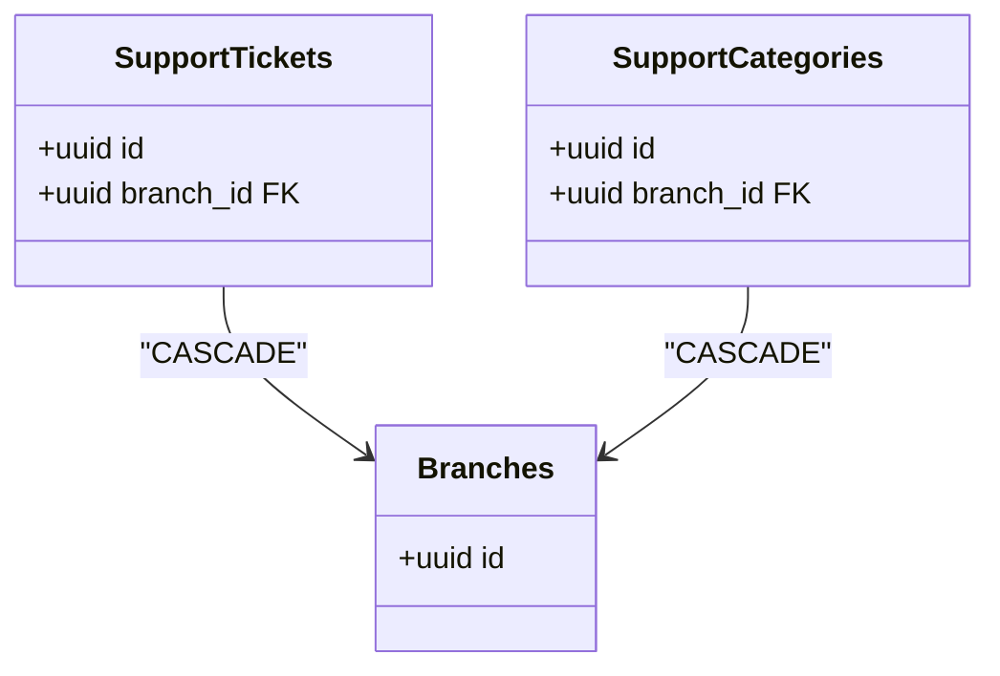
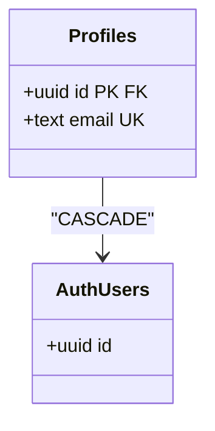
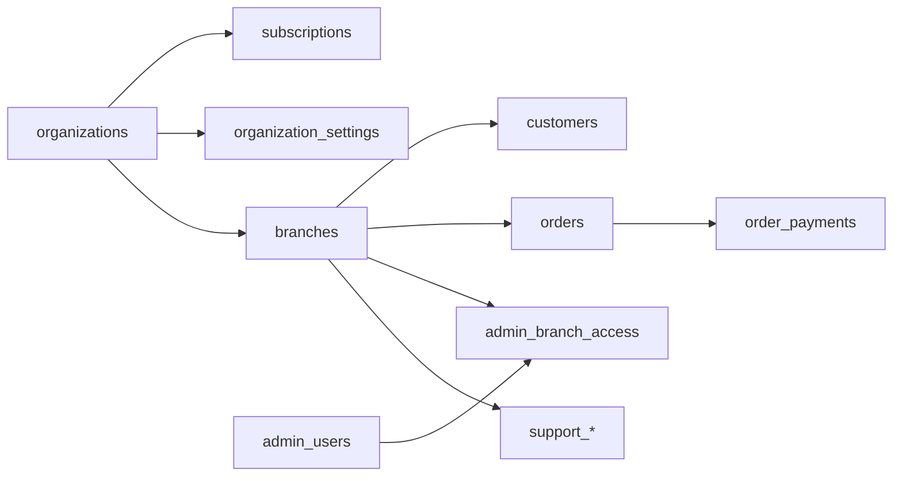

# Entity Relationships & Constraints

<cite>
**Referenced Files in This Document**
- [20241220000000_create_user_profiles.sql](file://supabase/migrations/20241220000000_create_user_profiles.sql)
- [20250116000000_setup_admin_users.sql](file://supabase/migrations/20250116000000_setup_admin_users.sql)
- [20251216000000_create_branches_system.sql](file://supabase/migrations/20251216000000_create_branches_system.sql)
- [20251218000000_separate_customers_from_users.sql](file://supabase/migrations/20251218000000_separate_customers_from_users.sql)
- [20260128000000_create_organizations_and_subscriptions.sql](file://supabase/migrations/20260128000000_create_organizations_and_subscriptions.sql)
- [20260122000005_create_organization_settings.sql](file://supabase/migrations/20260122000005_create_organization_settings.sql)
- [20260122000006_create_order_payments.sql](file://supabase/migrations/20260122000006_create_order_payments.sql)
- [20260122000007_add_on_hold_payment_status.sql](file://supabase/migrations/20260122000007_add_on_hold_payment_status.sql)
- [20260127000003_add_customer_name_to_orders.sql](file://supabase/migrations/20260127000003_add_customer_name_to_orders.sql)
- [20251220000000_add_tax_handling_to_products.sql](file://supabase/migrations/20251220000000_add_tax_handling_to_products.sql)
- [20251222000000_add_branch_to_support_and_analytics.sql](file://supabase/migrations/20251222000000_add_branch_to_support_and_analytics.sql)
</cite>

## Table of Contents

1. [Introduction](#introduction)
2. [Project Structure](#project-structure)
3. [Core Components](#core-components)
4. [Architecture Overview](#architecture-overview)
5. [Detailed Component Analysis](#detailed-component-analysis)
6. [Dependency Analysis](#dependency-analysis)
7. [Performance Considerations](#performance-considerations)
8. [Troubleshooting Guide](#troubleshooting-guide)
9. [Conclusion](#conclusion)

## Introduction

This document details the Opttius entity relationships and database constraints with a focus on referential integrity, multi-tenancy via organizations, and data consistency. It covers foreign key relationships among organizations, branches, customers, users, and admin users, along with cascade behaviors, check constraints enforcing business rules, unique constraints protecting critical identifiers, and practical examples of constraint violations and resolutions. It also provides performance guidance and indexing recommendations derived from the migration scripts.

## Project Structure

The schema is implemented through a series of migrations that progressively introduce tenants (organizations), branches, admin users, and specialized domain entities such as customers, orders, and support. The migrations define primary keys, foreign keys, indexes, triggers, row-level security (RLS), and constraints.



**Diagram sources**

- [20260128000000_create_organizations_and_subscriptions.sql](file://supabase/migrations/20260128000000_create_organizations_and_subscriptions.sql#L6-L48)
- [20251216000000_create_branches_system.sql](file://supabase/migrations/20251216000000_create_branches_system.sql#L5-L96)
- [20251218000000_separate_customers_from_users.sql](file://supabase/migrations/20251218000000_separate_customers_from_users.sql#L7-L59)
- [20260122000006_create_order_payments.sql](file://supabase/migrations/20260122000006_create_order_payments.sql#L5-L17)
- [20251222000000_add_branch_to_support_and_analytics.sql](file://supabase/migrations/20251222000000_add_branch_to_support_and_analytics.sql#L5-L25)
- [20241220000000_create_user_profiles.sql](file://supabase/migrations/20241220000000_create_user_profiles.sql#L5-L33)
- [20250116000000_setup_admin_users.sql](file://supabase/migrations/20250116000000_setup_admin_users.sql#L5-L15)

**Section sources**

- [20260128000000_create_organizations_and_subscriptions.sql](file://supabase/migrations/20260128000000_create_organizations_and_subscriptions.sql#L1-L287)
- [20251216000000_create_branches_system.sql](file://supabase/migrations/20251216000000_create_branches_system.sql#L1-L397)
- [20251218000000_separate_customers_from_users.sql](file://supabase/migrations/20251218000000_separate_customers_from_users.sql#L1-L157)
- [20241220000000_create_user_profiles.sql](file://supabase/migrations/20241220000000_create_user_profiles.sql#L1-L82)
- [20250116000000_setup_admin_users.sql](file://supabase/migrations/20250116000000_setup_admin_users.sql#L1-L280)

## Core Components

- Organizations: Multi-tenant container with subscription tiers and status. Enforces unique slug and unique owner_id via constraints.
- Branches: Business locations under organizations; supports multi-branch access control for admin users.
- Admin Users: Software users with roles and permissions; linked to organizations and branches via access controls.
- Customers: Branch-specific customer records with optional identifiers and unique constraints on email, phone, and RUT.
- Orders and Payments: Orders link to branches and optionally customers; order_payments track real payments with method checks and positive amounts.
- Support and Analytics: Support tickets/categories scoped by branch; analytics policies enforce branch visibility.

Key constraints and indexes:

- Unique constraints: organizations.slug, admin_users.email, subscription_tiers.name, product_branch_stock (product_id, branch_id), organization_settings (organization_id).
- Check constraints: organizations.subscription_tier, organizations.status, subscription_tiers.name, orders.order_payments.payment_method, lab_work_orders.status extended to include on_hold_payment.
- Cascade behaviors: organization -> subscriptions (CASCADE); branches.organization_id (SET NULL on delete); branches -> customers/orders/support (CASCADE); orders -> order_payments (CASCADE); admin_branch_access -> admin_users and branches (CASCADE).

**Section sources**

- [20260128000000_create_organizations_and_subscriptions.sql](file://supabase/migrations/20260128000000_create_organizations_and_subscriptions.sql#L6-L48)
- [20251216000000_create_branches_system.sql](file://supabase/migrations/20251216000000_create_branches_system.sql#L24-L46)
- [20251218000000_separate_customers_from_users.sql](file://supabase/migrations/20251218000000_separate_customers_from_users.sql#L7-L59)
- [20260122000006_create_order_payments.sql](file://supabase/migrations/20260122000006_create_order_payments.sql#L5-L17)
- [20260122000007_add_on_hold_payment_status.sql](file://supabase/migrations/20260122000007_add_on_hold_payment_status.sql#L9-L24)
- [20251222000000_add_branch_to_support_and_analytics.sql](file://supabase/migrations/20251222000000_add_branch_to_support_and_analytics.sql#L5-L25)

## Architecture Overview

The system enforces multi-tenancy at the organization level and branches for operational scoping. Admin users gain access to branches via dedicated access records. Data integrity is enforced through foreign keys, check constraints, unique constraints, and RLS policies.

```mermaid
erDiagram
ORGANIZATIONS {
uuid id PK
text slug UK
uuid owner_id
text subscription_tier CK
text status CK
}
SUBSCRIPTIONS {
uuid id PK
uuid organization_id FK
text stripe_subscription_id UK
text stripe_customer_id
text status CK
}
SUBSCRIPTION_TIERS {
uuid id PK
text name UK CK
decimal price_monthly
int max_branches
int max_users
int max_customers
int max_products
}
ORGANIZATION_SETTINGS {
uuid id PK
uuid organization_id UK
decimal min_deposit_percent
decimal min_deposit_amount
}
BRANCHES {
uuid id PK
text code UK
boolean is_active
}
ADMIN_USERS {
uuid id PK FK
text email UK
text role CK
}
ADMIN_BRANCH_ACCESS {
uuid id PK
uuid admin_user_id FK
uuid branch_id FK
text role CK
boolean is_primary
}
CUSTOMERS {
uuid id PK
uuid branch_id FK
text email UK
text phone UK
text rut UK
boolean is_active
}
ORDERS {
uuid id PK
uuid branch_id FK
text customer_name
}
ORDER_PAYMENTS {
uuid id PK
uuid order_id FK
decimal amount CK
text payment_method CK
}
SUPPORT_TICKETS {
uuid id PK
uuid branch_id FK
}
SUPPORT_CATEGORIES {
uuid id PK
uuid branch_id FK
}
ORGANIZATIONS ||--o{ SUBSCRIPTIONS : "owns"
ORGANIZATIONS ||--o{ ORGANIZATION_SETTINGS : "owns"
ORGANIZATIONS ||--o{ BRANCHES : "contains"
BRANCHES ||--o{ CUSTOMERS : "hosts"
BRANCHES ||--o{ ORDERS : "handles"
BRANCHES ||--o{ SUPPORT_TICKETS : "manages"
BRANCHES ||--o{ SUPPORT_CATEGORIES : "manages"
ADMIN_USERS ||--o{ ADMIN_BRANCH_ACCESS : "grants"
BRANCHES ||--o{ ADMIN_BRANCH_ACCESS : "accessible"
ORDERS ||--o{ ORDER_PAYMENTS : "paid_by"
```

**Diagram sources**

- [20260128000000_create_organizations_and_subscriptions.sql](file://supabase/migrations/20260128000000_create_organizations_and_subscriptions.sql#L6-L48)
- [20260122000005_create_organization_settings.sql](file://supabase/migrations/20260122000005_create_organization_settings.sql#L5-L13)
- [20251216000000_create_branches_system.sql](file://supabase/migrations/20251216000000_create_branches_system.sql#L5-L96)
- [20251218000000_separate_customers_from_users.sql](file://supabase/migrations/20251218000000_separate_customers_from_users.sql#L7-L59)
- [20260122000006_create_order_payments.sql](file://supabase/migrations/20260122000006_create_order_payments.sql#L5-L17)
- [20251222000000_add_branch_to_support_and_analytics.sql](file://supabase/migrations/20251222000000_add_branch_to_support_and_analytics.sql#L5-L25)

## Detailed Component Analysis

### Organizations and Subscriptions

- Entities: organizations, subscriptions, subscription_tiers, organization_settings.
- Foreign keys: subscriptions.organization_id -> organizations.id (CASCADE), organization_settings.organization_id -> organizations.id (UNIQUE).
- Unique constraints: organizations.slug, admin_users.email (via admin_users), subscription_tiers.name, organization_settings.organization_id.
- Check constraints: organizations.subscription_tier, organizations.status, subscription_tiers.name.
- Indexes: slug, owner, status, tier; org_id on subscriptions; org_id on organization_settings.
- Cascade behavior: deleting an organization cascades to subscriptions and organization_settings.



**Diagram sources**

- [20260128000000_create_organizations_and_subscriptions.sql](file://supabase/migrations/20260128000000_create_organizations_and_subscriptions.sql#L19-L31)
- [20260122000005_create_organization_settings.sql](file://supabase/migrations/20260122000005_create_organization_settings.sql#L5-L13)

**Section sources**

- [20260128000000_create_organizations_and_subscriptions.sql](file://supabase/migrations/20260128000000_create_organizations_and_subscriptions.sql#L6-L48)
- [20260122000005_create_organization_settings.sql](file://supabase/migrations/20260122000005_create_organization_settings.sql#L5-L21)

### Branches and Access Control

- Entities: branches, admin_branch_access, product_branch_stock.
- Foreign keys: branches.organization_id -> organizations.id (SET NULL on delete), admin_branch_access.admin_user_id -> admin_users.id (CASCADE), admin_branch_access.branch_id -> branches.id (CASCADE), product_branch_stock.product_id -> products.id (CASCADE), product_branch_stock.branch_id -> branches.id (CASCADE).
- Unique constraints: (product_id, branch_id) in product_branch_stock, admin_branch_access (admin_user_id, branch_id).
- Indexes: branch_id on appointments, quotes, lab_work_orders, orders, schedule_settings, quote_settings, admin_notifications; code, is_active on branches; admin and branch on access; product and branch on stock.
- Cascade behavior: branches -> customers/orders/support (CASCADE); admin_branch_access -> admin_users and branches (CASCADE).



**Diagram sources**

- [20251216000000_create_branches_system.sql](file://supabase/migrations/20251216000000_create_branches_system.sql#L48-L76)
- [20251218000000_separate_customers_from_users.sql](file://supabase/migrations/20251218000000_separate_customers_from_users.sql#L9)
- [20251222000000_add_branch_to_support_and_analytics.sql](file://supabase/migrations/20251222000000_add_branch_to_support_and_analytics.sql#L5-L25)

**Section sources**

- [20251216000000_create_branches_system.sql](file://supabase/migrations/20251216000000_create_branches_system.sql#L24-L96)
- [20251218000000_separate_customers_from_users.sql](file://supabase/migrations/20251218000000_separate_customers_from_users.sql#L61-L74)
- [20251222000000_add_branch_to_support_and_analytics.sql](file://supabase/migrations/20251222000000_add_branch_to_support_and_analytics.sql#L1-L198)

### Admin Users and Roles

- Entities: admin_users, admin_activity_log.
- Foreign keys: admin_users.created_by -> admin_users.id (self-reference), admin_activity_log.admin_user_id -> admin_users.id (SET NULL on delete).
- Unique constraints: admin_users.email.
- Check constraints: admin_users.role.
- Indexes: email, role, is_active; admin_user_id on activity log.
- Functions: is_admin, get_admin_role, log_admin_activity.



**Diagram sources**

- [20250116000000_setup_admin_users.sql](file://supabase/migrations/20250116000000_setup_admin_users.sql#L5-L28)

**Section sources**

- [20250116000000_setup_admin_users.sql](file://supabase/migrations/20250116000000_setup_admin_users.sql#L1-L280)

### Customers and Identifiers

- Entities: customers.
- Foreign keys: customers.branch_id -> branches.id (CASCADE).
- Unique constraints: customers.email, customers.phone, customers.rut (when present).
- Check constraints: gender, preferred_contact_method.
- Indexes: branch_id, email, phone, rut, name, is_active, created_at.
- Cascade behavior: branches -> customers (CASCADE).



**Diagram sources**

- [20251218000000_separate_customers_from_users.sql](file://supabase/migrations/20251218000000_separate_customers_from_users.sql#L7-L68)

**Section sources**

- [20251218000000_separate_customers_from_users.sql](file://supabase/migrations/20251218000000_separate_customers_from_users.sql#L1-L157)

### Orders, Payments, and Cash-First Logic

- Entities: orders, order_payments.
- Foreign keys: order_payments.order_id -> orders.id (CASCADE).
- Check constraints: order_payments.amount > 0, payment_method, lab_work_orders.status extended to include on_hold_payment.
- Indexes: order_id, paid_at, payment_method on order_payments.
- Functions: calculate_order_balance to compute remaining balance.



**Diagram sources**

- [20260122000006_create_order_payments.sql](file://supabase/migrations/20260122000006_create_order_payments.sql#L5-L57)
- [20260122000007_add_on_hold_payment_status.sql](file://supabase/migrations/20260122000007_add_on_hold_payment_status.sql#L9-L24)

**Section sources**

- [20260122000006_create_order_payments.sql](file://supabase/migrations/20260122000006_create_order_payments.sql#L1-L58)
- [20260122000007_add_on_hold_payment_status.sql](file://supabase/migrations/20260122000007_add_on_hold_payment_status.sql#L1-L28)
- [20260127000003_add_customer_name_to_orders.sql](file://supabase/migrations/20260127000003_add_customer_name_to_orders.sql#L1-L11)

### Support Tickets and Categories

- Entities: support_tickets, support_categories.
- Foreign keys: support_tickets.branch_id -> branches.id (CASCADE), support_categories.branch_id -> branches.id (CASCADE).
- Indexes: branch_id on both tables.
- RLS policies: branch-scoped visibility and management for admins.



**Diagram sources**

- [20251222000000_add_branch_to_support_and_analytics.sql](file://supabase/migrations/20251222000000_add_branch_to_support_and_analytics.sql#L5-L25)

**Section sources**

- [20251222000000_add_branch_to_support_and_analytics.sql](file://supabase/migrations/20251222000000_add_branch_to_support_and_analytics.sql#L1-L198)

### Users and Profiles

- Entities: auth.users, profiles.
- Foreign keys: profiles.id -> auth.users.id (CASCADE).
- Unique constraints: profiles.email.
- Triggers: update_updated_at_column on profiles.
- RLS policies: self-service access to profiles.



**Diagram sources**

- [20241220000000_create_user_profiles.sql](file://supabase/migrations/20241220000000_create_user_profiles.sql#L5-L33)

**Section sources**

- [20241220000000_create_user_profiles.sql](file://supabase/migrations/20241220000000_create_user_profiles.sql#L1-L82)

## Dependency Analysis

- Multi-tenancy: organizations -> subscriptions, organization_settings; branches belong to organizations; admin users are scoped by organization via access controls.
- Operational scope: branches -> customers, orders, support; admin_branch_access mediates admin-user-to-branch access.
- Financial integrity: orders -> order_payments; organization_settings influences Cash-First behavior; lab_work_orders status includes on_hold_payment.
- Data integrity: unique constraints on slugs, emails, phones, RUTs; check constraints on statuses and roles; indexes optimize branch and identity lookups.



**Diagram sources**

- [20260128000000_create_organizations_and_subscriptions.sql](file://supabase/migrations/20260128000000_create_organizations_and_subscriptions.sql#L6-L48)
- [20251216000000_create_branches_system.sql](file://supabase/migrations/20251216000000_create_branches_system.sql#L24-L96)
- [20260122000006_create_order_payments.sql](file://supabase/migrations/20260122000006_create_order_payments.sql#L5-L17)
- [20251222000000_add_branch_to_support_and_analytics.sql](file://supabase/migrations/20251222000000_add_branch_to_support_and_analytics.sql#L5-L25)

**Section sources**

- [20260128000000_create_organizations_and_subscriptions.sql](file://supabase/migrations/20260128000000_create_organizations_and_subscriptions.sql#L1-L287)
- [20251216000000_create_branches_system.sql](file://supabase/migrations/20251216000000_create_branches_system.sql#L1-L397)
- [20260122000006_create_order_payments.sql](file://supabase/migrations/20260122000006_create_order_payments.sql#L1-L58)
- [20251222000000_add_branch_to_support_and_analytics.sql](file://supabase/migrations/20251222000000_add_branch_to_support_and_analytics.sql#L1-L198)

## Performance Considerations

- Indexes for branch scoping: branches.code, branches.is_active; admin_branch_access (admin_user_id, branch_id); product_branch_stock (product_id, branch_id).
- Identity lookups: customers indexes on email, phone, rut; organizations indexes on slug, owner, status, tier; subscriptions on organization_id, Stripe IDs, status.
- Cost centers: orders, order_payments, support tables indexed by branch_id and paid_at/payment_method.
- Triggers: update_updated_at_column applied to most tables to maintain timestamps efficiently.
- Recommendations:
  - Add indexes on frequently filtered columns: orders.branch_id, customers.branch_id, support_tickets.branch_id, support_categories.branch_id.
  - Consider partial indexes for nullable foreign keys where appropriate (e.g., branch_id IS NOT NULL).
  - Monitor query plans for RLS-heavy selects and add targeted indexes if needed.

[No sources needed since this section provides general guidance]

## Troubleshooting Guide

Common constraint violations and resolutions:

- Unique violation on organizations.slug or admin_users.email:
  - Cause: Duplicate slug/email during insert/update.
  - Resolution: Choose a unique slug/email; verify uniqueness before insert.
  - References: [20260128000000_create_organizations_and_subscriptions.sql](file://supabase/migrations/20260128000000_create_organizations_and_subscriptions.sql#L9), [20250116000000_setup_admin_users.sql](file://supabase/migrations/20250116000000_setup_admin_users.sql#L7-L8)
- Unique violation on product_branch_stock (product_id, branch_id):
  - Cause: Duplicate stock entry for the same product/branch.
  - Resolution: Use UPSERT or ensure unique combination before insert.
  - References: [20251216000000_create_branches_system.sql](file://supabase/migrations/20251216000000_create_branches_system.sql#L45)
- Unique violation on organization_settings.organization_id:
  - Cause: Multiple settings rows for the same organization.
  - Resolution: Ensure single-row per organization; use UPSERT with conflict handling.
  - References: [20260122000005_create_organization_settings.sql](file://supabase/migrations/20260122000005_create_organization_settings.sql#L12)
- Check constraint violation on organizations.subscription_tier/status or subscription_tiers.name:
  - Cause: Invalid value outside allowed set.
  - Resolution: Use allowed values: basic/pro/premium for tier; active/suspended/cancelled for status.
  - References: [20260128000000_create_organizations_and_subscriptions.sql](file://supabase/migrations/20260128000000_create_organizations_and_subscriptions.sql#L11-L12), [20260128000000_create_organizations_and_subscriptions.sql](file://supabase/migrations/20260128000000_create_organizations_and_subscriptions.sql#L36)
- Check constraint violation on order_payments.amount or payment_method:
  - Cause: Non-positive amount or invalid method.
  - Resolution: Ensure amount > 0 and method in cash/debit/credit/transfer/check.
  - References: [20260122000006_create_order_payments.sql](file://supabase/migrations/20260122000006_create_order_payments.sql#L8-L11)
- Check constraint violation on lab_work_orders.status:
  - Cause: Using removed status or missing new on_hold_payment.
  - Resolution: Use allowed statuses including on_hold_payment for Cash-First scenarios.
  - References: [20260122000007_add_on_hold_payment_status.sql](file://supabase/migrations/20260122000007_add_on_hold_payment_status.sql#L10-L24)
- Customer identifier conflicts (email/phone/RUT):
  - Cause: Duplicate identifiers when inserting/updating customers.
  - Resolution: Validate uniqueness; handle optional fields carefully.
  - References: [20251218000000_separate_customers_from_users.sql](file://supabase/migrations/20251218000000_separate_customers_from_users.sql#L62-L68)

**Section sources**

- [20260128000000_create_organizations_and_subscriptions.sql](file://supabase/migrations/20260128000000_create_organizations_and_subscriptions.sql#L11-L12)
- [20251216000000_create_branches_system.sql](file://supabase/migrations/20251216000000_create_branches_system.sql#L45)
- [20260122000005_create_organization_settings.sql](file://supabase/migrations/20260122000005_create_organization_settings.sql#L12)
- [20260122000006_create_order_payments.sql](file://supabase/migrations/20260122000006_create_order_payments.sql#L8-L11)
- [20260122000007_add_on_hold_payment_status.sql](file://supabase/migrations/20260122000007_add_on_hold_payment_status.sql#L10-L24)
- [20251218000000_separate_customers_from_users.sql](file://supabase/migrations/20251218000000_separate_customers_from_users.sql#L62-L68)

## Conclusion

The Opttius schema establishes robust multi-tenancy with organizations and branches, enforces strong referential integrity via foreign keys, and maintains data consistency through unique and check constraints. Branch-level scoping and admin access controls ensure operational isolation, while indexes and triggers support performance and auditability. Adhering to the documented constraints and using the provided indexes will minimize constraint violations and improve query performance.
