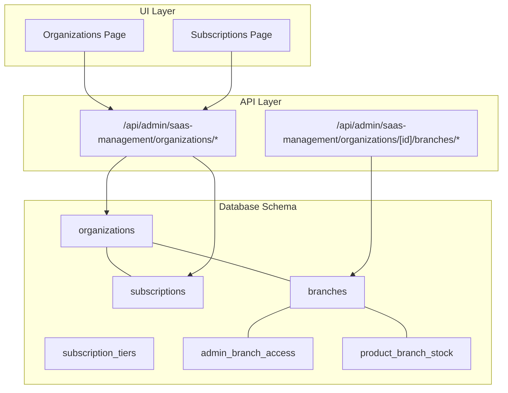
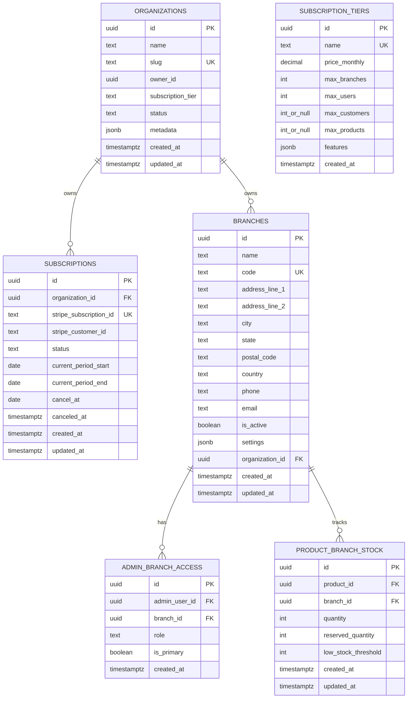
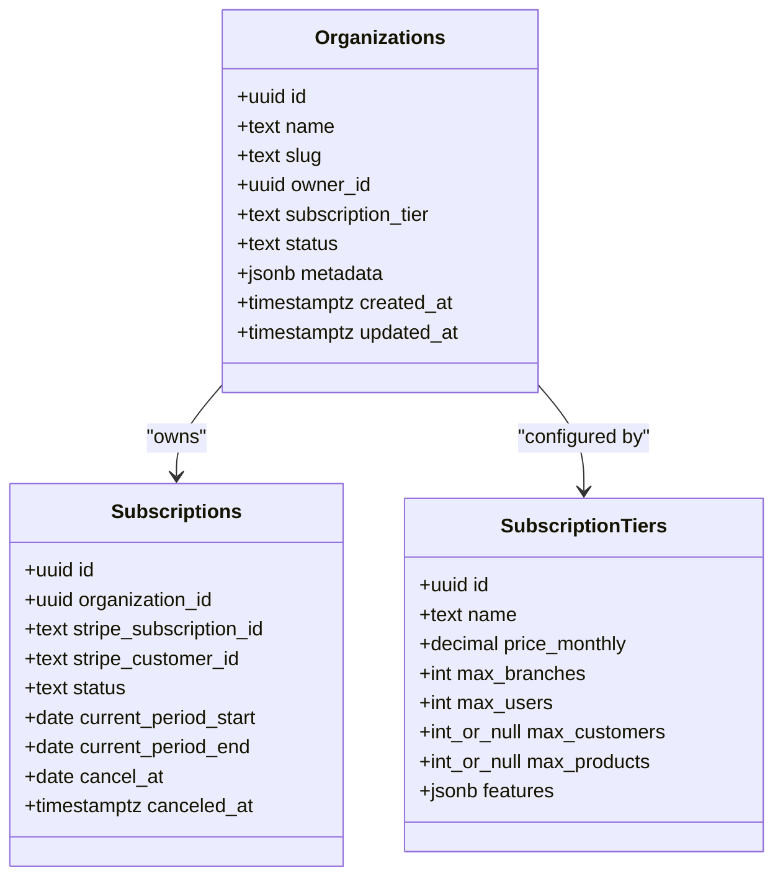
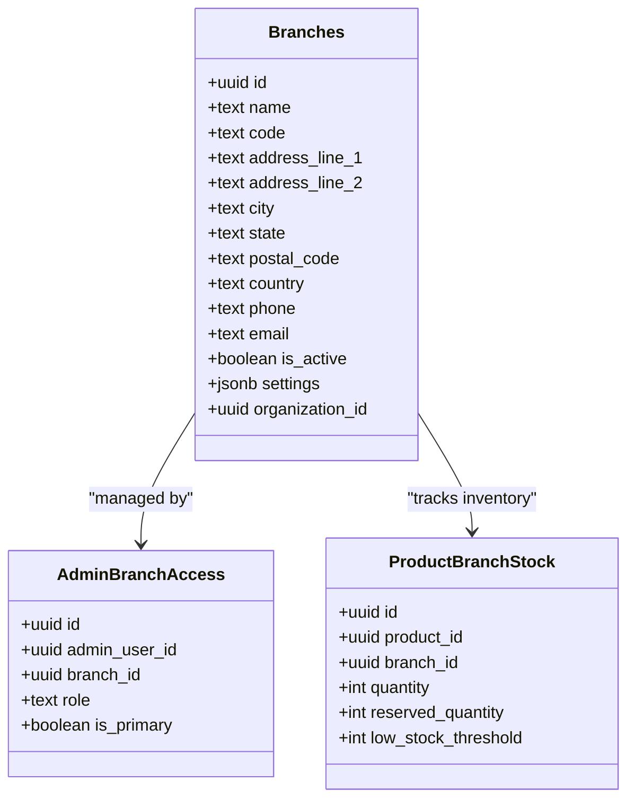
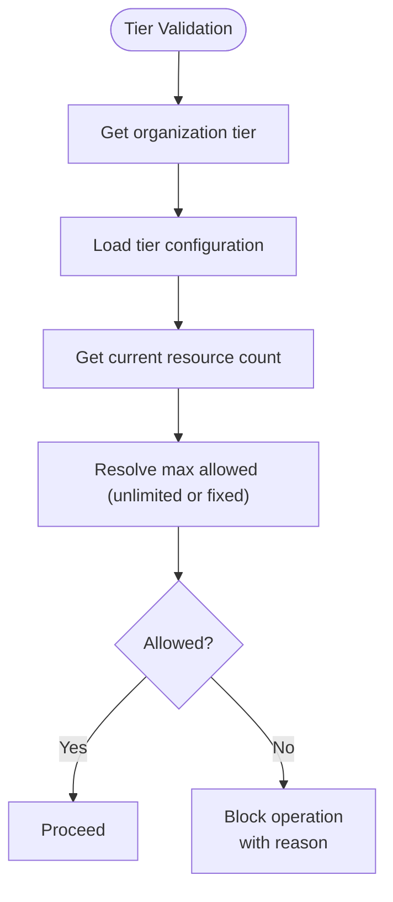
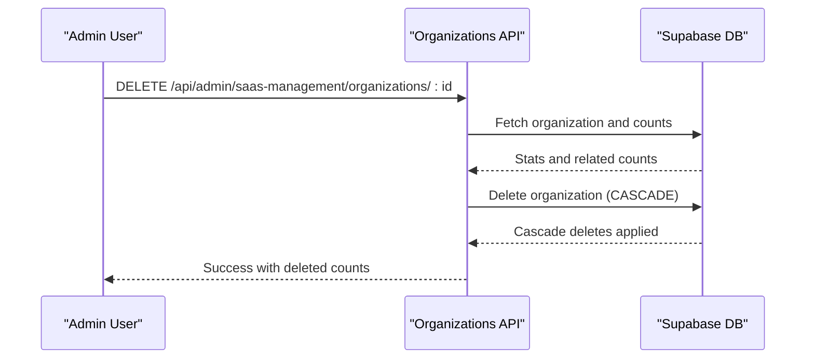
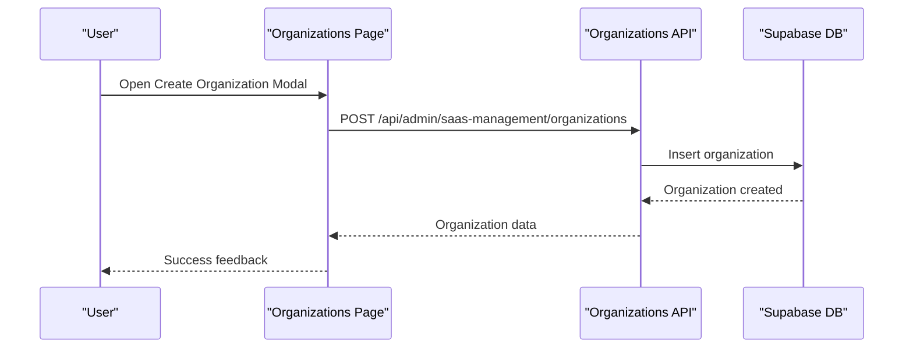
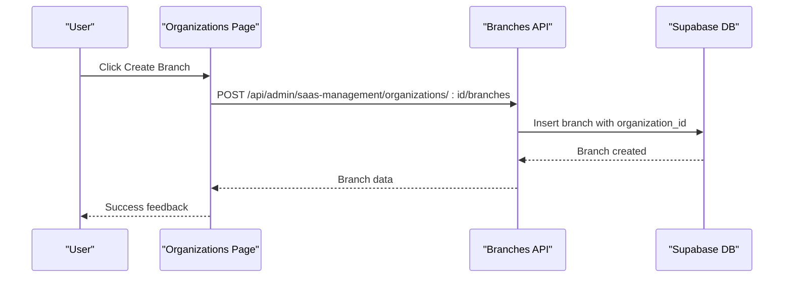
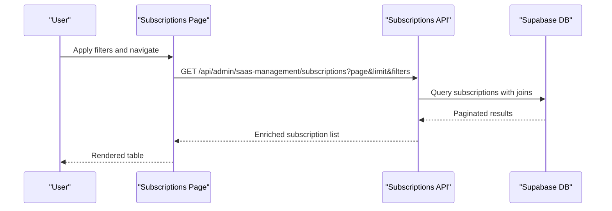
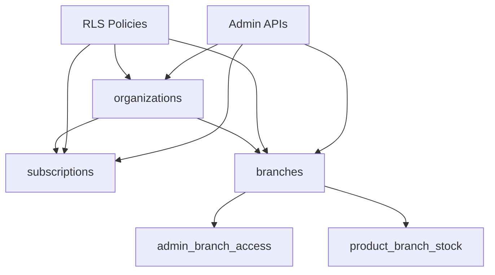

# Organizations & Branches

<cite>
**Referenced Files in This Document**
- [20260128000000_create_organizations_and_subscriptions.sql](file://supabase/migrations/20260128000000_create_organizations_and_subscriptions.sql)
- [20251216000000_create_branches_system.sql](file://supabase/migrations/20251216000000_create_branches_system.sql)
- [20260128000001_extend_rls_for_multitenancy.sql](file://supabase/migrations/20260128000001_extend_rls_for_multitenancy.sql)
- [20260122000005_create_organization_settings.sql](file://supabase/migrations/20260122000005_create_organization_settings.sql)
- [organizations route.ts](file://src/app/api/admin/saas-management/organizations/route.ts)
- [organization [id] route.ts](file://src/app/api/admin/saas-management/organizations/[id]/route.ts)
- [organization [id]/branches route.ts](file://src/app/api/admin/saas-management/organizations/[id]/branches/route.ts)
- [organizations page.tsx](file://src/app/admin/saas-management/organizations/page.tsx)
- [subscriptions page.tsx](file://src/app/admin/saas-management/subscriptions/page.tsx)
- [tier-config.ts](file://src/lib/saas/tier-config.ts)
- [tier-validator.ts](file://src/lib/saas/tier-validator.ts)
- [database.ts](file://src/types/database.ts)
</cite>

## Table of Contents

1. [Introduction](#introduction)
2. [Project Structure](#project-structure)
3. [Core Components](#core-components)
4. [Architecture Overview](#architecture-overview)
5. [Detailed Component Analysis](#detailed-component-analysis)
6. [Dependency Analysis](#dependency-analysis)
7. [Performance Considerations](#performance-considerations)
8. [Troubleshooting Guide](#troubleshooting-guide)
9. [Conclusion](#conclusion)

## Introduction

This document provides comprehensive data model documentation for the Organizations and Branches entities that form the foundation of the multi-tenant architecture. It covers the organizations table structure (UUID primary keys, unique slugs for URL routing, subscription tier management, and status tracking), the branches table (physical location data, organizational hierarchy, and geographic information), and the organization-branch relationship with foreign key constraints and cascading deletes. It also documents subscription tier definitions, pricing models, feature limitations, Row Level Security (RLS) policies for tenant isolation and access control, indexing strategies for slug lookups and organization queries, and practical workflows for organization creation, branch management, and subscription handling.

## Project Structure

The multi-tenant architecture is implemented through a combination of database migrations, backend API routes, and frontend management pages:

- Database migrations define the schema, constraints, indexes, triggers, and RLS policies for organizations, subscriptions, subscription tiers, branches, and related tables.
- Backend API routes expose administrative endpoints for managing organizations and their branches, enforcing root/dev access controls.
- Frontend pages provide user interfaces for viewing, filtering, and performing bulk actions on organizations and subscriptions.

**Diagram sources**

- [20260128000000_create_organizations_and_subscriptions.sql](file://supabase/migrations/20260128000000_create_organizations_and_subscriptions.sql#L6-L48)
- [20251216000000_create_branches_system.sql](file://supabase/migrations/20251216000000_create_branches_system.sql#L5-L46)
- [organizations route.ts](file://src/app/api/admin/saas-management/organizations/route.ts#L12-L128)
- [organization [id]/branches route.ts](file://src/app/api/admin/saas-management/organizations/[id]/branches/route.ts#L67-L175)
- [organizations page.tsx](file://src/app/admin/saas-management/organizations/page.tsx#L91-L800)
- [subscriptions page.tsx](file://src/app/admin/saas-management/subscriptions/page.tsx#L91-L766)

**Section sources**

- [20260128000000_create_organizations_and_subscriptions.sql](file://supabase/migrations/20260128000000_create_organizations_and_subscriptions.sql#L1-L287)
- [20251216000000_create_branches_system.sql](file://supabase/migrations/20251216000000_create_branches_system.sql#L1-L397)
- [organizations route.ts](file://src/app/api/admin/saas-management/organizations/route.ts#L1-L293)
- [organization [id]/branches route.ts](file://src/app/api/admin/saas-management/organizations/[id]/branches/route.ts#L1-L175)
- [organizations page.tsx](file://src/app/admin/saas-management/organizations/page.tsx#L1-L800)
- [subscriptions page.tsx](file://src/app/admin/saas-management/subscriptions/page.tsx#L1-L766)

## Core Components

This section details the core data structures and their relationships, focusing on the organizations and branches entities and their supporting tables.

- Organizations table
  - Purpose: Stores multi-tenant organizations (opticians) using the platform.
  - Primary key: id (UUID, generated automatically).
  - Unique identifiers: slug (URL-friendly, unique).
  - Ownership and hierarchy: owner_id references auth.users; organization_id column added to branches and admin_users for multi-tenancy.
  - Subscription management: subscription_tier defaults to 'basic'; status defaults to 'active'.
  - Metadata: metadata stored as JSONB for extensibility.
  - Timestamps: created_at and updated_at with automatic updates via triggers.
  - Indexes: slug, owner_id, status, subscription_tier for efficient lookups and filtering.
  - RLS: Policies enable tenant isolation and administrative access.

- Subscriptions table
  - Purpose: Tracks Stripe subscriptions linked to organizations.
  - Foreign key: organization_id references organizations(id) with ON DELETE CASCADE.
  - Fields: stripe_subscription_id (unique), stripe_customer_id, status, billing periods, cancellation timestamps.
  - Indexes: organization_id, stripe_subscription_id (where not null), stripe_customer_id (where not null), status.
  - RLS: Policies enforce visibility and management by authorized users.

- Subscription tiers table
  - Purpose: Defines pricing tiers and feature limits.
  - Fields: name (basic, pro, premium), price_monthly, max_branches, max_users, max_customers (nullable/unlimited), max_products (nullable/unlimited), features (JSONB).
  - Initial seeding inserts three tiers with distinct limits and feature sets.
  - RLS: Authenticated users can view; only super admins can manage tiers.

- Branches table
  - Purpose: Represents physical locations within organizations.
  - Primary key: id (UUID).
  - Location data: address_line_1, address_line_2, city, state, postal_code, country, phone, email.
  - Organization association: organization_id added via migration; foreign key with ON DELETE CASCADE.
  - Access control: admin_branch_access links users to branches with role and primary branch flags.
  - Stock tracking: product_branch_stock associates products with branches and tracks quantities.
  - Indexes: code, is_active, and cross-references for performance.
  - RLS: Policies restrict access to users within the same organization or super admins.

- Organization settings table
  - Purpose: Configures minimum deposit requirements per organization for Cash-First logic.
  - Fields: organization_id (unique), min_deposit_percent, min_deposit_amount.
  - Function: get_min_deposit calculates the required deposit based on organization settings.

**Section sources**

- [20260128000000_create_organizations_and_subscriptions.sql](file://supabase/migrations/20260128000000_create_organizations_and_subscriptions.sql#L6-L48)
- [20260128000000_create_organizations_and_subscriptions.sql](file://supabase/migrations/20260128000000_create_organizations_and_subscriptions.sql#L18-L31)
- [20260128000000_create_organizations_and_subscriptions.sql](file://supabase/migrations/20260128000000_create_organizations_and_subscriptions.sql#L33-L44)
- [20251216000000_create_branches_system.sql](file://supabase/migrations/20251216000000_create_branches_system.sql#L5-L46)
- [20260122000005_create_organization_settings.sql](file://supabase/migrations/20260122000005_create_organization_settings.sql#L5-L13)
- [20260122000005_create_organization_settings.sql](file://supabase/migrations/20260122000005_create_organization_settings.sql#L24-L57)

## Architecture Overview

The multi-tenant architecture centers on isolating data by organization using UUID primary keys, URL-friendly slugs, and Row Level Security policies. Organizations own subscriptions and branches, which cascade deletions to related entities. Administrative access is controlled through root/dev roles, while regular users are restricted to their organization’s data.

**Diagram sources**

- [20260128000000_create_organizations_and_subscriptions.sql](file://supabase/migrations/20260128000000_create_organizations_and_subscriptions.sql#L6-L48)
- [20251216000000_create_branches_system.sql](file://supabase/migrations/20251216000000_create_branches_system.sql#L5-L46)

**Section sources**

- [20260128000000_create_organizations_and_subscriptions.sql](file://supabase/migrations/20260128000000_create_organizations_and_subscriptions.sql#L54-L73)
- [20251216000000_create_branches_system.sql](file://supabase/migrations/20251216000000_create_branches_system.sql#L82-L96)

## Detailed Component Analysis

### Organizations Data Model

- Structure and constraints
  - UUID primary key ensures globally unique identification.
  - Unique slug supports clean URL routing and prevents collisions.
  - Owner reference ties an organization to a user account.
  - Subscription tier and status fields control access and lifecycle.
  - JSONB metadata allows flexible configuration per organization.
  - Triggers update timestamps on modifications.
- Indexing strategy
  - Slug index for fast slug-based lookups.
  - Owner and status indexes for filtering and reporting.
  - Tier index for analytics and tier-based queries.
- RLS policies
  - Users can view their organization or are super admins.
  - Super admins can manage all organizations.
  - Root/dev users gain full administrative access for SaaS management.

**Diagram sources**

- [20260128000000_create_organizations_and_subscriptions.sql](file://supabase/migrations/20260128000000_create_organizations_and_subscriptions.sql#L6-L44)

**Section sources**

- [20260128000000_create_organizations_and_subscriptions.sql](file://supabase/migrations/20260128000000_create_organizations_and_subscriptions.sql#L5-L16)
- [20260128000000_create_organizations_and_subscriptions.sql](file://supabase/migrations/20260128000000_create_organizations_and_subscriptions.sql#L54-L67)
- [20260128000000_create_organizations_and_subscriptions.sql](file://supabase/migrations/20260128000000_create_organizations_and_subscriptions.sql#L88-L132)
- [20260128000000_create_organizations_and_subscriptions.sql](file://supabase/migrations/20260128000000_create_organizations_and_subscriptions.sql#L175-L208)

### Branches Data Model

- Structure and constraints
  - UUID primary key with unique code for branch identification.
  - Geographic and contact fields capture physical location details.
  - Organization association via organization_id with cascading deletes.
  - Access control managed through admin_branch_access with role-based permissions.
  - Stock tracking via product_branch_stock linking products to branches.
- Indexing strategy
  - Branch code and active status indexes improve lookup performance.
  - Cross-references for admin access and product stock.
- RLS policies
  - Admins can view branches; super admins can manage all branches.
  - Policies restrict access to users within the same organization.

**Diagram sources**

- [20251216000000_create_branches_system.sql](file://supabase/migrations/20251216000000_create_branches_system.sql#L5-L46)
- [20251216000000_create_branches_system.sql](file://supabase/migrations/20251216000000_create_branches_system.sql#L24-L33)
- [20251216000000_create_branches_system.sql](file://supabase/migrations/20251216000000_create_branches_system.sql#L35-L46)

**Section sources**

- [20251216000000_create_branches_system.sql](file://supabase/migrations/20251216000000_create_branches_system.sql#L4-L21)
- [20251216000000_create_branches_system.sql](file://supabase/migrations/20251216000000_create_branches_system.sql#L82-L96)
- [20251216000000_create_branches_system.sql](file://supabase/migrations/20251216000000_create_branches_system.sql#L222-L246)

### Subscription Tiers and Pricing

- Tier definitions
  - Three predefined tiers: basic, pro, premium.
  - Each tier defines monthly price, maximum branches/users/customers/products, and feature flags.
  - Unlimited limits represented as null values.
- Feature matrix
  - Features include POS, appointments, quotes, work orders, chat IA, advanced analytics, API access, and custom branding.
- Validation and upgrades
  - Application-side validators compare current counts against tier limits.
  - Upgrade logic determines eligibility based on tier ordering.

**Diagram sources**

- [tier-validator.ts](file://src/lib/saas/tier-validator.ts#L95-L143)
- [tier-config.ts](file://src/lib/saas/tier-config.ts#L52-L90)

**Section sources**

- [20260128000000_create_organizations_and_subscriptions.sql](file://supabase/migrations/20260128000000_create_organizations_and_subscriptions.sql#L210-L275)
- [tier-config.ts](file://src/lib/saas/tier-config.ts#L52-L90)
- [tier-validator.ts](file://src/lib/saas/tier-validator.ts#L95-L143)

### Organization-Branch Relationship and Cascading Deletes

- Foreign key constraints
  - Branches.organization_id references organizations.id with ON DELETE CASCADE.
  - Admin users organization_id references organizations.id with ON DELETE SET NULL.
- Cascading effects
  - Deleting an organization triggers deletion of subscriptions, branches, and all related entities (orders, quotes, lab work orders, appointments, products, customers, payments, etc.).
  - Manual cleanup handles admin users and auth users to preserve data integrity.
- Access control
  - RLS policies ensure users only access data within their organization.

**Diagram sources**

- [organization [id] route.ts](file://src/app/api/admin/saas-management/organizations/[id]/route.ts#L270-L503)
- [20260128000001_extend_rls_for_multitenancy.sql](file://supabase/migrations/20260128000001_extend_rls_for_multitenancy.sql#L28-L58)

**Section sources**

- [organization [id] route.ts](file://src/app/api/admin/saas-management/organizations/[id]/route.ts#L343-L471)
- [20260128000001_extend_rls_for_multitenancy.sql](file://supabase/migrations/20260128000001_extend_rls_for_multitenancy.sql#L24-L58)

### Practical Workflows

#### Organization Creation Workflow

- Endpoint: POST /api/admin/saas-management/organizations
- Steps:
  - Validate authentication (root/dev required).
  - Validate name and slug format; ensure slug uniqueness.
  - Optionally validate owner_id existence.
  - Insert organization with tier and status defaults.
  - Optionally assign organization_id to owner in admin_users.
  - Send welcome email notification.
- UI: Organizations page provides a modal to create organizations with tier selection.

**Diagram sources**

- [organizations page.tsx](file://src/app/admin/saas-management/organizations/page.tsx#L163-L198)
- [organizations route.ts](file://src/app/api/admin/saas-management/organizations/route.ts#L134-L292)

**Section sources**

- [organizations route.ts](file://src/app/api/admin/saas-management/organizations/route.ts#L134-L292)
- [organizations page.tsx](file://src/app/admin/saas-management/organizations/page.tsx#L107-L198)

#### Branch Management Workflow

- Endpoint: POST /api/admin/saas-management/organizations/:id/branches
- Steps:
  - Require root access.
  - Validate branch payload (name required; optional code generation).
  - Insert branch with organization_id set.
  - Return created branch data.
- UI: Organizations page displays branches per organization and supports creation.

**Diagram sources**

- [organization [id]/branches route.ts](file://src/app/api/admin/saas-management/organizations/[id]/branches/route.ts#L67-L175)
- [organizations page.tsx](file://src/app/admin/saas-management/organizations/page.tsx#L600-L725)

**Section sources**

- [organization [id]/branches route.ts](file://src/app/api/admin/saas-management/organizations/[id]/branches/route.ts#L67-L175)
- [organizations page.tsx](file://src/app/admin/saas-management/organizations/page.tsx#L600-L725)

#### Subscription Handling Workflow

- Endpoint: GET /api/admin/saas-management/subscriptions
- Steps:
  - Filter by organization, status, and tier.
  - Paginate results and enrich with organization details.
- UI: Subscriptions page lists subscriptions, supports filtering, and actions like cancel/reactivate/delete.

**Diagram sources**

- [subscriptions page.tsx](file://src/app/admin/saas-management/subscriptions/page.tsx#L142-L179)
- [20260128000000_create_organizations_and_subscriptions.sql](file://supabase/migrations/20260128000000_create_organizations_and_subscriptions.sql#L18-L31)

**Section sources**

- [subscriptions page.tsx](file://src/app/admin/saas-management/subscriptions/page.tsx#L123-L179)
- [20260128000000_create_organizations_and_subscriptions.sql](file://supabase/migrations/20260128000000_create_organizations_and_subscriptions.sql#L18-L31)

## Dependency Analysis

The multi-tenant architecture relies on well-defined dependencies among tables, policies, and API routes:

- Organizations depend on subscriptions and branches; branches depend on admin_branch_access and product_branch_stock.
- RLS policies depend on helper functions (e.g., get_user_organization_id, is_super_admin) and role checks.
- API routes depend on service role clients and enforce root/dev access for administrative operations.

**Diagram sources**

- [20260128000001_extend_rls_for_multitenancy.sql](file://supabase/migrations/20260128000001_extend_rls_for_multitenancy.sql#L5-L20)
- [20251216000000_create_branches_system.sql](file://supabase/migrations/20251216000000_create_branches_system.sql#L99-L114)
- [organizations route.ts](file://src/app/api/admin/saas-management/organizations/route.ts#L1-L12)

**Section sources**

- [20260128000001_extend_rls_for_multitenancy.sql](file://supabase/migrations/20260128000001_extend_rls_for_multitenancy.sql#L5-L20)
- [20251216000000_create_branches_system.sql](file://supabase/migrations/20251216000000_create_branches_system.sql#L99-L114)
- [organizations route.ts](file://src/app/api/admin/saas-management/organizations/route.ts#L1-L12)

## Performance Considerations

- Indexes
  - Organizations: slug, owner_id, status, subscription_tier.
  - Subscriptions: organization_id, stripe_subscription_id (where not null), stripe_customer_id (where not null), status.
  - Branches: organization_id (where not null).
  - Admin users: organization_id (where not null).
  - Branches-related: admin_branch_access (admin_user_id, branch_id), product_branch_stock (product_id, branch_id), and appointment/quote/lab/work order/order/product/customer indices.
- Triggers
  - Automatic updated_at updates reduce application overhead.
- Queries
  - Use paginated queries with appropriate filters to avoid scanning entire datasets.
  - Prefer slug-based lookups for URL routing and organization retrieval.

[No sources needed since this section provides general guidance]

## Troubleshooting Guide

- Authentication and authorization
  - Root/dev access is required for administrative endpoints; ensure proper role assignment.
  - RLS policies restrict visibility; verify user belongs to the correct organization or has elevated roles.
- Slug conflicts
  - Creating organizations requires a unique slug; validate format and uniqueness before insertion.
- Cascading deletes
  - Deleting an organization removes all related data; confirm impact before proceeding.
- Subscription states
  - Use the subscriptions page to monitor statuses and take corrective actions (cancel/reactivate/delete).

**Section sources**

- [organizations route.ts](file://src/app/api/admin/saas-management/organizations/route.ts#L121-L142)
- [organization [id] route.ts](file://src/app/api/admin/saas-management/organizations/[id]/route.ts#L270-L304)
- [subscriptions page.tsx](file://src/app/admin/saas-management/subscriptions/page.tsx#L181-L208)

## Conclusion

The Organizations and Branches entities establish a robust multi-tenant foundation with clear data isolation, scalable indexing, and comprehensive RLS policies. The schema supports tiered subscriptions, branch-level access control, and cascading data management, while the API and UI layers provide practical tools for administration. Adhering to the documented workflows and constraints ensures reliable tenant isolation and predictable performance.
