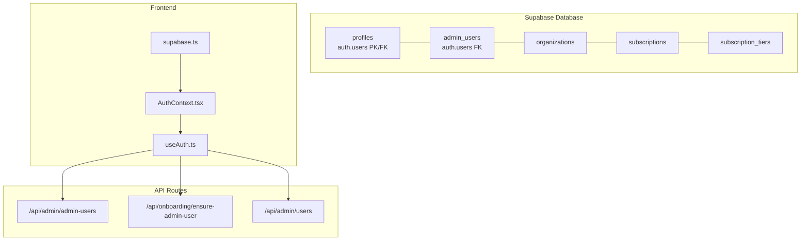
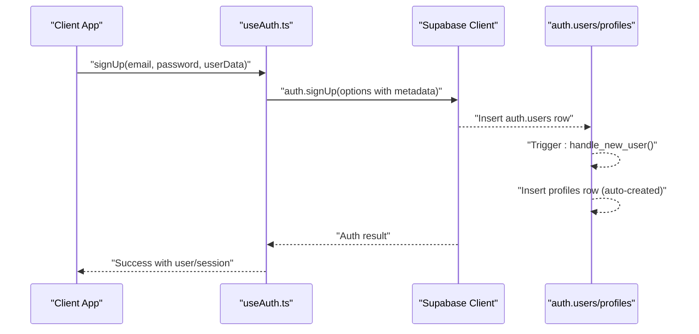
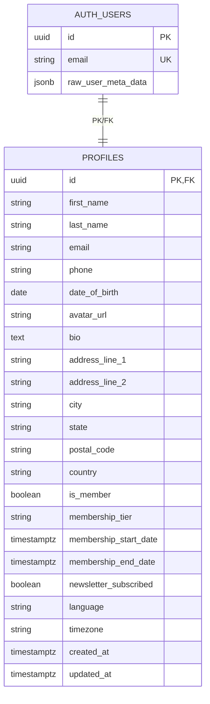
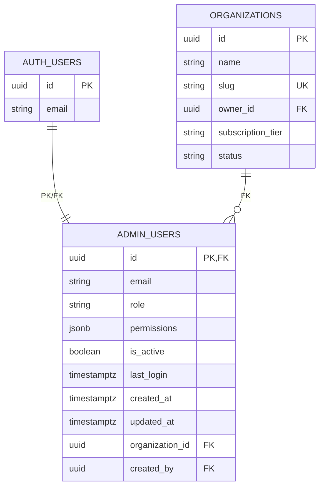
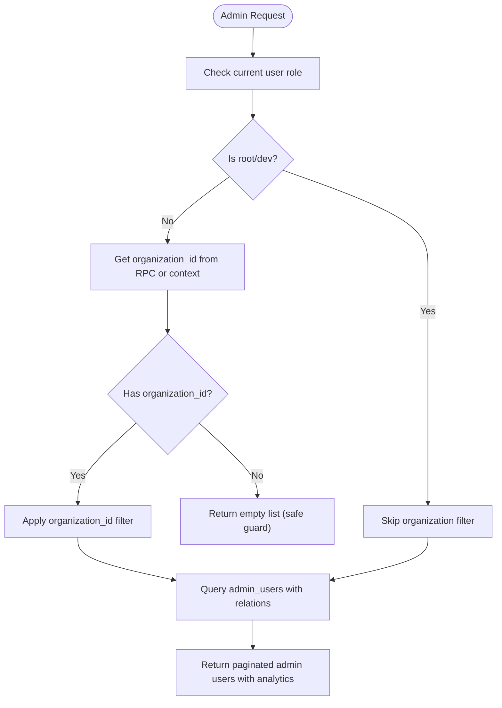
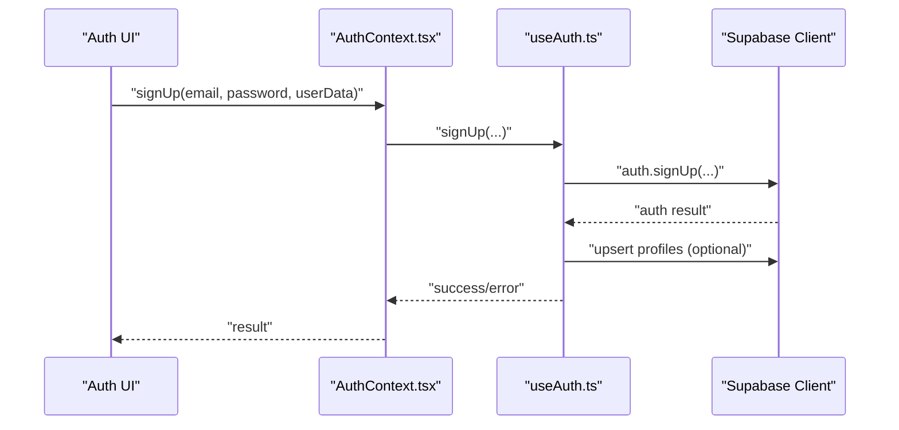
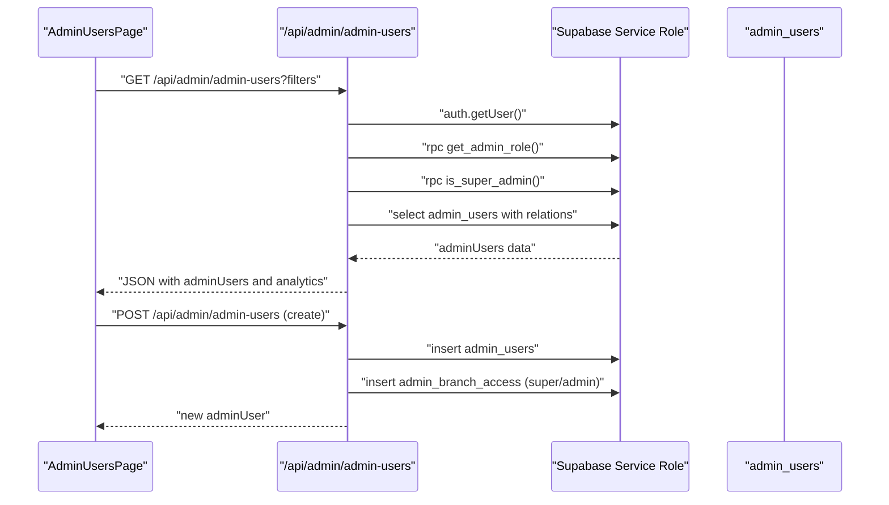
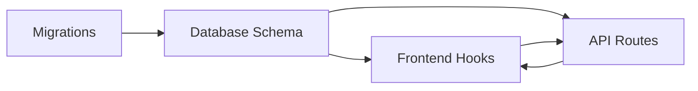

# Users & Admin Users

<cite>
**Referenced Files in This Document**
- [create_user_profiles.sql](file://supabase/migrations/20241220000000_create_user_profiles.sql)
- [setup_admin_users.sql](file://supabase/migrations/20250116000000_setup_admin_users.sql)
- [create_organizations_and_subscriptions.sql](file://supabase/migrations/20260128000000_create_organizations_and_subscriptions.sql)
- [supabase.ts](file://src/lib/supabase.ts)
- [AuthContext.tsx](file://src/contexts/AuthContext.tsx)
- [useAuth.ts](file://src/hooks/useAuth.ts)
- [admin-users page.tsx](file://src/app/admin/admin-users/page.tsx)
- [admin-user detail page.tsx](file://src/app/admin/admin-users/[id]/page.tsx)
- [admin-users API route.ts](file://src/app/api/admin/admin-users/route.ts)
- [ensure-admin-user API route.ts](file://src/app/api/onboarding/ensure-admin-user/route.ts)
- [admin users API route.ts](file://src/app/api/admin/users/route.ts)
- [useBranch.ts](file://src/hooks/useBranch.ts)
- [database types.ts](file://src/types/database.ts)
</cite>

## Table of Contents

1. [Introduction](#introduction)
2. [Project Structure](#project-structure)
3. [Core Components](#core-components)
4. [Architecture Overview](#architecture-overview)
5. [Detailed Component Analysis](#detailed-component-analysis)
6. [Dependency Analysis](#dependency-analysis)
7. [Performance Considerations](#performance-considerations)
8. [Troubleshooting Guide](#troubleshooting-guide)
9. [Conclusion](#conclusion)

## Introduction

This document provides comprehensive data model documentation for users and admin users within the authentication and authorization system. It covers:

- The user profiles table extending Supabase auth.users
- The admin users table with roles, permissions, organization associations, and access controls
- The relationship between auth.users and admin_users tables via foreign keys
- Role-based access control (RBAC) with simplified roles: admin, employee, and special root/dev roles
- User registration flows, password management, and session handling
- Multi-tenant user access with organization-scoped permissions
- Examples of user creation, role assignment, and permission checking
- Security considerations for user data protection and access control enforcement

## Project Structure

The authentication and authorization system spans Supabase database migrations, Next.js frontend hooks and pages, and API routes:

- Supabase migrations define the data models, triggers, RLS policies, and stored functions
- Frontend uses Supabase client for authentication and session management
- API routes enforce RBAC and multi-tenancy checks before accessing admin data

**Diagram sources**

- [create_user_profiles.sql](file://supabase/migrations/20241220000000_create_user_profiles.sql#L5-L33)
- [setup_admin_users.sql](file://supabase/migrations/20250116000000_setup_admin_users.sql#L5-L15)
- [create_organizations_and_subscriptions.sql](file://supabase/migrations/20260128000000_create_organizations_and_subscriptions.sql#L6-L52)
- [supabase.ts](file://src/lib/supabase.ts#L1-L36)
- [AuthContext.tsx](file://src/contexts/AuthContext.tsx#L1-L71)
- [useAuth.ts](file://src/hooks/useAuth.ts#L1-L377)
- [admin-users API route.ts](file://src/app/api/admin/admin-users/route.ts#L13-L237)
- [ensure-admin-user API route.ts](file://src/app/api/onboarding/ensure-admin-user/route.ts#L13-L111)
- [admin users API route.ts](file://src/app/api/admin/users/route.ts#L5-L52)

**Section sources**

- [create_user_profiles.sql](file://supabase/migrations/20241220000000_create_user_profiles.sql#L1-L82)
- [setup_admin_users.sql](file://supabase/migrations/20250116000000_setup_admin_users.sql#L1-L280)
- [create_organizations_and_subscriptions.sql](file://supabase/migrations/20260128000000_create_organizations_and_subscriptions.sql#L1-L287)
- [supabase.ts](file://src/lib/supabase.ts#L1-L36)
- [AuthContext.tsx](file://src/contexts/AuthContext.tsx#L1-L71)
- [useAuth.ts](file://src/hooks/useAuth.ts#L1-L377)
- [admin-users API route.ts](file://src/app/api/admin/admin-users/route.ts#L13-L237)
- [ensure-admin-user API route.ts](file://src/app/api/onboarding/ensure-admin-user/route.ts#L13-L111)
- [admin users API route.ts](file://src/app/api/admin/users/route.ts#L5-L52)

## Core Components

- Profiles table (extends auth.users):
  - Primary key is auth.users.id with ON DELETE CASCADE
  - Stores personal information, preferences, and membership status
  - RLS policy allows users to view/update only their own profile
  - Trigger updates updated_at on row changes
  - Automatic profile creation on new user signup via trigger

- Admin users table:
  - Primary key is auth.users.id with ON DELETE CASCADE
  - Role field constrained to simplified roles: admin, employee, plus root/dev
  - Permissions stored as JSONB for granular access control
  - Organization association for multi-tenancy
  - RLS policies restrict visibility and management to authorized users
  - Stored functions for admin checks and activity logging

- Organizations and subscriptions:
  - Organizations table with tenant-level metadata and status
  - Subscriptions linked to organizations via Stripe identifiers
  - RLS policies scoped to organization boundaries
  - Indexes to optimize multi-tenant queries

- Authentication and session management:
  - Supabase client configured with auto-refresh and persisted sessions
  - AuthContext and useAuth hook orchestrate sign-up, sign-in, profile updates, and password reset
  - Frontend handles profile loading with timeouts and graceful error handling

**Section sources**

- [create_user_profiles.sql](file://supabase/migrations/20241220000000_create_user_profiles.sql#L5-L82)
- [setup_admin_users.sql](file://supabase/migrations/20250116000000_setup_admin_users.sql#L5-L112)
- [create_organizations_and_subscriptions.sql](file://supabase/migrations/20260128000000_create_organizations_and_subscriptions.sql#L6-L92)
- [supabase.ts](file://src/lib/supabase.ts#L11-L17)
- [AuthContext.tsx](file://src/contexts/AuthContext.tsx#L9-L20)
- [useAuth.ts](file://src/hooks/useAuth.ts#L18-L377)

## Architecture Overview

The system enforces authentication-first access control with layered authorizations:

- Supabase auth.users manages identities and sessions
- Profiles table mirrors identity with user-facing attributes
- Admin users table adds administrative roles and permissions
- Organizations isolate tenants; admin users link to organizations
- API routes validate roles and organization boundaries before serving data
- Frontend components rely on hooks and context for consistent auth state

**Diagram sources**

- [useAuth.ts](file://src/hooks/useAuth.ts#L194-L265)
- [create_user_profiles.sql](file://supabase/migrations/20241220000000_create_user_profiles.sql#L64-L82)

**Section sources**

- [useAuth.ts](file://src/hooks/useAuth.ts#L194-L265)
- [create_user_profiles.sql](file://supabase/migrations/20241220000000_create_user_profiles.sql#L64-L82)

## Detailed Component Analysis

### Profiles Data Model

The profiles table extends auth.users and centralizes user profile data:

- Identity: id references auth.users(id) with cascade delete
- Personal info: first_name, last_name, email, phone, date_of_birth
- Address fields tailored for Argentina
- Membership fields for a transformation program
- Preferences: newsletter subscription, language, timezone
- Audit fields: created_at, updated_at with trigger-driven updates
- RLS: users can view/update only their own profile; insert allowed via trigger

**Diagram sources**

- [create_user_profiles.sql](file://supabase/migrations/20241220000000_create_user_profiles.sql#L5-L33)
- [database types.ts](file://src/types/database.ts#L11-L89)

**Section sources**

- [create_user_profiles.sql](file://supabase/migrations/20241220000000_create_user_profiles.sql#L5-L82)
- [database types.ts](file://src/types/database.ts#L11-L89)

### Admin Users Data Model and RBAC

Admin users table defines administrative access:

- Identity: id references auth.users(id) with cascade delete
- Role: constrained to simplified roles (admin, employee, plus root/dev)
- Permissions: JSONB with resource-action pairs
- Organization association: optional organization_id for multi-tenancy
- RLS policies:
  - View admin users: active admin users can see others
  - Manage admin users: super admins can perform all operations
  - Activity log: admin users can view and insert logs
- Stored functions:
  - is_admin: checks if a user has active admin status
  - get_admin_role: retrieves current admin role
  - log_admin_activity: records administrative actions

**Diagram sources**

- [setup_admin_users.sql](file://supabase/migrations/20250116000000_setup_admin_users.sql#L5-L15)
- [create_organizations_and_subscriptions.sql](file://supabase/migrations/20260128000000_create_organizations_and_subscriptions.sql#L6-L52)

**Section sources**

- [setup_admin_users.sql](file://supabase/migrations/20250116000000_setup_admin_users.sql#L5-L112)
- [create_organizations_and_subscriptions.sql](file://supabase/migrations/20260128000000_create_organizations_and_subscriptions.sql#L6-L92)

### Multi-Tenant Architecture and Organization Scoping

Organizations enable SaaS-style multi-tenancy:

- Organizations table stores tenant metadata and status
- Subscriptions link organizations to Stripe identifiers
- RLS policies restrict access to organization boundaries
- Admin users can be scoped to organizations for isolation
- API routes enforce organization filters for non-root users

**Diagram sources**

- [admin-users API route.ts](file://src/app/api/admin/admin-users/route.ts#L111-L129)
- [admin-users API route.ts](file://src/app/api/admin/admin-users/route.ts#L145-L147)

**Section sources**

- [create_organizations_and_subscriptions.sql](file://supabase/migrations/20260128000000_create_organizations_and_subscriptions.sql#L88-L208)
- [admin-users API route.ts](file://src/app/api/admin/admin-users/route.ts#L111-L129)

### Authentication and Session Handling

Frontend authentication integrates with Supabase:

- Supabase client configured with auto-refresh and persisted sessions
- AuthContext exposes sign-up, sign-in, sign-out, profile update, and password reset
- useAuth hook manages session lifecycle, profile loading with timeouts, and error handling
- On sign-up, profile is created via database trigger; frontend upserts additional fields if needed

**Diagram sources**

- [AuthContext.tsx](file://src/contexts/AuthContext.tsx#L10-L19)
- [useAuth.ts](file://src/hooks/useAuth.ts#L194-L265)
- [supabase.ts](file://src/lib/supabase.ts#L11-L17)

**Section sources**

- [supabase.ts](file://src/lib/supabase.ts#L11-L17)
- [AuthContext.tsx](file://src/contexts/AuthContext.tsx#L9-L20)
- [useAuth.ts](file://src/hooks/useAuth.ts#L18-L377)

### Admin Management UI and API

Admin management page and API route coordinate:

- Listing admin users with filters, pagination, and analytics
- Creating admin users with role and branch access assignments
- Enforcing role-based access and organization scoping
- Ensuring onboarding users receive admin access

**Diagram sources**

- [admin-users page.tsx](file://src/app/admin/admin-users/page.tsx#L150-L181)
- [admin-users API route.ts](file://src/app/api/admin/admin-users/route.ts#L13-L237)

**Section sources**

- [admin-users page.tsx](file://src/app/admin/admin-users/page.tsx#L88-L181)
- [admin-users API route.ts](file://src/app/api/admin/admin-users/route.ts#L13-L237)
- [ensure-admin-user API route.ts](file://src/app/api/onboarding/ensure-admin-user/route.ts#L13-L111)

### Role-Based Access Control (RBAC) Examples

- Simplified roles enforced in API:
  - admin: full CRUD on orders, products, customers; read analytics; limited settings; read admin_users; support and bulk operations
  - employee: operational access without administrative privileges
  - root/dev: equivalent to super_admin with expanded permissions
- Super admin creation requires current user to be super admin
- Branch access for non-super admins validated via branch context

Examples (paths only):

- Default permissions lookup: [getDefaultPermissions](file://src/app/api/admin/admin-users/route.ts#L481-L549)
- Role enforcement on create: [role check](file://src/app/api/admin/admin-users/route.ts#L262-L273)
- Super admin creation restriction: [super admin check](file://src/app/api/admin/admin-users/route.ts#L279-L287)

**Section sources**

- [admin-users API route.ts](file://src/app/api/admin/admin-users/route.ts#L262-L287)
- [admin-users API route.ts](file://src/app/api/admin/admin-users/route.ts#L481-L549)

### User Registration, Password Management, and Session Handling

- Registration:
  - Frontend calls auth.signUp with metadata
  - Database trigger creates profiles row automatically
  - Optional frontend upsert ensures consistency
- Password reset:
  - Frontend requests reset; redirect URL configured
- Sessions:
  - Supabase client auto-refreshes tokens and persists sessions
  - useAuth hook listens to auth state changes and loads profile

References:

- [signUp flow](file://src/hooks/useAuth.ts#L207-L251)
- [triggered profile creation](file://supabase/migrations/20241220000000_create_user_profiles.sql#L64-L82)
- [resetPassword](file://src/hooks/useAuth.ts#L338-L364)
- [session config](file://src/lib/supabase.ts#L11-L17)

**Section sources**

- [useAuth.ts](file://src/hooks/useAuth.ts#L207-L251)
- [create_user_profiles.sql](file://supabase/migrations/20241220000000_create_user_profiles.sql#L64-L82)
- [useAuth.ts](file://src/hooks/useAuth.ts#L338-L364)
- [supabase.ts](file://src/lib/supabase.ts#L11-L17)

### Multi-Tenant Access Controls

- Organization-scoped queries:
  - Non-root users are filtered by organization_id
  - Root/dev users can access all organizations
- Admin users can be scoped to organizations for isolation
- API routes compute effective organization_id and enforce filters

References:

- [organization filter logic](file://src/app/api/admin/admin-users/route.ts#L111-L129)
- [organization RLS policies](file://supabase/migrations/20260128000000_create_organizations_and_subscriptions.sql#L93-L132)

**Section sources**

- [admin-users API route.ts](file://src/app/api/admin/admin-users/route.ts#L111-L129)
- [create_organizations_and_subscriptions.sql](file://supabase/migrations/20260128000000_create_organizations_and_subscriptions.sql#L93-L132)

## Dependency Analysis

The system exhibits clear separation of concerns:

- Supabase migrations define schema, RLS, and functions
- Frontend hooks depend on Supabase client for auth operations
- API routes depend on Supabase service role for privileged operations
- Admin UI depends on API routes for listing and managing admin users

**Diagram sources**

- [create_user_profiles.sql](file://supabase/migrations/20241220000000_create_user_profiles.sql#L5-L82)
- [setup_admin_users.sql](file://supabase/migrations/20250116000000_setup_admin_users.sql#L5-L112)
- [create_organizations_and_subscriptions.sql](file://supabase/migrations/20260128000000_create_organizations_and_subscriptions.sql#L6-L92)
- [useAuth.ts](file://src/hooks/useAuth.ts#L1-L377)
- [admin-users API route.ts](file://src/app/api/admin/admin-users/route.ts#L1-L237)

**Section sources**

- [useAuth.ts](file://src/hooks/useAuth.ts#L1-L377)
- [admin-users API route.ts](file://src/app/api/admin/admin-users/route.ts#L1-L237)

## Performance Considerations

- Triggers and RLS policies add overhead; ensure appropriate indexing on frequently filtered columns (e.g., organization_id, role, is_active)
- Use service role for heavy admin queries to bypass RLS checks when necessary
- Paginate admin user lists and limit returned fields to reduce payload sizes
- Consider caching profile and admin user metadata on the frontend for reduced round trips

## Troubleshooting Guide

Common issues and resolutions:

- Profile not found on sign-up:
  - Expected for new users; trigger creates profiles shortly after sign-up
  - Frontend handles PGRST116 and timeout gracefully
- Unauthorized access to admin sections:
  - Verify get_admin_role RPC returns a valid role
  - Ensure user is active in admin_users
- Organization boundary violations:
  - Confirm organization_id is present for non-root users
  - Check RLS policies for admin_users and related tables
- Session persistence issues:
  - Verify autoRefreshToken and persistSession settings
  - Clear browser cookies/localStorage if stale sessions persist

**Section sources**

- [useAuth.ts](file://src/hooks/useAuth.ts#L132-L192)
- [admin-users API route.ts](file://src/app/api/admin/admin-users/route.ts#L230-L236)
- [supabase.ts](file://src/lib/supabase.ts#L11-L17)

## Conclusion

The system establishes a robust authentication and authorization framework:

- Profiles extend auth.users with comprehensive user data and RLS
- Admin users leverage JSONB permissions and organization scoping for fine-grained access control
- Multi-tenant isolation is enforced via organization-bound queries and RLS
- Frontend hooks and API routes consistently enforce RBAC and session management
- The simplified role model (admin, employee, root/dev) streamlines administration while maintaining security
