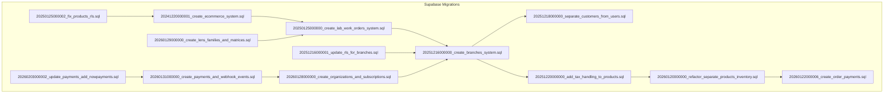
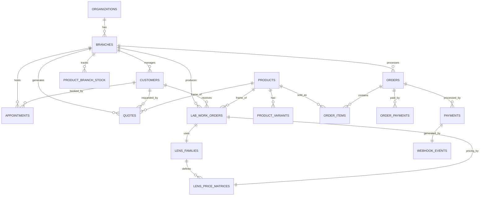
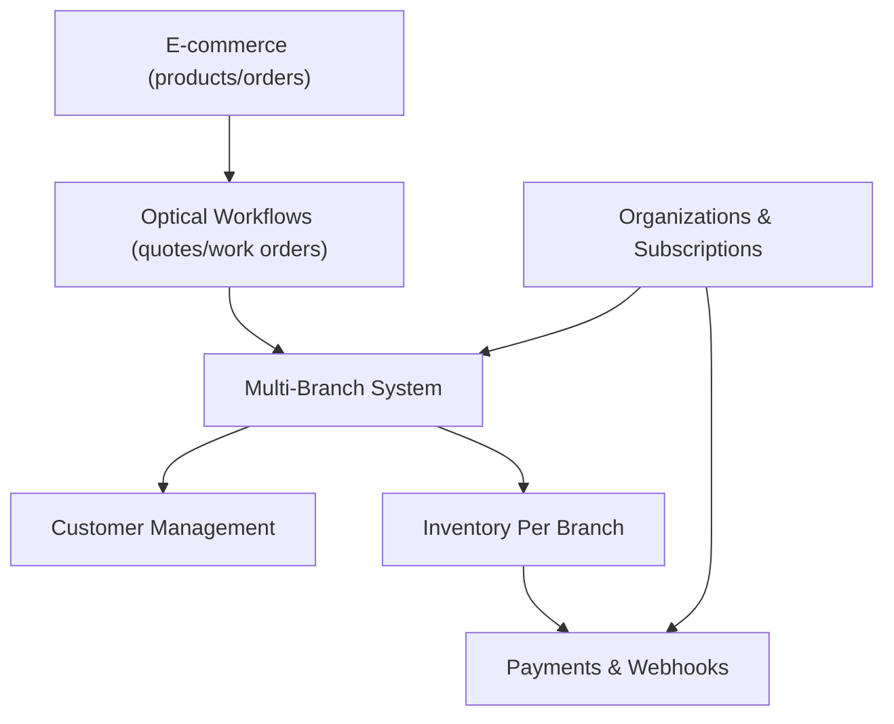

# Database Schema & Data Model

<cite>
**Referenced Files in This Document**
- [20241220000001_create_ecommerce_system.sql](file://supabase/migrations/20241220000001_create_ecommerce_system.sql)
- [20250125000000_create_lab_work_orders_system.sql](file://supabase/migrations/20250125000000_create_lab_work_orders_system.sql)
- [20251216000000_create_branches_system.sql](file://supabase/migrations/20251216000000_create_branches_system.sql)
- [20251218000000_separate_customers_from_users.sql](file://supabase/migrations/20251218000000_separate_customers_from_users.sql)
- [20251220000000_add_tax_handling_to_products.sql](file://supabase/migrations/20251220000000_add_tax_handling_to_products.sql)
- [20260120000000_refactor_separate_products_inventory.sql](file://supabase/migrations/20260120000000_refactor_separate_products_inventory.sql)
- [20260122000006_create_order_payments.sql](file://supabase/migrations/20260122000006_create_order_payments.sql)
- [20260129000000_create_lens_families_and_matrices.sql](file://supabase/migrations/20260129000000_create_lens_families_and_matrices.sql)
- [20260131000000_create_payments_and_webhook_events.sql](file://supabase/migrations/20260131000000_create_payments_and_webhook_events.sql)
- [20260203000002_update_payments_add_nowpayments.sql](file://supabase/migrations/20260203000002_update_payments_add_nowpayments.sql)
- [20251216000001_update_rls_for_branches.sql](file://supabase/migrations/20251216000001_update_rls_for_branches.sql)
- [20250125000002_fix_products_rls.sql](file://supabase/migrations/20250125000002_fix_products_rls.sql)
- [20260128000000_create_organizations_and_subscriptions.sql](file://supabase/migrations/20260128000000_create_organizations_and_subscriptions.sql)
</cite>

## Table of Contents

1. [Introduction](#introduction)
2. [Project Structure](#project-structure)
3. [Core Components](#core-components)
4. [Architecture Overview](#architecture-overview)
5. [Detailed Component Analysis](#detailed-component-analysis)
6. [Dependency Analysis](#dependency-analysis)
7. [Performance Considerations](#performance-considerations)
8. [Troubleshooting Guide](#troubleshooting-guide)
9. [Conclusion](#conclusion)
10. [Appendices](#appendices)

## Introduction

This document presents the complete Opttius database schema and data model for the optical business domain. It covers the multi-tenant, multi-branch architecture and documents the relationships among organizations, branches, customers, appointments, prescriptions, quotes, work orders, products, and orders. It also explains data validation rules, business rules enforcement, referential integrity, Row Level Security (RLS) policies, indexing strategies, and migration paths for schema evolution.

## Project Structure

The database schema is implemented as a series of migrations under the Supabase migrations directory. The migrations are organized chronologically and evolve the system from a simple e-commerce setup to a full optical management platform with multi-tenancy and advanced workflows.

**Diagram sources**

- [20241220000001_create_ecommerce_system.sql](file://supabase/migrations/20241220000001_create_ecommerce_system.sql#L1-L270)
- [20250125000000_create_lab_work_orders_system.sql](file://supabase/migrations/20250125000000_create_lab_work_orders_system.sql#L1-L430)
- [20251216000000_create_branches_system.sql](file://supabase/migrations/20251216000000_create_branches_system.sql#L1-L397)
- [20251218000000_separate_customers_from_users.sql](file://supabase/migrations/20251218000000_separate_customers_from_users.sql#L1-L157)
- [20251220000000_add_tax_handling_to_products.sql](file://supabase/migrations/20251220000000_add_tax_handling_to_products.sql#L1-L39)
- [20260120000000_refactor_separate_products_inventory.sql](file://supabase/migrations/20260120000000_refactor_separate_products_inventory.sql#L1-L225)
- [20260122000006_create_order_payments.sql](file://supabase/migrations/20260122000006_create_order_payments.sql#L1-L58)
- [20260129000000_create_lens_families_and_matrices.sql](file://supabase/migrations/20260129000000_create_lens_families_and_matrices.sql#L1-L222)
- [20260131000000_create_payments_and_webhook_events.sql](file://supabase/migrations/20260131000000_create_payments_and_webhook_events.sql#L1-L150)
- [20260203000002_update_payments_add_nowpayments.sql](file://supabase/migrations/20260203000002_update_payments_add_nowpayments.sql)
- [20251216000001_update_rls_for_branches.sql](file://supabase/migrations/20251216000001_update_rls_for_branches.sql#L1-L370)
- [20250125000002_fix_products_rls.sql](file://supabase/migrations/20250125000002_fix_products_rls.sql#L1-L39)
- [20260128000000_create_organizations_and_subscriptions.sql](file://supabase/migrations/20260128000000_create_organizations_and_subscriptions.sql#L1-L287)

**Section sources**

- [20241220000001_create_ecommerce_system.sql](file://supabase/migrations/20241220000001_create_ecommerce_system.sql#L1-L270)
- [20250125000000_create_lab_work_orders_system.sql](file://supabase/migrations/20250125000000_create_lab_work_orders_system.sql#L1-L430)
- [20251216000000_create_branches_system.sql](file://supabase/migrations/20251216000000_create_branches_system.sql#L1-L397)
- [20251218000000_separate_customers_from_users.sql](file://supabase/migrations/20251218000000_separate_customers_from_users.sql#L1-L157)
- [20251220000000_add_tax_handling_to_products.sql](file://supabase/migrations/20251220000000_add_tax_handling_to_products.sql#L1-L39)
- [20260120000000_refactor_separate_products_inventory.sql](file://supabase/migrations/20260120000000_refactor_separate_products_inventory.sql#L1-L225)
- [20260122000006_create_order_payments.sql](file://supabase/migrations/20260122000006_create_order_payments.sql#L1-L58)
- [20260129000000_create_lens_families_and_matrices.sql](file://supabase/migrations/20260129000000_create_lens_families_and_matrices.sql#L1-L222)
- [20260131000000_create_payments_and_webhook_events.sql](file://supabase/migrations/20260131000000_create_payments_and_webhook_events.sql#L1-L150)
- [20260203000002_update_payments_add_nowpayments.sql](file://supabase/migrations/20260203000002_update_payments_add_nowpayments.sql)
- [20251216000001_update_rls_for_branches.sql](file://supabase/migrations/20251216000001_update_rls_for_branches.sql#L1-L370)
- [20250125000002_fix_products_rls.sql](file://supabase/migrations/20250125000002_fix_products_rls.sql#L1-L39)
- [20260128000000_create_organizations_and_subscriptions.sql](file://supabase/migrations/20260128000000_create_organizations_and_subscriptions.sql#L1-L287)

## Core Components

This section outlines the primary entities and their roles in the optical business data architecture.

- Organizations: Multi-tenant tenants representing optical shops. Each tenant can have multiple branches and users.
- Branches: Physical locations within an organization, each with its own settings, access controls, and inventory.
- Customers: Branch-specific customer records for optometric care, including medical history and contact preferences.
- Appointments: Scheduled visits with branch association and availability checks.
- Prescriptions: Optometric prescriptions linked to customers and used in quotes and work orders.
- Quotes: Preliminary pricing proposals with frame and lens selections, expiration, and conversion to work orders.
- Work Orders: Full production workflow for lenses, including lab communication, status tracking, and financials.
- Products: Catalog items with variants, inventory tracking per branch, and tax handling.
- Orders: Sales orders with payment tracking, fulfillment, and POS integration.
- Payments and Webhook Events: Payment records and idempotent webhook event handling across multiple gateways.
- Lens Families and Price Matrices: Structured pricing engine for lens families and pricing ranges.

**Section sources**

- [20260128000000_create_organizations_and_subscriptions.sql](file://supabase/migrations/20260128000000_create_organizations_and_subscriptions.sql#L6-L31)
- [20251216000000_create_branches_system.sql](file://supabase/migrations/20251216000000_create_branches_system.sql#L5-L21)
- [20251218000000_separate_customers_from_users.sql](file://supabase/migrations/20251218000000_separate_customers_from_users.sql#L7-L59)
- [20250125000000_create_lab_work_orders_system.sql](file://supabase/migrations/20250125000000_create_lab_work_orders_system.sql#L6-L184)
- [20241220000001_create_ecommerce_system.sql](file://supabase/migrations/20241220000001_create_ecommerce_system.sql#L16-L160)
- [20260131000000_create_payments_and_webhook_events.sql](file://supabase/migrations/20260131000000_create_payments_and_webhook_events.sql#L25-L41)
- [20260129000000_create_lens_families_and_matrices.sql](file://supabase/migrations/20260129000000_create_lens_families_and_matrices.sql#L6-L38)

## Architecture Overview

The Opttius database follows a multi-tenant, multi-branch architecture with strict RLS policies to enforce tenant and branch isolation. The schema evolves from a product catalog and orders system to include optical workflows (quotes, work orders), inventory per branch, and payment processing with multiple gateways.

**Diagram sources**

- [20260128000000_create_organizations_and_subscriptions.sql](file://supabase/migrations/20260128000000_create_organizations_and_subscriptions.sql#L6-L31)
- [20251216000000_create_branches_system.sql](file://supabase/migrations/20251216000000_create_branches_system.sql#L5-L21)
- [20251218000000_separate_customers_from_users.sql](file://supabase/migrations/20251218000000_separate_customers_from_users.sql#L7-L59)
- [20250125000000_create_lab_work_orders_system.sql](file://supabase/migrations/20250125000000_create_lab_work_orders_system.sql#L6-L184)
- [20241220000001_create_ecommerce_system.sql](file://supabase/migrations/20241220000001_create_ecommerce_system.sql#L16-L160)
- [20260129000000_create_lens_families_and_matrices.sql](file://supabase/migrations/20260129000000_create_lens_families_and_matrices.sql#L6-L38)
- [20260131000000_create_payments_and_webhook_events.sql](file://supabase/migrations/20260131000000_create_payments_and_webhook_events.sql#L25-L41)
- [20260122000006_create_order_payments.sql](file://supabase/migrations/20260122000006_create_order_payments.sql#L5-L17)

## Detailed Component Analysis

### Organizations and Subscriptions

Organizations represent multi-tenant tenants. Each organization has a subscription tier and status, and branches belong to an organization. Indexes and RLS policies isolate data by organization.

Key fields and constraints:

- id: UUID primary key
- name, slug: tenant identity
- owner_id: optional reference to a user
- subscription_tier: basic/pro/pro/premium
- status: active/suspended/cancelled
- organization_id foreign key on branches and admin_users

RLS policies:

- Users can view their organization
- Super admins can manage organizations
- Subscription tiers are visible to authenticated users

**Section sources**

- [20260128000000_create_organizations_and_subscriptions.sql](file://supabase/migrations/20260128000000_create_organizations_and_subscriptions.sql#L6-L31)
- [20260128000000_create_organizations_and_subscriptions.sql](file://supabase/migrations/20260128000000_create_organizations_and_subscriptions.sql#L93-L132)
- [20260128000000_create_organizations_and_subscriptions.sql](file://supabase/migrations/20260128000000_create_organizations_and_subscriptions.sql#L134-L173)
- [20260128000000_create_organizations_and_subscriptions.sql](file://supabase/migrations/20260128000000_create_organizations_and_subscriptions.sql#L175-L208)

### Branches and Access Control

Branches define physical locations with settings and access control. Admin users can be granted access to specific branches or globally (super admin). Inventory is tracked per branch.

Key fields and constraints:

- id, name, code: unique branch identity
- address, contact, settings: branch metadata
- organization_id: tenant linkage
- admin_branch_access: role-based access (manager/staff/viewer)
- product_branch_stock: per-branch inventory with thresholds

RLS and functions:

- is_super_admin(), get_user_branches(), can_access_branch()
- Policies for viewing/updating branches and stock

**Section sources**

- [20251216000000_create_branches_system.sql](file://supabase/migrations/20251216000000_create_branches_system.sql#L5-L21)
- [20251216000000_create_branches_system.sql](file://supabase/migrations/20251216000000_create_branches_system.sql#L24-L33)
- [20251216000000_create_branches_system.sql](file://supabase/migrations/20251216000000_create_branches_system.sql#L99-L188)
- [20251216000000_create_branches_system.sql](file://supabase/migrations/20251216000000_create_branches_system.sql#L222-L302)

### Customers

Customers are branch-specific records for optometric care. They include personal, medical, and contact preferences. Indexes optimize lookups by email, phone, RUT, and name.

Key fields and constraints:

- branch_id: mandatory foreign key
- personal info: first_name, last_name, email, phone
- identification: rut, date_of_birth, gender
- addresses, medical history, insurance
- is_active, notes, tags
- created_by/updated_by for audit

RLS policies:

- Super admins can view/update/delete all
- Regular admins can manage within accessible branches

**Section sources**

- [20251218000000_separate_customers_from_users.sql](file://supabase/migrations/20251218000000_separate_customers_from_users.sql#L7-L59)
- [20251218000000_separate_customers_from_users.sql](file://supabase/migrations/20251218000000_separate_customers_from_users.sql#L76-L150)

### Appointments

Appointments are scheduled visits with branch association. Availability checks and timezone-aware scheduling are supported. RLS filters by branch access.

Key fields and constraints:

- branch_id: links to branches
- customer/profile references
- scheduling fields, status, timestamps
- RLS policies updated to filter by branch

**Section sources**

- [20251216000001_update_rls_for_branches.sql](file://supabase/migrations/20251216000001_update_rls_for_branches.sql#L11-L60)

### Prescriptions

Prescriptions capture optometric data used by quotes and work orders. They link to customers and can be referenced by quotes and work orders.

**Section sources**

- [20250125000000_create_lab_work_orders_system.sql](file://supabase/migrations/20250125000000_create_lab_work_orders_system.sql#L6-L69)

### Quotes and Work Orders

Quotes are preliminary pricing proposals with frame/lens selections, pricing breakdowns, and expiration. Work orders represent the production workflow with detailed status tracking, lab communication, and financials.

Key fields and constraints:

- Quotes: quote_number, expiration_date, frame/lens specs, pricing, status, customer/prescription references
- Work Orders: work_order_number, status workflow, lab info, pricing, payment status, customer/prescription references
- Status history tracks transitions
- Functions for numbering and status updates

**Section sources**

- [20250125000000_create_lab_work_orders_system.sql](file://supabase/migrations/20250125000000_create_lab_work_orders_system.sql#L6-L184)
- [20250125000000_create_lab_work_orders_system.sql](file://supabase/migrations/20250125000000_create_lab_work_orders_system.sql#L186-L205)
- [20250125000000_create_lab_work_orders_system.sql](file://supabase/migrations/20250125000000_create_lab_work_orders_system.sql#L227-L323)

### Products and Inventory

Products are catalog items with variants and inventory. Inventory is separated per branch with reserved quantities and thresholds. Deprecated columns remain for backward compatibility.

Key fields and constraints:

- Products: name, pricing, inventory flags, variants, categories
- Variants: SKUs, prices, options
- product_branch_stock: quantity, reserved_quantity, thresholds, computed available_quantity
- Functions for stock retrieval and updates

**Section sources**

- [20241220000001_create_ecommerce_system.sql](file://supabase/migrations/20241220000001_create_ecommerce_system.sql#L16-L89)
- [20260120000000_refactor_separate_products_inventory.sql](file://supabase/migrations/20260120000000_refactor_separate_products_inventory.sql#L9-L31)
- [20260120000000_refactor_separate_products_inventory.sql](file://supabase/migrations/20260120000000_refactor_separate_products_inventory.sql#L40-L136)

### Orders and Payments

Orders capture sales transactions with fulfillment and payment statuses. Payments and webhook events handle gateway integrations across Flow, Mercado Pago, and PayPal.

Key fields and constraints:

- Orders: order_number, customer info, totals, statuses, shipping/billing
- Order Items: snapshot of product/variant details
- Order Payments: cash-first tracking with methods and references
- Payments: gateway, amounts, status, references
- Webhook Events: idempotent event handling

**Section sources**

- [20241220000001_create_ecommerce_system.sql](file://supabase/migrations/20241220000001_create_ecommerce_system.sql#L105-L176)
- [20260122000006_create_order_payments.sql](file://supabase/migrations/20260122000006_create_order_payments.sql#L5-L17)
- [20260131000000_create_payments_and_webhook_events.sql](file://supabase/migrations/20260131000000_create_payments_and_webhook_events.sql#L25-L41)
- [20260131000000_create_payments_and_webhook_events.sql](file://supabase/migrations/20260131000000_create_payments_and_webhook_events.sql#L111-L122)

### Lens Families and Price Matrices

A structured pricing engine defines lens families and pricing matrices by spherical and cylindrical ranges, supporting sourcing types and active flags.

Key fields and constraints:

- Lens Families: type/material combinations, active flag
- Lens Price Matrices: range constraints, base price, cost, sourcing type
- Function to calculate lens price based on family and parameters

**Section sources**

- [20260129000000_create_lens_families_and_matrices.sql](file://supabase/migrations/20260129000000_create_lens_families_and_matrices.sql#L6-L38)
- [20260129000000_create_lens_families_and_matrices.sql](file://supabase/migrations/20260129000000_create_lens_families_and_matrices.sql#L51-L81)

## Dependency Analysis

The schema exhibits clear dependency chains across migrations, evolving from e-commerce to optical workflows and multi-tenancy.

**Diagram sources**

- [20241220000001_create_ecommerce_system.sql](file://supabase/migrations/20241220000001_create_ecommerce_system.sql#L1-L270)
- [20250125000000_create_lab_work_orders_system.sql](file://supabase/migrations/20250125000000_create_lab_work_orders_system.sql#L1-L430)
- [20251216000000_create_branches_system.sql](file://supabase/migrations/20251216000000_create_branches_system.sql#L1-L397)
- [20251218000000_separate_customers_from_users.sql](file://supabase/migrations/20251218000000_separate_customers_from_users.sql#L1-L157)
- [20260120000000_refactor_separate_products_inventory.sql](file://supabase/migrations/20260120000000_refactor_separate_products_inventory.sql#L1-L225)
- [20260131000000_create_payments_and_webhook_events.sql](file://supabase/migrations/20260131000000_create_payments_and_webhook_events.sql#L1-L150)
- [20260128000000_create_organizations_and_subscriptions.sql](file://supabase/migrations/20260128000000_create_organizations_and_subscriptions.sql#L1-L287)

**Section sources**

- [20251216000001_update_rls_for_branches.sql](file://supabase/migrations/20251216000001_update_rls_for_branches.sql#L1-L370)
- [20250125000002_fix_products_rls.sql](file://supabase/migrations/20250125000002_fix_products_rls.sql#L1-L39)

## Performance Considerations

Indexing and computed columns are used to optimize frequent queries:

- Categories: slug, parent_id, is_active
- Products: slug, category_id, status, is_featured, GIN arrays for keywords and skin types
- Variants: product_id, sku
- Cart: user_id, session_id, product_id
- Orders: user_id, order_number, status, payment_status, mp_payment_id
- Order Items: order_id, product_id
- Branches: code, is_active, admin access indices
- Customers: branch_id, email, phone, RUT, name, is_active
- Product Branch Stock: product_id, branch_id, computed available_quantity, low_stock threshold
- Payments: organization_id, order_id, user_id, status, gateway identifiers
- Webhook Events: gateway/gateway_event_id uniqueness, processed, created_at

Computed columns and triggers:

- product_branch_stock.available_quantity (stored)
- updated_at triggers on most tables

**Section sources**

- [20241220000001_create_ecommerce_system.sql](file://supabase/migrations/20241220000001_create_ecommerce_system.sql#L178-L231)
- [20251216000000_create_branches_system.sql](file://supabase/migrations/20251216000000_create_branches_system.sql#L82-L95)
- [20251218000000_separate_customers_from_users.sql](file://supabase/migrations/20251218000000_separate_customers_from_users.sql#L61-L68)
- [20260120000000_refactor_separate_products_inventory.sql](file://supabase/migrations/20260120000000_refactor_separate_products_inventory.sql#L161-L167)
- [20260131000000_create_payments_and_webhook_events.sql](file://supabase/migrations/20260131000000_create_payments_and_webhook_events.sql#L48-L55)
- [20260131000000_create_payments_and_webhook_events.sql](file://supabase/migrations/20260131000000_create_payments_and_webhook_events.sql#L126-L130)

## Troubleshooting Guide

Common issues and resolutions:

- RLS policy conflicts:
  - Ensure branch-aware policies are applied consistently across entities (appointments, quotes, work orders, orders, schedule settings, quote settings, admin notifications).
  - Use helper functions is_super_admin(), get_user_branches(), can_access_branch() to validate access.

- Inventory discrepancies:
  - Verify product_branch_stock reserved vs. actual quantities.
  - Use get_product_stock() and update_product_stock() functions to reconcile stock movements.

- Payment reconciliation:
  - Confirm order_payments balance calculation aligns with order totals.
  - Check webhook_events uniqueness and processed flags for idempotency.

- Tax handling:
  - Validate price_includes_tax and system tax_percentage configuration.
  - Recalculate totals when switching tax inclusion modes.

**Section sources**

- [20251216000001_update_rls_for_branches.sql](file://supabase/migrations/20251216000001_update_rls_for_branches.sql#L1-L370)
- [20260120000000_refactor_separate_products_inventory.sql](file://supabase/migrations/20260120000000_refactor_separate_products_inventory.sql#L40-L136)
- [20260122000006_create_order_payments.sql](file://supabase/migrations/20260122000006_create_order_payments.sql#L30-L57)
- [20251220000000_add_tax_handling_to_products.sql](file://supabase/migrations/20251220000000_add_tax_handling_to_products.sql#L1-L39)
- [20260131000000_create_payments_and_webhook_events.sql](file://supabase/migrations/20260131000000_create_payments_and_webhook_events.sql#L110-L150)

## Conclusion

The Opttius database schema provides a robust, scalable foundation for optical businesses with multi-tenancy, multi-branch operations, and integrated optical workflows. Strong RLS policies, computed columns, and targeted indexes ensure data integrity, performance, and tenant isolation. The migration-driven evolution demonstrates clear pathways for adding capabilities such as advanced pricing engines, payment diversification, and enhanced reporting.

## Appendices

### Data Lifecycle Management

- Retention and archival:
  - Orders and payments can be archived by setting statuses and moving historical data to cold storage.
  - Webhook events can be pruned after successful idempotent processing.
- Audit trails:
  - Status histories for work orders and updated_at timestamps provide compliance-ready logs.

[No sources needed since this section provides general guidance]

### Security and Privacy

- Row Level Security:
  - Policies restrict access to organization, branch, and customer boundaries.
  - Super admin privileges are enforced via helper functions.
- Data minimization:
  - Optional fields (email, phone) and soft-deletions via flags reduce sensitive data exposure.
- Gateway compliance:
  - Payment data is stored per gateway with unique identifiers; PII is minimized in stored fields.

**Section sources**

- [20260128000000_create_organizations_and_subscriptions.sql](file://supabase/migrations/20260128000000_create_organizations_and_subscriptions.sql#L93-L208)
- [20251216000000_create_branches_system.sql](file://supabase/migrations/20251216000000_create_branches_system.sql#L222-L302)
- [20260131000000_create_payments_and_webhook_events.sql](file://supabase/migrations/20260131000000_create_payments_and_webhook_events.sql#L132-L150)

### Migration Paths and Version Management

- Incremental evolution:
  - E-commerce → Optical workflows → Multi-branch → Multi-tenancy → Payments and webhooks.
- Backward compatibility:
  - Deprecated columns remain with comments; views bridge legacy access during migration.
- Idempotent operations:
  - Use ON CONFLICT clauses and unique constraints to prevent duplication.

**Section sources**

- [20260120000000_refactor_separate_products_inventory.sql](file://supabase/migrations/20260120000000_refactor_separate_products_inventory.sql#L173-L204)
- [20260128000000_create_organizations_and_subscriptions.sql](file://supabase/migrations/20260128000000_create_organizations_and_subscriptions.sql#L210-L274)
