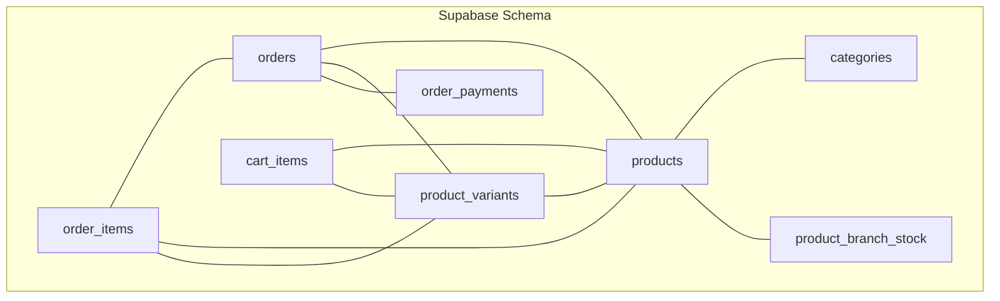
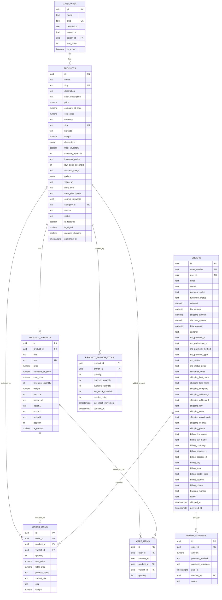
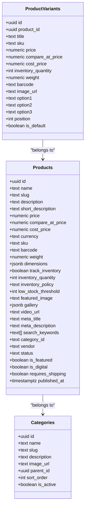
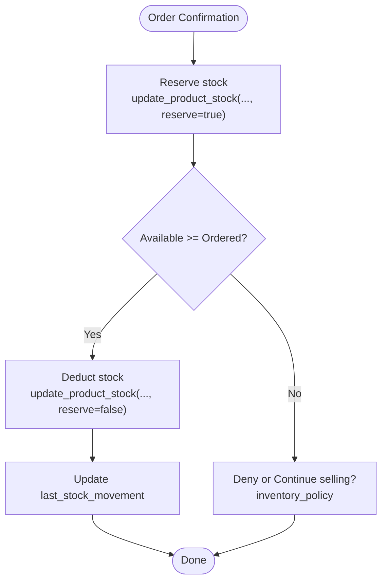
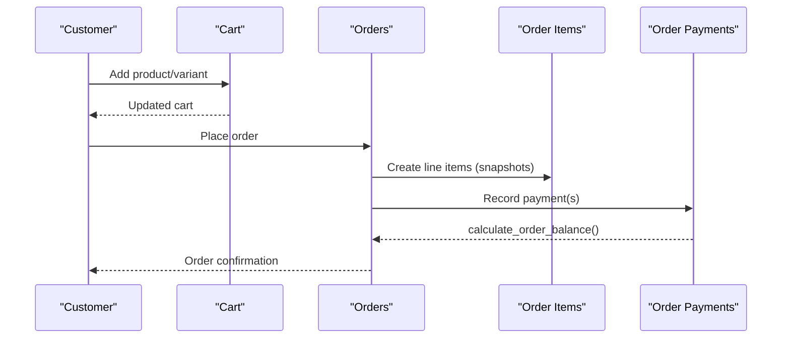
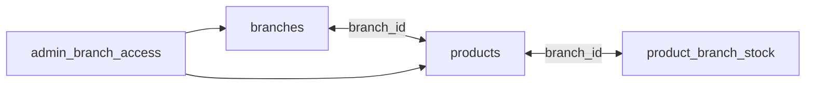
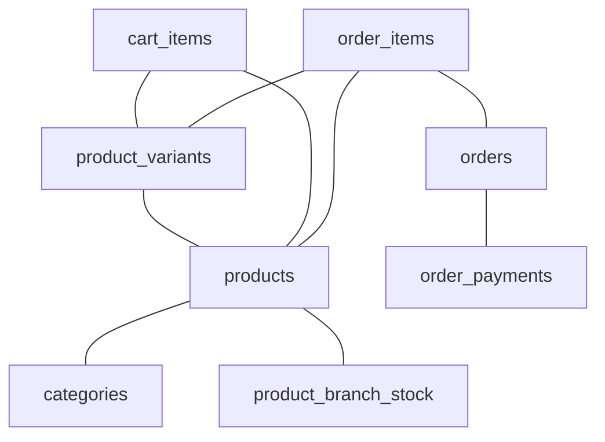

# E-commerce Data Model

<cite>
**Referenced Files in This Document**
- [20241220000001_create_ecommerce_system.sql](file://supabase/migrations/20241220000001_create_ecommerce_system.sql)
- [20251217000000_add_branch_id_to_products.sql](file://supabase/migrations/20251217000000_add_branch_id_to_products.sql)
- [20260120000000_refactor_separate_products_inventory.sql](file://supabase/migrations/20260120000000_refactor_separate_products_inventory.sql)
- [20260122000006_create_order_payments.sql](file://supabase/migrations/20260122000006_create_order_payments.sql)
- [database.ts](file://src/types/database.ts)
</cite>

## Table of Contents

1. [Introduction](#introduction)
2. [Project Structure](#project-structure)
3. [Core Components](#core-components)
4. [Architecture Overview](#architecture-overview)
5. [Detailed Component Analysis](#detailed-component-analysis)
6. [Dependency Analysis](#dependency-analysis)
7. [Performance Considerations](#performance-considerations)
8. [Troubleshooting Guide](#troubleshooting-guide)
9. [Conclusion](#conclusion)

## Introduction

This document describes the e-commerce data model for Opttius, focusing on product catalog, inventory, and order management. It explains entities for products, categories, variants, and inventory tracking; covers order entities including creation, line items, payment status, and fulfillment tracking; and documents relationships among products, branches, customers, and orders. It also outlines pricing strategies, tax handling, discount calculations, inventory management rules, product options and variant combinations, stock monitoring, order lifecycle management, status transitions, return/refund processing, and data access patterns for product search, inventory queries, and order tracking. Finally, it provides performance considerations for catalogs, search indexing, and real-time inventory updates.

## Project Structure

The e-commerce data model is primarily defined in Supabase migrations and TypeScript database type definitions:

- Core relational schema for categories, products, variants, carts, orders, and order items
- Branch-aware product ownership and inventory tracking via a dedicated stock table
- Payment tracking per order with balance calculation
- Strong indexing and row-level security policies for performance and access control
- TypeScript types for database entities used by the frontend

**Diagram sources**

- [20241220000001_create_ecommerce_system.sql](file://supabase/migrations/20241220000001_create_ecommerce_system.sql#L1-L270)
- [20251217000000_add_branch_id_to_products.sql](file://supabase/migrations/20251217000000_add_branch_id_to_products.sql#L1-L90)
- [20260120000000_refactor_separate_products_inventory.sql](file://supabase/migrations/20260120000000_refactor_separate_products_inventory.sql#L1-L225)
- [20260122000006_create_order_payments.sql](file://supabase/migrations/20260122000006_create_order_payments.sql#L1-L58)

**Section sources**

- [20241220000001_create_ecommerce_system.sql](file://supabase/migrations/20241220000001_create_ecommerce_system.sql#L1-L270)
- [20251217000000_add_branch_id_to_products.sql](file://supabase/migrations/20251217000000_add_branch_id_to_products.sql#L1-L90)
- [20260120000000_refactor_separate_products_inventory.sql](file://supabase/migrations/20260120000000_refactor_separate_products_inventory.sql#L1-L225)
- [20260122000006_create_order_payments.sql](file://supabase/migrations/20260122000006_create_order_payments.sql#L1-L58)
- [database.ts](file://src/types/database.ts#L1-L271)

## Core Components

This section summarizes the primary entities and their roles in the Opttius e-commerce system.

- Categories
  - Purpose: Hierarchical grouping of products with optional parent-child relationships.
  - Key attributes: name, slug, description, image_url, parent_id, sort_order, is_active.
  - Indexes: slug, parent_id, is_active.
  - Access control: public selection policy for active categories.

- Products
  - Purpose: Core product catalog with pricing, inventory flags, metadata, and SEO fields.
  - Key attributes: name, slug, description, short_description, price, compare_at_price, cost_price, currency, sku, barcode, weight, dimensions, inventory tracking flags, inventory_quantity, inventory_policy, low_stock_threshold, featured_image, gallery, video_url, meta_title, meta_description, search_keywords, vendor, category_id, tags, collections, status, is_featured, is_digital, requires_shipping, published_at.
  - Indexes: slug, category_id, status, is_featured, GIN on search_keywords and skin_type.
  - Access control: public selection policy for active products; variants inherit visibility from product status.
  - Branch awareness: branch_id added to support branch-scoped product visibility and inventory.

- Product Variants
  - Purpose: Product variations (e.g., size, color, scent) with separate pricing and inventory.
  - Key attributes: product_id, title, sku, price, compare_at_price, cost_price, inventory_quantity, weight, barcode, image_url, option1–option3, position, is_default.
  - Indexes: product_id, sku.
  - Access control: public selection policy depends on product status.

- Shopping Cart Items
  - Purpose: Anonymous and authenticated cart entries linking to products and variants.
  - Key attributes: user_id, session_id, product_id, variant_id, quantity.
  - Constraints: either user_id or session_id must be present.
  - Access control: users can manage their own cart; anonymous users can manage session cart.

- Orders
  - Purpose: Customer order header with status, financials, and shipping/billing info.
  - Key attributes: order_number, user_id, email, status, payment_status, fulfillment_status, subtotal, tax_amount, shipping_amount, discount_amount, total_amount, currency, Mercado Pago identifiers and statuses, customer_notes, shipping/billing addresses, tracking_number, carrier, shipped_at, delivered_at.
  - Indexes: user_id, order_number, status, payment_status, mp_payment_id.
  - Access control: users can view and insert their own orders; order items visibility depends on order ownership.

- Order Items
  - Purpose: Line items snapshot of product/variant details at purchase time.
  - Key attributes: order_id, product_id, variant_id, quantity, unit_price, total_price, product_name, variant_title, sku, weight.
  - Indexes: order_id, product_id.

- Product Branch Stock (Inventory)
  - Purpose: Centralized, branch-specific inventory tracking with reserved vs. available quantities.
  - Key attributes: product_id, branch_id, quantity, reserved_quantity, available_quantity (generated), low_stock_threshold, reorder_point, last_stock_movement, updated_at.
  - Functions: get_product_stock(), update_product_stock().
  - Indexes: available_quantity, branch_id with low stock filter.
  - Triggers: automatic last_stock_movement timestamp updates.

- Order Payments
  - Purpose: Track real payments against orders for cash-first logic and balance computation.
  - Key attributes: order_id, amount, payment_method, payment_reference, paid_at, created_by, notes.
  - Functions: calculate_order_balance().

**Section sources**

- [20241220000001_create_ecommerce_system.sql](file://supabase/migrations/20241220000001_create_ecommerce_system.sql#L1-L270)
- [20251217000000_add_branch_id_to_products.sql](file://supabase/migrations/20251217000000_add_branch_id_to_products.sql#L1-L90)
- [20260120000000_refactor_separate_products_inventory.sql](file://supabase/migrations/20260120000000_refactor_separate_products_inventory.sql#L1-L225)
- [20260122000006_create_order_payments.sql](file://supabase/migrations/20260122000006_create_order_payments.sql#L1-L58)

## Architecture Overview

The Opttius e-commerce data model separates product catalog from inventory, enabling branch-level stock management. Orders capture financials and fulfillment, while order_payments track real payments and compute balances. Strong indexing and RLS policies ensure performance and access control.

**Diagram sources**

- [20241220000001_create_ecommerce_system.sql](file://supabase/migrations/20241220000001_create_ecommerce_system.sql#L1-L270)
- [20251217000000_add_branch_id_to_products.sql](file://supabase/migrations/20251217000000_add_branch_id_to_products.sql#L1-L90)
- [20260120000000_refactor_separate_products_inventory.sql](file://supabase/migrations/20260120000000_refactor_separate_products_inventory.sql#L1-L225)
- [20260122000006_create_order_payments.sql](file://supabase/migrations/20260122000006_create_order_payments.sql#L1-L58)

## Detailed Component Analysis

### Product Catalog Entities

Products and categories define the catalog. Products include pricing, inventory flags, media, SEO metadata, and attributes. Variants enable option-based combinations (option1–option3) with independent pricing and inventory.

**Diagram sources**

- [20241220000001_create_ecommerce_system.sql](file://supabase/migrations/20241220000001_create_ecommerce_system.sql#L1-L270)

**Section sources**

- [20241220000001_create_ecommerce_system.sql](file://supabase/migrations/20241220000001_create_ecommerce_system.sql#L1-L270)

### Inventory Management

Inventory is separated from product catalog and tracked per branch. The product_branch_stock table stores quantity, reserved_quantity, and computed available_quantity. Helper functions provide stock retrieval and updates.

**Diagram sources**

- [20260120000000_refactor_separate_products_inventory.sql](file://supabase/migrations/20260120000000_refactor_separate_products_inventory.sql#L74-L136)

**Section sources**

- [20260120000000_refactor_separate_products_inventory.sql](file://supabase/migrations/20260120000000_refactor_separate_products_inventory.sql#L1-L225)

### Order Lifecycle and Payments

Orders capture status, payment status, and fulfillment status. Order items snapshot product details at purchase. Order payments track real payments and compute outstanding balances.

**Diagram sources**

- [20241220000001_create_ecommerce_system.sql](file://supabase/migrations/20241220000001_create_ecommerce_system.sql#L104-L176)
- [20260122000006_create_order_payments.sql](file://supabase/migrations/20260122000006_create_order_payments.sql#L1-L58)

**Section sources**

- [20241220000001_create_ecommerce_system.sql](file://supabase/migrations/20241220000001_create_ecommerce_system.sql#L104-L176)
- [20260122000006_create_order_payments.sql](file://supabase/migrations/20260122000006_create_order_payments.sql#L1-L58)

### Branch Relationships and Access Control

Products are associated with branches to enable branch-specific catalogs and inventory. RLS policies restrict product visibility and modifications to authorized admins per branch.

**Diagram sources**

- [20251217000000_add_branch_id_to_products.sql](file://supabase/migrations/20251217000000_add_branch_id_to_products.sql#L1-L90)

**Section sources**

- [20251217000000_add_branch_id_to_products.sql](file://supabase/migrations/20251217000000_add_branch_id_to_products.sql#L1-L90)

## Dependency Analysis

The following diagram shows key dependencies among entities and functions used by the e-commerce system.

**Diagram sources**

- [20241220000001_create_ecommerce_system.sql](file://supabase/migrations/20241220000001_create_ecommerce_system.sql#L1-L270)
- [20251217000000_add_branch_id_to_products.sql](file://supabase/migrations/20251217000000_add_branch_id_to_products.sql#L1-L90)
- [20260120000000_refactor_separate_products_inventory.sql](file://supabase/migrations/20260120000000_refactor_separate_products_inventory.sql#L1-L225)
- [20260122000006_create_order_payments.sql](file://supabase/migrations/20260122000006_create_order_payments.sql#L1-L58)

**Section sources**

- [20241220000001_create_ecommerce_system.sql](file://supabase/migrations/20241220000001_create_ecommerce_system.sql#L1-L270)
- [20251217000000_add_branch_id_to_products.sql](file://supabase/migrations/20251217000000_add_branch_id_to_products.sql#L1-L90)
- [20260120000000_refactor_separate_products_inventory.sql](file://supabase/migrations/20260120000000_refactor_separate_products_inventory.sql#L1-L225)
- [20260122000006_create_order_payments.sql](file://supabase/migrations/20260122000006_create_order_payments.sql#L1-L58)

## Performance Considerations

- Indexing
  - Categories: slug, parent_id, is_active
  - Products: slug, category_id, status, is_featured, GIN on search_keywords and skin_type
  - Variants: product_id, sku
  - Cart: user_id, session_id, product_id
  - Orders: user_id, order_number, status, payment_status, mp_payment_id
  - Order Items: order_id, product_id
  - Product Branch Stock: available_quantity, branch_id with low-stock filter
- Row Level Security
  - Policies limit data visibility and manipulation to authorized users and branches.
- Search and Filtering
  - GIN indexes on arrays/text arrays enable efficient product search and filtering.
- Inventory Updates
  - Generated available_quantity reduces repeated computations and supports fast low-stock alerts.
- Payment Balances
  - Dedicated order_payments table and calculate_order_balance() function simplify cash-first workflows and reconciliation.

[No sources needed since this section provides general guidance]

## Troubleshooting Guide

- Low Stock Alerts
  - Use get_product_stock() to retrieve available_quantity and thresholds per branch.
  - Monitor low_stock_threshold and reorder_point to trigger replenishment.
- Inventory Discrepancies
  - Verify last_stock_movement timestamps and reserved_quantity adjustments.
  - Confirm inventory_policy behavior (deny vs. continue) aligns with business rules.
- Payment Balances
  - Use calculate_order_balance() to reconcile total_amount against recorded order_payments.
  - Investigate partial_refunds reflected in payment_status and order_payments.
- Access Control Issues
  - Review RLS policies for products, variants, orders, and cart items.
  - Ensure admin_branch_access grants are configured for branch-scoped data.

**Section sources**

- [20260120000000_refactor_separate_products_inventory.sql](file://supabase/migrations/20260120000000_refactor_separate_products_inventory.sql#L41-L70)
- [20260122000006_create_order_payments.sql](file://supabase/migrations/20260122000006_create_order_payments.sql#L31-L55)

## Conclusion

Opttius employs a robust, branch-aware e-commerce data model that separates product catalogs from inventory, tracks stock centrally with reserved/available quantities, and manages orders and payments with clear status transitions. Strong indexing and RLS policies ensure performance and security. The model supports flexible pricing, tax handling, discounts, and variant combinations while enabling scalable search, real-time inventory updates, and reliable order lifecycle management.
