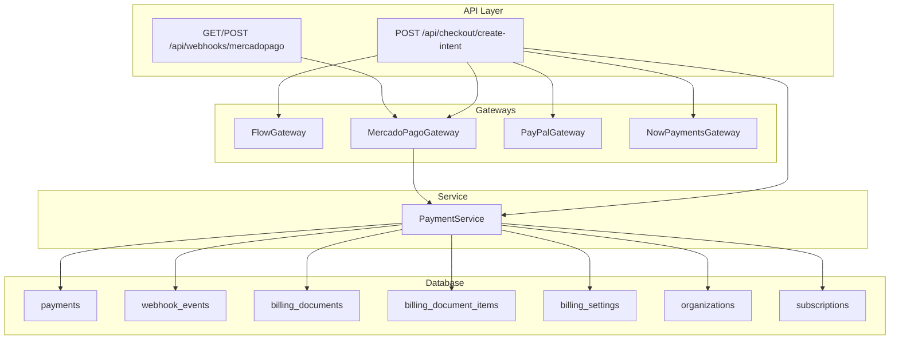
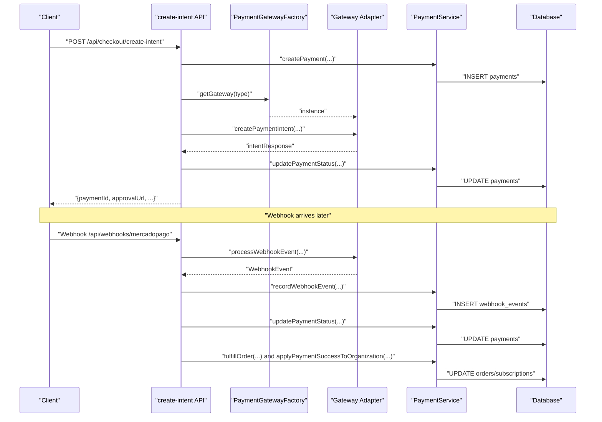
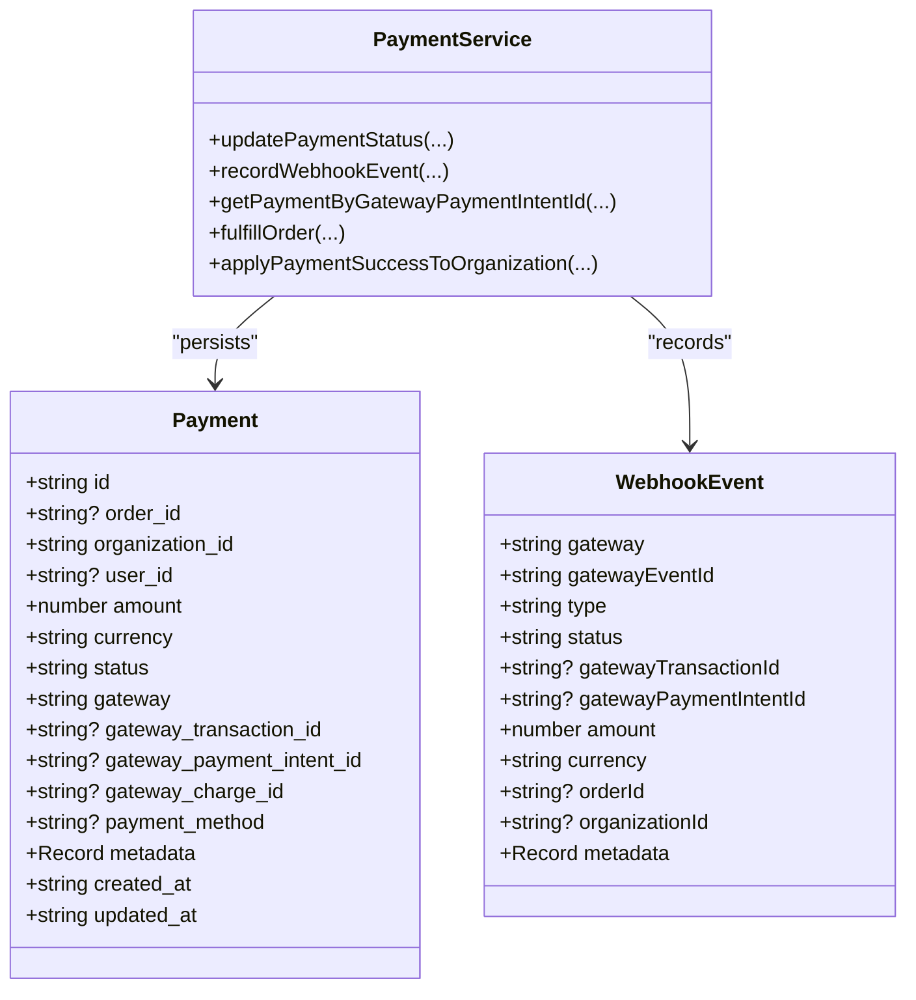
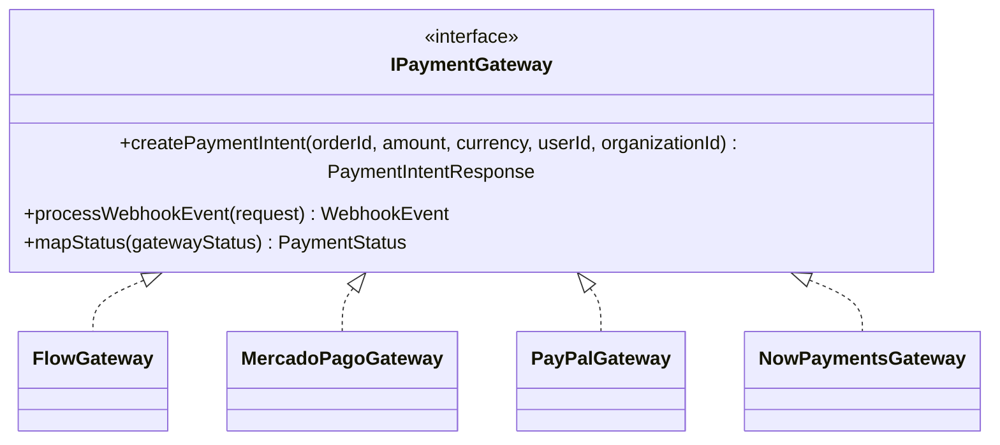
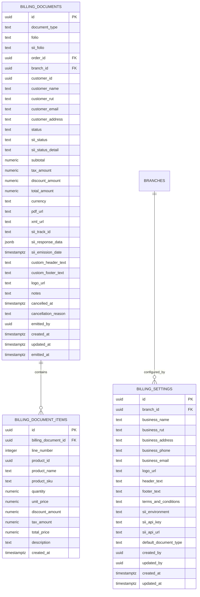
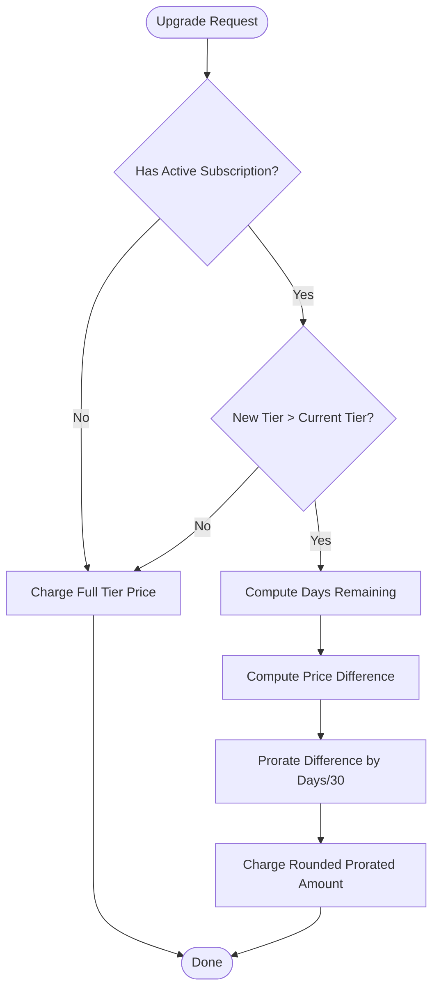
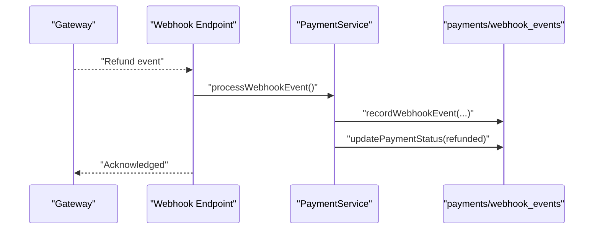
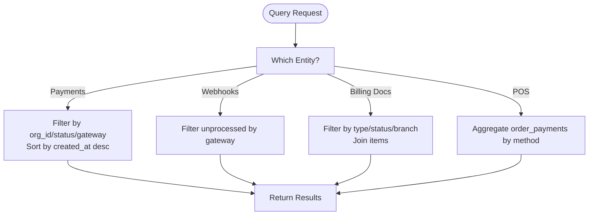
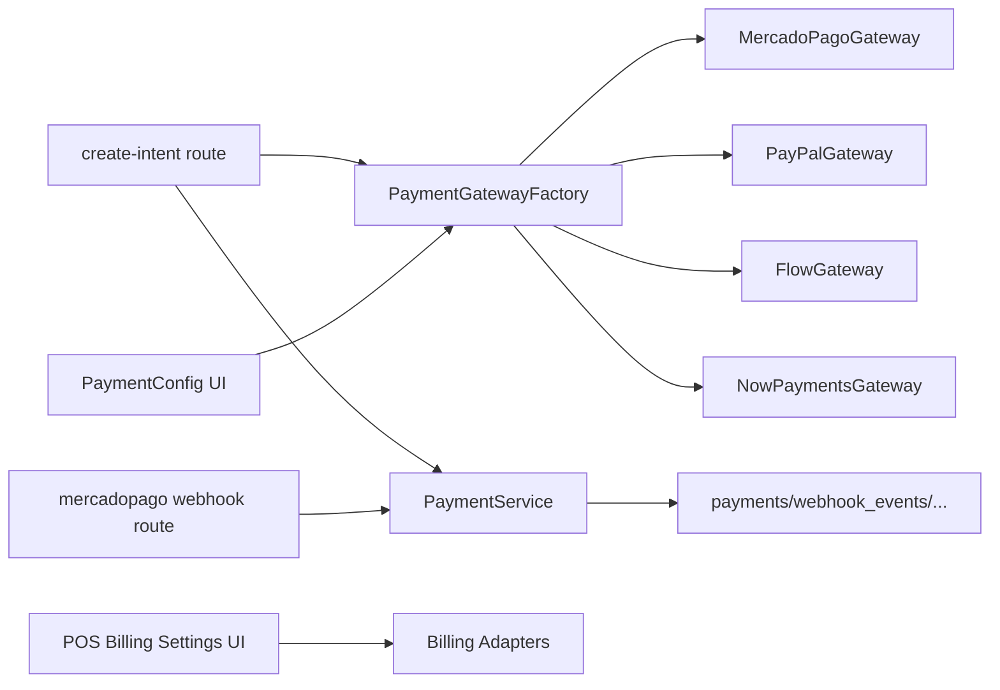

# Payment & Billing System

<cite>
**Referenced Files in This Document**
- [src/app/api/checkout/create-intent/route.ts](file://src/app/api/checkout/create-intent/route.ts)
- [src/lib/payments/index.ts](file://src/lib/payments/index.ts)
- [src/lib/payments/interfaces.ts](file://src/lib/payments/interfaces.ts)
- [src/lib/payments/services/payment-service.ts](file://src/lib/payments/services/payment-service.ts)
- [src/lib/payments/mercadopago/gateway.ts](file://src/lib/payments/mercadopago/gateway.ts)
- [src/lib/payments/paypal/gateway.ts](file://src/lib/payments/paypal/gateway.ts)
- [src/lib/billing/adapters/InternalBilling.ts](file://src/lib/billing/adapters/InternalBilling.ts)
- [src/types/payment.ts](file://src/types/payment.ts)
- [supabase/migrations/20260131000000_create_payments_and_webhook_events.sql](file://supabase/migrations/20260131000000_create_payments_and_webhook_events.sql)
- [supabase/migrations/20250128000003_create_billing_documents.sql](file://supabase/migrations/20250128000003_create_billing_documents.sql)
- [supabase/migrations/20260128000000_create_organizations_and_subscriptions.sql](file://supabase/migrations/20260128000000_create_organizations_and_subscriptions.sql)
- [src/app/api/webhooks/mercadopago/route.ts](file://src/app/api/webhooks/mercadopago/route.ts)
- [src/components/admin/PaymentConfig.tsx](file://src/components/admin/PaymentConfig.tsx)
- [src/app/admin/cash-register/[id]/page.tsx](file://src/app/admin/cash-register/[id]/page.tsx)
- [src/app/admin/system/pos-billing-settings/page.tsx](file://src/app/admin/system/pos-billing-settings/page.tsx)
- [src/components/checkout/CheckoutPageContent.tsx](file://src/components/checkout/CheckoutPageContent.tsx)
- [src/lib/saas/subscription-status.ts](file://src/lib/saas/subscription-status.ts)
- [docs/PAYMENT_GATEWAYS_IMPLEMENTATION_GUIDE.md](file://docs/PAYMENT_GATEWAYS_IMPLEMENTATION_GUIDE.md)
- [docs/MercadoPagoIntegracion.md](file://docs/MercadoPagoIntegracion.md)
</cite>

## Table of Contents

1. [Introduction](#introduction)
2. [Project Structure](#project-structure)
3. [Core Components](#core-components)
4. [Architecture Overview](#architecture-overview)
5. [Detailed Component Analysis](#detailed-component-analysis)
6. [Dependency Analysis](#dependency-analysis)
7. [Performance Considerations](#performance-considerations)
8. [Troubleshooting Guide](#troubleshooting-guide)
9. [Conclusion](#conclusion)
10. [Appendices](#appendices)

## Introduction

This document describes the Opttius payment and billing system with a focus on transaction processing, financial management, and multi-tenant SaaS billing. It covers payment entities (payment intents, transactions, refunds), billing entities (invoices, receipts, tax handling), gateway integrations (Flow, Mercado Pago, PayPal, NowPayments), subscription billing models, proration, reconciliation, and security considerations. It also outlines data access patterns for payment queries, transaction history, and financial reporting.

## Project Structure

The payment and billing system spans API routes, gateway adapters, a payment service, database migrations, and UI components:

- API routes orchestrate payment creation and webhook processing.
- Gateway adapters encapsulate provider-specific logic.
- Payment service manages persistence, idempotent webhook handling, and organization upgrades.
- Database migrations define payment, webhook events, billing documents, and subscription schemas.
- UI components expose payment configuration and POS billing settings.

**Diagram sources**

- [src/app/api/checkout/create-intent/route.ts](file://src/app/api/checkout/create-intent/route.ts#L34-L260)
- [src/app/api/webhooks/mercadopago/route.ts](file://src/app/api/webhooks/mercadopago/route.ts#L1-L372)
- [src/lib/payments/index.ts](file://src/lib/payments/index.ts#L19-L38)
- [src/lib/payments/services/payment-service.ts](file://src/lib/payments/services/payment-service.ts#L50-L94)
- [supabase/migrations/20260131000000_create_payments_and_webhook_events.sql](file://supabase/migrations/20260131000000_create_payments_and_webhook_events.sql#L24-L150)
- [supabase/migrations/20250128000003_create_billing_documents.sql](file://supabase/migrations/20250128000003_create_billing_documents.sql#L9-L182)
- [supabase/migrations/20260128000000_create_organizations_and_subscriptions.sql](file://supabase/migrations/20260128000000_create_organizations_and_subscriptions.sql#L5-L287)

**Section sources**

- [src/app/api/checkout/create-intent/route.ts](file://src/app/api/checkout/create-intent/route.ts#L34-L260)
- [src/lib/payments/index.ts](file://src/lib/payments/index.ts#L19-L38)
- [src/lib/payments/services/payment-service.ts](file://src/lib/payments/services/payment-service.ts#L50-L94)
- [supabase/migrations/20260131000000_create_payments_and_webhook_events.sql](file://supabase/migrations/20260131000000_create_payments_and_webhook_events.sql#L24-L150)
- [supabase/migrations/20250128000003_create_billing_documents.sql](file://supabase/migrations/20250128000003_create_billing_documents.sql#L9-L182)
- [supabase/migrations/20260128000000_create_organizations_and_subscriptions.sql](file://supabase/migrations/20260128000000_create_organizations_and_subscriptions.sql#L5-L287)

## Core Components

- Payment gateway factory and interfaces: define a unified contract for creating payment intents, processing webhooks, and mapping statuses.
- Payment service: persists payments, updates statuses, records webhook events for idempotency, fulfills orders, and applies successful payments to organization subscription tiers.
- Gateway implementations: Flow, Mercado Pago, PayPal, and NowPayments adapters encapsulate provider-specific flows.
- Types: strongly typed payment, webhook event, and gateway enums aligned with the schema.
- Billing adapter: generates internal billing documents and items, integrates with POS billing settings.
- Database schema: payments, webhook_events, billing_documents, billing_document_items, billing_settings, organizations, subscriptions.

Key responsibilities:

- Transaction lifecycle: create intent → capture status via webhook → update payment → fulfill order → apply organization upgrade.
- Idempotency: webhook_events prevent duplicate processing.
- Multi-tenancy: organization_id ensures tenant isolation.
- Subscription billing: tier mapping and status transitions.

**Section sources**

- [src/lib/payments/index.ts](file://src/lib/payments/index.ts#L19-L38)
- [src/lib/payments/interfaces.ts](file://src/lib/payments/interfaces.ts#L286-L341)
- [src/lib/payments/services/payment-service.ts](file://src/lib/payments/services/payment-service.ts#L50-L94)
- [src/types/payment.ts](file://src/types/payment.ts#L8-L48)
- [src/lib/billing/adapters/InternalBilling.ts](file://src/lib/billing/adapters/InternalBilling.ts#L74-L113)
- [supabase/migrations/20260131000000_create_payments_and_webhook_events.sql](file://supabase/migrations/20260131000000_create_payments_and_webhook_events.sql#L24-L150)
- [supabase/migrations/20250128000003_create_billing_documents.sql](file://supabase/migrations/20250128000003_create_billing_documents.sql#L9-L182)
- [supabase/migrations/20260128000000_create_organizations_and_subscriptions.sql](file://supabase/migrations/20260128000000_create_organizations_and_subscriptions.sql#L5-L287)

## Architecture Overview

The system follows a gateway-agnostic design with a central PaymentService coordinating provider-specific adapters. Webhooks are validated and recorded for idempotency, after which payment statuses are updated and downstream actions (order fulfillment, organization upgrade) are triggered.

**Diagram sources**

- [src/app/api/checkout/create-intent/route.ts](file://src/app/api/checkout/create-intent/route.ts#L132-L235)
- [src/lib/payments/index.ts](file://src/lib/payments/index.ts#L19-L38)
- [src/lib/payments/mercadopago/gateway.ts](file://src/lib/payments/mercadopago/gateway.ts#L923-L1081)
- [src/lib/payments/services/payment-service.ts](file://src/lib/payments/services/payment-service.ts#L50-L94)
- [src/app/api/webhooks/mercadopago/route.ts](file://src/app/api/webhooks/mercadopago/route.ts#L255-L347)

## Detailed Component Analysis

### Payment Entities and Lifecycle

- Payment entity: stores gateway identifiers, amounts, currency, status, and metadata. Indexed for organization, order, status, and gateway IDs.
- Webhook events: idempotency table keyed by gateway and gateway_event_id.
- PaymentService methods:
  - updatePaymentStatus: updates status and gateway IDs.
  - recordWebhookEvent: inserts event with processed flag.
  - getPaymentByGatewayPaymentIntentId: lookup by gateway intent ID.
  - fulfillOrder: marks order paid and finalizes items.
  - applyPaymentSuccessToOrganization: maps tier by metadata or amount and updates organization subscription.

**Diagram sources**

- [src/types/payment.ts](file://src/types/payment.ts#L12-L48)
- [src/lib/payments/services/payment-service.ts](file://src/lib/payments/services/payment-service.ts#L50-L94)
- [src/lib/payments/services/payment-service.ts](file://src/lib/payments/services/payment-service.ts#L187-L228)
- [src/lib/payments/services/payment-service.ts](file://src/lib/payments/services/payment-service.ts#L284-L323)

**Section sources**

- [src/types/payment.ts](file://src/types/payment.ts#L8-L48)
- [src/lib/payments/services/payment-service.ts](file://src/lib/payments/services/payment-service.ts#L50-L94)
- [src/lib/payments/services/payment-service.ts](file://src/lib/payments/services/payment-service.ts#L187-L228)
- [src/lib/payments/services/payment-service.ts](file://src/lib/payments/services/payment-service.ts#L284-L323)
- [supabase/migrations/20260131000000_create_payments_and_webhook_events.sql](file://supabase/migrations/20260131000000_create_payments_and_webhook_events.sql#L24-L150)

### Payment Gateways and Integrations

- Factory supports Flow, Mercado Pago, PayPal, and NowPayments.
- Interfaces define createPaymentIntent, processWebhookEvent, and mapStatus.
- Gateway implementations:
  - Mercado Pago: preference creation, approval URL, webhook parsing, status mapping.
  - PayPal: order creation, approval URL, webhook parsing, status mapping.
  - Flow: gateway-specific implementation.
  - NowPayments: included in factory and types.

**Diagram sources**

- [src/lib/payments/interfaces.ts](file://src/lib/payments/interfaces.ts#L286-L341)
- [src/lib/payments/index.ts](file://src/lib/payments/index.ts#L19-L38)
- [src/lib/payments/mercadopago/gateway.ts](file://src/lib/payments/mercadopago/gateway.ts#L923-L1081)
- [src/lib/payments/paypal/gateway.ts](file://src/lib/payments/paypal/gateway.ts#L1130-L1315)

**Section sources**

- [src/lib/payments/index.ts](file://src/lib/payments/index.ts#L19-L38)
- [src/lib/payments/interfaces.ts](file://src/lib/payments/interfaces.ts#L286-L341)
- [src/lib/payments/mercadopago/gateway.ts](file://src/lib/payments/mercadopago/gateway.ts#L923-L1081)
- [src/lib/payments/paypal/gateway.ts](file://src/lib/payments/paypal/gateway.ts#L1130-L1315)
- [docs/PAYMENT_GATEWAYS_IMPLEMENTATION_GUIDE.md](file://docs/PAYMENT_GATEWAYS_IMPLEMENTATION_GUIDE.md#L286-L1315)

### Billing Entities and Receipts

- Billing documents: boleta, factura, internal_ticket with status, totals, tax, and SII integration fields.
- Billing document items: per-line items linked to products.
- Billing settings: branch-level defaults, SII environment, and branding.
- InternalBilling adapter: creates billing documents and items, sets emitted_at, and updates order references.

**Diagram sources**

- [supabase/migrations/20250128000003_create_billing_documents.sql](file://supabase/migrations/20250128000003_create_billing_documents.sql#L9-L182)

**Section sources**

- [supabase/migrations/20250128000003_create_billing_documents.sql](file://supabase/migrations/20250128000003_create_billing_documents.sql#L9-L182)
- [src/lib/billing/adapters/InternalBilling.ts](file://src/lib/billing/adapters/InternalBilling.ts#L74-L113)
- [src/app/admin/system/pos-billing-settings/page.tsx](file://src/app/admin/system/pos-billing-settings/page.tsx#L606-L889)

### Subscription Billing Models and Proration

- Organizations and subscriptions: multi-tenant entities with tier definitions and status tracking.
- Subscription status helper computes trial expiration, cancellation windows, and effective end dates.
- Checkout proration: calculates prorated upgrade differences based on remaining days in the current period.

**Diagram sources**

- [src/components/checkout/CheckoutPageContent.tsx](file://src/components/checkout/CheckoutPageContent.tsx#L139-L184)
- [src/lib/saas/subscription-status.ts](file://src/lib/saas/subscription-status.ts#L90-L141)

**Section sources**

- [supabase/migrations/20260128000000_create_organizations_and_subscriptions.sql](file://supabase/migrations/20260128000000_create_organizations_and_subscriptions.sql#L5-L287)
- [src/lib/saas/subscription-status.ts](file://src/lib/saas/subscription-status.ts#L90-L141)
- [src/components/checkout/CheckoutPageContent.tsx](file://src/components/checkout/CheckoutPageContent.tsx#L139-L184)

### Refund Processing, Chargebacks, and Disputes

- Gateway status mapping includes refunded state.
- Webhook events capture gatewayTransactionId and metadata for auditability.
- Manual refund workflows can be implemented by invoking PaymentService.updatePaymentStatus with refunded status and appropriate metadata.

**Diagram sources**

- [src/lib/payments/mercadopago/gateway.ts](file://src/lib/payments/mercadopago/gateway.ts#L1062-L1081)
- [src/app/api/webhooks/mercadopago/route.ts](file://src/app/api/webhooks/mercadopago/route.ts#L255-L347)
- [src/lib/payments/services/payment-service.ts](file://src/lib/payments/services/payment-service.ts#L50-L94)

**Section sources**

- [src/lib/payments/mercadopago/gateway.ts](file://src/lib/payments/mercadopago/gateway.ts#L1062-L1081)
- [src/app/api/webhooks/mercadopago/route.ts](file://src/app/api/webhooks/mercadopago/route.ts#L255-L347)
- [src/lib/payments/services/payment-service.ts](file://src/lib/payments/services/payment-service.ts#L50-L94)

### Data Access Patterns and Financial Reporting

- Payments: filter by organization_id, status, gateway, created_at; join with orders for reporting.
- Webhook events: query unprocessed events by gateway; deduplicate by gateway_event_id.
- Billing documents: filter by document_type, status, branch_id, created_at; join with items for line details.
- POS cash register: summarize sales by payment method across sessions and orders.

**Diagram sources**

- [supabase/migrations/20260131000000_create_payments_and_webhook_events.sql](file://supabase/migrations/20260131000000_create_payments_and_webhook_events.sql#L48-L150)
- [supabase/migrations/20250128000003_create_billing_documents.sql](file://supabase/migrations/20250128000003_create_billing_documents.sql#L56-L109)
- [src/app/admin/cash-register/[id]/page.tsx](file://src/app/admin/cash-register/[id]/page.tsx#L190-L223)

**Section sources**

- [supabase/migrations/20260131000000_create_payments_and_webhook_events.sql](file://supabase/migrations/20260131000000_create_payments_and_webhook_events.sql#L48-L150)
- [supabase/migrations/20250128000003_create_billing_documents.sql](file://supabase/migrations/20250128000003_create_billing_documents.sql#L56-L109)
- [src/app/admin/cash-register/[id]/page.tsx](file://src/app/admin/cash-register/[id]/page.tsx#L190-L223)

### Security Considerations and PCI Compliance

- UI highlights PCI-DSS compliance and SSL encryption for checkout.
- Mercado Pago integration documentation emphasizes HTTPS and wallet usage for reduced risk.
- Webhook signature validation for Mercado Pago protects against tampering.

**Section sources**

- [src/components/checkout/CheckoutPageContent.tsx](file://src/components/checkout/CheckoutPageContent.tsx#L725-L754)
- [docs/MercadoPagoIntegracion.md](file://docs/MercadoPagoIntegracion.md#L2184-L2189)
- [src/app/api/webhooks/mercadopago/route.ts](file://src/app/api/webhooks/mercadopago/route.ts#L233-L245)

## Dependency Analysis

- API routes depend on PaymentGatewayFactory and PaymentService.
- PaymentService depends on Supabase client and interacts with payments, webhook_events, organizations, subscriptions, and billing tables.
- Gateway adapters depend on provider SDKs and return standardized responses/events.
- UI components depend on configuration and settings for payment methods and POS billing.

**Diagram sources**

- [src/app/api/checkout/create-intent/route.ts](file://src/app/api/checkout/create-intent/route.ts#L132-L235)
- [src/app/api/webhooks/mercadopago/route.ts](file://src/app/api/webhooks/mercadopago/route.ts#L15-L372)
- [src/lib/payments/index.ts](file://src/lib/payments/index.ts#L19-L38)
- [src/lib/payments/services/payment-service.ts](file://src/lib/payments/services/payment-service.ts#L50-L94)
- [src/components/admin/PaymentConfig.tsx](file://src/components/admin/PaymentConfig.tsx#L663-L702)
- [src/app/admin/system/pos-billing-settings/page.tsx](file://src/app/admin/system/pos-billing-settings/page.tsx#L606-L889)

**Section sources**

- [src/app/api/checkout/create-intent/route.ts](file://src/app/api/checkout/create-intent/route.ts#L132-L235)
- [src/app/api/webhooks/mercadopago/route.ts](file://src/app/api/webhooks/mercadopago/route.ts#L15-L372)
- [src/lib/payments/index.ts](file://src/lib/payments/index.ts#L19-L38)
- [src/lib/payments/services/payment-service.ts](file://src/lib/payments/services/payment-service.ts#L50-L94)
- [src/components/admin/PaymentConfig.tsx](file://src/components/admin/PaymentConfig.tsx#L663-L702)
- [src/app/admin/system/pos-billing-settings/page.tsx](file://src/app/admin/system/pos-billing-settings/page.tsx#L606-L889)

## Performance Considerations

- Indexes on payments and webhook_events enable fast lookups by organization_id, status, gateway IDs, and timestamps.
- Idempotency reduces redundant processing and retries.
- Webhook processing uses service role to bypass RLS for writes and logs errors for debugging.
- POS cash register aggregation prefers order_payments for accuracy and performance.

[No sources needed since this section provides general guidance]

## Troubleshooting Guide

Common issues and resolutions:

- Missing organization context during payment creation: ensure user belongs to an organization.
- Gateway initialization failures: verify environment variables and credentials.
- Webhook signature validation errors: confirm secret configuration and headers.
- Duplicate webhook processing: idempotency prevents repeated updates.
- Merchant order handling: fallback logic updates payment when merchant_order confirms approvals.

**Section sources**

- [src/app/api/checkout/create-intent/route.ts](file://src/app/api/checkout/create-intent/route.ts#L76-L96)
- [src/app/api/webhooks/mercadopago/route.ts](file://src/app/api/webhooks/mercadopago/route.ts#L233-L245)
- [src/app/api/webhooks/mercadopago/route.ts](file://src/app/api/webhooks/mercadopago/route.ts#L182-L192)

## Conclusion

Opttius implements a robust, gateway-agnostic payment and billing system with strong multi-tenancy, idempotent webhook handling, and comprehensive billing document management. Subscription billing includes proration logic and tier mapping, while POS billing settings streamline receipt generation. Security practices emphasize PCI alignment, SSL, and webhook validation.

[No sources needed since this section summarizes without analyzing specific files]

## Appendices

### API Endpoints and Responsibilities

- POST /api/checkout/create-intent: Creates payment intent, persists payment, and returns approval/invoice URLs.
- GET/POST /api/webhooks/mercadopago: Validates signatures, records idempotent events, updates payment status, fulfills orders, and upgrades organizations.

**Section sources**

- [src/app/api/checkout/create-intent/route.ts](file://src/app/api/checkout/create-intent/route.ts#L34-L260)
- [src/app/api/webhooks/mercadopago/route.ts](file://src/app/api/webhooks/mercadopago/route.ts#L1-L372)

### Payment Method Configuration UI

- Admin UI toggles enabled payment methods and displays localized labels for POS and cash register views.

**Section sources**

- [src/components/admin/PaymentConfig.tsx](file://src/components/admin/PaymentConfig.tsx#L663-L702)
- [src/app/admin/cash-register/[id]/page.tsx](file://src/app/admin/cash-register/[id]/page.tsx#L212-L223)
