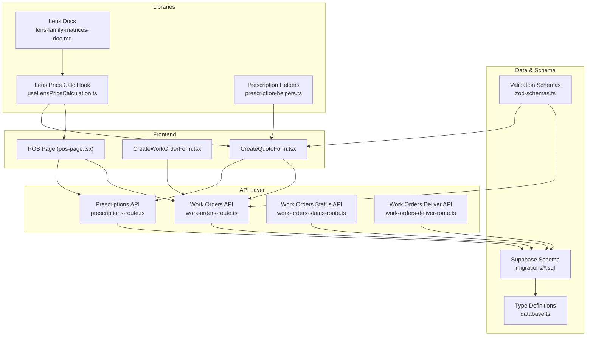
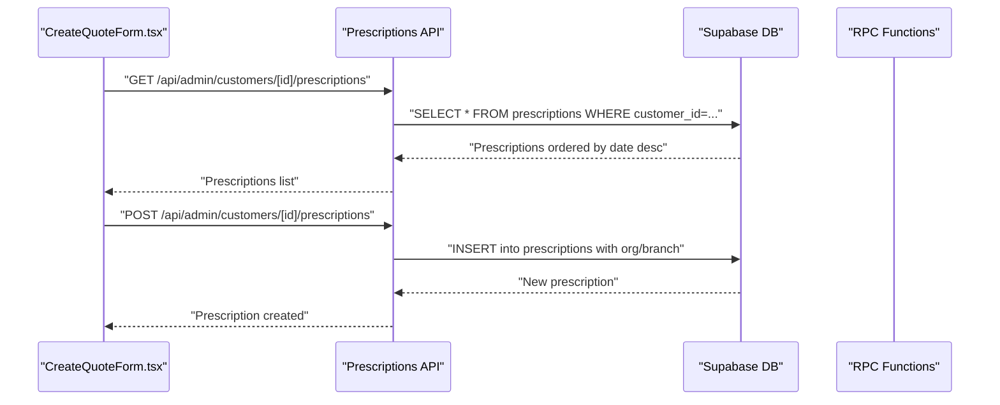
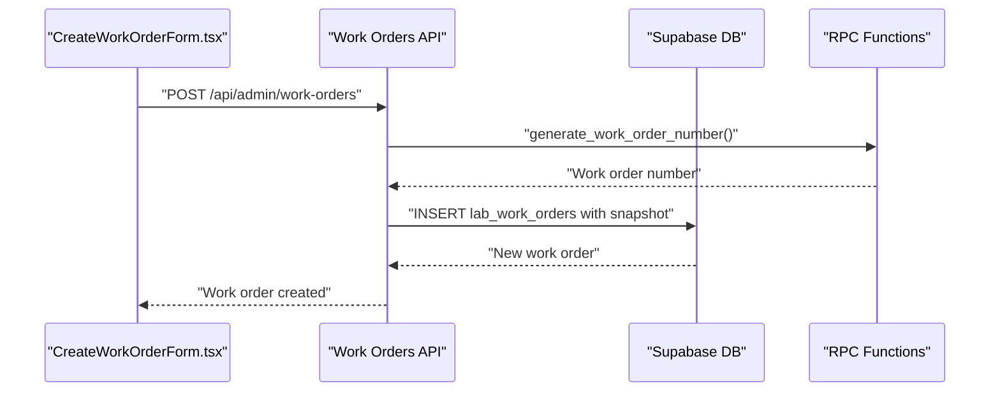
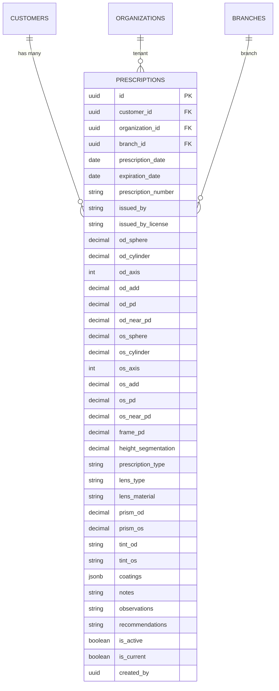
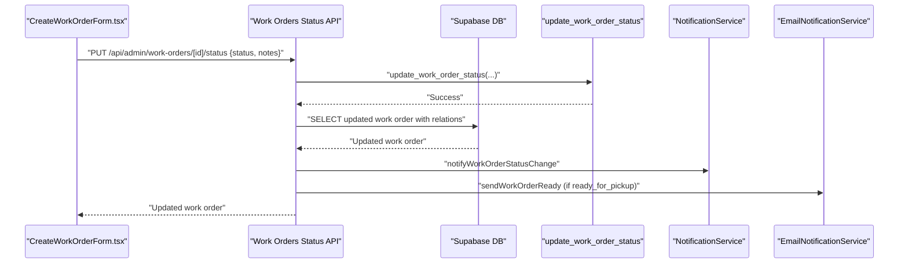
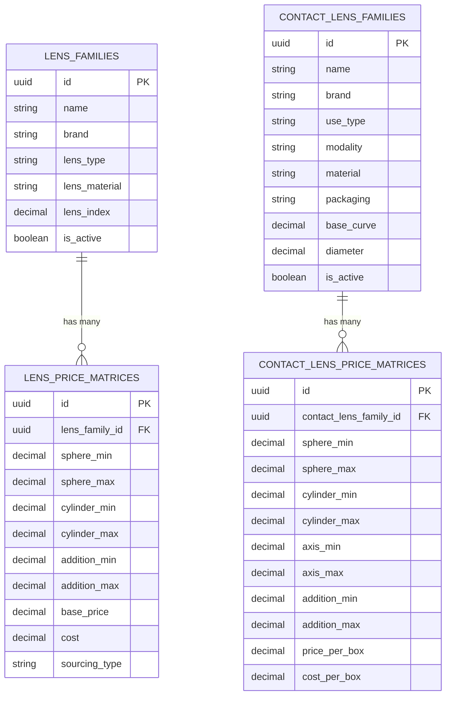
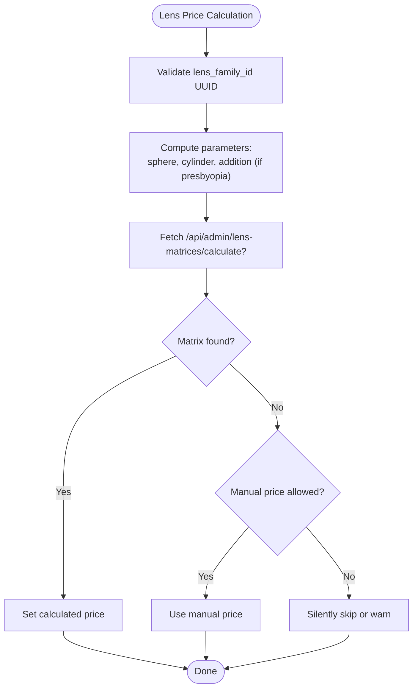
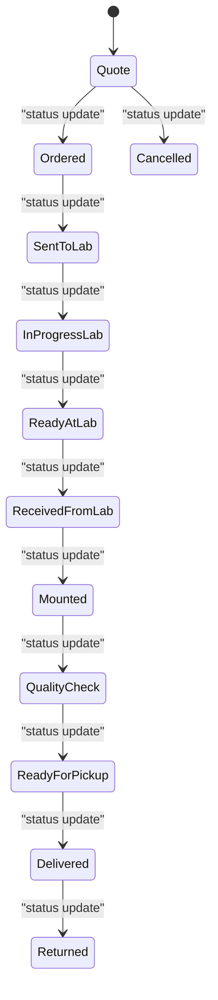
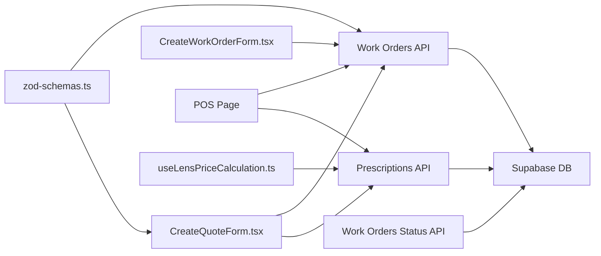

# Prescription & Work Order Workflow

<cite>
**Referenced Files in This Document**
- [README.md](file://README.md)
- [database.ts](file://src/types/database.ts)
- [prescription-helpers.ts](file://src/lib/prescription-helpers.ts)
- [useLensPriceCalculation.ts](file://src/hooks/useLensPriceCalculation.ts)
- [CreateQuoteForm.tsx](file://src/components/admin/CreateQuoteForm.tsx)
- [CreateWorkOrderForm.tsx](file://src/components/admin/CreateWorkOrderForm.tsx)
- [pos-page.tsx](file://src/app/admin/pos/page.tsx)
- [prescriptions-route.ts](file://src/app/api/admin/customers/[id]/prescriptions/route.ts)
- [work-orders-route.ts](file://src/app/api/admin/work-orders/route.ts)
- [work-orders-status-route.ts](file://src/app/api/admin/work-orders/[id]/status/route.ts)
- [work-orders-deliver-route.ts](file://src/app/api/admin/work-orders/[id]/deliver/route.ts)
- [lens-family-matrices-doc.md](file://docs/LENS_FAMILIES_AND_MATRICES_SCHEMA.md)
- [contact-lenses-guide.md](file://docs/CONTACT_LENSES_INTEGRATION_GUIDE.md)
- [add-addition-support-migration.sql](file://supabase/migrations/20260125000000_add_addition_support_to_lens_matrices.sql)
- [contact-lenses-fields-migration.sql](file://supabase/migrations/20260131000006_add_contact_lens_fields_to_quotes_and_work_orders.sql)
- [contact-lenses-system-migration.sql](file://supabase/migrations/20260131000005_create_contact_lenses_system.sql)
- [demo-seed-migration.sql](file://supabase/migrations/20260131000002_improve_demo_seed_data.sql)
- [zod-schemas.ts](file://src/lib/api/validation/zod-schemas.ts)
</cite>

## Table of Contents

1. [Introduction](#introduction)
2. [Project Structure](#project-structure)
3. [Core Components](#core-components)
4. [Architecture Overview](#architecture-overview)
5. [Detailed Component Analysis](#detailed-component-analysis)
6. [Dependency Analysis](#dependency-analysis)
7. [Performance Considerations](#performance-considerations)
8. [Troubleshooting Guide](#troubleshooting-guide)
9. [Conclusion](#conclusion)

## Introduction

This document describes the Opttius optical prescription and work order workflow, focusing on optical prescription management and lab order processing. It documents:

- Prescription entities: patient prescriptions, optical parameters, lens specifications, and prescription history
- Work order entities: order creation, status tracking, lab integration, and fulfillment workflows
- Relationships among prescriptions, customer records, lens families, and work order processing
- Validation rules, parameter calculations, and lens selection criteria
- Work order status transitions, priority handling, and deadline management
- Contact lens specifications, custom lens configurations, and price calculation matrices
- Data access patterns for prescription lookup, work order tracking, and inventory coordination
- Integration points with external laboratories and shipping systems

## Project Structure

The Opttius application organizes optical workflow logic across:

- API routes for prescriptions and work orders
- React components for quote and work order creation
- Supabase migrations defining schema and relationships
- Utility libraries for validation and pricing calculations
- Documentation detailing lens families and matrices

**Diagram sources**

- [CreateQuoteForm.tsx](file://src/components/admin/CreateQuoteForm.tsx#L329-L406)
- [CreateWorkOrderForm.tsx](file://src/components/admin/CreateWorkOrderForm.tsx#L1-L200)
- [pos-page.tsx](file://src/app/admin/pos/page.tsx#L1379-L1416)
- [prescriptions-route.ts](file://src/app/api/admin/customers/[id]/prescriptions/route.ts#L1-L167)
- [work-orders-route.ts](file://src/app/api/admin/work-orders/route.ts#L1-L438)
- [work-orders-status-route.ts](file://src/app/api/admin/work-orders/[id]/status/route.ts#L1-L238)
- [work-orders-deliver-route.ts](file://src/app/api/admin/work-orders/[id]/deliver/route.ts#L1-L200)
- [database.ts](file://src/types/database.ts#L1-L271)
- [useLensPriceCalculation.ts](file://src/hooks/useLensPriceCalculation.ts#L1-L75)
- [prescription-helpers.ts](file://src/lib/prescription-helpers.ts#L1-L38)
- [lens-family-matrices-doc.md](file://docs/LENS_FAMILIES_AND_MATRICES_SCHEMA.md#L522-L578)
- [zod-schemas.ts](file://src/lib/api/validation/zod-schemas.ts#L1102-L1136)

**Section sources**

- [README.md](file://README.md#L33-L57)
- [database.ts](file://src/types/database.ts#L1-L271)

## Core Components

- Prescriptions API: CRUD for patient prescriptions with multitenancy-aware organization and branch linkage, and current-prescription flag normalization
- Work Orders API: Full lifecycle management including creation, status updates, relations to quotes and prescriptions, and batched relation resolution
- Quote and Work Order Forms: UI components that compute lens pricing via matrices, handle presbyopia solutions, and integrate contact lens fields
- Lens Pricing Calculation: Client-side hook to query lens price matrices and derive costs per lens family and parameters
- Validation and Type Safety: Zod schemas for lens families and matrices, plus helper translations for prescription types
- Schema and Migrations: Supabase migrations defining lens families, matrices, contact lens families, and work order fields

Key capabilities:

- Prescription lookup by customer ID with ordering by most recent
- Automatic current-prescription flag management during creation
- Work order creation with snapshot of prescription data and generated work order numbers
- Status transitions with notifications and optional lab metadata updates
- Price calculation for optical and contact lenses using defined matrices

**Section sources**

- [prescriptions-route.ts](file://src/app/api/admin/customers/[id]/prescriptions/route.ts#L6-L56)
- [work-orders-route.ts](file://src/app/api/admin/work-orders/route.ts#L15-L198)
- [work-orders-status-route.ts](file://src/app/api/admin/work-orders/[id]/status/route.ts#L10-L99)
- [CreateQuoteForm.tsx](file://src/components/admin/CreateQuoteForm.tsx#L337-L406)
- [useLensPriceCalculation.ts](file://src/hooks/useLensPriceCalculation.ts#L18-L75)
- [zod-schemas.ts](file://src/lib/api/validation/zod-schemas.ts#L1102-L1136)

## Architecture Overview

The workflow spans frontend forms, API routes, and backend database with stored procedures for work order status management and number generation.

**Diagram sources**

- [prescriptions-route.ts](file://src/app/api/admin/customers/[id]/prescriptions/route.ts#L6-L56)

**Diagram sources**

- [work-orders-route.ts](file://src/app/api/admin/work-orders/route.ts#L200-L261)

## Detailed Component Analysis

### Prescription Management

- Entities: prescriptions with bilateral optical parameters (sphere, cylinder, axis, add, PD), lens type, prism, tint, coatings, and notes
- Multitenancy: prescriptions link to organization_id and branch_id from the customer record
- Lifecycle: create with is_current flag normalization; fetch all for a customer ordered by most recent date
- Translation: helper utilities provide localized labels for lens types

**Diagram sources**

- [prescriptions-route.ts](file://src/app/api/admin/customers/[id]/prescriptions/route.ts#L106-L148)
- [database.ts](file://src/types/database.ts#L1-L271)

**Section sources**

- [prescriptions-route.ts](file://src/app/api/admin/customers/[id]/prescriptions/route.ts#L6-L56)
- [prescription-helpers.ts](file://src/lib/prescription-helpers.ts#L15-L37)

### Work Order Processing

- Creation: Generates work order number via RPC, snapshots prescription data, and sets initial status
- Relations: Supports customer, prescription, quote, and frame product relations; batch-fetches related entities to avoid N+1
- Status Tracking: Dedicated endpoint updates status using RPC, supports additional lab fields, and triggers notifications and emails
- Fulfillment: Delivery endpoint integrates with delivery workflow

**Diagram sources**

- [work-orders-status-route.ts](file://src/app/api/admin/work-orders/[id]/status/route.ts#L79-L139)

**Section sources**

- [work-orders-route.ts](file://src/app/api/admin/work-orders/route.ts#L15-L198)
- [work-orders-status-route.ts](file://src/app/api/admin/work-orders/[id]/status/route.ts#L10-L99)
- [work-orders-deliver-route.ts](file://src/app/api/admin/work-orders/[id]/deliver/route.ts#L1-L200)

### Lens Families and Price Matrices

- Lens families define type, material, and optional optical index; matrices define pricing ranges by sphere, cylinder, addition, and sourcing type
- Two-lens solutions for presbyopia: far/near lens families and costs
- Contact lens families include use type, modality, material, packaging, and fixed parameters (base curve, diameter); contact lens price matrices define pricing by parameters

**Diagram sources**

- [lens-family-matrices-doc.md](file://docs/LENS_FAMILIES_AND_MATRICES_SCHEMA.md#L522-L578)
- [contact-lenses-guide.md](file://docs/CONTACT_LENSES_INTEGRATION_GUIDE.md#L86-L111)
- [contact-lenses-system-migration.sql](file://supabase/migrations/20260131000005_create_contact_lenses_system.sql#L29-L64)

**Section sources**

- [useLensPriceCalculation.ts](file://src/hooks/useLensPriceCalculation.ts#L18-L75)
- [CreateQuoteForm.tsx](file://src/components/admin/CreateQuoteForm.tsx#L337-L406)
- [pos-page.tsx](file://src/app/admin/pos/page.tsx#L1418-L1645)
- [add-addition-support-migration.sql](file://supabase/migrations/20260125000000_add_addition_support_to_lens_matrices.sql#L99-L133)
- [contact-lenses-fields-migration.sql](file://supabase/migrations/20260131000006_add_contact_lens_fields_to_quotes_and_work_orders.sql#L24-L68)

### Parameter Calculations and Lens Selection Criteria

- Optical lens cost calculation uses a matrix lookup by lens family and parameters (sphere, cylinder, addition for presbyopia)
- Contact lens cost calculation uses contact lens family and parameters (sphere, cylinder, axis, addition) with quantity
- Two-lens presbyopia solutions compute far and near lens costs separately and sum totals
- Manual override supported when matrix ranges do not match

**Diagram sources**

- [useLensPriceCalculation.ts](file://src/hooks/useLensPriceCalculation.ts#L22-L67)
- [CreateQuoteForm.tsx](file://src/components/admin/CreateQuoteForm.tsx#L337-L406)
- [pos-page.tsx](file://src/app/admin/pos/page.tsx#L1601-L1645)

**Section sources**

- [useLensPriceCalculation.ts](file://src/hooks/useLensPriceCalculation.ts#L18-L75)
- [CreateQuoteForm.tsx](file://src/components/admin/CreateQuoteForm.tsx#L337-L406)
- [pos-page.tsx](file://src/app/admin/pos/page.tsx#L1601-L1645)

### Work Order Status Transitions, Priority, and Deadlines

- Status lifecycle includes quote, ordered, sent_to_lab, in_progress_lab, ready_at_lab, received_from_lab, mounted, quality_check, ready_for_pickup, delivered, cancelled, returned
- Status transitions trigger notifications and optional email to customer upon readiness
- Deadline management: demo seed migration populates timestamps across statuses to simulate timelines

**Diagram sources**

- [demo-seed-migration.sql](file://supabase/migrations/20260131000002_improve_demo_seed_data.sql#L440-L451)

**Section sources**

- [work-orders-status-route.ts](file://src/app/api/admin/work-orders/[id]/status/route.ts#L191-L224)
- [demo-seed-migration.sql](file://supabase/migrations/20260131000002_improve_demo_seed_data.sql#L440-L451)

### Contact Lens Specifications and Custom Configurations

- Contact lens families include use type (daily, bi-weekly, monthly, extended wear), modality (spherical, toric, multifocal, cosmetic), material, and packaging
- Fixed parameters (base curve, diameter) may be defined per family
- Price matrices define pricing per box and cost per box for parameter ranges
- Quotes and work orders support contact lens family selection and RX parameters

**Section sources**

- [contact-lenses-guide.md](file://docs/CONTACT_LENSES_INTEGRATION_GUIDE.md#L86-L111)
- [contact-lenses-system-migration.sql](file://supabase/migrations/20260131000005_create_contact_lenses_system.sql#L29-L64)
- [contact-lenses-fields-migration.sql](file://supabase/migrations/20260131000006_add_contact_lens_fields_to_quotes_and_work_orders.sql#L24-L68)
- [zod-schemas.ts](file://src/lib/api/validation/zod-schemas.ts#L1102-L1136)

### Data Access Patterns

- Prescription lookup: GET by customer ID, ordered by most recent date
- Work order listing: paginated, filtered by status and customer, with branch-aware filtering and batched relation resolution
- Work order creation: validates body, generates number via RPC, inserts with snapshot and initial status
- Work order status update: validates branch access, updates status via RPC, optionally updates lab fields, and triggers notifications

**Section sources**

- [prescriptions-route.ts](file://src/app/api/admin/customers/[id]/prescriptions/route.ts#L6-L56)
- [work-orders-route.ts](file://src/app/api/admin/work-orders/route.ts#L15-L198)
- [work-orders-status-route.ts](file://src/app/api/admin/work-orders/[id]/status/route.ts#L10-L99)

## Dependency Analysis

- Components depend on Supabase for persistence and RPC functions for work order numbering and status updates
- Validation schemas enforce domain constraints for lens families and matrices
- Price calculation depends on client-side hook and backend matrix tables
- Work order creation and status updates coordinate notifications and optional email dispatch

**Diagram sources**

- [CreateQuoteForm.tsx](file://src/components/admin/CreateQuoteForm.tsx#L329-L406)
- [CreateWorkOrderForm.tsx](file://src/components/admin/CreateWorkOrderForm.tsx#L1-L200)
- [pos-page.tsx](file://src/app/admin/pos/page.tsx#L1379-L1416)
- [prescriptions-route.ts](file://src/app/api/admin/customers/[id]/prescriptions/route.ts#L1-L167)
- [work-orders-route.ts](file://src/app/api/admin/work-orders/route.ts#L1-L438)
- [work-orders-status-route.ts](file://src/app/api/admin/work-orders/[id]/status/route.ts#L1-L238)
- [useLensPriceCalculation.ts](file://src/hooks/useLensPriceCalculation.ts#L1-L75)
- [zod-schemas.ts](file://src/lib/api/validation/zod-schemas.ts#L1102-L1136)

**Section sources**

- [work-orders-route.ts](file://src/app/api/admin/work-orders/route.ts#L92-L180)
- [work-orders-status-route.ts](file://src/app/api/admin/work-orders/[id]/status/route.ts#L165-L189)

## Performance Considerations

- Batch relation resolution: Work orders API fetches related customers, prescriptions, quotes, and products in bulk to minimize N+1 queries
- Indexes on frequently filtered columns (e.g., contact lens family, presbyopia solution) improve query performance
- Matrix-based pricing avoids repeated computation by leveraging pre-defined ranges
- Branch-aware filtering ensures efficient tenant isolation

## Troubleshooting Guide

- Unauthorized access: APIs check admin authorization and branch access; errors return 401/403
- Validation failures: Zod schemas validate request bodies; errors return structured validation responses
- Matrix lookup failures: Manual price fallback prevents blocking when ranges do not match
- Status update errors: RPC function errors are logged; partial updates may still occur

Common checks:

- Verify admin role and organization/branch context
- Confirm UUID formats for lens families and contact lens families
- Ensure matrix ranges include requested parameters
- Validate branch access for work order updates

**Section sources**

- [prescriptions-route.ts](file://src/app/api/admin/customers/[id]/prescriptions/route.ts#L15-L32)
- [work-orders-route.ts](file://src/app/api/admin/work-orders/route.ts#L200-L249)
- [work-orders-status-route.ts](file://src/app/api/admin/work-orders/[id]/status/route.ts#L18-L74)
- [useLensPriceCalculation.ts](file://src/hooks/useLensPriceCalculation.ts#L53-L61)

## Conclusion

Opttius implements a robust optical prescription and work order workflow with strong data modeling, validation, and integration points. The system supports:

- Comprehensive optical and contact lens specification management
- Automated pricing via matrices and manual overrides
- End-to-end work order lifecycle with notifications and email alerts
- Multitenant and branch-aware operations
- Scalable data access patterns with batched relation resolution

This foundation enables efficient lab order processing, accurate price calculations, and seamless customer communication across optical and contact lens workflows.
