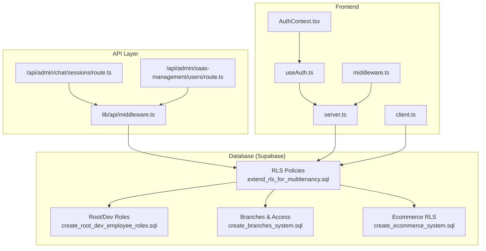
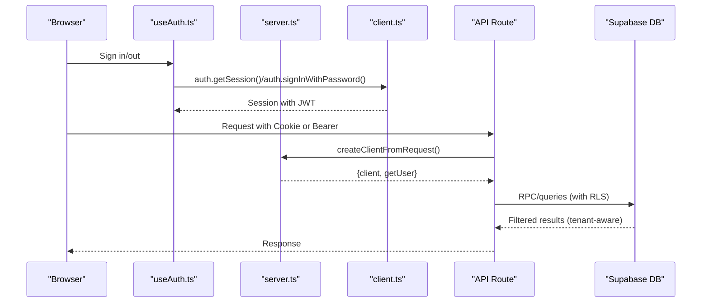
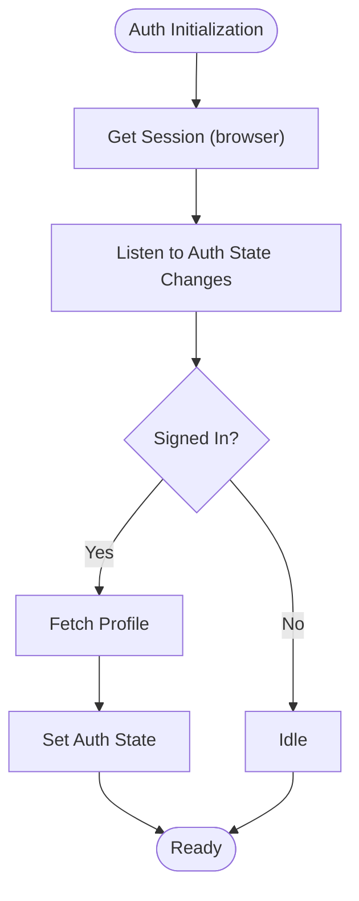
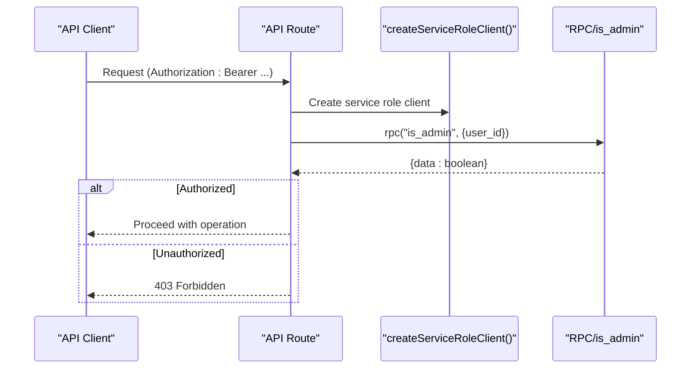
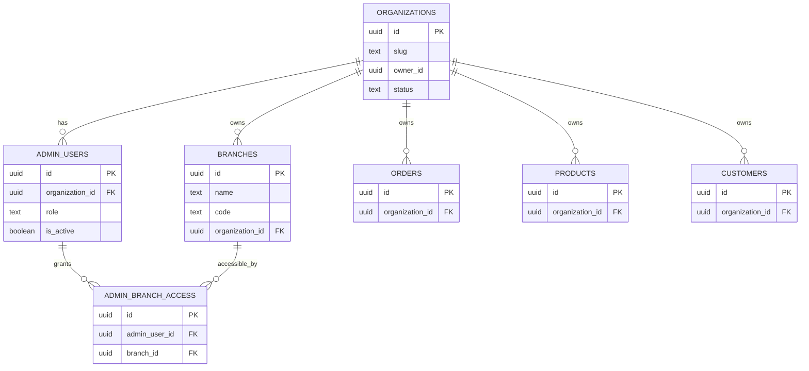
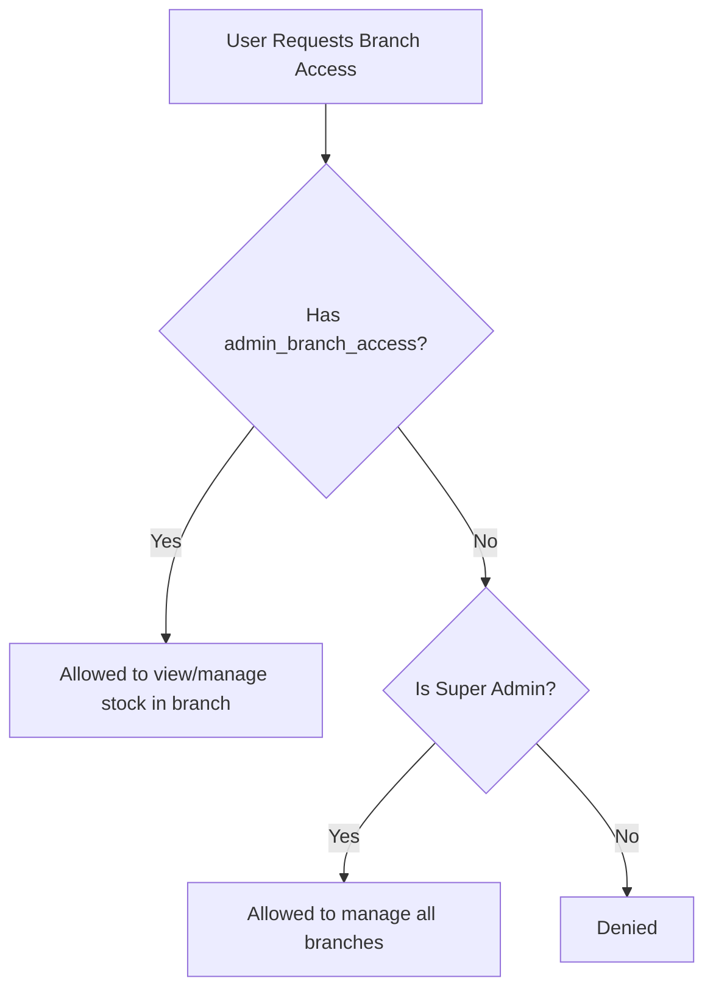
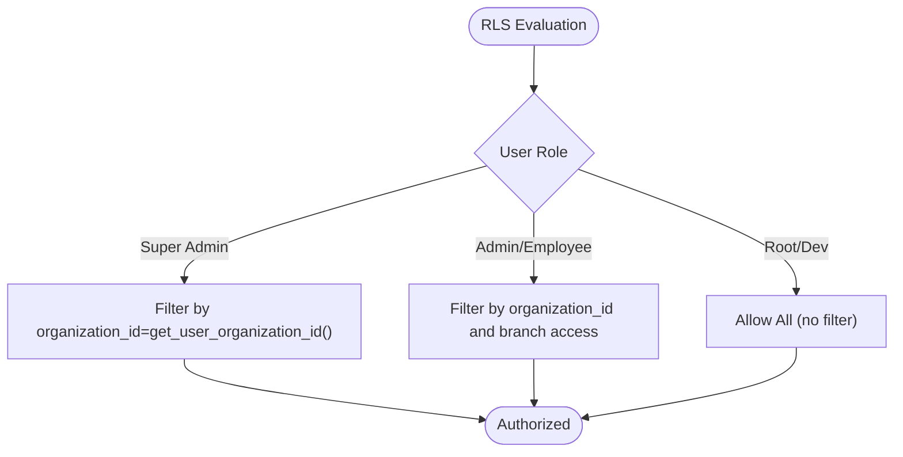
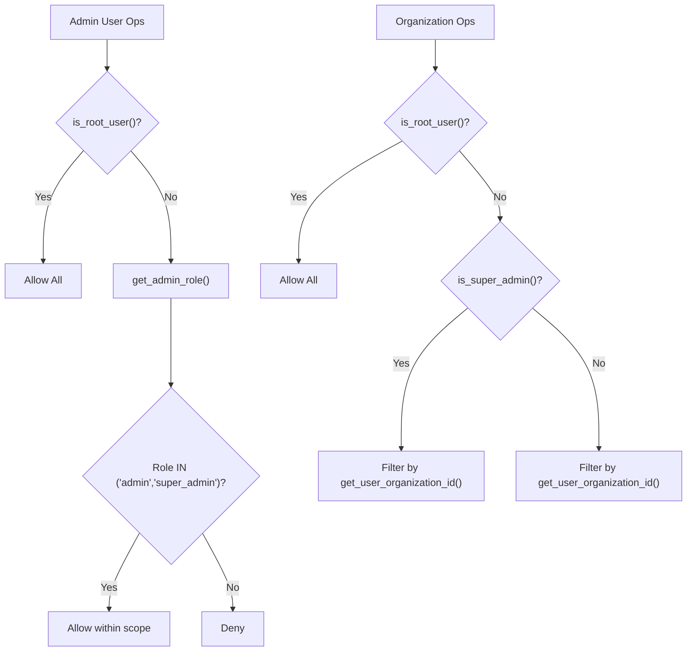
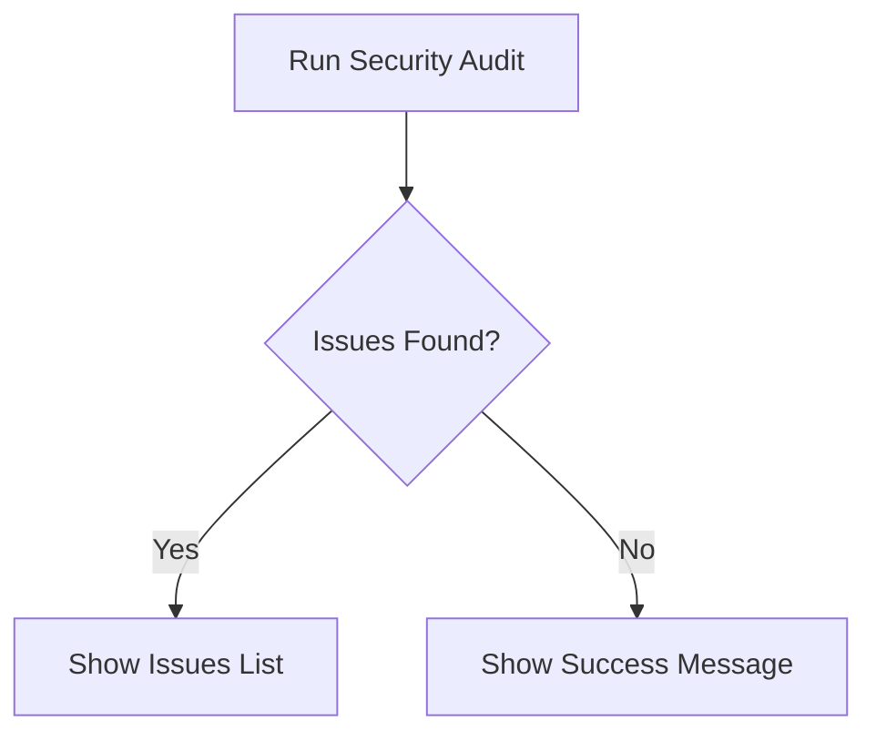
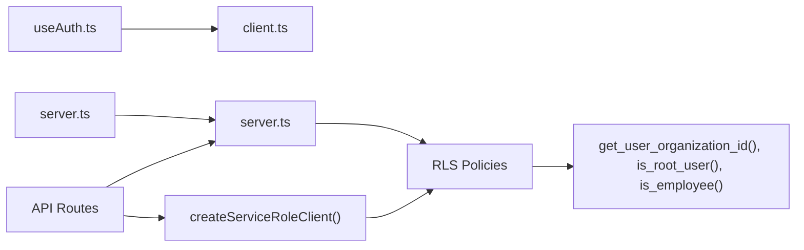

# Security & Access Control

<cite>
**Referenced Files in This Document**
- [supabase.ts](file://src/lib/supabase.ts)
- [server.ts](file://src/utils/supabase/server.ts)
- [client.ts](file://src/utils/supabase/client.ts)
- [AuthContext.tsx](file://src/contexts/AuthContext.tsx)
- [useAuth.ts](file://src/hooks/useAuth.ts)
- [middleware.ts](file://src/middleware.ts)
- [database.ts](file://src/types/database.ts)
- [20260128000001_extend_rls_for_multitenancy.sql](file://supabase/migrations/20260128000001_extend_rls_for_multitenancy.sql)
- [20260131000009_create_root_dev_employee_roles.sql](file://supabase/migrations/20260131000009_create_root_dev_employee_roles.sql)
- [20260131000010_fix_admin_users_rls_recursion.sql](file://supabase/migrations/20260131000010_fix_admin_users_rls_recursion.sql)
- [20251216000000_create_branches_system.sql](file://supabase/migrations/20251216000000_create_branches_system.sql)
- [20241220000001_create_ecommerce_system.sql](file://supabase/migrations/20241220000001_create_ecommerce_system.sql)
- [middleware.ts](file://src/lib/api/middleware.ts)
- [route.ts](file://src/app/api/admin/chat/sessions/route.ts)
- [route.ts](file://src/app/api/admin/saas-management/users/route.ts)
- [products.test.ts](file://src/__tests__/integration/api/products.test.ts)
- [customers.test.ts](file://src/__tests__/integration/api/customers.test.ts)
- [test-setup.ts](file://src/__tests__/integration/helpers/test-setup.ts)
- [page.tsx](file://src/app/admin/system/page.tsx)
- [page.backup.tsx](file://src/app/admin/system/page.backup.tsx)
- [20260128000000_create_organizations_and_subscriptions.sql](file://supabase/migrations/20260128000000_create_organizations_and_subscriptions.sql)
- [20250210000001_simplify_admin_roles.sql](file://supabase/migrations/20250210000001_simplify_admin_roles.sql)
- [SAAS_ONBOARDING_AND_NEW_USER_FLOW.md](file://docs/SAAS_ONBOARDING_AND_NEW_USER_FLOW.md)
</cite>

## Table of Contents

1. [Introduction](#introduction)
2. [Project Structure](#project-structure)
3. [Core Components](#core-components)
4. [Architecture Overview](#architecture-overview)
5. [Detailed Component Analysis](#detailed-component-analysis)
6. [Dependency Analysis](#dependency-analysis)
7. [Performance Considerations](#performance-considerations)
8. [Troubleshooting Guide](#troubleshooting-guide)
9. [Conclusion](#conclusion)
10. [Appendices](#appendices)

## Introduction

This document provides comprehensive security and access control documentation for the Opttius system with a focus on Row Level Security (RLS) policies and authorization mechanisms. It covers user roles, permissions, organization access controls, tenant isolation, branch-level access, and role-based restrictions. It also explains authentication flows, session management, token-based authorization, policy evaluation, access control decision trees, audit logging, multi-tenant data isolation, cross-tenant protection, privilege escalation prevention, and implementation patterns for dynamic policy evaluation and runtime access control.

## Project Structure

Security and access control span frontend authentication, middleware, API routes, and backend database RLS policies. The key areas include:

- Frontend authentication and session management
- Supabase client utilities for browser and server
- Middleware enforcing basic access checks
- API routes with role-based authorization and service role clients
- Database RLS policies for multi-tenancy and branch-level access
- Tests validating multi-tenant isolation

**Diagram sources**

- [AuthContext.tsx](file://src/contexts/AuthContext.tsx#L1-L71)
- [useAuth.ts](file://src/hooks/useAuth.ts#L1-L377)
- [middleware.ts](file://src/middleware.ts#L1-L109)
- [server.ts](file://src/utils/supabase/server.ts#L1-L110)
- [client.ts](file://src/utils/supabase/client.ts#L1-L8)
- [route.ts](file://src/app/api/admin/chat/sessions/route.ts#L123-L263)
- [route.ts](file://src/app/api/admin/saas-management/users/route.ts#L73-L117)
- [middleware.ts](file://src/lib/api/middleware.ts#L184-L229)
- [20260128000001_extend_rls_for_multitenancy.sql](file://supabase/migrations/20260128000001_extend_rls_for_multitenancy.sql#L1-L200)
- [20260131000009_create_root_dev_employee_roles.sql](file://supabase/migrations/20260131000009_create_root_dev_employee_roles.sql#L1-L158)
- [20251216000000_create_branches_system.sql](file://supabase/migrations/20251216000000_create_branches_system.sql#L225-L282)
- [20241220000001_create_ecommerce_system.sql](file://supabase/migrations/20241220000001_create_ecommerce_system.sql#L235-L269)

**Section sources**

- [supabase.ts](file://src/lib/supabase.ts#L1-L36)
- [server.ts](file://src/utils/supabase/server.ts#L1-L110)
- [client.ts](file://src/utils/supabase/client.ts#L1-L8)
- [AuthContext.tsx](file://src/contexts/AuthContext.tsx#L1-L71)
- [useAuth.ts](file://src/hooks/useAuth.ts#L1-L377)
- [middleware.ts](file://src/middleware.ts#L1-L109)
- [20260128000001_extend_rls_for_multitenancy.sql](file://supabase/migrations/20260128000001_extend_rls_for_multitenancy.sql#L1-L200)
- [20260131000009_create_root_dev_employee_roles.sql](file://supabase/migrations/20260131000009_create_root_dev_employee_roles.sql#L1-L158)
- [20251216000000_create_branches_system.sql](file://supabase/migrations/20251216000000_create_branches_system.sql#L225-L282)
- [20241220000001_create_ecommerce_system.sql](file://supabase/migrations/20241220000001_create_ecommerce_system.sql#L235-L269)

## Core Components

- Authentication and session management via Supabase browser and server clients
- Role-based authorization using admin_users and service role bypass
- Multi-tenant isolation via organization_id and get_user_organization_id()
- Branch-level access control via admin_branch_access and branch policies
- RLS policies across orders, quotes, lab_work_orders, appointments, products, customers, and branches
- Audit and validation surfaces in admin system pages

**Section sources**

- [supabase.ts](file://src/lib/supabase.ts#L1-L36)
- [server.ts](file://src/utils/supabase/server.ts#L1-L110)
- [client.ts](file://src/utils/supabase/client.ts#L1-L8)
- [AuthContext.tsx](file://src/contexts/AuthContext.tsx#L1-L71)
- [useAuth.ts](file://src/hooks/useAuth.ts#L1-L377)
- [20260128000001_extend_rls_for_multitenancy.sql](file://supabase/migrations/20260128000001_extend_rls_for_multitenancy.sql#L1-L200)
- [20260131000009_create_root_dev_employee_roles.sql](file://supabase/migrations/20260131000009_create_root_dev_employee_roles.sql#L1-L158)
- [20251216000000_create_branches_system.sql](file://supabase/migrations/20251216000000_create_branches_system.sql#L225-L282)
- [page.tsx](file://src/app/admin/system/page.tsx#L548-L591)
- [page.backup.tsx](file://src/app/admin/system/page.backup.tsx#L1770-L1798)

## Architecture Overview

The system enforces tenant isolation and role-based access at the database level using RLS. Frontend authentication is handled by Supabase, while API routes enforce authorization using service role clients to bypass RLS for administrative checks. Middleware performs basic access checks for admin layouts. Tests validate multi-tenant data isolation.

**Diagram sources**

- [useAuth.ts](file://src/hooks/useAuth.ts#L1-L377)
- [server.ts](file://src/utils/supabase/server.ts#L43-L92)
- [client.ts](file://src/utils/supabase/client.ts#L1-L8)
- [route.ts](file://src/app/api/admin/chat/sessions/route.ts#L157-L231)
- [20260128000001_extend_rls_for_multitenancy.sql](file://supabase/migrations/20260128000001_extend_rls_for_multitenancy.sql#L118-L171)

## Detailed Component Analysis

### Authentication and Session Management

- Browser client creation and session persistence
- Server-side client with cookie handling and optional Bearer token fallback
- Auth context and hook for user state, profile fetching, and auth actions
- Middleware cookie-based access checks for admin routes

**Diagram sources**

- [useAuth.ts](file://src/hooks/useAuth.ts#L27-L130)
- [AuthContext.tsx](file://src/contexts/AuthContext.tsx#L28-L36)

**Section sources**

- [supabase.ts](file://src/lib/supabase.ts#L1-L36)
- [server.ts](file://src/utils/supabase/server.ts#L6-L33)
- [client.ts](file://src/utils/supabase/client.ts#L1-L8)
- [AuthContext.tsx](file://src/contexts/AuthContext.tsx#L1-L71)
- [useAuth.ts](file://src/hooks/useAuth.ts#L1-L377)
- [middleware.ts](file://src/middleware.ts#L14-L95)

### Role-Based Authorization and Token-Based Access

- Service role client to bypass RLS for administrative checks
- requireRole and requireRoot helpers for API routes
- Bearer token support in server client for tests and programmatic access
- Admin RPC checks (e.g., is_admin) integrated in API routes

**Diagram sources**

- [middleware.ts](file://src/lib/api/middleware.ts#L184-L229)
- [route.ts](file://src/app/api/admin/chat/sessions/route.ts#L233-L263)
- [server.ts](file://src/utils/supabase/server.ts#L94-L109)

**Section sources**

- [middleware.ts](file://src/lib/api/middleware.ts#L184-L229)
- [route.ts](file://src/app/api/admin/chat/sessions/route.ts#L233-L263)
- [server.ts](file://src/utils/supabase/server.ts#L43-L92)

### Multi-Tenant Data Isolation and Tenant Roles

- Organization-level isolation via organization_id and get_user_organization_id()
- Root/dev roles for SaaS-level management; super_admin for organization; admin/employee for branch-level operations
- Policies applied to branches, orders, quotes, lab_work_orders, appointments, products, and customers

**Diagram sources**

- [20260128000000_create_organizations_and_subscriptions.sql](file://supabase/migrations/20260128000000_create_organizations_and_subscriptions.sql#L26-L59)
- [20260128000001_extend_rls_for_multitenancy.sql](file://supabase/migrations/20260128000001_extend_rls_for_multitenancy.sql#L24-L58)
- [20260131000009_create_root_dev_employee_roles.sql](file://supabase/migrations/20260131000009_create_root_dev_employee_roles.sql#L30-L66)
- [20251216000000_create_branches_system.sql](file://supabase/migrations/20251216000000_create_branches_system.sql#L247-L282)

**Section sources**

- [20260128000001_extend_rls_for_multitenancy.sql](file://supabase/migrations/20260128000001_extend_rls_for_multitenancy.sql#L1-L200)
- [20260131000009_create_root_dev_employee_roles.sql](file://supabase/migrations/20260131000009_create_root_dev_employee_roles.sql#L1-L158)
- [20251216000000_create_branches_system.sql](file://supabase/migrations/20251216000000_create_branches_system.sql#L225-L282)
- [SAAS_ONBOARDING_AND_NEW_USER_FLOW.md](file://docs/SAAS_ONBOARDING_AND_NEW_USER_FLOW.md#L119-L154)

### Branch-Level Access Controls

- Branch visibility and management policies depend on role and organization
- Admin_branch_access grants specific branch access to users
- Product branch stock visibility depends on granted branch access

**Diagram sources**

- [20251216000000_create_branches_system.sql](file://supabase/migrations/20251216000000_create_branches_system.sql#L247-L282)
- [20260128000001_extend_rls_for_multitenancy.sql](file://supabase/migrations/20260128000001_extend_rls_for_multitenancy.sql#L65-L116)

**Section sources**

- [20251216000000_create_branches_system.sql](file://supabase/migrations/20251216000000_create_branches_system.sql#L225-L282)
- [20260128000001_extend_rls_for_multitenancy.sql](file://supabase/migrations/20260128000001_extend_rls_for_multitenancy.sql#L65-L116)

### RLS Policy Implementation Across Tables

- Orders, quotes, lab_work_orders, appointments, products, customers, and branches are extended with organization_id and corresponding RLS policies
- Policies differentiate root/dev, super_admin, and admin/employee scopes
- Legacy ecommerce policies (cart_items, orders, order_items) remain for anonymous and authenticated users

**Diagram sources**

- [20260128000001_extend_rls_for_multitenancy.sql](file://supabase/migrations/20260128000001_extend_rls_for_multitenancy.sql#L118-L390)
- [20241220000001_create_ecommerce_system.sql](file://supabase/migrations/20241220000001_create_ecommerce_system.sql#L240-L269)

**Section sources**

- [20260128000001_extend_rls_for_multitenancy.sql](file://supabase/migrations/20260128000001_extend_rls_for_multitenancy.sql#L118-L390)
- [20241220000001_create_ecommerce_system.sql](file://supabase/migrations/20241220000001_create_ecommerce_system.sql#L240-L269)

### Access Control Decision Trees

- Admin user management: root/dev can manage all; others depend on get_admin_role() to avoid recursion
- Organization access: root/dev can view/manage all; super_admin sees only their organization; others see their organization
- Branch access: super_admin can manage all; organization admins manage their branches; employees depend on admin_branch_access

**Diagram sources**

- [20260131000010_fix_admin_users_rls_recursion.sql](file://supabase/migrations/20260131000010_fix_admin_users_rls_recursion.sql#L28-L67)
- [20260131000009_create_root_dev_employee_roles.sql](file://supabase/migrations/20260131000009_create_root_dev_employee_roles.sql#L68-L91)
- [20260128000001_extend_rls_for_multitenancy.sql](file://supabase/migrations/20260128000001_extend_rls_for_multitenancy.sql#L118-L171)

**Section sources**

- [20260131000010_fix_admin_users_rls_recursion.sql](file://supabase/migrations/20260131000010_fix_admin_users_rls_recursion.sql#L28-L67)
- [20260131000009_create_root_dev_employee_roles.sql](file://supabase/migrations/20260131000009_create_root_dev_employee_roles.sql#L68-L91)
- [20260128000001_extend_rls_for_multitenancy.sql](file://supabase/migrations/20260128000001_extend_rls_for_multitenancy.sql#L118-L171)

### Audit Logging and Validation

- Admin system pages display security audit results and issue counts
- Tests validate multi-tenant isolation across customers and products

**Diagram sources**

- [page.tsx](file://src/app/admin/system/page.tsx#L548-L591)
- [page.backup.tsx](file://src/app/admin/system/page.backup.tsx#L1770-L1798)
- [products.test.ts](file://src/__tests__/integration/api/products.test.ts#L81-L88)
- [customers.test.ts](file://src/__tests__/integration/api/customers.test.ts#L81-L84)

**Section sources**

- [page.tsx](file://src/app/admin/system/page.tsx#L548-L591)
- [page.backup.tsx](file://src/app/admin/system/page.backup.tsx#L1770-L1798)
- [products.test.ts](file://src/__tests__/integration/api/products.test.ts#L81-L88)
- [customers.test.ts](file://src/__tests__/integration/api/customers.test.ts#L81-L84)

## Dependency Analysis

- Frontend auth depends on Supabase browser client; server-side routes depend on Supabase SSR client
- API routes depend on service role client for administrative checks
- Database RLS policies depend on helper functions (get_user_organization_id, is_root_user, is_employee) and admin_users role constraints
- Tests depend on Supabase SSR cookie format and Bearer token injection

**Diagram sources**

- [useAuth.ts](file://src/hooks/useAuth.ts#L1-L377)
- [client.ts](file://src/utils/supabase/client.ts#L1-L8)
- [server.ts](file://src/utils/supabase/server.ts#L1-L110)
- [route.ts](file://src/app/api/admin/chat/sessions/route.ts#L157-L231)
- [20260128000001_extend_rls_for_multitenancy.sql](file://supabase/migrations/20260128000001_extend_rls_for_multitenancy.sql#L5-L22)

**Section sources**

- [server.ts](file://src/utils/supabase/server.ts#L1-L110)
- [middleware.ts](file://src/lib/api/middleware.ts#L184-L229)
- [20260128000001_extend_rls_for_multitenancy.sql](file://supabase/migrations/20260128000001_extend_rls_for_multitenancy.sql#L5-L22)

## Performance Considerations

- Use service role client judiciously to bypass RLS for administrative checks; avoid excessive use in hot paths
- Cache short-lived administrative checks (e.g., is_root_user) with appropriate TTLs
- Ensure database indexes on organization_id and branch_id for efficient filtering
- Prefer server-side client with cookie handling for production; reserve Bearer token mode for testing

## Troubleshooting Guide

Common issues and resolutions:

- Unauthorized access errors: Verify user role and organization membership; ensure get_user_organization_id resolves correctly
- Recursion in RLS: Use SECURITY DEFINER functions (e.g., get_admin_role) to avoid recursion
- Missing organization_id: Ensure organization_id is populated for data tables and indexes exist
- Branch access denied: Confirm admin_branch_access entries and branch_id ownership within organization
- Session cookie problems: Validate projectRef format and cookie name sb-{projectRef}-auth-token

**Section sources**

- [20260131000010_fix_admin_users_rls_recursion.sql](file://supabase/migrations/20260131000010_fix_admin_users_rls_recursion.sql#L28-L67)
- [20260128000001_extend_rls_for_multitenancy.sql](file://supabase/migrations/20260128000001_extend_rls_for_multitenancy.sql#L24-L58)
- [middleware.ts](file://src/middleware.ts#L45-L95)
- [test-setup.ts](file://src/__tests__/integration/helpers/test-setup.ts#L504-L576)

## Conclusion

Opttius implements robust multi-tenant security through Supabase RLS, role-based authorization, and branch-level access controls. The system separates root/dev (SaaS), super_admin (organization), and admin/employee (branch) privileges, ensuring strong tenant isolation and preventing privilege escalation. API routes leverage service role clients for administrative checks, while frontend auth and middleware provide seamless user experiences. Continuous auditing and integration tests help maintain security posture.

## Appendices

- API access patterns: Use Bearer tokens for programmatic access; rely on cookies for browser flows
- Database connection: Prefer service role client for admin operations; regular client for user-facing queries
- Sensitive data protection: RLS filters data by organization and branch; ensure proper indexing and role constraints
