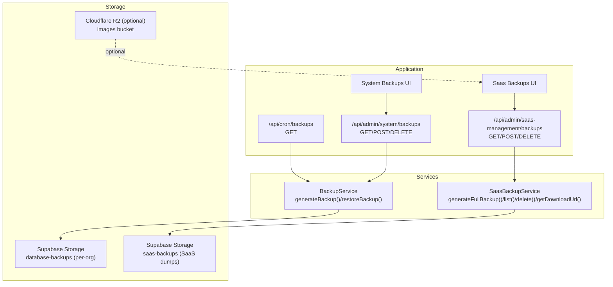
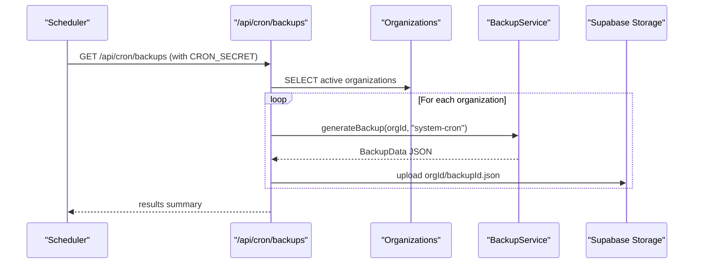
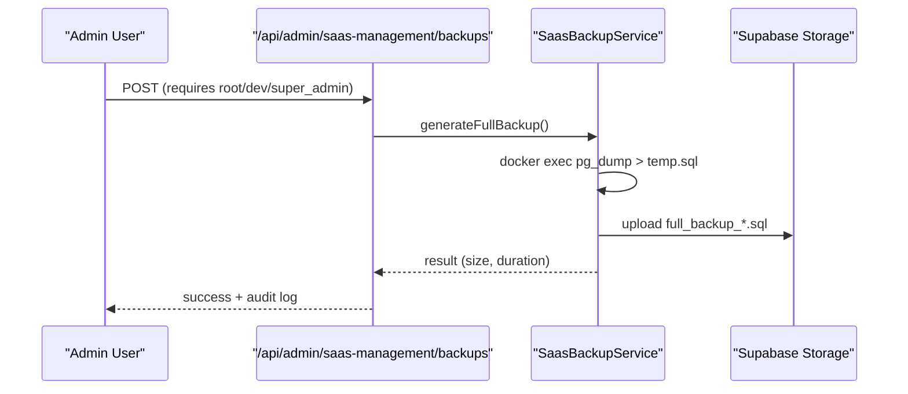
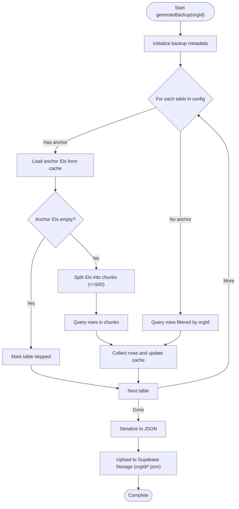
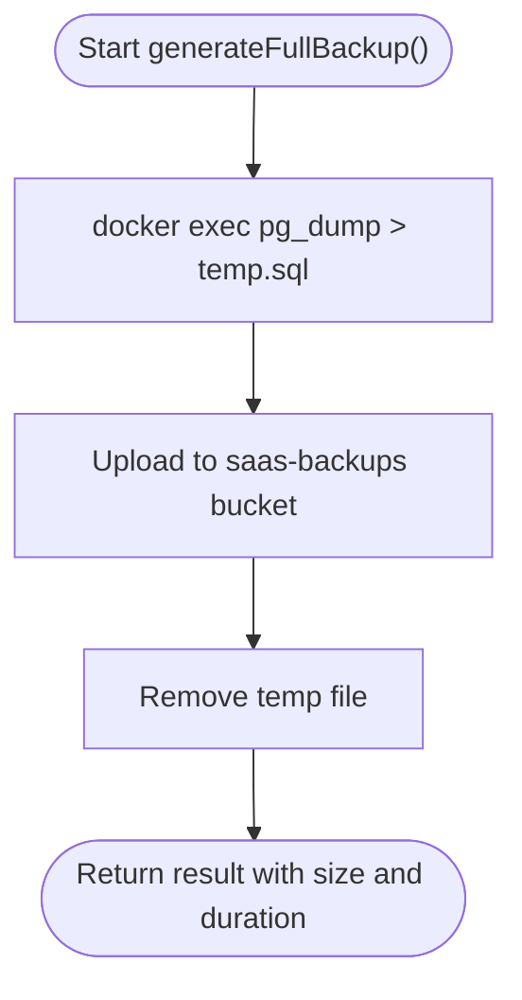
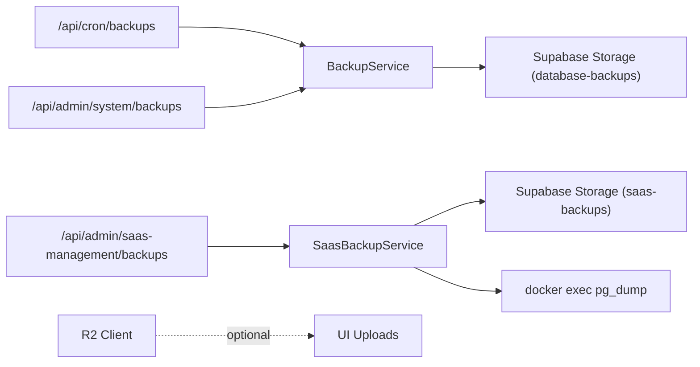

# Backup & Disaster Recovery

<cite>
**Referenced Files in This Document**
- [backup-service.ts](file://src/lib/backup-service.ts)
- [saas-backup-service.ts](file://src/lib/saas-backup-service.ts)
- [route.ts (cron backups)](file://src/app/api/cron/backups/route.ts)
- [route.ts (system backups)](file://src/app/api/admin/system/backups/route.ts)
- [route.ts (saas-management backups)](file://src/app/api/admin/saas-management/backups/route.ts)
- [page.tsx (saas-management backups UI)](file://src/app/admin/saas-management/backups/page.tsx)
- [vercel.json](file://vercel.json)
- [.env.local](file://.env.local)
- [client.ts (R2 client)](file://src/lib/r2/client.ts)
- [SAAS_BACKUP_SYSTEM.md](file://docs/SAAS_BACKUP_SYSTEM.md)
- [CLOUDFLARE_R2_IMPLEMENTATION_PLAN.md](file://docs/CLOUDFLARE_R2_IMPLEMENTATION_PLAN.md)
- [test-backup-isolation.js](file://scripts/test-backup-isolation.js)
- [page.tsx (system backups UI summary)](file://src/app/admin/system/page.tsx)
</cite>

## Table of Contents

1. [Introduction](#introduction)
2. [Project Structure](#project-structure)
3. [Core Components](#core-components)
4. [Architecture Overview](#architecture-overview)
5. [Detailed Component Analysis](#detailed-component-analysis)
6. [Dependency Analysis](#dependency-analysis)
7. [Performance Considerations](#performance-considerations)
8. [Troubleshooting Guide](#troubleshooting-guide)
9. [Conclusion](#conclusion)
10. [Appendices](#appendices)

## Introduction

This document defines the comprehensive backup and disaster recovery strategy for Opttius. It covers:

- Backup strategy for application data and user-generated content
- Automated backup schedules and retention policies
- Disaster recovery procedures, restoration, system recovery, and continuity plans
- Backup verification, testing, and recovery objectives
- Multi-region considerations, encryption at rest and in transit, and compliance
- Backup service architecture, storage management, and cost optimization
- Incremental vs full backups, compression, and restore point objectives

## Project Structure

Opttius implements two complementary backup systems:

- Organization-level relational backups (partial, relation-aware)
- SaaS-level full database dumps (100%, SQL native)

**Diagram sources**

- [route.ts (cron backups)](file://src/app/api/cron/backups/route.ts#L1-L98)
- [route.ts (system backups)](file://src/app/api/admin/system/backups/route.ts#L1-L295)
- [route.ts (saas-management backups)](file://src/app/api/admin/saas-management/backups/route.ts#L1-L115)
- [backup-service.ts](file://src/lib/backup-service.ts#L84-L224)
- [saas-backup-service.ts](file://src/lib/saas-backup-service.ts#L20-L134)
- [client.ts (R2 client)](file://src/lib/r2/client.ts#L1-L54)

**Section sources**

- [route.ts (cron backups)](file://src/app/api/cron/backups/route.ts#L1-L98)
- [route.ts (system backups)](file://src/app/api/admin/system/backups/route.ts#L1-L295)
- [route.ts (saas-management backups)](file://src/app/api/admin/saas-management/backups/route.ts#L1-L115)
- [backup-service.ts](file://src/lib/backup-service.ts#L84-L224)
- [saas-backup-service.ts](file://src/lib/saas-backup-service.ts#L20-L134)
- [client.ts (R2 client)](file://src/lib/r2/client.ts#L1-L54)

## Core Components

- BackupService: Generates and restores organization-scoped relational backups. It traverses a predefined table hierarchy, respecting foreign-key anchors and organization filters, and performs batched upserts during restore.
- SaasBackupService: Produces full database dumps using pg_dump against the internal database container and stores them in a dedicated SaaS bucket. Provides listing, deletion, and signed URL generation for downloads.
- Cron orchestration: A scheduled job triggers organization backups and uploads them to per-organization folders in Supabase Storage.
- API surface: Role-gated endpoints for listing, restoring, deleting, and generating SaaS dumps; plus UI pages for administration.

Key capabilities:

- Relational backup fidelity with conflict resolution via upsert
- Full database dump with native SQL format
- Signed URL-based secure downloads
- Audit logging via RPC calls
- Environment-driven secrets and multi-region readiness

**Section sources**

- [backup-service.ts](file://src/lib/backup-service.ts#L84-L224)
- [saas-backup-service.ts](file://src/lib/saas-backup-service.ts#L20-L134)
- [route.ts (cron backups)](file://src/app/api/cron/backups/route.ts#L1-L98)
- [route.ts (system backups)](file://src/app/api/admin/system/backups/route.ts#L1-L295)
- [route.ts (saas-management backups)](file://src/app/api/admin/saas-management/backups/route.ts#L1-L115)

## Architecture Overview

The backup architecture separates operational (per-organization) and enterprise (SaaS) concerns:

- Operational backups capture relational subsets per organization with strict isolation.
- SaaS backups capture the entire database for disaster recovery and fleet-level continuity.

**Diagram sources**

- [vercel.json](file://vercel.json#L2-L6)
- [route.ts (cron backups)](file://src/app/api/cron/backups/route.ts#L11-L98)
- [backup-service.ts](file://src/lib/backup-service.ts#L84-L140)

**Diagram sources**

- [route.ts (saas-management backups)](file://src/app/api/admin/saas-management/backups/route.ts#L52-L88)
- [saas-backup-service.ts](file://src/lib/saas-backup-service.ts#L25-L92)

## Detailed Component Analysis

### BackupService: Organization-Level Relational Backups

Responsibilities:

- Build a relational snapshot of an organization’s data by traversing a hierarchical table list
- Respect anchors to ensure referential integrity (e.g., child rows depend on parent IDs)
- Serialize to JSON and upload to per-organization folders
- Restore with batched upserts and conflict handling

Processing logic highlights:

- Table traversal respects filters and anchors; missing anchor IDs skip dependent tables
- Batched retrieval and insertion to avoid limits and improve throughput
- Conflict resolution via upsert on id

**Diagram sources**

- [backup-service.ts](file://src/lib/backup-service.ts#L84-L140)

**Section sources**

- [backup-service.ts](file://src/lib/backup-service.ts#L36-L82)
- [backup-service.ts](file://src/lib/backup-service.ts#L102-L140)

### SaasBackupService: Full Database Dumps

Responsibilities:

- Produce 100% database dumps using pg_dump executed inside the database container
- Store dumps in a private SaaS bucket
- Provide listing, deletion, and signed URL generation for secure downloads

Operational notes:

- Uses Docker to execute pg_dump against the internal database container
- Uploads to a dedicated SaaS bucket and cleans temporary files
- Returns structured results with timing and size metrics

**Diagram sources**

- [saas-backup-service.ts](file://src/lib/saas-backup-service.ts#L25-L92)

**Section sources**

- [saas-backup-service.ts](file://src/lib/saas-backup-service.ts#L20-L92)

### Cron Orchestration: Automated Organization Backups

- Scheduled via Vercel Cron to run weekly
- Authenticates with a shared secret
- Iterates active organizations and triggers per-organization backups
- Uploads artifacts to per-organization folders in Supabase Storage

**Section sources**

- [vercel.json](file://vercel.json#L2-L6)
- [route.ts (cron backups)](file://src/app/api/cron/backups/route.ts#L11-L98)

### System Backups API: Per-Organization Operations

- GET lists backups for the requesting admin’s organization
- POST restores a selected backup after validating ownership and parsing
- DELETE removes a backup file with audit logging
- Security: role checks, organization scoping, and signed URL creation for downloads

**Section sources**

- [route.ts (system backups)](file://src/app/api/admin/system/backups/route.ts#L10-L295)

### SaaS Backups API and UI

- GET lists SaaS dumps and optionally returns a signed URL for download
- POST triggers a full database dump with strict role checks and logs activity
- DELETE removes a dump with role restrictions
- UI provides controls to refresh, generate, download, and delete backups

**Section sources**

- [route.ts (saas-management backups)](file://src/app/api/admin/saas-management/backups/route.ts#L10-L115)
- [page.tsx (saas-management backups UI)](file://src/app/admin/saas-management/backups/page.tsx#L31-L125)

### Storage Management and Multi-Region Readiness

- Supabase Storage is used for both per-organization backups and SaaS dumps
- Optional Cloudflare R2 client is available for user-generated content (images), enabling multi-region and cost optimization for media assets
- R2 configuration supports fallback behavior when not configured

**Section sources**

- [client.ts (R2 client)](file://src/lib/r2/client.ts#L1-L54)
- [CLOUDFLARE_R2_IMPLEMENTATION_PLAN.md](file://docs/CLOUDFLARE_R2_IMPLEMENTATION_PLAN.md#L1-L256)

## Dependency Analysis

- BackupService depends on Supabase client and table configuration
- SaasBackupService depends on Docker execution and Supabase Storage
- APIs depend on role-checking RPCs and admin user context
- Cron relies on environment secrets and Vercel Cron configuration

**Diagram sources**

- [route.ts (cron backups)](file://src/app/api/cron/backups/route.ts#L1-L98)
- [route.ts (system backups)](file://src/app/api/admin/system/backups/route.ts#L1-L295)
- [route.ts (saas-management backups)](file://src/app/api/admin/saas-management/backups/route.ts#L1-L115)
- [backup-service.ts](file://src/lib/backup-service.ts#L84-L224)
- [saas-backup-service.ts](file://src/lib/saas-backup-service.ts#L20-L134)
- [client.ts (R2 client)](file://src/lib/r2/client.ts#L1-L54)

**Section sources**

- [route.ts (cron backups)](file://src/app/api/cron/backups/route.ts#L1-L98)
- [route.ts (system backups)](file://src/app/api/admin/system/backups/route.ts#L1-L295)
- [route.ts (saas-management backups)](file://src/app/api/admin/saas-management/backups/route.ts#L1-L115)
- [backup-service.ts](file://src/lib/backup-service.ts#L84-L224)
- [saas-backup-service.ts](file://src/lib/saas-backup-service.ts#L20-L134)
- [client.ts (R2 client)](file://src/lib/r2/client.ts#L1-L54)

## Performance Considerations

- Batched inserts: Restore batches rows to reduce transaction overhead and respect service limits
- Chunked queries: Anchors are queried in chunks to avoid query limits
- Sequential processing: Cron iterates organizations sequentially to avoid DB contention
- Compression: Full dumps are native SQL; consider external compression if needed
- Cost optimization: Use R2 for media assets to reduce bandwidth costs; keep database backups in Supabase Storage for simplicity

[No sources needed since this section provides general guidance]

## Troubleshooting Guide

Common issues and resolutions:

- Unauthorized or forbidden requests: Verify role checks and authentication tokens
- Missing organization context: Ensure admin user belongs to a valid organization
- Backup file ownership: Requests must target files under the user’s organization prefix
- Restore conflicts: Upserts resolve duplicates; monitor error counts in restore results
- SaaS dump failures: Confirm Docker availability and database container connectivity
- Isolation breaches: Double-check organization scoping and file path validation

Verification steps:

- Use the isolation test script to validate per-organization file structure
- Inspect UI summaries for successful restore outcomes and safety backup IDs

**Section sources**

- [route.ts (system backups)](file://src/app/api/admin/system/backups/route.ts#L54-L295)
- [route.ts (saas-management backups)](file://src/app/api/admin/saas-management/backups/route.ts#L52-L115)
- [test-backup-isolation.js](file://scripts/test-backup-isolation.js#L1-L47)
- [page.tsx (system backups UI summary)](file://src/app/admin/system/page.tsx#L1063-L1091)

## Conclusion

Opttius employs a robust dual backup strategy:

- Relational backups per organization for operational continuity
- Full database dumps for enterprise disaster recovery

With role-based access, signed downloads, audit logging, and optional multi-region storage for user-generated content, the system balances security, reliability, and cost-effectiveness. Automated scheduling and clear restoration procedures support business continuity goals.

[No sources needed since this section summarizes without analyzing specific files]

## Appendices

### Backup Strategy and Retention Policies

- Organization backups: Weekly via Cron; retain per-organization JSON snapshots for recovery windows aligned with operational needs
- SaaS dumps: On-demand and/or periodic; maintain a small set of recent full dumps for fleet-level recovery
- Retention: Align with regulatory and business requirements; implement lifecycle policies to archive or delete older backups

[No sources needed since this section provides general guidance]

### Disaster Recovery Procedures

- Data restoration: Use per-organization restore API to recover relational snapshots; verify counts and errors in results
- System recovery: Use SaaS dumps to rebuild the entire database; validate integrity and re-attach media assets from R2 if applicable
- Service continuity: Keep R2 enabled for media resilience; monitor restore durations and adjust batch sizes accordingly

[No sources needed since this section provides general guidance]

### Backup Verification and Testing

- Verification: Parse backup JSON to compute total records and compare with expectations; validate signed URL accessibility
- Testing: Run isolation tests to confirm per-organization boundaries; simulate restore flows and measure duration

**Section sources**

- [route.ts (system backups)](file://src/app/api/admin/system/backups/route.ts#L54-L127)
- [test-backup-isolation.js](file://scripts/test-backup-isolation.js#L1-L47)

### Encryption and Compliance

- At-rest encryption: Leverage Supabase Storage encryption defaults
- In-transit encryption: Use HTTPS for all API endpoints and signed URL downloads
- Compliance: Maintain audit logs via RPC; restrict access to SaaS dumps to root/dev/super_admin roles

**Section sources**

- [route.ts (saas-management backups)](file://src/app/api/admin/saas-management/backups/route.ts#L52-L88)
- [SAAS_BACKUP_SYSTEM.md](file://docs/SAAS_BACKUP_SYSTEM.md#L12-L21)

### Multi-Region and Cost Optimization

- Multi-region: Use R2 for media assets to improve latency and reduce bandwidth costs; enable public URLs for efficient delivery
- Cost optimization: Prefer R2 for images; keep database backups in Supabase Storage for operational simplicity

**Section sources**

- [client.ts (R2 client)](file://src/lib/r2/client.ts#L1-L54)
- [CLOUDFLARE_R2_IMPLEMENTATION_PLAN.md](file://docs/CLOUDFLARE_R2_IMPLEMENTATION_PLAN.md#L1-L256)

### Incremental vs Full Backups and Restore Point Objectives

- Current implementation: Full dumps for SaaS; relational snapshots for organizations
- Restore point objectives: Define acceptable RPO/RTO targets; align backup frequency and batch sizes to meet SLAs
- Compression: Consider compressing full dumps externally if storage or transfer bandwidth is constrained

[No sources needed since this section provides general guidance]
