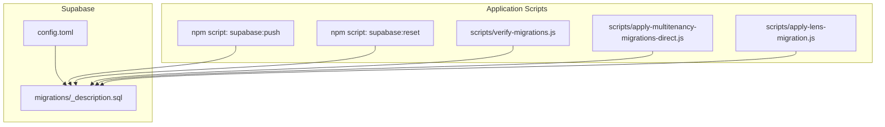
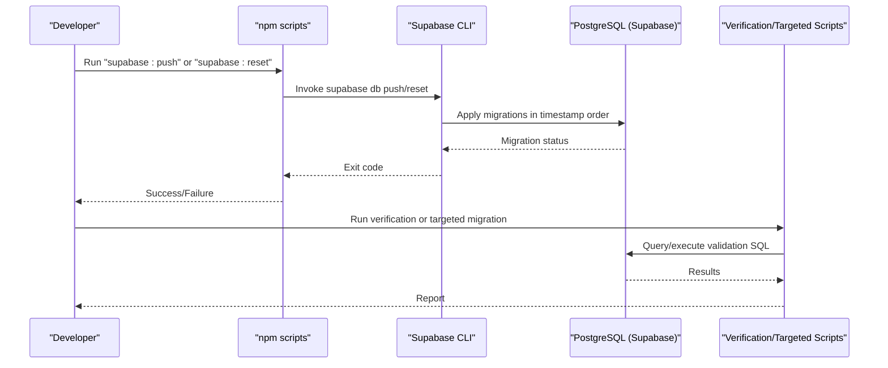
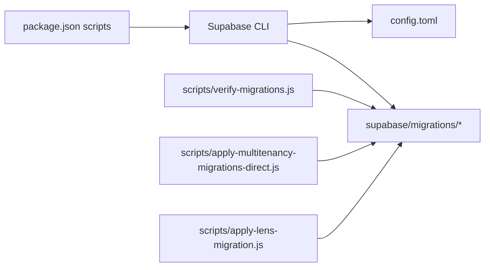

# Database Migrations & Management

<cite>
**Referenced Files in This Document**
- [config.toml](file://supabase/config.toml)
- [20241220000000_create_user_profiles.sql](file://supabase/migrations/20241220000000_create_user_profiles.sql)
- [20250116000000_setup_admin_users.sql](file://supabase/migrations/20250116000000_setup_admin_users.sql)
- [20250120000001_remove_reviews_system.sql](file://supabase/migrations/2025012001_remove_reviews_system.sql)
- [20250124000001_make_email_optional.sql](file://supabase/migrations/20250124000001_make_email_optional.sql)
- [20260128000000_create_organizations_and_subscriptions.sql](file://supabase/migrations/20260128000000_create_organizations_and_subscriptions.sql)
- [20260128000001_extend_rls_for_multitenancy.sql](file://supabase/migrations/20260128000001_extend_rls_for_multitenancy.sql)
- [20260129000000_create_lens_families_and_matrices.sql](file://supabase/migrations/20260129000000_create_lens_families_and_matrices.sql)
- [verify-migrations.js](file://scripts/verify-migrations.js)
- [apply-multitenancy-migrations-direct.js](file://scripts/apply-multitenancy-migrations-direct.js)
- [apply-lens-migration.js](file://scripts/apply-lens-migration.js)
- [verify-admin-branches-completeness.js](file://scripts/verify-admin-branches-completeness.js)
- [package.json](file://package.json)
</cite>

## Table of Contents

1. [Introduction](#introduction)
2. [Project Structure](#project-structure)
3. [Core Components](#core-components)
4. [Architecture Overview](#architecture-overview)
5. [Detailed Component Analysis](#detailed-component-analysis)
6. [Dependency Analysis](#dependency-analysis)
7. [Performance Considerations](#performance-considerations)
8. [Troubleshooting Guide](#troubleshooting-guide)
9. [Conclusion](#conclusion)

## Introduction

This document explains the database migration and management system for Opttius, built on Supabase. It covers the migration workflow from development to production, including file organization, version control, execution procedures, and rollback strategies. It also details schema evolution, breaking changes, data transformations, backward compatibility, testing/validation, and the relationship between Supabase migrations and the application’s data model, including Row Level Security (RLS) and triggers.

## Project Structure

Supabase migrations live under the supabase/migrations directory and are named with a strict timestamp prefix to define execution order. Supabase CLI configuration is centralized in supabase/config.toml. Application-level scripts for targeted migration execution and verification live under scripts/.

**Diagram sources**

- [config.toml](file://supabase/config.toml#L48-L60)
- [package.json](file://package.json#L13-L20)

**Section sources**

- [config.toml](file://supabase/config.toml#L48-L60)
- [package.json](file://package.json#L13-L20)

## Core Components

- Supabase configuration: Defines migration and seeding behavior, database ports, and schema exposure.
- Migration files: Ordered SQL scripts implementing schema changes, RLS policies, triggers, and indexes.
- Verification scripts: Validate applied migrations and data model correctness.
- Targeted migration runners: Utility scripts to apply specific subsets of migrations in controlled environments.

Key responsibilities:

- Enforce deterministic schema evolution via timestamped migrations.
- Maintain backward compatibility and safe transformations.
- Provide robust RLS and triggers for application logic.
- Offer validation and troubleshooting automation.

**Section sources**

- [config.toml](file://supabase/config.toml#L48-L60)
- [20241220000000_create_user_profiles.sql](file://supabase/migrations/20241220000000_create_user_profiles.sql#L1-L82)
- [20250116000000_setup_admin_users.sql](file://supabase/migrations/20250116000000_setup_admin_users.sql#L1-L280)
- [20260128000000_create_organizations_and_subscriptions.sql](file://supabase/migrations/20260128000000_create_organizations_and_subscriptions.sql#L1-L287)
- [20260128000001_extend_rls_for_multitenancy.sql](file://supabase/migrations/20260128000001_extend_rls_for_multitenancy.sql#L1-L427)
- [20260129000000_create_lens_families_and_matrices.sql](file://supabase/migrations/20260129000000_create_lens_families_and_matrices.sql#L1-L222)
- [verify-migrations.js](file://scripts/verify-migrations.js#L1-L70)
- [apply-multitenancy-migrations-direct.js](file://scripts/apply-multitenancy-migrations-direct.js#L1-L87)
- [apply-lens-migration.js](file://scripts/apply-lens-migration.js#L1-L88)

## Architecture Overview

The migration lifecycle integrates CLI commands, configuration, and application scripts:

**Diagram sources**

- [package.json](file://package.json#L13-L20)
- [config.toml](file://supabase/config.toml#L48-L60)

## Detailed Component Analysis

### Supabase Configuration and Execution Model

- Migrations enabled/disabled and schema paths are configured centrally.
- Seeds are enabled and loaded from a specified path during reset.
- CLI commands are exposed via npm scripts for consistent developer experience.

Operational implications:

- Use “supabase:push” to apply all migrations to local/remote databases.
- Use “supabase:reset” to drop/recreate and seed the database.
- Keep schema_paths empty to rely on filesystem ordering.

**Section sources**

- [config.toml](file://supabase/config.toml#L48-L60)
- [package.json](file://package.json#L13-L20)

### Migration Naming Conventions and Ordering

- Filenames use a strict timestamp prefix followed by a short description.
- Execution order is deterministic and enforced by the Supabase CLI.
- Example migrations demonstrate progressive evolution from user profiles to multi-tenancy.

Best practices:

- Always add a new timestamped file for schema changes.
- Use descriptive suffixes to clarify intent.
- Avoid renaming existing files to preserve order.

**Section sources**

- [20241220000000_create_user_profiles.sql](file://supabase/migrations/20241220000000_create_user_profiles.sql#L1-L82)
- [20250116000000_setup_admin_users.sql](file://supabase/migrations/20250116000000_setup_admin_users.sql#L1-L280)
- [20260128000000_create_organizations_and_subscriptions.sql](file://supabase/migrations/20260128000000_create_organizations_and_subscriptions.sql#L1-L287)

### User Profiles and Initial RLS

- Creates profiles table extending auth.users with address fields and membership metadata.
- Adds updated_at trigger and RLS policies allowing users to manage their own profiles.
- Includes a trigger to auto-create profiles on auth.user signup.

Backward compatibility:

- Existing users’ profiles are populated via trigger on auth.user creation.

**Section sources**

- [20241220000000_create_user_profiles.sql](file://supabase/migrations/20241220000000_create_user_profiles.sql#L1-L82)

### Admin Users and Activity Logging

- Introduces admin_users and admin_activity_log tables.
- Implements RLS policies to restrict visibility to active admin users.
- Provides helper functions to check admin status, roles, and log activities.
- Includes a trigger to auto-grant super admin access to a predefined email.

Backward compatibility:

- Uses DO blocks and ON CONFLICT handling to avoid breaking existing data.

**Section sources**

- [20250116000000_setup_admin_users.sql](file://supabase/migrations/20250116000000_setup_admin_users.sql#L1-L280)

### Reviews System Removal

- Removes review-related tables, triggers, and functions.
- Drops review_count column from products if present.
- Updates comments to reflect removal of reviews.

Impact:

- Non-destructive removal of unused features.
- Maintains referential integrity via CASCADE where appropriate.

**Section sources**

- [20250120000001_remove_reviews_system.sql](file://supabase/migrations/20250120000001_remove_reviews_system.sql#L1-L47)

### Profile Email Optional

- Drops NOT NULL constraint from profiles.email while preserving uniqueness when present.
- Enables capturing customer data where email is unavailable.

Impact:

- Improves inclusivity for rural or underserved demographics.

**Section sources**

- [20250124000001_make_email_optional.sql](file://supabase/migrations/20250124000001_make_email_optional.sql#L1-L11)

### Multi-Tenancy: Organizations and Subscriptions

- Adds organizations, subscriptions, and subscription_tiers tables.
- Establishes initial indexes and RLS policies for multi-tenant isolation.
- Seeds subscription tiers with feature sets and limits.

Backward compatibility:

- Uses IF NOT EXISTS for columns and indexes to avoid failures on repeated runs.

**Section sources**

- [20260128000000_create_organizations_and_subscriptions.sql](file://supabase/migrations/20260128000000_create_organizations_and_subscriptions.sql#L1-L287)

### Extending RLS for Multi-Tenancy

- Adds organization_id to key data tables (orders, quotes, lab_work_orders, appointments, products, customers).
- Introduces get_user_organization_id function and updated RLS policies.
- Maintains backward compatibility by allowing NULL organization_id during migration.

Backward compatibility:

- Policies include fallback to organization_id IS NULL for transitional data.

**Section sources**

- [20260128000001_extend_rls_for_multitenancy.sql](file://supabase/migrations/20260128000001_extend_rls_for_multitenancy.sql#L1-L427)

### Lens Families and Price Matrices

- Creates lens_families and lens_price_matrices tables with constraints and indexes.
- Adds calculate_lens_price function and updated_at triggers.
- Applies RLS policies for admin access.

Backward compatibility:

- Uses IF NOT EXISTS and defensive checks to prevent failures.

**Section sources**

- [20260129000000_create_lens_families_and_matrices.sql](file://supabase/migrations/20260129000000_create_lens_families_and_matrices.sql#L1-L222)

### Triggers and Functions

- update_updated_at_column trigger is reused across multiple tables.
- handle_new_user auto-creates profiles on auth.user signup.
- handle_new_admin_user grants super admin privileges to a specific email.
- get_user_organization_id centralizes tenant isolation logic.

**Section sources**

- [20241220000000_create_user_profiles.sql](file://supabase/migrations/20241220000000_create_user_profiles.sql#L35-L82)
- [20250116000000_setup_admin_users.sql](file://supabase/migrations/20250116000000_setup_admin_users.sql#L205-L249)

### Rollback Strategies

- Supabase CLI does not provide automated rollback; migrations are intended to be forward-only.
- Recommended strategies:
  - Maintain safe, reversible changes (e.g., add columns with defaults, use IF NOT EXISTS).
  - Use DO blocks and defensive queries to avoid breaking existing deployments.
  - Preserve critical data via seeding and controlled feature flags.
  - For destructive changes, stage in lower environments and coordinate with stakeholders.

Evidence from repository:

- Many migrations use IF NOT EXISTS and DROP TABLE/COLUMN with CASCADE only when safe.
- DO blocks guard against missing objects and repeated execution.

**Section sources**

- [20250120000001_remove_reviews_system.sql](file://supabase/migrations/20250120000001_remove_reviews_system.sql#L1-L47)
- [20260128000001_extend_rls_for_multitenancy.sql](file://supabase/migrations/20260128000001_extend_rls_for_multitenancy.sql#L24-L58)

### Validation and Testing Procedures

- verify-migrations.js validates critical columns and data after production pushes.
- apply-multitenancy-migrations-direct.js applies multi-tenancy migrations directly via PostgreSQL connection.
- apply-lens-migration.js demonstrates targeted migration execution via Supabase RPC and REST API.
- verify-admin-branches-completeness.js ensures frontend/API coverage for admin/branch features.

Validation checklist:

- Confirm presence of required columns and tables.
- Verify RLS policies and tenant isolation.
- Ensure helper functions exist and are callable.
- Cross-check frontend/API coverage for migrated features.

**Section sources**

- [verify-migrations.js](file://scripts/verify-migrations.js#L1-L70)
- [apply-multitenancy-migrations-direct.js](file://scripts/apply-multitenancy-migrations-direct.js#L1-L87)
- [apply-lens-migration.js](file://scripts/apply-lens-migration.js#L1-L88)
- [verify-admin-branches-completeness.js](file://scripts/verify-admin-branches-completeness.js#L1-L278)

## Dependency Analysis

The migration system depends on:

- Supabase CLI for applying migrations and managing local/remote databases.
- PostgreSQL for executing SQL statements and enforcing constraints.
- Application scripts for targeted operations and validations.

**Diagram sources**

- [package.json](file://package.json#L13-L20)
- [config.toml](file://supabase/config.toml#L48-L60)

**Section sources**

- [package.json](file://package.json#L13-L20)
- [config.toml](file://supabase/config.toml#L48-L60)

## Performance Considerations

- Indexes on organization_id and frequently filtered columns improve query performance in multi-tenant mode.
- GIN/GIST indexes on range types (e.g., lens price matrices) optimize range queries.
- Updated_at triggers are lightweight but should be reviewed if heavy write loads are expected.
- RLS policies add overhead; ensure indexes and minimal subqueries in policies.

Recommendations:

- Monitor slow queries after enabling RLS.
- Add composite indexes for common filter combinations.
- Use partial indexes for active records where applicable.

**Section sources**

- [20260128000001_extend_rls_for_multitenancy.sql](file://supabase/migrations/20260128000001_extend_rls_for_multitenancy.sql#L52-L58)
- [20260129000000_create_lens_families_and_matrices.sql](file://supabase/migrations/20260129000000_create_lens_families_and_matrices.sql#L40-L49)

## Troubleshooting Guide

Common issues and resolutions:

- Migration fails due to existing objects:
  - Use IF NOT EXISTS clauses and DROP with CASCADE only when safe.
  - DO blocks prevent errors on repeated runs.
- RLS prevents access:
  - Verify active admin status and role.
  - Confirm get_user_organization_id returns expected organization_id.
- Targeted migration execution:
  - Use apply-multitenancy-migrations-direct.js for direct PostgreSQL execution.
  - Use apply-lens-migration.js to execute specific migration files.
- Post-deployment validation:
  - Run verify-migrations.js to check critical columns and data integrity.
  - Use verify-admin-branches-completeness.js to ensure frontend/API parity.

**Section sources**

- [20260128000001_extend_rls_for_multitenancy.sql](file://supabase/migrations/20260128000001_extend_rls_for_multitenancy.sql#L1-L427)
- [apply-multitenancy-migrations-direct.js](file://scripts/apply-multitenancy-migrations-direct.js#L1-L87)
- [apply-lens-migration.js](file://scripts/apply-lens-migration.js#L1-L88)
- [verify-migrations.js](file://scripts/verify-migrations.js#L1-L70)
- [verify-admin-branches-completeness.js](file://scripts/verify-admin-branches-completeness.js#L1-L278)

## Conclusion

Opttius employs a disciplined, timestamped migration strategy with strong RLS and triggers to support evolving business needs. The system balances forward-only evolution with backward compatibility and includes targeted scripts for validation and controlled execution. Adopting the recommended practices ensures reliable schema evolution, predictable rollouts, and maintainable database lifecycle management across environments.
