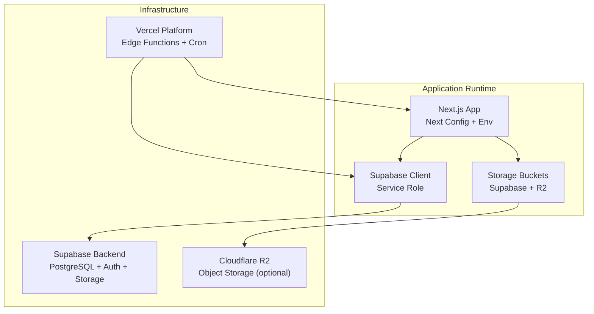
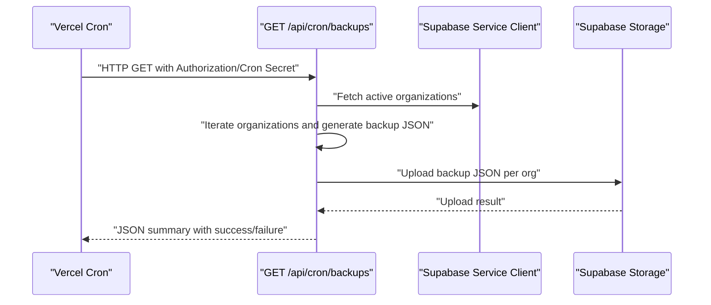
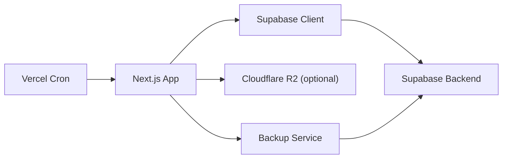

# Deployment & DevOps

<cite>
**Referenced Files in This Document**
- [vercel.json](file://vercel.json)
- [package.json](file://package.json)
- [next.config.js](file://next.config.js)
- [env.example](file://env.example)
- [.env.local](file://.env.local)
- [supabase/config.toml](file://supabase/config.toml)
- [src/lib/supabase.ts](file://src/lib/supabase.ts)
- [src/lib/backup-service.ts](file://src/lib/backup-service.ts)
- [src/lib/saas-backup-service.ts](file://src/lib/saas-backup-service.ts)
- [src/app/api/cron/backups/route.ts](file://src/app/api/cron/backups/route.ts)
- [scripts/SEEDING_README.md](file://scripts/SEEDING_README.md)
- [scripts/verify-saas-setup.js](file://scripts/verify-saas-setup.js)
- [scripts/apply-multitenancy-migrations-direct.js](file://scripts/apply-multitenancy-migrations-direct.js)
</cite>

## Table of Contents

1. [Introduction](#introduction)
2. [Project Structure](#project-structure)
3. [Core Components](#core-components)
4. [Architecture Overview](#architecture-overview)
5. [Detailed Component Analysis](#detailed-component-analysis)
6. [Dependency Analysis](#dependency-analysis)
7. [Performance Considerations](#performance-considerations)
8. [Troubleshooting Guide](#troubleshooting-guide)
9. [Conclusion](#conclusion)
10. [Appendices](#appendices)

## Introduction

This document provides comprehensive deployment and DevOps guidance for Opttius, focusing on production-grade deployment strategies and operational excellence. It covers environment configuration, CI/CD readiness, infrastructure provisioning, Supabase hosting, Vercel deployment, database migrations, service dependencies, monitoring/logging, performance optimization, security hardening, backup and disaster recovery, scaling, maintenance workflows, multi-environment management, blue-green deployments, rollbacks, and troubleshooting.

## Project Structure

Opttius is a Next.js 14 application with Supabase backend and optional Cloudflare R2 storage. Key deployment-related assets include:

- Vercel configuration for cron scheduling
- Next.js configuration for security headers and image domains
- Environment templates and local overrides
- Supabase CLI configuration and migrations
- Backup and restore services for SaaS organizations
- Scripts for seeding and verifying SaaS setup

**Diagram sources**

- [next.config.js](file://next.config.js#L1-L161)
- [vercel.json](file://vercel.json#L1-L8)
- [supabase/config.toml](file://supabase/config.toml#L1-L345)

**Section sources**

- [vercel.json](file://vercel.json#L1-L8)
- [next.config.js](file://next.config.js#L1-L161)
- [env.example](file://env.example#L1-L120)
- [.env.local](file://.env.local#L1-L116)
- [supabase/config.toml](file://supabase/config.toml#L1-L345)

## Core Components

- Environment configuration: Application and Supabase variables, AI providers, payment gateways, and storage.
- Supabase client initialization and service role usage for secure server-side operations.
- Backup services: Organization-level relational backups and SaaS-wide full backups.
- Scheduled cron jobs for automated backups.
- Local Supabase development stack and migration scripts.

**Section sources**

- [env.example](file://env.example#L1-L120)
- [.env.local](file://.env.local#L1-L116)
- [src/lib/supabase.ts](file://src/lib/supabase.ts#L1-L36)
- [src/lib/backup-service.ts](file://src/lib/backup-service.ts#L1-L224)
- [src/lib/saas-backup-service.ts](file://src/lib/saas-backup-service.ts#L1-L134)
- [src/app/api/cron/backups/route.ts](file://src/app/api/cron/backups/route.ts#L1-L98)
- [supabase/config.toml](file://supabase/config.toml#L1-L345)

## Architecture Overview

The production architecture integrates Next.js on Vercel with Supabase for database, auth, and storage, optionally backed by Cloudflare R2 for images. Security headers and CSP are configured at runtime. Automated backups run via Vercel cron and store results in Supabase Storage.

**Diagram sources**

- [vercel.json](file://vercel.json#L1-L8)
- [src/app/api/cron/backups/route.ts](file://src/app/api/cron/backups/route.ts#L1-L98)
- [src/lib/supabase.ts](file://src/lib/supabase.ts#L1-L36)

## Detailed Component Analysis

### Environment Configuration

- Application variables: Node environment, base URLs, and Next.js runtime settings.
- Supabase variables: Public URL/anon key for client and service role key for server.
- Payment gateways: Mercado Pago, PayPal, NowPayments, and Flow (Chile).
- Email: Resend configuration.
- Analytics: Google Analytics.
- AI providers: OpenRouter, OpenAI, Anthropic, Google, DeepSeek, Kilocode.
- Cloud storage: Cloudflare R2 account and bucket configuration with public URL.

Best practices:

- Keep secrets in environment variables; never commit .env files.
- Use separate keys for local and production.
- Validate presence of required variables at startup.

**Section sources**

- [env.example](file://env.example#L1-L120)
- [.env.local](file://.env.local#L1-L116)
- [src/lib/supabase.ts](file://src/lib/supabase.ts#L1-L36)
- [next.config.js](file://next.config.js#L81-L158)

### Supabase Hosting and Local Development

- Supabase CLI commands for local development and migrations.
- Supabase configuration for API, database, auth, storage, and edge runtime.
- Migrations and seed scripts for SaaS multitenancy and demo data.

Operational guidance:

- Use CLI commands to start, stop, and reset local Supabase.
- Apply migrations using the CLI push commands.
- Seed data for development using provided scripts.

**Section sources**

- [package.json](file://package.json#L13-L34)
- [supabase/config.toml](file://supabase/config.toml#L1-L345)
- [scripts/SEEDING_README.md](file://scripts/SEEDING_README.md#L1-L138)
- [scripts/verify-saas-setup.js](file://scripts/verify-saas-setup.js#L1-L194)
- [scripts/apply-multitenancy-migrations-direct.js](file://scripts/apply-multitenancy-migrations-direct.js#L1-L87)

### Vercel Deployment and Cron

- Vercel cron configuration schedules a weekly backup job.
- The backup endpoint validates a shared secret header and iterates active organizations to generate and upload backups.

Security and reliability:

- Enforce CRON_SECRET via authorization header or x-cron-secret.
- Handle partial failures gracefully and log detailed errors.

**Section sources**

- [vercel.json](file://vercel.json#L1-L8)
- [src/app/api/cron/backups/route.ts](file://src/app/api/cron/backups/route.ts#L1-L98)

### Backup and Disaster Recovery

- Organization-level relational backup service exports related tables respecting foreign-key anchors and batches inserts.
- SaaS-wide full backup service generates SQL dumps and uploads to Supabase Storage.
- Backup listing, deletion, and signed URL generation for downloads.

Recovery workflow:

- List backups, select target, download via signed URL, and restore using the restore service.
- Restore follows a strict order to honor dependencies and uses upsert with conflict handling.

**Section sources**

- [src/lib/backup-service.ts](file://src/lib/backup-service.ts#L1-L224)
- [src/lib/saas-backup-service.ts](file://src/lib/saas-backup-service.ts#L1-L134)

### Security Hardening and Headers

- Next.js config sets robust security headers including CSP, X-Frame-Options, X-Content-Type-Options, Referrer-Policy, X-XSS-Protection, Permissions-Policy, COOP/COEP, CORP, and HSTS in production.
- CSP dynamically includes Supabase domains and approved external resources.

Recommendations:

- Regularly audit CSP directives.
- Monitor for policy violations via reporting endpoints.
- Keep NextAUTH and JWT secrets strong and rotated.

**Section sources**

- [next.config.js](file://next.config.js#L81-L158)

### Monitoring and Logging

- Application logs use pino with pretty printing in development.
- Backup endpoints and services log structured events with severity and context.

Guidance:

- Ship logs to a centralized logging platform (e.g., Grafana Loki, Datadog, or ELK).
- Add correlation IDs and sampling for high-volume endpoints.
- Alert on backup failures and cron unauthorized access attempts.

**Section sources**

- [package.json](file://package.json#L74-L75)
- [src/app/api/cron/backups/route.ts](file://src/app/api/cron/backups/route.ts#L1-L98)
- [src/lib/backup-service.ts](file://src/lib/backup-service.ts#L1-L224)

### CI/CD and Infrastructure Provisioning

- CI/CD readiness:
  - Use npm scripts for build, start, and type checking.
  - Husky and lint-staged for pre-commit quality gates.
  - Supabase CLI for migrations and resets.
- Infrastructure:
  - Supabase managed PostgreSQL with Auth, Realtime, and Storage.
  - Optional Cloudflare R2 for object storage with public URL.
  - Vercel for frontend hosting and serverless functions.

Recommended CI/CD pipeline stages:

- Install dependencies and type check
- Run tests and coverage
- Build Next.js app
- Deploy to Vercel preview/staging
- Promote to production with environment variables
- Apply Supabase migrations post-deploy

**Section sources**

- [package.json](file://package.json#L5-L34)
- [supabase/config.toml](file://supabase/config.toml#L1-L345)

### Production Deployment Strategy

- Build and deploy the Next.js app to Vercel.
- Configure environment variables per environment (development, staging, production).
- Provision Supabase project and apply migrations.
- Configure Vercel cron with CRON_SECRET.
- Set up Cloudflare R2 bucket and public URL if using R2.

Blue-green deployment:

- Use Vercel preview deployments for staging.
- Switch traffic using Vercel’s branch deployment rules.
- Rollback by switching back to the previous deployment.

Rollback procedures:

- Re-run last-known-good migration set.
- Restore from the most recent backup using the backup service.
- Re-deploy the previous release tag.

**Section sources**

- [vercel.json](file://vercel.json#L1-L8)
- [src/lib/backup-service.ts](file://src/lib/backup-service.ts#L142-L224)

### Scaling Strategies

- Horizontal scaling: Vercel scales automatically; ensure stateless serverless functions.
- Database scaling: Use Supabase’s managed PostgreSQL; monitor queries and add indexes as needed.
- Storage: Offload images to Cloudflare R2 for cost and performance benefits.
- CDN: Leverage Vercel’s global CDN and Supabase Storage CDN.

**Section sources**

- [next.config.js](file://next.config.js#L29-L74)
- [supabase/config.toml](file://supabase/config.toml#L100-L127)

### Maintenance Workflows

- Regular database maintenance: Vacuum/analyze, index tuning, and migration verification.
- Health checks: Verify Supabase connectivity, cron endpoint accessibility, and backup uploads.
- Rotation: Rotate secrets (CRON_SECRET, Supabase keys, AI provider keys) periodically.

**Section sources**

- [scripts/verify-saas-setup.js](file://scripts/verify-saas-setup.js#L1-L194)
- [src/lib/supabase.ts](file://src/lib/supabase.ts#L1-L36)

## Dependency Analysis

**Diagram sources**

- [src/lib/supabase.ts](file://src/lib/supabase.ts#L1-L36)
- [src/lib/backup-service.ts](file://src/lib/backup-service.ts#L1-L224)
- [vercel.json](file://vercel.json#L1-L8)

**Section sources**

- [src/lib/supabase.ts](file://src/lib/supabase.ts#L1-L36)
- [src/lib/backup-service.ts](file://src/lib/backup-service.ts#L1-L224)
- [vercel.json](file://vercel.json#L1-L8)

## Performance Considerations

- Image optimization: Configure allowed remote patterns and leverage CDN-backed storage.
- Database queries: Batch inserts during restore; paginate and chunk large datasets.
- Function cold starts: Keep serverless functions lean; cache non-essential data.
- Storage: Prefer R2 for images to reduce origin load on Supabase Storage.

**Section sources**

- [next.config.js](file://next.config.js#L29-L74)
- [src/lib/backup-service.ts](file://src/lib/backup-service.ts#L178-L200)

## Troubleshooting Guide

Common issues and resolutions:

- Missing Supabase environment variables: Ensure NEXT_PUBLIC_SUPABASE_URL, NEXT_PUBLIC_SUPABASE_ANON_KEY, and SUPABASE_SERVICE_ROLE_KEY are set.
- Unauthorized cron: Verify CRON_SECRET header matches the configured secret.
- Database connection failures: Confirm local Supabase is running and reachable; use CLI status and reset commands.
- Backup failures: Check logs for pg_dump or storage upload errors; validate R2 bucket configuration if applicable.
- CSP violations: Review CSP report-uri if configured and adjust allowed hosts.

**Section sources**

- [src/lib/supabase.ts](file://src/lib/supabase.ts#L7-L9)
- [src/app/api/cron/backups/route.ts](file://src/app/api/cron/backups/route.ts#L14-L21)
- [scripts/SEEDING_README.md](file://scripts/SEEDING_README.md#L104-L138)

## Conclusion

Opttius provides a production-ready foundation with Supabase and Vercel, complemented by robust backup and restore capabilities, security hardening, and operational tooling. By following the outlined deployment, monitoring, scaling, and maintenance practices, teams can achieve reliable, secure, and scalable SaaS operations.

## Appendices

### Environment Variables Reference

- Application: NODE_ENV, NEXT_PUBLIC_APP_URL, NEXT_PUBLIC_BASE_URL
- Supabase: NEXT_PUBLIC_SUPABASE_URL, NEXT_PUBLIC_SUPABASE_ANON_KEY, SUPABASE_SERVICE_ROLE_KEY
- Payments: Mercado Pago, PayPal, NowPayments, Flow (Chile)
- Email: RESEND_API_KEY, RESEND_FROM_EMAIL
- Analytics: NEXT_PUBLIC_GOOGLE_ANALYTICS_ID
- AI Providers: AI_DEFAULT_PROVIDER, AI_DEFAULT_MODEL, AI_FALLBACK_PROVIDERS, and provider-specific keys
- Cloud storage: R2_ACCOUNT_ID, R2_ACCESS_KEY_ID, R2_SECRET_ACCESS_KEY, R2_BUCKET_NAME, R2_REGION, NEXT_PUBLIC_R2_PUBLIC_URL
- Security: NEXTAUTH_SECRET, NEXTAUTH_URL, CRON_SECRET

**Section sources**

- [env.example](file://env.example#L1-L120)
- [.env.local](file://.env.local#L1-L116)
