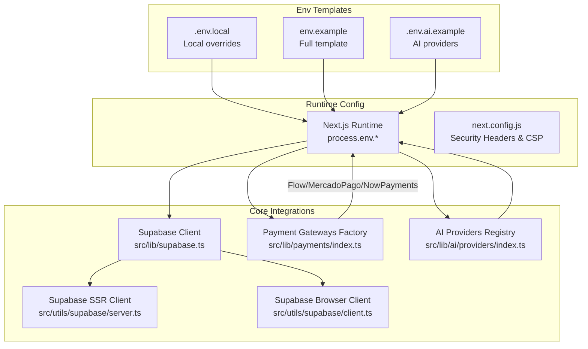
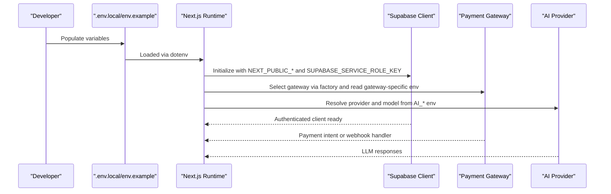
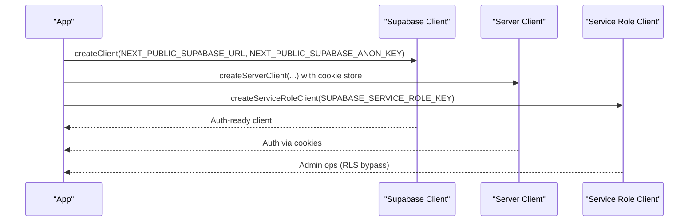
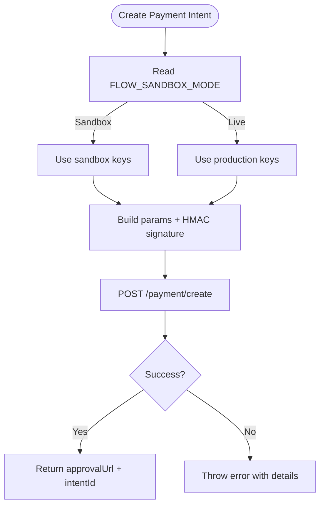
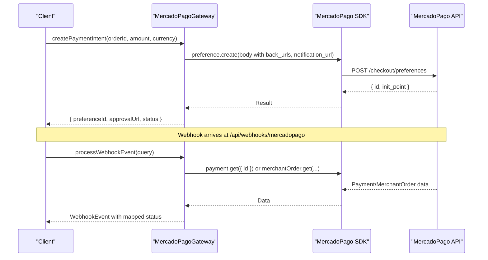
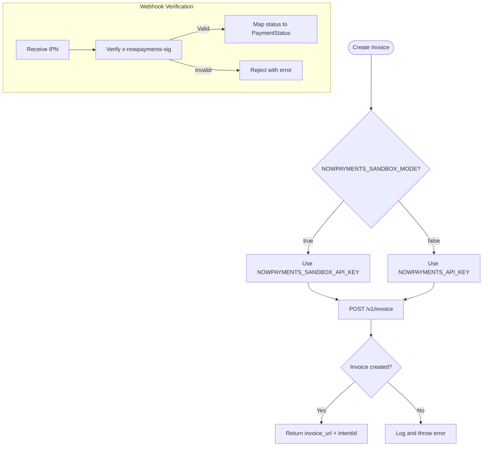
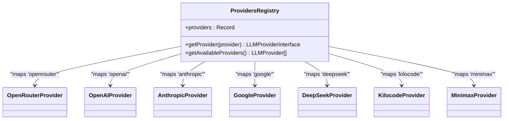
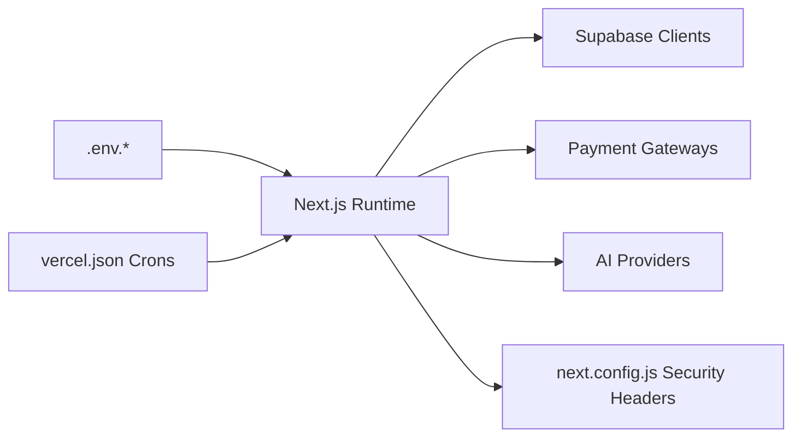

# Environment Setup & Configuration

<cite>
**Referenced Files in This Document**
- [.env.local](file://.env.local)
- [env.example](file://env.example)
- [.env.ai.example](file://.env.ai.example)
- [package.json](file://package.json)
- [next.config.js](file://next.config.js)
- [vercel.json](file://vercel.json)
- [src/lib/supabase.ts](file://src/lib/supabase.ts)
- [src/utils/supabase/client.ts](file://src/utils/supabase/client.ts)
- [src/utils/supabase/server.ts](file://src/utils/supabase/server.ts)
- [src/lib/payments/index.ts](file://src/lib/payments/index.ts)
- [src/lib/payments/flow/gateway.ts](file://src/lib/payments/flow/gateway.ts)
- [src/lib/payments/mercadopago/gateway.ts](file://src/lib/payments/mercadopago/gateway.ts)
- [src/lib/payments/nowpayments/gateway.ts](file://src/lib/payments/nowpayments/gateway.ts)
- [src/lib/ai/providers/index.ts](file://src/lib/ai/providers/index.ts)
</cite>

## Table of Contents

1. [Introduction](#introduction)
2. [Project Structure](#project-structure)
3. [Core Components](#core-components)
4. [Architecture Overview](#architecture-overview)
5. [Detailed Component Analysis](#detailed-component-analysis)
6. [Dependency Analysis](#dependency-analysis)
7. [Performance Considerations](#performance-considerations)
8. [Troubleshooting Guide](#troubleshooting-guide)
9. [Conclusion](#conclusion)
10. [Appendices](#appendices)

## Introduction

This document explains how to set up and configure the Opttius environment across development, staging, and production. It covers environment variables for Next.js, Supabase, payment gateways (Flow, Mercado Pago, NowPayments, PayPal), AI providers, cloud storage (Cloudflare R2 and optional Cloudinary), email delivery (Resend), analytics, and security. It also outlines differences between local and production setups, security best practices, validation steps, and common configuration pitfalls.

## Project Structure

Opttius uses a Next.js application with environment-driven integrations. Configuration is centralized in environment files and consumed by runtime libraries for Supabase, payments, and AI.

**Diagram sources**

- [next.config.js](file://next.config.js#L81-L158)
- [src/lib/supabase.ts](file://src/lib/supabase.ts#L1-L36)
- [src/utils/supabase/server.ts](file://src/utils/supabase/server.ts#L1-L110)
- [src/utils/supabase/client.ts](file://src/utils/supabase/client.ts#L1-L8)
- [src/lib/payments/index.ts](file://src/lib/payments/index.ts#L1-L38)
- [src/lib/ai/providers/index.ts](file://src/lib/ai/providers/index.ts#L1-L34)
- [.env.local](file://.env.local#L1-L116)
- [env.example](file://env.example#L1-L120)
- [.env.ai.example](file://.env.ai.example#L1-L61)

**Section sources**

- [next.config.js](file://next.config.js#L81-L158)
- [src/lib/supabase.ts](file://src/lib/supabase.ts#L1-L36)
- [src/utils/supabase/server.ts](file://src/utils/supabase/server.ts#L1-L110)
- [src/utils/supabase/client.ts](file://src/utils/supabase/client.ts#L1-L8)
- [src/lib/payments/index.ts](file://src/lib/payments/index.ts#L1-L38)
- [src/lib/ai/providers/index.ts](file://src/lib/ai/providers/index.ts#L1-L34)
- [.env.local](file://.env.local#L1-L116)
- [env.example](file://env.example#L1-L120)
- [.env.ai.example](file://.env.ai.example#L1-L61)

## Core Components

- Next.js environment variables: application URLs, runtime behavior, and feature flags.
- Supabase: client initialization and service role usage for admin operations.
- Payment gateways: Flow (Chile), Mercado Pago, NowPayments (cryptocurrency), and PayPal.
- AI providers: OpenRouter, OpenAI, Anthropic, Google, DeepSeek, Kilocode, Minimax.
- Cloud storage: Cloudflare R2 (primary) and optional Cloudinary fallback.
- Email: Resend API key and sender address.
- Analytics: Google Analytics ID (optional).
- Security: NextAuth secret, CSRF-safe URLs, CSP/HSTS headers, and strict transport policies.

**Section sources**

- [src/lib/supabase.ts](file://src/lib/supabase.ts#L1-L36)
- [src/utils/supabase/server.ts](file://src/utils/supabase/server.ts#L1-L110)
- [src/utils/supabase/client.ts](file://src/utils/supabase/client.ts#L1-L8)
- [src/lib/payments/index.ts](file://src/lib/payments/index.ts#L1-L38)
- [src/lib/payments/flow/gateway.ts](file://src/lib/payments/flow/gateway.ts#L14-L30)
- [src/lib/payments/mercadopago/gateway.ts](file://src/lib/payments/mercadopago/gateway.ts#L35-L66)
- [src/lib/payments/nowpayments/gateway.ts](file://src/lib/payments/nowpayments/gateway.ts#L13-L42)
- [src/lib/ai/providers/index.ts](file://src/lib/ai/providers/index.ts#L1-L34)
- [next.config.js](file://next.config.js#L81-L158)

## Architecture Overview

The environment configuration is consumed by runtime modules that enforce required variables and provide secure defaults where applicable.

**Diagram sources**

- [src/lib/supabase.ts](file://src/lib/supabase.ts#L4-L9)
- [src/utils/supabase/server.ts](file://src/utils/supabase/server.ts#L6-L33)
- [src/lib/payments/index.ts](file://src/lib/payments/index.ts#L19-L34)
- [src/lib/payments/flow/gateway.ts](file://src/lib/payments/flow/gateway.ts#L54-L60)
- [src/lib/payments/mercadopago/gateway.ts](file://src/lib/payments/mercadopago/gateway.ts#L75-L84)
- [src/lib/payments/nowpayments/gateway.ts](file://src/lib/payments/nowpayments/gateway.ts#L68-L73)
- [src/lib/ai/providers/index.ts](file://src/lib/ai/providers/index.ts#L23-L29)

## Detailed Component Analysis

### Next.js Environment Variables

- Purpose: Controls app URL, environment mode, and feature toggles.
- Required keys:
  - NODE_ENV
  - NEXT_PUBLIC_APP_URL
  - NEXT_PUBLIC_BASE_URL
- Local vs Production:
  - Development: localhost or ngrok URL.
  - Production: HTTPS domain with proper TLS and CSP/HSTS headers.

Validation:

- Ensure NEXT_PUBLIC_APP_URL and NEXT_PUBLIC_BASE_URL match deployment domain.
- Confirm NODE_ENV aligns with runtime behavior.

**Section sources**

- [env.example](file://env.example#L4-L7)
- [next.config.js](file://next.config.js#L81-L158)

### Supabase Configuration

- Purpose: Initialize Supabase client for browser and server, and service role client for admin tasks.
- Required keys:
  - NEXT_PUBLIC_SUPABASE_URL
  - NEXT_PUBLIC_SUPABASE_ANON_KEY
  - SUPABASE_SERVICE_ROLE_KEY (for admin operations)
- Behavior:
  - Missing keys cause immediate startup errors.
  - Service role client bypasses Row-Level Security for privileged operations.

**Diagram sources**

- [src/lib/supabase.ts](file://src/lib/supabase.ts#L4-L9)
- [src/lib/supabase.ts](file://src/lib/supabase.ts#L20-L33)
- [src/utils/supabase/server.ts](file://src/utils/supabase/server.ts#L6-L33)
- [src/utils/supabase/client.ts](file://src/utils/supabase/client.ts#L3-L8)

**Section sources**

- [src/lib/supabase.ts](file://src/lib/supabase.ts#L1-L36)
- [src/utils/supabase/server.ts](file://src/utils/supabase/server.ts#L1-L110)
- [src/utils/supabase/client.ts](file://src/utils/supabase/client.ts#L1-L8)

### Payment Gateways Configuration

#### Flow (Chile)

- Keys:
  - FLOW_API_KEY / FLOW_SECRET_KEY (production)
  - FLOW_API_KEY_SANDBOX / FLOW_SECRET_KEY_SANDBOX (sandbox)
  - FLOW_SANDBOX_MODE (boolean)
  - NEXT_PUBLIC_BASE_URL (for callbacks)
- Behavior:
  - Signature generation for payment creation.
  - Webhook verification and status mapping.

**Diagram sources**

- [src/lib/payments/flow/gateway.ts](file://src/lib/payments/flow/gateway.ts#L14-L30)
- [src/lib/payments/flow/gateway.ts](file://src/lib/payments/flow/gateway.ts#L47-L131)

**Section sources**

- [src/lib/payments/flow/gateway.ts](file://src/lib/payments/flow/gateway.ts#L14-L30)
- [src/lib/payments/flow/gateway.ts](file://src/lib/payments/flow/gateway.ts#L47-L131)

#### Mercado Pago

- Keys:
  - MERCADOPAGO_ACCESS_TOKEN or MP_ACCESS_TOKEN (production)
  - MP_ACCESS_TOKEN_SANDBOX or MERCADOPAGO_ACCESS_TOKEN_SANDBOX (sandbox)
  - MERCADOPAGO_SANDBOX_MODE (boolean)
  - NEXT_PUBLIC_MERCADOPAGO_PUBLIC_KEY (frontend)
  - NEXT_PUBLIC_BASE_URL (webhooks/back URLs)
  - MERCADOPAGO_WEBHOOK_SECRET (security)
- Behavior:
  - Preference creation with back URLs and metadata.
  - Webhook retrieval via payment ID and merchant order fallback.
  - Signature verification for webhook events.

**Diagram sources**

- [src/lib/payments/mercadopago/gateway.ts](file://src/lib/payments/mercadopago/gateway.ts#L68-L170)
- [src/lib/payments/mercadopago/gateway.ts](file://src/lib/payments/mercadopago/gateway.ts#L172-L256)

**Section sources**

- [src/lib/payments/mercadopago/gateway.ts](file://src/lib/payments/mercadopago/gateway.ts#L35-L66)
- [src/lib/payments/mercadopago/gateway.ts](file://src/lib/payments/mercadopago/gateway.ts#L68-L170)
- [src/lib/payments/mercadopago/gateway.ts](file://src/lib/payments/mercadopago/gateway.ts#L172-L256)

#### NowPayments (Cryptocurrency)

- Keys:
  - NOWPAYMENTS_API_KEY or NOWPAYMENTS_SANDBOX_API_KEY (depending on mode)
  - NOWPAYMENTS_IPN_SECRET (webhook signature verification)
  - NOWPAYMENTS_SANDBOX_MODE (boolean)
- Behavior:
  - Creates hosted invoices via NOWPayments API.
  - Validates IPN signatures using shared secret.

**Diagram sources**

- [src/lib/payments/nowpayments/gateway.ts](file://src/lib/payments/nowpayments/gateway.ts#L62-L138)
- [src/lib/payments/nowpayments/gateway.ts](file://src/lib/payments/nowpayments/gateway.ts#L143-L208)

**Section sources**

- [src/lib/payments/nowpayments/gateway.ts](file://src/lib/payments/nowpayments/gateway.ts#L13-L42)
- [src/lib/payments/nowpayments/gateway.ts](file://src/lib/payments/nowpayments/gateway.ts#L62-L138)
- [src/lib/payments/nowpayments/gateway.ts](file://src/lib/payments/nowpayments/gateway.ts#L143-L208)

#### PayPal

- Keys:
  - PAYPAL_CLIENT_ID
  - PAYPAL_CLIENT_SECRET
  - PAYPAL_API_BASE_URL (sandbox or production)
- Behavior:
  - Use PayPal’s API base URL according to environment.
  - Integrate checkout flows and webhooks per PayPal’s documentation.

**Section sources**

- [env.example](file://env.example#L50-L56)

### AI Providers Configuration

- Default provider and fallback chain:
  - AI_DEFAULT_PROVIDER
  - AI_DEFAULT_MODEL
  - AI_FALLBACK_PROVIDERS
- Supported providers registry resolves provider instances based on configuration.
- Example provider keys (selected):
  - OPENROUTER_API_KEY, OPENROUTER_BASE_URL, OPENROUTER_DEFAULT_MODEL
  - OPENAI_API_KEY, OPENAI_BASE_URL, OPENAI_DEFAULT_MODEL
  - ANTHROPIC_API_KEY, ANTHROPIC_BASE_URL, ANTHROPIC_DEFAULT_MODEL
  - GOOGLE_API_KEY, GOOGLE_BASE_URL, GOOGLE_DEFAULT_MODEL
  - DEEPSEEK_API_KEY, DEEPSEEK_BASE_URL, DEEPSEEK_DEFAULT_MODEL
  - KILOCODE_API_KEY, KILOCODE_BASE_URL, KILOCODE_DEFAULT_MODEL
  - MINIMAX_API_KEY, MINIMAX_GROUP_ID, MINIMAX_BASE_URL, MINIMAX_DEFAULT_MODEL

**Diagram sources**

- [src/lib/ai/providers/index.ts](file://src/lib/ai/providers/index.ts#L10-L29)

**Section sources**

- [src/lib/ai/providers/index.ts](file://src/lib/ai/providers/index.ts#L1-L34)
- [.env.ai.example](file://.env.ai.example#L1-L61)
- [env.example](file://env.example#L86-L110)

### Cloud Storage (Images)

- Cloudflare R2 (preferred):
  - R2_ACCOUNT_ID
  - R2_ACCESS_KEY_ID
  - R2_SECRET_ACCESS_KEY
  - R2_BUCKET_NAME
  - R2_REGION
  - NEXT_PUBLIC_R2_PUBLIC_URL
- Fallback:
  - If R2 is not configured, uploads fall back to Supabase Storage.
- Optional Cloudinary:
  - NEXT_PUBLIC_CLOUDINARY_CLOUD_NAME
  - CLOUDINARY_API_KEY
  - CLOUDINARY_API_SECRET

**Section sources**

- [env.example](file://env.example#L111-L120)
- [.env.local](file://.env.local#L106-L114)

### Email Delivery (Resend)

- Keys:
  - RESEND_API_KEY
  - RESEND_FROM_EMAIL
- Behavior:
  - Used for transactional emails and templates.

**Section sources**

- [env.example](file://env.example#L63-L65)
- [.env.local](file://.env.local#L19-L22)

### Analytics (Optional)

- NEXT_PUBLIC_GOOGLE_ANALYTICS_ID

**Section sources**

- [env.example](file://env.example#L83-L84)
- [.env.local](file://.env.local#L34-L35)

### Security and Headers

- NextAuth:
  - NEXTAUTH_SECRET
  - NEXTAUTH_URL
- Security headers enforced in production:
  - X-Frame-Options, X-Content-Type-Options, Referrer-Policy, X-XSS-Protection
  - Permissions-Policy, Cross-Origin-Opener-Policy, Cross-Origin-Resource-Policy
  - Content-Security-Policy (CSP) with Supabase domains and external script hosts
  - Strict-Transport-Security (HSTS) in production

**Section sources**

- [env.example](file://env.example#L79-L82)
- [next.config.js](file://next.config.js#L81-L158)

## Dependency Analysis

- Environment variables are consumed by:
  - Supabase client initialization and service role client creation.
  - Payment gateway factories and per-gateway configuration resolution.
  - AI provider registry and model selection.
- Next.js runtime reads environment variables at build and runtime.
- Vercel cron schedules are configured separately and rely on environment variables for internal logic.

**Diagram sources**

- [src/lib/supabase.ts](file://src/lib/supabase.ts#L4-L9)
- [src/lib/payments/index.ts](file://src/lib/payments/index.ts#L19-L34)
- [src/lib/ai/providers/index.ts](file://src/lib/ai/providers/index.ts#L23-L29)
- [next.config.js](file://next.config.js#L81-L158)
- [vercel.json](file://vercel.json#L1-L8)

**Section sources**

- [src/lib/supabase.ts](file://src/lib/supabase.ts#L1-L36)
- [src/lib/payments/index.ts](file://src/lib/payments/index.ts#L1-L38)
- [src/lib/ai/providers/index.ts](file://src/lib/ai/providers/index.ts#L1-L34)
- [next.config.js](file://next.config.js#L81-L158)
- [vercel.json](file://vercel.json#L1-L8)

## Performance Considerations

- Keep environment variables minimal and only enable required providers.
- Prefer HTTPS URLs for BASE_URL and APP_URL to avoid mixed-content issues.
- Use CDN-friendly image URLs (R2 public URL) and configure remotePatterns appropriately.
- Limit fallback providers to reduce latency and cost.

[No sources needed since this section provides general guidance]

## Troubleshooting Guide

Common configuration errors and resolutions:

- Missing Supabase keys:
  - Symptom: Startup error indicating missing environment variables.
  - Resolution: Set NEXT_PUBLIC_SUPABASE_URL, NEXT_PUBLIC_SUPABASE_ANON_KEY, and SUPABASE_SERVICE_ROLE_KEY.
- Payment gateway not configured:
  - Symptom: Errors when selecting gateway or creating intents.
  - Resolution: Ensure the correct keys are set for the chosen gateway (e.g., Mercado Pago access token, NowPayments API key/IPN secret).
- Flow signature mismatch:
  - Symptom: Webhook signature verification fails.
  - Resolution: Verify secret key and parameter ordering for HMAC signature.
- R2 not configured:
  - Symptom: Uploads fall back to Supabase Storage unexpectedly.
  - Resolution: Set R2_ACCOUNT_ID, R2_ACCESS_KEY_ID, R2_SECRET_ACCESS_KEY, R2_BUCKET_NAME, R2_REGION, and NEXT_PUBLIC_R2_PUBLIC_URL.
- CSP/HSTS issues in production:
  - Symptom: Mixed-content warnings or blocked resources.
  - Resolution: Ensure NEXT_PUBLIC_SUPABASE_URL and NEXT_PUBLIC_APP_URL are HTTPS and match CSP origins.

Validation checklist:

- Confirm all required keys are present in .env.local for the target environment.
- Run a local build and start the app to surface missing environment errors early.
- Test payment flows in sandbox mode before enabling production keys.
- Verify webhook endpoints receive and validate signatures correctly.

**Section sources**

- [src/lib/supabase.ts](file://src/lib/supabase.ts#L7-L9)
- [src/lib/payments/flow/gateway.ts](file://src/lib/payments/flow/gateway.ts#L151-L169)
- [src/lib/payments/mercadopago/gateway.ts](file://src/lib/payments/mercadopago/gateway.ts#L172-L256)
- [src/lib/payments/nowpayments/gateway.ts](file://src/lib/payments/nowpayments/gateway.ts#L143-L208)
- [next.config.js](file://next.config.js#L81-L158)

## Conclusion

Opttius relies on environment-driven configuration for Supabase, payments, AI, storage, and security. By following the environment templates, validating required keys per environment, and adhering to security best practices, teams can deploy reliable development, staging, and production instances. Use sandbox modes for testing, enforce HTTPS and CSP/HSTS in production, and keep provider lists lean to optimize performance and cost.

[No sources needed since this section summarizes without analyzing specific files]

## Appendices

### Step-by-Step Setup Instructions

- Development (Local)
  1. Copy env template to .env.local and fill in values.
  2. Start Supabase locally and update Supabase keys accordingly.
  3. For Mercado Pago, set sandbox mode and test credentials; use ngrok for HTTPS webhooks.
  4. For Flow, configure sandbox keys and base URL.
  5. For NowPayments, set sandbox API key and IPN secret.
  6. For AI providers, choose a default provider and model; optionally set fallbacks.
  7. Run the app and validate Supabase connectivity and payment flows.

- Staging
  1. Mirror production secrets in a staging vault; rotate secrets regularly.
  2. Use HTTPS staging domain; ensure CSP/HSTS headers are applied.
  3. Enable one payment provider at a time for validation; keep others disabled.

- Production
  1. Provision production keys for Supabase, payment providers, AI, and storage.
  2. Enforce HTTPS and strict security headers via next.config.js.
  3. Configure domain and SSL; verify CSP includes all external domains.
  4. Set up monitoring and logging for environment errors.

Validation steps:

- Build and start the app; resolve any missing environment errors.
- Test Supabase client initialization and service role client creation.
- Trigger a payment intent for each enabled gateway and verify webhook handling.
- Verify AI provider resolution and model selection.

**Section sources**

- [.env.local](file://.env.local#L1-L116)
- [env.example](file://env.example#L1-L120)
- [.env.ai.example](file://.env.ai.example#L1-L61)
- [src/lib/supabase.ts](file://src/lib/supabase.ts#L1-L36)
- [src/lib/payments/mercadopago/gateway.ts](file://src/lib/payments/mercadopago/gateway.ts#L68-L170)
- [src/lib/payments/flow/gateway.ts](file://src/lib/payments/flow/gateway.ts#L47-L131)
- [src/lib/payments/nowpayments/gateway.ts](file://src/lib/payments/nowpayments/gateway.ts#L62-L138)
- [next.config.js](file://next.config.js#L81-L158)

### Environment Variable Reference

- Next.js
  - NODE_ENV
  - NEXT_PUBLIC_APP_URL
  - NEXT_PUBLIC_BASE_URL

- Supabase
  - NEXT_PUBLIC_SUPABASE_URL
  - NEXT_PUBLIC_SUPABASE_ANON_KEY
  - SUPABASE_SERVICE_ROLE_KEY

- Flow (Chile)
  - FLOW_API_KEY
  - FLOW_SECRET_KEY
  - FLOW_API_KEY_SANDBOX
  - FLOW_SECRET_KEY_SANDBOX
  - FLOW_SANDBOX_MODE
  - FLOW_API_URL
  - FLOW_DEFAULT_EMAIL

- Mercado Pago
  - MERCADOPAGO_ACCESS_TOKEN or MP_ACCESS_TOKEN
  - MP_ACCESS_TOKEN_SANDBOX or MERCADOPAGO_ACCESS_TOKEN_SANDBOX
  - NEXT_PUBLIC_MERCADOPAGO_PUBLIC_KEY
  - NEXT_PUBLIC_MERCADOPAGO_PUBLIC_KEY_SANDBOX
  - MERCADOPAGO_SANDBOX_MODE
  - NEXT_PUBLIC_BASE_URL
  - MERCADOPAGO_WEBHOOK_SECRET

- NowPayments (Cryptocurrency)
  - NOWPAYMENTS_API_KEY
  - NOWPAYMENTS_IPN_SECRET
  - NOWPAYMENTS_SANDBOX_MODE
  - NOWPAYMENTS_SANDBOX_API_KEY

- PayPal
  - PAYPAL_CLIENT_ID
  - PAYPAL_CLIENT_SECRET
  - PAYPAL_API_BASE_URL

- Resend (Email)
  - RESEND_API_KEY
  - RESEND_FROM_EMAIL

- Cloudflare R2 (Images)
  - R2_ACCOUNT_ID
  - R2_ACCESS_KEY_ID
  - R2_SECRET_ACCESS_KEY
  - R2_BUCKET_NAME
  - R2_REGION
  - NEXT_PUBLIC_R2_PUBLIC_URL

- Cloudinary (Optional)
  - NEXT_PUBLIC_CLOUDINARY_CLOUD_NAME
  - CLOUDINARY_API_KEY
  - CLOUDINARY_API_SECRET

- Analytics (Optional)
  - NEXT_PUBLIC_GOOGLE_ANALYTICS_ID

- Security
  - NEXTAUTH_SECRET
  - NEXTAUTH_URL

- AI Providers
  - AI_DEFAULT_PROVIDER
  - AI_DEFAULT_MODEL
  - AI_FALLBACK_PROVIDERS
  - OPENROUTER_API_KEY
  - OPENROUTER_BASE_URL
  - OPENROUTER_DEFAULT_MODEL
  - OPENAI_API_KEY
  - OPENAI_BASE_URL
  - OPENAI_DEFAULT_MODEL
  - ANTHROPIC_API_KEY
  - ANTHROPIC_BASE_URL
  - ANTHROPIC_DEFAULT_MODEL
  - GOOGLE_API_KEY
  - GOOGLE_BASE_URL
  - GOOGLE_DEFAULT_MODEL
  - DEEPSEEK_API_KEY
  - DEEPSEEK_BASE_URL
  - DEEPSEEK_DEFAULT_MODEL
  - KILOCODE_API_KEY
  - KILOCODE_BASE_URL
  - KILOCODE_DEFAULT_MODEL
  - MINIMAX_API_KEY
  - MINIMAX_GROUP_ID
  - MINIMAX_BASE_URL
  - MINIMAX_DEFAULT_MODEL

**Section sources**

- [env.example](file://env.example#L1-L120)
- [.env.local](file://.env.local#L1-L116)
- [.env.ai.example](file://.env.ai.example#L1-L61)
