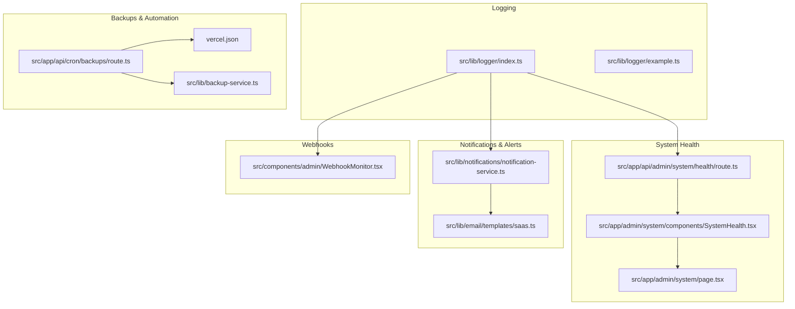
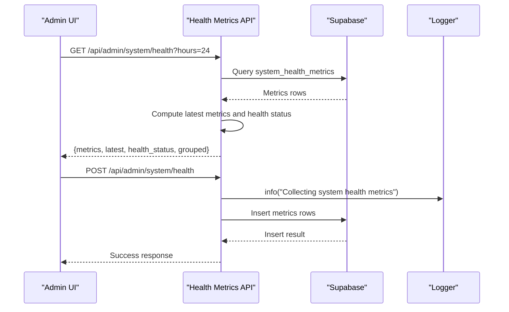
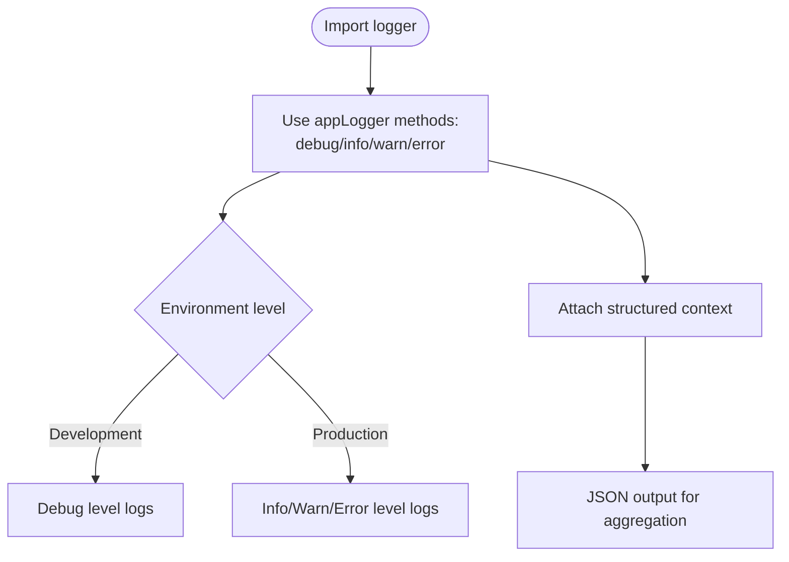
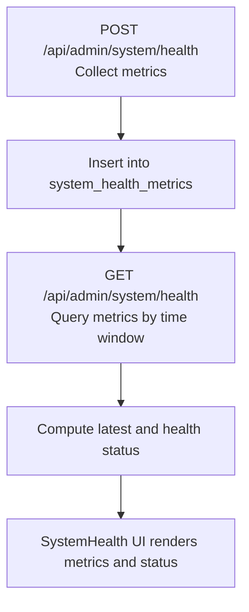
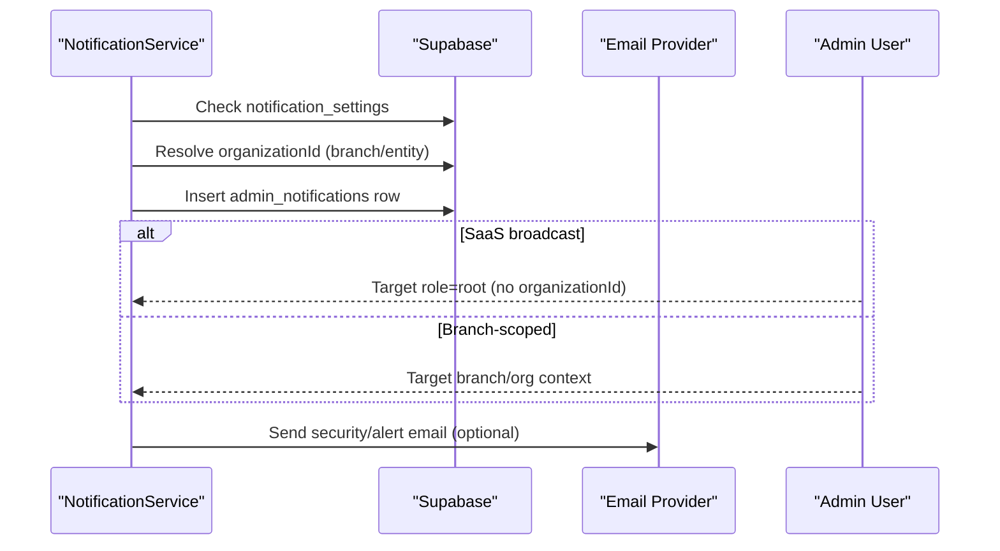
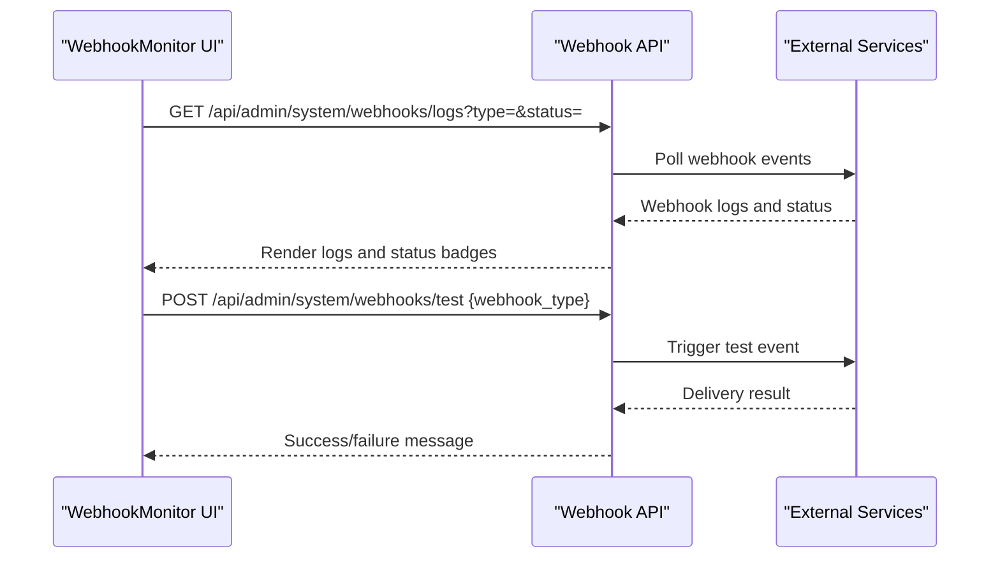
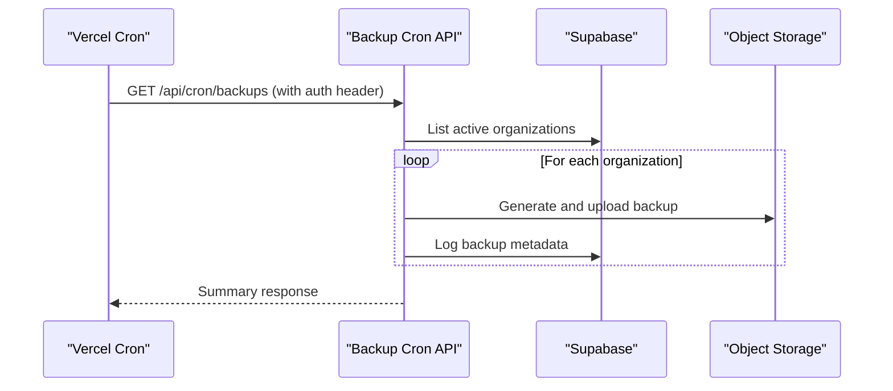
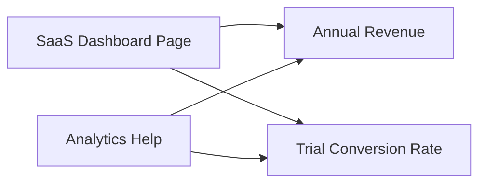
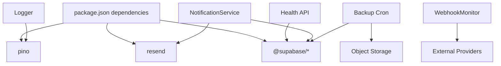

# Monitoring & Logging

<cite>
**Referenced Files in This Document**
- [logger/index.ts](file://src/lib/logger/index.ts)
- [logger/example.ts](file://src/lib/logger/example.ts)
- [api/admin/system/health/route.ts](file://src/app/api/admin/system/health/route.ts)
- [api/admin/system/maintenance/route.ts](file://src/app/api/admin/system/maintenance/route.ts)
- [components/admin/WebhookMonitor.tsx](file://src/components/admin/WebhookMonitor.tsx)
- [lib/notifications/notification-service.ts](file://src/lib/notifications/notification-service.ts)
- [app/admin/system/page.tsx](file://src/app/admin/system/page.tsx)
- [app/admin/system/components/SystemHealth.tsx](file://src/app/admin/system/components/SystemHealth.tsx)
- [app/admin/saas-management/support/metrics/route.ts](file://src/app/api/admin/saas-management/support/metrics/route.ts)
- [lib/email/templates/saas.ts](file://src/lib/email/templates/saas.ts)
- [app/admin/saas-management/dashboard/page.tsx](file://src/app/admin/saas-management/dashboard/page.tsx)
- [lib/analytics-help.ts](file://src/lib/analytics-help.ts)
- [api/cron/backups/route.ts](file://src/app/api/cron/backups/route.ts)
- [lib/backup-service.ts](file://src/lib/backup-service.ts)
- [vercel.json](file://vercel.json)
- [package.json](file://package.json)
</cite>

## Table of Contents

1. [Introduction](#introduction)
2. [Project Structure](#project-structure)
3. [Core Components](#core-components)
4. [Architecture Overview](#architecture-overview)
5. [Detailed Component Analysis](#detailed-component-analysis)
6. [Dependency Analysis](#dependency-analysis)
7. [Performance Considerations](#performance-considerations)
8. [Troubleshooting Guide](#troubleshooting-guide)
9. [Conclusion](#conclusion)
10. [Appendices](#appendices)

## Introduction

This document provides comprehensive monitoring and logging guidance for Opttius with a focus on production observability and operational visibility. It covers logging infrastructure (console and structured logging), metrics collection for application and database health, external service integrations (webhooks), error tracking and alerting, incident response, and security monitoring aligned with SaaS compliance needs. It also documents key business metrics and operational dashboards present in the codebase.

## Project Structure

Opttius integrates logging via a centralized logger module, system health metrics collection through dedicated API routes, notification and alerting via internal notifications and email templates, and SaaS support metrics. Webhook monitoring is exposed through a UI component and API endpoints. Backup automation is orchestrated via cron scheduling.

**Diagram sources**

- [logger/index.ts](file://src/lib/logger/index.ts#L1-L111)
- [logger/example.ts](file://src/lib/logger/example.ts#L1-L34)
- [api/admin/system/health/route.ts](file://src/app/api/admin/system/health/route.ts#L1-L323)
- [app/admin/system/components/SystemHealth.tsx](file://src/app/admin/system/components/SystemHealth.tsx#L116-L152)
- [app/admin/system/page.tsx](file://src/app/admin/system/page.tsx#L1-L200)
- [lib/notifications/notification-service.ts](file://src/lib/notifications/notification-service.ts#L1-L200)
- [lib/email/templates/saas.ts](file://src/lib/email/templates/saas.ts#L380-L407)
- [components/admin/WebhookMonitor.tsx](file://src/components/admin/WebhookMonitor.tsx#L60-L510)
- [api/cron/backups/route.ts](file://src/app/api/cron/backups/route.ts#L1-L41)
- [lib/backup-service.ts](file://src/lib/backup-service.ts#L64-L86)
- [vercel.json](file://vercel.json#L1-L8)

**Section sources**

- [logger/index.ts](file://src/lib/logger/index.ts#L1-L111)
- [api/admin/system/health/route.ts](file://src/app/api/admin/system/health/route.ts#L1-L323)
- [lib/notifications/notification-service.ts](file://src/lib/notifications/notification-service.ts#L1-L200)
- [components/admin/WebhookMonitor.tsx](file://src/components/admin/WebhookMonitor.tsx#L60-L510)
- [api/cron/backups/route.ts](file://src/app/api/cron/backups/route.ts#L1-L41)
- [vercel.json](file://vercel.json#L1-L8)

## Core Components

- Structured logging: Centralized logger built on pino with JSON output for development and production, supporting debug/info/warn/error levels and structured context.
- System health metrics: API endpoint collects and stores health metrics (database response time, user counts, memory usage, record counts) and computes health status.
- Notifications and alerts: Notification service creates admin notifications and supports SaaS-level broadcasts; email templates support security alerts.
- Webhook monitoring: UI component and API endpoints monitor external provider webhooks (MercadoPago, Sanity) with status and logs.
- Business metrics and dashboards: SaaS support metrics and dashboard expose KPIs such as annual revenue and trial conversion rate.
- Backups and automation: Cron-triggered backup orchestration with Vercel cron configuration.

**Section sources**

- [logger/index.ts](file://src/lib/logger/index.ts#L1-L111)
- [api/admin/system/health/route.ts](file://src/app/api/admin/system/health/route.ts#L79-L200)
- [lib/notifications/notification-service.ts](file://src/lib/notifications/notification-service.ts#L49-L160)
- [lib/email/templates/saas.ts](file://src/lib/email/templates/saas.ts#L380-L407)
- [components/admin/WebhookMonitor.tsx](file://src/components/admin/WebhookMonitor.tsx#L60-L510)
- [app/admin/saas-management/dashboard/page.tsx](file://src/app/admin/saas-management/dashboard/page.tsx#L184-L210)
- [api/cron/backups/route.ts](file://src/app/api/cron/backups/route.ts#L1-L41)
- [vercel.json](file://vercel.json#L1-L8)

## Architecture Overview

The monitoring and logging architecture centers around:

- Application logging via pino with JSON output.
- Health metrics collection and storage in a dedicated table, with retrieval and health computation APIs.
- Notification and alerting via internal notifications and email templates.
- Webhook ingestion and monitoring with UI and API.
- Backup automation via cron and service orchestration.
- Operational dashboards surfacing metrics for system and SaaS support.

**Diagram sources**

- [api/admin/system/health/route.ts](file://src/app/api/admin/system/health/route.ts#L5-L77)
- [api/admin/system/health/route.ts](file://src/app/api/admin/system/health/route.ts#L79-L200)
- [logger/index.ts](file://src/lib/logger/index.ts#L40-L104)

**Section sources**

- [api/admin/system/health/route.ts](file://src/app/api/admin/system/health/route.ts#L5-L77)
- [api/admin/system/health/route.ts](file://src/app/api/admin/system/health/route.ts#L79-L200)
- [logger/index.ts](file://src/lib/logger/index.ts#L40-L104)

## Detailed Component Analysis

### Logging Infrastructure

- Logger configuration uses pino with JSON output and ISO timestamps. Levels are controlled by environment variables; development defaults to debug, production to info. The logger exposes debug/info/warn/error methods and supports structured context.
- Example usage demonstrates logging user events, low stock warnings, and error logs with optional error objects.

**Diagram sources**

- [logger/index.ts](file://src/lib/logger/index.ts#L1-L111)
- [logger/example.ts](file://src/lib/logger/example.ts#L1-L34)

**Section sources**

- [logger/index.ts](file://src/lib/logger/index.ts#L1-L111)
- [logger/example.ts](file://src/lib/logger/example.ts#L1-L34)

### System Health Metrics and Monitoring

- Health metrics collection endpoint gathers database response time, user counts, active admin users, recent activity, memory usage, and approximate database record counts. Thresholds define warning/critical states and health flags per metric.
- Health status computation aggregates latest metrics to determine overall status and categorize warnings/criticals.
- UI components display health metrics, formatted values, and resolution guidance.

**Diagram sources**

- [api/admin/system/health/route.ts](file://src/app/api/admin/system/health/route.ts#L79-L200)
- [api/admin/system/health/route.ts](file://src/app/api/admin/system/health/route.ts#L250-L286)
- [app/admin/system/components/SystemHealth.tsx](file://src/app/admin/system/components/SystemHealth.tsx#L116-L152)

**Section sources**

- [api/admin/system/health/route.ts](file://src/app/api/admin/system/health/route.ts#L79-L200)
- [api/admin/system/health/route.ts](file://src/app/api/admin/system/health/route.ts#L250-L286)
- [app/admin/system/components/SystemHealth.tsx](file://src/app/admin/system/components/SystemHealth.tsx#L116-L152)

### Notifications, Alerting, and Security Monitoring

- NotificationService creates admin notifications scoped to branches or broadcast to SaaS root admins, with priority and metadata. It resolves organization context from branch or related entities.
- Security alerts are sent via email templates for SaaS, covering actions like login, password change, 2FA enable/disable, and API key events.
- SaaS support metrics API aggregates ticket volumes, statuses, priorities, categories, response/resolution times, satisfaction ratings, and top organizations.

**Diagram sources**

- [lib/notifications/notification-service.ts](file://src/lib/notifications/notification-service.ts#L49-L160)
- [lib/email/templates/saas.ts](file://src/lib/email/templates/saas.ts#L380-L407)

**Section sources**

- [lib/notifications/notification-service.ts](file://src/lib/notifications/notification-service.ts#L49-L160)
- [lib/email/templates/saas.ts](file://src/lib/email/templates/saas.ts#L380-L407)
- [app/admin/saas-management/support/metrics/route.ts](file://src/app/api/admin/saas-management/support/metrics/route.ts#L200-L245)

### Webhook Monitoring and External Integrations

- The WebhookMonitor component polls webhook logs and status, displays event types, response codes, and delivery status, and allows testing webhook endpoints.
- The component fetches logs and status via API endpoints and refreshes periodically.

**Diagram sources**

- [components/admin/WebhookMonitor.tsx](file://src/components/admin/WebhookMonitor.tsx#L60-L510)

**Section sources**

- [components/admin/WebhookMonitor.tsx](file://src/components/admin/WebhookMonitor.tsx#L60-L510)

### Backup Automation and Operational Visibility

- Cron configuration schedules a nightly backup job via Vercel cron.
- Backup orchestration fetches active organizations and generates backups for each, logging results and errors.
- BackupService defines backup anchors and relationships across entities.

**Diagram sources**

- [vercel.json](file://vercel.json#L1-L8)
- [api/cron/backups/route.ts](file://src/app/api/cron/backups/route.ts#L1-L41)
- [lib/backup-service.ts](file://src/lib/backup-service.ts#L64-L86)

**Section sources**

- [vercel.json](file://vercel.json#L1-L8)
- [api/cron/backups/route.ts](file://src/app/api/cron/backups/route.ts#L1-L41)
- [lib/backup-service.ts](file://src/lib/backup-service.ts#L64-L86)

### Business Metrics and Dashboards

- SaaS dashboard exposes key business indicators such as annual revenue and trial conversion rate.
- Analytics help text documents metric definitions, formulas, and interpretation for operational dashboards.

**Diagram sources**

- [app/admin/saas-management/dashboard/page.tsx](file://src/app/admin/saas-management/dashboard/page.tsx#L184-L210)
- [lib/analytics-help.ts](file://src/lib/analytics-help.ts#L1-L124)

**Section sources**

- [app/admin/saas-management/dashboard/page.tsx](file://src/app/admin/saas-management/dashboard/page.tsx#L184-L210)
- [lib/analytics-help.ts](file://src/lib/analytics-help.ts#L1-L124)

## Dependency Analysis

- Logging depends on pino and is consumed across API routes, notifications, and support flows.
- Health metrics rely on Supabase for data collection and storage, and on UI components for rendering.
- Notifications depend on Supabase for settings and admin notifications tables and optionally on email providers.
- Webhook monitoring depends on external provider endpoints and internal API routes.
- Backups depend on cron configuration and backup orchestration logic.

**Diagram sources**

- [package.json](file://package.json#L36-L86)
- [logger/index.ts](file://src/lib/logger/index.ts#L1-L111)
- [api/admin/system/health/route.ts](file://src/app/api/admin/system/health/route.ts#L1-L323)
- [lib/notifications/notification-service.ts](file://src/lib/notifications/notification-service.ts#L1-L200)
- [components/admin/WebhookMonitor.tsx](file://src/components/admin/WebhookMonitor.tsx#L60-L510)
- [api/cron/backups/route.ts](file://src/app/api/cron/backups/route.ts#L1-L41)

**Section sources**

- [package.json](file://package.json#L36-L86)
- [logger/index.ts](file://src/lib/logger/index.ts#L1-L111)
- [api/admin/system/health/route.ts](file://src/app/api/admin/system/health/route.ts#L1-L323)
- [lib/notifications/notification-service.ts](file://src/lib/notifications/notification-service.ts#L1-L200)
- [components/admin/WebhookMonitor.tsx](file://src/components/admin/WebhookMonitor.tsx#L60-L510)
- [api/cron/backups/route.ts](file://src/app/api/cron/backups/route.ts#L1-L41)

## Performance Considerations

- Logging overhead: Structured JSON logs minimize formatting overhead; avoid excessive debug logs in production.
- Health metrics queries: Batch inserts and efficient time-window filtering reduce latency; consider indexing on collected_at and category fields.
- Notification creation: Check settings and resolve organization context efficiently; batch operations where possible.
- Webhook polling: Use pagination and filters to limit payload sizes; throttle refresh intervals to balance freshness and load.
- Backup orchestration: Parallelize per organization backups where safe; monitor storage throughput and compression settings.

## Troubleshooting Guide

- Health metrics retrieval failures:
  - Verify admin authorization and table access.
  - Check error responses and log entries for query failures.
  - Confirm metric collection endpoint is reachable and inserting data.
- Notification delivery issues:
  - Inspect notification settings and target scoping (branch vs SaaS).
  - Review email provider configuration and template availability.
- Webhook failures:
  - Use the WebhookMonitor UI to inspect event types, response codes, and last delivery timestamps.
  - Trigger tests to validate endpoint reachability.
- Backup automation:
  - Validate cron secret headers and Vercel cron schedule.
  - Inspect backup generation logs and storage upload outcomes.

**Section sources**

- [api/admin/system/health/route.ts](file://src/app/api/admin/system/health/route.ts#L46-L52)
- [api/admin/system/health/route.ts](file://src/app/api/admin/system/health/route.ts#L70-L76)
- [lib/notifications/notification-service.ts](file://src/lib/notifications/notification-service.ts#L66-L78)
- [components/admin/WebhookMonitor.tsx](file://src/components/admin/WebhookMonitor.tsx#L60-L510)
- [api/cron/backups/route.ts](file://src/app/api/cron/backups/route.ts#L12-L22)

## Conclusion

Opttius implements a robust monitoring and logging foundation with structured JSON logs, comprehensive system health metrics, notification/alerting pathways, webhook monitoring, and automated backups. These components collectively provide production observability, operational visibility, and SaaS-level compliance-ready capabilities for security and audit logging.

## Appendices

### Logging Usage Patterns

- Use structured context for all logs to enable filtering and correlation.
- Prefer warn/error for incidents; reserve debug for development diagnostics.
- Attach user identifiers and session context for traceability without exposing sensitive data.

**Section sources**

- [logger/index.ts](file://src/lib/logger/index.ts#L40-L104)
- [logger/example.ts](file://src/lib/logger/example.ts#L1-L34)

### Health Metrics Thresholds and Categories

- Thresholds define warning/critical boundaries; health flags indicate per-metric status.
- Categories group metrics for targeted dashboards and alerts.

**Section sources**

- [api/admin/system/health/route.ts](file://src/app/api/admin/system/health/route.ts#L97-L192)

### Security Monitoring and Compliance

- Security alerts via email templates support audit-ready notifications for critical actions.
- Administrative activity logging is integrated with maintenance operations.

**Section sources**

- [lib/email/templates/saas.ts](file://src/lib/email/templates/saas.ts#L380-L407)
- [api/admin/system/maintenance/route.ts](file://src/app/api/admin/system/maintenance/route.ts#L211-L245)
