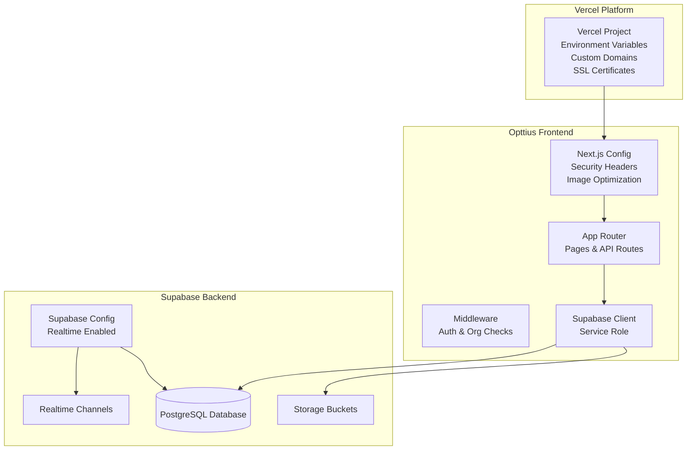
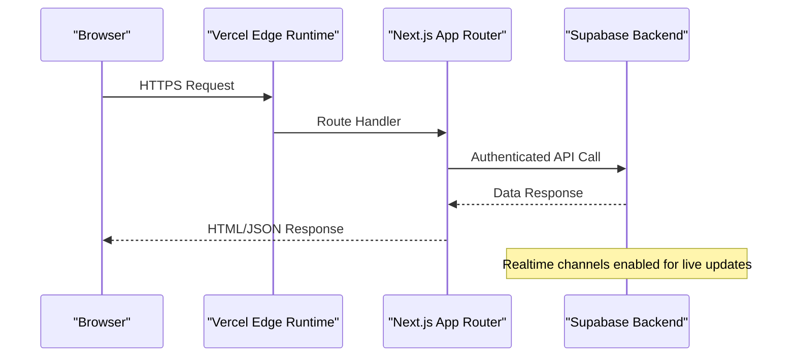
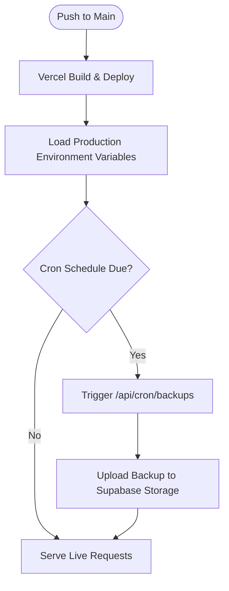
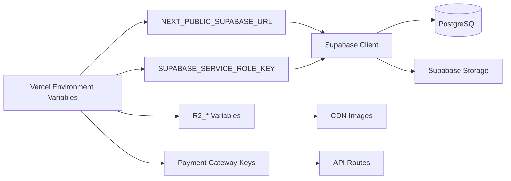

# Production Deployment

<cite>
**Referenced Files in This Document**
- [vercel.json](file://vercel.json)
- [next.config.js](file://next.config.js)
- [package.json](file://package.json)
- [.env.local](file://.env.local)
- [env.example](file://env.example)
- [supabase/config.toml](file://supabase/config.toml)
- [src/middleware.ts](file://src/middleware.ts)
- [src/lib/supabase.ts](file://src/lib/supabase.ts)
- [src/app/api/cron/backups/route.ts](file://src/app/api/cron/backups/route.ts)
- [src/app/api/admin/system/webhooks/status/route.ts](file://src/app/api/admin/system/webhooks/status/route.ts)
- [README.md](file://README.md)
- [SETUP_GUIDE.md](file://SETUP_GUIDE.md)
- [docs/CLOUDFLARE_R2_SETUP_GUIDE.md](file://docs/CLOUDFLARE_R2_SETUP_GUIDE.md)
- [docs/PAYMENT_GATEWAYS_ENV_SETUP.md](file://docs/PAYMENT_GATEWAYS_ENV_SETUP.md)
</cite>

## Table of Contents

1. [Introduction](#introduction)
2. [Project Structure](#project-structure)
3. [Core Components](#core-components)
4. [Architecture Overview](#architecture-overview)
5. [Detailed Component Analysis](#detailed-component-analysis)
6. [Dependency Analysis](#dependency-analysis)
7. [Performance Considerations](#performance-considerations)
8. [Troubleshooting Guide](#troubleshooting-guide)
9. [Conclusion](#conclusion)
10. [Appendices](#appendices)

## Introduction

This document provides a comprehensive production deployment guide for Opttius focused on Vercel deployment strategy and production environment configuration. It covers the entire pipeline from code commit to production release, including Vercel platform configuration, custom domains, SSL certificates, environment variable management, build and asset optimization, CDN configuration, production-specific Next.js configurations, security headers, performance optimizations, deployment troubleshooting, rollback procedures, monitoring setup, and the relationship between the frontend deployment and Supabase backend services (including database connection management and real-time features in production).

## Project Structure

Opttius is a Next.js 14 application with an App Router structure, TypeScript, and Supabase for backend and database. The repository includes:

- Frontend application under src/app
- Supabase configuration and migrations under supabase/
- Environment templates (.env.local and env.example)
- Vercel configuration via vercel.json
- Production-focused Next.js configuration in next.config.js
- Scripts for Supabase management and development tasks in package.json

**Diagram sources**

- [vercel.json](file://vercel.json#L1-L8)
- [next.config.js](file://next.config.js#L1-L161)
- [src/middleware.ts](file://src/middleware.ts#L1-L109)
- [src/lib/supabase.ts](file://src/lib/supabase.ts#L1-L36)
- [supabase/config.toml](file://supabase/config.toml#L1-L345)

**Section sources**

- [README.md](file://README.md#L1-L629)
- [SETUP_GUIDE.md](file://SETUP_GUIDE.md#L1-L514)

## Core Components

- Vercel configuration defines cron jobs for automated tasks.
- Next.js configuration sets security headers, image optimization, and production-specific behavior.
- Supabase integration manages authentication, database access, and storage.
- Environment variables define runtime behavior for Supabase, payments, analytics, and cloud storage.

Key production configuration highlights:

- Vercel cron scheduling for weekly backups.
- Next.js security headers including CSP, HSTS, X-Frame-Options, and others.
- Supabase service role client for secure server-side operations.
- Environment templates for local and production secrets.

**Section sources**

- [vercel.json](file://vercel.json#L1-L8)
- [next.config.js](file://next.config.js#L81-L158)
- [src/lib/supabase.ts](file://src/lib/supabase.ts#L1-L36)
- [.env.local](file://.env.local#L1-L116)
- [env.example](file://env.example#L1-L120)

## Architecture Overview

The production deployment integrates the Next.js frontend with Supabase backend services. The architecture supports:

- Authentication and authorization via Supabase Auth
- Database operations via Supabase client libraries
- Real-time updates via Supabase Realtime
- Scheduled tasks via Vercel cron
- CDN-backed image delivery via Supabase Storage or Cloudflare R2

**Diagram sources**

- [src/middleware.ts](file://src/middleware.ts#L14-L95)
- [src/lib/supabase.ts](file://src/lib/supabase.ts#L1-L36)
- [supabase/config.toml](file://supabase/config.toml#L72-L78)

## Detailed Component Analysis

### Vercel Deployment Strategy

- Project setup: Create a Vercel project linked to the repository. Configure environment variables in Vercel’s Project Settings > Environment Variables.
- Custom domains: Add primary and canonical domains in Vercel. Enable automatic SSL provisioning; Vercel handles certificates.
- Cron jobs: The repository defines a weekly backup cron. Ensure CRON_SECRET is set in Vercel environment variables for authorization.

**Diagram sources**

- [vercel.json](file://vercel.json#L1-L8)
- [src/app/api/cron/backups/route.ts](file://src/app/api/cron/backups/route.ts#L1-L98)

**Section sources**

- [vercel.json](file://vercel.json#L1-L8)
- [src/app/api/cron/backups/route.ts](file://src/app/api/cron/backups/route.ts#L11-L21)

### Environment Variable Management

- Local vs production: Use env.example for production variables and .env.local for local overrides.
- Supabase: Set NEXT_PUBLIC_SUPABASE_URL and NEXT_PUBLIC_SUPABASE_ANON_KEY for frontend; SUPABASE_SERVICE_ROLE_KEY for server-side operations.
- Payments: Configure gateway-specific variables (e.g., Mercado Pago, NowPayments, Stripe) in Vercel environment variables.
- Analytics: Configure NEXT_PUBLIC_GOOGLE_ANALYTICS_ID for analytics collection.
- Cloudflare R2: Configure R2_ACCOUNT_ID, R2_ACCESS_KEY_ID, R2_SECRET_ACCESS_KEY, R2_BUCKET_NAME, R2_REGION, and NEXT_PUBLIC_R2_PUBLIC_URL for image delivery.

Best practices:

- Never commit secrets to version control.
- Use Vercel’s encrypted environment variables for production.
- Keep NEXT*PUBLIC*\* variables restricted to frontend-safe data.

**Section sources**

- [env.example](file://env.example#L1-L120)
- [.env.local](file://.env.local#L1-L116)
- [docs/PAYMENT_GATEWAYS_ENV_SETUP.md](file://docs/PAYMENT_GATEWAYS_ENV_SETUP.md#L236-L249)

### Build Process and Asset Optimization

- Next.js build: The project uses Next.js 14 with App Router. Production builds optimize assets and enable static generation where possible.
- Image optimization: next.config.js configures remotePatterns for Supabase Storage, Cloudinary, Unsplash, Sanity, and R2 domains to allow optimized images.
- Webpack configuration: Externalizes native modules for serverless environments to avoid bundling incompatible binaries.

Recommendations:

- Monitor build logs for external module warnings.
- Ensure all image domains are whitelisted in remotePatterns to prevent runtime fetch failures.

**Section sources**

- [next.config.js](file://next.config.js#L29-L74)
- [next.config.js](file://next.config.js#L8-L28)

### Security Headers and Production Hardening

- Content Security Policy (CSP): Dynamically built based on NEXT_PUBLIC_SUPABASE_URL and includes script-src, style-src, font-src, img-src, connect-src, frame-src, media-src, object-src, base-uri, form-action, worker-src, manifest-src. Adds upgrade-insecure-requests in production.
- Additional security headers: X-Frame-Options, X-Content-Type-Options, Referrer-Policy, X-XSS-Protection, Permissions-Policy, Cross-Origin-Opener-Policy, Cross-Origin-Resource-Policy, and Strict-Transport-Security (only in production).
- Supabase domain handling: CSP dynamically resolves Supabase domain from NEXT_PUBLIC_SUPABASE_URL to ensure secure connections.

Implementation note:

- These headers are applied globally via next.config.js headers() function.

**Section sources**

- [next.config.js](file://next.config.js#L81-L158)

### CDN Configuration and Image Delivery

- Supabase Storage: Images served from Supabase Storage public URLs.
- Cloudflare R2: When R2 variables are configured, the system uploads images to R2 and serves them via NEXT_PUBLIC_R2_PUBLIC_URL. This reduces load on Supabase Storage and improves global delivery.
- Remote patterns: next.config.js remotePatterns include Supabase, Cloudinary, Unsplash, Sanity, and R2 domains.

Guidelines:

- Configure R2 bucket and public URL in production environment variables.
- Ensure bucket permissions allow public read access if images are intended to be publicly accessible.

**Section sources**

- [next.config.js](file://next.config.js#L29-L74)
- [docs/CLOUDFLARE_R2_SETUP_GUIDE.md](file://docs/CLOUDFLARE_R2_SETUP_GUIDE.md#L55-L87)

### Supabase Backend Integration

- Authentication: Supabase Auth manages user sessions. The middleware checks for authentication cookies and enforces access controls for admin routes.
- Database client: The Supabase client is initialized with NEXT_PUBLIC_SUPABASE_URL and NEXT_PUBLIC_SUPABASE_ANON_KEY for frontend; a service role client is created for server-side operations using SUPABASE_SERVICE_ROLE_KEY.
- Realtime: Supabase Realtime is enabled in config.toml, enabling real-time updates for notifications and collaborative features.

Production considerations:

- Ensure NEXT_PUBLIC_SUPABASE_URL points to the production Supabase project.
- Store SUPABASE_SERVICE_ROLE_KEY securely in Vercel environment variables.
- Verify Supabase policies and RLS are properly configured for production data access.

**Section sources**

- [src/middleware.ts](file://src/middleware.ts#L14-L95)
- [src/lib/supabase.ts](file://src/lib/supabase.ts#L1-L36)
- [supabase/config.toml](file://supabase/config.toml#L72-L78)

### Cron Jobs and Scheduled Tasks

- Weekly backups: A cron job triggers /api/cron/backups every Sunday at 03:00 UTC. Authorization is enforced via CRON_SECRET.
- Backup process: The handler fetches active organizations, generates backups, and uploads them to Supabase Storage under database-backups bucket.

Operational notes:

- Ensure CRON_SECRET is set in Vercel environment variables.
- Monitor backup job logs for errors and adjust schedules as needed.

**Section sources**

- [vercel.json](file://vercel.json#L1-L8)
- [src/app/api/cron/backups/route.ts](file://src/app/api/cron/backups/route.ts#L11-L21)
- [src/app/api/cron/backups/route.ts](file://src/app/api/cron/backups/route.ts#L32-L44)

### Payments and Webhooks in Production

- Webhook URLs: Configure webhook endpoints with your production domain (e.g., https://yourdomain.com/api/webhooks/mercadopago).
- HTTPS requirement: All base URLs and webhook endpoints must use HTTPS in production.
- Environment variables: Add gateway-specific variables (e.g., Mercado Pago, PayPal, Stripe) in Vercel environment variables.

**Section sources**

- [docs/PAYMENT_GATEWAYS_ENV_SETUP.md](file://docs/PAYMENT_GATEWAYS_ENV_SETUP.md#L236-L249)

### Monitoring and Health Checks

- Webhook status monitoring: The webhook status route auto-detects base URLs from request headers and falls back to VERCEL_URL or environment variables. This ensures accurate health checks in Vercel deployments.
- Logging: Use Next.js logging utilities and Vercel logs to monitor cron jobs and API routes.

**Section sources**

- [src/app/api/admin/system/webhooks/status/route.ts](file://src/app/api/admin/system/webhooks/status/route.ts#L57-L79)

## Dependency Analysis

The production deployment relies on the following relationships:

- Vercel depends on environment variables for Supabase, payments, analytics, and R2.
- Next.js depends on next.config.js for security headers and image optimization.
- Supabase backend depends on config.toml for Realtime and database settings.
- API routes depend on Supabase service role client for secure database operations.

**Diagram sources**

- [env.example](file://env.example#L1-L120)
- [src/lib/supabase.ts](file://src/lib/supabase.ts#L1-L36)
- [docs/CLOUDFLARE_R2_SETUP_GUIDE.md](file://docs/CLOUDFLARE_R2_SETUP_GUIDE.md#L55-L87)

**Section sources**

- [env.example](file://env.example#L1-L120)
- [src/lib/supabase.ts](file://src/lib/supabase.ts#L1-L36)

## Performance Considerations

- Image optimization: Ensure all image domains are whitelisted in next.config.js remotePatterns to leverage Next.js image optimization.
- CDN offloading: Prefer Cloudflare R2 for public images to reduce Supabase Storage bandwidth and improve global delivery.
- Build optimization: Use Next.js production builds and monitor for external module warnings.
- Realtime efficiency: Leverage Supabase Realtime for live features while minimizing unnecessary subscriptions.

[No sources needed since this section provides general guidance]

## Troubleshooting Guide

Common production issues and resolutions:

- Supabase not starting or connectivity errors: Verify NEXT_PUBLIC_SUPABASE_URL and SUPABASE_SERVICE_ROLE_KEY in Vercel environment variables. Confirm Supabase project is healthy and Realtime is enabled.
- Unauthorized cron job: Ensure CRON_SECRET is set in Vercel and matches the authorization header used by Vercel’s cron trigger.
- Missing images: Confirm R2 variables are configured and NEXT_PUBLIC_R2_PUBLIC_URL points to a valid CDN URL. Check bucket permissions for public read access.
- Payment webhooks failing: Ensure webhook URLs use HTTPS and match the production domain. Verify gateway-specific environment variables in Vercel.
- Middleware redirect loops: Review src/middleware.ts logic for admin routes and authentication cookie handling.

**Section sources**

- [src/middleware.ts](file://src/middleware.ts#L14-L95)
- [src/app/api/cron/backups/route.ts](file://src/app/api/cron/backups/route.ts#L11-L21)
- [docs/CLOUDFLARE_R2_SETUP_GUIDE.md](file://docs/CLOUDFLARE_R2_SETUP_GUIDE.md#L55-L87)
- [docs/PAYMENT_GATEWAYS_ENV_SETUP.md](file://docs/PAYMENT_GATEWAYS_ENV_SETUP.md#L236-L249)

## Conclusion

Opttius production deployment centers on a robust integration between Next.js, Vercel, and Supabase. By configuring environment variables, securing headers, optimizing images, and leveraging Supabase Realtime and cron jobs, the system achieves scalability, security, and maintainability. Following the steps outlined here ensures a reliable production rollout and ongoing operational excellence.

[No sources needed since this section summarizes without analyzing specific files]

## Appendices

### Appendix A: Environment Variables Reference

- Supabase: NEXT_PUBLIC_SUPABASE_URL, NEXT_PUBLIC_SUPABASE_ANON_KEY, SUPABASE_SERVICE_ROLE_KEY
- Payments: Gateway-specific variables (e.g., Mercado Pago, NowPayments, Stripe)
- Analytics: NEXT_PUBLIC_GOOGLE_ANALYTICS_ID
- Cloudflare R2: R2_ACCOUNT_ID, R2_ACCESS_KEY_ID, R2_SECRET_ACCESS_KEY, R2_BUCKET_NAME, R2_REGION, NEXT_PUBLIC_R2_PUBLIC_URL
- Security: CRON_SECRET (for cron authorization)

**Section sources**

- [env.example](file://env.example#L1-L120)
- [.env.local](file://.env.local#L1-L116)

### Appendix B: Vercel Cron Configuration

- Path: /api/cron/backups
- Schedule: 0 3 \* \* 0 (weekly on Sundays at 03:00 UTC)
- Authorization: Requires CRON_SECRET in Vercel environment variables

**Section sources**

- [vercel.json](file://vercel.json#L1-L8)
- [src/app/api/cron/backups/route.ts](file://src/app/api/cron/backups/route.ts#L11-L21)

### Appendix C: Supabase Realtime and Database Settings

- Realtime enabled in config.toml
- Database major version aligned with production Supabase
- Storage buckets configured for images and uploads

**Section sources**

- [supabase/config.toml](file://supabase/config.toml#L72-L78)
- [supabase/config.toml](file://supabase/config.toml#L100-L127)
