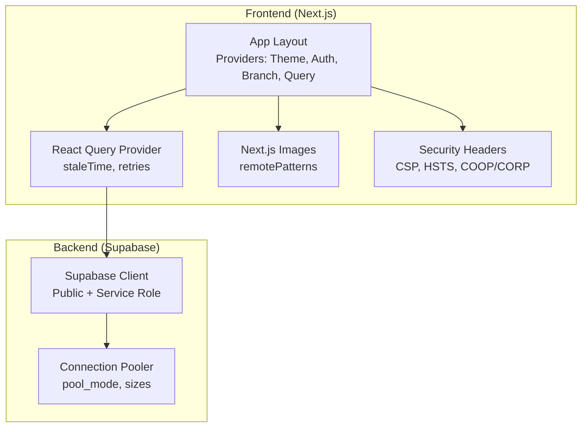
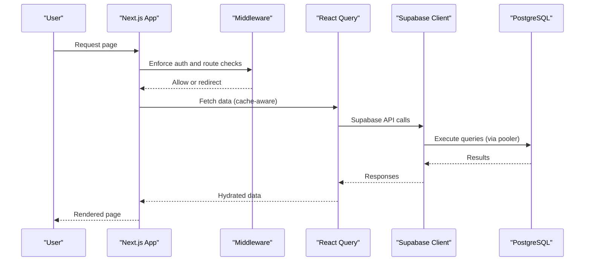
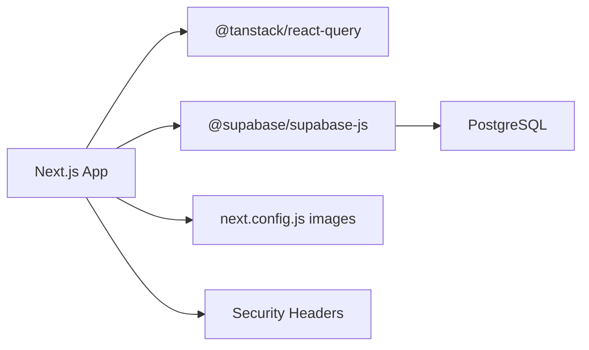

# Scaling & Performance Optimization

<cite>
**Referenced Files in This Document**
- [package.json](file://package.json)
- [next.config.js](file://next.config.js)
- [vercel.json](file://vercel.json)
- [src/lib/supabase.ts](file://src/lib/supabase.ts)
- [src/middleware.ts](file://src/middleware.ts)
- [src/app/layout.tsx](file://src/app/layout.tsx)
- [src/lib/react-query/QueryProvider.tsx](file://src/lib/react-query/QueryProvider.tsx)
- [src/hooks/useDebounce.ts](file://src/hooks/useDebounce.ts)
- [src/lib/utils.ts](file://src/lib/utils.ts)
- [src/lib/logger/index.ts](file://src/lib/logger/index.ts)
- [supabase/config.toml](file://supabase/config.toml)
</cite>

## Table of Contents

1. [Introduction](#introduction)
2. [Project Structure](#project-structure)
3. [Core Components](#core-components)
4. [Architecture Overview](#architecture-overview)
5. [Detailed Component Analysis](#detailed-component-analysis)
6. [Dependency Analysis](#dependency-analysis)
7. [Performance Considerations](#performance-considerations)
8. [Troubleshooting Guide](#troubleshooting-guide)
9. [Conclusion](#conclusion)
10. [Appendices](#appendices)

## Introduction

This document provides a comprehensive guide to scaling and performance optimization for Opttius, a SaaS platform built with Next.js and Supabase. It covers horizontal and vertical scaling strategies for frontend and backend, Next.js performance optimizations, database tuning and connection pooling, load balancing and CDN considerations, monitoring and capacity planning, auto-scaling and cost optimization, and performance testing methodologies.

## Project Structure

Opttius follows a modern Next.js 14 App Router architecture with Supabase for authentication, real-time, and database needs. Key performance-relevant areas include:

- Next.js configuration for image optimization, headers/security, and Webpack externals
- Global providers for React Query caching and SSR hydration
- Supabase client initialization and service role usage
- Middleware enforcing authentication and routing behavior
- Local Supabase configuration including connection pooling

**Diagram sources**

- [src/app/layout.tsx](file://src/app/layout.tsx#L30-L55)
- [src/lib/react-query/QueryProvider.tsx](file://src/lib/react-query/QueryProvider.tsx#L7-L24)
- [next.config.js](file://next.config.js#L29-L74)
- [next.config.js](file://next.config.js#L81-L157)
- [src/lib/supabase.ts](file://src/lib/supabase.ts#L11-L33)
- [supabase/config.toml](file://supabase/config.toml#L33-L43)

**Section sources**

- [package.json](file://package.json#L36-L86)
- [next.config.js](file://next.config.js#L1-L161)
- [src/app/layout.tsx](file://src/app/layout.tsx#L1-L56)
- [src/lib/react-query/QueryProvider.tsx](file://src/lib/react-query/QueryProvider.tsx#L1-L35)
- [src/lib/supabase.ts](file://src/lib/supabase.ts#L1-L36)
- [supabase/config.toml](file://supabase/config.toml#L1-L345)

## Core Components

- Next.js configuration for images, headers, and Webpack externals
- React Query provider with tuned staleTime and retries
- Supabase client initialization and service role usage
- Middleware for authentication and route gating
- Local Supabase connection pooler configuration

**Section sources**

- [next.config.js](file://next.config.js#L29-L74)
- [next.config.js](file://next.config.js#L81-L157)
- [src/lib/react-query/QueryProvider.tsx](file://src/lib/react-query/QueryProvider.tsx#L7-L24)
- [src/lib/supabase.ts](file://src/lib/supabase.ts#L11-L33)
- [src/middleware.ts](file://src/middleware.ts#L14-L94)
- [supabase/config.toml](file://supabase/config.toml#L33-L43)

## Architecture Overview

The runtime architecture integrates Next.js rendering with Supabase for data and auth. Security headers and CSP are applied globally. React Query manages caching and background refetching. Supabase’s connection pooler controls server connection reuse.

**Diagram sources**

- [src/middleware.ts](file://src/middleware.ts#L14-L94)
- [src/lib/react-query/QueryProvider.tsx](file://src/lib/react-query/QueryProvider.tsx#L7-L24)
- [src/lib/supabase.ts](file://src/lib/supabase.ts#L11-L33)
- [supabase/config.toml](file://supabase/config.toml#L33-L43)

## Detailed Component Analysis

### Next.js Performance Optimizations

- Image optimization: remotePatterns configured for Supabase Storage, Cloudinary, Unsplash, Sanity, R2, and others to leverage optimized delivery.
- Security headers: strict CSP, HSTS in production, COOP/CORP hardening, X-Frame-Options, X-Content-Type-Options, Referrer-Policy, Permissions-Policy.
- Webpack externals: externalize native modules to reduce server bundle size and improve cold-starts.

Recommendations:

- Prefer next/image with appropriate widths and layouts to avoid CLS.
- Use dynamic imports for heavy components to improve code splitting.
- Enable ISR/SSG where feasible for static pages.
- Monitor image sizes and use modern formats (AVIF/WebP) via CDN.

**Section sources**

- [next.config.js](file://next.config.js#L29-L74)
- [next.config.js](file://next.config.js#L81-L157)
- [next.config.js](file://next.config.js#L3-L28)

### React Query Caching Strategy

- Stale time: 1 minute to avoid immediate refetch on client.
- Disable window focus refetch to reduce unnecessary network calls.
- Retry attempts reduced to minimize load under failure scenarios.
- Devtools available in development for inspection.

Recommendations:

- Tune staleTime per route/page based on data volatility.
- Use query invalidation strategically after mutations.
- Consider background refetch intervals for live dashboards.
- Monitor cache hit rates and adjust defaults.

**Section sources**

- [src/lib/react-query/QueryProvider.tsx](file://src/lib/react-query/QueryProvider.tsx#L7-L24)

### Supabase Client Initialization and Service Role

- Public client initialized with auto-refresh and persisted sessions for user-facing flows.
- Service role client created with disabled auto-refresh for server-side operations to prevent token churn.

Recommendations:

- Use service role for admin tasks and background jobs.
- Keep public client usage minimal on the server to reduce token rotation overhead.
- Secure service role keys and rotate regularly.

**Section sources**

- [src/lib/supabase.ts](file://src/lib/supabase.ts#L11-L33)

### Middleware Authentication and Route Gating

- Excludes public routes (login, signup, onboarding, API, static assets).
- Enforces authentication for admin routes and redirects unauthenticated users.
- Logs cookie presence and project ref extraction for diagnostics.

Recommendations:

- Offload heavy checks to the layout or page-level guards to avoid repeated middleware work.
- Consider JWT-based checks for high-throughput routes.
- Add circuit breakers for health checks to prevent cascading failures.

**Section sources**

- [src/middleware.ts](file://src/middleware.ts#L14-L94)

### Connection Pooling and Database Tuning

- Connection pooler enabled locally with transaction mode, default pool size, and max client connections.
- PostgreSQL major version aligned with remote database.

Recommendations:

- Enable pooler in staging/production with conservative limits and monitor wait times.
- Use read replicas for analytical queries; keep write-heavy workloads on primary.
- Index high-cardinality columns frequently used in filters and joins.
- Regularly analyze slow query logs and EXPLAIN plans.

**Section sources**

- [supabase/config.toml](file://supabase/config.toml#L33-L43)
- [supabase/config.toml](file://supabase/config.toml#L24-L31)

### Logging and Observability

- Structured logging with Pino; JSON format in production for aggregation.
- Error payloads enriched with stack traces and contextual data.

Recommendations:

- Ship logs to centralized logging (e.g., Loki, CloudWatch) with sampling.
- Add correlation IDs to requests for end-to-end tracing.
- Instrument key metrics: response latency, error rates, cache hit ratios.

**Section sources**

- [src/lib/logger/index.ts](file://src/lib/logger/index.ts#L14-L27)
- [src/lib/logger/index.ts](file://src/lib/logger/index.ts#L40-L103)

### Load Balancing, CDN, and Edge Computing

- Next.js Image Optimization serves optimized images; ensure CDN sits in front for global distribution.
- CSP allows external domains for images and SDKs; align CDN with allowed hosts.
- Consider edge functions for lightweight computations and caching.

Recommendations:

- Place a CDN (e.g., Vercel Edge Network, Cloudflare Workers KV, or cloud provider CDN) in front of Next.js.
- Use origin shielding to protect origin servers.
- Cache static assets and images aggressively; invalidate on content updates.

**Section sources**

- [next.config.js](file://next.config.js#L29-L74)
- [next.config.js](file://next.config.js#L81-L157)

### Auto-Scaling and Capacity Planning

- Horizontal scaling: deploy multiple Next.js instances behind a load balancer; use serverless or containerized deployments depending on provider.
- Vertical scaling: increase CPU/RAM for Next.js workers and database tier as traffic grows.
- Capacity planning: track RPS, latency percentiles, memory usage, and database connections; plan headroom for spikes.

Recommendations:

- Use managed platforms with autoscaling (e.g., Vercel, Vercel Serverless, or cloud-run).
- Scale Supabase database according to max connections and query throughput.
- Implement graceful degradation for non-critical features under load.

**Section sources**

- [vercel.json](file://vercel.json#L1-L8)
- [supabase/config.toml](file://supabase/config.toml#L33-L43)

### Performance Testing and Regression Detection

- Unit/integration tests exist for key API endpoints; expand coverage for performance-sensitive routes.
- Use synthetic monitoring (e.g., SLOs, latency targets) to detect regressions.
- Load test with realistic user journeys; measure P95/P99 latency and error budgets.

Recommendations:

- Integrate automated performance checks in CI (e.g., Lighthouse, WebPageTest).
- Establish SLOs for critical paths (e.g., homepage, checkout).
- Use A/B testing for incremental rollouts with telemetry.

**Section sources**

- [package.json](file://package.json#L28-L32)

## Dependency Analysis

The frontend depends on Next.js, React Query, and Supabase. Supabase provides the backend runtime, including the database, auth, and edge functions.

**Diagram sources**

- [package.json](file://package.json#L36-L86)
- [next.config.js](file://next.config.js#L29-L74)
- [next.config.js](file://next.config.js#L81-L157)
- [src/lib/supabase.ts](file://src/lib/supabase.ts#L11-L33)

**Section sources**

- [package.json](file://package.json#L36-L86)
- [next.config.js](file://next.config.js#L1-L161)
- [src/lib/supabase.ts](file://src/lib/supabase.ts#L1-L36)

## Performance Considerations

- Frontend
  - Minimize initial JS; split code with dynamic imports.
  - Use efficient image formats and sizes; leverage CDN.
  - Reduce layout shifts; reserve space for images.
- Backend
  - Tune React Query defaults; avoid excessive refetches.
  - Use service role for server tasks; avoid exposing public keys.
  - Monitor pooler waits; scale pool size and max connections.
- Observability
  - Structured logs with correlation IDs.
  - Metrics for latency, error rates, cache hits.
- Cost Optimization
  - Right-size instances and database tiers.
  - Use CDN caching and compression.
  - Monitor and terminate unused resources.

[No sources needed since this section provides general guidance]

## Troubleshooting Guide

- Missing environment variables for Supabase cause initialization failures; ensure NEXT_PUBLIC_SUPABASE_URL, NEXT_PUBLIC_SUPABASE_ANON_KEY, and SUPABASE_SERVICE_ROLE_KEY are set.
- Worker thread conflicts with pino-pretty in development; logs remain functional in JSON format.
- Middleware cookie checks may fail locally if project ref parsing is incorrect; verify Supabase URL and cookie naming.
- Connection pool exhaustion: increase default_pool_size and max_client_conn; review query performance.

**Section sources**

- [src/lib/supabase.ts](file://src/lib/supabase.ts#L7-L9)
- [src/lib/supabase.ts](file://src/lib/supabase.ts#L23-L25)
- [src/lib/logger/index.ts](file://src/lib/logger/index.ts#L15-L27)
- [src/middleware.ts](file://src/middleware.ts#L47-L60)
- [supabase/config.toml](file://supabase/config.toml#L33-L43)

## Conclusion

Opttius’ architecture provides a solid foundation for performance and scalability. By optimizing Next.js image delivery, leveraging React Query caching, tuning Supabase connection pooling, enforcing strong security headers, and establishing robust observability and testing practices, the platform can achieve reliable performance at scale while maintaining cost efficiency.

[No sources needed since this section summarizes without analyzing specific files]

## Appendices

- Monitoring checklist
  - Latency SLOs (P50/P90/P95)
  - Error budget burn rate
  - Cache hit ratio trends
  - Database connection utilization
  - CDN hit rate and origin latency
- Capacity planning inputs
  - Historical traffic patterns
  - Seasonal spikes
  - Feature adoption curves
  - Database query volume and types

[No sources needed since this section provides general guidance]
