# Development Tools & Utilities

<cite>
**Referenced Files in This Document**
- [README.md](file://README.md)
- [scripts/README.md](file://scripts/README.md)
- [scripts/SEEDING_README.md](file://scripts/SEEDING_README.md)
- [scripts/FIND_MISSING_FILES_README.md](file://scripts/FIND_MISSING_FILES_README.md)
- [scripts/RECOVER_PRE_SAAS_README.md](file://scripts/RECOVER_PRE_SAAS_README.md)
- [scripts/seed-test-data.js](file://scripts/seed-test-data.js)
- [scripts/create-admin-via-api.js](file://scripts/create-admin-via-api.js)
- [scripts/find-missing-files.js](file://scripts/find-missing-files.js)
- [scripts/recover-missing-files.js](file://scripts/recover-missing-files.js)
- [scripts/recover-pre-saas-functionality.js](file://scripts/recover-pre-saas-functionality.js)
- [scripts/verify-migrations.js](file://scripts/verify-migrations.js)
- [scripts/test-backup-isolation.js](file://scripts/test-backup-isolation.js)
- [scripts/apply-lens-migration.js](file://scripts/apply-lens-migration.js)
- [scripts/apply-products-branch-migration.js](file://scripts/apply-products-branch-migration.js)
- [scripts/inspect-schema.ts](file://scripts/inspect-schema.ts)
</cite>

## Table of Contents

1. [Introduction](#introduction)
2. [Project Structure](#project-structure)
3. [Core Components](#core-components)
4. [Architecture Overview](#architecture-overview)
5. [Detailed Component Analysis](#detailed-component-analysis)
6. [Dependency Analysis](#dependency-analysis)
7. [Performance Considerations](#performance-considerations)
8. [Troubleshooting Guide](#troubleshooting-guide)
9. [Conclusion](#conclusion)
10. [Appendices](#appendices)

## Introduction

This document describes the Opttius development tools and utilities designed to streamline local development, debugging, and maintenance. It covers database inspection tools, migration utilities, debugging scripts, and administrative helpers. The goal is to provide a comprehensive guide for developers to efficiently manage the development lifecycle, including onboarding, demo data generation, and system recovery utilities.

## Project Structure

The development tooling is primarily located under the scripts directory and integrates with Supabase for database operations. The key areas include:

- Seeding and onboarding scripts for quick local setup
- Recovery and inspection utilities for schema and functionality
- Migration application helpers for database changes
- Verification and isolation tests for production-like checks

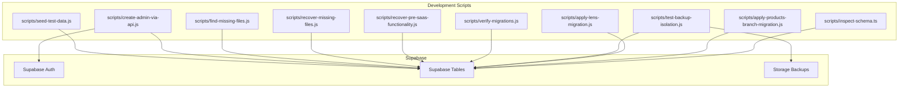

**Diagram sources**

- [scripts/seed-test-data.js](file://scripts/seed-test-data.js#L1-L879)
- [scripts/create-admin-via-api.js](file://scripts/create-admin-via-api.js#L1-L165)
- [scripts/find-missing-files.js](file://scripts/find-missing-files.js#L1-L138)
- [scripts/recover-missing-files.js](file://scripts/recover-missing-files.js#L1-L185)
- [scripts/recover-pre-saas-functionality.js](file://scripts/recover-pre-saas-functionality.js#L1-L547)
- [scripts/verify-migrations.js](file://scripts/verify-migrations.js#L1-L70)
- [scripts/test-backup-isolation.js](file://scripts/test-backup-isolation.js#L1-L47)
- [scripts/apply-lens-migration.js](file://scripts/apply-lens-migration.js#L1-L88)
- [scripts/apply-products-branch-migration.js](file://scripts/apply-products-branch-migration.js#L1-L156)
- [scripts/inspect-schema.ts](file://scripts/inspect-schema.ts#L1-L45)

**Section sources**

- [README.md](file://README.md#L332-L347)

## Core Components

This section outlines the primary development utilities and their purposes:

- Seeding and Onboarding
  - seed-test-data.js: Creates a SuperAdmin user, default categories, realistic products, lens families, and price matrices for testing.
  - create-admin-via-api.js: Creates or updates an admin user via Supabase Auth API for local development.

- Schema and File Integrity
  - find-missing-files.js: Scans imports and reports missing files, optionally searching Git history.
  - recover-missing-files.js: Automatically recovers missing files from Git history and writes them locally.

- System Recovery and Validation
  - recover-pre-saas-functionality.js: Analyzes diffs against a pre-SaaS commit to recover lost functionality while preserving SaaS/testing changes.
  - verify-migrations.js: Verifies critical production migration columns and values.

- Migration Utilities
  - apply-lens-migration.js: Applies lens families and matrices migration via Supabase RPC or REST.
  - apply-products-branch-migration.js: Applies branch_id to products migration with verification and fallback.

- Database Inspection
  - inspect-schema.ts: Inspects selected tables for columns and basic presence checks.

- Backup Isolation Test
  - test-backup-isolation.js: Validates backup folder structure and basic access in Supabase Storage.

**Section sources**

- [scripts/SEEDING_README.md](file://scripts/SEEDING_README.md#L1-L138)
- [scripts/README.md](file://scripts/README.md#L1-L36)
- [scripts/FIND_MISSING_FILES_README.md](file://scripts/FIND_MISSING_FILES_README.md#L1-L114)
- [scripts/RECOVER_PRE_SAAS_README.md](file://scripts/RECOVER_PRE_SAAS_README.md#L1-L215)
- [scripts/inspect-schema.ts](file://scripts/inspect-schema.ts#L1-L45)
- [scripts/verify-migrations.js](file://scripts/verify-migrations.js#L1-L70)
- [scripts/test-backup-isolation.js](file://scripts/test-backup-isolation.js#L1-L47)
- [scripts/apply-lens-migration.js](file://scripts/apply-lens-migration.js#L1-L88)
- [scripts/apply-products-branch-migration.js](file://scripts/apply-products-branch-migration.js#L1-L156)

## Architecture Overview

The development utilities integrate with Supabase for database operations and rely on environment variables configured in .env.local. The scripts use the Supabase client to connect to the local database and execute administrative tasks.

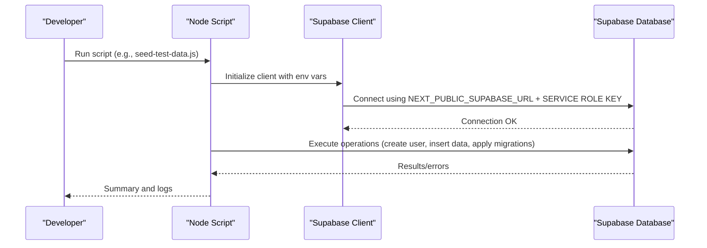

**Diagram sources**

- [scripts/seed-test-data.js](file://scripts/seed-test-data.js#L9-L26)
- [scripts/create-admin-via-api.js](file://scripts/create-admin-via-api.js#L10-L26)
- [scripts/verify-migrations.js](file://scripts/verify-migrations.js#L6-L17)
- [scripts/apply-lens-migration.js](file://scripts/apply-lens-migration.js#L7-L20)
- [scripts/apply-products-branch-migration.js](file://scripts/apply-products-branch-migration.js#L18-L47)

## Detailed Component Analysis

### Seeding and Onboarding

Purpose:

- Quickly provision a local development environment with a SuperAdmin user, default categories, realistic products, lens families, and price matrices.

Usage:

- Seed test data: npm run seed:test-data or node scripts/seed-test-data.js
- Configure ADMIN_EMAIL and ADMIN_PASSWORD via environment variables if desired.

Key behaviors:

- Creates or updates a SuperAdmin user and sets admin roles.
- Upserts default categories and inserts multiple products with optical attributes.
- Seeds lens families and price matrices with realistic ranges and sourcing types.

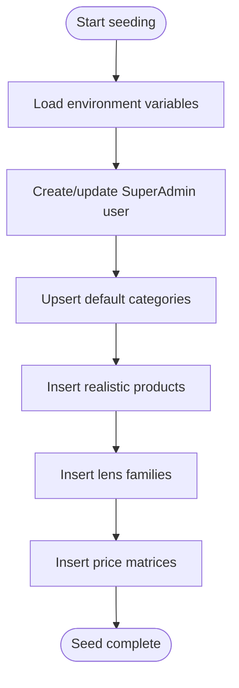

**Diagram sources**

- [scripts/seed-test-data.js](file://scripts/seed-test-data.js#L32-L155)
- [scripts/seed-test-data.js](file://scripts/seed-test-data.js#L227-L250)
- [scripts/seed-test-data.js](file://scripts/seed-test-data.js#L252-L575)
- [scripts/seed-test-data.js](file://scripts/seed-test-data.js#L577-L722)
- [scripts/seed-test-data.js](file://scripts/seed-test-data.js#L724-L879)

**Section sources**

- [scripts/SEEDING_README.md](file://scripts/SEEDING_README.md#L1-L138)
- [scripts/seed-test-data.js](file://scripts/seed-test-data.js#L1-L879)

### Administrative User Creation

Purpose:

- Create or update an admin user via Supabase Auth API for local development environments.

Usage:

- node scripts/create-admin-via-api.js
- Supports environment variables or CLI arguments.

Key behaviors:

- Checks for existing user and updates password if needed.
- Sets profile membership tier and creates admin_users entry.

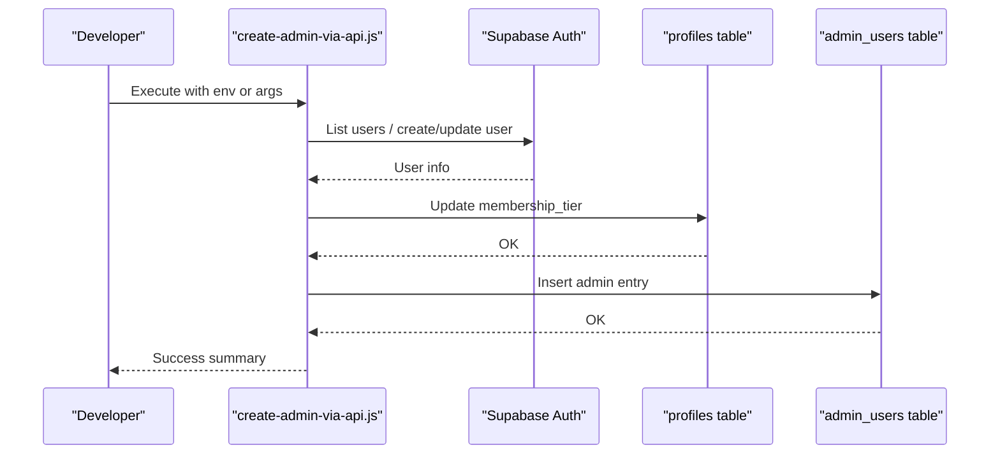

**Diagram sources**

- [scripts/create-admin-via-api.js](file://scripts/create-admin-via-api.js#L28-L162)

**Section sources**

- [scripts/README.md](file://scripts/README.md#L16-L36)
- [scripts/create-admin-via-api.js](file://scripts/create-admin-via-api.js#L1-L165)

### Schema Inspection

Purpose:

- Inspect selected tables for column presence and basic data to aid debugging.

Usage:

- node scripts/inspect-schema.ts

Key behaviors:

- Iterates through predefined tables and attempts to select a row.
- Reports columns found or tests common columns to detect missing ones.

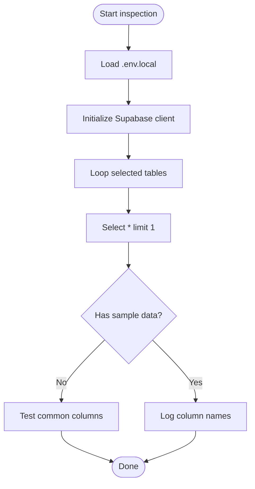

**Diagram sources**

- [scripts/inspect-schema.ts](file://scripts/inspect-schema.ts#L16-L44)

**Section sources**

- [scripts/inspect-schema.ts](file://scripts/inspect-schema.ts#L1-L45)

### Migration Application Utilities

Purpose:

- Apply specific database migrations that may not be fully handled by standard migration runners.

Usage:

- node scripts/apply-lens-migration.js
- node scripts/apply-products-branch-migration.js

Key behaviors:

- Reads migration SQL from supabase/migrations.
- Attempts RPC-based execution; falls back to statement-by-statement execution.
- Includes verification steps and guidance for manual execution if needed.

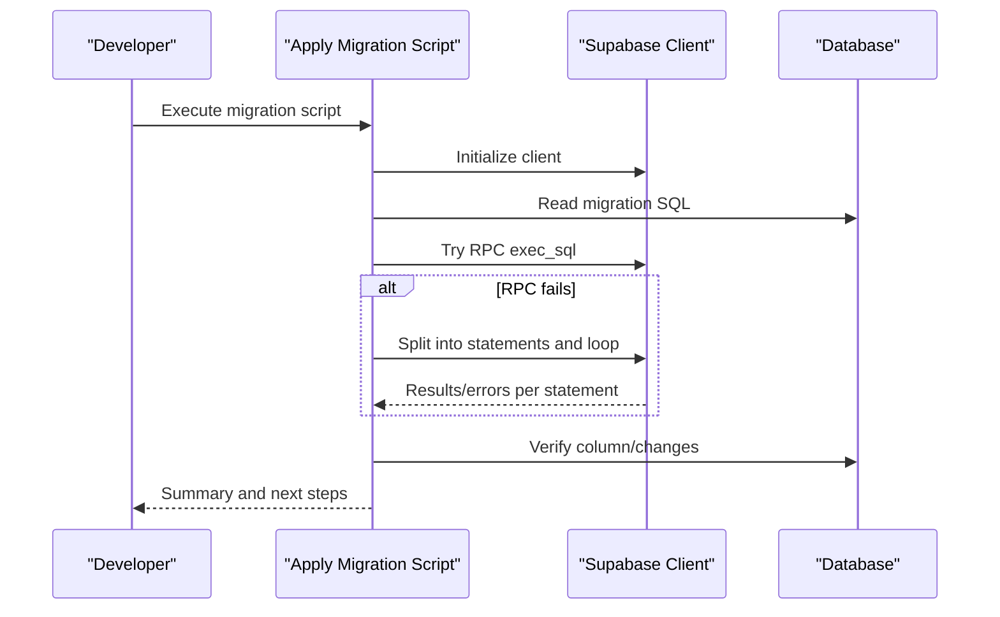

**Diagram sources**

- [scripts/apply-lens-migration.js](file://scripts/apply-lens-migration.js#L22-L61)
- [scripts/apply-products-branch-migration.js](file://scripts/apply-products-branch-migration.js#L50-L133)

**Section sources**

- [scripts/apply-lens-migration.js](file://scripts/apply-lens-migration.js#L1-L88)
- [scripts/apply-products-branch-migration.js](file://scripts/apply-products-branch-migration.js#L1-L156)

### Backup Isolation Test

Purpose:

- Validate backup folder structure and basic access in Supabase Storage for a given organization.

Usage:

- node scripts/test-backup-isolation.js

Key behaviors:

- Queries customers for a specific organization.
- Lists files in the database-backups bucket for that organization.

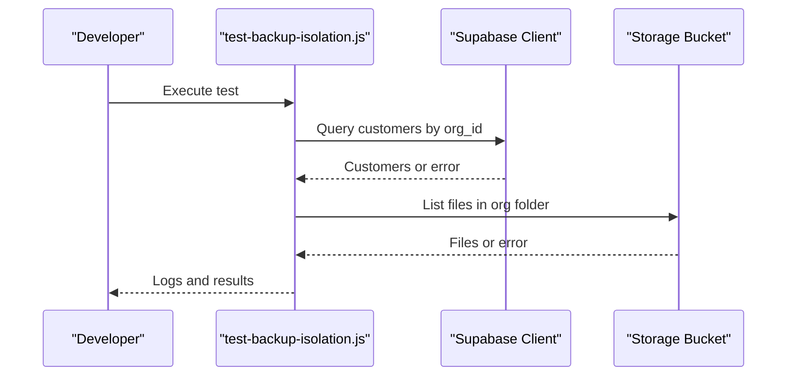

**Diagram sources**

- [scripts/test-backup-isolation.js](file://scripts/test-backup-isolation.js#L8-L46)

**Section sources**

- [scripts/test-backup-isolation.js](file://scripts/test-backup-isolation.js#L1-L47)

### File Integrity and Recovery

Purpose:

- Detect missing imports and recover files from Git history to resolve broken builds.

Usage:

- Find missing files: node scripts/find-missing-files.js
- Recover missing files: node scripts/recover-missing-files.js

Key behaviors:

- Scans TypeScript/JavaScript files under src/.
- Extracts @/ imports and verifies existence.
- Optionally searches Git history for commits that added the file and recovers it.

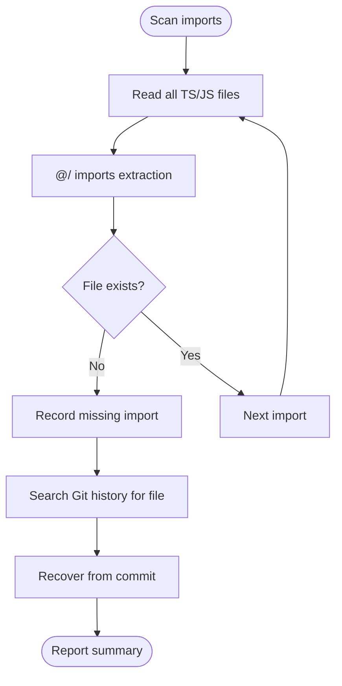

**Diagram sources**

- [scripts/find-missing-files.js](file://scripts/find-missing-files.js#L9-L83)
- [scripts/recover-missing-files.js](file://scripts/recover-missing-files.js#L8-L165)

**Section sources**

- [scripts/FIND_MISSING_FILES_README.md](file://scripts/FIND_MISSING_FILES_README.md#L1-L114)
- [scripts/find-missing-files.js](file://scripts/find-missing-files.js#L1-L138)
- [scripts/recover-missing-files.js](file://scripts/recover-missing-files.js#L1-L185)

### System Recovery (Pre-SaaS)

Purpose:

- Recover lost functionality introduced before Phase 0 of SaaS while preserving SaaS and testing changes.

Usage:

- Analyze only: node scripts/recover-pre-saas-functionality.js
- Execute recovery: node scripts/recover-pre-saas-functionality.js --execute

Key behaviors:

- Locates a pre-Phase 0 commit using multiple strategies.
- Compares current state with pre-Phase 0, analyzing diffs line-by-line.
- Categorizes files as recover/preserve/review based on confidence thresholds.
- Creates backups and executes recovery when requested.

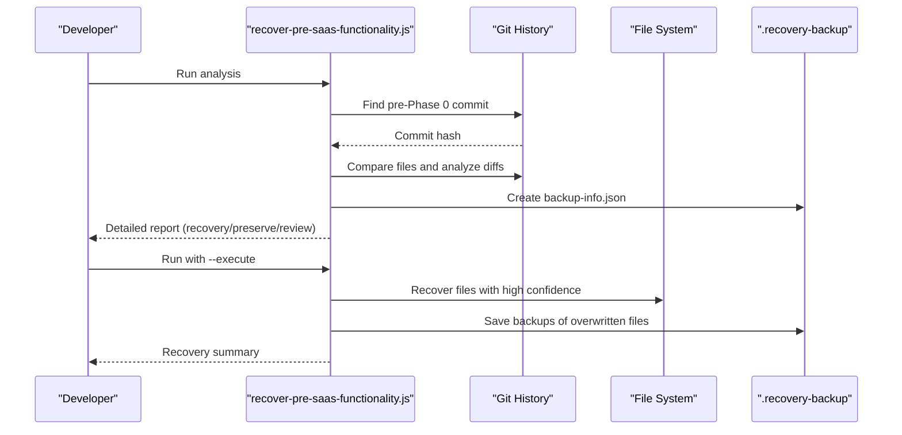

**Diagram sources**

- [scripts/recover-pre-saas-functionality.js](file://scripts/recover-pre-saas-functionality.js#L46-L139)
- [scripts/recover-pre-saas-functionality.js](file://scripts/recover-pre-saas-functionality.js#L241-L303)
- [scripts/recover-pre-saas-functionality.js](file://scripts/recover-pre-saas-functionality.js#L308-L365)
- [scripts/recover-pre-saas-functionality.js](file://scripts/recover-pre-saas-functionality.js#L370-L546)

**Section sources**

- [scripts/RECOVER_PRE_SAAS_README.md](file://scripts/RECOVER_PRE_SAAS_README.md#L1-L215)
- [scripts/recover-pre-saas-functionality.js](file://scripts/recover-pre-saas-functionality.js#L1-L547)

### Migration Verification

Purpose:

- Verify that production migrations (e.g., SaaS-related columns and values) are present and correct.

Usage:

- node scripts/verify-migrations.js

Key behaviors:

- Checks subscriptions table for gateway-related columns.
- Checks organizations table for trial overrides.
- Ensures system_config no longer references legacy branding.

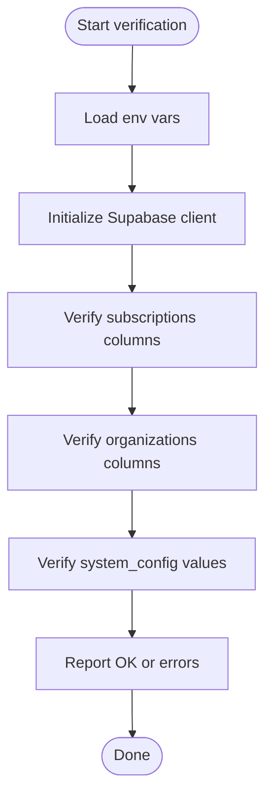

**Diagram sources**

- [scripts/verify-migrations.js](file://scripts/verify-migrations.js#L19-L64)

**Section sources**

- [scripts/verify-migrations.js](file://scripts/verify-migrations.js#L1-L70)

## Dependency Analysis

The scripts share common dependencies and patterns:

- Supabase client initialization using NEXT_PUBLIC_SUPABASE_URL and SUPABASE_SERVICE_ROLE_KEY
- Environment variable loading via dotenv
- Git operations for recovery and analysis
- TypeScript/JavaScript parsing for import detection

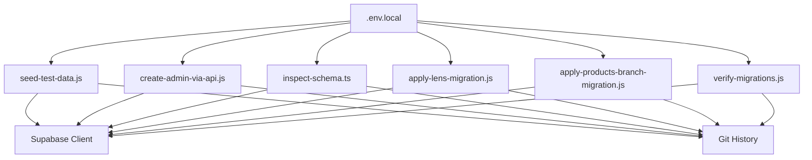

**Diagram sources**

- [scripts/seed-test-data.js](file://scripts/seed-test-data.js#L9-L13)
- [scripts/create-admin-via-api.js](file://scripts/create-admin-via-api.js#L10-L14)
- [scripts/inspect-schema.ts](file://scripts/inspect-schema.ts#L5-L8)
- [scripts/apply-lens-migration.js](file://scripts/apply-lens-migration.js#L5-L8)
- [scripts/apply-products-branch-migration.js](file://scripts/apply-products-branch-migration.js#L16-L19)
- [scripts/verify-migrations.js](file://scripts/verify-migrations.js#L6-L10)

**Section sources**

- [scripts/seed-test-data.js](file://scripts/seed-test-data.js#L9-L13)
- [scripts/create-admin-via-api.js](file://scripts/create-admin-via-api.js#L10-L14)
- [scripts/inspect-schema.ts](file://scripts/inspect-schema.ts#L5-L8)
- [scripts/apply-lens-migration.js](file://scripts/apply-lens-migration.js#L5-L8)
- [scripts/apply-products-branch-migration.js](file://scripts/apply-products-branch-migration.js#L16-L19)
- [scripts/verify-migrations.js](file://scripts/verify-migrations.js#L6-L10)

## Performance Considerations

- Batch operations: Seeding scripts perform multiple inserts; consider running during off-hours or with minimal concurrent database load.
- Import scanning: find-missing-files.js scans all TS/JS files; exclude node_modules and .next directories to avoid unnecessary overhead.
- Migration execution: apply-\* scripts iterate through statements; expect partial failures for already-applied changes and handle gracefully.
- Verification queries: verify-migrations.js performs targeted selects; keep result limits small to minimize payload.

## Troubleshooting Guide

Common issues and resolutions:

- Missing environment variables:
  - Ensure NEXT_PUBLIC_SUPABASE_URL and SUPABASE_SERVICE_ROLE_KEY are set in .env.local.
  - Scripts explicitly check for these variables and exit with errors if missing.

- Supabase connectivity:
  - Confirm Supabase is running locally and reachable at the configured URL.
  - Use npm run supabase:status to verify credentials and ports.

- Admin user creation warnings:
  - Default test credentials trigger warnings; configure ADMIN_EMAIL and ADMIN_PASSWORD for production-like environments.

- Migration application failures:
  - apply-lens-migration.js and apply-products-branch-migration.js may encounter "already exists" or similar errors; these are often benign and indicate successful prior runs.
  - If column verification fails, follow the manual SQL execution guidance in the script.

- File recovery limitations:
  - recover-missing-files.js relies on Git history; files never committed will not be recoverable automatically.
  - Use manual recovery via git show <commit>:<path> and create the file locally.

- Backup isolation:
  - test-backup-isolation.js requires a populated database and valid organization ID; ensure data exists before running.

**Section sources**

- [scripts/verify-migrations.js](file://scripts/verify-migrations.js#L12-L15)
- [scripts/apply-lens-migration.js](file://scripts/apply-lens-migration.js#L40-L57)
- [scripts/apply-products-branch-migration.js](file://scripts/apply-products-branch-migration.js#L75-L98)
- [scripts/recover-missing-files.js](file://scripts/recover-missing-files.js#L144-L165)
- [scripts/test-backup-isolation.js](file://scripts/test-backup-isolation.js#L23-L26)

## Conclusion

The Opttius development toolset provides robust capabilities for local setup, integrity checks, recovery, and maintenance. By leveraging these scripts, developers can rapidly provision environments, validate migrations, recover lost functionality, and ensure database integrity with minimal friction.

## Appendices

- Development commands overview:
  - npm run dev, npm run build, npm run start, npm run lint, npm run type-check
  - npm run supabase:start, npm run supabase:stop, npm run supabase:status, npm run supabase:reset

**Section sources**

- [README.md](file://README.md#L332-L347)
