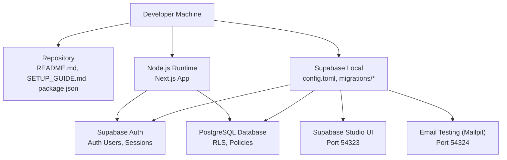
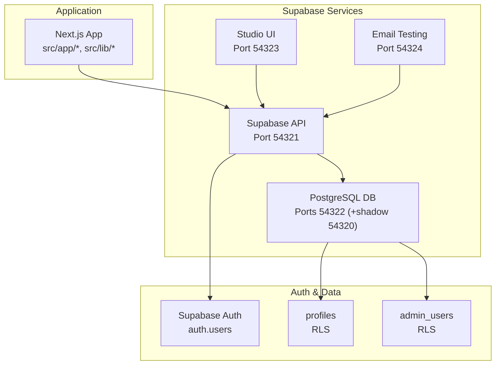
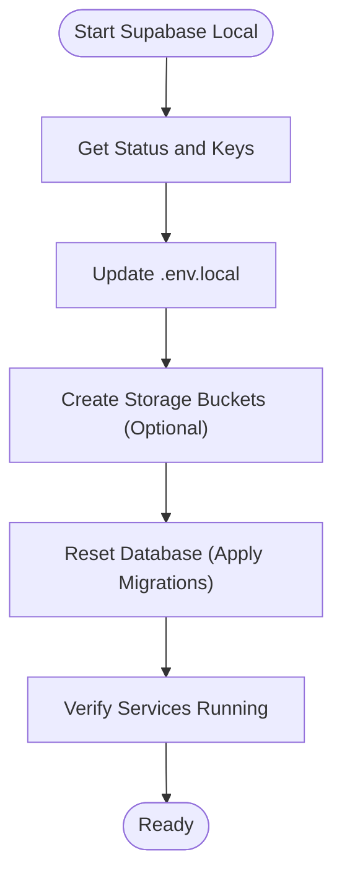
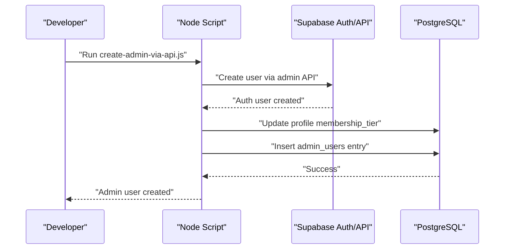
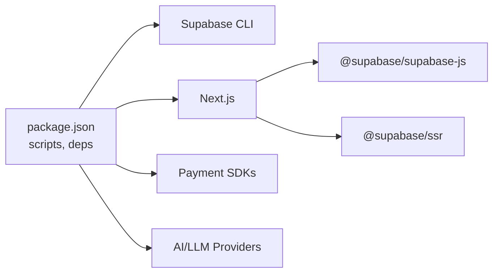

# Getting Started

<cite>
**Referenced Files in This Document**
- [README.md](file://README.md)
- [SETUP_GUIDE.md](file://SETUP_GUIDE.md)
- [package.json](file://package.json)
- [.env.local](file://.env.local)
- [env.example](file://env.example)
- [supabase/config.toml](file://supabase/config.toml)
- [scripts/create-admin-via-api.js](file://scripts/create-admin-via-api.js)
- [scripts/sql-utils/grant-admin-access.sql](file://scripts/sql-utils/grant-admin-access.sql)
- [next.config.js](file://next.config.js)
- [supabase/migrations/20241220000000_create_user_profiles.sql](file://supabase/migrations/20241220000000_create_user_profiles.sql)
- [supabase/migrations/20250116000000_setup_admin_users.sql](file://supabase/migrations/20250116000000_setup_admin_users.sql)
- [supabase/migrations/20260128000000_create_organizations_and_subscriptions.sql](file://supabase/migrations/20260128000000_create_organizations_and_subscriptions.sql)
</cite>

## Table of Contents

1. [Introduction](#introduction)
2. [Project Structure](#project-structure)
3. [Core Components](#core-components)
4. [Architecture Overview](#architecture-overview)
5. [Detailed Component Analysis](#detailed-component-analysis)
6. [Dependency Analysis](#dependency-analysis)
7. [Performance Considerations](#performance-considerations)
8. [Troubleshooting Guide](#troubleshooting-guide)
9. [Conclusion](#conclusion)
10. [Appendices](#appendices)

## Introduction

This guide helps you rapidly onboard Opttius for local development. You will:

- Confirm prerequisites (Node.js, Docker, Git)
- Clone the repository and install dependencies
- Start Supabase locally and apply database migrations
- Configure environment variables
- Create your first administrator user via multiple methods
- Start the development server and access the admin dashboard
- Configure optional integrations (email, payments, AI providers)
- Troubleshoot common setup issues

## Project Structure

Opttius is a Next.js 14 application with Supabase for authentication, real-time, and database. Supabase migrations define the schema and RLS policies. Optional integrations (email, payments, AI) are configured via environment variables.

**Diagram sources**

- [README.md](file://README.md#L88-L120)
- [supabase/config.toml](file://supabase/config.toml#L1-L345)

**Section sources**

- [README.md](file://README.md#L88-L120)
- [SETUP_GUIDE.md](file://SETUP_GUIDE.md#L1-L50)
- [package.json](file://package.json#L1-L134)

## Core Components

- Supabase local development stack (API, DB, Studio, Mailpit)
- Next.js application with App Router
- Authentication and authorization via Supabase Auth
- Row Level Security (RLS) policies for data isolation
- Environment-driven integrations (email, payments, AI)

**Section sources**

- [README.md](file://README.md#L74-L86)
- [supabase/config.toml](file://supabase/config.toml#L1-L345)
- [next.config.js](file://next.config.js#L1-L161)

## Architecture Overview

The system uses Supabase for backend services and PostgreSQL for persistence. The Next.js app communicates with Supabase via the JavaScript client. Migrations define the schema and RLS policies. Admin users are managed separately from regular users and are granted access via the admin_users table and RLS checks.

**Diagram sources**

- [supabase/config.toml](file://supabase/config.toml#L7-L100)
- [supabase/migrations/20241220000000_create_user_profiles.sql](file://supabase/migrations/20241220000000_create_user_profiles.sql#L1-L82)
- [supabase/migrations/20250116000000_setup_admin_users.sql](file://supabase/migrations/20250116000000_setup_admin_users.sql#L1-L280)

## Detailed Component Analysis

### Prerequisites and Installation

- Node.js >= 18.0.0
- npm or yarn
- Docker Desktop (for Supabase local)
- Git

Install dependencies and start the Supabase local stack:

- Install dependencies
- Start Docker Desktop
- Start Supabase local
- Retrieve credentials and update environment variables
- Apply database migrations
- Start the Next.js development server

Access points:

- Main app: http://localhost:3000
- Admin panel: http://localhost:3000/admin
- Supabase Studio: http://127.0.0.1:54323
- Email testing (Mailpit): http://127.0.0.1:54324

**Section sources**

- [README.md](file://README.md#L88-L120)
- [SETUP_GUIDE.md](file://SETUP_GUIDE.md#L5-L51)
- [SETUP_GUIDE.md](file://SETUP_GUIDE.md#L73-L163)
- [SETUP_GUIDE.md](file://SETUP_GUIDE.md#L166-L204)
- [SETUP_GUIDE.md](file://SETUP_GUIDE.md#L207-L233)

### Supabase Local Setup and Migrations

- Start Supabase local
- Get status and copy keys
- Update .env.local with Supabase URL, anon key, and service role key
- Create storage directories (optional)
- Reset database to apply migrations

Migrations include:

- User profiles and RLS
- Admin users and activity logging
- Multi-tenancy foundations (organizations, subscriptions, tiers)

**Diagram sources**

- [SETUP_GUIDE.md](file://SETUP_GUIDE.md#L81-L172)
- [supabase/config.toml](file://supabase/config.toml#L1-L345)

**Section sources**

- [SETUP_GUIDE.md](file://SETUP_GUIDE.md#L81-L172)
- [supabase/migrations/20241220000000_create_user_profiles.sql](file://supabase/migrations/20241220000000_create_user_profiles.sql#L1-L82)
- [supabase/migrations/20250116000000_setup_admin_users.sql](file://supabase/migrations/20250116000000_setup_admin_users.sql#L1-L280)
- [supabase/migrations/20260128000000_create_organizations_and_subscriptions.sql](file://supabase/migrations/20260128000000_create_organizations_and_subscriptions.sql#L1-L287)

### First-Time Administrator Creation

Choose one of three methods:

1. Node.js script (recommended for local)

- Set ADMIN_EMAIL and ADMIN_PASSWORD (or pass as arguments)
- Run the script to create an auth user, set profile membership_tier to admin, and insert admin_users record

2. SQL script

- Edit the SQL script to target your email
- Execute via Docker to grant admin access

3. Supabase Studio

- Register a user via the app
- Open Studio SQL Editor and run the provided SQL to grant admin access

Verification:

- Query the admin_users table to confirm your admin user exists

**Diagram sources**

- [scripts/create-admin-via-api.js](file://scripts/create-admin-via-api.js#L1-L165)

**Section sources**

- [README.md](file://README.md#L206-L282)
- [SETUP_GUIDE.md](file://SETUP_GUIDE.md#L235-L372)
- [scripts/create-admin-via-api.js](file://scripts/create-admin-via-api.js#L1-L165)
- [scripts/sql-utils/grant-admin-access.sql](file://scripts/sql-utils/grant-admin-access.sql#L1-L68)

### Development Server Startup and Access

- Start the Next.js development server
- Open http://localhost:3000
- Log in with your admin credentials
- Access the admin dashboard at http://localhost:3000/admin

**Section sources**

- [README.md](file://README.md#L193-L205)
- [SETUP_GUIDE.md](file://SETUP_GUIDE.md#L207-L233)

### Environment Variable Configuration (Optional Integrations)

Configure integrations by adding values to .env.local (copy from env.example):

- Email: Resend API key and sender email
- Payments: Mercado Pago (access token, public key, webhook secret), sandbox mode
- Cryptocurrency payments: NOWPayments (API key, IPN secret), sandbox mode
- PayPal: Client ID, Client Secret, API base URL
- Analytics: Google Analytics ID
- AI/LLM providers: Default provider, model, fallback providers, and provider-specific keys
- Cloud storage: Cloudinary, Cloudflare R2 (account, keys, bucket, region, public URL)
- Security: NEXTAUTH_SECRET, NEXTAUTH_URL
- Demo/root users: Demo admin and root user credentials
- ngrok: Authtoken for tunneling

**Section sources**

- [env.example](file://env.example#L1-L120)
- [.env.local](file://.env.local#L1-L116)
- [README.md](file://README.md#L519-L548)

## Dependency Analysis

- Node.js runtime and package manager
- Supabase CLI and Docker for local database and services
- Next.js App Router and related libraries
- Supabase client libraries for SSR and JS
- Optional payment SDKs and AI/LLM providers

**Diagram sources**

- [package.json](file://package.json#L1-L134)

**Section sources**

- [package.json](file://package.json#L1-L134)

## Performance Considerations

- First-time Docker image downloads may take several minutes; subsequent starts are faster
- Database reset applies many migrations; expect a few minutes
- Use the provided scripts to avoid manual steps and reduce errors
- Keep Docker and Supabase ports free; adjust config.toml if needed

[No sources needed since this section provides general guidance]

## Troubleshooting Guide

Common issues and resolutions:

- Supabase won’t start
  - Ensure Docker Desktop is running
  - Stop and restart Supabase

- Port conflicts (54321–54324)
  - Adjust ports in supabase/config.toml

- Migration errors
  - Reset the database completely

- Build errors
  - Clear Next.js cache and reinstall dependencies

- Cannot access admin panel
  - Verify login
  - Check admin_users table for your user
  - Verify admin status via helper functions

**Section sources**

- [README.md](file://README.md#L443-L491)
- [SETUP_GUIDE.md](file://SETUP_GUIDE.md#L446-L488)

## Conclusion

You now have a fully functional local development environment for Opttius. You can create an administrator, explore the admin dashboard, and configure optional integrations. If you encounter issues, use the troubleshooting steps above or consult the project’s documentation.

[No sources needed since this section summarizes without analyzing specific files]

## Appendices

### Quick Commands Reference

- Start Supabase: npm run supabase:start
- Stop Supabase: npm run supabase:stop
- Check status: npm run supabase:status
- Reset database: npm run supabase:reset
- Start dev server: npm run dev
- Build for production: npm run build
- Start production: npm run start

**Section sources**

- [README.md](file://README.md#L332-L347)
- [SETUP_GUIDE.md](file://SETUP_GUIDE.md#L400-L432)
