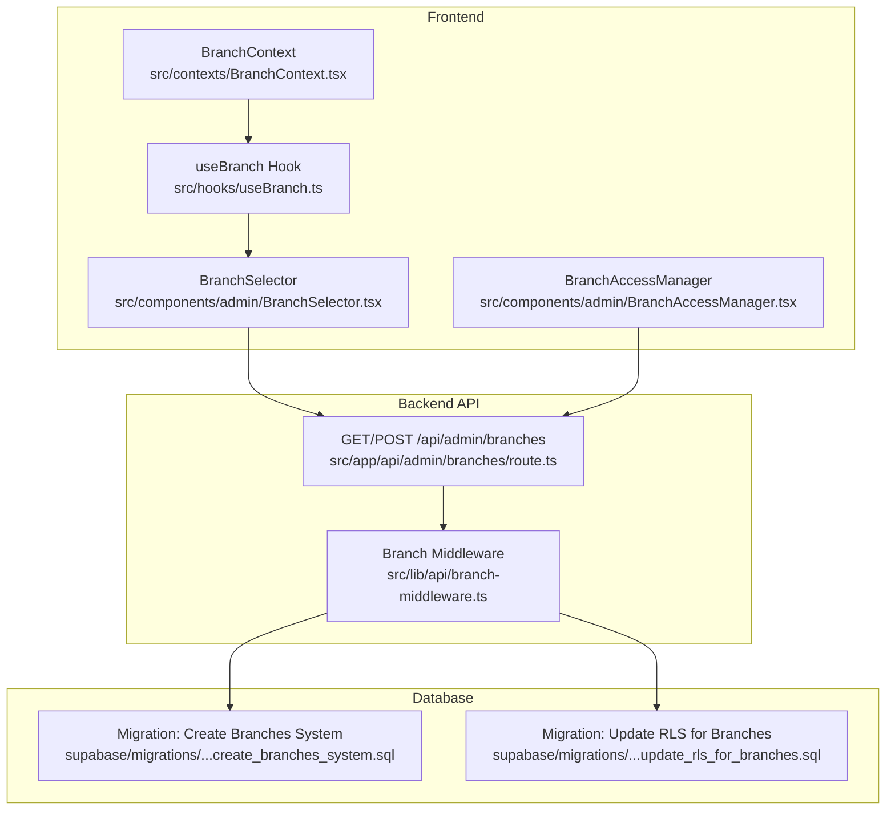
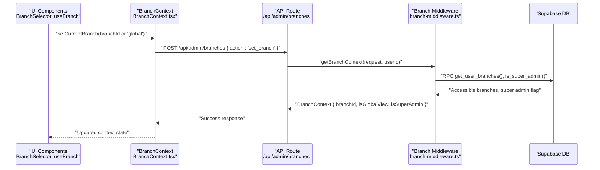
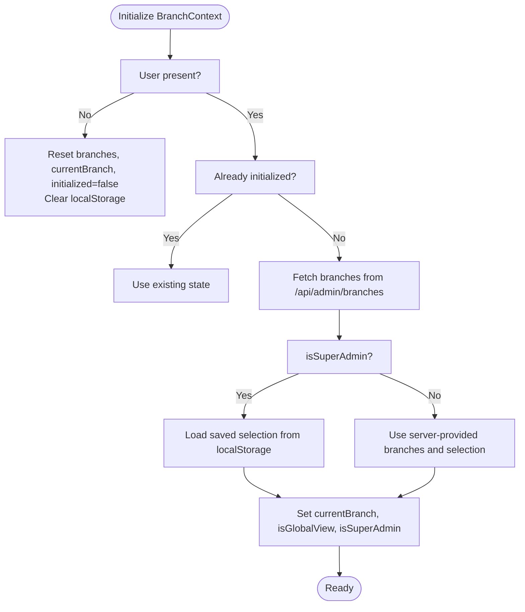
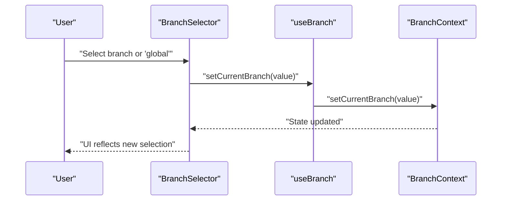
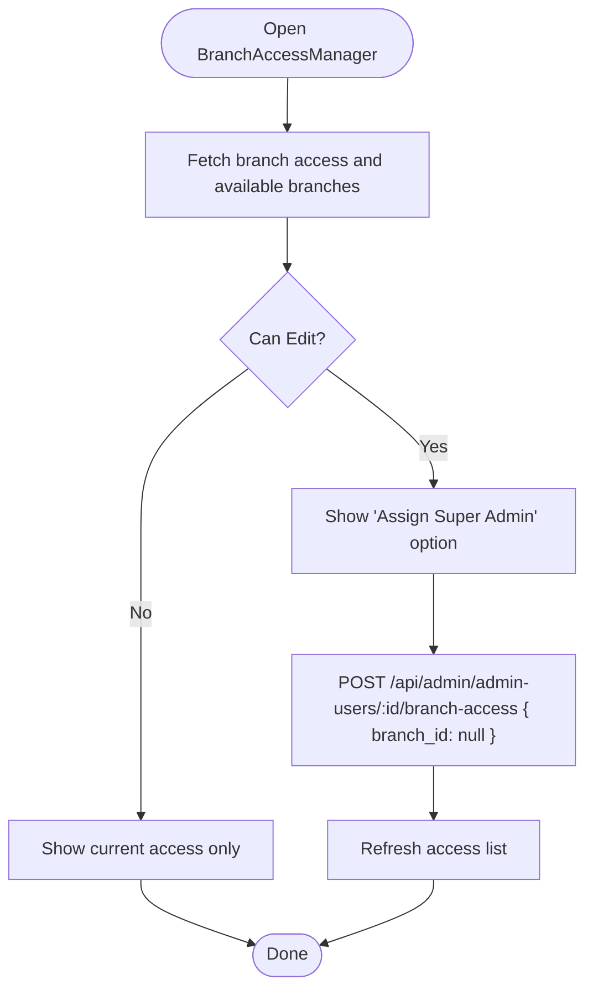
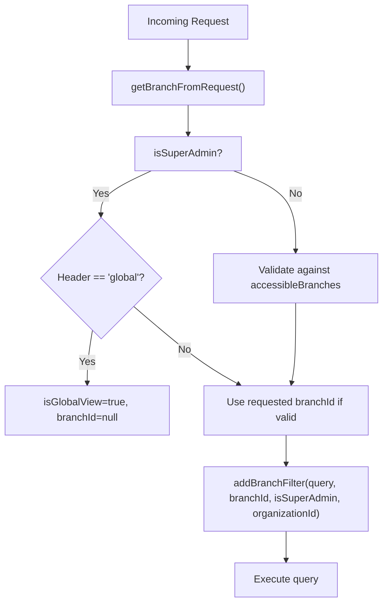
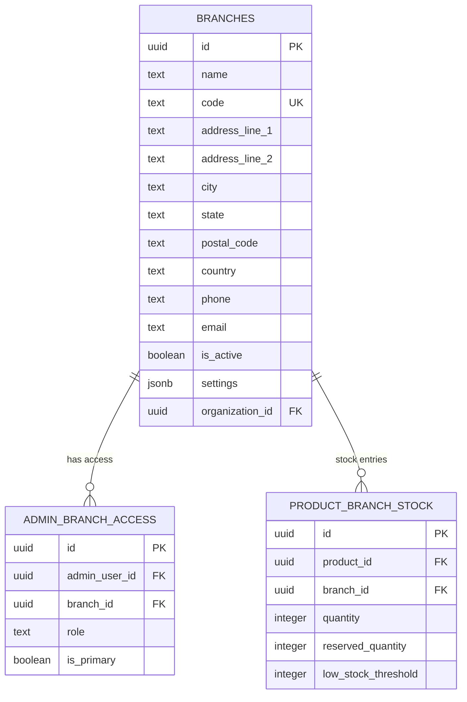
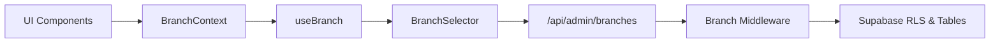

# Branch Operations

<cite>
**Referenced Files in This Document**
- [BranchContext.tsx](file://src/contexts/BranchContext.tsx)
- [useBranch.ts](file://src/hooks/useBranch.ts)
- [BranchSelector.tsx](file://src/components/admin/BranchSelector.tsx)
- [BranchAccessManager.tsx](file://src/components/admin/BranchAccessManager.tsx)
- [branch-middleware.ts](file://src/lib/api/branch-middleware.ts)
- [branches route.ts](file://src/app/api/admin/branches/route.ts)
- [admin dashboard page.tsx](file://src/app/admin/page.tsx)
- [admin layout.tsx](file://src/app/admin/layout.tsx)
- [create_branches_system.sql](file://supabase/migrations/20251216000000_create_branches_system.sql)
- [update_rls_for_branches.sql](file://supabase/migrations/20251216000001_update_rls_for_branches.sql)
</cite>

## Table of Contents

1. [Introduction](#introduction)
2. [Project Structure](#project-structure)
3. [Core Components](#core-components)
4. [Architecture Overview](#architecture-overview)
5. [Detailed Component Analysis](#detailed-component-analysis)
6. [Dependency Analysis](#dependency-analysis)
7. [Performance Considerations](#performance-considerations)
8. [Troubleshooting Guide](#troubleshooting-guide)
9. [Conclusion](#conclusion)

## Introduction

This document explains branch operations within the multi-tenant system. It covers branch-level management (creation, configuration, operational settings), the branch selector, branch-specific data filtering, location-based business logic, branch-aware queries, data segregation, and context management. It also documents branch switching workflows, branch-specific configurations, user permissions and access controls, data synchronization, performance considerations, and troubleshooting.

## Project Structure

The branch system spans frontend React components and hooks, backend API routes, and Supabase database migrations implementing row-level security (RLS) policies and branch-aware tables.

**Diagram sources**

- [BranchContext.tsx](file://src/contexts/BranchContext.tsx#L1-L216)
- [useBranch.ts](file://src/hooks/useBranch.ts#L1-L53)
- [BranchSelector.tsx](file://src/components/admin/BranchSelector.tsx#L1-L107)
- [BranchAccessManager.tsx](file://src/components/admin/BranchAccessManager.tsx#L1-L342)
- [branches route.ts](file://src/app/api/admin/branches/route.ts#L1-L267)
- [branch-middleware.ts](file://src/lib/api/branch-middleware.ts#L1-L263)
- [create_branches_system.sql](file://supabase/migrations/20251216000000_create_branches_system.sql#L1-L397)
- [update_rls_for_branches.sql](file://supabase/migrations/20251216000001_update_rls_for_branches.sql#L1-L370)

**Section sources**

- [BranchContext.tsx](file://src/contexts/BranchContext.tsx#L1-L216)
- [useBranch.ts](file://src/hooks/useBranch.ts#L1-L53)
- [BranchSelector.tsx](file://src/components/admin/BranchSelector.tsx#L1-L107)
- [BranchAccessManager.tsx](file://src/components/admin/BranchAccessManager.tsx#L1-L342)
- [branches route.ts](file://src/app/api/admin/branches/route.ts#L1-L267)
- [branch-middleware.ts](file://src/lib/api/branch-middleware.ts#L1-L263)
- [create_branches_system.sql](file://supabase/migrations/20251216000000_create_branches_system.sql#L1-L397)
- [update_rls_for_branches.sql](file://supabase/migrations/20251216000001_update_rls_for_branches.sql#L1-L370)

## Core Components

- BranchContext: Centralizes branch state, current branch, global view flag, super admin flag, and provides setters and refresh mechanisms. It manages initialization, persistence via localStorage, and distinguishes between super admin and regular admin views.
- useBranch: Provides a convenient hook to access current branch metadata, flags, and utility functions for switching and refreshing branches.
- BranchSelector: UI component rendering a branch selector dropdown with global view option for super admins and branch list for regular admins.
- BranchAccessManager: Manages admin user access to branches, enabling assignment/removal of branch access and granting super admin privileges.
- Branch Middleware: Extracts branch context from requests, validates access, and scopes queries to either a specific branch or organization-wide (global view) for super admins.
- Branch API: Handles listing branches, creating branches (super admin only), and branch selection notifications.

**Section sources**

- [BranchContext.tsx](file://src/contexts/BranchContext.tsx#L1-L216)
- [useBranch.ts](file://src/hooks/useBranch.ts#L1-L53)
- [BranchSelector.tsx](file://src/components/admin/BranchSelector.tsx#L1-L107)
- [BranchAccessManager.tsx](file://src/components/admin/BranchAccessManager.tsx#L1-L342)
- [branch-middleware.ts](file://src/lib/api/branch-middleware.ts#L1-L263)
- [branches route.ts](file://src/app/api/admin/branches/route.ts#L1-L267)

## Architecture Overview

The branch architecture integrates frontend context management with backend API routes and Supabase RLS policies. Requests carry a branch context header that the backend resolves into a branchId or global view for super admins. Queries are scoped accordingly, ensuring data segregation across branches and organizations.

**Diagram sources**

- [BranchSelector.tsx](file://src/components/admin/BranchSelector.tsx#L1-L107)
- [useBranch.ts](file://src/hooks/useBranch.ts#L1-L53)
- [BranchContext.tsx](file://src/contexts/BranchContext.tsx#L1-L216)
- [branches route.ts](file://src/app/api/admin/branches/route.ts#L114-L133)
- [branch-middleware.ts](file://src/lib/api/branch-middleware.ts#L48-L210)

## Detailed Component Analysis

### BranchContext and useBranch

- Responsibilities:
  - Initialize branch list and current selection from Supabase and localStorage.
  - Manage global view for super admins and branch-scoped view for regular admins.
  - Persist selections locally and refresh lists when needed.
- Key behaviors:
  - Super admins: default to global view; can switch to any branch; selection stored in localStorage.
  - Regular admins: use server-provided accessible branches; selection validated against access.
  - Loading and error states are tracked to ensure safe UI transitions.

**Diagram sources**

- [BranchContext.tsx](file://src/contexts/BranchContext.tsx#L38-L207)

**Section sources**

- [BranchContext.tsx](file://src/contexts/BranchContext.tsx#L1-L216)
- [useBranch.ts](file://src/hooks/useBranch.ts#L1-L53)

### Branch Selector

- Renders a dropdown with:
  - Global view option for super admins.
  - List of accessible branches for regular admins.
- Handles selection changes by calling the context setter and persists the selection in localStorage.

**Diagram sources**

- [BranchSelector.tsx](file://src/components/admin/BranchSelector.tsx#L15-L107)
- [useBranch.ts](file://src/hooks/useBranch.ts#L40-L52)
- [BranchContext.tsx](file://src/contexts/BranchContext.tsx#L157-L176)

**Section sources**

- [BranchSelector.tsx](file://src/components/admin/BranchSelector.tsx#L1-L107)
- [useBranch.ts](file://src/hooks/useBranch.ts#L1-L53)
- [BranchContext.tsx](file://src/contexts/BranchContext.tsx#L1-L216)

### Branch Access Management

- Allows super admins to:
  - Assign super admin status to an admin user (access to all branches).
  - Assign branch access to an admin user.
  - Remove branch access or super admin status.
- Enforces edit permissions and displays appropriate UI states.

**Diagram sources**

- [BranchAccessManager.tsx](file://src/components/admin/BranchAccessManager.tsx#L45-L342)

**Section sources**

- [BranchAccessManager.tsx](file://src/components/admin/BranchAccessManager.tsx#L1-L342)

### Branch Middleware and API

- getBranchFromRequest: Extracts branch context from headers or query parameters.
- getBranchContext: Resolves current branchId, global view flag, and accessible branches for the user, including organization scoping for super admins.
- validateBranchAccess: Validates whether a user can access a given branch.
- addBranchFilter: Adds branch filters to Supabase queries; when in global view (super admin without branchId), scopes by organization to prevent cross-organization leakage.

**Diagram sources**

- [branch-middleware.ts](file://src/lib/api/branch-middleware.ts#L23-L263)

**Section sources**

- [branch-middleware.ts](file://src/lib/api/branch-middleware.ts#L1-L263)
- [branches route.ts](file://src/app/api/admin/branches/route.ts#L1-L267)

### Database Schema and RLS

- Branches table stores branch metadata and optional organization association.
- Admin branch access table defines which admins can access which branches, with roles and primary branch flags.
- Product branch stock table tracks inventory per branch.
- RLS policies ensure:
  - Admins can view/manage only their accessible branches.
  - Super admins can manage branches and optionally access global view scoped to their organization.
  - Queries are filtered by branch_id or organization_id depending on context.

**Diagram sources**

- [create_branches_system.sql](file://supabase/migrations/20251216000000_create_branches_system.sql#L4-L96)
- [update_rls_for_branches.sql](file://supabase/migrations/20251216000001_update_rls_for_branches.sql#L7-L370)

**Section sources**

- [create_branches_system.sql](file://supabase/migrations/20251216000000_create_branches_system.sql#L1-L397)
- [update_rls_for_branches.sql](file://supabase/migrations/20251216000001_update_rls_for_branches.sql#L1-L370)

## Dependency Analysis

- Frontend depends on:
  - BranchContext for state management.
  - useBranch hook for convenient accessors.
  - BranchSelector for UI interaction.
  - BranchAccessManager for admin access configuration.
- Backend depends on:
  - Branch middleware to resolve context and enforce access.
  - Supabase RLS policies to filter data.
- Database migrations define:
  - Branches, admin access, and stock tables.
  - RLS policies and RPC functions for access control.

**Diagram sources**

- [BranchContext.tsx](file://src/contexts/BranchContext.tsx#L1-L216)
- [useBranch.ts](file://src/hooks/useBranch.ts#L1-L53)
- [BranchSelector.tsx](file://src/components/admin/BranchSelector.tsx#L1-L107)
- [branches route.ts](file://src/app/api/admin/branches/route.ts#L1-L267)
- [branch-middleware.ts](file://src/lib/api/branch-middleware.ts#L1-L263)
- [create_branches_system.sql](file://supabase/migrations/20251216000000_create_branches_system.sql#L1-L397)

**Section sources**

- [BranchContext.tsx](file://src/contexts/BranchContext.tsx#L1-L216)
- [useBranch.ts](file://src/hooks/useBranch.ts#L1-L53)
- [BranchSelector.tsx](file://src/components/admin/BranchSelector.tsx#L1-L107)
- [BranchAccessManager.tsx](file://src/components/admin/BranchAccessManager.tsx#L1-L342)
- [branches route.ts](file://src/app/api/admin/branches/route.ts#L1-L267)
- [branch-middleware.ts](file://src/lib/api/branch-middleware.ts#L1-L263)
- [create_branches_system.sql](file://supabase/migrations/20251216000000_create_branches_system.sql#L1-L397)
- [update_rls_for_branches.sql](file://supabase/migrations/20251216000001_update_rls_for_branches.sql#L1-L370)

## Performance Considerations

- Client-side caching:
  - BranchContext caches branch lists and selections in memory and localStorage to minimize network requests.
  - Super admins bypass server fetches for branch lists when not forcing refresh.
- Efficient UI updates:
  - useBranch exposes derived values (currentBranchId, currentBranchName, canSwitchBranch) to avoid recomputation in consumers.
- API efficiency:
  - Branch API returns merged access metadata with branch details to reduce subsequent requests.
  - Branch middleware resolves context once per request and scopes queries efficiently.
- Database indexing:
  - Indexes on branch_id and code improve lookup performance for branch queries and access validations.

[No sources needed since this section provides general guidance]

## Troubleshooting Guide

Common issues and resolutions:

- Unauthorized access to branches:
  - Verify user role and access via RPC functions and RLS policies. Ensure the user has access to the requested branch or is a super admin.
- Global view not available:
  - Only super admins can use global view. Confirm isSuperAdmin flag and that the header indicates global context.
- Branch switching does nothing:
  - Ensure setCurrentBranch is called with a valid branchId or "global". Confirm localStorage persistence and context updates.
- Data leakage across organizations:
  - When in global view, queries must be scoped by organizationId. Verify addBranchFilter logic and organizationId resolution.
- Branch creation failures:
  - Check tier limits and unique branch codes scoped to the organization. Validate required fields and super admin permissions.

**Section sources**

- [branch-middleware.ts](file://src/lib/api/branch-middleware.ts#L215-L235)
- [branches route.ts](file://src/app/api/admin/branches/route.ts#L135-L161)
- [update_rls_for_branches.sql](file://supabase/migrations/20251216000001_update_rls_for_branches.sql#L317-L363)

## Conclusion

The branch operations system provides robust multi-tenant capabilities with clear separation of concerns between frontend context management, backend API routing, and database-level RLS policies. It supports branch creation, access control, global view for super admins, and branch-aware queries scoped to either individual branches or organizations. The design emphasizes performance, security, and usability through localStorage persistence, efficient middleware, and strict data segregation.
