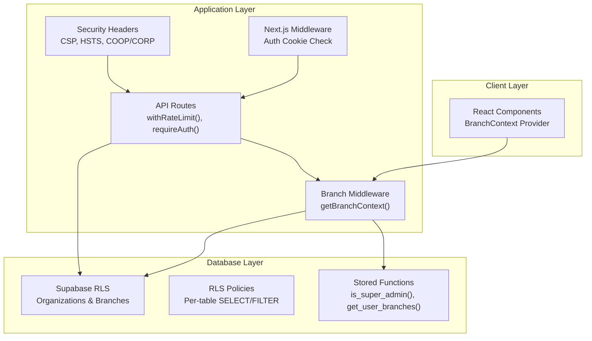
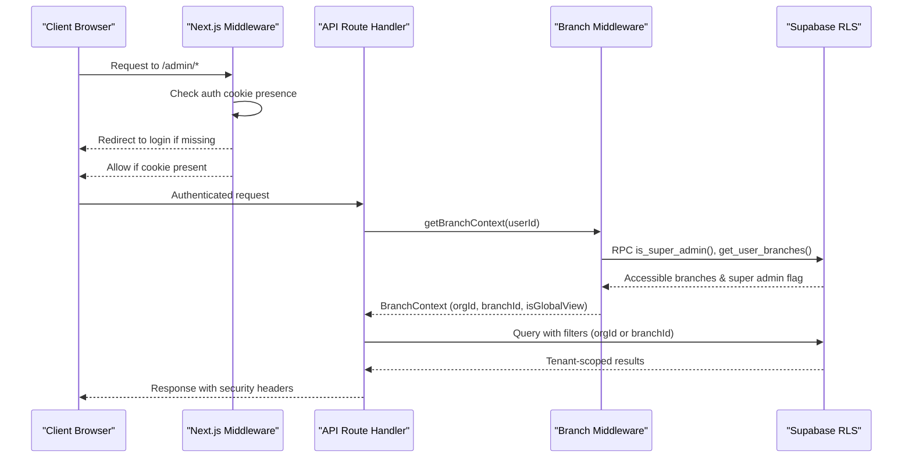
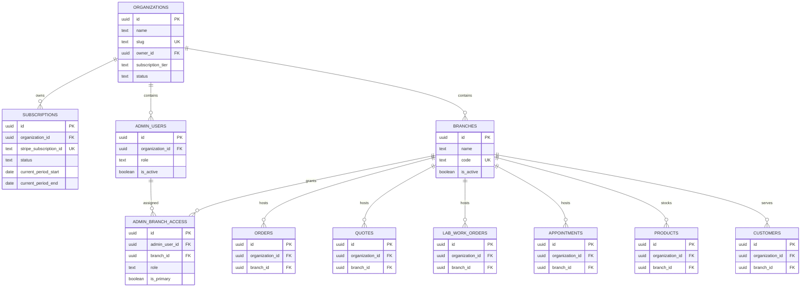
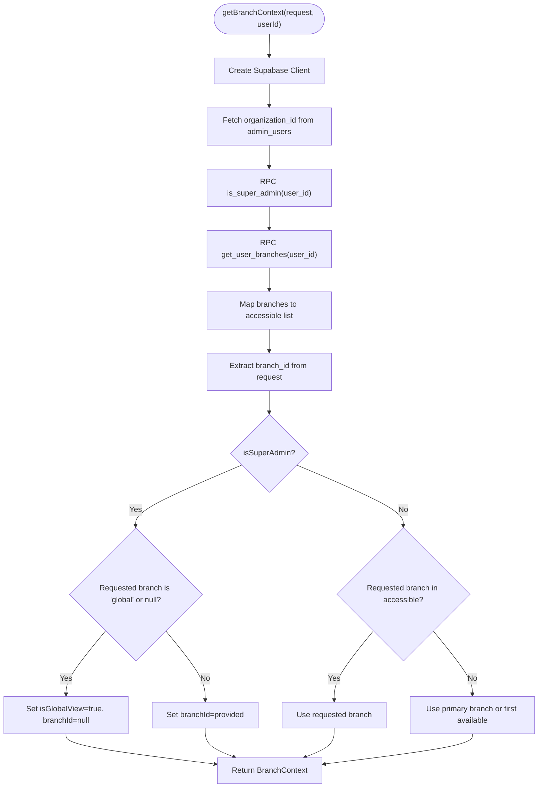
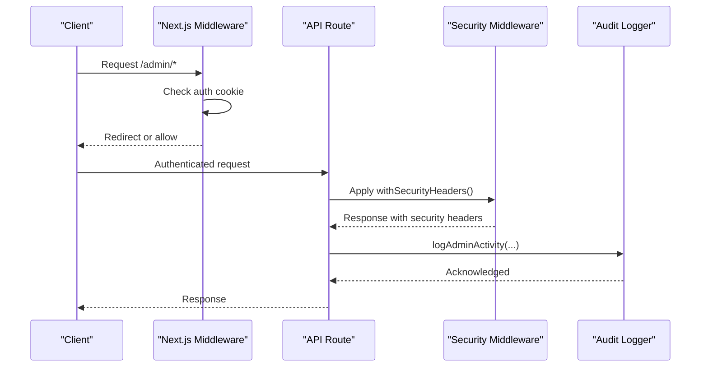
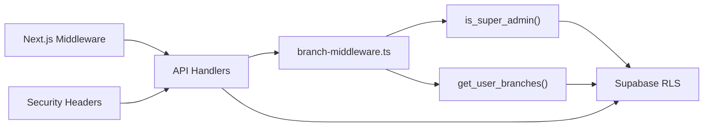

# Data Isolation & Security

<cite>
**Referenced Files in This Document**
- [middleware.ts](file://src/middleware.ts)
- [BranchContext.tsx](file://src/contexts/BranchContext.tsx)
- [branch-middleware.ts](file://src/lib/api/branch-middleware.ts)
- [server.ts](file://src/utils/supabase/server.ts)
- [middleware.ts](file://src/lib/api/middleware.ts)
- [20260128000000_create_organizations_and_subscriptions.sql](file://supabase/migrations/20260128000000_create_organizations_and_subscriptions.sql)
- [20260128000001_extend_rls_for_multitenancy.sql](file://supabase/migrations/20260128000001_extend_rls_for_multitenancy.sql)
- [20251216000000_create_branches_system.sql](file://supabase/migrations/20251216000000_create_branches_system.sql)
- [20251216000001_update_rls_for_branches.sql](file://supabase/migrations/20251216000001_update_rls_for_branches.sql)
- [20260204000000_fix_root_user_branch_access.sql](file://supabase/migrations/20260204000000_fix_root_user_branch_access.sql)
- [test-multitenancy-detection.js](file://scripts/test-multitenancy-detection.js)
- [customers.test.ts](file://src/__tests__/integration/api/customers.test.ts)
- [orders.test.ts](file://src/__tests__/integration/api/orders.test.ts)
- [products.test.ts](file://src/__tests__/integration/api/products.test.ts)
- [route.ts](file://src/app/api/admin/system/maintenance/route.ts)
- [route.ts](file://src/app/api/test-headers/route.ts)
- [route.ts](file://src/app/admin/system/page.tsx)
- [route.ts](file://src/app/admin/system/page.backup.tsx)
</cite>

## Table of Contents

1. [Introduction](#introduction)
2. [Project Structure](#project-structure)
3. [Core Components](#core-components)
4. [Architecture Overview](#architecture-overview)
5. [Detailed Component Analysis](#detailed-component-analysis)
6. [Dependency Analysis](#dependency-analysis)
7. [Performance Considerations](#performance-considerations)
8. [Troubleshooting Guide](#troubleshooting-guide)
9. [Conclusion](#conclusion)
10. [Appendices](#appendices)

## Introduction

This document explains the multi-tenant data isolation and security mechanisms implemented in the Opttius application. It covers Row Level Security (RLS) policies, tenant-aware query patterns, middleware-based tenant verification, context propagation, and security boundary enforcement. It documents organization-level and branch-level segregation, database-level isolation, and application-level filtering. Practical examples demonstrate secure data access patterns, tenant-aware CRUD operations, and policy enforcement. The document also addresses security context relationships with user permissions, audit trails, compliance considerations, best practices, vulnerability mitigation, and troubleshooting guidance.

## Project Structure

The multi-tenant security model spans three layers:

- Database layer: Supabase RLS policies and stored functions enforce tenant and branch boundaries.
- Application layer: Next.js middleware, branch context provider, and API middleware orchestrate tenant verification and query scoping.
- Client layer: React context and UI components propagate branch and organization context to user actions.

**Diagram sources**

- [middleware.ts](file://src/middleware.ts#L14-L95)
- [BranchContext.tsx](file://src/contexts/BranchContext.tsx#L38-L206)
- [branch-middleware.ts](file://src/lib/api/branch-middleware.ts#L48-L210)
- [middleware.ts](file://src/lib/api/middleware.ts#L75-L201)
- [20260128000000_create_organizations_and_subscriptions.sql](file://supabase/migrations/20260128000000_create_organizations_and_subscriptions.sql#L88-L208)
- [20251216000000_create_branches_system.sql](file://supabase/migrations/20251216000000_create_branches_system.sql#L99-L188)

**Section sources**

- [middleware.ts](file://src/middleware.ts#L14-L95)
- [BranchContext.tsx](file://src/contexts/BranchContext.tsx#L38-L206)
- [branch-middleware.ts](file://src/lib/api/branch-middleware.ts#L48-L210)
- [middleware.ts](file://src/lib/api/middleware.ts#L75-L201)
- [20260128000000_create_organizations_and_subscriptions.sql](file://supabase/migrations/20260128000000_create_organizations_and_subscriptions.sql#L88-L208)
- [20251216000000_create_branches_system.sql](file://supabase/migrations/20251216000000_create_branches_system.sql#L99-L188)

## Core Components

- Tenant identification and verification:
  - Supabase RLS policies enforce organization-level isolation using a helper function to resolve the current user’s organization.
  - Branch-level access is enforced via stored functions and policies that filter by branch membership or super admin status.
- Branch context provider:
  - React context manages current branch, global view flag, and accessible branches for the authenticated user.
- API middleware:
  - Authentication via bearer tokens for programmatic access.
  - Rate limiting, security headers, and audit logging for admin activities.
- Supabase client utilities:
  - Server-side client creation supports both cookie-based and token-based authentication for API routes.

**Section sources**

- [20260128000000_create_organizations_and_subscriptions.sql](file://supabase/migrations/20260128000000_create_organizations_and_subscriptions.sql#L5-L22)
- [20260128000001_extend_rls_for_multitenancy.sql](file://supabase/migrations/20260128000001_extend_rls_for_multitenancy.sql#L5-L22)
- [20251216000000_create_branches_system.sql](file://supabase/migrations/20251216000000_create_branches_system.sql#L99-L188)
- [BranchContext.tsx](file://src/contexts/BranchContext.tsx#L38-L206)
- [branch-middleware.ts](file://src/lib/api/branch-middleware.ts#L48-L210)
- [server.ts](file://src/utils/supabase/server.ts#L43-L92)
- [middleware.ts](file://src/lib/api/middleware.ts#L75-L201)

## Architecture Overview

The system enforces security at the database and application layers:

- Database-level isolation:
  - Organizations and subscriptions tables enable multi-tenancy with RLS policies.
  - Per-table policies filter data by organization_id and branch_id.
  - Stored functions determine super admin status and accessible branches.

- Application-level enforcement:
  - Next.js middleware validates authentication cookies for protected routes.
  - Branch middleware resolves user’s organization, accessible branches, and current branch context.
  - API routes apply authentication, rate limiting, and security headers.
  - Audit logging captures administrative actions.

**Diagram sources**

- [middleware.ts](file://src/middleware.ts#L14-L95)
- [branch-middleware.ts](file://src/lib/api/branch-middleware.ts#L48-L210)
- [20260128000001_extend_rls_for_multitenancy.sql](file://supabase/migrations/20260128000001_extend_rls_for_multitenancy.sql#L118-L171)
- [20251216000001_update_rls_for_branches.sql](file://supabase/migrations/20251216000001_update_rls_for_branches.sql#L11-L60)

**Section sources**

- [middleware.ts](file://src/middleware.ts#L14-L95)
- [branch-middleware.ts](file://src/lib/api/branch-middleware.ts#L48-L210)
- [20260128000001_extend_rls_for_multitenancy.sql](file://supabase/migrations/20260128000001_extend_rls_for_multitenancy.sql#L118-L171)
- [20251216000001_update_rls_for_branches.sql](file://supabase/migrations/20251216000001_update_rls_for_branches.sql#L11-L60)

## Detailed Component Analysis

### Database-Level Isolation: Organizations and Branches

- Organizations and subscriptions:
  - Tables are created with RLS enabled and policies that allow users to view only their organization and super admins to manage all.
  - A helper function resolves the current user’s organization_id from admin_users.

- Branches and access control:
  - Branches table stores location data and RLS policies allow admins to view all branches.
  - Access control is managed via admin_branch_access with roles (manager, staff, viewer) and primary branch designation.
  - Stored functions determine super admin status and list accessible branches.

- Per-table RLS policies:
  - Orders, quotes, lab work orders, appointments, products, and customers are extended with organization_id and branch_id.
  - Policies filter reads/writes by organization_id for regular users and by branch_id for branch-scoped resources.

**Diagram sources**

- [20260128000000_create_organizations_and_subscriptions.sql](file://supabase/migrations/20260128000000_create_organizations_and_subscriptions.sql#L5-L48)
- [20251216000000_create_branches_system.sql](file://supabase/migrations/20251216000000_create_branches_system.sql#L4-L81)
- [20260128000001_extend_rls_for_multitenancy.sql](file://supabase/migrations/20260128000001_extend_rls_for_multitenancy.sql#L28-L50)

**Section sources**

- [20260128000000_create_organizations_and_subscriptions.sql](file://supabase/migrations/20260128000000_create_organizations_and_subscriptions.sql#L88-L208)
- [20251216000000_create_branches_system.sql](file://supabase/migrations/20251216000000_create_branches_system.sql#L99-L188)
- [20260128000001_extend_rls_for_multitenancy.sql](file://supabase/migrations/20260128000001_extend_rls_for_multitenancy.sql#L118-L171)

### Branch Context and Tenant Verification

- Branch extraction:
  - The branch middleware extracts branch_id from headers or query parameters, falling back to user context.
- Branch context resolution:
  - Retrieves organization_id from admin_users.
  - Determines super admin status via RPC and fallback checks.
  - Fetches accessible branches via RPC and validates requested branch access.
- Global vs branch-scoped views:
  - Super admins can operate in global view (scoped by organization_id).
  - Regular admins must operate within assigned branches.

**Diagram sources**

- [branch-middleware.ts](file://src/lib/api/branch-middleware.ts#L48-L210)

**Section sources**

- [branch-middleware.ts](file://src/lib/api/branch-middleware.ts#L23-L210)

### Tenant-Aware Query Patterns and Filtering

- Branch filter application:
  - The addBranchFilter function scopes queries based on:
    - Super admin global view: filter by organization_id.
    - Specific branch: filter by branch_id.
    - No branch: filter by a sentinel UUID to return no rows.
- Example usage:
  - API handlers call addBranchFilter on Supabase queries before execution to ensure tenant isolation.

**Section sources**

- [branch-middleware.ts](file://src/lib/api/branch-middleware.ts#L242-L262)

### Middleware-Based Tenant Verification and Security Boundaries

- Next.js middleware:
  - Validates presence of Supabase auth cookies for protected routes under /admin.
  - Redirects unauthenticated users to login and otherwise allows access.
- API middleware:
  - Authentication via bearer tokens for programmatic access.
  - Rate limiting with configurable windows and limits.
  - Security headers including CSP, HSTS, COOP/CORP, and permissions policy.
  - Audit logging for admin activities.

**Diagram sources**

- [middleware.ts](file://src/middleware.ts#L14-L95)
- [middleware.ts](file://src/lib/api/middleware.ts#L302-L403)
- [route.ts](file://src/app/api/test-headers/route.ts#L1-L34)

**Section sources**

- [middleware.ts](file://src/middleware.ts#L14-L95)
- [middleware.ts](file://src/lib/api/middleware.ts#L75-L201)
- [middleware.ts](file://src/lib/api/middleware.ts#L302-L403)
- [route.ts](file://src/app/api/test-headers/route.ts#L1-L34)

### Security Context and User Permissions

- Roles and access:
  - Super admin (platform-level) and root/dev users bypass most tenant boundaries.
  - Regular admin users are constrained to assigned branches with specific roles.
- Permission enforcement:
  - RLS policies and stored functions govern visibility and modification rights.
  - API routes validate roles and permissions before processing requests.

**Section sources**

- [20251216000000_create_branches_system.sql](file://supabase/migrations/20251216000000_create_branches_system.sql#L99-L188)
- [20260204000000_fix_root_user_branch_access.sql](file://supabase/migrations/20260204000000_fix_root_user_branch_access.sql#L67-L89)
- [middleware.ts](file://src/lib/api/middleware.ts#L204-L266)

### Audit Trails and Compliance

- Audit logging:
  - Admin activities are logged via RPC with structured details.
  - Logging is resilient and does not fail the main operation.
- Security audit:
  - System maintenance endpoints include security audit checks and reporting.

**Section sources**

- [middleware.ts](file://src/lib/api/middleware.ts#L268-L300)
- [route.ts](file://src/app/api/admin/system/maintenance/route.ts#L236-L245)
- [route.ts](file://src/app/admin/system/page.tsx#L532-L591)
- [route.ts](file://src/app/admin/system/page.backup.tsx#L1750-L1798)

### Practical Examples: Secure Data Access Patterns

- Multi-tenancy detection:
  - Automated tests verify that multi-tenancy infrastructure is available before running tenant isolation tests.
- Tenant isolation in CRUD:
  - Integration tests assert that users only see data from their organization and cannot access cross-tenant resources.
  - Tests validate GET and POST operations respect organization boundaries.

**Section sources**

- [test-multitenancy-detection.js](file://scripts/test-multitenancy-detection.js#L37-L53)
- [customers.test.ts](file://src/__tests__/integration/api/customers.test.ts#L81-L115)
- [orders.test.ts](file://src/__tests__/integration/api/orders.test.ts#L85-L120)
- [products.test.ts](file://src/__tests__/integration/api/products.test.ts#L88-L120)

## Dependency Analysis

The security architecture depends on coordinated interactions among middleware, stored functions, and RLS policies.

**Diagram sources**

- [branch-middleware.ts](file://src/lib/api/branch-middleware.ts#L87-L123)
- [20251216000000_create_branches_system.sql](file://supabase/migrations/20251216000000_create_branches_system.sql#L99-L188)
- [middleware.ts](file://src/lib/api/middleware.ts#L302-L403)

**Section sources**

- [branch-middleware.ts](file://src/lib/api/branch-middleware.ts#L87-L123)
- [20251216000000_create_branches_system.sql](file://supabase/migrations/20251216000000_create_branches_system.sql#L99-L188)
- [middleware.ts](file://src/lib/api/middleware.ts#L302-L403)

## Performance Considerations

- Database indexing:
  - Indexes on organization_id and branch_id improve query performance for tenant filtering.
- Function overhead:
  - Stored functions (is_super_admin, get_user_branches) centralize logic and reduce duplication.
- Client caching:
  - Branch context provider caches branch lists and uses localStorage for super admins to minimize server calls.
- Rate limiting:
  - Configurable windows and limits protect APIs from abuse while maintaining responsiveness.

[No sources needed since this section provides general guidance]

## Troubleshooting Guide

- Authentication failures:
  - Verify auth cookie presence for browser requests and bearer token format for programmatic access.
- Branch access denied:
  - Confirm user has access to the requested branch via admin_branch_access.
  - Super admins can use global view; otherwise, ensure branch_id matches accessible branches.
- Multi-tenancy not detected:
  - Run the multi-tenancy detection script to validate infrastructure readiness.
- Audit logs not appearing:
  - Check service role client configuration and RPC log_admin_activity parameters.
- Security headers not applied:
  - Confirm withSecurityHeaders is invoked in the API route and environment conditions (e.g., HSTS only in production).

**Section sources**

- [server.ts](file://src/utils/supabase/server.ts#L43-L92)
- [branch-middleware.ts](file://src/lib/api/branch-middleware.ts#L215-L235)
- [test-multitenancy-detection.js](file://scripts/test-multitenancy-detection.js#L37-L53)
- [middleware.ts](file://src/lib/api/middleware.ts#L268-L300)
- [route.ts](file://src/app/api/test-headers/route.ts#L1-L34)

## Conclusion

The Opttius multi-tenant system combines database-level RLS policies with robust application-layer middleware to enforce strict data isolation. Organization-level and branch-level segregation are enforced consistently across the stack, with clear security boundaries, comprehensive audit logging, and resilient error handling. The documented patterns and examples provide a blueprint for implementing secure, tenant-aware CRUD operations and maintaining compliance with data protection standards.

[No sources needed since this section summarizes without analyzing specific files]

## Appendices

- Best practices:
  - Always scope queries by organization_id or branch_id using addBranchFilter.
  - Prefer stored functions for repeated logic (is_super_admin, get_user_branches).
  - Apply withSecurityHeaders and rate limiting to all sensitive API endpoints.
  - Use service role client judiciously for admin operations that must bypass RLS.
- Vulnerability mitigation:
  - Enforce CSP, HSTS, COOP/CORP, and strict permissions policy.
  - Limit bearer token usage to trusted integrations.
  - Monitor audit logs and security audits regularly.

[No sources needed since this section provides general guidance]
