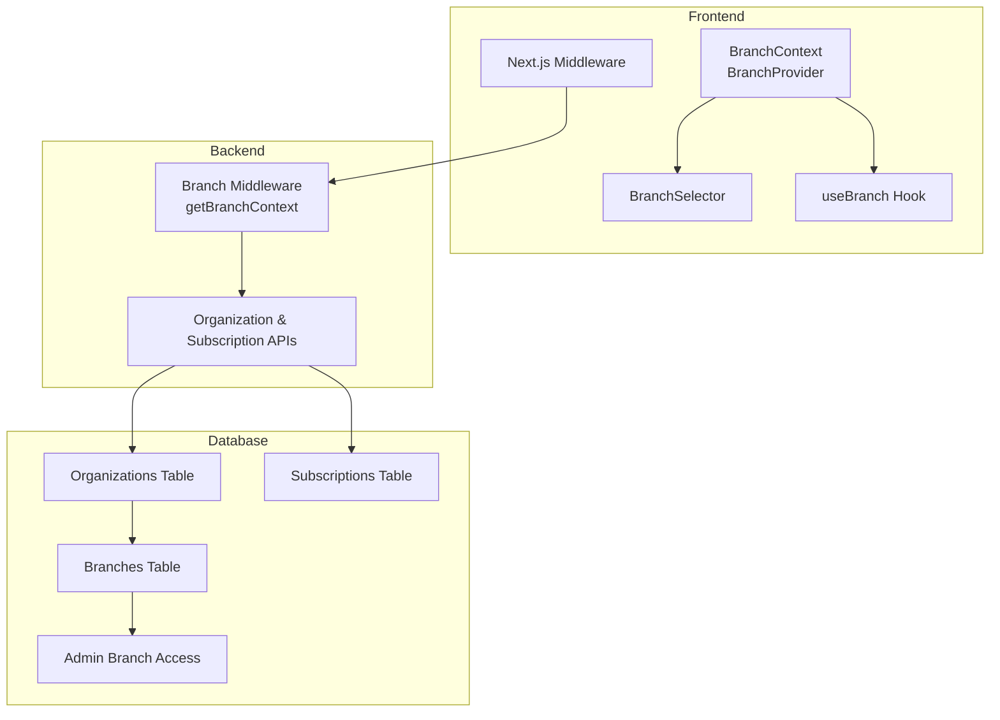
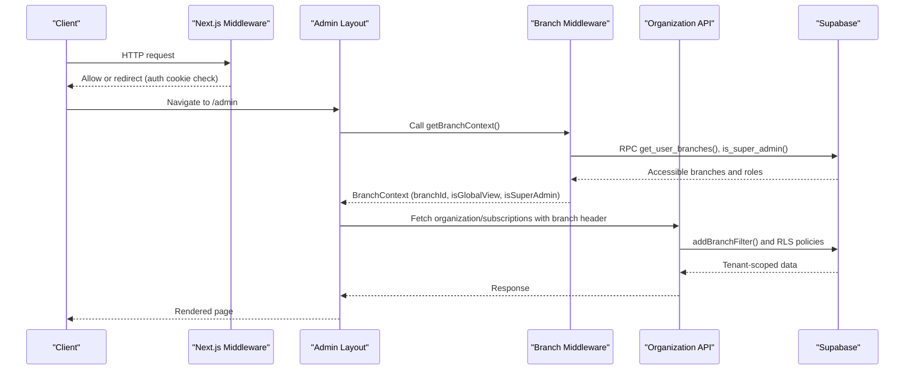
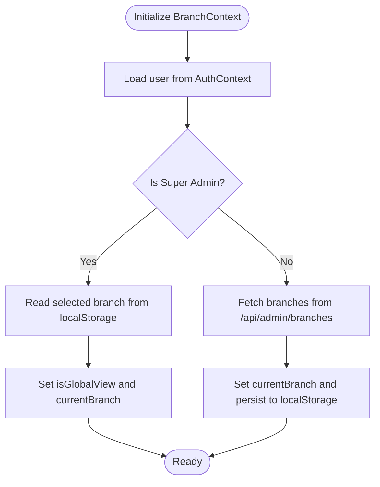
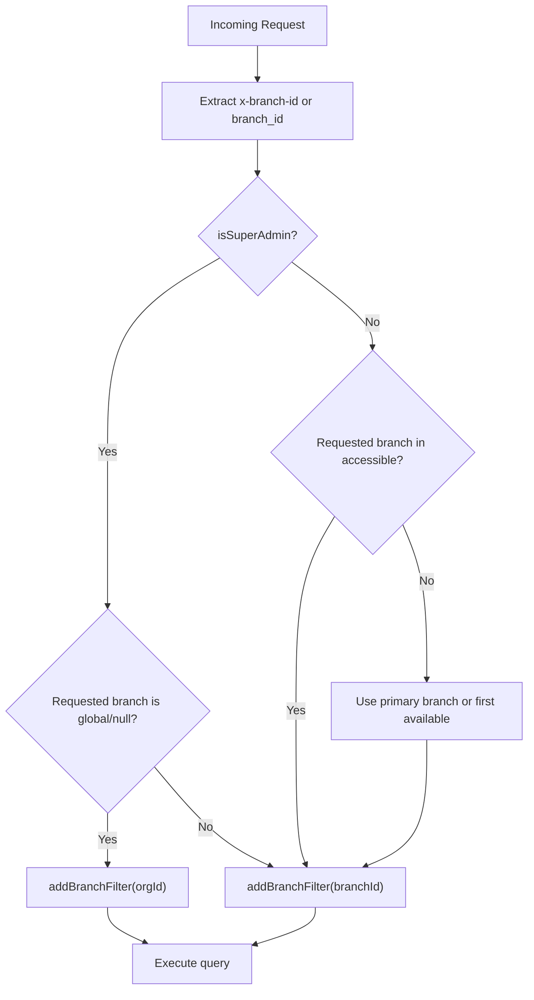
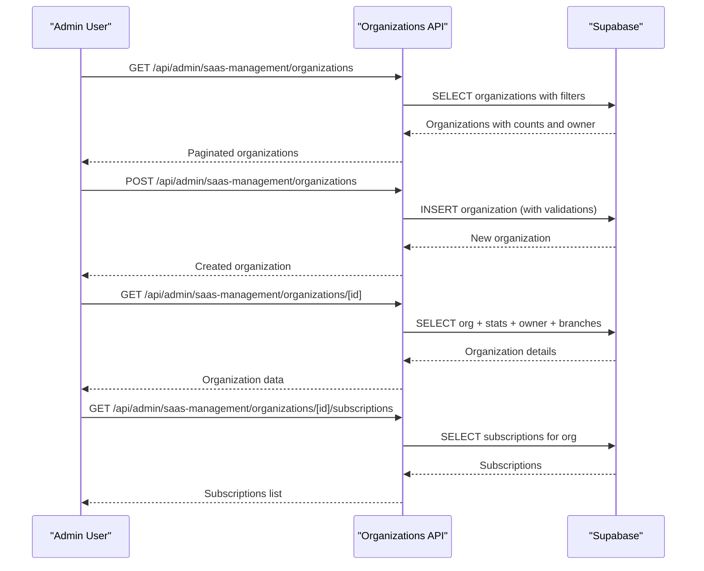
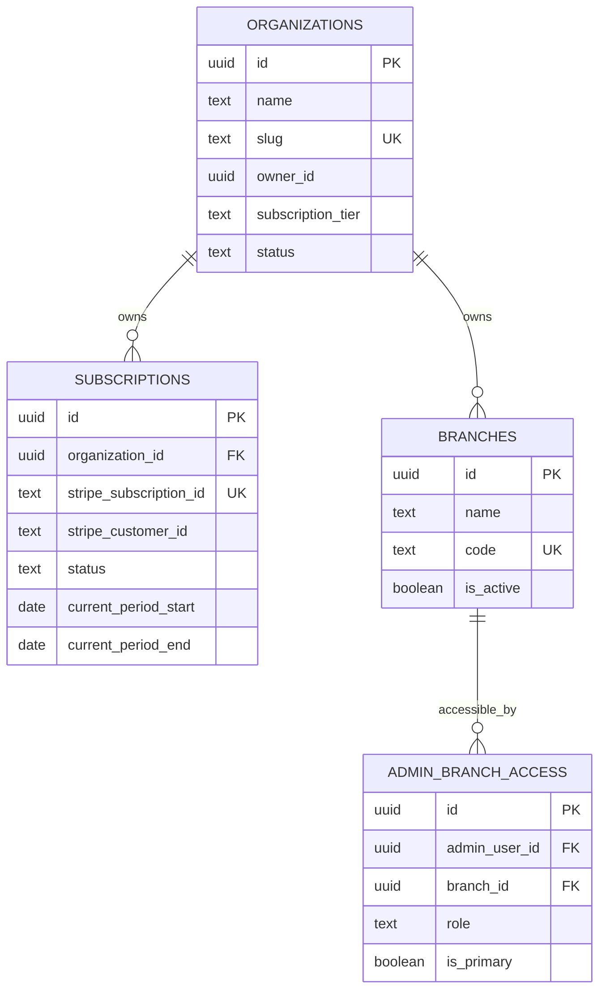
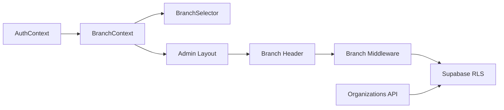

# Multi-Tenant System

<cite>
**Referenced Files in This Document**
- [BranchContext.tsx](file://src/contexts/BranchContext.tsx)
- [useBranch.ts](file://src/hooks/useBranch.ts)
- [BranchSelector.tsx](file://src/components/admin/BranchSelector.tsx)
- [middleware.ts](file://src/middleware.ts)
- [layout.tsx](file://src/app/admin/layout.tsx)
- [branch.ts](file://src/lib/utils/branch.ts)
- [branch-middleware.ts](file://src/lib/api/branch-middleware.ts)
- [organizations/route.ts](file://src/app/api/admin/saas-management/organizations/route.ts)
- [organizations/[id]/route.ts](file://src/app/api/admin/saas-management/organizations/[id]/route.ts)
- [organizations/[id]/subscriptions/route.ts](file://src/app/api/admin/saas-management/organizations/[id]/subscriptions/route.ts)
- [20260128000000_create_organizations_and_subscriptions.sql](file://supabase/migrations/20260128000000_create_organizations_and_subscriptions.sql)
- [20251216000000_create_branches_system.sql](file://supabase/migrations/20251216000000_create_branches_system.sql)
</cite>

## Table of Contents

1. [Introduction](#introduction)
2. [Project Structure](#project-structure)
3. [Core Components](#core-components)
4. [Architecture Overview](#architecture-overview)
5. [Detailed Component Analysis](#detailed-component-analysis)
6. [Dependency Analysis](#dependency-analysis)
7. [Performance Considerations](#performance-considerations)
8. [Troubleshooting Guide](#troubleshooting-guide)
9. [Conclusion](#conclusion)

## Introduction

This document explains the multi-tenant architecture in Opttius, focusing on organization and branch management for optical chains. It covers:

- Hierarchical structure: organizations → branches → users
- Tenant-aware data isolation via Row Level Security (RLS)
- Subscription model and SaaS management
- Branch-level operations and tenant scoping
- Context providers, middleware, and API filters
- Practical examples: organization switching, branch-specific configurations, and data segregation
- Scaling, performance, and maintenance considerations
- Troubleshooting tenant isolation and access issues

## Project Structure

The multi-tenant system spans frontend contexts, backend middleware, API routes, and Supabase database migrations:

- Frontend: Branch context and selector for tenant scoping
- Backend: Middleware and branch middleware for tenant-aware requests
- APIs: Organization and subscription management for SaaS
- Database: Migrations defining tenants, branches, and RLS policies

**Diagram sources**

- [BranchContext.tsx](file://src/contexts/BranchContext.tsx#L38-L207)
- [BranchSelector.tsx](file://src/components/admin/BranchSelector.tsx#L15-L106)
- [useBranch.ts](file://src/hooks/useBranch.ts#L40-L52)
- [middleware.ts](file://src/middleware.ts#L14-L94)
- [branch-middleware.ts](file://src/lib/api/branch-middleware.ts#L48-L210)
- [organizations/route.ts](file://src/app/api/admin/saas-management/organizations/route.ts#L12-L128)
- [20260128000000_create_organizations_and_subscriptions.sql](file://supabase/migrations/20260128000000_create_organizations_and_subscriptions.sql#L6-L52)
- [20251216000000_create_branches_system.sql](file://supabase/migrations/20251216000000_create_branches_system.sql#L5-L46)

**Section sources**

- [BranchContext.tsx](file://src/contexts/BranchContext.tsx#L1-L216)
- [BranchSelector.tsx](file://src/components/admin/BranchSelector.tsx#L1-L107)
- [useBranch.ts](file://src/hooks/useBranch.ts#L1-L53)
- [middleware.ts](file://src/middleware.ts#L1-L109)
- [branch-middleware.ts](file://src/lib/api/branch-middleware.ts#L1-L263)
- [organizations/route.ts](file://src/app/api/admin/saas-management/organizations/route.ts#L1-L293)
- [20260128000000_create_organizations_and_subscriptions.sql](file://supabase/migrations/20260128000000_create_organizations_and_subscriptions.sql#L1-L287)
- [20251216000000_create_branches_system.sql](file://supabase/migrations/20251216000000_create_branches_system.sql#L1-L397)

## Core Components

- BranchContext and BranchSelector: Manage tenant scoping (organization-level visibility vs branch-level filtering) and enable switching between branches or global view for super admins.
- Branch middleware: Extracts tenant context from headers/query params, validates access, and scopes Supabase queries.
- Organization and subscription APIs: Provide SaaS management for organizations, including listing, creating, updating, and deleting organizations, and managing subscriptions.
- Database migrations: Define tenants (organizations), branches, access controls, and RLS policies.

Key capabilities:

- Super admins can operate in a global view scoped to their organization.
- Regular admins are restricted to assigned branches.
- Branch filters propagate via HTTP headers or query parameters to API endpoints.
- Organization and subscription data are isolated via RLS policies.

**Section sources**

- [BranchContext.tsx](file://src/contexts/BranchContext.tsx#L38-L207)
- [BranchSelector.tsx](file://src/components/admin/BranchSelector.tsx#L15-L106)
- [useBranch.ts](file://src/hooks/useBranch.ts#L40-L52)
- [branch-middleware.ts](file://src/lib/api/branch-middleware.ts#L48-L210)
- [branch.ts](file://src/lib/utils/branch.ts#L40-L123)
- [organizations/route.ts](file://src/app/api/admin/saas-management/organizations/route.ts#L12-L128)
- [organizations/[id]/route.ts](file://src/app/api/admin/saas-management/organizations/[id]/route.ts#L11-L146)
- [organizations/[id]/subscriptions/route.ts](file://src/app/api/admin/saas-management/organizations/[id]/subscriptions/route.ts#L11-L61)
- [20260128000000_create_organizations_and_subscriptions.sql](file://supabase/migrations/20260128000000_create_organizations_and_subscriptions.sql#L6-L91)
- [20251216000000_create_branches_system.sql](file://supabase/migrations/20251216000000_create_branches_system.sql#L23-L34)

## Architecture Overview

The system enforces multi-tenancy at three levels:

- Organization level: Tenants own branches and users. RLS policies restrict access to organization-scoped data.
- Branch level: Users access data filtered by branch; super admins can view organization-wide data in global view.
- Request level: Middleware and branch middleware extract tenant context and enforce access.

**Diagram sources**

- [middleware.ts](file://src/middleware.ts#L14-L94)
- [layout.tsx](file://src/app/admin/layout.tsx#L252-L429)
- [branch-middleware.ts](file://src/lib/api/branch-middleware.ts#L48-L210)
- [organizations/route.ts](file://src/app/api/admin/saas-management/organizations/route.ts#L12-L128)
- [20260128000000_create_organizations_and_subscriptions.sql](file://supabase/migrations/20260128000000_create_organizations_and_subscriptions.sql#L93-L132)

## Detailed Component Analysis

### Branch Context and Selector

- BranchProvider initializes tenant context from local storage for super admins and from server for regular admins. It supports global view for super admins and branch-specific views otherwise.
- BranchSelector renders a dropdown to switch between branches or global view (when applicable).
- useBranch exposes convenient computed values and helpers for UI and queries.

**Diagram sources**

- [BranchContext.tsx](file://src/contexts/BranchContext.tsx#L73-L155)
- [BranchSelector.tsx](file://src/components/admin/BranchSelector.tsx#L15-L106)
- [useBranch.ts](file://src/hooks/useBranch.ts#L40-L52)

**Section sources**

- [BranchContext.tsx](file://src/contexts/BranchContext.tsx#L38-L207)
- [BranchSelector.tsx](file://src/components/admin/BranchSelector.tsx#L15-L106)
- [useBranch.ts](file://src/hooks/useBranch.ts#L40-L52)

### Branch Middleware and Tenant Scoping

- getBranchFromRequest extracts branch context from headers or query parameters.
- getBranchContext resolves organizationId, determines isSuperAdmin, accessible branches, and current branchId.
- addBranchFilter applies tenant scoping to Supabase queries:
  - Super admin global view: scope by organizationId
  - Specific branch: filter by branch_id
  - No branch: fallback to a non-matching UUID to return no rows

**Diagram sources**

- [branch-middleware.ts](file://src/lib/api/branch-middleware.ts#L23-L210)
- [branch-middleware.ts](file://src/lib/api/branch-middleware.ts#L242-L262)

**Section sources**

- [branch-middleware.ts](file://src/lib/api/branch-middleware.ts#L23-L210)
- [branch-middleware.ts](file://src/lib/api/branch-middleware.ts#L242-L262)

### Organization and Subscription Management

- Organization listing and creation APIs enforce root/dev access and validate inputs (slug uniqueness, tier, status).
- Organization detail API aggregates stats, owner info, and subscriptions.
- Subscription management APIs list and create subscriptions for an organization.

**Diagram sources**

- [organizations/route.ts](file://src/app/api/admin/saas-management/organizations/route.ts#L12-L128)
- [organizations/[id]/route.ts](file://src/app/api/admin/saas-management/organizations/[id]/route.ts#L11-L146)
- [organizations/[id]/subscriptions/route.ts](file://src/app/api/admin/saas-management/organizations/[id]/subscriptions/route.ts#L11-L61)

**Section sources**

- [organizations/route.ts](file://src/app/api/admin/saas-management/organizations/route.ts#L12-L128)
- [organizations/[id]/route.ts](file://src/app/api/admin/saas-management/organizations/[id]/route.ts#L11-L146)
- [organizations/[id]/subscriptions/route.ts](file://src/app/api/admin/saas-management/organizations/[id]/subscriptions/route.ts#L11-L61)

### Database Schema and RLS Policies

- Organizations and subscriptions define tenants and plans; indexes and triggers optimize updates.
- Branches and admin access tables define multi-branch hierarchy and access control.
- RLS policies ensure users see only their organization’s data and branches they can access.

**Diagram sources**

- [20260128000000_create_organizations_and_subscriptions.sql](file://supabase/migrations/20260128000000_create_organizations_and_subscriptions.sql#L6-L52)
- [20251216000000_create_branches_system.sql](file://supabase/migrations/20251216000000_create_branches_system.sql#L5-L46)

**Section sources**

- [20260128000000_create_organizations_and_subscriptions.sql](file://supabase/migrations/20260128000000_create_organizations_and_subscriptions.sql#L6-L91)
- [20251216000000_create_branches_system.sql](file://supabase/migrations/20251216000000_create_branches_system.sql#L23-L34)

## Dependency Analysis

- Frontend depends on AuthContext and BranchContext to determine organizationId and branchId.
- Admin layout uses branch header propagation to API endpoints.
- Branch middleware depends on Supabase RPCs to compute accessible branches and roles.
- Organization APIs depend on Supabase service role for administrative operations.

**Diagram sources**

- [BranchContext.tsx](file://src/contexts/BranchContext.tsx#L38-L207)
- [BranchSelector.tsx](file://src/components/admin/BranchSelector.tsx#L15-L106)
- [layout.tsx](file://src/app/admin/layout.tsx#L431-L499)
- [branch.ts](file://src/lib/utils/branch.ts#L92-L122)
- [branch-middleware.ts](file://src/lib/api/branch-middleware.ts#L48-L210)
- [organizations/route.ts](file://src/app/api/admin/saas-management/organizations/route.ts#L12-L128)

**Section sources**

- [BranchContext.tsx](file://src/contexts/BranchContext.tsx#L38-L207)
- [BranchSelector.tsx](file://src/components/admin/BranchSelector.tsx#L15-L106)
- [layout.tsx](file://src/app/admin/layout.tsx#L431-L499)
- [branch.ts](file://src/lib/utils/branch.ts#L92-L122)
- [branch-middleware.ts](file://src/lib/api/branch-middleware.ts#L48-L210)
- [organizations/route.ts](file://src/app/api/admin/saas-management/organizations/route.ts#L12-L128)

## Performance Considerations

- Indexes on organization_id, branch_id, and slug improve query performance for tenant scoping and lookups.
- Minimize repeated branch context computations by caching results in memory and using localStorage for super admins.
- Batch statistics queries in admin layout to reduce network overhead.
- Use branch headers consistently to avoid redundant query parameter parsing.

[No sources needed since this section provides general guidance]

## Troubleshooting Guide

Common issues and resolutions:

- Unauthorized access to organization data
  - Verify RLS policies for organizations and subscriptions are enabled and correctly scoped.
  - Ensure the user belongs to the organization and has active admin status.
  - Confirm the organizationId is present in branch context for global view.
  - Reference: [20260128000000_create_organizations_and_subscriptions.sql](file://supabase/migrations/20260128000000_create_organizations_and_subscriptions.sql#L88-L132)

- Branch access denied
  - Check get_user_branches RPC and can_access_branch function results.
  - Ensure the requested branch_id matches accessible branches for the user.
  - For super admins, confirm global view is used appropriately.
  - Reference: [20251216000000_create_branches_system.sql](file://supabase/migrations/20251216000000_create_branches_system.sql#L116-L188)

- Tenant isolation leaks
  - Validate addBranchFilter is applied to all tenant-sensitive queries.
  - Ensure branch headers are included in API requests.
  - Confirm organizationId is set for global view to scope to the user’s organization.
  - Reference: [branch-middleware.ts](file://src/lib/api/branch-middleware.ts#L242-L262), [branch.ts](file://src/lib/utils/branch.ts#L92-L122)

- Organization switching not persisting
  - Confirm localStorage key usage and initialization logic for super admins.
  - Verify setCurrentBranch updates localStorage and context state.
  - Reference: [BranchContext.tsx](file://src/contexts/BranchContext.tsx#L47-L71), [BranchContext.tsx](file://src/contexts/BranchContext.tsx#L157-L176)

- Middleware redirection loops
  - Review middleware matcher and excluded paths to avoid unnecessary redirects.
  - Ensure admin checks are not triggered repeatedly for the same user ID.
  - Reference: [middleware.ts](file://src/middleware.ts#L97-L109), [layout.tsx](file://src/app/admin/layout.tsx#L501-L652)

**Section sources**

- [20260128000000_create_organizations_and_subscriptions.sql](file://supabase/migrations/20260128000000_create_organizations_and_subscriptions.sql#L88-L132)
- [20251216000000_create_branches_system.sql](file://supabase/migrations/20251216000000_create_branches_system.sql#L116-L188)
- [branch-middleware.ts](file://src/lib/api/branch-middleware.ts#L242-L262)
- [branch.ts](file://src/lib/utils/branch.ts#L92-L122)
- [BranchContext.tsx](file://src/contexts/BranchContext.tsx#L47-L71)
- [BranchContext.tsx](file://src/contexts/BranchContext.tsx#L157-L176)
- [middleware.ts](file://src/middleware.ts#L97-L109)
- [layout.tsx](file://src/app/admin/layout.tsx#L501-L652)

## Conclusion

Opttius implements a robust multi-tenant architecture centered on organizations and branches:

- Organizations own branches and users, with strict RLS policies.
- Branch-level tenant scoping is enforced via headers and middleware.
- Super admins can operate globally within their organization.
- SaaS management APIs support organization lifecycle and subscription handling.
- Practical patterns for organization switching, branch-specific configurations, and data segregation are integrated across frontend and backend components.

[No sources needed since this section summarizes without analyzing specific files]
