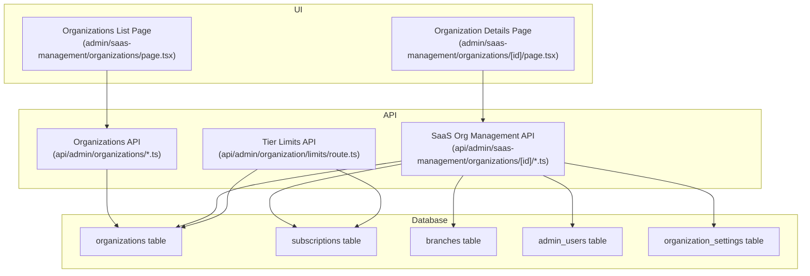
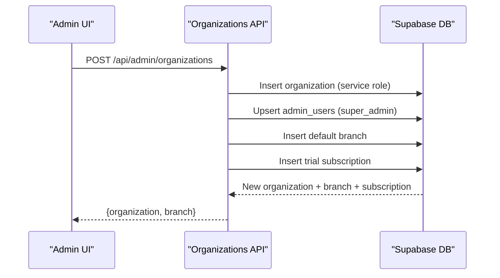
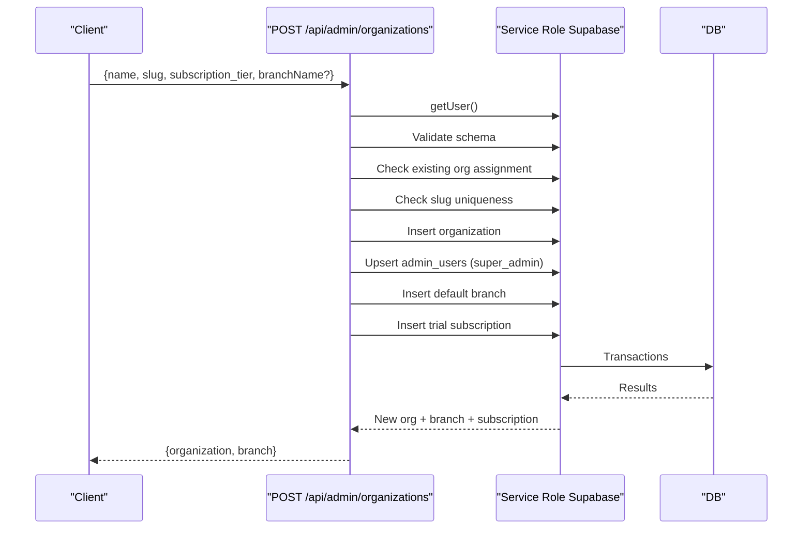
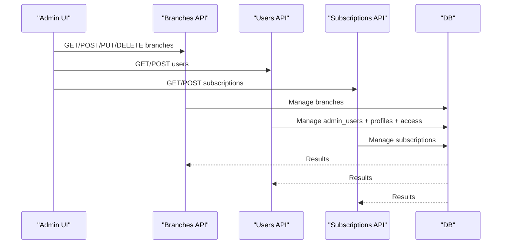
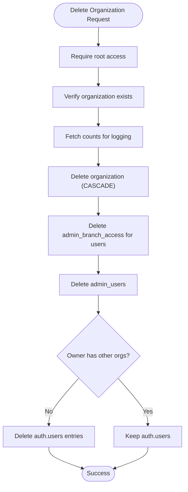
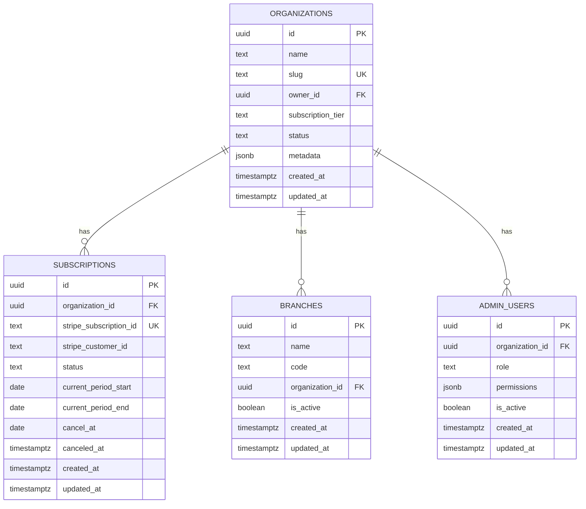
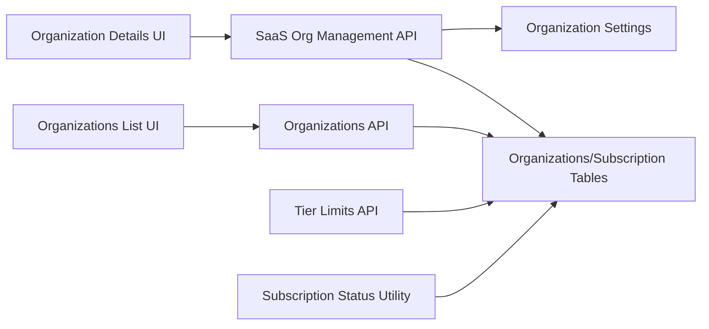

# Organization Management

<cite>
**Referenced Files in This Document**
- [src/app/admin/saas-management/organizations/page.tsx](file://src/app/admin/saas-management/organizations/page.tsx)
- [src/app/admin/saas-management/organizations/[id]/page.tsx](file://src/app/admin/saas-management/organizations/[id]/page.tsx)
- [src/app/api/admin/organizations/route.ts](file://src/app/api/admin/organizations/route.ts)
- [src/app/api/admin/organizations/current/route.ts](file://src/app/api/admin/organizations/current/route.ts)
- [src/app/api/admin/saas-management/organizations/[id]/route.ts](file://src/app/api/admin/saas-management/organizations/[id]/route.ts)
- [src/app/api/admin/saas-management/organizations/[id]/branches/route.ts](file://src/app/api/admin/saas-management/organizations/[id]/branches/route.ts)
- [src/app/api/admin/saas-management/organizations/[id]/users/route.ts](file://src/app/api/admin/saas-management/organizations/[id]/users/route.ts)
- [src/app/api/admin/saas-management/organizations/[id]/subscriptions/route.ts](file://src/app/api/admin/saas-management/organizations/[id]/subscriptions/route.ts)
- [src/app/api/admin/organization/limits/route.ts](file://src/app/api/admin/organization/limits/route.ts)
- [src/lib/api/validation/organization-schemas.ts](file://src/lib/api/validation/organization-schemas.ts)
- [supabase/migrations/20260128000000_create_organizations_and_subscriptions.sql](file://supabase/migrations/20260128000000_create_organizations_and_subscriptions.sql)
- [supabase/migrations/20260122000005_create_organization_settings.sql](file://supabase/migrations/20260122000005_create_organization_settings.sql)
- [src/lib/saas/subscription-status.ts](file://src/lib/saas/subscription-status.ts)
</cite>

## Table of Contents

1. [Introduction](#introduction)
2. [Project Structure](#project-structure)
3. [Core Components](#core-components)
4. [Architecture Overview](#architecture-overview)
5. [Detailed Component Analysis](#detailed-component-analysis)
6. [Dependency Analysis](#dependency-analysis)
7. [Performance Considerations](#performance-considerations)
8. [Troubleshooting Guide](#troubleshooting-guide)
9. [Conclusion](#conclusion)

## Introduction

This document explains the organization management system in Opttius, focusing on how organizations act as the top-level tenant container in the multi-tenant architecture. It covers organization creation, configuration, administration, settings and branding, and the relationships among organizations, branches, users, and subscriptions. Practical examples illustrate setup, configuration options, administrative workflows, data isolation, switching behavior, permissions, and delegation patterns.

## Project Structure

The organization management system spans UI pages, API routes, database migrations, and shared validation logic:

- UI pages under the admin SaaS management area provide listing, details, and CRUD operations for organizations, branches, users, and subscriptions.
- API routes implement server-side logic with strict authorization checks and data validation.
- Database migrations define the multi-tenant schema, policies, and initial configurations.
- Validation schemas ensure consistent and secure data entry.

**Diagram sources**

- [src/app/admin/saas-management/organizations/page.tsx](file://src/app/admin/saas-management/organizations/page.tsx#L91-L761)
- [src/app/admin/saas-management/organizations/[id]/page.tsx](file://src/app/admin/saas-management/organizations/[id]/page.tsx#L107-L800)
- [src/app/api/admin/organizations/route.ts](file://src/app/api/admin/organizations/route.ts#L20-L103)
- [src/app/api/admin/saas-management/organizations/[id]/route.ts](file://src/app/api/admin/saas-management/organizations/[id]/route.ts#L11-L147)
- [src/app/api/admin/saas-management/organizations/[id]/branches/route.ts](file://src/app/api/admin/saas-management/organizations/[id]/branches/route.ts#L11-L61)
- [src/app/api/admin/saas-management/organizations/[id]/users/route.ts](file://src/app/api/admin/saas-management/organizations/[id]/users/route.ts#L11-L77)
- [src/app/api/admin/saas-management/organizations/[id]/subscriptions/route.ts](file://src/app/api/admin/saas-management/organizations/[id]/subscriptions/route.ts#L11-L61)
- [src/app/api/admin/organization/limits/route.ts](file://src/app/api/admin/organization/limits/route.ts#L13-L111)
- [supabase/migrations/20260128000000_create_organizations_and_subscriptions.sql](file://supabase/migrations/20260128000000_create_organizations_and_subscriptions.sql#L5-L91)
- [supabase/migrations/20260122000005_create_organization_settings.sql](file://supabase/migrations/20260122000005_create_organization_settings.sql#L4-L21)

**Section sources**

- [src/app/admin/saas-management/organizations/page.tsx](file://src/app/admin/saas-management/organizations/page.tsx#L91-L761)
- [src/app/admin/saas-management/organizations/[id]/page.tsx](file://src/app/admin/saas-management/organizations/[id]/page.tsx#L107-L800)
- [src/app/api/admin/organizations/route.ts](file://src/app/api/admin/organizations/route.ts#L20-L103)
- [src/app/api/admin/saas-management/organizations/[id]/route.ts](file://src/app/api/admin/saas-management/organizations/[id]/route.ts#L11-L147)
- [supabase/migrations/20260128000000_create_organizations_and_subscriptions.sql](file://supabase/migrations/20260128000000_create_organizations_and_subscriptions.sql#L5-L91)

## Core Components

- Organizations list and details UI: Provides filtering, pagination, bulk actions, and CRUD for organizations, branches, users, and subscriptions.
- Organization APIs:
  - Listing and creation for administrators.
  - Current organization retrieval and updates for authenticated admins.
  - Full management APIs for SaaS root-level access.
- Validation schemas: Enforce slug, name, tier, and branch constraints.
- Database schema: Multi-tenant tables with RLS policies and indexes.
- Tier limits and subscription status utilities: Enforce plan limits and determine subscription health.

Key responsibilities:

- Organization creation with automatic first branch and subscription initialization.
- Centralized organization settings (e.g., minimum deposit configuration).
- Hierarchical relationships: organization → branches/users/subscriptions.
- Administrative controls: activation/suspension/cancellation, tier changes, and hard deletion with cascading cleanup.

**Section sources**

- [src/app/admin/saas-management/organizations/page.tsx](file://src/app/admin/saas-management/organizations/page.tsx#L91-L761)
- [src/app/admin/saas-management/organizations/[id]/page.tsx](file://src/app/admin/saas-management/organizations/[id]/page.tsx#L107-L800)
- [src/app/api/admin/organizations/route.ts](file://src/app/api/admin/organizations/route.ts#L121-L440)
- [src/app/api/admin/organizations/current/route.ts](file://src/app/api/admin/organizations/current/route.ts#L10-L153)
- [src/lib/api/validation/organization-schemas.ts](file://src/lib/api/validation/organization-schemas.ts#L51-L70)
- [supabase/migrations/20260128000000_create_organizations_and_subscriptions.sql](file://supabase/migrations/20260128000000_create_organizations_and_subscriptions.sql#L5-L91)
- [src/app/api/admin/organization/limits/route.ts](file://src/app/api/admin/organization/limits/route.ts#L13-L111)

## Architecture Overview

The system implements a multi-tenant architecture centered on organizations. Each organization is a tenant with its own branches, users, products, orders, and subscriptions. RLS policies restrict access to the tenant’s data, while SaaS root APIs enable administrative operations across tenants.

**Diagram sources**

- [src/app/api/admin/organizations/route.ts](file://src/app/api/admin/organizations/route.ts#L121-L440)
- [supabase/migrations/20260128000000_create_organizations_and_subscriptions.sql](file://supabase/migrations/20260128000000_create_organizations_and_subscriptions.sql#L5-L91)

**Section sources**

- [src/app/api/admin/organizations/route.ts](file://src/app/api/admin/organizations/route.ts#L121-L440)
- [supabase/migrations/20260128000000_create_organizations_and_subscriptions.sql](file://supabase/migrations/20260128000000_create_organizations_and_subscriptions.sql#L5-L91)

## Detailed Component Analysis

### Organizations List and Details UI

- Organizations list supports search by name/slug, tier filter, status filter, pagination, and bulk actions (activate/suspend/change tier).
- Organization details page aggregates stats, owners, recent users, branches, and subscriptions, and exposes CRUD for each entity.

Practical examples:

- Creating an organization via the “New Organization” dialog triggers POST to the organizations API.
- Bulk actions operate on multiple organizations and call the bulk actions endpoint.
- Editing organization details updates name, slug, tier, and status.

**Section sources**

- [src/app/admin/saas-management/organizations/page.tsx](file://src/app/admin/saas-management/organizations/page.tsx#L91-L761)
- [src/app/admin/saas-management/organizations/[id]/page.tsx](file://src/app/admin/saas-management/organizations/[id]/page.tsx#L107-L800)

### Organization Creation and Onboarding

- Endpoint: POST /api/admin/organizations
- Validates input using Zod schemas, ensures the user has no existing organization, checks slug uniqueness, creates the organization, assigns the creator as super_admin, initializes a default branch, and sets up a trial subscription.

**Diagram sources**

- [src/app/api/admin/organizations/route.ts](file://src/app/api/admin/organizations/route.ts#L121-L440)
- [src/lib/api/validation/organization-schemas.ts](file://src/lib/api/validation/organization-schemas.ts#L51-L70)

**Section sources**

- [src/app/api/admin/organizations/route.ts](file://src/app/api/admin/organizations/route.ts#L121-L440)
- [src/lib/api/validation/organization-schemas.ts](file://src/lib/api/validation/organization-schemas.ts#L51-L70)

### Organization Settings and Branding

- Organization-level branding fields include name, slug, logo_url, and slogan.
- Current organization endpoints allow authenticated admins to update branding fields.
- Additional organization settings include configurable minimum deposit percentages and amounts for Cash-First logic.

Practical examples:

- Update branding: PATCH /api/admin/organizations/current with name/logo_url/slogan.
- Configure deposit minimums: use organization_settings table and get_min_deposit function.

**Section sources**

- [src/app/api/admin/organizations/current/route.ts](file://src/app/api/admin/organizations/current/route.ts#L68-L153)
- [supabase/migrations/20260122000005_create_organization_settings.sql](file://supabase/migrations/20260122000005_create_organization_settings.sql#L4-L57)

### Branches, Users, and Subscriptions Management

- Branches: List/create/update/delete per organization; codes auto-generated if not provided.
- Users: List/create users with roles and branch access; supports super_admin global access and staff/manager roles per branch.
- Subscriptions: List/create subscriptions with gateway metadata and statuses.

**Diagram sources**

- [src/app/api/admin/saas-management/organizations/[id]/branches/route.ts](file://src/app/api/admin/saas-management/organizations/[id]/branches/route.ts#L11-L61)
- [src/app/api/admin/saas-management/organizations/[id]/users/route.ts](file://src/app/api/admin/saas-management/organizations/[id]/users/route.ts#L11-L77)
- [src/app/api/admin/saas-management/organizations/[id]/subscriptions/route.ts](file://src/app/api/admin/saas-management/organizations/[id]/subscriptions/route.ts#L11-L61)

**Section sources**

- [src/app/api/admin/saas-management/organizations/[id]/branches/route.ts](file://src/app/api/admin/saas-management/organizations/[id]/branches/route.ts#L67-L176)
- [src/app/api/admin/saas-management/organizations/[id]/users/route.ts](file://src/app/api/admin/saas-management/organizations/[id]/users/route.ts#L83-L254)
- [src/app/api/admin/saas-management/organizations/[id]/subscriptions/route.ts](file://src/app/api/admin/saas-management/organizations/[id]/subscriptions/route.ts#L67-L161)

### Administrative Controls and Deletion

- Organization details page supports activation/suspension/cancellation and tier changes.
- Hard deletion cascades to branches, users, orders, quotes, appointments, products, customers, payments, and related entities; also deletes auth users and cleans access records.

**Diagram sources**

- [src/app/api/admin/saas-management/organizations/[id]/route.ts](file://src/app/api/admin/saas-management/organizations/[id]/route.ts#L270-L504)

**Section sources**

- [src/app/admin/saas-management/organizations/[id]/page.tsx](file://src/app/admin/saas-management/organizations/[id]/page.tsx#L233-L287)
- [src/app/api/admin/saas-management/organizations/[id]/route.ts](file://src/app/api/admin/saas-management/organizations/[id]/route.ts#L270-L504)

### Data Isolation and Multi-Tenant Policies

- Organizations, subscriptions, and subscription tiers have RLS enabled.
- Policies restrict access to the current user’s organization or super admins.
- Indexes on organization_id improve query performance for tenant-scoped queries.

**Diagram sources**

- [supabase/migrations/20260128000000_create_organizations_and_subscriptions.sql](file://supabase/migrations/20260128000000_create_organizations_and_subscriptions.sql#L5-L91)

**Section sources**

- [supabase/migrations/20260128000000_create_organizations_and_subscriptions.sql](file://supabase/migrations/20260128000000_create_organizations_and_subscriptions.sql#L88-L208)

### Organization Switching, Permission Models, and Delegation

- Organization switching: The current organization endpoint retrieves the authenticated user’s organization_id and returns organization details. This enables switching by changing the user’s organization association.
- Permission model:
  - Super admins can manage all organizations and related resources.
  - Branch access is controlled via admin_branch_access with roles (manager/staff/global).
  - Users can view only their organization’s data due to RLS policies.
- Delegation patterns:
  - Super admin can grant global access (branch_id null) or branch-specific access with manager/staff roles.
  - Role-based permissions are stored in admin_users.permissions for granular control.

**Section sources**

- [src/app/api/admin/organizations/current/route.ts](file://src/app/api/admin/organizations/current/route.ts#L10-L61)
- [src/app/api/admin/saas-management/organizations/[id]/users/route.ts](file://src/app/api/admin/saas-management/organizations/[id]/users/route.ts#L139-L225)
- [supabase/migrations/20260128000000_create_organizations_and_subscriptions.sql](file://supabase/migrations/20260128000000_create_organizations_and_subscriptions.sql#L93-L132)

### Tier Limits and Subscription Health

- Tier limits API returns current usage vs. plan limits (branches, users, customers, products).
- Subscription status utility determines active/trial/expired/past_due/cancelled/incomplete states, with special handling for demo/root organizations.

Practical examples:

- Enforce limits before creating branches/users/customers/products.
- Show subscription status in UI to guide renewals and feature access.

**Section sources**

- [src/app/api/admin/organization/limits/route.ts](file://src/app/api/admin/organization/limits/route.ts#L13-L111)
- [src/lib/saas/subscription-status.ts](file://src/lib/saas/subscription-status.ts#L33-L142)

## Dependency Analysis

- UI depends on API routes for data operations.
- API routes depend on Supabase service role clients and RLS-enabled tables.
- Validation schemas enforce input correctness across creation and updates.
- Tier limits and subscription utilities depend on organization and subscription tables.

**Diagram sources**

- [src/app/admin/saas-management/organizations/page.tsx](file://src/app/admin/saas-management/organizations/page.tsx#L91-L761)
- [src/app/admin/saas-management/organizations/[id]/page.tsx](file://src/app/admin/saas-management/organizations/[id]/page.tsx#L107-L800)
- [src/app/api/admin/organizations/route.ts](file://src/app/api/admin/organizations/route.ts#L20-L103)
- [src/app/api/admin/saas-management/organizations/[id]/route.ts](file://src/app/api/admin/saas-management/organizations/[id]/route.ts#L11-L147)
- [src/app/api/admin/organization/limits/route.ts](file://src/app/api/admin/organization/limits/route.ts#L13-L111)
- [src/lib/saas/subscription-status.ts](file://src/lib/saas/subscription-status.ts#L33-L142)

**Section sources**

- [src/app/admin/saas-management/organizations/page.tsx](file://src/app/admin/saas-management/organizations/page.tsx#L91-L761)
- [src/app/admin/saas-management/organizations/[id]/page.tsx](file://src/app/admin/saas-management/organizations/[id]/page.tsx#L107-L800)
- [src/app/api/admin/organizations/route.ts](file://src/app/api/admin/organizations/route.ts#L20-L103)
- [src/app/api/admin/saas-management/organizations/[id]/route.ts](file://src/app/api/admin/saas-management/organizations/[id]/route.ts#L11-L147)
- [src/app/api/admin/organization/limits/route.ts](file://src/app/api/admin/organization/limits/route.ts#L13-L111)
- [src/lib/saas/subscription-status.ts](file://src/lib/saas/subscription-status.ts#L33-L142)

## Performance Considerations

- Use indexes on organization_id for fast tenant-scoped queries.
- Batch operations (bulk actions) reduce round trips.
- RLS adds overhead; keep queries scoped to minimize policy evaluation cost.
- Prefer server-side pagination and filtering to avoid large payloads.

## Troubleshooting Guide

Common issues and resolutions:

- Unauthorized access: Ensure the user is authenticated and has appropriate role (super_admin) for SaaS management endpoints.
- Slug conflicts: Slug must be unique and match validation rules; adjust slug and retry.
- Deletion failures: Verify organization exists and root access is granted; review cascade logs for dependent entities.
- Subscription status anomalies: Check subscription records and trial/end dates; use subscription status utility to diagnose.

**Section sources**

- [src/app/api/admin/saas-management/organizations/[id]/route.ts](file://src/app/api/admin/saas-management/organizations/[id]/route.ts#L138-L146)
- [src/lib/api/validation/organization-schemas.ts](file://src/lib/api/validation/organization-schemas.ts#L7-L20)
- [src/lib/saas/subscription-status.ts](file://src/lib/saas/subscription-status.ts#L33-L142)

## Conclusion

Opttius implements a robust multi-tenant organization management system with clear separation of concerns across UI, APIs, and database. Organizations serve as the tenant boundary, with strong data isolation via RLS, comprehensive administrative controls, and scalable relationships to branches, users, and subscriptions. The system supports practical workflows for onboarding, configuration, limits enforcement, and subscription management, enabling efficient administration and reliable data protection.
