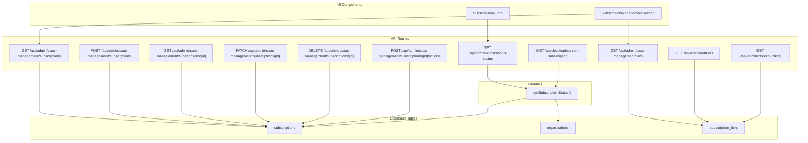
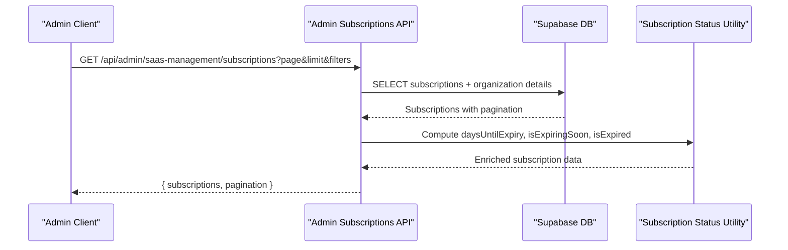
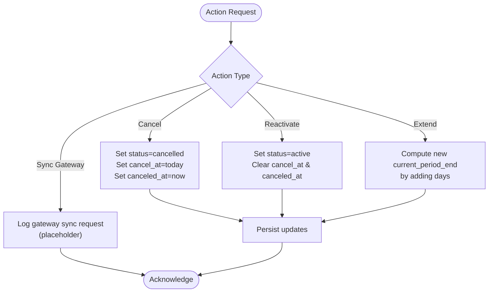
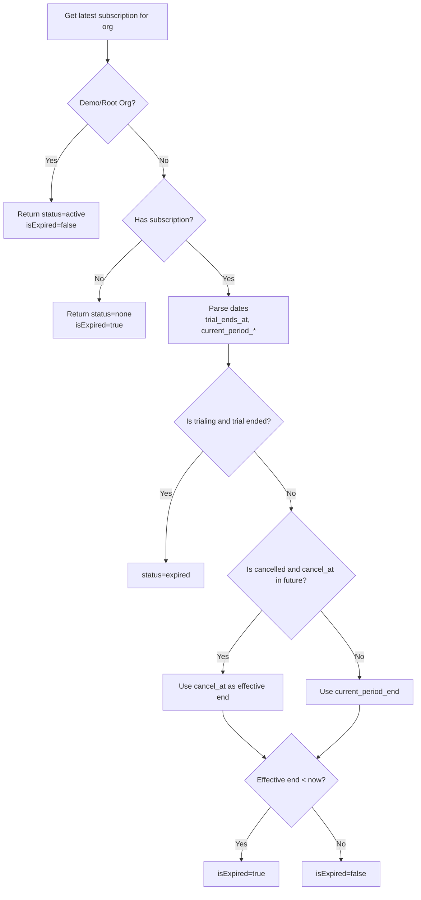
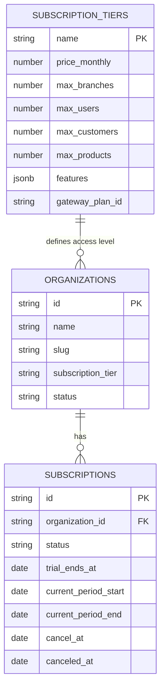
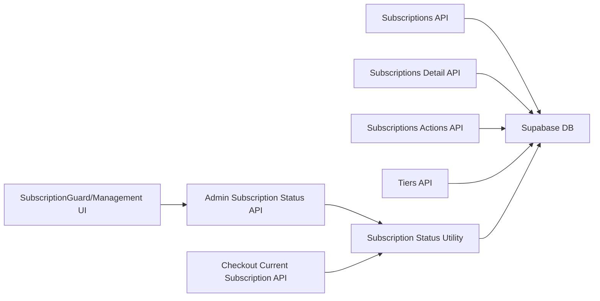

# Subscription Handling

<cite>
**Referenced Files in This Document**
- [src/app/api/admin/saas-management/subscriptions/route.ts](file://src/app/api/admin/saas-management/subscriptions/route.ts)
- [src/app/api/admin/saas-management/subscriptions/[id]/route.ts](file://src/app/api/admin/saas-management/subscriptions/[id]/route.ts)
- [src/app/api/admin/saas-management/subscriptions/[id]/actions/route.ts](file://src/app/api/admin/saas-management/subscriptions/[id]/actions/route.ts)
- [src/app/api/admin/subscription-status/route.ts](file://src/app/api/admin/subscription-status/route.ts)
- [src/app/api/checkout/current-subscription/route.ts](file://src/app/api/checkout/current-subscription/route.ts)
- [src/lib/saas/subscription-status.ts](file://src/lib/saas/subscription-status.ts)
- [src/app/api/admin/saas-management/tiers/route.ts](file://src/app/api/admin/saas-management/tiers/route.ts)
- [src/app/api/checkout/tiers/route.ts](file://src/app/api/checkout/tiers/route.ts)
- [src/app/api/admin/checkout/tiers/route.ts](file://src/app/api/admin/checkout/tiers/route.ts)
- [supabase/migrations/20260128000000_create_organizations_and_subscriptions.sql](file://supabase/migrations/20260128000000_create_organizations_and_subscriptions.sql)
- [supabase/migrations/20260131000000_create_payments_and_webhook_events.sql](file://supabase/migrations/20260131000000_create_payments_and_webhook_events.sql)
- [supabase/migrations/20260205000001_subscriptions_gateway_agnostic.sql](file://supabase/migrations/20260205000001_subscriptions_gateway_agnostic.sql)
- [supabase/migrations/20260205000002_add_trial_columns.sql](file://supabase/migrations/20260205000002_add_trial_columns.sql)
- [supabase/migrations/20260207000001_add_gateway_plan_id_to_subscription_tiers.sql](file://supabase/migrations/20260207000001_add_gateway_plan_id_to_subscription_tiers.sql)
- [src/components/admin/SubscriptionGuard.tsx](file://src/components/admin/SubscriptionGuard.tsx)
- [src/components/admin/SubscriptionManagementSection.tsx](file://src/components/admin/SubscriptionManagementSection.tsx)
</cite>

## Table of Contents

1. [Introduction](#introduction)
2. [Project Structure](#project-structure)
3. [Core Components](#core-components)
4. [Architecture Overview](#architecture-overview)
5. [Detailed Component Analysis](#detailed-component-analysis)
6. [Dependency Analysis](#dependency-analysis)
7. [Performance Considerations](#performance-considerations)
8. [Troubleshooting Guide](#troubleshooting-guide)
9. [Conclusion](#conclusion)

## Introduction

This document explains the subscription management system within the multi-tenant architecture. It covers the tier-based subscription model, lifecycle management, status tracking, renewal and trial mechanics, upgrade/downgrade workflows, and integration points with payment processing. It also documents how subscriptions relate to organizational access levels and how subscription-based feature gating works, along with practical examples and troubleshooting guidance.

## Project Structure

The subscription system spans API routes, a status utility library, tier management endpoints, and UI guard components. Data is persisted in Supabase tables for subscriptions, organizations, and subscription tiers.

**Diagram sources**

- [src/app/api/admin/saas-management/subscriptions/route.ts](file://src/app/api/admin/saas-management/subscriptions/route.ts#L1-L229)
- [src/app/api/admin/saas-management/subscriptions/[id]/route.ts](file://src/app/api/admin/saas-management/subscriptions/[id]/route.ts#L1-L256)
- [src/app/api/admin/saas-management/subscriptions/[id]/actions/route.ts](file://src/app/api/admin/saas-management/subscriptions/[id]/actions/route.ts#L1-L126)
- [src/app/api/admin/subscription-status/route.ts](file://src/app/api/admin/subscription-status/route.ts#L1-L45)
- [src/app/api/checkout/current-subscription/route.ts](file://src/app/api/checkout/current-subscription/route.ts#L1-L56)
- [src/lib/saas/subscription-status.ts](file://src/lib/saas/subscription-status.ts#L1-L142)
- [src/app/api/admin/saas-management/tiers/route.ts](file://src/app/api/admin/saas-management/tiers/route.ts#L1-L172)
- [src/app/api/checkout/tiers/route.ts](file://src/app/api/checkout/tiers/route.ts#L1-L33)
- [src/app/api/admin/checkout/tiers/route.ts](file://src/app/api/admin/checkout/tiers/route.ts#L1-L33)
- [src/components/admin/SubscriptionGuard.tsx](file://src/components/admin/SubscriptionGuard.tsx)
- [src/components/admin/SubscriptionManagementSection.tsx](file://src/components/admin/SubscriptionManagementSection.tsx)

**Section sources**

- [src/app/api/admin/saas-management/subscriptions/route.ts](file://src/app/api/admin/saas-management/subscriptions/route.ts#L1-L229)
- [src/app/api/admin/saas-management/subscriptions/[id]/route.ts](file://src/app/api/admin/saas-management/subscriptions/[id]/route.ts#L1-L256)
- [src/app/api/admin/saas-management/subscriptions/[id]/actions/route.ts](file://src/app/api/admin/saas-management/subscriptions/[id]/actions/route.ts#L1-L126)
- [src/app/api/admin/subscription-status/route.ts](file://src/app/api/admin/subscription-status/route.ts#L1-L45)
- [src/app/api/checkout/current-subscription/route.ts](file://src/app/api/checkout/current-subscription/route.ts#L1-L56)
- [src/lib/saas/subscription-status.ts](file://src/lib/saas/subscription-status.ts#L1-L142)
- [src/app/api/admin/saas-management/tiers/route.ts](file://src/app/api/admin/saas-management/tiers/route.ts#L1-L172)
- [src/app/api/checkout/tiers/route.ts](file://src/app/api/checkout/tiers/route.ts#L1-L33)
- [src/app/api/admin/checkout/tiers/route.ts](file://src/app/api/admin/checkout/tiers/route.ts#L1-L33)
- [src/components/admin/SubscriptionGuard.tsx](file://src/components/admin/SubscriptionGuard.tsx)
- [src/components/admin/SubscriptionManagementSection.tsx](file://src/components/admin/SubscriptionManagementSection.tsx)

## Core Components

- Subscription API endpoints: list, create, read, update, delete, and actions (cancel/reactivate/extend/sync).
- Tier management API: list tiers with statistics and update tier metadata.
- Subscription status utility: compute effective status, expiration, and trial state.
- Access control: root/admin-only endpoints for administrative operations.
- UI guards and management sections: enforce subscription gating and expose admin controls.

Key capabilities:

- Tier-based access with feature limits per tier (users, branches, customers, products).
- Trial management with configurable trial periods.
- Renewal and cancellation windows with extended access until cancel_at.
- Revenue estimation via tier counts and pricing.

**Section sources**

- [src/app/api/admin/saas-management/subscriptions/route.ts](file://src/app/api/admin/saas-management/subscriptions/route.ts#L1-L229)
- [src/app/api/admin/saas-management/subscriptions/[id]/route.ts](file://src/app/api/admin/saas-management/subscriptions/[id]/route.ts#L1-L256)
- [src/app/api/admin/saas-management/subscriptions/[id]/actions/route.ts](file://src/app/api/admin/saas-management/subscriptions/[id]/actions/route.ts#L1-L126)
- [src/app/api/admin/saas-management/tiers/route.ts](file://src/app/api/admin/saas-management/tiers/route.ts#L1-L172)
- [src/lib/saas/subscription-status.ts](file://src/lib/saas/subscription-status.ts#L1-L142)

## Architecture Overview

The system separates concerns across API routes, a status computation library, and UI guards. Administrative operations are restricted to root/admin users. Subscription data is stored in Supabase with foreign keys linking organizations to subscriptions and tiers.

**Diagram sources**

- [src/app/api/admin/saas-management/subscriptions/route.ts](file://src/app/api/admin/saas-management/subscriptions/route.ts#L11-L143)
- [src/lib/saas/subscription-status.ts](file://src/lib/saas/subscription-status.ts#L29-L133)

**Section sources**

- [src/app/api/admin/saas-management/subscriptions/route.ts](file://src/app/api/admin/saas-management/subscriptions/route.ts#L1-L229)
- [src/lib/saas/subscription-status.ts](file://src/lib/saas/subscription-status.ts#L1-L142)

## Detailed Component Analysis

### Subscription Lifecycle Management

- Creation: Admins can create a subscription for an organization with initial status (trialing by default) and optional trial period or explicit period dates.
- Updates: Status transitions, period boundaries, trial end date, and cancellation timestamps can be adjusted.
- Deletion: Complete removal of a subscription record.
- Actions: Cancel, reactivate, extend period, and gateway synchronization placeholder.

**Diagram sources**

- [src/app/api/admin/saas-management/subscriptions/[id]/actions/route.ts](file://src/app/api/admin/saas-management/subscriptions/[id]/actions/route.ts#L39-L107)

**Section sources**

- [src/app/api/admin/saas-management/subscriptions/route.ts](file://src/app/api/admin/saas-management/subscriptions/route.ts#L149-L228)
- [src/app/api/admin/saas-management/subscriptions/[id]/route.ts](file://src/app/api/admin/saas-management/subscriptions/[id]/route.ts#L71-L172)
- [src/app/api/admin/saas-management/subscriptions/[id]/actions/route.ts](file://src/app/api/admin/saas-management/subscriptions/[id]/actions/route.ts#L11-L125)

### Subscription Status Tracking and Expiration Logic

The status utility computes effective status considering trials, cancellations, and period boundaries. Special handling for demo/root organizations ensures they never expire.

**Diagram sources**

- [src/lib/saas/subscription-status.ts](file://src/lib/saas/subscription-status.ts#L33-L133)

**Section sources**

- [src/lib/saas/subscription-status.ts](file://src/lib/saas/subscription-status.ts#L1-L142)
- [src/app/api/admin/subscription-status/route.ts](file://src/app/api/admin/subscription-status/route.ts#L1-L45)
- [src/app/api/checkout/current-subscription/route.ts](file://src/app/api/checkout/current-subscription/route.ts#L1-L56)

### Tier-Based Subscription Model and Feature Limitations

Tiers define pricing and feature caps (users, branches, customers, products) and are used to drive checkout and admin views. Pricing is gateway-agnostic and supports per-gateway plan identifiers.

**Diagram sources**

- [supabase/migrations/20260128000000_create_organizations_and_subscriptions.sql](file://supabase/migrations/20260128000000_create_organizations_and_subscriptions.sql)
- [supabase/migrations/20260131000000_create_payments_and_webhook_events.sql](file://supabase/migrations/20260131000000_create_payments_and_webhook_events.sql)
- [supabase/migrations/20260205000001_subscriptions_gateway_agnostic.sql](file://supabase/migrations/20260205000001_subscriptions_gateway_agnostic.sql)
- [supabase/migrations/20260205000002_add_trial_columns.sql](file://supabase/migrations/20260205000002_add_trial_columns.sql)
- [supabase/migrations/20260207000001_add_gateway_plan_id_to_subscription_tiers.sql](file://supabase/migrations/20260207000001_add_gateway_plan_id_to_subscription_tiers.sql)
- [src/app/api/admin/saas-management/tiers/route.ts](file://src/app/api/admin/saas-management/tiers/route.ts#L11-L72)
- [src/app/api/checkout/tiers/route.ts](file://src/app/api/checkout/tiers/route.ts#L1-L33)

**Section sources**

- [src/app/api/admin/saas-management/tiers/route.ts](file://src/app/api/admin/saas-management/tiers/route.ts#L1-L172)
- [src/app/api/checkout/tiers/route.ts](file://src/app/api/checkout/tiers/route.ts#L1-L33)
- [src/app/api/admin/checkout/tiers/route.ts](file://src/app/api/admin/checkout/tiers/route.ts#L1-L33)

### Upgrade/Downgrade Workflows

- Change plan: Admins can update an organization's tier via tier management APIs. This affects feature limits and pricing.
- Immediate effect: Access checks against the organization's current tier apply immediately after update.
- Revenue tracking: Tier listing includes organization counts and estimated monthly revenue.

Practical steps:

1. Retrieve current tier and status for the organization.
2. Update organization.subscription_tier to target tier.
3. Verify feature limits align with new tier.
4. Optionally adjust subscription period or trial accordingly.

**Section sources**

- [src/app/api/admin/saas-management/tiers/route.ts](file://src/app/api/admin/saas-management/tiers/route.ts#L78-L171)
- [src/app/api/admin/saas-management/tiers/route.ts](file://src/app/api/admin/saas-management/tiers/route.ts#L11-L72)

### Trial Management

- Admin-initiated trials: Create subscription with trialing status and set trial end date or days.
- Auto-expiration: When trial ends, status becomes expired; UI and backend treat it as expired access.
- Grace handling: Cancelled subscriptions maintain access until cancel_at.

**Section sources**

- [src/app/api/admin/saas-management/subscriptions/route.ts](file://src/app/api/admin/saas-management/subscriptions/route.ts#L171-L194)
- [src/lib/saas/subscription-status.ts](file://src/lib/saas/subscription-status.ts#L101-L121)

### Payment Processing Integration

- Gateway-agnostic design: Tiers include gateway-specific plan identifiers and payment method metadata.
- Webhook events: Payments and webhook tables exist to capture transaction events.
- Checkout integration: Tier listing for checkout exposes pricing for selection.

Note: The implementation integrates with multiple gateways (e.g., Flow, Mercado Pago) and supports crypto and traditional payment methods, with gateway-specific metadata stored in tiers and payment records.

**Section sources**

- [supabase/migrations/20260205000001_subscriptions_gateway_agnostic.sql](file://supabase/migrations/20260205000001_subscriptions_gateway_agnostic.sql)
- [supabase/migrations/20260131000000_create_payments_and_webhook_events.sql](file://supabase/migrations/20260131000000_create_payments_and_webhook_events.sql)
- [src/app/api/checkout/tiers/route.ts](file://src/app/api/checkout/tiers/route.ts#L1-L33)

### Subscription-Based Feature Gating and Access Levels

- Organization-level access: Each organization has a subscription_tier that defines feature limits.
- Guard components: SubscriptionGuard enforces access based on subscription status and tier.
- Management UI: SubscriptionManagementSection provides admin controls for subscriptions and tiers.

**Section sources**

- [src/components/admin/SubscriptionGuard.tsx](file://src/components/admin/SubscriptionGuard.tsx)
- [src/components/admin/SubscriptionManagementSection.tsx](file://src/components/admin/SubscriptionManagementSection.tsx)

### Practical Examples

- Create a trial subscription for an organization:
  - Endpoint: POST /api/admin/saas-management/subscriptions
  - Fields: organization_id, status (default trialing), trial_days or trial_ends_at, current_period_start/end
  - Response: New subscription object

- Extend a subscription period:
  - Endpoint: POST /api/admin/saas-management/subscriptions/[id]/actions
  - Body: { action: "extend", value: { days: N } }

- Reactivate a cancelled subscription:
  - Endpoint: POST /api/admin/saas-management/subscriptions/[id]/actions
  - Body: { action: "reactivate" }

- Check current subscription status for checkout:
  - Endpoint: GET /api/checkout/current-subscription
  - Response: hasSubscription, currentTier, subscription status and period dates

- List tiers for checkout:
  - Endpoint: GET /api/checkout/tiers

**Section sources**

- [src/app/api/admin/saas-management/subscriptions/route.ts](file://src/app/api/admin/saas-management/subscriptions/route.ts#L149-L228)
- [src/app/api/admin/saas-management/subscriptions/[id]/actions/route.ts](file://src/app/api/admin/saas-management/subscriptions/[id]/actions/route.ts#L39-L107)
- [src/app/api/checkout/current-subscription/route.ts](file://src/app/api/checkout/current-subscription/route.ts#L1-L56)
- [src/app/api/checkout/tiers/route.ts](file://src/app/api/checkout/tiers/route.ts#L1-L33)

## Dependency Analysis

- API routes depend on Supabase service role clients for secure DB operations.
- Subscription status utility depends on Supabase service role client and reads subscriptions and organizations.
- Tier management depends on subscription_tiers table and aggregates organization counts.
- UI guards depend on subscription status endpoints to enforce access.

**Diagram sources**

- [src/app/api/admin/saas-management/subscriptions/route.ts](file://src/app/api/admin/saas-management/subscriptions/route.ts#L1-L229)
- [src/app/api/admin/saas-management/subscriptions/[id]/route.ts](file://src/app/api/admin/saas-management/subscriptions/[id]/route.ts#L1-L256)
- [src/app/api/admin/saas-management/subscriptions/[id]/actions/route.ts](file://src/app/api/admin/saas-management/subscriptions/[id]/actions/route.ts#L1-L126)
- [src/app/api/admin/saas-management/tiers/route.ts](file://src/app/api/admin/saas-management/tiers/route.ts#L1-L172)
- [src/app/api/admin/subscription-status/route.ts](file://src/app/api/admin/subscription-status/route.ts#L1-L45)
- [src/app/api/checkout/current-subscription/route.ts](file://src/app/api/checkout/current-subscription/route.ts#L1-L56)
- [src/lib/saas/subscription-status.ts](file://src/lib/saas/subscription-status.ts#L1-L142)

**Section sources**

- [src/app/api/admin/saas-management/subscriptions/route.ts](file://src/app/api/admin/saas-management/subscriptions/route.ts#L1-L229)
- [src/app/api/admin/saas-management/tiers/route.ts](file://src/app/api/admin/saas-management/tiers/route.ts#L1-L172)
- [src/lib/saas/subscription-status.ts](file://src/lib/saas/subscription-status.ts#L1-L142)

## Performance Considerations

- Pagination: Listing subscriptions supports pagination to avoid large payloads.
- Filtering: Admin listing supports filtering by organization, status, and tier with efficient queries.
- Computed fields: Days until expiry and expiring/expired flags are computed client-side from date fields to reduce DB load.
- Indexing: Ensure indexes exist on organization_id, status, and tier name for fast lookups.

## Troubleshooting Guide

Common issues and resolutions:

- Unauthorized access to admin endpoints: Ensure caller has root/admin privileges; these endpoints enforce authorization.
- Subscription not found: Verify organization_id exists and subscription record matches expected filters.
- Invalid status values: Only predefined statuses are accepted during updates.
- Trial extension errors: Ensure days parameter is provided and valid for extend action.
- Status discrepancies: Use the status endpoint to reconcile current status and dates.

Operational checks:

- Confirm subscription exists and belongs to the correct organization.
- Validate trial_end_at and current_period_end alignment.
- For cancelled subscriptions, verify cancel_at and canceled_at timestamps.

**Section sources**

- [src/app/api/admin/saas-management/subscriptions/[id]/route.ts](file://src/app/api/admin/saas-management/subscriptions/[id]/route.ts#L96-L101)
- [src/app/api/admin/saas-management/subscriptions/[id]/actions/route.ts](file://src/app/api/admin/saas-management/subscriptions/[id]/actions/route.ts#L52-L68)
- [src/app/api/admin/subscription-status/route.ts](file://src/app/api/admin/subscription-status/route.ts#L14-L32)

## Conclusion

The subscription system provides a robust, gateway-agnostic, multi-tenant solution with tier-based access, trial management, lifecycle actions, and status tracking. Administrative controls enable precise management of subscriptions and tiers, while UI guards ensure proper feature gating. The design supports scalable revenue tracking and operational automation through tier statistics and status computations.
