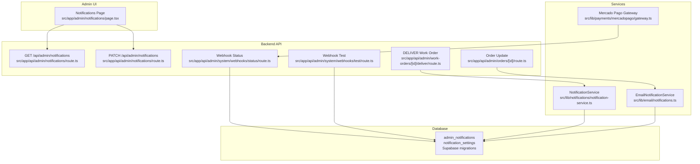
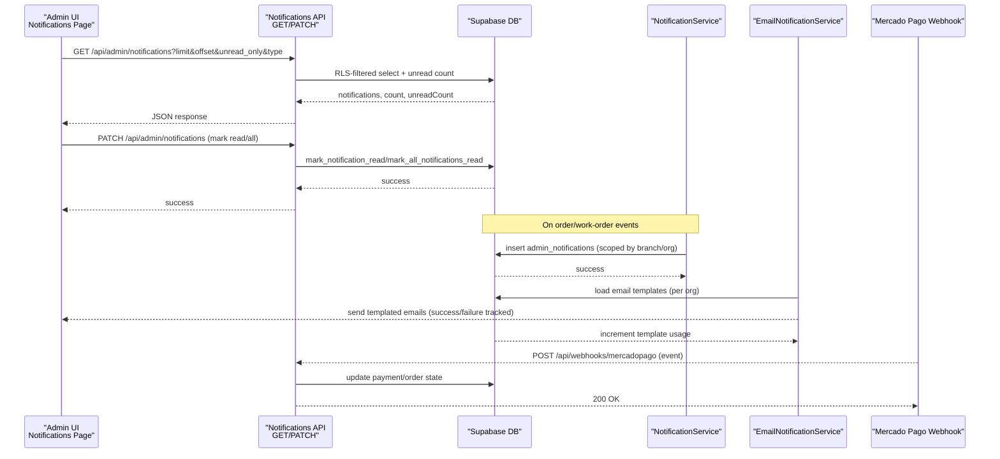
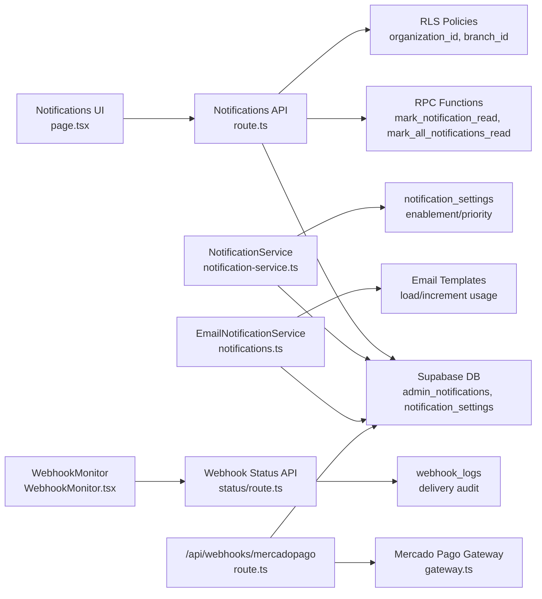

# Delivery Tracking & Analytics

<cite>
**Referenced Files in This Document**
- [page.tsx](file://src/app/admin/notifications/page.tsx)
- [route.ts](file://src/app/api/admin/notifications/route.ts)
- [notification-service.ts](file://src/lib/notifications/notification-service.ts)
- [notifications.ts](file://src/lib/email/notifications.ts)
- [20250129000000_add_optical_notification_types.sql](file://supabase/migrations/20250129000000_add_optical_notification_types.sql)
- [20250129000001_insert_optical_notification_settings.sql](file://supabase/migrations/20250129000001_insert_optical_notification_settings.sql)
- [route.ts](file://src/app/api/admin/work-orders/[id]/deliver/route.ts)
- [route.ts](file://src/app/api/admin/orders/[id]/route.ts)
- [route.ts](file://src/app/api/admin/system/webhooks/status/route.ts)
- [WebhookMonitor.tsx](file://src/components/admin/WebhookMonitor.tsx)
- [gateway.ts](file://src/lib/payments/mercadopago/gateway.ts)
- [route.ts](file://src/app/api/webhooks/mercadopago/route.ts)
- [route.ts](file://src/app/api/admin/orders/[id]/notify/route.ts)
- [route.ts](file://src/app/api/admin/system/webhooks/test/route.ts)
- [route.ts](file://src/app/api/admin/orders/route.ts)
- [orders.ts](file://src/lib/ai/tools/orders.ts)
- [20250128000001_add_quote_expiration_automation.sql](file://supabase/migrations/20250128000001_add_quote_expiration_automation.sql)
- [20260131000002_improve_demo_seed_data.sql](file://supabase/migrations/20260131000002_improve_demo_seed_data.sql)
- [analytics-help.ts](file://src/lib/analytics-help.ts)
- [page.tsx](file://src/app/admin/saas-management/dashboard/page.tsx)
</cite>

## Table of Contents

1. [Introduction](#introduction)
2. [Project Structure](#project-structure)
3. [Core Components](#core-components)
4. [Architecture Overview](#architecture-overview)
5. [Detailed Component Analysis](#detailed-component-analysis)
6. [Dependency Analysis](#dependency-analysis)
7. [Performance Considerations](#performance-considerations)
8. [Troubleshooting Guide](#troubleshooting-guide)
9. [Conclusion](#conclusion)
10. [Appendices](#appendices)

## Introduction

This document explains the notification delivery tracking and analytics system in Opttius with a focus on delivery monitoring, retry mechanisms, failure handling, logs, performance metrics, and analytics dashboards. It covers how notifications are created, filtered, and consumed via the admin UI, how email delivery integrates with templates and provider webhooks, and how webhook delivery status is monitored. It also documents configuration options for notification enablement and priorities, and outlines relationships with external providers (e.g., Mercado Pago), queue management, and batch processing. The goal is to make the system understandable for support teams while providing developers with implementation details for optimization and troubleshooting.

## Project Structure

The delivery tracking and analytics system spans three primary areas:

- Admin UI for viewing notifications and applying filters
- Backend API for fetching and marking notifications
- Notification service and email delivery pipeline
- Webhook monitoring for external provider delivery status
- Database schema and stored functions for notification settings and delivery

**Diagram sources**

- [page.tsx](file://src/app/admin/notifications/page.tsx#L81-L622)
- [route.ts](file://src/app/api/admin/notifications/route.ts#L5-L98)
- [route.ts](file://src/app/api/admin/notifications/route.ts#L101-L165)
- [notification-service.ts](file://src/lib/notifications/notification-service.ts#L53-L160)
- [notifications.ts](file://src/lib/email/notifications.ts#L84-L174)
- [route.ts](file://src/app/api/admin/work-orders/[id]/deliver/route.ts#L171-L185)
- [route.ts](file://src/app/api/admin/orders/[id]/route.ts#L42-L92)
- [route.ts](file://src/app/api/admin/system/webhooks/status/route.ts#L1-L110)
- [route.ts](file://src/app/api/admin/system/webhooks/test/route.ts#L1-L56)
- [20250129000000_add_optical_notification_types.sql](file://supabase/migrations/20250129000000_add_optical_notification_types.sql#L47-L143)

**Section sources**

- [page.tsx](file://src/app/admin/notifications/page.tsx#L1-L623)
- [route.ts](file://src/app/api/admin/notifications/route.ts#L1-L166)
- [notification-service.ts](file://src/lib/notifications/notification-service.ts#L1-L531)
- [notifications.ts](file://src/lib/email/notifications.ts#L1-L800)
- [20250129000000_add_optical_notification_types.sql](file://supabase/migrations/20250129000000_add_optical_notification_types.sql#L1-L143)

## Core Components

- Admin Notifications UI: Displays notifications with unread counts, filters by type/priority, pagination, and actions to mark as read.
- Notifications API: Handles admin authorization, RLS-filtered queries, unread counts, and marking notifications read (single/all).
- NotificationService: Centralized creation of admin notifications with type enablement, priority overrides, scoping by branch/organization, and optional role targeting.
- EmailNotificationService: Sends templated emails for orders, appointments, quotes, work orders, and deliveries; integrates with organization branding and template usage tracking.
- Webhook Monitoring: Provides status and URLs for external provider webhooks (e.g., Mercado Pago), with test endpoints and periodic refresh.
- Database Schema: Defines notification types, settings, and helper functions for enablement and priority resolution.

Key implementation references:

- Admin UI rendering and filters: [page.tsx](file://src/app/admin/notifications/page.tsx#L81-L622)
- API GET/PATCH for notifications: [route.ts](file://src/app/api/admin/notifications/route.ts#L5-L98), [route.ts](file://src/app/api/admin/notifications/route.ts#L101-L165)
- Notification creation and scoping: [notification-service.ts](file://src/lib/notifications/notification-service.ts#L53-L160)
- Email delivery pipeline: [notifications.ts](file://src/lib/email/notifications.ts#L84-L174)
- Webhook status and test endpoints: [route.ts](file://src/app/api/admin/system/webhooks/status/route.ts#L1-L110), [route.ts](file://src/app/api/admin/system/webhooks/test/route.ts#L1-L56)

**Section sources**

- [page.tsx](file://src/app/admin/notifications/page.tsx#L81-L622)
- [route.ts](file://src/app/api/admin/notifications/route.ts#L5-L165)
- [notification-service.ts](file://src/lib/notifications/notification-service.ts#L53-L160)
- [notifications.ts](file://src/lib/email/notifications.ts#L84-L174)
- [route.ts](file://src/app/api/admin/system/webhooks/status/route.ts#L1-L110)
- [route.ts](file://src/app/api/admin/system/webhooks/test/route.ts#L1-L56)

## Architecture Overview

The system combines synchronous admin UI interactions with asynchronous delivery channels:

- Admin UI fetches paginated notifications and unread counts, applies filters, and marks as read.
- NotificationService creates admin notifications with optional scoping and priority overrides.
- EmailNotificationService sends templated emails and increments template usage.
- Webhook endpoints receive provider events (e.g., Mercado Pago), update internal state, and optionally trigger notifications.
- WebhookMonitor displays delivery status and URLs for external providers.

**Diagram sources**

- [page.tsx](file://src/app/admin/notifications/page.tsx#L97-L134)
- [route.ts](file://src/app/api/admin/notifications/route.ts#L5-L98)
- [route.ts](file://src/app/api/admin/notifications/route.ts#L101-L165)
- [notification-service.ts](file://src/lib/notifications/notification-service.ts#L53-L160)
- [notifications.ts](file://src/lib/email/notifications.ts#L84-L174)
- [route.ts](file://src/app/api/webhooks/mercadopago/route.ts#L76-L111)

## Detailed Component Analysis

### Admin Notifications UI

- Loads notifications with pagination and filters (unread only, type, priority).
- Supports marking individual notifications or all as read.
- Displays stats cards for total, unread, and read counts.
- Uses Lucide icons mapped per notification type and priority badges.

Implementation highlights:

- Fetch loop and filters: [page.tsx](file://src/app/admin/notifications/page.tsx#L97-L140)
- Mark as read single/all: [page.tsx](file://src/app/admin/notifications/page.tsx#L142-L194)
- Stats rendering: [page.tsx](file://src/app/admin/notifications/page.tsx#L261-L314)
- Priority and type mapping: [page.tsx](file://src/app/admin/notifications/page.tsx#L50-L79)

**Section sources**

- [page.tsx](file://src/app/admin/notifications/page.tsx#L50-L194)

### Notifications API

- Authentication and admin checks using Supabase auth and RPC functions.
- RLS automatically scopes queries by organization and branch where applicable.
- Supports unread-only filtering and type filtering.
- PATCH endpoint supports marking a single notification or all as read via RPC functions.

Key references:

- Admin checks and RLS query: [route.ts](file://src/app/api/admin/notifications/route.ts#L9-L90)
- Mark as read (single/all): [route.ts](file://src/app/api/admin/notifications/route.ts#L135-L155)

**Section sources**

- [route.ts](file://src/app/api/admin/notifications/route.ts#L5-L98)
- [route.ts](file://src/app/api/admin/notifications/route.ts#L101-L165)

### NotificationService

- Creates admin notifications with:
  - Type enablement and priority overrides via notification_settings
  - Scoping by branchId and derived organizationId
  - Optional target_admin_id/target_admin_role for granular visibility
- Provides convenience methods for optical/shop events (quotes, work orders, sales, appointments).

Important logic:

- Settings lookup and defaults: [notification-service.ts](file://src/lib/notifications/notification-service.ts#L59-L81)
- Organization scoping from branch/entity: [notification-service.ts](file://src/lib/notifications/notification-service.ts#L83-L120)
- Insert with metadata and scoping: [notification-service.ts](file://src/lib/notifications/notification-service.ts#L127-L145)
- Example methods: [notification-service.ts](file://src/lib/notifications/notification-service.ts#L165-L188), [notification-service.ts](file://src/lib/notifications/notification-service.ts#L381-L404)

**Section sources**

- [notification-service.ts](file://src/lib/notifications/notification-service.ts#L53-L160)
- [notification-service.ts](file://src/lib/notifications/notification-service.ts#L165-L404)

### EmailNotificationService

- Loads organization-specific email templates and replaces variables.
- Wraps content in a modern layout and generates plain text.
- Tracks template usage upon successful send.
- Sends order confirmation, shipping, delivery, payment success/failure, and other event emails.

References:

- Order confirmation and usage tracking: [notifications.ts](file://src/lib/email/notifications.ts#L84-L174)
- Shipping/delivery confirmation: [notifications.ts](file://src/lib/email/notifications.ts#L422-L600)
- Payment success/failure: [notifications.ts](file://src/lib/email/notifications.ts#L603-L743)

**Section sources**

- [notifications.ts](file://src/lib/email/notifications.ts#L84-L174)
- [notifications.ts](file://src/lib/email/notifications.ts#L422-L600)
- [notifications.ts](file://src/lib/email/notifications.ts#L603-L743)

### Webhook Monitoring and External Providers

- WebhookMonitor component fetches status and logs, displays success/failure rates, and copies webhook URLs.
- Status endpoint aggregates last 24 hours of webhook logs and exposes provider URLs.
- Test endpoint logs a test webhook event for validation.
- Mercado Pago webhook handler processes payment/preapproval events and updates subscriptions.

References:

- Monitor component and polling: [WebhookMonitor.tsx](file://src/components/admin/WebhookMonitor.tsx#L75-L141)
- Status aggregation and URLs: [route.ts](file://src/app/api/admin/system/webhooks/status/route.ts#L18-L102)
- Test webhook: [route.ts](file://src/app/api/admin/system/webhooks/test/route.ts#L29-L43)
- Mercado Pago webhook processing: [route.ts](file://src/app/api/webhooks/mercadopago/route.ts#L76-L111)
- Gateway event extraction: [gateway.ts](file://src/lib/payments/mercadopago/gateway.ts#L172-L192)

**Section sources**

- [WebhookMonitor.tsx](file://src/components/admin/WebhookMonitor.tsx#L75-L141)
- [route.ts](file://src/app/api/admin/system/webhooks/status/route.ts#L1-L110)
- [route.ts](file://src/app/api/admin/system/webhooks/test/route.ts#L1-L56)
- [route.ts](file://src/app/api/webhooks/mercadopago/route.ts#L76-L111)
- [gateway.ts](file://src/lib/payments/mercadopago/gateway.ts#L172-L192)

### Delivery Logs, Retry Mechanisms, and Failure Handling

- Admin notifications are stored in admin_notifications with created_at, is_read, and is_archived flags for lifecycle tracking.
- Webhook logs are stored in webhook_logs with webhook_type, event_type, payload, status, response_code, and processed_at for auditability.
- Retry and resilience:
  - Non-blocking notification creation from work order delivery to avoid blocking the API: [route.ts](file://src/app/api/admin/work-orders/[id]/deliver/route.ts#L171-L185)
  - Webhook handlers return 200 immediately after recording events; downstream updates occur asynchronously: [route.ts](file://src/app/api/webhooks/mercadopago/route.ts#L76-L111)
  - Duplicate webhook detection via recorded events prevents redundant processing: [gateway.ts](file://src/lib/payments/mercadopago/gateway.ts#L122-L136)

References:

- Work order delivery notification (non-blocking): [route.ts](file://src/app/api/admin/work-orders/[id]/deliver/route.ts#L171-L185)
- Webhook recording and duplicate prevention: [gateway.ts](file://src/lib/payments/mercadopago/gateway.ts#L122-L136)

**Section sources**

- [route.ts](file://src/app/api/admin/work-orders/[id]/deliver/route.ts#L171-L185)
- [gateway.ts](file://src/lib/payments/mercadopago/gateway.ts#L122-L136)

### Delivery Status Indicators and Analytics

- Admin UI shows unread counts and priority badges for quick triage.
- WebhookMonitor shows total, success, failed counts and last delivery timestamps per provider.
- Analytics help texts define metric semantics for revenue, growth, orders, customers, and conversion rate.

References:

- Priority badges and unread indicators: [page.tsx](file://src/app/admin/notifications/page.tsx#L50-L79), [page.tsx](file://src/app/admin/notifications/page.tsx#L466-L539)
- Webhook status aggregation: [route.ts](file://src/app/api/admin/system/webhooks/status/route.ts#L27-L55)
- Analytics help definitions: [analytics-help.ts](file://src/lib/analytics-help.ts#L1-L39)

**Section sources**

- [page.tsx](file://src/app/admin/notifications/page.tsx#L50-L79)
- [route.ts](file://src/app/api/admin/system/webhooks/status/route.ts#L27-L55)
- [analytics-help.ts](file://src/lib/analytics-help.ts#L1-L39)

### Configuration Options: Thresholds, Policies, and Alerts

- Notification enablement and priority overrides are controlled via notification_settings:
  - notification_type (enum), enabled flag, priority override, notify_all_admins, notify_specific_roles, and metadata.
  - Helper functions: is_notification_enabled and get_notification_priority.
- Default settings are inserted for optical shop notification types.

References:

- Settings table and policies: [20250129000000_add_optical_notification_types.sql](file://supabase/migrations/20250129000000_add_optical_notification_types.sql#L47-L106)
- Priority and enablement functions: [20250129000000_add_optical_notification_types.sql](file://supabase/migrations/20250129000000_add_optical_notification_types.sql#L107-L134)
- Default insertions: [20250129000001_insert_optical_notification_settings.sql](file://supabase/migrations/20250129000001_insert_optical_notification_settings.sql#L7-L28)

**Section sources**

- [20250129000000_add_optical_notification_types.sql](file://supabase/migrations/20250129000000_add_optical_notification_types.sql#L47-L134)
- [20250129000001_insert_optical_notification_settings.sql](file://supabase/migrations/20250129000001_insert_optical_notification_settings.sql#L7-L28)

### Relationships with External Providers, Queue Management, and Batch Processing

- External provider webhooks (e.g., Mercado Pago) are handled by dedicated endpoints that parse topics and IDs, validate references, and update internal state.
- WebhookMonitor polls status and displays provider URLs for easy configuration.
- Batch-like processing occurs via stored procedures for inventory and quote expiration automation.

References:

- Webhook status and URLs: [route.ts](file://src/app/api/admin/system/webhooks/status/route.ts#L57-L102)
- Webhook monitor component: [WebhookMonitor.tsx](file://src/components/admin/WebhookMonitor.tsx#L75-L141)
- Quote expiration automation: [20250128000001_add_quote_expiration_automation.sql](file://supabase/migrations/20250128000001_add_quote_expiration_automation.sql#L4-L25)
- Demo seed data with randomized timestamps: [20260131000002_improve_demo_seed_data.sql](file://supabase/migrations/20260131000002_improve_demo_seed_data.sql#L440-L451)

**Section sources**

- [route.ts](file://src/app/api/admin/system/webhooks/status/route.ts#L57-L102)
- [WebhookMonitor.tsx](file://src/components/admin/WebhookMonitor.tsx#L75-L141)
- [20250128000001_add_quote_expiration_automation.sql](file://supabase/migrations/20250128000001_add_quote_expiration_automation.sql#L4-L25)
- [20260131000002_improve_demo_seed_data.sql](file://supabase/migrations/20260131000002_improve_demo_seed_data.sql#L440-L451)

### Delivery Optimization, Rate Limiting, and Provider-Specific Integrations

- Non-blocking notifications reduce latency for critical flows (e.g., work order delivery).
- Duplicate webhook detection avoids redundant processing and improves reliability.
- Provider-specific integrations:
  - Mercado Pago: gateway extracts topic/id, validates external_reference, and maps statuses to subscriptions.
  - WebhookMonitor auto-detects base URL and exposes provider endpoints.

References:

- Non-blocking notification creation: [route.ts](file://src/app/api/admin/work-orders/[id]/deliver/route.ts#L171-L185)
- Duplicate webhook handling: [gateway.ts](file://src/lib/payments/mercadopago/gateway.ts#L122-L136)
- Mercado Pago webhook parsing: [gateway.ts](file://src/lib/payments/mercadopago/gateway.ts#L172-L192)

**Section sources**

- [route.ts](file://src/app/api/admin/work-orders/[id]/deliver/route.ts#L171-L185)
- [gateway.ts](file://src/lib/payments/mercadopago/gateway.ts#L122-L136)
- [gateway.ts](file://src/lib/payments/mercadopago/gateway.ts#L172-L192)

### Analytics Reporting, Trend Analysis, and Performance Monitoring

- Admin UI provides quick stats for total/unread/read notifications.
- WebhookMonitor aggregates success/failure trends over 24 hours.
- Analytics help texts define metric semantics for revenue, growth, orders, customers, and conversion rate.
- SaaS dashboard includes tier distribution metrics.

References:

- Notification stats rendering: [page.tsx](file://src/app/admin/notifications/page.tsx#L261-L314)
- Webhook status aggregation: [route.ts](file://src/app/api/admin/system/webhooks/status/route.ts#L18-L55)
- Analytics help definitions: [analytics-help.ts](file://src/lib/analytics-help.ts#L1-L39)
- SaaS tier distribution: [page.tsx](file://src/app/admin/saas-management/dashboard/page.tsx#L212-L237)

**Section sources**

- [page.tsx](file://src/app/admin/notifications/page.tsx#L261-L314)
- [route.ts](file://src/app/api/admin/system/webhooks/status/route.ts#L18-L55)
- [analytics-help.ts](file://src/lib/analytics-help.ts#L1-L39)
- [page.tsx](file://src/app/admin/saas-management/dashboard/page.tsx#L212-L237)

## Dependency Analysis

**Diagram sources**

- [page.tsx](file://src/app/admin/notifications/page.tsx#L81-L622)
- [route.ts](file://src/app/api/admin/notifications/route.ts#L5-L165)
- [notification-service.ts](file://src/lib/notifications/notification-service.ts#L53-L160)
- [notifications.ts](file://src/lib/email/notifications.ts#L84-L174)
- [route.ts](file://src/app/api/admin/system/webhooks/status/route.ts#L1-L110)
- [WebhookMonitor.tsx](file://src/components/admin/WebhookMonitor.tsx#L75-L141)
- [route.ts](file://src/app/api/webhooks/mercadopago/route.ts#L76-L111)
- [gateway.ts](file://src/lib/payments/mercadopago/gateway.ts#L172-L192)

**Section sources**

- [page.tsx](file://src/app/admin/notifications/page.tsx#L81-L622)
- [route.ts](file://src/app/api/admin/notifications/route.ts#L5-L165)
- [notification-service.ts](file://src/lib/notifications/notification-service.ts#L53-L160)
- [notifications.ts](file://src/lib/email/notifications.ts#L84-L174)
- [route.ts](file://src/app/api/admin/system/webhooks/status/route.ts#L1-L110)
- [WebhookMonitor.tsx](file://src/components/admin/WebhookMonitor.tsx#L75-L141)
- [route.ts](file://src/app/api/webhooks/mercadopago/route.ts#L76-L111)
- [gateway.ts](file://src/lib/payments/mercadopago/gateway.ts#L172-L192)

## Performance Considerations

- Non-blocking notifications: Creating notifications after critical operations reduces latency and avoids blocking API responses.
- RLS and indexing: RLS policies and indexes on notification_settings improve query performance and enforce tenant isolation.
- Template caching: EmailNotificationService loads templates once per send; ensure template usage increments only on success to avoid unnecessary writes.
- Webhook throughput: Handlers return 200 immediately and rely on idempotent updates; consider batching or backoff for downstream systems if needed.

[No sources needed since this section provides general guidance]

## Troubleshooting Guide

Common issues and resolutions:

- Unauthorized or insufficient privileges:
  - Verify admin checks and RPC functions in the Notifications API.
  - References: [route.ts](file://src/app/api/admin/notifications/route.ts#L9-L36)
- Notifications not appearing:
  - Check notification_settings enablement and priority overrides.
  - References: [20250129000000_add_optical_notification_types.sql](file://supabase/migrations/20250129000000_add_optical_notification_types.sql#L107-L134)
- Email delivery failures:
  - Inspect template availability and usage increments; verify organization branding metadata.
  - References: [notifications.ts](file://src/lib/email/notifications.ts#L84-L174)
- Webhook delivery problems:
  - Use WebhookMonitor to check success/failure ratios and copy provider URLs.
  - References: [WebhookMonitor.tsx](file://src/components/admin/WebhookMonitor.tsx#L75-L141), [route.ts](file://src/app/api/admin/system/webhooks/status/route.ts#L18-L55)
- Duplicate webhook processing:
  - Confirm webhook event recording and duplicate detection logic.
  - References: [gateway.ts](file://src/lib/payments/mercadopago/gateway.ts#L122-L136)

**Section sources**

- [route.ts](file://src/app/api/admin/notifications/route.ts#L9-L36)
- [20250129000000_add_optical_notification_types.sql](file://supabase/migrations/20250129000000_add_optical_notification_types.sql#L107-L134)
- [notifications.ts](file://src/lib/email/notifications.ts#L84-L174)
- [WebhookMonitor.tsx](file://src/components/admin/WebhookMonitor.tsx#L75-L141)
- [route.ts](file://src/app/api/admin/system/webhooks/status/route.ts#L18-L55)
- [gateway.ts](file://src/lib/payments/mercadopago/gateway.ts#L122-L136)

## Conclusion

Opttius’ delivery tracking and analytics system integrates admin notifications, email delivery, and external provider webhooks with robust scoping, configuration, and monitoring. Admins can triage and act on notifications efficiently, while developers benefit from non-blocking delivery, RLS enforcement, and webhook auditability. The system’s modular design enables optimization through non-blocking operations, duplicate prevention, and provider-specific integrations, supported by clear analytics and configuration surfaces.

[No sources needed since this section summarizes without analyzing specific files]

## Appendices

### Delivery Status Indicators Reference

- Priority badges: low, medium, high, urgent
- Unread indicator: visual accent and unread count
- Time since created: human-readable relative timestamps

References:

- Priority mapping and UI: [page.tsx](file://src/app/admin/notifications/page.tsx#L50-L79), [page.tsx](file://src/app/admin/notifications/page.tsx#L520-L539)

**Section sources**

- [page.tsx](file://src/app/admin/notifications/page.tsx#L50-L79)
- [page.tsx](file://src/app/admin/notifications/page.tsx#L520-L539)

### Retry Logic Reference

- Non-blocking notification creation from work order delivery:
  - References: [route.ts](file://src/app/api/admin/work-orders/[id]/deliver/route.ts#L171-L185)
- Duplicate webhook detection:
  - References: [gateway.ts](file://src/lib/payments/mercadopago/gateway.ts#L122-L136)

**Section sources**

- [route.ts](file://src/app/api/admin/work-orders/[id]/deliver/route.ts#L171-L185)
- [gateway.ts](file://src/lib/payments/mercadopago/gateway.ts#L122-L136)

### Error Categorization Reference

- Notification creation errors: captured and returned as part of createNotification result
  - References: [notification-service.ts](file://src/lib/notifications/notification-service.ts#L153-L159)
- Email send failures: logged and returned with error messages
  - References: [notifications.ts](file://src/lib/email/notifications.ts#L167-L173), [notifications.ts](file://src/lib/email/notifications.ts#L504-L510), [notifications.ts](file://src/lib/email/notifications.ts#L680-L685)

**Section sources**

- [notification-service.ts](file://src/lib/notifications/notification-service.ts#L153-L159)
- [notifications.ts](file://src/lib/email/notifications.ts#L167-L173)
- [notifications.ts](file://src/lib/email/notifications.ts#L504-L510)
- [notifications.ts](file://src/lib/email/notifications.ts#L680-L685)

### Success/Failure Metrics Reference

- Admin notification stats: total, unread, read
  - References: [page.tsx](file://src/app/admin/notifications/page.tsx#L261-L314)
- Webhook delivery metrics: total, success, failed, last delivery
  - References: [route.ts](file://src/app/api/admin/system/webhooks/status/route.ts#L27-L55)
- Analytics help definitions: total revenue, revenue growth, total orders, total customers, conversion rate
  - References: [analytics-help.ts](file://src/lib/analytics-help.ts#L1-L39)

**Section sources**

- [page.tsx](file://src/app/admin/notifications/page.tsx#L261-L314)
- [route.ts](file://src/app/api/admin/system/webhooks/status/route.ts#L27-L55)
- [analytics-help.ts](file://src/lib/analytics-help.ts#L1-L39)

### Configuration Options Reference

- Notification enablement and priority overrides via notification_settings
  - References: [20250129000000_add_optical_notification_types.sql](file://supabase/migrations/20250129000000_add_optical_notification_types.sql#L47-L106), [20250129000000_add_optical_notification_types.sql](file://supabase/migrations/20250129000000_add_optical_notification_types.sql#L107-L134)
- Default settings insertion
  - References: [20250129000001_insert_optical_notification_settings.sql](file://supabase/migrations/20250129000001_insert_optical_notification_settings.sql#L7-L28)

**Section sources**

- [20250129000000_add_optical_notification_types.sql](file://supabase/migrations/20250129000000_add_optical_notification_types.sql#L47-L134)
- [20250129000001_insert_optical_notification_settings.sql](file://supabase/migrations/20250129000001_insert_optical_notification_settings.sql#L7-L28)

### External Provider Integrations Reference

- Webhook status and URLs
  - References: [route.ts](file://src/app/api/admin/system/webhooks/status/route.ts#L57-L102)
- WebhookMonitor component
  - References: [WebhookMonitor.tsx](file://src/components/admin/WebhookMonitor.tsx#L75-L141)
- Mercado Pago webhook processing
  - References: [route.ts](file://src/app/api/webhooks/mercadopago/route.ts#L76-L111), [gateway.ts](file://src/lib/payments/mercadopago/gateway.ts#L172-L192)

**Section sources**

- [route.ts](file://src/app/api/admin/system/webhooks/status/route.ts#L57-L102)
- [WebhookMonitor.tsx](file://src/components/admin/WebhookMonitor.tsx#L75-L141)
- [route.ts](file://src/app/api/webhooks/mercadopago/route.ts#L76-L111)
- [gateway.ts](file://src/lib/payments/mercadopago/gateway.ts#L172-L192)
