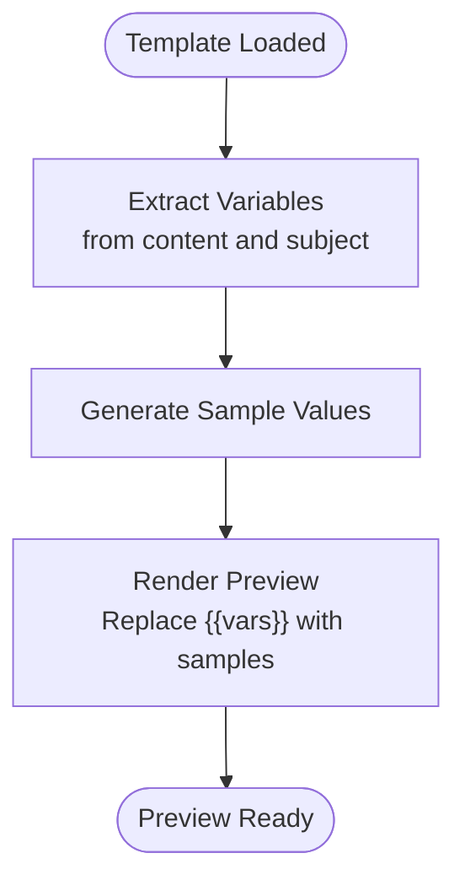

# Email Templates System

<cite>
**Referenced Files in This Document**
- [OPTICA_EMAIL_TEMPLATES.md](file://docs/OPTICA_EMAIL_TEMPLATES.md)
- [SAAS_EMAIL_TEMPLATES.md](file://docs/SAAS_EMAIL_TEMPLATES.md)
- [EmailTemplatesManager.tsx](file://src/components/admin/EmailTemplatesManager.tsx)
- [page.tsx](file://src/app/admin/saas-management/emails/page.tsx)
- [page.tsx](file://src/app/admin/support/templates/page.tsx)
- [client.ts](file://src/lib/email/client.ts)
- [template-loader.ts](file://src/lib/email/template-loader.ts)
- [templates.ts](file://src/lib/email/templates.ts)
- [route.ts](file://src/app/api/admin/system/email-templates/route.ts)
- [insert_templates.sql](file://scripts/email/insert_templates.sql)
</cite>

## Table of Contents

1. [Introduction](#introduction)
2. [Project Structure](#project-structure)
3. [Core Components](#core-components)
4. [Architecture Overview](#architecture-overview)
5. [Detailed Component Analysis](#detailed-component-analysis)
6. [Dependency Analysis](#dependency-analysis)
7. [Performance Considerations](#performance-considerations)
8. [Troubleshooting Guide](#troubleshooting-guide)
9. [Conclusion](#conclusion)

## Introduction

This document describes the comprehensive email templates system in Opttius, covering both organization-facing and SaaS-facing communications. It explains the template architecture, categories, dynamic content insertion, multi-language considerations, and operational workflows for management, testing, and delivery. The system supports both HTML and plain text emails, variable substitution, preview functionality, and tenant-aware template inheritance.

## Project Structure

The email templates system spans frontend management UI, backend APIs, and shared email utilities:

- Frontend:
  - EmailTemplatesManager: React component for managing templates in admin UI
  - SaaS Emails page: Dedicated admin page for SaaS template management
  - Support Templates page: Management UI for support response templates
- Backend:
  - API routes for CRUD operations on system email templates
  - Template loader utilities for database retrieval and usage tracking
  - Email client wrapper around Resend for sending and batch sending
- Shared:
  - Template utilities for variable replacement and formatting
  - SQL seed scripts for initial template population

**Diagram sources**

- [EmailTemplatesManager.tsx](file://src/components/admin/EmailTemplatesManager.tsx#L1-L532)
- [page.tsx](file://src/app/admin/saas-management/emails/page.tsx#L1-L131)
- [page.tsx](file://src/app/admin/support/templates/page.tsx#L1-L687)
- [route.ts](file://src/app/api/admin/system/email-templates/route.ts#L1-L229)
- [template-loader.ts](file://src/lib/email/template-loader.ts#L1-L116)
- [client.ts](file://src/lib/email/client.ts#L1-L113)
- [templates.ts](file://src/lib/email/templates.ts#L1-L446)
- [OPTICA_EMAIL_TEMPLATES.md](file://docs/OPTICA_EMAIL_TEMPLATES.md#L1-L800)
- [SAAS_EMAIL_TEMPLATES.md](file://docs/SAAS_EMAIL_TEMPLATES.md#L1-L800)
- [insert_templates.sql](file://scripts/email/insert_templates.sql#L124-L153)

**Section sources**

- [EmailTemplatesManager.tsx](file://src/components/admin/EmailTemplatesManager.tsx#L1-L532)
- [page.tsx](file://src/app/admin/saas-management/emails/page.tsx#L1-L131)
- [page.tsx](file://src/app/admin/support/templates/page.tsx#L1-L687)
- [route.ts](file://src/app/api/admin/system/email-templates/route.ts#L1-L229)
- [template-loader.ts](file://src/lib/email/template-loader.ts#L1-L116)
- [client.ts](file://src/lib/email/client.ts#L1-L113)
- [templates.ts](file://src/lib/email/templates.ts#L1-L446)
- [OPTICA_EMAIL_TEMPLATES.md](file://docs/OPTICA_EMAIL_TEMPLATES.md#L1-L800)
- [SAAS_EMAIL_TEMPLATES.md](file://docs/SAAS_EMAIL_TEMPLATES.md#L1-L800)
- [insert_templates.sql](file://scripts/email/insert_templates.sql#L124-L153)

## Core Components

- EmailTemplatesManager: Provides a unified UI for creating, editing, activating/deactivating, previewing, testing, and deleting templates. Supports filtering by type and toggling activation state.
- Template Loader: Loads templates from the database with tenant-aware fallback logic (organization-specific first, then system defaults).
- Email Client: Wraps Resend SDK with graceful degradation when API keys are missing, normalization for test domains, and batch sending capabilities.
- Template Utilities: Formats currency, creates base layouts, and generates HTML/text variants for common email types.
- API Routes: Secure endpoints for listing, creating, updating, and deleting system email templates with multi-tenant filtering and admin authorization checks.
- Template Documents: Comprehensive HTML templates for optical workflows and SaaS administrative communications, including variables and conditional content.

Key implementation highlights:

- Variable substitution: Templates use double-brace placeholders; the system extracts variables and renders previews with sample data.
- Tenant inheritance: Organization-specific templates override system defaults; inactive system templates are ignored.
- Delivery testing: Users can send test emails to a specified address with variable substitution applied.
- Multi-language considerations: While templates are authored in Spanish, the system supports variable-driven content that can be localized per organization.

**Section sources**

- [EmailTemplatesManager.tsx](file://src/components/admin/EmailTemplatesManager.tsx#L52-L84)
- [template-loader.ts](file://src/lib/email/template-loader.ts#L19-L76)
- [client.ts](file://src/lib/email/client.ts#L54-L113)
- [templates.ts](file://src/lib/email/templates.ts#L46-L157)
- [route.ts](file://src/app/api/admin/system/email-templates/route.ts#L6-L112)
- [OPTICA_EMAIL_TEMPLATES.md](file://docs/OPTICA_EMAIL_TEMPLATES.md#L24-L42)
- [SAAS_EMAIL_TEMPLATES.md](file://docs/SAAS_EMAIL_TEMPLATES.md#L22-L43)

## Architecture Overview

The system follows a layered architecture:

- Presentation Layer: Admin pages and dialogs for template management and preview
- Application Layer: API routes enforcing authorization and multi-tenant filtering
- Domain Layer: Template loader and utilities for database access and content formatting
- Infrastructure Layer: Email client integrating with Resend

**Diagram sources**

- [EmailTemplatesManager.tsx](file://src/components/admin/EmailTemplatesManager.tsx#L177-L214)
- [route.ts](file://src/app/api/admin/system/email-templates/route.ts#L1-L229)
- [template-loader.ts](file://src/lib/email/template-loader.ts#L19-L76)
- [client.ts](file://src/lib/email/client.ts#L54-L88)

## Detailed Component Analysis

### Template Categories and Types

The system defines distinct categories and types:

- Organization templates: Used for customer-facing communications (e.g., appointment confirmations, reminders, prescriptions)
- SaaS templates: Administrative communications for platform users (e.g., welcome, trial ending, subscription updates)
- Support templates: Internal response templates for customer support agents

Common template types include:

- Appointment lifecycle: confirmation, reminder, cancellation
- Prescription lifecycle: ready, expiring
- Work order lifecycle: ready
- Generic: marketing, custom

Variable sets vary by type; for example, optical templates commonly include customer, branch, professional, and appointment/prescription details.

**Section sources**

- [route.ts](file://src/app/api/admin/system/email-templates/route.ts#L160-L176)
- [OPTICA_EMAIL_TEMPLATES.md](file://docs/OPTICA_EMAIL_TEMPLATES.md#L43-L800)
- [SAAS_EMAIL_TEMPLATES.md](file://docs/SAAS_EMAIL_TEMPLATES.md#L46-L800)

### Dynamic Content Insertion and Variable Substitution

The system supports:

- Double-brace variable placeholders in both subject and content
- Extraction of variables from templates for preview generation
- Sample data injection for preview rendering
- Conditional content blocks (e.g., preparation instructions, graduation details)

Implementation pattern:

- Extract variables using regex matching on content and subject
- Generate sample values for common variables
- Render preview by replacing placeholders with sample values
- During delivery, replace placeholders with real data from workflows

**Diagram sources**

- [page.tsx](file://src/app/admin/support/templates/page.tsx#L167-L204)

**Section sources**

- [page.tsx](file://src/app/admin/support/templates/page.tsx#L167-L204)
- [EmailTemplatesManager.tsx](file://src/components/admin/EmailTemplatesManager.tsx#L177-L214)

### Template Management UI

The EmailTemplatesManager provides:

- Filtering by type
- Activation toggle
- Preview dialog with raw HTML content
- Test email dialog with recipient input
- Create/Edit dialog supporting name, subject, content, category, and variables
- Deletion with system template protection

**Diagram sources**

- [EmailTemplatesManager.tsx](file://src/components/admin/EmailTemplatesManager.tsx#L52-L84)
- [EmailTemplatesManager.tsx](file://src/components/admin/EmailTemplatesManager.tsx#L89-L118)

**Section sources**

- [EmailTemplatesManager.tsx](file://src/components/admin/EmailTemplatesManager.tsx#L1-L532)

### Template Loading and Tenant Inheritance

Template resolution follows a deterministic order:

- If an organization ID is provided, search for an active template with that organization ID
- If not found, fall back to the system default (organization_id IS NULL)
- If neither exists, return null

Usage tracking increments per successful template load, with failure-safe behavior.

**Diagram sources**

- [template-loader.ts](file://src/lib/email/template-loader.ts#L19-L76)
- [template-loader.ts](file://src/lib/email/template-loader.ts#L82-L107)

**Section sources**

- [template-loader.ts](file://src/lib/email/template-loader.ts#L19-L76)
- [template-loader.ts](file://src/lib/email/template-loader.ts#L82-L107)

### Delivery Testing and Validation

Testing workflow:

- Admin enters a destination email
- System sends a test email using the selected template with sample variables
- Results are surfaced via toast notifications

Validation includes:

- Admin authorization checks
- Input validation for required fields
- Type validation against allowed template types
- Multi-tenant visibility rules

**Diagram sources**

- [EmailTemplatesManager.tsx](file://src/components/admin/EmailTemplatesManager.tsx#L177-L214)
- [route.ts](file://src/app/api/admin/system/email-templates/route.ts#L1-L229)
- [client.ts](file://src/lib/email/client.ts#L54-L88)

**Section sources**

- [EmailTemplatesManager.tsx](file://src/components/admin/EmailTemplatesManager.tsx#L177-L214)
- [route.ts](file://src/app/api/admin/system/email-templates/route.ts#L114-L229)
- [client.ts](file://src/lib/email/client.ts#L54-L88)

### Configuration Options and Integration Points

- Environment configuration:
  - RESEND_API_KEY: Enables email delivery
  - RESEND_FROM_EMAIL: Sender address
  - NEXT_PUBLIC_APP_URL: Domain used in email footers and links
- Multi-tenant filtering:
  - Global admins can view all templates or filter by category
  - Organization admins see system templates with category "organization" and their own templates
- Template categories:
  - organization: Customer-facing templates
  - saas: Administrative templates for SaaS users
- Template variables:
  - Stored as JSON arrays in the database
  - Extracted and validated during preview and delivery

**Section sources**

- [client.ts](file://src/lib/email/client.ts#L14-L19)
- [route.ts](file://src/app/api/admin/system/email-templates/route.ts#L64-L80)
- [route.ts](file://src/app/api/admin/system/email-templates/route.ts#L160-L176)

### Relationship with Notification System and Business Workflows

- Notification triggers: Workflows invoke template loading and email sending after events (e.g., appointment scheduling, prescription readiness)
- Customer data integration: Variables represent customer, branch, professional, and order/prescription attributes
- Business workflow triggers:
  - Appointment confirmation/reminders/cancellations
  - Prescription ready/expiring
  - Work order ready
  - Subscription lifecycle (SaaS)

**Section sources**

- [OPTICA_EMAIL_TEMPLATES.md](file://docs/OPTICA_EMAIL_TEMPLATES.md#L43-L800)
- [SAAS_EMAIL_TEMPLATES.md](file://docs/SAAS_EMAIL_TEMPLATES.md#L46-L800)

### Template Customization, Branding, and Compliance

- Customization:
  - Organization-specific templates override system defaults
  - Variables enable dynamic content per customer and event
- Branding:
  - Base layouts and styles are centralized in shared utilities
  - Organization templates can adjust colors, logos, and messaging
- Compliance:
  - Test domain handling ensures safe testing without external delivery
  - Usage tracking helps monitor template effectiveness

**Section sources**

- [templates.ts](file://src/lib/email/templates.ts#L46-L157)
- [client.ts](file://src/lib/email/client.ts#L38-L51)

## Dependency Analysis

The system exhibits clear separation of concerns:

- UI depends on API routes for data operations
- API routes depend on template loader for database access
- Template loader depends on Supabase clients for database queries
- Email client depends on Resend SDK for delivery
- Utilities provide shared formatting and layout logic

**Diagram sources**

- [EmailTemplatesManager.tsx](file://src/components/admin/EmailTemplatesManager.tsx#L1-L532)
- [route.ts](file://src/app/api/admin/system/email-templates/route.ts#L1-L229)
- [template-loader.ts](file://src/lib/email/template-loader.ts#L1-L116)
- [client.ts](file://src/lib/email/client.ts#L1-L113)

**Section sources**

- [EmailTemplatesManager.tsx](file://src/components/admin/EmailTemplatesManager.tsx#L1-L532)
- [route.ts](file://src/app/api/admin/system/email-templates/route.ts#L1-L229)
- [template-loader.ts](file://src/lib/email/template-loader.ts#L1-L116)
- [client.ts](file://src/lib/email/client.ts#L1-L113)

## Performance Considerations

- Template loading: Single query with ordering to prioritize organization-specific templates; consider caching frequently accessed templates per organization.
- Batch sending: Built-in delay between emails to avoid rate limits; tune delays based on provider quotas.
- Preview generation: Regex extraction and replacement are lightweight; avoid heavy computations in preview rendering.
- Database queries: Use selective field projections and appropriate indexes on type, organization_id, and is_active.

## Troubleshooting Guide

Common issues and resolutions:

- Missing Resend API key:
  - Symptom: Emails not sent, warnings in logs
  - Resolution: Configure RESEND_API_KEY; testing emails will still be accepted but not delivered
- Test domain restrictions:
  - Symptom: Test emails only deliver to the sender address
  - Resolution: Use a verified domain or adjust RESEND_FROM_EMAIL for testing
- Unauthorized access:
  - Symptom: 401/403 responses from API
  - Resolution: Ensure admin user is logged in and has proper role/organization assignment
- Template not found:
  - Symptom: Null template returned
  - Resolution: Verify template type, category, and organization-specific overrides; ensure system default exists if needed
- Usage tracking failures:
  - Symptom: Email sent but usage count unchanged
  - Resolution: Check service role permissions; logging is best-effort

**Section sources**

- [client.ts](file://src/lib/email/client.ts#L3-L8)
- [client.ts](file://src/lib/email/client.ts#L40-L51)
- [route.ts](file://src/app/api/admin/system/email-templates/route.ts#L15-L41)
- [template-loader.ts](file://src/lib/email/template-loader.ts#L72-L76)

## Conclusion

The Opttius email templates system provides a robust, tenant-aware framework for managing customer and administrative communications. Its modular design enables easy customization, reliable delivery, and strong operational controls. By leveraging variable-driven content, inheritance patterns, and comprehensive testing tools, administrators can maintain high-quality, compliant, and effective email experiences across diverse organizational needs.
