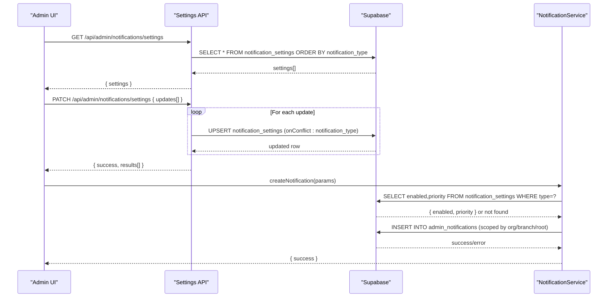
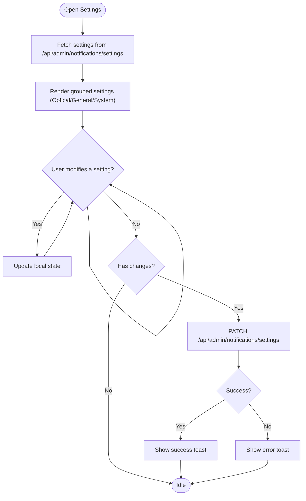
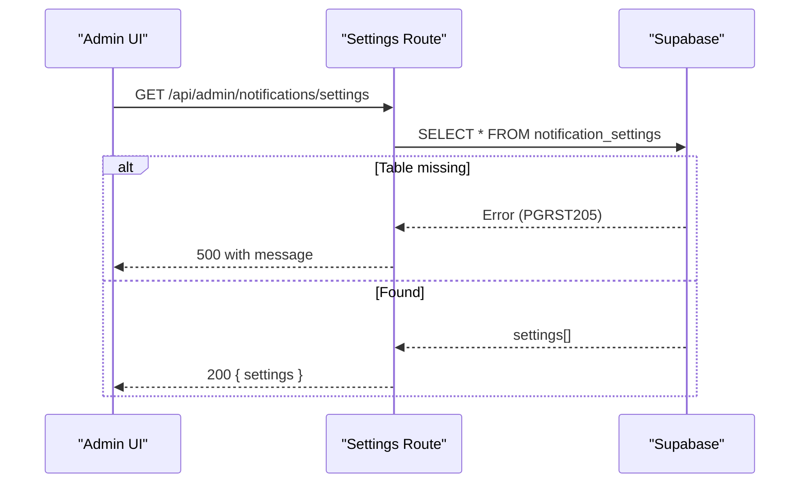
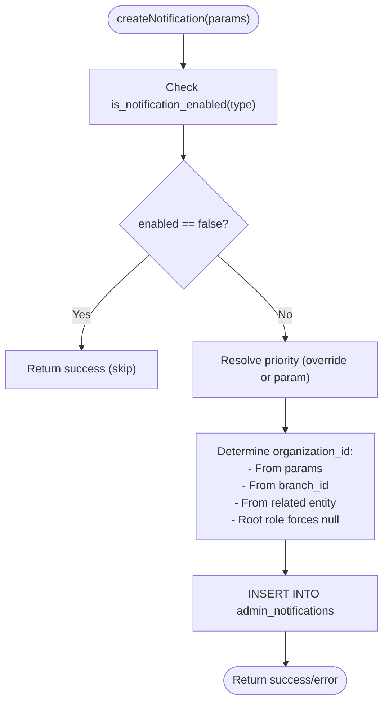
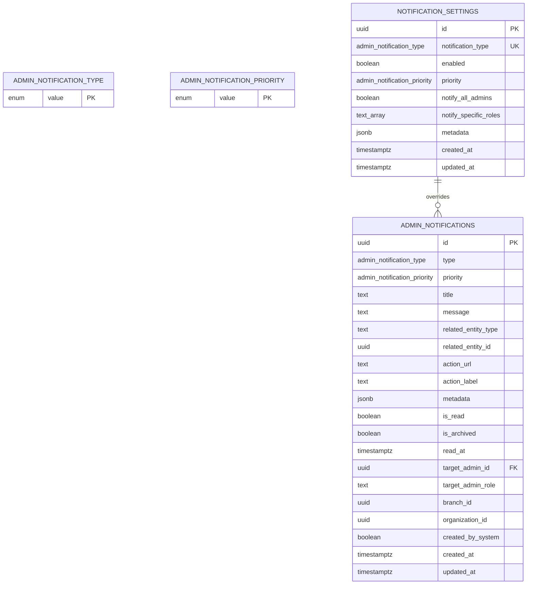
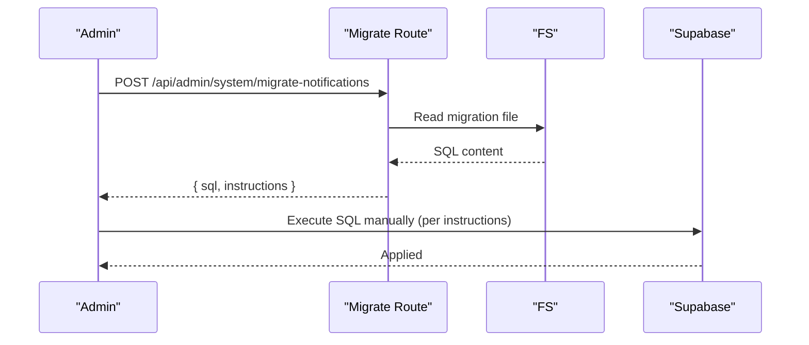
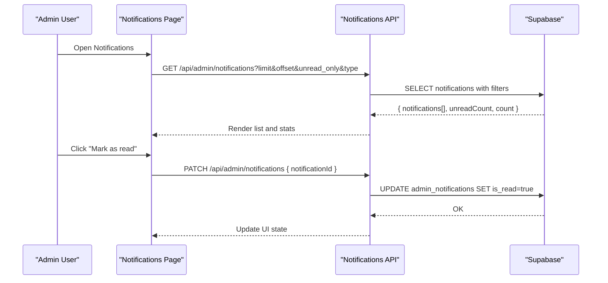
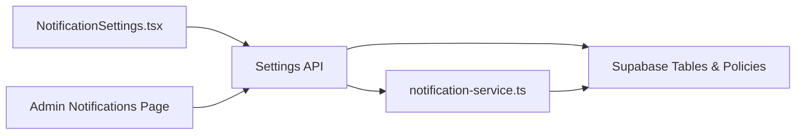

# Notification Settings & Preferences

<cite>
**Referenced Files in This Document**
- [NotificationSettings.tsx](file://src/components/admin/NotificationSettings.tsx)
- [notification-service.ts](file://src/lib/notifications/notification-service.ts)
- [route.ts](file://src/app/api/admin/notifications/settings/Route.ts)
- [route.ts](file://src/app/api/admin/system/migrate-notifications/route.ts)
- [apply-notification-migrations.js](file://scripts/apply-notification-migrations.js)
- [20250118000000_create_admin_notifications.sql](file://supabase/migrations/20250118000000_create_admin_notifications.sql)
- [20250129000000_add_optical_notification_types.sql](file://supabase/migrations/20250129000000_add_optical_notification_types.sql)
- [20250129000001_insert_optical_notification_settings.sql](file://supabase/migrations/20250129000001_insert_optical_notification_settings.sql)
- [20260201000000_admin_notifications_root_dev_visibility.sql](file://supabase/migrations/20260201000000_admin_notifications_root_dev_visibility.sql)
- [20260201000001_add_organization_id_to_notifications.sql](file://supabase/migrations/20260201000001_add_organization_id_to_notifications.sql)
- [page.tsx](file://src/app/admin/notifications/page.tsx)
</cite>

## Table of Contents

1. [Introduction](#introduction)
2. [Project Structure](#project-structure)
3. [Core Components](#core-components)
4. [Architecture Overview](#architecture-overview)
5. [Detailed Component Analysis](#detailed-component-analysis)
6. [Dependency Analysis](#dependency-analysis)
7. [Performance Considerations](#performance-considerations)
8. [Troubleshooting Guide](#troubleshooting-guide)
9. [Conclusion](#conclusion)
10. [Appendices](#appendices)

## Introduction

This document explains the notification settings and preferences system in Opttius. It covers how administrators configure notification channels, frequencies, and delivery preferences, how preferences are stored and inherited across organizations, and how system defaults are applied. It also documents the relationship between notification types, timing preferences, channel targeting, user roles, organization settings, subscription tiers, and the mechanisms for preference synchronization, conflict resolution, and audit logging. The content is designed to be accessible to administrators while providing developers with implementation details and customization guidance.

## Project Structure

The notification system spans frontend UI components, backend API routes, database migrations, and a service library:

- Frontend: A dedicated admin settings page renders and updates notification preferences.
- Backend: API endpoints expose CRUD operations for notification settings and provide migration utilities.
- Database: Migrations define enums, tables, indexes, RLS policies, and helper functions for enabling/disabling and prioritizing notifications.
- Service Library: A centralized notification service encapsulates creation logic, preference lookup, scoping, and routing.

```mermaid
graph TB
subgraph "Frontend"
UI_Settings["NotificationSettings.tsx"]
UI_Notifications["Admin Notifications Page (page.tsx)"]
end
subgraph "Backend"
API_Settings["/api/admin/notifications/settings<br/>GET/PUT/PATCH"]
API_Migrate["/api/admin/system/migrate-notifications<br/>POST"]
end
subgraph "Database"
Enums["Enums: admin_notification_type,<br/>admin_notification_priority"]
Table_Settings["notification_settings"]
Table_AdminNotif["admin_notifications"]
Functions["Functions: is_notification_enabled,<br/>get_notification_priority,<br/>mark_* helpers"]
Policies["RLS Policies"]
end
subgraph "Service"
Service["notification-service.ts"]
end
UI_Settings --> API_Settings
UI_Notifications --> API_Settings
API_Settings --> Table_Settings
API_Migrate --> Enums
API_Migrate --> Table_Settings
API_Migrate --> Table_AdminNotif
Service --> Table_Settings
Service --> Table_AdminNotif
Table_AdminNotif --> Functions
Table_AdminNotif --> Policies
```

**Diagram sources**

- [NotificationSettings.tsx](file://src/components/admin/NotificationSettings.tsx#L70-L160)
- [route.ts](file://src/app/api/admin/notifications/settings/Route.ts#L7-L71)
- [route.ts](file://src/app/api/admin/system/migrate-notifications/route.ts#L9-L77)
- [20250118000000_create_admin_notifications.sql](file://supabase/migrations/20250118000000_create_admin_notifications.sql#L4-L71)
- [20250129000000_add_optical_notification_types.sql](file://supabase/migrations/20250129000000_add_optical_notification_types.sql#L47-L143)
- [notification-service.ts](file://src/lib/notifications/notification-service.ts#L49-L160)

**Section sources**

- [NotificationSettings.tsx](file://src/components/admin/NotificationSettings.tsx#L70-L160)
- [route.ts](file://src/app/api/admin/notifications/settings/Route.ts#L7-L71)
- [route.ts](file://src/app/api/admin/system/migrate-notifications/route.ts#L9-L77)
- [20250118000000_create_admin_notifications.sql](file://supabase/migrations/20250118000000_create_admin_notifications.sql#L4-L71)
- [20250129000000_add_optical_notification_types.sql](file://supabase/migrations/20250129000000_add_optical_notification_types.sql#L47-L143)
- [notification-service.ts](file://src/lib/notifications/notification-service.ts#L49-L160)

## Core Components

- NotificationSettings UI: Administrators enable/disable notification types, set priorities, and choose whether to notify all admins or specific roles. It supports bulk toggles and batch updates.
- NotificationService: Centralized logic to create notifications, resolve enabled state and priority overrides, infer organization scoping, and route notifications to appropriate targets.
- API Routes: Secure endpoints to fetch, upsert, and batch-update notification settings; and to generate migration SQL for database setup.
- Database Schema: Strongly typed enums, a settings table with per-type overrides, and an admin notifications table with RLS and expiration.

Key preference attributes:

- Enabled flag: Per-type activation/deactivation.
- Priority override: Per-type priority (low, medium, high, urgent).
- Delivery targeting: notify_all_admins and notify_specific_roles arrays.
- Organization scoping: organization_id and branch_id for óptica isolation; root role for SaaS.

**Section sources**

- [NotificationSettings.tsx](file://src/components/admin/NotificationSettings.tsx#L19-L29)
- [NotificationSettings.tsx](file://src/components/admin/NotificationSettings.tsx#L115-L160)
- [notification-service.ts](file://src/lib/notifications/notification-service.ts#L31-L47)
- [route.ts](file://src/app/api/admin/notifications/settings/Route.ts#L73-L155)
- [route.ts](file://src/app/api/admin/notifications/settings/Route.ts#L157-L242)
- [20250129000000_add_optical_notification_types.sql](file://supabase/migrations/20250129000000_add_optical_notification_types.sql#L47-L67)

## Architecture Overview

The system follows a layered architecture:

- Presentation Layer: React components render settings and handle user interactions.
- Application Layer: API routes validate admin access, enforce RLS, and delegate persistence to the database.
- Domain Layer: NotificationService encapsulates business logic for creation, scoping, and priority resolution.
- Data Layer: Supabase tables, enums, indexes, RLS policies, and helper functions.



**Diagram sources**

- [NotificationSettings.tsx](file://src/components/admin/NotificationSettings.tsx#L83-L160)
- [route.ts](file://src/app/api/admin/notifications/settings/Route.ts#L7-L71)
- [route.ts](file://src/app/api/admin/notifications/settings/Route.ts#L157-L242)
- [notification-service.ts](file://src/lib/notifications/notification-service.ts#L53-L160)

## Detailed Component Analysis

### Notification Settings UI

- Purpose: Administrators configure notification types, priorities, and delivery targeting.
- Features:
  - Toggle all on/off.
  - Per-type enable/disable and priority selection.
  - Delivery targeting: notify_all_admins and notify_specific_roles.
  - Bulk save with change detection.
  - Migration assistance: generate and copy SQL for database setup.
- Data model: The component maintains a local array of settings and sends batch updates to the backend.



**Diagram sources**

- [NotificationSettings.tsx](file://src/components/admin/NotificationSettings.tsx#L79-L160)

**Section sources**

- [NotificationSettings.tsx](file://src/components/admin/NotificationSettings.tsx#L70-L160)
- [NotificationSettings.tsx](file://src/components/admin/NotificationSettings.tsx#L211-L226)
- [NotificationSettings.tsx](file://src/components/admin/NotificationSettings.tsx#L277-L357)

### Notification Settings API

- GET: Returns all notification settings, ordered by type. Handles missing table scenario with a structured error response.
- PUT: Upserts a single setting by notification_type with conflict resolution.
- PATCH: Accepts an array of updates and returns per-item results, enabling robust batch editing.
- Authorization: Requires admin role via RPC check; otherwise returns 401/403.



**Diagram sources**

- [route.ts](file://src/app/api/admin/notifications/settings/Route.ts#L7-L71)

**Section sources**

- [route.ts](file://src/app/api/admin/notifications/settings/Route.ts#L7-L71)
- [route.ts](file://src/app/api/admin/notifications/settings/Route.ts#L73-L155)
- [route.ts](file://src/app/api/admin/notifications/settings/Route.ts#L157-L242)

### NotificationService

- Responsibilities:
  - Check if a notification type is enabled using a helper function.
  - Resolve effective priority (override vs. provided).
  - Infer organization_id from branch_id or related entity when not explicitly provided.
  - Enforce SaaS scoping by setting organization_id to null for root-role notifications.
  - Insert notifications into admin_notifications with proper scoping and metadata.
- Scoping rules:
  - branch_id scopes to óptica.
  - organization_id isolates notifications by organization; null indicates SaaS.
  - target_admin_role=root targets SaaS support visibility.



**Diagram sources**

- [notification-service.ts](file://src/lib/notifications/notification-service.ts#L53-L160)

**Section sources**

- [notification-service.ts](file://src/lib/notifications/notification-service.ts#L49-L160)

### Database Schema and Migrations

- Enums:
  - admin_notification_type: Core notification categories (e.g., order_new, quote_new, work_order_status_change).
  - admin_notification_priority: Priority levels (low, medium, high, urgent).
- Tables:
  - notification_settings: Per-type overrides for enabled, priority, and delivery targeting.
  - admin_notifications: Persisted notifications with RLS, expiration, and metadata.
- Functions:
  - is_notification_enabled: Returns true if not found (default enabled).
  - get_notification_priority: Returns override or default.
- Policies:
  - Admins can view/update their own or broadcast notifications.
  - Root/dev can view root-targeted notifications.
  - Organization scoping ensures isolation for óptica deployments.



**Diagram sources**

- [20250118000000_create_admin_notifications.sql](file://supabase/migrations/20250118000000_create_admin_notifications.sql#L4-L71)
- [20250129000000_add_optical_notification_types.sql](file://supabase/migrations/20250129000000_add_optical_notification_types.sql#L47-L67)

**Section sources**

- [20250118000000_create_admin_notifications.sql](file://supabase/migrations/20250118000000_create_admin_notifications.sql#L4-L71)
- [20250129000000_add_optical_notification_types.sql](file://supabase/migrations/20250129000000_add_optical_notification_types.sql#L47-L143)
- [20260201000001_add_organization_id_to_notifications.sql](file://supabase/migrations/20260201000001_add_organization_id_to_notifications.sql#L4-L10)

### Migration Utilities

- System Migration Endpoint: Generates migration SQL for manual execution in Supabase Studio.
- CLI Script: Applies migration statements via Supabase RPC/exec_sql, handles “already exists” scenarios, and verifies table creation.



**Diagram sources**

- [route.ts](file://src/app/api/admin/system/migrate-notifications/route.ts#L9-L77)
- [apply-notification-migrations.js](file://scripts/apply-notification-migrations.js#L18-L145)

**Section sources**

- [route.ts](file://src/app/api/admin/system/migrate-notifications/route.ts#L9-L77)
- [apply-notification-migrations.js](file://scripts/apply-notification-migrations.js#L18-L145)

### Admin Notifications Center

- Purpose: View, filter, and mark notifications as read; supports pagination and unread counters.
- Filtering: By unread status, type, and priority.
- Actions: Mark single or all as read; navigate to related entities.



**Diagram sources**

- [page.tsx](file://src/app/admin/notifications/page.tsx#L97-L194)

**Section sources**

- [page.tsx](file://src/app/admin/notifications/page.tsx#L81-L194)

## Dependency Analysis

- UI depends on API routes for data and mutations.
- API routes depend on Supabase client and RPC checks for authorization.
- Service library depends on Supabase service role client and database enums/tables.
- Database depends on enums, tables, indexes, RLS policies, and helper functions.



**Diagram sources**

- [NotificationSettings.tsx](file://src/components/admin/NotificationSettings.tsx#L83-L160)
- [route.ts](file://src/app/api/admin/notifications/settings/Route.ts#L7-L71)
- [notification-service.ts](file://src/lib/notifications/notification-service.ts#L53-L160)

**Section sources**

- [NotificationSettings.tsx](file://src/components/admin/NotificationSettings.tsx#L83-L160)
- [route.ts](file://src/app/api/admin/notifications/settings/Route.ts#L7-L71)
- [notification-service.ts](file://src/lib/notifications/notification-service.ts#L53-L160)

## Performance Considerations

- Indexes: notification_settings has indexes on notification_type and enabled for fast lookups; admin_notifications has indexes on target, type, priority, unread, created_at, and expires_at.
- RLS: Policies ensure minimal data exposure and reduce cross-tenant reads.
- Batch updates: PATCH endpoint allows efficient bulk saves.
- Priority resolution: Uses helper functions to avoid repeated queries.

[No sources needed since this section provides general guidance]

## Troubleshooting Guide

Common issues and resolutions:

- Table not found: The settings API returns a structured error when the notification_settings table does not exist. Use the migration endpoint or script to apply migrations.
- Unauthorized access: Ensure the user has admin role; the API checks via RPC.
- Migration failures: The CLI script handles “already exists” errors and verifies table creation; fall back to manual execution in Supabase Studio.
- Notifications not appearing: Verify enabled flag and organization scoping; ensure branch_id or organization_id is set appropriately for óptica.

**Section sources**

- [route.ts](file://src/app/api/admin/notifications/settings/Route.ts#L38-L61)
- [route.ts](file://src/app/api/admin/system/migrate-notifications/route.ts#L9-L77)
- [apply-notification-migrations.js](file://scripts/apply-notification-migrations.js#L115-L145)
- [notification-service.ts](file://src/lib/notifications/notification-service.ts#L72-L82)

## Conclusion

The Opttius notification settings and preferences system provides a robust, extensible foundation for managing notification types, priorities, and delivery targeting. Administrators can easily configure per-type behavior, while developers benefit from centralized creation logic, strong typing, and clear scoping rules. The system’s design supports óptica multitenancy and SaaS visibility, with clear pathways for migration, auditing, and compliance.

[No sources needed since this section summarizes without analyzing specific files]

## Appendices

### Preference Storage Model

- notification_settings: Stores per-type overrides for enabled, priority, and delivery targeting.
- admin_notifications: Stores persisted notifications with RLS, expiration, and metadata.

**Section sources**

- [20250129000000_add_optical_notification_types.sql](file://supabase/migrations/20250129000000_add_optical_notification_types.sql#L47-L67)
- [20250118000000_create_admin_notifications.sql](file://supabase/migrations/20250118000000_create_admin_notifications.sql#L31-L71)

### Preference Inheritance and Defaults

- Default enabled: true if no record exists for a type.
- Default priority: medium if not overridden.
- Role-based targeting: notify_all_admins and notify_specific_roles arrays control who receives notifications.

**Section sources**

- [20250129000000_add_optical_notification_types.sql](file://supabase/migrations/20250129000000_add_optical_notification_types.sql#L108-L134)
- [notification-service.ts](file://src/lib/notifications/notification-service.ts#L72-L82)

### Channel Selection and Delivery Preferences

- Channels: The system persists notifications in admin_notifications; delivery is managed by the frontend UI and backend policies. There is no explicit channel column in the schema; channel selection is not implemented in the current codebase.
- Delivery targeting: target_admin_id and target_admin_role control recipient scope; organization_id and branch_id scope notifications to organizations or branches.

**Section sources**

- [20250118000000_create_admin_notifications.sql](file://supabase/migrations/20250118000000_create_admin_notifications.sql#L57-L59)
- [20260201000001_add_organization_id_to_notifications.sql](file://supabase/migrations/20260201000001_add_organization_id_to_notifications.sql#L4-L10)

### Roles, Organization Settings, and Subscription Tiers

- Roles: RLS policies consider admin roles and special root/dev visibility for SaaS support.
- Organization scoping: organization_id isolates óptica notifications; null for SaaS.
- Subscription tiers: Not directly part of the notification settings; however, SaaS support tickets leverage root role visibility.

**Section sources**

- [20260201000000_admin_notifications_root_dev_visibility.sql](file://supabase/migrations/20260201000000_admin_notifications_root_dev_visibility.sql#L6-L22)
- [20260201000001_add_organization_id_to_notifications.sql](file://supabase/migrations/20260201000001_add_organization_id_to_notifications.sql#L358-L359)

### Preference Synchronization, Conflict Resolution, and Audit Logging

- Synchronization: UI polls settings via GET; PATCH enables batch updates.
- Conflict resolution: UPSERT on notification_type prevents duplicates.
- Audit logging: Creation records include created_by_system and timestamps; RLS tracks who can view/update.

**Section sources**

- [route.ts](file://src/app/api/admin/notifications/settings/Route.ts#L114-L131)
- [20250118000000_create_admin_notifications.sql](file://supabase/migrations/20250118000000_create_admin_notifications.sql#L64-L66)

### Preference Migration, Backup Procedures, and Compliance

- Migration: Use the migration endpoint/script to apply database changes; verify table creation.
- Backup: Back up Supabase database regularly; restore procedures should include notification_settings and admin_notifications.
- Compliance: RLS and organization scoping help isolate data; retain audit logs via created_at and created_by_system.

**Section sources**

- [route.ts](file://src/app/api/admin/system/migrate-notifications/route.ts#L9-L77)
- [apply-notification-migrations.js](file://scripts/apply-notification-migrations.js#L115-L145)
- [20250118000000_create_admin_notifications.sql](file://supabase/migrations/20250118000000_create_admin_notifications.sql#L81-L122)
